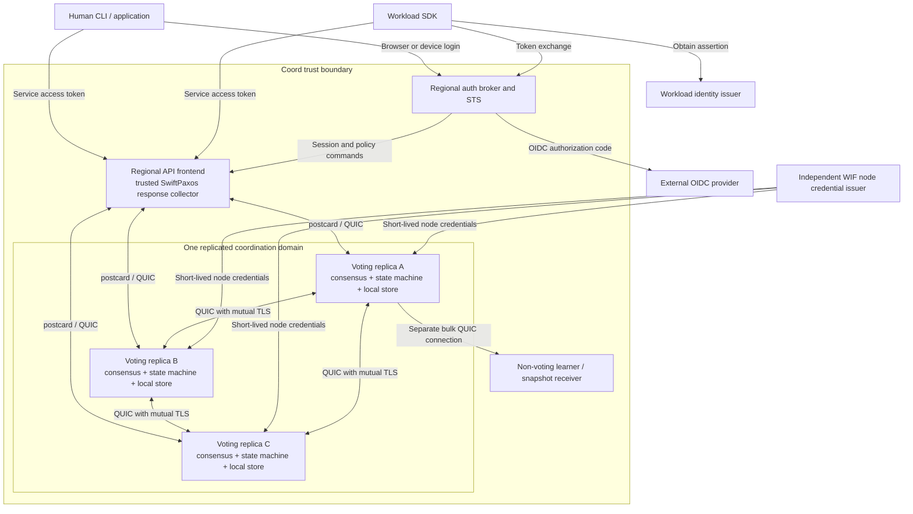
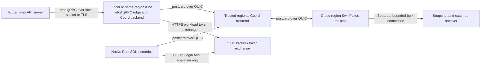
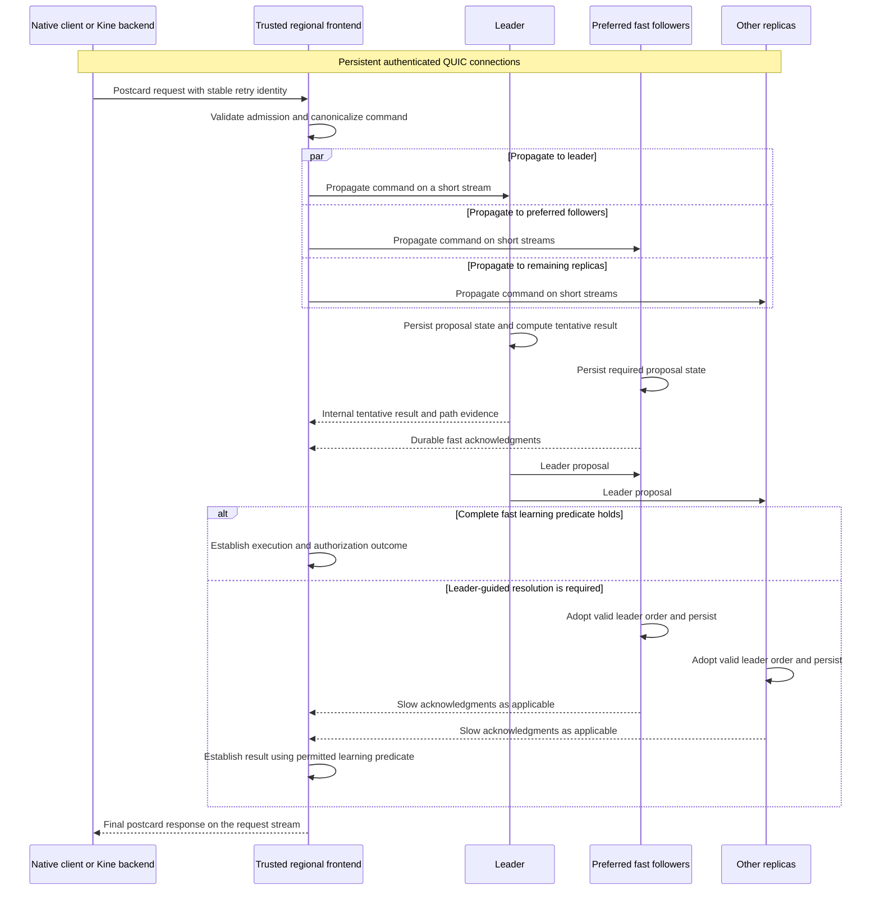
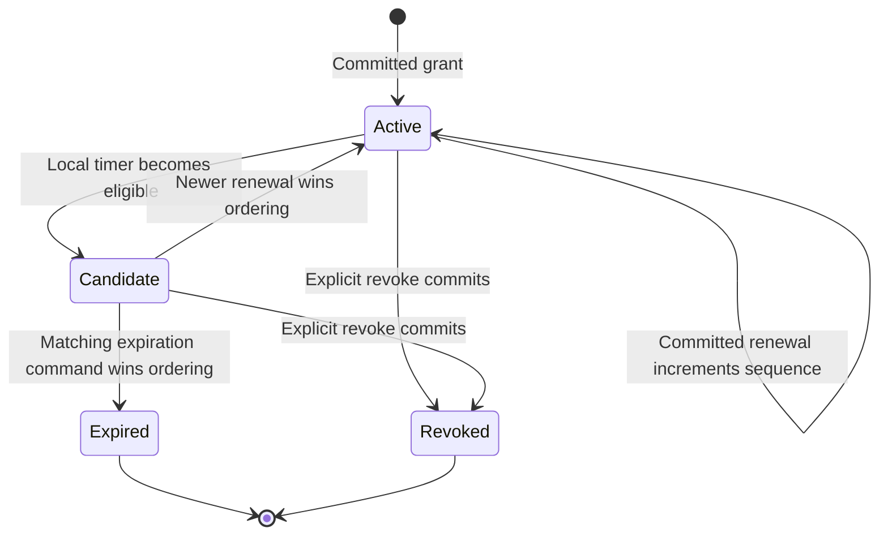
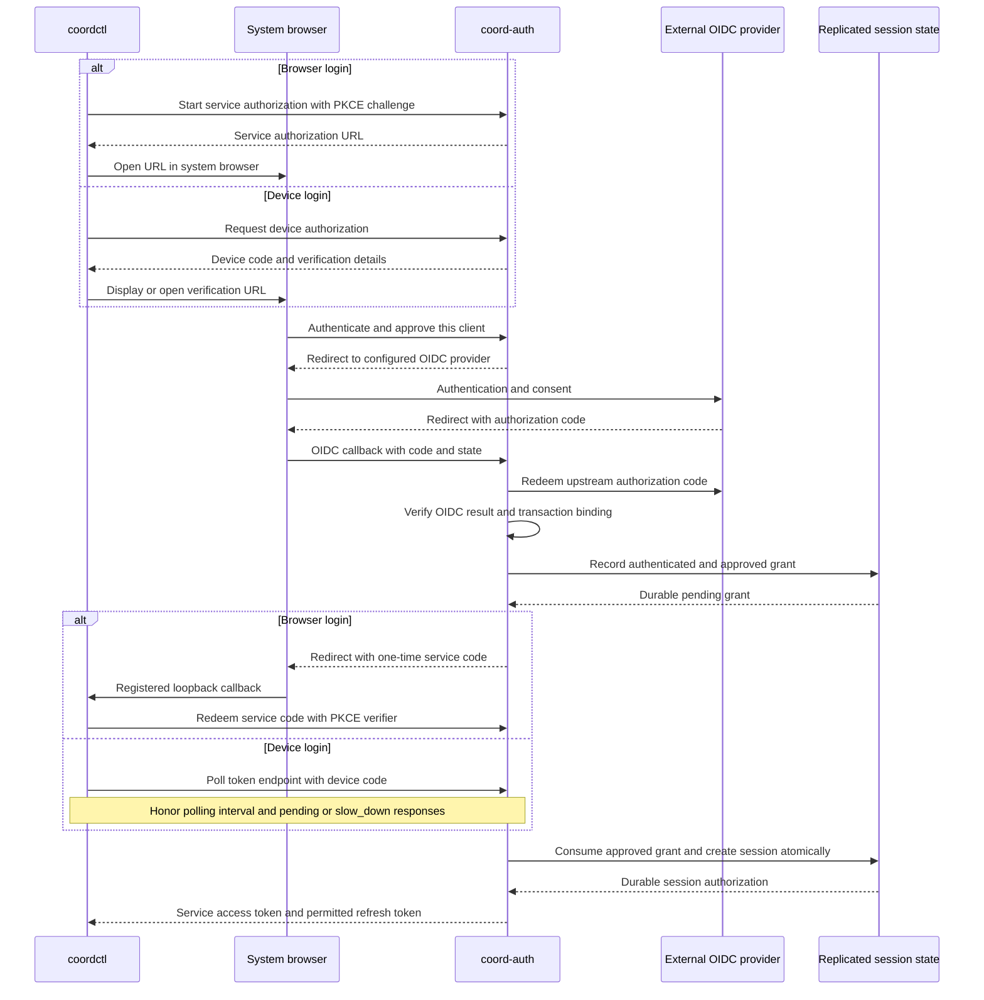
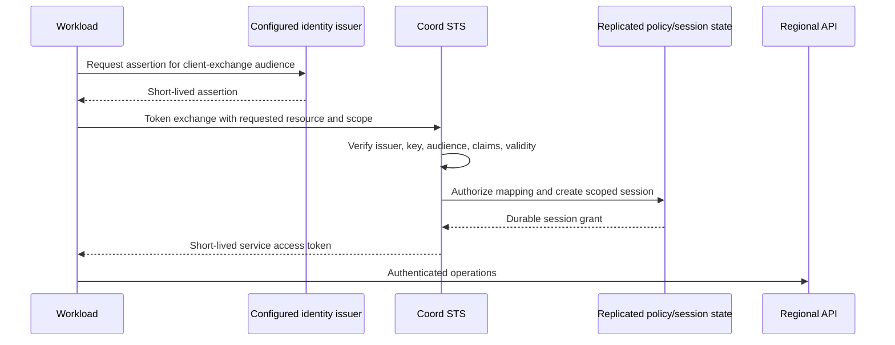
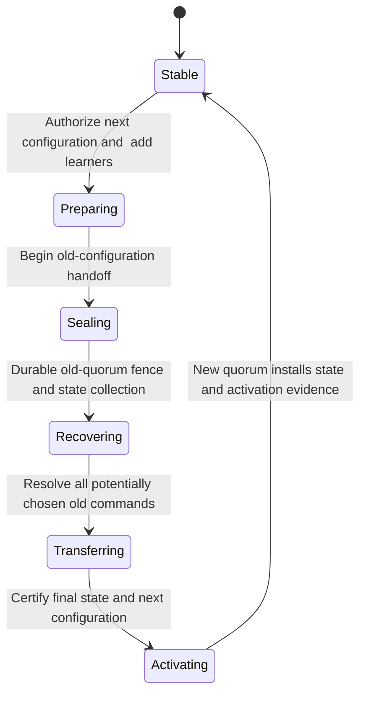
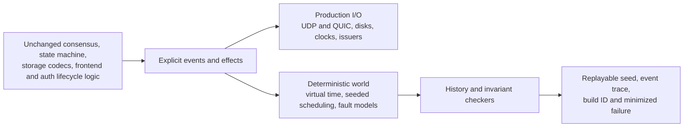
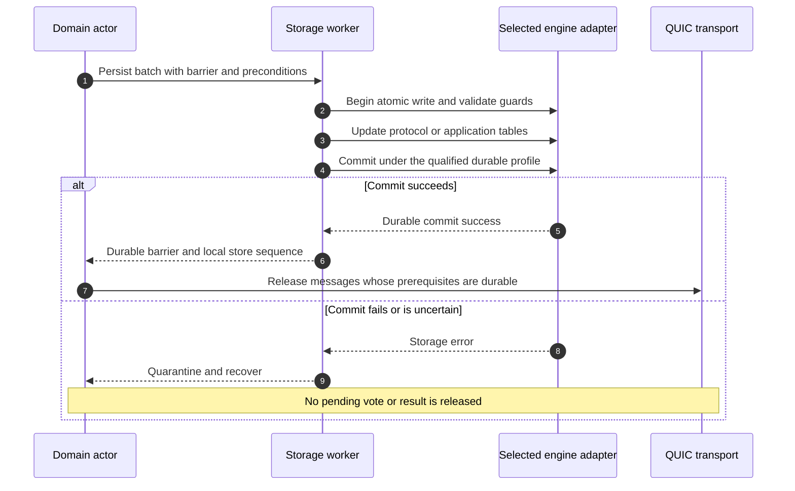
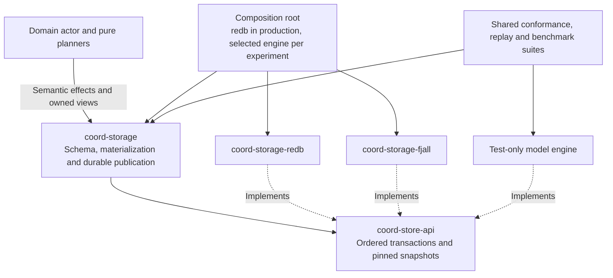

# A Rust Multi-Region Coordination Service

## SwiftPaxos, postcard over QUIC, Kine integration, deterministic simulation, and federated identity

**Status:** Implementation design for review, version 0.5\
**Date:** 2026-09-12\
**Working name:** `Coord` (a placeholder, not a selected product name)\
**Implementation language:** Rust 2024; selected crate versions and features in Section 16\
**Native transport:** Versioned postcard messages over QUIC streams; no gRPC, protobuf, or HTTP on the native data or consensus path.\
**Compatibility target:** A pinned Kine backend integration for Kubernetes storage; etcd v3.6 semantics are a reference for selected behavior, not a promise of complete etcd compatibility.\
**Revision scope:** One ordered revision history per coordination domain, normally one Kine-backed Kubernetes cluster. No service-wide revision counter across independent domains.

> **Decision summary:** Build a native Rust coordination service with persistent QUIC connections and compact postcard messages. Use SwiftPaxos C2 with trusted regional response collectors and preserve durability before publishing results. Put the etcd wire protocol exclusively at a local/regional Kine compatibility edge. Integrate directly with Kine's backend interface, not through a SQL emulation layer. Preserve ordered revisions within each compatibility domain without imposing an order across unrelated deployments. Optimize round trips, queueing, serialization, and bulk-traffic isolation without weakening consistency, lease fencing, or authentication.

**Review navigation:** Sections 1-15 retain the approved protocol/API/security contract. Sections 16-23 define the implementation. For this revision, start with **Sections 17.8-17.14**, especially the experiment fixtures and run lifecycle in 17.12-17.13. The separate [70-task PR plan v1.2](global-coordination-rust-pr-plan-v1.2.md) preserves PR-01 through PR-66 and retains only PR-S01 through PR-S04. S01/S02 establish the shared boundary; S03/S04 deliver the experimental adapter and performance comparison without blocking the redb release.

**Changes from v0.4:** narrow storage replaceability to **performance experimentation and analysis**, not operational engine switching. Remove full local replica images, cross-engine conversion, source/target activation and rollback tooling, mixed-engine rollout qualification, and the extra production-support gate. Populate fresh independent databases from identical logical workload fixtures; compare the same shared storage implementation at equivalent durability and resource budgets. redb remains the production baseline. Normal same-engine crash recovery, learner checkpoints, schema upgrades, membership changes and disaster recovery retain their original requirements. No adapter, benchmark result or migration implementation is claimed by this design.

This document distinguishes a source protocol from proposed engineering extensions. It is a design to implement and validate, not a claim that the crash-recovery, checkpointing, or membership extensions have already been proved or benchmarked.

## 1. Goals, scope, and assumptions

The service provides small, security-sensitive coordination state across regions: configuration, compare-and-swap, ownership records, distributed locks, service registrations, renewable leases, and a Kine-backed Kubernetes storage profile. Availability requires a quorum; an isolated minority must not acknowledge new mutations or claim to serve fresh reads.

The first implementation contains KV range operations, atomic transactions, revisions, watches, compaction, lease grant/renew/revoke/expiration, federated human and workload sessions, and authenticated replica communication. A single Rust state machine and consensus implementation run under both production I/O and deterministic simulation.

### 1.1 Explicit non-goals

The initial service is not a bulk database, a Byzantine-fault-tolerant system, a multi-master eventually consistent store, or a wire-compatible implementation of every etcd API. Kubernetes storage through a tested Kine adapter is in scope; unmodified Kubernetes clients do not speak the native QUIC protocol directly. It does not promise region-local writes during partitions, lossless recovery after destruction of a quorum's durable state, or exact wall-clock lease expiration during outages. Cross-group transactions and transparent sharding are deferred. Storage-engine migration, live hot swapping, authoritative dual writes, and mixed-engine production deployments are not deliverables of the storage refactor. Alternative engines are selected for independent disposable experiment runs; they need not read or convert an existing engine's database.

### 1.2 Fault and trust model

| Area | Assumption and resulting contract |
|---|---|
| Consensus | Crash/recovery failures; delayed, lost, duplicated, and reordered messages; eventual synchrony for progress. |
| Durability | A successful durability barrier survives process/OS restart under the storage contract. Detected corruption causes quarantine, not invented state. Storage that acknowledges durability and then loses it is outside the ordinary failure model. |
| Deployment | Failure budgets count voting replicas, not region names. Gateways and non-voting learners do not increase quorum resilience. |
| Security | External clients and networks are untrusted. Voting nodes, trusted frontends, identity validators, and their signing authorities are within the trusted computing base. |
| Time | Consensus safety does not depend on synchronized clocks. Authentication and real-time lease guarantees have separately stated clock assumptions. |
| Identity | WIF establishes an identity under configured issuer trust. It does not establish software integrity, exclusive possession of a voter identity, or permission to vote. |

A compromised authorized voter is outside the SwiftPaxos crash-fault model. Rust memory safety, mTLS, WIF, and short-lived credentials reduce particular risks; none changes that model.

## 2. Compatibility domains rather than a service-wide revision

### 2.1 What Kine compatibility does and does not require

Kine implements a Kubernetes-oriented subset of the etcd API and translates supported transactions into backend operations. Its backend exposes revisioned reads, conditional create/update/delete, watches, current revision, and compaction. It does not require that the backend speak gRPC or SQL. [S19, S20, S21]

**Proposal: use one ordered coordination domain per Kine-backed Kubernetes cluster.** A domain is the boundary for atomic transactions, MVCC revisions, compaction, watch resumption, leases, and authorization state. Independent domains have independent revision histories. The first deployment serves one domain; operators can deploy more independent domains without a fleet-wide sequencer. Hosting multiple isolated groups in one process is a later resource-isolation feature, not a prerequisite for the adapter.

The selected etcd semantics assign an increasing KV revision to each mutating operation, including a transaction affecting multiple keys. [S3] The Kine integration retains a consistent scalar revision and replayable watch history within its domain. An adapter must not invent revisions locally, allocate independent regional counters, or sort already-acknowledged writes by wall time. Those approaches would not establish safe revisioned reads, compare-and-swap, or watch progress.

### 2.2 Ordering cost and optimization boundary

Start with conservative conflict detection: every replicated command in a domain conflicts with every other replicated command in that domain. This is a reference implementation and safe baseline, **not a claim that unrelated keys are fundamentally dependent in every possible native API**.

Within the compatibility domain, two KV writes still interact through their returned revisions and the MVCC/watch history. Moving that allocation to Kine would merely move the ordering problem. There is no additional revision-allocation round trip: allocation is part of deterministic application of the established SwiftPaxos command.

Optimize against this baseline with single-command conditional updates, pipelining, bounded batching, and later certified read barriers. A finer conflict predicate needs to account for revision metadata, ranges, lease attachments, authorization, and deduplication state. A future revision-free native profile may expose per-object versions and dependency-aware cursors, but must have an explicit different contract. Do not claim it can be mapped transparently into one Kine revision history without additional coordination.

SwiftPaxos's fast-path rate must therefore be measured with concurrent disjoint-key writers as well as hot keys. Low key overlap alone does not imply low ordering contention. QUIC stream independence removes transport ordering constraints; it does not remove application dependencies.

### 2.3 Identities and counters

| Identifier or counter | Meaning |
|---|---|
| Cluster/restore identity | Distinguishes a live deployment from a restored history. |
| Domain ID | Revision, transaction, watch, lease, and authorization namespace. Bound into every command and retry identity. |
| Execution position | Position in the established command history for the initial total-order domain; includes reads and internal commands. Never speculative receipt order. |
| KV revision | Increases once when a command actually mutates KV in that domain. All its mutations share the revision. |
| Configuration epoch | Voting configuration and identity bindings; a leadership ballot is subordinate to it. |

No transaction, native lease, watch, or fencing sequence spans independent domains in v1. Identical numeric revisions in different domains are not comparable. Domain-local sessions avoid adding an extra cross-domain authorization transaction to every request. An external identity provider may be shared, but its brokers submit admission and policy changes to the relevant domain.

## 3. Architecture and trust boundaries



Each voting deployment initially includes a frontend and an auth broker. Additional trusted frontends may be deployed close to clients without adding voters. A frontend fans requests out to replicas; it is not simply a proxy that always forwards to the leader.

**The public API never exposes tentative execution results.** SwiftPaxos's response collector is a trusted service component, not an untrusted user's SDK. A tentative read result can disclose data even when a client is told not to use it. Similarly, an authorization grant that exists only in a speculative state must not release protected data or credentials.

The SDK therefore speaks the authenticated native postcard-over-QUIC API to a nearby frontend. The frontend releases a result only after the required protocol evidence establishes the corresponding execution and authorization outcome. The extra frontend-to-client leg is included in end-to-end latency measurements.

### 3.1 Transport and compatibility boundaries



The cross-region service path has no HTTP/2, gRPC, SQL polling, or mandatory JSON translation. Kine performs etcd protobuf conversion at the compatibility boundary only. Place it next to each API server or in the same region; putting it in a distant region would add an avoidable WAN hop.

OIDC, browser callbacks, device authorization, discovery, JWKS retrieval, and RFC 8693 exchange retain their standard HTTPS interfaces. They are credential-establishment traffic, not the per-operation data path. Native authentication must not require an extra global round trip before each already-authenticated KV operation.

See Section 6.6 for the backend contract and Sections 11.1-11.7 for the wire protocol, flow control, and QUIC security profile.

## 4. SwiftPaxos integration

### 4.1 Normative protocol baseline

Implement the normal-operation, response-learning, and recovery rules in the SwiftPaxos paper; maintain a traceability table from its handlers to Rust transitions and tests. The published implementation is a useful prototype reference, not a production specification. [S1, S2]

The source protocol has a leader per ballot. Every fast and slow quorum includes that leader. Slow quorums are majorities; any two fast quorums must intersect in a majority. Its C1 configuration uses more than three quarters of replicas; C2 uses one fixed majority. Fast response learning considers dependency paths, not merely matching direct dependency sets. Recovery must preserve potentially chosen commands, including relevant preaccepted state. Membership-change details are outside the paper. [S1]

### 4.2 Quorum policy

Use **C2 by default**. For each ballot, configure exactly one preferred fast quorum containing the leader. The complete choice is immutable within the ballot. Changing that choice requires a higher ballot and recovery, even when the leader process remains the same.

| Voting replicas | Slow quorum size | C2 fixed fast quorum size | C1 alternative size |
|---|---:|---:|---:|
| 3 | 2 | 2 | 3 |
| 5 | 3 | 3 | 4 |
| 7 | 4 | 4 | 6 |

These sizes follow directly from the inequalities above. **An arbitrary majority on each request is not C2.** With five replicas, two independently selected three-member sets can intersect in only one member, which is insufficient for the fast-quorum condition.

A missing C2 member disables that ballot's fast path, not necessarily the service. Continue using a valid slow quorum; change ballots when appropriate. Leader failure requires leadership recovery.

Support two initial deployment profiles: three voters, one per region; or five voters across three regions in a 2-2-1 layout. In the latter, any single-region loss removes at most two voters, leaving a majority. This is a replica-count argument, not a guarantee against correlated provider, identity-service, or network failures.

For the initial implementation, use an operator-configured quorum table indexed by configuration and leader. Use latency measurements to select that table before activation, not to let each replica make a different online choice. Retain the exact historical quorum definitions needed by recovery. Changing the table activates a new version through the appropriate recovery/configuration procedure; it never changes an existing ballot retroactively.

### 4.3 Request and result flow



This is an explanatory protocol flow, not replacement pseudocode. Replica acknowledgment broadcasts, dependency processing, and source-protocol prerequisite ordering remain required. Stream creation on an established connection is not an application-level handshake; do not add a request/accept exchange before each protocol message.

Every piece of evidence is bound to cluster, domain, configuration epoch, ballot, command identity, and relevant order information. Never combine ballots or count a replica twice. A process that is both a frontend and a voter still contributes one vote.

Dependency-order guards are explicit in Rust. Messages on different QUIC streams and connections can arrive independently. Keep leader-message processing blocked until the source protocol's prerequisites hold; do not infer semantic order from stream IDs or arrival order. Use bounded dependency queues and request missing prerequisites without blocking unrelated socket processing.

A QUIC transport ACK only acknowledges transport receipt. It is **not** a SwiftPaxos acknowledgment, a durability barrier, an authorization result, or permission to return success. Transport replacement leaves the source learning predicate unchanged.

### 4.4 Command identity and malicious clients

External clients do not supply executable protocol messages or trusted dependency metadata. A frontend validates limits and canonicalizes requests before submission.

Use two identities:

```text
retry_key  = (cluster_id, domain_id, session_id, client_instance_id, request_sequence)
command_id = H(protocol_domain, retry_key, canonical_operation)
```

The canonical operation includes domain, tenant, operation type, keys, values, comparisons, and semantic flags. Transport tokens, connection IDs, stream IDs, and frame boundaries are not part of logical operation identity. Define a stable logical-command schema encoded with postcard and frozen enum/field layouts. Normalize unordered collections before encoding. Postcard serialization alone does not make arbitrary Rust values canonical or schema-evolvable; see Section 11.2. A wire-version change must not silently change the identity of an outstanding retry.

Allocate nondeterministic IDs and other command inputs once at the trusted boundary, or derive them from the stable request identity. Every replica and every retry must obtain the same lease IDs, session outcomes, and response values; replay must not generate new randomness.

Different payloads under one retry key become different consensus commands, but the state machine accepts at most the first payload and rejects later mismatches with `RequestIdentityConflict`. This prevents an untrusted client from causing different replicas to interpret one protocol command identifier as different payloads. Hash collision resistance is an explicit assumption.

### 4.5 Speculation and side effects

Tentative execution uses a copy-on-write overlay over committed application state. It may compute response values, candidate revisions, and authorization results. It must not publish watch events, sign usable sessions, issue node credentials, invoke external services, or modify the committed database.

A rejected or superseded speculative order discards the overlay. An accepted result must be reproducible from the recovered durable history. Operations with large tentative results may use the normal committed-execution response path instead; report that latency separately.

### 4.6 Performance claims to test

The paper reports two message delays without contention and three otherwise under its model. [S1] Our service adds persistence, authorization, queueing, execution, and frontend delivery; these are not zero-cost details.

Measure leader-result arrival and each acknowledgment arrival separately. Fast completion is constrained by the slowest required evidence, not by an arbitrary nearest-region RTT. Slow completion includes leader-guided propagation and the necessary durability barriers. Authentication refresh is outside the steady-state operation path.

Keep the minimum latency budget explicit: on warm connections, native client latency consists of the client/frontend leg, admission/queueing, the actual required SwiftPaxos propagation and evidence paths with durability, and final response delivery. Cold connection and credential-establishment costs are measured separately. Never add a sequential region-to-leader RPC in front of the frontend's protocol fanout.

QUIC is selected to avoid cross-stream transport head-of-line blocking and support compact independent exchanges, not because it is proven fastest for every network. Its streams still share congestion control and connection-level flow control; a small payload encoding does not shorten WAN propagation. [S13, S18] Validate p99/p99.9 under loss, burst traffic, CPU saturation, and concurrent snapshots rather than promising that jitter disappears.

Benchmark against both a comparably durable Raft/Multi-Paxos service and an all-to-all Paxos baseline. The second comparison helps distinguish SwiftPaxos's contribution from the benefit of broadcasting acknowledgments to the result collector.

## 5. Durable state, recovery, and bounded storage

### 5.1 Persistence-before-publication

Model disk completion as an input event. Emitting a message is not sufficient evidence that the state supporting that message is durable.

| Publication | State that must already satisfy its durability requirements |
|---|---|
| New-ballot promise or recovery reply | Promised ballot and the recovery state being reported. |
| Fast acknowledgment | Command payload, vote, order/path evidence, and the stable dependencies on which that evidence relies. |
| Leader reply used as learning evidence | The leader's corresponding recoverable proposal and payload state. |
| Slow acknowledgment | Adoption of the leader's proposal and the prerequisite acceptance state. |
| Application result after committed execution | Recoverable command history and atomic application/deduplication outcome, either materialized or deterministically replayable. |
| Checkpoint readiness | The complete validated checkpoint and its recovery-floor metadata. |

The exact persistence mapping is a **crash-recovery extension to validate**, not a claim that a crash-stop proof automatically covers disk failures. Model crashes immediately before and after every barrier and publication.

A process may lose all volatile commit notifications after a result was delivered. Recovery still has to reconstruct that result from durable votes and payloads. It must not assume that a `COMMIT` marker reached a quorum before the frontend answered.

### 5.2 Storage layout

Use one selected transactional database per local domain instance as the authority for protocol records, MVCC data, leases, policy, sessions, retries and checkpoint metadata. redb is the default; Fjall is an optional separately qualified adapter. There is no second authoritative engine or custom WAL requiring cross-engine atomicity. A shared bounded blocking worker validates and commits updates through `commit_durable` before releasing dependent barriers. Sections 16-17 define the common contract and adapter-specific durability profiles. [I1-I4, I22-I24]

Persist cluster/configuration identity, promised and recovered ballot state, unresolved proposals and dependencies, application state, lease generations, active sessions, retry results/floors, policy versions, and compaction metadata. Rebuild volatile timers, network connections and speculative overlays after restart. The application implements etcd-style historical revisions explicitly; an engine's concurrent-reader snapshots alone do not provide that API.

Recovery opens the existing database, validates identities and format, reconstructs protocol state, completes protocol recovery and reconciles atomic application outcomes before ordinary service. A missing/corrupt database cannot be silently recreated under the old voter identity. Logical snapshots are canonically encoded, verified and installed into a new database generation; node-local voting obligations are not discarded by restoring an application image.

### 5.3 Checkpoints and garbage collection

KV history compaction and consensus garbage collection are different operations. Removing old MVCC versions does not authorize deletion of acceptance records needed by recovery.

The first correctness milestone permits consensus trimming only after **all configured voters** durably acknowledge the same checkpoint and recovery floor. This conservative baseline allows an unavailable voter to delay trimming. It therefore needs a hard protocol-storage budget and backpressure; it is not the final availability target.

The production target is quorum-certified checkpoint installation. A certificate identifies a configuration, executed prefix, state hash, format version, and recovery floor. Its signers must durably retain the checkpoint before certifying it. Recovery must discover and honor the highest applicable certified floor, and obtain the corresponding state before voting. A lagging node cannot acknowledge from a discarded history baseline.

This target requires a modeled checkpoint-activation protocol, not just copying a snapshot to three nodes. In particular, prove that every permitted recovery intersects sufficient checkpoint information and that delayed pre-checkpoint messages cannot resurrect discarded history. Retain outstanding post-checkpoint protocol records and unresolved retry outcomes.

A checkpoint is not a wall-clock timestamp and is not a license to discard unknown commands. Dependency/path compression and checkpoint anchors must preserve the exact learning and recovery predicates. Bound outstanding commands, bytes, and speculative work; reject or defer new work rather than evicting unresolved protocol state.

### 5.4 State loss and disaster recovery

A voter with lost or rolled-back storage must not return under its old identity as an empty voter. Reintroduce it as a learner with a new authorized generation through the membership procedure. An expired certificate or fresh WIF assertion does not erase old voting obligations.

Ordinary recovery preserves the cluster identity and every acknowledged result within the fault budget. Disaster recovery from a backup is a separate operation: use a new cluster/restore identity, invalidate old sessions, revoke restored leases, and require watch resynchronization. It may have an RPO determined by the backup. Never silently present a rewound revision history under the original identity.

## 6. KV, transaction, watch, and retry semantics

### 6.1 Public API

Use a native `coord.v1` postcard-over-QUIC API, a Rust SDK, and `coordctl`. API names below identify typed commands, not gRPC services. Implement the Kubernetes compatibility profile as a Kine backend that speaks this native protocol. Do not implement a parallel Rust etcd gRPC server as a v1 requirement.

Every public operation identifies one domain. Kine binds its endpoint to exactly one domain and must not merge revisions from multiple domains. Native clients may use richer transactions and full lease APIs even where Kine's frontend does not expose them.

| API | Proposed contract |
|---|---|
| `Range` | Exact key or half-open range; latest linearizable read by default; explicit historical revision; bounded pagination. |
| `Put` | Create/update, optional previous value, optional lease attachment; update create/mod revision and version consistently. |
| `DeleteRange` | Atomically remove matching keys within configured limits; optionally return previous values. |
| `Txn` | Compare version, create/mod revision, value, or lease; execute exactly one ordered success/failure branch atomically. |
| `Watch` | Resume by revision, ordered events, atomic revision batches, explicit compaction and slow-consumer errors. |
| `Compact` | Advance the logical MVCC retention floor; reclaim physical storage asynchronously. |
| `LeaseGrant`, `LeaseKeepAlive`, `LeaseRevoke`, `LeaseTimeToLive` | Contracts in Section 7. |
| Session, identity, and membership APIs | Explicit native services; not approximated through etcd username/password authentication. |

The initial transaction subset excludes nested transactions and multiple writes to the same key within one transaction. Unsupported requests return a specific error, never a silently changed interpretation. The selected etcd API documentation is the compatibility reference for supported field behavior. [S4]

### 6.2 Atomic application and revisions

Evaluate comparisons against one state snapshot. Validate the selected branch, permissions, quotas, and lease bindings before applying anything. A successful branch that mutates KV receives one new revision; a read-only branch does not. An ordinary `Put`, including a same-value put, is a mutation. A delete that finds no keys is not.

Lease administration without KV changes, read commands, and policy/session operations advance execution history but not the public KV revision. Revoking or expiring a lease that deletes keys produces one KV revision for the entire deletion set.

Store `{key, value, create_revision, mod_revision, version, lease_id, lease_generation}`. Resolve lease membership from deterministic state, including detach/rebind operations, rather than from a frontend's cached list.

### 6.3 Reads and pagination

Initially, the full linearizable read is an ordered command. Do not use a local leader flag, a successful heartbeat, or the application lease subsystem as a read-safety shortcut.

A later read-barrier optimization must identify a certified execution frontier and ensure that the serving replica has applied it. Authorization must also be valid at the operation's ordering point.

Historical pages use one fixed revision. The client carries that revision across pages, rather than mixing snapshots while data changes. A future revision is an error or an explicitly bounded wait; an unavailable compacted revision returns `Compacted`.

An opt-in stale-data read must be labeled as such. **Stale data does not imply stale authorization.** The initial secure implementation still obtains a fresh authorization barrier for such reads, so it does not promise an entirely local stale-read path.

### 6.4 Watches

Publish events only from irrevocable application results, never speculative overlays. Retain complete logical revisions, including their deterministic within-revision order. Resume at the next required revision and handle inclusive/exclusive cursor conventions consistently.

A watch progress notification means the stream has delivered every relevant event through the indicated revision. It is not evidence that the replica is current with the cluster. Watch delivery is not itself a linearizable read. [S3]

Use bounded buffers. If a consumer cannot keep up, close with an explicit resumption requirement. Do not silently skip changes. For the initial API, enforce atomic-event size limits so one revision fits its supported logical watch batch; do not expose half a lease revocation as a completed revision.

The strict authorization profile authorizes each output batch against an ordered authorization barrier. Share a barrier only among batches already selected for that check; never treat an old barrier as an indefinite authorization lease. This prevents an isolated frontend from continuing to make new authorization decisions from stale policy. Previously authorized bytes may still arrive after a revocation because the network cannot recall them.

### 6.5 Retries and ambiguous results

The SDK persists its session/client-instance identity and request sequence while retrying. It reuses the same retry key and payload after transport failure. Return the same stored logical result, not a second execution, provided the caller is still authorized to retrieve it. Reauthorize result retrieval and `ResolveRequest`; a permission failure does not undo an earlier successful operation.

Track an acknowledgment floor plus a bounded set of outstanding results to support concurrent requests. A client may advance its floor only after it has received all results through that sequence. Requests at or below a retired floor are rejected as too old, never treated as new work.

Session identifiers are never reused. Once a session is closed and its deduplication state is reclaimed, an old request cannot recreate that session. Unknown sessions fail closed.

A timeout means **outcome unknown**, not aborted. Provide `ResolveRequest` while its result is retained. The Kine adapter assigns one native retry identity per backend invocation and preserves it through transport retries. It cannot identify an API server's new RPC as the same original call after an adapter crash without an upstream stable identifier or persisted mapping. Do not claim native exactly-once retry behavior across that boundary; conditional operations and revision checks remain essential.

### 6.6 Kine backend: direct integration, not SQL emulation

**Source pin inspected for this revision:** `k3s-io/kine@746ef418669e2131e1d4447024ac7489ee2bb5d0`. Use this as the reviewed interface baseline, not a claim that it is a released or certified compatibility version. Select and pin the production Kine/Kubernetes versions in CI. Kine's driver factory returns a `server.Backend`; implement that interface directly and register a proposed `coord://` driver. This requires a Kine build containing the adapter, not merely changing the DSN of an unmodified binary. [S20, S21]

The small Go adapter uses a native QUIC client and the project's versioned postcard schema. A Go implementation such as quic-go supplies streams; postcard interoperability requires a generated or explicitly implemented **restricted wire-schema codec**, not a claim that arbitrary Serde derives can be read automatically in Go. Rust encoding is normative and cross-language byte vectors are a release gate. Keep the consensus engine, storage, and authentication service in Rust. [S17, S26]

| Kine `server.Backend` surface | Native implementation and required behavior |
|---|---|
| `Start` | Connect, verify the configured domain and capabilities, establish WIF credentials, start watch/catch-up machinery, and perform any required health-key initialization idempotently. No voting admission. |
| `Get`, `List`, `Count` | One revisioned read command with exact/range, limit, historical revision, and keys-only semantics. Return data and its safe response revision together; do not follow every response with a separate `CurrentRevision` WAN call. |
| `Create` | One create-if-absent command. Allocate the domain revision and any TTL attachment atomically. Return the documented duplicate-key result. |
| `Update` | One compare-mod-revision-and-update command, including optional TTL replacement. Return the backend's success/mismatch fields and KV metadata from the same ordering point, not a remote pre-read followed by a write. |
| `Delete` | One conditional delete command, preserving the pinned interface's zero-revision, absent-key, and mismatch cases. Do not collapse these distinguishable outcomes into an unrelated generic error. |
| `Watch` | Native push stream with atomic replay-to-live handoff, start-revision rules, range filtering, previous values, current/compacted revisions, and explicit errors. No SQL polling loop. |
| `CurrentRevision`, `WaitForSyncTo` | A certified domain frontier plus synchronization of the adapter's watch/replay pipeline through that frontier. Never report progress past missing events. Honor the pinned method signatures and use adapter lifetime cancellation where no call context is provided. |
| `Compact` | Native MVCC retention operation and the pinned bridge's compaction metadata behavior. Preserve events needed for in-flight resumptions or terminate those watches explicitly. This is not consensus-record GC. |
| `DbSize` | Documented domain storage accounting, not a fabricated SQL database size or unrelated whole-host metric. |

The detailed behavioral tests must follow the pinned server handlers as well as interface signatures: metadata, nil versus existing KV, error translation, current versus historical revisions, health keys, and synthetic compaction-key behavior are observable. The interface is a porting surface, not a complete compatibility specification. [S20, S23, S24]

#### Kine TTL is not a native lease ID

At the inspected pin, `LeaseGrant` returns the requested TTL as the apparent lease ID. Keepalive, revoke, time-to-live, and lease enumeration are unsupported. The ordinary log-structured backend starts a separate TTL worker. These are Kine-specific semantics, not full etcd lease behavior. [S22, S23]

The direct Coord backend interprets the incoming Kine `lease` field as `ttl_seconds`. For a positive TTL, an atomic create/update command creates or replaces a **private per-key expiry binding** using the native replicated expiration machinery. Its hidden ID is derived from the stable request identity. Return the original Kine-facing TTL value in compatibility metadata, not the hidden native ID. A TTL of zero removes the old compatibility expiry binding.

Do not attach every key with TTL 60 to native lease ID 60: that would conflate unrelated ownership episodes. The native timer proposes a conditional expiration using the binding generation and the key's expected mod revision; replacing the key or refreshing its TTL invalidates the old candidate. Failover uses the conservative rearming contract in Section 7. No local Kine timer directly deletes unconditionally, and no extra lease-grant WAN round trip is needed before a put.

Keep full native grant/renew/revoke operations available to native clients. Exposing those through an expanded etcd frontend is a separate feature, not necessary for the selected Kine profile.

#### Revision and watch correctness across the adapter

A Kine revision is a domain revision, not an adapter sequence. All adapter instances see the same history. An initial list and subsequent watch must admit a no-gap transition under concurrent writes, reconnect, compaction, and failover. Watch progress must not outrun the native replay frontier or events queued in the adapter. Native push does not make progress-marker handling automatic; verify the pinned Kine watch bridge and patch it where necessary rather than falsely advertising support. [S24]

Reserve the backend domain for one Kubernetes storage installation. Application access must not bypass its schema/authorization assumptions or insert incompatible values into its reserved keyspace. The Kine workload receives a domain-scoped WIF principal; it does not forward arbitrary Kubernetes end-user identities into Coord. Kubernetes authorization remains the API server's responsibility.

#### Compatibility release gate

Run the pinned Kine adapter with a real Kubernetes API server and exercise create/update/delete races, stale resource-version conflicts, list pagination, list-then-watch, progress requests, compaction, event TTLs, watch-cache restart, adapter restart, QUIC reconnection, regional outage, and disaster restore. Differential-test the selected operation subset against the pinned etcd/Kine baselines, documenting intentional differences. Kubernetes leader-election objects are ordinary stored API objects; do not confuse them with support for etcd's lease or lock APIs.

Certify the actual supported combination and publish its limits. "Adaptable through Kine" is an implementation and conformance deliverable, not a blanket etcd replacement claim.

## 7. Leases, expiration, and fencing

### 7.1 Replicated lease model

A lease contains an ID, generation, owner principal, granted TTL, renewal sequence, and attached-key accounting. Lease IDs/generations are not recycled into a new ownership episode.

`LeaseKeepAlive` is a replicated renewal, not a leader-local promise. A successful response means the renewal is durable under the same fault model as a KV write. Batch renewals to amortize protocol work, but release each response only after its batch is established. Retransmitting one keepalive request must not create repeated extensions.

A native lease's owner is a principal, not a QUIC connection, stream, or short-lived access token. Kine's per-key TTL bindings are the separate compatibility mapping in Section 6.6. A newly authenticated session for the authorized principal may renew it. Logging out does not implicitly delete every lease owned by that principal; explicit revocation or inability to renew produces the intended lifecycle.

### 7.2 Time and expiration authority

Use the recovered leader as the expiration scheduler, with a replicated `LeaseAuthorityEpoch`. Timers are local scheduling aids. The state machine deletes nothing merely because a timer fired.

After recovery, establish a new authority epoch and conservatively arm every surviving lease for a full granted TTL from the new leader's observation of the recovered state. After observing a newly committed renewal, rearm that lease from the observation point. This deliberately permits late expiration and avoids pretending that an old process's monotonic timestamp is meaningful on another machine.

Assume a monotonic clock with a documented maximum fast-rate error `rho`. To ensure at least `TTL` real seconds have elapsed after a timer anchor, wait for at least `(1 + rho) * TTL` local clock units. The anchor is no earlier than the observed committed grant/renewal, so this construction is conservative. Observed clock anomalies suspend expiration and force conservative rearming; arbitrary undetectable clock violations remain outside the real-time guarantee.

The TTL guarantee is anchored to the operation's linearization, **not receipt of a delayed response**. Clients must not assume that a reply gives them a fresh full TTL starting at arrival.

### 7.3 Expiration command

The scheduler proposes:

```text
ExpireLease(lease_id, lease_generation, expected_renewal_sequence,
            lease_authority_epoch)
```

Apply expiration only if every expected field still matches. A renewal ordered first makes the stale expiration a no-op. Expiration ordered first makes a subsequent renewal return `LeaseNotFound`. An old leader's authority epoch is rejected after a new epoch is established.

No quorum means no committed expiration and no successful renewal. Once the service recovers, expiration may be delayed by the conservative rearming interval. This availability/safety trade-off is part of the API contract.

`LeaseTimeToLive` obtains lease existence, generation, and granted TTL through the ordered state machine. Any remaining-TTL field is a separately labeled scheduler estimate, with authority epoch and observation context; it is not replicated state or proof of continued ownership. It may be unavailable or increase after conservative failover rearming. Never read a local clock inside deterministic execution to manufacture identical remaining-time responses.



Cap both attached-key count and total atomic-deletion/event bytes. Enforce these limits on subsequent updates to attached values as well as initial attachment. Otherwise a lease can grow into a revocation too large to execute atomically.

### 7.4 Locks and external fencing

Implement lock acquisition as a transaction that creates an absent ownership key attached to a lease. Return its creation revision as the fencing sequence within this cluster identity.

A protected external resource must persist the highest accepted fencing sequence and reject older owners. The token is `(cluster_identity, domain_id, acquisition_revision)`; identities from different restored clusters are not ordered by comparing UUIDs. Disaster recovery requires an explicit external fencing-domain transition that rejects the old cluster's tokens.

A lease does not stop a paused process from resuming, terminate an old storage writer, or retract an already-issued external request. Clients should stop initiating protected work when ownership becomes uncertain, and the resource must enforce fencing when stale work would be unsafe.

## 8. Human sessions: OIDC browser and device login

### 8.1 Service-owned authentication boundary

Provide a regional `coord-auth` broker that acts as an OIDC relying party toward configured identity providers and issues service-specific sessions. The CLI is a public client; it does not contain a client secret or obtain administrator access through a static root token.

Use a maintained OIDC/OAuth implementation and interoperability tests rather than custom token parsing or cryptography. Native browser login uses an external system browser and authorization code with PKCE. OIDC supplies the authenticated issuer/subject; OAuth security practices govern code handling and token refresh. [S6, S7, S8]

The broker supports the CLI-facing device authorization grant. Its verification page can authenticate through ordinary upstream OIDC, so upstream providers need not themselves expose a device endpoint. Implement that as the standard device flow, including approval, polling, expiry, and single-use consumption, rather than asking users to paste provider tokens. [S9]



These OAuth/OIDC exchanges use HTTPS, not the native QUIC data protocol. The broker-to-session-store commands use the native internal protocol. This is a logical flow; grant issuance, code consumption, and refresh-token creation must have a single-use, durable state transition before usable credentials are released. Retries must not create multiple unrelated grants.

The CLI-to-broker PKCE transaction and the broker-to-upstream OIDC transaction have separate state, redirects, and code bindings. Do not reuse an upstream authorization code as a service code. Device polling proceeds through the pending states until approval, denial, or expiry; the diagram shows its successful completion. After login, the SDK reuses its credential over native QUIC without browser or token-exchange work on each data request.

### 8.2 Validation and local storage

Pin allowed issuers and client registrations. Validate signature algorithms, issuer, audience, expiration, and the applicable nonce and authorized-party checks. Use transaction-bound state, exact registered redirects, and PKCE S256. Avoid implicit and resource-owner-password flows. [S6, S7]

For browser login, bind the loopback listener to loopback only and validate the expected callback. For device login, display the cluster and requested privileges, rate-limit user-code attempts, honor polling intervals and `slow_down`, and show enough information for the user to recognize the device being authorized. [S8, S9]

Store refresh credentials in the operating-system credential store when available. Redact them from logs, shell history, traces, crash reports, and command-line arguments. Access tokens are short-lived. Refresh tokens rotate with reuse detection and an absolute session lifetime; high-risk administration requires recent authentication under configured IdP policy. [S7]

The broker may need confidential-client authentication to its IdP. Prefer non-exportable signing keys and `private_key_jwt` where supported. Any required IdP client secret belongs only in the broker's protected secret store, never in the CLI or application configuration. Avoiding static client credentials does not eliminate the need to provision trust anchors and IdP registrations.

## 9. Workload identity federation and authorization

### 9.1 Token exchange

Expose an RFC 8693 token-exchange endpoint. A workload obtains an external assertion and exchanges it for a cluster-specific access token. Do not accept arbitrary external JWTs directly at KV endpoints. [S5]



The initial assertion adapters support configured OIDC JWT issuers, including projected Kubernetes service-account tokens and GitHub Actions OIDC. Kubernetes supports audience-bound projected tokens; GitHub supplies claims that can constrain the originating repository and workflow. [S10, S11]

A provider that uses a signed cloud API request rather than an OIDC JWT requires a separate verifier and replay/audience-binding design. Do not advertise every cloud's native instance identity as interchangeable JWT support.

Workload sessions have no long-lived refresh token. Renew by obtaining a fresh assertion and exchanging it. Bound the issued token's lifetime by both service policy and the remaining assertion validity. The SDK handles token-file rotation, expiry-aware caching, single-flight refresh, jitter, and issuer failures. Paths refer to token files, not token contents placed in environment variables.

### 9.2 Trust and permission rules

A federation rule identifies a configured issuer, permitted subject-token type, exact expected audience, required claim predicates, destination principal, resource scope, and maximum session duration. Deny by default.

Human principals use stable `(issuer, subject)` identity, not email address. Workload mappings additionally constrain stable platform identifiers where available. For GitHub, prefer immutable repository/owner IDs and approved workflow/environment conditions rather than a repository name alone. For Kubernetes, bind the intended cluster issuer, namespace/service account, and, for node enrollment, a specific instance identity. [S6, S10, S11]

Policies operate on `{principal, action, namespace, key interval}`. Include the entire requested interval in range authorization. Transactions require permission for comparisons and every operation in the selected branch. Lease attachment, inspection, renewal, and revocation each have defined permissions; attaching a lease must not grant a principal the ability to delete otherwise protected keys indirectly.

Use separate policy actions and token purposes for ordinary KV access, session administration, issuer administration, node enrollment, membership changes, and recovery. Human/API tokens cannot be used as replica credentials. A valid node certificate does not grant access to arbitrary public administration APIs.

### 9.3 Keeping authentication deterministic

External identity validation runs outside the replicated state machine. Discovery, JWKS retrieval, token introspection, randomness, and wall-clock reads are I/O boundaries.

The broker submits a canonical admission receipt containing the verified principal and relevant claims, source issuer/rule version, granted scope ceiling, and a unique receipt identity. It does not write raw bearer tokens into replicated storage. The state machine validates the receipt's trusted origin and evaluates it against current replicated policy before creating a session.

Each session has an immutable principal and scope ceiling. Refresh changes token validity, not the session identity or scope ceiling; downscoping or expanding that ceiling creates a distinct session. Bind commands to this stable authorization context so transport-token rotation cannot change their deterministic interpretation.

Ordinary requests are authenticated at admission using service-issued tokens. Expiration is an admission check, not a wall-clock branch executed independently during replay. In-flight requests admitted while valid may finish later; ordered session or policy revocation can still cause them to fail when their execution order requires it.

Authorization results are evaluated against the state at the command's agreed position, including current session status and policy. Committed policy changes constrain subsequent commands even if a token lists older permissions. A token expresses an upper bound on privilege, not permission to ignore revocation. Store the originating federation rule and generation with each session; disabling that rule invalidates its sessions by default. Normal signing-key rotation is not itself a rule revocation. Disabling an identity at an external issuer is not instantly observable without an explicit revocation integration or a fresh online check.

### 9.4 Issuer and clock failures

Only contact preconfigured issuer/discovery/JWKS locations. Do not fetch arbitrary `jku`, `x5u`, or issuer URLs supplied by an untrusted token. Bound caches and refresh attempts, including unknown-key-ID storms.

Continue using cached trusted verification material only under a documented freshness policy. Unknown keys or unusable verification material fail closed. External issuer outage blocks new federation and renewal after existing credentials expire; it does not require calling the issuer for every ordinary KV operation.

Offline JWT verification does not establish that a Kubernetes bound object still exists. A profile requiring immediate bound-object checking must use TokenReview and accept that availability dependency; otherwise revocation is bounded by token validity and service policy. [S10]

Define a clock-health contract for token validation. Where an uncertainty interval is available, validate against conservative bounds. When validity cannot be established, deny admission. This time dependency is separate from the time-independent consensus safety argument.

## 10. Node WIF, bootstrap, and membership

### 10.1 Credential issuance is not voting admission

Provision an independently available WIF-capable node credential issuer: either an integrated existing issuer or a separately deployed reference node-credential broker sharing the project's verifier library. Treat this as an explicit deployment dependency and M4 deliverable, not an assumed background service. It validates workload identity and proof of possession of a generated node key, then issues a short-lived certificate bound to that identity and intended cluster purpose. This service must be able to operate before the coordination quorum exists.

A consensus peer accepts a QUIC connection for voting traffic only when TLS client/server identity verification, public key/generation, claimed replica ID, and current committed membership binding agree. The node credential is used in the QUIC TLS 1.3 handshake; a node WIF JWT alone is not a peer handshake. A certificate for an eligible workload is not sufficient to become a voter.

Use different audiences and issuance policies for client exchange and node enrollment. Scope node rules narrowly; a shared Kubernetes service account alone must not authorize an arbitrary number of processes to occupy the same voter slot.

For a restarted node with intact storage, the credential can rotate without changing its voting history. For a new node generation or lost storage, use learner admission and the membership procedure. Require proof of possession when changing an authorized key. Never allow two independent disks/processes to vote under one replica identity; orchestration and storage fencing are required because WIF alone cannot prevent cloning.

### 10.2 Genesis bootstrap

Create a signed, immutable genesis manifest containing the cluster ID, initial voter IDs and public-key/generation bindings, node issuer roots, initial WIF rules, initial administrative principal mapping, and protocol/version policy.

Provisioning collects each initial node's key and verified workload identity before finalizing the manifest. Deliver the same manifest to every initial voter through the deployment trust path. Do not use open enrollment, first-request-wins administrator creation, or trust on first use between unknown nodes.

An operator can authorize the provisioning signer through the organization's existing OIDC/cloud identity path; a static API root token is not required. Public trust anchors and an independently protected signing authority are still required.

### 10.3 Membership changes

The first consensus milestone uses a fixed voter set. Learners can receive authenticated snapshots without voting. Automated voting membership changes are a separate production milestone because they must preserve both consensus and identity safety.

Use an explicitly modeled **stop-and-transfer handoff** initially rather than claiming that an ordinary KV transaction or an unmodified Raft joint-consensus procedure solves SwiftPaxos reconfiguration.



Required handoff properties:

1. An old-configuration quorum durably fences further ordinary voting for that configuration across all ballots. Handoff-only recovery remains possible. The fence and state reports must preserve commands whose responses may already have been learned.
2. Recovery resolves all potentially chosen old commands and dependency closure. The final state includes KV, leases, sessions, retry outcomes, and protocol/checkpoint boundaries, not only visible key/value pairs.
3. A unique terminal handoff certificate binds the old configuration, final state/history boundary, and exact new configuration. Handoff leadership recovery must not permit two different destinations.
4. A new quorum durably installs the handoff state and certificate before processing ordinary requests. Every message carries its configuration epoch; obsolete credentials or endpoints cannot bypass an epoch fence.

These are proof obligations for the handoff algorithm, not an already-validated implementation recipe. Model interrupted sealing, competing administrators, old-leader return, learner promotion, and loss of the node coordinating handoff. Do not enable live reconfiguration until those checks pass.

Losing the old quorum does not authorize a minority to invent a handoff. That situation requires the explicit disaster-recovery procedure and its different guarantees.

### 10.4 Credential rotation and outages

Renew credentials proactively with jitter and overlap, and reconnect before their enforced expiry. Certificate rotation does not change the number of voters. Preserve historical public-key/configuration bindings needed to verify stored evidence without depending on live external issuer lookups during stored-protocol replay.

Bound authenticated QUIC connection lifetimes so a once-valid connection is not an indefinite credential. QUIC key updates do not renew an X.509 certificate or reauthorize a member. Close or drain the connection at the applicable credential deadline, reauthenticate new connections, and bind resumption policy to current trust and node generation. If credentials expire and cannot be renewed, stop accepting new authenticated traffic; do not disable validation to recover availability. Deploy the issuer independently across failure domains and test a full-cluster cold start after a prolonged issuer outage.

For suspected voter compromise, authentication revocation alone is insufficient: complete a safe configuration fence before treating the old voter as unable to affect consensus. The design remains crash-fault-tolerant, not Byzantine-fault-tolerant during that incident.

## 11. Rust implementation structure

The following workspace packages and interfaces are proposed, not existing implementation code. Section 16 selects the external crates; Section 18 refines the event/effect contract.

| Crate | Responsibility |
|---|---|
| `coord-types` | Versioned logical commands, explicit wire schemas, postcard encoding, identities, errors, cross-language test vectors. |
| `coord-consensus` | Pure SwiftPaxos transitions, quorum predicates, recovery, evidence validation. |
| `coord-state` | Deterministic KV/MVCC, transactions, leases, sessions, policy, deduplication. |
| `coord-store-api` | Internal ordered-transaction/snapshot contract and engine errors; no engine dependency. |
| `coord-storage` | Shared logical schema, plan materialization, bounded views, durability gating, recovery and service checkpoints. |
| `coord-storage-redb` / `coord-storage-fjall` | Physical engine adapters; redb production baseline, Fjall for isolated experiments. |
| `coord-store-testkit` | Development-only model engine, shared conformance suites, logical fixture replay and comparison support; invoked through `xtask`. |
| `coord-runtime` | Production scheduling, UDP sockets, QUIC/TLS I/O integration, clocks, filesystem, entropy, tracing. |
| `coord-transport` | Shared framing/session/stream logic, bounded queues, QUIC connection classes, cancellation and reconnection. |
| `coord-auth` | OIDC broker, token exchange, issuer adapters, credential lifecycle. |
| `coord-api` | Native typed command dispatch, trusted frontend/result collector, watch delivery, Kine-oriented atomic primitives. |
| `kine-coord` (Go component) | Registered Kine backend, etcd-edge error/metadata mapping, native QUIC client, restricted postcard codec with cross-language fixtures. |
| `coord-sim` | Deterministic scheduler, simulated network/disk/identity services, workloads and checkers. |
| `coord-client` / `coordctl` | Credential providers, request sequencing, retries, login and operator workflows. |

Prefer a small synchronous transition core with owned inputs and explicit effects. Production uses Tokio outside the core, but no runtime handle is reachable from deterministic state transitions.

```rust
// Architectural sketch: domain types and implementations are intentionally omitted.
pub trait DeterministicMachine {
    type Event;
    type Effect;

    fn step(&mut self, event: Self::Event) -> Vec<Self::Effect>;
}

pub enum StorageEvent {
    Durable { barrier_id: BarrierId, store_seq: StoreSeq },
    Failed { barrier_id: BarrierId, error: StorageError },
}

pub enum ProtocolEffect {
    Persist { barrier_id: BarrierId, updates: Vec<StoreUpdate> },
    SendAfterDurable { barrier_id: BarrierId, peer: ReplicaId, message: Message },
    Schedule { timer_id: TimerId, delay: Duration },
    PublishEstablished { command_id: CommandId, result: CommandResult },
}
```

The runtime must enforce effect dependencies, not merely execute this vector in order and assume asynchronous writes completed. A late completion from a crashed process generation must not release an old acknowledgment in a new process.

Use deterministic iteration where iteration can affect protocol decisions, serialization, or results. Inject time and entropy. Generate production secrets with the operating system's cryptographic entropy source; deterministic simulation keys must be impossible to select in a production build accidentally.

Disallow ambient filesystem, network, clocks, unseeded randomness, and hidden task spawning in the core crates. Isolate unsafe code and audit unavoidable native dependencies. Canonical encoding, integer overflow behavior, and format upgrades are compatibility-sensitive code.

### 11.1 Native transport selection

Use QUIC with TLS 1.3 and reliable streams, with Quinn as the initial Rust implementation. Keep the project's framing, connection lifecycle, admission, scheduling, and reconnect logic shared between production and simulation. Quinn separates protocol logic into `quinn-proto`, which documents a deterministic interface without socket I/O or ambient protocol timestamps. It is suitable for the packet-level simulation layer, subject to auditing crypto, entropy, and certificate-time boundaries. [S13, S14, S18, S27]

Use application protocol identifiers `coord-api/1` and `coord-peer/1`; these are proposed ALPN names, not registered standards. Native clients and Kine use the former; trusted frontends, voters, and learners use explicitly authorized roles under the latter. A peer connection is not automatically a voting connection. Bind the role, cluster/domain, process generation, and allowed protocol capabilities during authenticated connection setup.

Maintain warm connections to the configured peers. Do not establish a new connection, fetch a token, or negotiate the application schema for every command. On a cold connection, negotiate capabilities once; requests may be queued or pipelined with setup but cannot execute before identity and mandatory capabilities are verified. A mismatched ALPN or unsupported mandatory feature fails closed, not via automatic gRPC downgrade.

### 11.2 Postcard framing, schema, and canonical identity

Postcard has a documented stable wire format. Stability of that encoding does not guarantee that adding/reordering fields or Serde enum variants preserves a particular application schema. [S17]

Use the following proposed frame on stream byte sequences:

```text
u32_be frame_length
u16_be message_kind
u16_be schema_version
postcard_payload[frame_length - 4]
```

`frame_length` excludes its own four bytes and includes the four kind/version bytes. Reject lengths below four, above the negotiated message-class cap, or inconsistent with the stream's operation. Validate the bounded length before allocating. A stream can deliver partial or coalesced reads; read exact bounded frames rather than treating one UDP packet or one socket read as one message. Require exact payload consumption and reject unexpected trailing bytes.

Schemas use explicit-width integers, bytes, bounded UTF-8 strings where text is intended, fixed layouts, and bounded vectors. Keys and values are opaque bytes. Avoid `usize`, platform-dependent types, floats in consensus decisions, unordered maps, and generic dynamically typed objects. Nested lengths and collection counts need limits too: a small outer frame must not authorize unbounded allocation, nesting, or decode CPU.

Message kinds and schema versions have explicitly assigned stable numbers. Freeze field order and enum variant order for an existing schema. Add a new schema version for incompatible changes and retain the old decoder during the stated upgrade window. Do not assume that `#[repr(...)]` alone controls Serde's wire discriminants. Negotiate only reviewed schema combinations; command feature activation remains replicated.

Keep three version domains distinct: logical command identity, negotiated transport schema, and durable record/snapshot format. Retry identity hashes a normalized, versioned logical command, not the framing bytes or the newly negotiated transport representation. Old retries must preserve their identity and recoverable outcomes during upgrades. Fuzz noncanonical encodings and normalize or reject them before command identity is formed.

The Kine Go codec implements only the published API schemas. Generate Rust/Go fixtures for integer boundaries, byte vectors, optional values, errors, malformed lengths, version rejection, and every supported command. No reflection-based guess at an arbitrary Rust type layout. Do not add COBS or base64 to already framed QUIC streams, or compress every small message by default.

### 11.3 Stream and connection layout

| Traffic | Proposed mapping | Ordering and isolation rule |
|---|---|---|
| Native client unary operation | One short bidirectional stream per request/response on a warm API connection. | In-flight requests are independent. Carry stable request identity in the message, not in the stream number. |
| Consensus proposals, votes, evidence | Short unidirectional streams per message or bounded immediately available batch on a peer control connection. | Stream independence is not semantic independence. Enforce source-protocol prerequisite guards and retain application-level retransmission/recovery state. |
| Watch | One long-lived bidirectional stream per watch on a separate bounded API streaming connection; requests/control one way, ordered events the other. | Preserve order within a watch. A slow watch must not hold the unary-operation connection's flow-control budget. |
| Snapshot and large catch-up payloads | Chunked, resumable streams on a separate peer bulk connection. | Chunk IDs, checksums, admission caps, and recovery-floor checks. Never queue snapshots ahead of votes on a shared FIFO. |
| Auth/session binding | Connection setup or explicit reauthentication messages; standard login/exchange remains HTTPS. | Validate token lifetime at admission and ordered policy at execution. A cached handle is not permanent authorization. |
| Optional telemetry/liveness hints | QUIC DATAGRAM only where dropping the message cannot affect correctness. | No authoritative votes, writes, renewals, expiration commands, or durable outcomes on this path. |

QUIC streams are reliable and independent in delivery ordering, but they share a connection's congestion and flow-control constraints. Independent streams alone do not guarantee bulk isolation. [S13] Initially use a small fixed number of connection classes, with a global per-peer/path egress budget so opening more connections cannot multiply the intended bandwidth budget.

Reserve application queue space, stream credit, and receive processing for recovery and small control messages. Enforce limits at admission; do not buffer unlimited work waiting for `MAX_STREAMS`. Use bounded weighted scheduling and cap bytes passed into the QUIC stack so low-priority data cannot occupy every send slot. Apply per-principal limits on public connections, and independent disk/CPU scheduling for snapshot work. Stream-priority APIs are optimizations where supported, not the correctness mechanism or a dependency of the Go adapter.

Connection pools, worker queues, packet coalescing, stream multiplexing, and receive-side buffering must not create an unbounded FIFO above the protocol. Benchmark one stream per message against bounded small batches before choosing production defaults. Avoid a single never-ending ordered stream carrying every peer message: it would recreate application-level head-of-line blocking.

### 11.4 Reliability, cancellation, and timeout behavior

Use reliable streams for consensus and authoritative API data. QUIC DATAGRAM does not supply retransmission or reliable message delivery; putting the authoritative path there would require a separate audited reliability and fragmentation design. [S16] It is not the v1 default.

On connection loss, protocol recovery and application retry identities handle unresolved operations. Transport reliability within a live connection is not exactly-once execution across reconnects. A completed QUIC write or FIN is not confirmation that the remote state machine executed anything. Conversely, stream reset, cancellation, and a client deadline do not roll back a command that may already have been admitted or established.

Before consensus admission, a cancellation may discard unused work. After admission, return an ambiguous-outcome error when necessary and allow `ResolveRequest`; continue preserving consensus obligations. Retries and any bounded frontend hedging reuse the same logical identity. Do not invent a new request identity on every connection attempt. Reconnect with backoff and jitter, but do not jitter consensus message emission or spend a full backoff interval before using already-established alternative connections.

Transport RTT estimates and keepalives are performance/liveness inputs, not membership authority, lease renewal, or read certificates. QUIC ACK delays and loss probes must be measured under the pinned implementation. Do not wait for a transport ACK before sending an application reply whose durable learning predicate already holds. Use standards-conforming congestion control and pacing; tune supported ACK behavior only with interoperability and tail-latency evidence. [S15]

### 11.5 Authentication, replay, and credential lifecycle

Use authenticated TLS 1.3 within QUIC. Servers verify the expected service identity; trusted internal peers additionally verify client certificates issued through the node/frontend WIF credential path. Client API sessions use the service-issued token and domain binding from Sections 8-9. A session handle can reduce repeated token bytes on a warm connection, but must track credential expiry and cannot change the state machine's ordered authorization checks.

**Disable application 0-RTT in v1**, including apparently read-only operations: replay can affect grants, retry state, watches, and disclosure decisions. TLS/QUIC early data has replay considerations; handshake resumption must not resurrect a revoked session or node generation. Require verified handshake completion and current connection admission before accepting commands. [S14]

When a token or certificate expires, reject new use and drain/close the corresponding binding; native KV leases survive connection closure according to their own replicated TTL. Existing in-flight operations retain the admitted-request semantics in Section 9.3. QUIC connection IDs, TLS key updates, NAT rebinding, and network addresses are not identity renewal. Prefer disabling active migration for server-to-server connections in the initial static deployment; separately validate allowed NAT rebinding and client migration without treating an address change as voting authority.

Budget connection/stream creation, handshake CPU, initial amplification, decoding, and certificate validation. Authenticate peer roles before large state transfer, and authorize ranges before disclosing responses. Do not store bearer tokens in peer logs, qlog traces, or snapshots.

### 11.6 Latency and jitter budget

The default optimization order is: eliminate unnecessary sequential WAN calls, preserve the source protocol's concurrent fanout, reuse connections and credentials, encode once into reusable bounded buffers, prioritize short/control work, and isolate large transfers. Allocate revision, evaluate CAS, apply TTL changes, and persist the retry result within one logical command. Do not add frontend pre-reads or a remote authorization lookup to every mutation.

Batch already queued work and group durability barriers where safe, with a configured maximum batching delay and independent flush rules for urgent traffic. Measure the throughput/tail-latency trade-off rather than imposing a fixed millisecond sleep on every request. Keep small protocol frames uncompressed; optionally compress snapshot chunks or large responses only when measured CPU and size thresholds justify it. Parallel decoding and disk work must preserve deterministic input ordering at the core boundary.

Deployment validation checks bidirectional UDP reachability, MTU/path-MTU behavior, NAT idle timeouts, load-balancer connection routing, CPU scheduling, and socket buffers. Provision direct regional paths for the service; do not silently tunnel every peer connection through TCP/HTTP or a distant compatibility gateway. Where UDP is blocked, report the unsupported deployment constraint explicitly rather than quietly selecting a higher-jitter fallback and retaining the same performance claim.

QUIC cannot remove propagation delay, required quorum paths, fsync tails, bandwidth saturation, or application dependency waits. Efficient cross-region protocol means removing avoidable work while retaining the required evidence, not assuming that transport choice eliminates those costs.

### 11.7 Transport observability and upgrade contract

Export stream-open wait, per-class queue delay, encode/decode CPU, queued bytes, active streams, flow-control stalls, packet loss, RTT variation, probe timeouts, congestion-limited time, reconnects, and handshake/resumption duration. Correlate command latency with protocol evidence arrival and durability barriers. Collect bounded/redacted packet-level diagnostics for investigations; never require unbounded qlog collection in steady state.

Pin the reviewed Rust/Go QUIC and postcard implementations and commit cross-language compatibility vectors. Test mixed supported versions, unknown mandatory message kinds, schema downgrade attempts, and reconnect during rolling upgrades. Successful wire negotiation does not authorize activating a consensus feature before the replicated configuration enables it.

## 12. FoundationDB-style deterministic simulation

FoundationDB describes a single-process, single-threaded simulation of an entire cluster, including simulated physical components and reproducible scheduling. The important architectural lesson is to run real system logic behind controlled interfaces, not to add a few random sleeps to integration tests. [S12]

### 12.1 Same implementation, different world



The simulator owns the runnable queue, timers, network delivery, disk completions, process generations, and external-service responses. Logical time advances to the next event. A seed, build/configuration identity, and initial state reproduce the run; the trace supports shrinking and diagnosis.

Use two network layers. The fast message-level simulator explores consensus/application schedules aggressively. A packet-level simulator drives the same postcard framing and `quinn-proto` logic with injected datagrams and virtual time, exploring flow-control stalls, loss recovery, stream lifecycle, and shared congestion. Audit and inject entropy, token-time sources, and TLS test state; do not assume the production crypto provider becomes deterministic merely because `quinn-proto` is. [S27]

Keep deterministic test crypto behind a simulation-only boundary and prohibit it in production builds. Separately run real TLS/QUIC interoperability tests with the Rust SDK and Go Kine backend. A deterministic message simulator alone cannot demonstrate that packet-level jitter has improved.

Exercise actual wire and storage encoders/decoders. An ideal in-memory map replacing the storage engine would miss persistence ordering and replay bugs. Represent volatile writes, durable bytes, file operations, and failures separately.

### 12.2 Fault families

| Boundary | Required injected behavior |
|---|---|
| Network | Directed partitions, asymmetric and burst loss, reordering, reconnect, UDP blackholes, MTU reduction, NAT rebinding, ACK delay, PTO races, bandwidth starvation. |
| QUIC/application transport | Stream reset after admission, blocked stream/connection credit, exhausted stream limits, slow watch, concurrent snapshot, queued bulk data, credential expiry on warm connections, denied early data, Rust/Go codec disagreement. |
| Process | Crash at every transition boundary, restart, pause/resume, stale process completions, simultaneous regional loss. |
| Storage | Delayed writes/fsync, partial unsynchronized tails, reordered unsynchronized writes, disk full, I/O failure, corrupt snapshot, detected durable-prefix corruption. |
| Time | Independent offsets and rates, suspension, election-timer races, clock-health loss, invalid fast-clock behavior as an assumption-violation test. |
| Identity | Issuer outage, JWKS rotation, unknown key IDs, expiry, malformed tokens, wrong audience, refresh races, node-key rotation, revoked mappings. |
| Lifecycle | Checkpoint races, obsolete snapshots, learner lag, membership handoff interruption, mixed supported protocol versions. |
| Clients | Retries, cancellation, ambiguous timeout, conflicting reuse of a sequence, malformed requests, slow watches, expired sessions. |

Include cold starts and prolonged outages; many lifecycle failures do not appear in short steady-state runs. Model realistic transport constraints as well as adversarial message-level reordering above transport reconnects.

### 12.3 Correctness oracles

Use an independent reference state machine, not the same implementation called twice. Record invocation/response histories and check linearizability of the ordered API, including concurrent transactions and pending operations. Bound or partition histories only where that decomposition preserves the property being checked.

Continuously check:

| Invariant | Observable failure |
|---|---|
| Agreed history and results | Two replicas execute incompatible orders or the same acknowledged command recovers with a different result. |
| Durability | An acknowledged mutation vanishes within the stated fault budget. |
| Atomic revisions | Partial transaction/lease deletion, divergent revisions, or speculative watch output. |
| Lease ordering | A stale expiry deletes keys after a newer renewal; an old authority changes lease state. |
| Retry safety | A retained request executes twice or conflicting payloads both succeed under one retry key. |
| Authorization | A command ordered after applicable revocation succeeds without permission; speculative data crosses the trust boundary. |
| Membership | A non-member, wrong generation, or obsolete epoch contributes a vote. |
| Recovery/GC | A checkpoint floor hides needed state or stale traffic resurrects discarded history. |
| Eventual progress | After faults cease and required dependencies recover, enabled work fails to complete under stated bounds. |

Real-time lease checks use the simulator's true time and explicitly test the configured drift assumption. Never confuse passing an assumption-violation test with proving real-time guarantees without that assumption.

### 12.4 Verification layers and CI

Before optimizing, specify a small-state protocol model covering normal operation, response learning, recovery, and persistence. Extend it separately for checkpoints and handoff. Explore three- and five-replica models with small command sets, duplication, and reordered events. Use model checking to find counterexamples; bounded checking is not a complete proof.

Every pull request runs deterministic regression seeds, small fault campaigns, serialization fuzzing, and relevant local concurrency tests. Nightly testing runs longer mixed workloads, regional outages, cold starts, credential lifecycles, and trace minimization. Persist failing seeds and minimized traces as permanent regressions without retaining real tokens or sensitive values.

Also run real multi-process tests with real QUIC/TLS, the Kine backend, filesystems, synchronization calls, network impairment, and power/process failure. Simulation does not validate a real TLS implementation, kernel behavior, hardware durability, or an external IdP. Differential-test the native selected semantics against a pinned etcd version and the Kubernetes compatibility path against pinned Kine/API-server builds, allowing only documented deviations. Render every Mermaid block in documentation CI, including Sections 4.3 and 8.1; sequence-message semicolons must be avoided or escaped as `#59;`. [S25]

## 13. Operations, resource controls, and security posture

Enforce hard limits on live data, historical data, request bytes, transaction operations, atomic event bytes, lease attachments, outstanding protocol state, dependency/path metadata, watch buffers, auth flow state, and deduplication retention. Reject before partial application. Provide separate admission budgets for clients, watch delivery, and internal recovery/control traffic.

Do not allow a workload flood to starve lease renewals, recovery, or credential refresh. Fair scheduling and batching must remain deterministic at the core boundary. Avoid automatically retrying overload without bounded backoff.

Expose fast/slow-path rates by client region, per-leg latency, fsync latency, dependency wait, ballot changes, pending bytes, applied/checkpoint lag, lease-expiration lateness, renew failures, watch backlog, issuer/JWKS errors, credential time-to-expiry, and the QUIC queue/flow-control/loss metrics in Section 11.7. Separate process liveness from ability to serve a quorum-backed request.

Audit successful and rejected policy, session, enrollment, membership, compaction, and recovery operations. Record actor, effective identity, action, decision, and command/configuration identity without recording bearer tokens. Ship audit records outside the cluster; ordinary local logs are not tamper-proof against a compromised host.

Use QUIC TLS 1.3 for native endpoints with mutual authentication for trusted internal channels. Keep HTTPS for identity protocols and local sockets or TLS-protected etcd gRPC only at the Kine edge. Protect database files, snapshots, and backups with at-rest encryption and tightly scoped storage access. Voters and trusted frontends can observe the data needed for their roles; this is not end-to-end encryption against the service operator. A shared domain revision can disclose aggregate activity across otherwise isolated namespaces in that domain; independent domains avoid a fleet-wide revision side channel.

Protocol feature activation is replicated and versioned. Deploy compatible binaries before enabling a new command or wire feature. Reject unsupported versions rather than ignoring unknown fields. Recovery-critical formats need explicit migration and rollback rules.

## 14. Evaluation plan and release gates

### 14.1 Workloads

Measure sequential coordination, mixed regional writers to disjoint keys, hot-key contention, transaction contention, linearizable reads, large range reads, many short leases, watch fanout, high retry rates, and mixed administrative changes. Include 3- and 5-voter deployments and both colocated and non-colocated frontends.

Report p50/p95/p99/p99.9 latency, throughput, durable bytes and WAN bytes per operation, CPU, memory, fast-path fraction, recovery time, and expiration lateness. Include stream/connection stalls, adapter overhead, and encoding/decoding time. Include authentication and protocol features actually enabled in production. Compare systems with equivalent persistence and consistency settings.

Add controlled transport comparisons using the same command sizes, durability, authorization, regional topology, and consensus behavior: postcard/QUIC, framed postcard/TCP with TLS, and a gRPC baseline. These are benchmark harnesses, not three mandatory production stacks. This distinguishes encoding savings, multiplexing behavior, and consensus effects. Report warm/cold connection cases, low/high concurrency, loss/burst-loss cases, mixed watch/snapshot traffic, and results both native and end-to-end through Kine.

The Kine path must demonstrate one native logical command for create/CAS-update/conditional-delete, push watches without periodic SQL polling, and no per-operation token exchange. Check that removing transport head-of-line blocking has not moved the dominant queue into the frontend, Go adapter, disk scheduler, or dependency resolver.

Do not set a universal millisecond target without selecting regions and workload. Establish a measured baseline and set improvement targets relative to it. SwiftPaxos is accepted for its demonstrated service-level benefit, not solely because a message-delay diagram is attractive.

### 14.2 Architectural milestones

These retained milestones group capabilities, not the exact merge order. Section 23 and the companion PR plan are authoritative for implementation dependencies; durable semantics and auth-state contracts are developed before production exposure.

| Milestone | Deliverable | Exit condition |
|---|---|---|
| M0: Contract and simulator | Domain/API reference model, postcard schema and vectors, deterministic runtime, message/packet/disk fault models, pinned Kine contract. | Reproducible histories, Rust/Go vectors, and deliberately injected bugs detected by independent oracles. |
| M1: Protocol and transport core | Fixed membership, exact SwiftPaxos transitions, response learning, conservative conflict predicate, authenticated QUIC stream transport. | Recovery and reordered-stream tests pass; no public speculative output or transport-ACK-as-vote errors. |
| M2: Durable KV | Persistence barriers, crash recovery, MVCC, transactions, retries, reads, conservative checkpoints. | Acknowledged outcomes survive permitted crashes, including loss of volatile commit evidence. |
| M3: Coordination and adapter | Push watches, compaction, native leases, Kine per-key TTL, authority failover, fencing, direct Kine backend. | Atomic revisions, expiry races, watch frontiers, conditional-operation mapping, and basic API-server storage tests pass. |
| M4: Federated security | Browser/device broker, WIF STS, deterministic policy/session integration, node WIF bootstrap and rotation. | Negative identity tests, issuer outages, privilege changes, and cold-start bootstrap pass. |
| M5: Lifecycle | Quorum-safe GC, learner promotion, sealed membership handoff, restore and upgrade procedures. | Extended models and fault campaigns establish required safety properties; recovery budgets tested. |
| M6: Performance and compatibility certification | QUIC scheduling/bulk isolation, batching, bounded metadata, Rust/Go interoperability, Kine/API-server conformance, WAN comparisons. | No semantic regressions; supported replacement profile and measured tail-latency/throughput results published. |

Develop the auth interfaces and threat model alongside M0-M2; M4 is the integration completion point, not permission to design authentication late. Do not expose an unauthenticated experimental cluster to untrusted networks.

A fixed-membership research preview may stop before M5, with its protocol-storage and node-replacement limitations clearly documented. **General production readiness requires M5**, including recovery after permanent loss of an individual voter without unsafe identity reuse.

## 15. Decisions still requiring implementation evidence

The initial design makes concrete defaults: one ordered domain per compatibility deployment rather than one fleet-wide revision, C2 fast quorums, trusted regional result collectors, postcard over warm QUIC connections, isolated bulk traffic, a direct Kine backend, replicated native keepalives, separate Kine TTL mapping, conservative lease rearming, service-owned OIDC sessions, independent node credential issuance, simulation-first development, and one selected-engine durability boundary per local domain instance, with redb as the default.

The remaining gates are specific engineering work: prove/refine the persistence mapping; bound dependency metadata without changing protocol predicates; implement quorum-safe checkpoint activation; validate sealed membership handoff; measure domain-revision contention and QUIC tail behavior; verify Rust/Go postcard interoperability and Kine watch/TTL behavior; and confirm supported IdP and workload-issuer interoperability. No design document establishes that a transport is universally fastest, or that Kubernetes compatibility exists before its adapter and conformance suite pass.

Do not replace these gates with optimistic assumptions about a prototype, a healthy cloud network, or the probability of a rare crash schedule. The expected outcome is a small, auditable coordination service whose performance improvements remain compatible with its durability, authorization, and recovery contracts.

## 16. Selected implementation stack

### 16.1 Decision and version policy

**This revision retains redb as the production adapter, not as a dependency of the shared storage implementation.** Each local domain has exactly one authoritative engine. `coord-storage` owns the logical consensus journal and application schema. Production composition selects `coord-storage-redb`; an isolated experiment composition may select an alternative before creating fresh test state. This introduces neither a second authoritative database nor a cross-engine commit or conversion protocol.

redb is a fit for the first coordination domain because its ordered tables and atomic transactions let the service commit protocol/application metadata together without an additional storage engine. Its single-writer boundary also fits the deliberately ordered execution model; it is a capacity limit to measure, not a throughput advantage by itself. The service remains responsible for MVCC history, protocol recovery and logical checkpoints. [I1, I2]

The trade-off is explicit: copy-on-write updates, historical versions, retained read views and immediate durable commits consume local I/O and space. Bound read/snapshot lifetimes and retain disk headroom for recovery and expiry. Do not assume an LSM engine, mmap interface or custom append log would be faster for this workload; comparing engines requires a recorded configuration, common semantic checks and clearly labeled failure-test coverage, but no change to the common state machine or protocol. An experiment is not production qualification. See Sections 17.8-17.14. One database per domain isolates histories, but a deployment with many domains must also cap aggregate caches, writer workers and shared-disk load. [I1]

Use Rust 2024 edition and a declared Rust 1.90 minimum initially, matching redb 4.2.0's declared minimum. PR-01 must resolve the complete dependency graph, choose an exact supported toolchain at or above that minimum, and check both Linux targets before merging the lockfile. Do not interpret a dependency's individual MSRV as proof that the whole workspace builds on that compiler. [I1]

The following are **selected starting pins, checked against upstream documentation on 2026-09-11**, not a compiled/tested dependency lockfile. Commit `Cargo.lock`, `go.sum`, and toolchain/tool checksums. Build with `--locked`; automated dependency changes are separate PRs that rerun wire fixtures, shared conformance and the affected engine recovery tests, security checks, and simulations. No floating Git branches, prerelease dependencies, experimental redb APIs, or automatic protocol-feature activation.

| Layer | Selected dependencies | Required use and boundary |
|---|---|---|
| Local database | `redb = 4.2.0` | Synchronous embedded tables, one writer, explicit durable transactions, byte-level test backend. Default adapter only; shared storage has no redb dependency. [I1-I4] |
| Experimental database | `fjall = 3.1.10` | Optional single-writer adapter with explicit `SyncAll`; selected for a comparison spike, not enabled in a redb-only production binary. Features/lockfile are reviewed in PR-S03. [I22-I24] |
| QUIC runtime | `quinn = 0.11.11`, `quinn-proto = 0.11.17` | High-level Quinn in production; the same resolved protocol crate in packet simulation. Use Quinn's resolved `quinn-udp`, not a separately implemented UDP offload layer. [I5] |
| TLS | `rustls = 0.23.44`, AWS-LC provider | Explicit provider selection; TLS 1.3 for QUIC; normal certificate validation plus Coord identity binding. No insecure verifier. [I6] |
| Async shell | `tokio = 1.53.1` | Networking, timers, bounded channels, signals and task supervision outside the pure core. [I7] |
| Serialization and buffers | `postcard = 1.1.3`, `serde = 1.0.229`, `bytes = 1.12.1` | Frozen logical/wire/storage schemas, bounded decoding, owned shared buffers. Never use postcard bytes as ordered database keys. [I8] |
| Content identity | `blake3 = 1.8.7` | Domain-separated command digests and logical snapshot hashes, not token signing or password hashing. [I9] |
| OIDC relying party | `openidconnect = 4.0.1`, `oauth2 = 5.0.0` | Browser identity validation and standards-based client flows; not a turnkey implementation of Coord's authorization server. [I10] |
| HTTPS client | `reqwest = 0.12.28` | Deliberately keep the 0.12 integration used by the selected OAuth stack; no need for a prerelease bridge to 0.13. Disable redirects and implicit proxies. [I10, I11] |
| HTTP control endpoints | `axum = 0.8.9`, `tower-http = 0.7.1`, `hyper = 1`, `hyper-util = 0.1`, `tokio-rustls = 0.26` | OIDC/STS/node enrollment and local administration only. Never on the KV/consensus hot path. [I12] |
| JWT/JWK handling | `jsonwebtoken = 11.0.0` with `aws_lc_rs` | WIF assertions and Coord service JWTs with explicit issuer/algorithm/purpose checks. OIDC ID tokens still use the OIDC verifier. [I13] |
| Certificate issuance/parsing | `rcgen = 0.14.10`, `x509-parser = 0.18.1`, `rustls-pki-types = 1` | Reference node issuer, CSR validation and identity extraction. Parsing a certificate is not path validation. [I14] |
| Secret handling | `secrecy = 0.10.3`, `zeroize = 1.9.0` | Opaque secret wrappers and best-effort memory erasure. Production entropy comes from the OS through `getrandom = 0.4`, not a seeded test RNG. [I15] |
| CLI credentials | `keyring-core = 1`; `apple-native-keyring-store = 1` and `zbus-secret-service-keyring-store = 1` | Use the current split keyring API with only the needed platform backend. No plaintext refresh-token fallback. [I16] |
| Observability | `tracing = 0.1`, `tracing-subscriber = 0.3.23`, `prometheus-client = 0.25.1`, `hdrhistogram = 7.6.0` | Structured redacted diagnostics, bounded-label metrics and workload latency histograms. Avoid OTLP/gRPC in the initial build. [I17] |
| CLI/config/errors | `clap = 4.6.6`, `toml = 1.1.6`, `thiserror = 2.0.20`, `anyhow = 1` | Typed TOML with unknown-field rejection; typed library errors; contextual errors at binary boundaries only. [I18] |
| Deterministic and property tests | `rand_chacha = 0.10.0`, `proptest = 1.11.0`, `loom = 0.7` | Named seeded simulation RNG, generated histories and small concurrency-boundary exploration. None is a substitute for the cluster simulator. [I19] |
| Fuzzing and benchmarks | `arbitrary = 1`, `libfuzzer-sys = 0.4`, `criterion = 0.8.2`, `tempfile = 3` | Isolated development tools; continuous malformed-input campaigns and local microbenchmarks. [I20] |
| Go compatibility edge | `github.com/quic-go/quic-go v0.62.0`; pinned Kine commit from Section 6.6 | Go owns only the native client/codec and Kine adaptation. Do not add Rust/Go FFI or a second consensus implementation. [I21] |

A major-only entry is a selected dependency family whose exact patch is resolved and reviewed in PR-01; it is not an unresolved library choice. `toml`'s upstream release includes `+spec-1.1.0` build metadata; Cargo's dependency requirement is `=1.1.6`. Tool pins for cargo-deny, cargo-nextest, cargo-fuzz, the TLA+ TLC runner, and Mermaid belong in a checked-in tools manifest rather than production dependencies.

### 16.2 Cargo features that matter

This is the intended core `[workspace.dependencies]` fragment. It becomes executable input to PR-01, where the full manifest and feature graph must actually be built and tested.

```toml
[workspace]
resolver = "3"

[workspace.package]
edition = "2024"
rust-version = "1.90"

[workspace.dependencies]
redb = { version = "=4.2.0", default-features = false, features = ["std"] }
quinn = { version = "=0.11.11", default-features = false, features = ["runtime-tokio", "rustls-aws-lc-rs"] }
quinn-proto = { version = "=0.11.17", default-features = false, features = ["rustls-aws-lc-rs"] }
rustls = { version = "=0.23.44", default-features = false, features = ["std", "aws_lc_rs"] }
tokio = { version = "=1.53.1", default-features = false, features = ["rt-multi-thread", "macros", "net", "time", "sync", "signal", "io-util"] }
postcard = { version = "=1.1.3", default-features = false, features = ["alloc"] }
serde = { version = "=1.0.229", default-features = false, features = ["derive", "alloc"] }
bytes = "=1.12.1"
blake3 = "=1.8.7"
openidconnect = { version = "=4.0.1", default-features = false, features = ["reqwest"] }
oauth2 = { version = "=5.0.0", default-features = false, features = ["reqwest"] }
reqwest = { version = "=0.12.28", default-features = false, features = ["json", "rustls-tls-webpki-roots-no-provider"] }
jsonwebtoken = { version = "=11.0.0", default-features = false, features = ["aws_lc_rs"] }
rcgen = { version = "=0.14.10", default-features = false, features = ["aws_lc_rs", "x509-parser", "zeroize"] }
```

Keep key material in DER in the reference signer; enable PEM parsing only in the operator import boundary when actually needed. The HTTPS listener needs `tokio-rustls`/Hyper integration in the auth binary, not TLS termination implemented in the deterministic core. Audit reqwest/OAuth feature unification: adding a default feature in one member must not quietly reintroduce native TLS, another TLS provider, or HTTP/3 dependencies. An explicit AWS-LC rustls provider does not imply that the OIDC crate's independent signature dependencies disappear. [I5, I6, I10, I11, I13, I14]

Use one logical schema crate but separate `logical_v1`, `wire_v1`, and `store_v1` modules. Neither redb's file version nor a Cargo dependency update changes the logical command version. Avoid broad RPC frameworks, an actor framework, a generic policy language and an ORM. The narrow internal storage contract in Section 17.9 exists specifically to preserve service invariants while swapping engines; it is not a general database framework. In particular, a Raft crate cannot implement SwiftPaxos's learning and recovery predicates merely by changing its transport.

### 16.3 Repository and ownership boundaries

| Workspace package / directory | Owns | Must not own |
|---|---|---|
| `crates/coord-types` | IDs, canonical operations, bounded wire DTOs, errors and schema versions | Sockets, clocks, database handles, bearer tokens |
| `crates/coord-consensus` | Source-traceable SwiftPaxos state/effects, learning, recovery and configuration fences | Async tasks, database calls, external authorization |
| `crates/coord-state` | Pure application planner, MVCC semantics, retry/policy/lease state transitions | Implicit randomness, wall time, native I/O |
| `crates/coord-store-api` | Ordered-byte transactions, pinned snapshot contract, bounded rows, commit/error classifications | Engine crates, runtime, application/consensus policy |
| `crates/coord-storage` | Shared collection schema/codecs, worker and read views, durability gating, recovery interpretation and service checkpoints | redb/Fjall types, quorum decisions, engine-specific TTL/CAS |
| `crates/coord-storage-redb` | redb transaction/read/lifecycle mapping and byte-fault adapter | Application semantics or a separate copy of logical codecs |
| `crates/coord-storage-fjall` | Experimental Fjall mapping, physical collection grouping and engine maintenance | Weaker commit semantics, database conversion or production linkage |
| `crates/coord-store-testkit` | Model engine, common conformance fixtures, logical replay and experiment harness support | Production linkage, migration tools or substitution for real-engine fault tests |
| `crates/coord-transport` | Shared frame/session/scheduling state machines and Quinn adapter | Consensus order inferred from stream order |
| `crates/coord-api` | Admission, trusted result collector, native dispatch, watch delivery | Release of tentative or unauthorized output |
| `crates/coord-auth` | Shared verifier library, broker endpoints and credential providers | Policy bypass based on JWT scopes alone |
| `crates/coord-runtime` | Task/process lifecycle, effect dispatch, filesystem and clock/entropy ports | Alternative production-only protocol logic |
| `crates/coord-client` | QUIC client, request sequencing, retry resolution and credential refresh | Untrusted fast-path result collection |
| `crates/coord-sim` | Virtual world, real-engine fault backends and history oracles | Production insecure-crypto feature flags |
| `bins/coordd`, `bins/coord-authd`, `bins/coord-node-issuer`, `bins/coordctl` | Role-specific composition and typed configuration | Automatic creation of a fresh voter after disk loss |
| `adapters/kine` | Go module, restricted postcard codec and Kine driver | SQL emulation, new revision counters, local unconditional TTL deletion |
| `spec/`, `fixtures/`, `tests/`, `xtask/` | TLC models, source mapping, schemas, compatibility tests, tooling | Unreviewed generated protocol definitions |

The node issuer is independently deployable before the quorum exists. Auth brokers may be colocated with voters operationally, but have separately bounded workers and credentials. `coordd` can run a frontend-only role; that role cannot mint a voting identity.

## 17. Engine-independent storage, durability and recovery contract

### 17.1 Database lifecycle and table definitions

Each voter stores one active physical database generation, an immutable genesis manifest and a small atomically replaced active pointer. The generation manifest names its engine, adapter format and common schema. The default redb generation contains `domain.redb`; a Fjall generation contains its private directory layout. The root is private to the node OS account and protected by one exclusive domain-root lock across adapters. Use a dedicated local filesystem, encrypted at rest by the deployment, not writable database files shared across replicas.

Normal startup uses the selected adapter's **open-existing** contract, matched against the active manifest. Initialization and inactive learner imports are explicit paths; experiments initialize fresh, disposable state. Missing, empty, corrupt, or identity-mismatched storage is not permission to create and resume voting. Adapters must enforce this even when a native library offers a create-or-open builder. The root lock prevents competing local engine processes; it does not fence a cloned disk elsewhere. Sections 17.6 and 17.13 retain normal generation selection and fail-closed opening without an engine-conversion path. [I4, I23]

Define logical collections with stable names/IDs and explicit keys; the shared schema owns them, while an adapter chooses physical tables/keyspaces. Values are `StoreEnvelopeV1 { record_kind, schema_version, payload }` with bounded postcard payloads. The following are logical definitions; all multi-field ordered keys have reviewed byte encoders, not a derived postcard representation.

| Table | Key | Value and atomicity requirement |
|---|---|---|
| `meta_v1` | Stable ASCII field name | Cluster/domain/node generation, genesis digest, format/feature versions, application position, KV revision, compaction cursor and recovery floor; node-local `store_seq` and `last_batch_digest` (Section 17.10). |
| `config_v1` | Configuration epoch | Voter/key-generation bindings, quorum definitions, sealed/active status and certificate digests. Retain historical definitions used by recovery. |
| `payload_v1` | 32-byte command ID | Immutable canonical logical command and authenticated admission context. Recompute its digest on read/import. |
| `protocol_v1` | Configuration, ballot, command ID | Exact preaccept/accept/recovery state, dependencies/path evidence and publication prerequisites. Do not overwrite state from an older ballot merely because a newer promise exists. |
| `execution_v1` | Established execution position | Command ID, result digest and the information needed to reconcile materialization. No speculative receipt-order sequence. |
| `executed_v1` | Command ID | Established position/result identity; avoids duplicate materialization. Retained according to the recovery floor. |
| `kv_current_v1` | Namespace and user key | Value, create/mod revisions, version, native lease binding or Kine TTL metadata. |
| `kv_history_v1` | Namespace, user key, KV revision | Value or tombstone and the same metadata. The application owns MVCC history; engine reader snapshots do not implement etcd history by themselves. |
| `events_v1` | KV revision, event ordinal | Ordered event with old/new metadata sufficient for `prev_kv`. All events of a revision commit atomically. |
| `lease_v1` | Lease/binding ID | Owner, generation, granted TTL, renewal sequence, native/Kine purpose and deletion-byte accounting. |
| `lease_keys_v1` | Lease ID, namespace, key | Reverse attachment index with expected binding generation/mod revision. |
| `session_v1`, `policy_v1` | Session ID / stable policy key | Principal, immutable scope ceiling, revocation/rule generations and current policy. |
| `auth_grant_v1` | Hashed one-time code or refresh-family identifier | Expiry/admission receipt, PKCE commitment, consumed generation and revocation state. No raw codes, refresh tokens, upstream tokens or signing private keys. |
| `retry_v1` | Session, client instance, sequence | Canonical-operation digest and exact retained logical result. |
| `retry_floor_v1` | Session, client instance | Retired sequence floor and bounded outstanding window metadata. |
| `checkpoint_v1` | Checkpoint ID | Common logical state hash, certified execution boundary, recovery floor and activation evidence. |

Protocol records are deliberately not reduced to a single Raft-like `last_applied` index. A snapshot plus `last_applied` alone cannot reconstruct unresolved SwiftPaxos dependency/vote state. Application state and node-local acceptance history have different retention rules.

### 17.2 Ordered keys and read semantics

Use fixed 16-byte IDs and big-endian fixed-width integers for ordering. A variable user key is encoded with a small specified order-preserving escape: copy nonzero bytes; encode zero as `00 ff`; terminate the key with `00 00`. Prefix it with the namespace ID. For historical rows, append the unsigned big-endian revision after that terminator. Tests must prove ordering against ordinary byte-slice comparison, including empty/all-zero/all-`ff` keys and prefix relationships. The public API can reject an empty exact key independently of the storage encoding.

For `history(key, R)`, find the greatest version of that exact key with revision at most R. For a historical range, iterate distinct keys, select each qualifying version and exclude tombstones. Apply limits **after** version selection/filtering, not by taking the first N raw history rows. Return one fixed revision across pages; the next-key cursor is exclusive and remains within the caller's authorized range. Stop with `Compacted` if its revision is no longer retained.

A replica's `applied_position` and local engine snapshot are not a linearizability certificate. A current read is still ordered through SwiftPaxos until a separately reviewed read-barrier protocol exists. The response must represent that ordering point, not whatever newer data happened to be present when a worker ran.

### 17.3 One writer, durable barriers and batching

Give each selected database one dedicated blocking writer fed by a bounded queue, regardless of whether its engine supports more writers. The shared worker owns plan guards, batching, codecs and durable-completion fencing; the engine adapter owns native transaction calls. A bounded read pool obtains pinned, validated snapshots. No database call runs in a Tokio network task and no unbounded per-vote blocking tasks are created. redb and Fjall each provide the serialized transaction facilities used by their adapters. [I2, I23]

A storage request contains `(node_generation, boot_id, barrier_number)`, immutable updates, prerequisite barriers and expected metadata. The common worker validates them in the write transaction, writes the complete plan and local stamp, then calls `commit_durable`. Only success emits `Durable` with its `store_seq`. Lost completions and indeterminate errors are reconciled from recovered semantic records, not by blindly retrying byte batches. Read views are also held behind the known-durable-head gate in Section 17.10.

**redb adapter production durability default:** explicitly call `set_durability(Durability::Immediate)` and `set_two_phase_commit(true)` on every safety-relevant transaction. redb documents Immediate as persistent on commit return; it separately documents a non-cryptographic-checksum concern in its one-phase mode and the stronger local two-phase option. This setting is a local storage choice, not another WAN consensus phase. It costs additional synchronization and is included in benchmarks. Keep quick-repair off initially and measure recovery before enabling it. [I2, I3]

```rust
// Inside coord-storage-redb only. The shared worker uses commit_durable.
// Table schema/update validation is specified in the common layer.
let mut tx = db.begin_write()?;
tx.set_durability(redb::Durability::Immediate)?;
tx.set_two_phase_commit(true);
{
    // Apply the complete immutable PersistBatch and all marker updates.
    // Drop every table/guard before consuming tx in commit().
}
tx.commit()?;
// Only now deliver Durable { node_generation, boot_id, barrier_number }.
```



Initially batch only already-ready protocol persistence work: drain up to 64 queued updates or 256 KiB, without waiting for a batching timer when idle. These are tuning defaults, not a correctness parameter. Preserve required promise/acceptance ordering within the transaction; never combine conflicting writes to one record without applying its explicit transition validation. Each released acknowledgment must be justified by the final durable contents, not an intermediate state overwritten in that batch. Do not group two application plans computed from the same old state as though both were serially valid.

An indeterminate commit, partial storage failure or corruption quarantines the voter. A shared precondition rejection before any commit attempt is instead a definite noncommit and can be rescheduled; Section 17.9 defines the distinction. Do not send its pending acknowledgments or continue from assumed rollback. Both 'committed but completion lost' and 'not committed' are possible until recovery establishes the outcome. Nondurable storage is permitted only for explicitly disposable non-authoritative test/cache data and is not exposed by the voting-store interface or an operator toggle.

### 17.4 Atomic materialization and speculative overlays

The pure state planner takes a canonical command plus an immutable read view at a specified established predecessor and returns an `ApplyPlan`. The shared storage read planner materializes the view outside the core from one pinned engine snapshot validated against the durable head. It supplies current values, relevant history, leases, policy/session state, retry state and frontiers needed by the command. Dynamic reads, such as a lease's attached keys, are resolved under that same snapshot and bounded by declared limits. The core receives owned values, not an engine handle or a closure that can perform hidden I/O.

The apply worker verifies the plan's base application position and installs, in one durable transaction: current KV updates, history, events, lease indexes/accounting, policy/session effects, retry result, execution mapping and new frontiers. Empty/error/read-only commands still record the necessary execution/retry outcome but do not manufacture a KV revision. A base mismatch is an internal reschedule/recompute condition, not an externally visible successful execution against different state.

Only after qualified durable commit may the materialized state/cache advance and the watch dispatcher observe the events. Engine-local visibility before worker completion is held behind the Section 17.10 read gate. Cache invalidation follows the committed plan; a cache is not a second authority. This avoids a failure mode where KV changes survive a crash but their retry result or lease index does not.

The fast-result path remains distinct: a trusted frontend may return an established speculative result under Section 4's complete learning predicate without waiting for an extra application-materialization round trip. Its durable protocol evidence must determine the exact command, predecessor order, authorization and result after recovery. Local materialization can follow. **PR-29 does not enable this release path until PR-27's crash-recovery suite and PR-28's complete fast-learning checks pass.** Watch output and credential issuance still wait for their required irrevocable application state. There is no assumption that a quorum received an extra `COMMIT` marker.

### 17.5 MVCC and physical compaction

MVCC compaction records a replicated watermark first. Local pruning then runs in bounded transactions, persisting its cursor. Keep the newest version at or below the compacted boundary for each key when needed to reconstruct retained revisions, plus every newer version; preserve tombstones until no retained read needs them. Delete whole event revisions only. Consensus records are untouched until a separately certified recovery floor allows their removal.

Historical pagination uses bounded read-view lifetimes; continuation tokens retain a logical revision, not an indefinitely pinned engine snapshot. Bound snapshot-export duration and abort/restart an export that exhausts its pinned-view retention or disk-headroom budget. Consensus may backpressure, but it must not delete unresolved state to finish a snapshot.

Database physical compaction is maintenance, not `Compact(revision)`. redb starts with page reuse rather than an exclusive live-file rewrite. Fjall may flush/compact its physical structures but cannot choose application/consensus retention floors. The shared coordinator controls eligible row deletion and reserves capacity for safety work. Do not add a generation-rewrite/export tool for engine experiments. Normal checkpoint installation and same-engine schema upgrades remain governed by Sections 17.6-17.7 and must preserve the applicable protocol obligations.

### 17.6 Logical snapshots and generation installation

Export **logical** snapshots from one stable cross-collection engine snapshot, not a raw copy of changing engine files. Order tables/rows canonically and chunk at 1 MiB with BLAKE3 hashes. The common checkpoint hash covers application/configuration state at the agreed closed execution boundary; it includes only a specified whitelist of common metadata and excludes node identity/generation, private keys, boot ID, local promises, unrelated unresolved local votes, `store_seq` and other node-local storage stamps. Those node-local records cannot be expected to hash identically across voters. A donor also supplies required post-boundary commands/evidence through catch-up.

Import into a new non-active database generation. Validate domain/configuration/format, row order, uniqueness, counts, byte bounds, hashes and internal indexes; persist and synchronize it and its installation manifest before switching the active pointer. Synchronize the parent directory where required. An imported learner never inherits the donor's voting identity or obtains authority merely by possessing a snapshot. Retain the old generation until the new one is durably selected. Checkpoint readiness requires both the application image and the recovery-floor/transfer conditions, not only receipt of the last chunk. This is a service learner/checkpoint image, not a complete copy of an existing voter's obligations and not a storage-engine migration interface. Engine comparisons use fresh logical fixtures under Section 17.12 instead.

### 17.7 Schema migrations

Every same-engine storage-schema migration has old/new fixture databases and interrupted-migration tests. V1 uses explicit offline/generation-replacement migration; no in-place destructive migration on startup and no native engine savepoint rollback of a live voter's promised/accepted state. An unsupported format stops before service admission.

### 17.8 Two boundaries, not a generic database framework

**Decision:** keep the domain's storage port semantic, and introduce a small internal ordered-transaction engine contract underneath the shared storage implementation. The purpose is to change the engine in an experiment without rewriting the workload, correctness checks or service semantics. Production selects redb. Each alternative-engine run starts with fresh independent test storage; no existing node is converted and no second database participates in acknowledgments. Engine choice is not a protocol feature, public endpoint or replicated configuration change.

| Boundary | Request/result vocabulary | Responsibility |
|---|---|---|
| Domain actor to `coord-storage` | `PersistBatch`, `ApplyPlan`, `ReadViewRequest`, `ReadViewReady`, `Durable`, typed failures | Protocol/application preconditions, read dependencies, durable publication and process-generation fencing. The core never sees engine transactions. |
| `coord-storage` to `coord-store-api` | Logical collection ID, ordered byte keys, pinned snapshots, read/write transactions, durable commit | Atomic persistence and consistent access across every logical collection in one database. No consensus, revisions, lease expiry, policy, or retry semantics here. |
| Composition and lifecycle code to engine factory | Explicit fresh creation, same-engine open, validate, close; inactive creation for normal learner installation | Startup correctness and isolated experiment setup, not a conversion framework. Separate from hot-path transactions. |

`coord-storage` owns the logical schema and codecs, plan validation/lowering, bounded read-view construction, local write stamps, recovery interpretation, service checkpoint export/import and publication bookkeeping. Both adapters execute the same resulting writes. Do not reimplement CAS, MVCC, lease attachment, authorization, deduplication or checkpoint selection separately in each adapter. `coord-state` remains the pure owner of application transitions and `coord-consensus` remains the owner of quorum/recovery decisions.

The engine interface is deliberately not an ORM, SQL dialect, async transaction framework, loadable plugin ABI, or promise of compatibility with arbitrary embedded databases. Atomic writes and stable reads across collections are mandatory; an engine lacking either is unsupported rather than emulated by unsafe sequential operations.



Use generic `StoreWorker<E: LocalEngine>` and `StoreReader<E::Reader>` implementations. The production composition root selects redb; the test/benchmark composition selects one linked adapter once per run and then runs its specialized worker; do not match on engine type inside every semantic operation. Static dispatch is an implementation choice, not a promised performance improvement. Owned effect messages already cross the actor/worker boundary; changing the adapter adds no network hop, HTTP layer, or extra consensus barrier.

### 17.9 Minimal engine interface and mandatory semantics

The following trait sketch uses only standard-library types to make ownership and failure boundaries explicit. It is an interface specification, not a compiled adapter implementation. Production error types add reviewed redacted context. Engine handles are not exposed to application code.

```rust
use std::{num::NonZeroU32, ops::Bound};

#[derive(Clone, Copy, Debug, Eq, PartialEq, Ord, PartialOrd)]
pub struct CollectionId(pub u16);

#[derive(Clone, Copy, Debug)]
pub enum Direction { Forward, Reverse }

#[derive(Clone, Debug)]
pub struct ScanRequest {
    pub lower: Bound<Vec<u8>>,
    pub upper: Bound<Vec<u8>>,
    pub direction: Direction,
    // Exclusive in traversal order; meaningful only within the same view.
    pub resume_after: Option<Vec<u8>>,
    pub max_rows: NonZeroU32,
    pub max_bytes: NonZeroU32,
}

#[derive(Debug)]
pub struct Row { pub key: Vec<u8>, pub value: Vec<u8> }

#[derive(Debug)]
pub struct RowPage {
    pub rows: Vec<Row>,
    // False means resume after the last returned key in this same view.
    pub exhausted: bool,
}

#[derive(Clone, Copy, Debug)]
pub enum ErrorClass { Io, Corrupt, NoSpace, Unsupported, Limit, Busy }

#[derive(Debug)]
pub struct EngineError {
    pub class: ErrorClass,
    pub diagnostic: String,
}

#[derive(Debug)]
pub enum CommitFailure {
    // Only legal when the adapter can prove that none of this tx committed.
    DefinitelyNotCommitted(EngineError),
    // May be fully committed, fully absent, or not yet known durable.
    Indeterminate(EngineError),
}

pub trait OrderedRead {
    fn get(&self, collection: CollectionId, key: &[u8])
        -> Result<Option<Vec<u8>>, EngineError>;
    fn scan_page(&self, collection: CollectionId, request: &ScanRequest)
        -> Result<RowPage, EngineError>;
}

pub trait WriteTxn: OrderedRead + Sized {
    fn put(&mut self, collection: CollectionId, key: &[u8], value: &[u8])
        -> Result<(), EngineError>;
    fn delete(&mut self, collection: CollectionId, key: &[u8])
        -> Result<(), EngineError>;
    fn abort(self) -> Result<(), EngineError>;
    fn commit_durable(self) -> Result<(), CommitFailure>;
}

pub trait SnapshotSource: Clone + Send + Sync + 'static {
    type View: OrderedRead;
    fn snapshot(&self) -> Result<Self::View, EngineError>;
}

pub trait LocalEngine: Send + 'static {
    type Reader: SnapshotSource;
    type Write<'a>: WriteTxn where Self: 'a;
    fn reader(&self) -> Self::Reader;
    fn begin_write(&mut self) -> Result<Self::Write<'_>, EngineError>;
}
```

The unique writer handle belongs to one blocking storage worker. Cloned reader handles expose no mutation method. A snapshot or write transaction is created and consumed within a storage job; neither must be `Send`, cross an async suspension, or borrow buffers from a returned engine guard. The actor receives owned bounded data. Adapters may optimize allocation inside the contract later, but cannot expose engine-specific lifetimes to the state machine.

**Normative behavior:**

1. A write transaction is atomic across all logical collections and has read-your-writes for both point reads and scans. Preconditions are checked inside this transaction, not against an independently opened view. The shared worker sequences all authoritative writers, including GC and internal metadata changes.
2. A snapshot pins one consistent database state across all collections and across every page read through it. It cannot reopen a fresh engine snapshot between pages. Engine snapshot consistency is separate from historical KV revision selection and from public linearizability.
3. Keys compare lexicographically as unsigned bytes; range endpoints and exclusive continuation are identical on all adapters. Reverse traversal resumes below the last returned key. Physical keyspace prefixes never escape into logical rows. An unbounded range is still bounded to its logical collection.
4. Scans are bounded by rows and accounted bytes, including row allocation overhead. A next row that cannot fit an otherwise empty page returns a typed limit error; it cannot produce an endless empty non-exhausted page. Iterator I/O errors are errors, never end-of-range. Keys and values are validated against deployment-wide semantic limits before use.
5. `commit_durable` success means the entire transaction meets the qualified OS-crash/power-loss durability contract. Flush-to-OS-buffer, visibility to another reader, a later periodic sync, and clean-shutdown persistence do not qualify. Supporting the configured largest atomic command, including bounded lease cleanup, is an admission requirement; it cannot be split into visible partial transactions. Qualification checks encoded key/value/batch sizes including escaping, namespace IDs and physical prefixes. An engine-specific limit cannot silently change an already admitted command's deterministic result.
6. A failure during commit or synchronization is `Indeterminate` unless the adapter has specific evidence of noncommit. Both outcomes stop dependent publications. Corruption, aborted-transaction cleanup failure and uncertain I/O quarantine the worker; a deadline is not proof of cancellation. Only shared precondition/validation rejection before any commit attempt is an ordinary reschedule/reject outcome.
7. No actor-facing `Durability::None`, native savepoint rollback, merge operator, wall-clock TTL, engine transaction ID, or public engine sequence number exists. Optional maintenance and diagnostics are separate interfaces that cannot change these guarantees.

Do not add a separate public `flush()` after an otherwise successful `commit()`: that split makes it too easy to acknowledge visible-but-not-durable data. The adapter may internally combine documented engine operations to satisfy `commit_durable`, but the caller gets one indivisible success contract. Bounded grouping remains the shared worker's responsibility under Section 17.3; no adapter may introduce a second hidden durability policy.

### 17.10 Shared logical records, write stamps and error recovery

Assign collection identifiers explicitly and freeze them with fixtures: `0x0001 meta_v1`, `0x0002 config_v1`, `0x0003 payload_v1`, `0x0004 protocol_v1`, `0x0005 execution_v1`, `0x0006 executed_v1`, `0x0007 kv_current_v1`, `0x0008 kv_history_v1`, `0x0009 events_v1`, `0x000a lease_v1`, `0x000b lease_keys_v1`, `0x000c session_v1`, `0x000d policy_v1`, `0x000e auth_grant_v1`, `0x000f retry_v1`, `0x0010 retry_floor_v1`, and `0x0011 checkpoint_v1`. IDs are not assigned from Rust enum declaration order and are never recycled. An adapter opens the declared collection catalog but does not interpret its application records.

The common schema owns field encodings, tombstones, index definitions and every `StoreEnvelopeV1` record. Native redb multimaps and Fjall merge/TTL/filter semantics are not required for correctness. A reverse index is an ordinary explicitly updated logical collection. Changing an engine's physical mapping does not change collection IDs, canonical command bytes, returned revisions, or common checkpoint hashes.

Persist `store_seq` and `last_batch_digest` in `meta_v1` in the same transaction as each authoritative local write. `StoreSeq` increments for protocol-only and maintenance commits as well as application commits; it is **not** the execution position, KV revision, ballot, or an engine's internal transaction counter. The digest covers the ordered batch and its guard context. These fields are node-local and excluded from common replicated state hashes. Generation creation/import has a separate inactive capability and cannot publish actor completions.

The shared commit path is:

1. Check admission limits and prerequisite barrier dependencies. Begin a write transaction and recheck semantic guards (`ApplyBase`, expected configuration/record versions and appropriate retention floors) in its read-your-writes view.
2. Lower the plan through the single common schema implementation, apply all mutations, and write the next local stamp atomically. A stale semantic base aborts without applying it. Do not invalidate an application plan solely because unrelated protocol records advanced `store_seq`.
3. Call the adapter's `commit_durable`. Only success advances the worker's known-durable head and emits `Durable { barrier_id, store_seq }`. A completion is accepted only for the matching node generation and boot; dependencies remain attached to the original barrier IDs.
4. Release the actor's dependent effects through the existing protocol rules. A local durable transaction does not, by itself, establish SwiftPaxos learning or authorization to expose a result.

**Protect readers from premature visibility.** A native engine may expose a transaction to another local reader before the storage worker has returned its durable completion. The shared read wrapper reads `store_seq` from the same pinned snapshot as the data and checks it against the worker's known-durable head for this process generation. A snapshot ahead of that head waits for a proven completion or is discarded; it is never returned as `ReadViewReady` on a hope that synchronization will succeed. If the worker becomes quarantined, pending views fail. Already issued snapshots retain their proven old state. This gate does not turn an old snapshot into a current linearizable read.

On an indeterminate outcome, stop admitting writes, stop releasing pending storage-dependent output, discard unsafe cached assumptions, and reopen the engine under the normal recovery procedure. Establish a fresh durable recovery head before returning to service. Reconcile protocol records and per-command execution/retry markers rather than retrying an arbitrary old byte batch. The latest local stamp is useful for reconciliation but is not an unbounded exactly-once ledger, and an old boot's `Durable` notification is never replayed into a new boot.

The stamp fields and collection registry remain shared correctness mechanisms, not conversion metadata. Version experimental logical fixtures and regenerate their disposable databases when a fixture schema changes. Any upgrade of actual service data follows the existing same-engine schema policy in Section 17.7; do not silently reinterpret an older database. Logical-command, store-schema, snapshot-envelope and adapter-format versions remain distinct.

### 17.11 redb and Fjall mappings without a lowest-common-denominator design

| Concern | redb adapter | Experimental Fjall adapter |
|---|---|---|
| Authoritative unit | One redb database per local domain | One `SingleWriterTxDatabase` per local domain |
| Logical collections | Stable byte-key/value tables | Keyspaces or logical collection prefixes within a smaller number of keyspaces |
| Consistent view | One read transaction across all tables | One `read_tx()` snapshot across all keyspaces |
| Write path | One write transaction across tables | One serialized cross-keyspace write transaction |
| Durable profile | `Immediate` with local two-phase mode, as already selected | Explicit transaction durability `Some(PersistMode::SyncAll)`; defaults are not used for acknowledgments |
| Real-engine fault tests | Pinned `StorageBackend` byte-I/O fault implementation | Engine-specific journal/flush/compaction and filesystem tests; deterministic byte/scheduler injection only if actually implemented |
| Maintenance | Page reuse and bounded shared retention work | Flush/compaction/backpressure and explicitly budgeted physical keyspaces |

The mapping uses documented transactional and snapshot APIs, not a second consensus log or an application-side distributed transaction between engines. redb exposes `StorageBackend`; Fjall exposes cross-keyspace snapshots, single-writer transactions and explicit persistence modes. These facilities support different adapter implementations; they are not evidence of equivalent fault-injection coverage or measured latency. [I2-I4, I22-I24]

Keep redb API calls in `coord-storage-redb`, including the current local two-phase hardening decision. `RequiredDurableCommitV1` denotes the service failure contract, not a requirement that every engine perform the same number of synchronizations. Record the exact engine configuration and threat assumptions in each experiment manifest; do not present a performance run as crash-safety certification. In particular, comparing Fjall `SyncAll` with redb two-phase mode does not prove equal resistance to an adversary controlling storage; neither adapter changes the crash-fault model into malicious-storage tolerance.

For Fjall, declare physical collection grouping and memory/maintenance settings in the adapter configuration and experiment manifest. Do not automatically allocate a physical keyspace per logical collection. A grouped layout prefixes a logical key with fixed-width `CollectionId`; every get/scan translates and clamps bounds so neighboring collections cannot leak through. Atomicity and snapshots must still cover all groups. Compression, caches and compaction strategy are adapter-private tuning, not a change to public semantics. Exact crate features and the resolved graph are reviewed in PR-S03. [I22]

Capture commit-entry-to-return latency as well as synchronization time. Background engine backpressure can delay transaction return; it cannot be hidden from the durable-completion histogram. Also report pinned-view age, reader bytes, maintenance debt, free disk headroom and worker queues. When a metric is unavailable, report it as unavailable rather than zero. Do not promise that a portable maintenance call can pause every engine's internal thread.

A `MaintenanceAdvisor` may suggest work from pressure observations; the shared coordinator authorizes deletions and enforces reserved capacity. No engine callback may independently expire a lease, compact away a retained public revision, or discard a consensus record. Native range deletion is an optional later optimization with equivalent point-delete semantics and its own crash tests, not an initial dependency.

### 17.12 Logical experiment fixtures, not database migration images

**Create the same logical starting workload independently in each engine.** `StoreScenarioV1` is a versioned development-only fixture containing a deterministic generator/seed or logical input trace, initial test configuration, declared limits, setup steps and expected semantic checks. It contains no engine files, source-voter identity, conversion metadata or transferable voting authority. The existing schema/codecs are reused; this is not a new production export/import format.

Use two replay levels with different purposes:

| Level | Inputs and checks | What it measures |
|---|---|---|
| Local storage replay | Controlled `PersistBatch`, `ApplyPlan`, bounded reads and retention work through the shared coordinator; deterministic guards, batches and expected logical outputs | Engine and shared-storage cost without introducing transport or consensus scheduling as a confounder |
| Service workload | Native client operations against a newly initialized homogeneous test cluster; the same workload generator, arrival schedule, topology and independent history checker | Actual end-to-end effects, including engine-induced changes in queueing, consensus timing and retries |

The local trace preserves prerequisite barriers and a fixed established order; prefill goes through the same shared codecs/materialization as production. A fixture may include generated protocol-shaped records and unresolved commands to exercise reopen cost, but does not export a live replica. Include overwrite, deletion, retention and lease/retry churn in preconditioning rather than benchmarking only a freshly bulk-loaded state. A test-only semantic digest compares controlled outputs and selected logical rows; it is not an image that another engine imports.

Each measured trial starts from a new run directory and reproduces the declared setup history. Prefill and warmup are timed separately from the measured phase; their costs remain in the report. Physical trees, file sizes, page layout and internal sequence numbers are intentionally allowed to differ. Do not copy a redb database into a Fjall fixture, clone storage between engines, or invoke the service backup/restore path just to seed a comparison.

For deterministic failure-free replay, equal established commands and retention decisions must yield equal revisions, events, lease/auth/retry results and selected common-state digests. Under concurrent service execution or faults, internal orders and outcomes for unacknowledged commands may legitimately differ; check each observable history independently rather than requiring identical digests. Setup/warmup must also use controlled time for TTL/expiry or explicitly schedule the same elapsed workload time; do not let one engine's slower prefill silently create a different initial lease population.

Normal `SharedCheckpointV1` remains solely the service's agreed-boundary checkpoint for learner installation and recovery (Section 17.6). It excludes node-local promises and unrelated unresolved votes, so it cannot reset or reconstruct an existing voter's obligations by itself. No `LocalReplicaImage` format, engine-conversion command or cross-engine round-trip guarantee is required.

### 17.13 Experiment selection and run lifecycle

**Select an engine before initializing a disposable run; never switch an existing database.** The production binary selects redb and does not link the experimental adapter or model engine. A separate test/benchmark composition, invoked by `xtask`, selects `redb`, `fjall` or the logical model as appropriate. The model is a correctness reference, not a durable-engine performance baseline. The experimental composition shares the actual storage worker, state machine and, for end-to-end runs, the actual transport and authentication paths; engine selection does not enable an insecure public service.

The experiment lifecycle is:

1. Allocate a unique, previously absent run root under the configured experiment directory. Refuse an existing target by default; never reset a service directory. Generate disposable cluster/node identities for end-to-end runs.
2. Record `StoreExperimentV1` as a small development-only run manifest: source/build/lockfile digests, fixture version and digest, seed, engine/version/features, logical and adapter formats, exact durability configuration, logical/physical collection mapping, batching policy, limits and resource budget. Also capture OS/filesystem/device, background-worker settings, cache conditions, workload timing, offered load and repetition ID. This is reproducibility metadata, not a conversion journal.
3. Create a fresh database through the selected adapter. Replay setup, verify logical checks, and execute the declared warmup. Run the measured phase with ordinary maintenance enabled and collect both shared and engine-specific diagnostics.
4. Close or deliberately crash the process only as declared by the scenario. A reopen scenario must open the same engine, same run and same schema; it cannot silently recreate missing storage. Run post-trial checks, preserve error histories and label the actual failure-injection coverage.
5. Write raw measurements and the summary beside the manifest. Retain failed runs for diagnosis. Explicit cleanup accepts only stopped, manifest-identified disposable runs under the experiment root; database deletion is never an engine-switch operation on service data.

For end-to-end comparisons, initialize one fresh all-redb cluster and a separate fresh all-Fjall cluster with equivalent placement and workload conditions. Run independent repetitions rather than changing the engine of a voter in place. No mixed-engine rollout matrix, live dual write, reverse conversion or production migration runbook is part of this refactor.

Retain the service's existing fail-closed startup rule. Normal data manifests identify the expected engine, format, schema and durability profile. A mismatched engine, absent expected storage or unsupported format is an error, not permission to create an empty database or select an old generation. `CURRENT`, inactive generations and directory synchronization remain necessary for ordinary learner installation/schema upgrades; they are not extended into a cross-engine activation system. Same-engine crash recovery, membership replacement and disaster recovery keep their existing safety requirements.

### 17.14 Conformance and performance comparison acceptance

`coord-store-testkit` runs the same semantic checks against the model, redb and every experimental adapter. Keep the independent service-history oracle separate under Section 21. Before treating an adapter's measurements as comparable, require:

| Suite | Required evidence |
|---|---|
| Ordered access | Exact/reverse/prefix-boundary scans, embedded-zero keys, absent rows, tombstones, iterator errors and bounded forward progress match fixtures. |
| Transaction semantics | Cross-collection atomicity, read-your-writes, pinned snapshots, abort/drop behavior, largest allowed batch and guard rejection. |
| Publication | No premature `Durable` or `ReadViewReady`, no wrong-boot completion, no success after an indeterminate commit, and retained semantic retry results after lost completion. |
| Shared application | Controlled failure-free traces give matching revisions, events, lease/auth/retry results and selected common-state digests. |
| Reopen and failures | Acknowledged batches survive the tested supported failure modes; ambiguous batches are fully present or absent, never partial. Missing/wrong-engine storage fails closed. Explicitly state what was not tested. |
| Maintenance/load | Repeated retention and engine-maintenance cycles, pinned reads, disk pressure and steady offered load expose queueing and p99/p99.9 costs. |
| Fresh-run reproducibility | Each trial replays the declared setup in an independent database, records exact engine/configuration and cache conditions, and preserves raw results and correctness status. |

Separate **semantic eligibility for a performance comparison** from production crash-safety qualification. A logical model or subprocess-kill campaign does not establish an engine's OS/power-failure or internal flush/compaction behavior. Failures of atomicity, promised durability or history checks disqualify a result as a like-for-like speedup; untested physical failure modes must remain visible in the report. No requirement to complete a new production-engine qualification program is added merely to collect experimental measurements.

Run paired repetitions at the same scheduled offered load, limits, logical batching policy and resource budget, alternating or randomizing engine order. Measure latency from the scheduled arrival (including generator lag and queue time) and separately break down actual admission, commit entry/return and publication. Record admission rejection, timeout, error and queue growth rates; an overloaded engine cannot appear fast by dropping work or measuring only accepted requests. Report sample counts, run variation and p50/p95/p99/p99.9; do not infer meaningful extreme tails from insufficient samples. A saturation curve is a separate experiment from a matched-load comparison.

Use redb's selected immediate/two-phase profile and Fjall's explicit `SyncAll` as named configurations implementing the intended ordinary crash-durability contract, without claiming identical malicious-storage resistance. A redb single-phase or other sensitivity run must be separately labeled and never silently substituted for the baseline. Keep worker/group-commit deadlines and logical operations fixed in the primary comparison. A second, explicitly tuned comparison may vary engine-specific caches, keyspace grouping, compression and maintenance within the same total resource budget; record every difference.

Do not force identical physical layouts. Measure CPU, resident memory including workers/caches, logical bytes written, available device/filesystem write counters, disk usage/peak space, pinned-view age, maintenance pressure and reopen time. Unavailable metrics are not zero. Use predeclared warm-cache and cold/reopen profiles; a fresh directory or restarted process does not by itself establish a cold OS cache. Keep maintenance active during sustained tests, include recurring retention cycles, and report any unfinished maintenance/backlog at measurement end. Short burst runs are useful but must not be labeled steady state.

Engine-private acceleration may be evaluated behind optional semantics-preserving hooks with a correct common baseline and differential tests. It is not a prerequisite for the initial interface. Adding an engine may change only its adapter, test composition, configuration and fixtures; `coord-consensus`, `coord-state`, the native wire protocol and Kine operation mapping stay unchanged.

**Acceptance for this refactor:** PR-S01/S02 establish the shared contract/model and redb baseline, while PR-S03/S04 add the isolated Fjall adapter and reproducible comparisons. A new run can change engines without migrating any data. No full local image, cross-engine activation, mixed-engine deployment or production-support gate is required. Redb remains the production selection; adoption of another engine would be a separate future decision, not implied by this benchmark track.

## 18. Deterministic core and production execution contracts

### 18.1 Explicit inputs, effects and capabilities

The same `step(Event) -> Effects` implementation runs in production and simulation. Events carry their process generation and provenance. Distinguish `AuthenticatedPeerMessage`, `AdmittedClientRequest`, `ReadViewReady`, `Durable`, `StorageFailed`, `TimerExpired`, and `ConnectionClosed`; a decoded wire frame cannot be cast directly into an authenticated peer event.

```rust
// Interface contract, not a complete source file.
struct BarrierId { node_generation: u64, boot_id: [u8; 16], sequence: u64 }
struct ApplyBase { configuration: u64, execution_position: u64 }

enum Effect {
    Persist(PersistBatch),
    ReadView(ReadViewRequest),
    SendWhenDurable { requires: Vec<BarrierId>, to: PeerId, frame: PeerFrame },
    ArmTimer { id: TimerId, after_ticks: u64 },
    CancelTimer { id: TimerId },
    Established(EstablishedResult),
}
```

`EstablishedResult` has a private constructor inside the learner module. It carries command/ballot/configuration identity, the closed predecessor evidence and a result digest. The API collector cannot create one from a single leader reply. Auth admission receipts and installed-membership proofs use similar private constructors at their validation boundaries. Rust types help enforce the boundary; they do not prove the protocol predicates.

Keep the normal-operation handler names, prerequisite guards, response-learning paths and recovery selection cases traceable to the paper in `spec/swiftpaxos-mapping.md`. That mapping must state exactly which stable rows each published message depends on. Do not substitute a simplified 'same dependency set from a majority' fast predicate or a Raft-style highest-term replay rule. Retain all potentially chosen commands and needed dependency closure through recovery.

### 18.2 Scheduling and failure behavior

Use one serial domain actor for consensus and application execution coordination. Network tasks decode bounded frames and enqueue owned events; they never mutate the actor's state. A bounded storage worker and bounded verifier/read pools return completions. Tokio scheduling is intentionally not reproduced instruction-for-instruction by the simulator; the actor/effect boundary and shared transport lifecycle are reproduced.

Priority order is recovery/fencing completions, protocol progress, admitted application commands, watch fanout, then snapshot/GC work. Use explicit quotas so low-priority work progresses without starving votes. Time spent in any actor turn is bounded by work units; expensive graph closure or result construction continues through scheduled chunks. Arrival timestamps are diagnostics, not consensus order.

Bound every queue by count **and** bytes. Refuse new work before accepting responsibility when overloaded. Once a vote/command is accepted, backpressure must preserve its state and eventual recovery; it must not turn an arbitrary local memory limit into a different deterministic command result. Keep reserved capacity for recovery, lease expiry and session revocation. Crash a supervised process on invariant violations rather than attempting to keep voting from partially mutated memory.

Timer IDs include a logical generation; replaced timers and pre-crash completions are ignored. Use a `ClockSnapshot` port with monotonic ticks, wall-clock bounds and health status. The core cannot call `Instant::now`, `SystemTime::now`, thread RNG, DNS or the filesystem. Production entropy and test seeds are different constructors and different binary dependencies, not a configuration boolean.

### 18.3 Correctness gates before optimization

Build a slow, auditable reference path first: complete protocol state, conservative all-command conflicts, durable promises/votes, ordered reads and committed materialization. Then add fast learning and speculative overlays using the same handlers/evidence structures. Fast-path success is a measured protocol outcome, never a setting that skips verification.

No core dependency on `HashMap` iteration order, platform `usize` encodings, host endianness, floating-point time comparisons, Tokio handles or redb/Fjall types is permitted. Native revisions are unsigned checked counters capped at `i64::MAX` for the Kine profile. Overflow stops allocation explicitly; counters and session IDs never wrap or get recycled.

## 19. Concrete native transport and Kine implementation

### 19.1 Schema and frame ownership

Keep the Section 11.2 fixed eight-byte frame header: `u32_be frame_length`, `u16_be message_kind`, `u16_be schema_version`. The length excludes its own four bytes and includes the two following fields. Reject lengths below four, above the negotiated message-class limit, or inconsistent with the stream's final length. A stream can contain several bounded frames only where that message class explicitly permits it. EOF in a frame is an error, not a partially accepted operation.

Maintain `spec/wire-v1.md` and cross-language binary fixtures. Reserve distinct kind ranges for connection negotiation, unary API requests/replies, watches, peer protocol messages, and snapshot transfer. Use explicitly reviewed stable discriminants and field order; adding or reordering a Rust enum variant is a wire change. Do not derive external DTOs directly from an evolving consensus implementation struct. Version negotiation is per connection; command logical version and persisted record version remain separate.

All variable-size collections use bounded newtypes with checked deserialization. A maximum frame size alone is insufficient: a malicious length prefix must not cause a huge allocation before the decoder notices insufficient input. Limit nested depth, item count, byte length, integer conversion, and cumulative allocation. Decode with full-consumption checks and reject noncanonical forms where they affect identity. Hash the canonical logical operation, not transport framing, compressed bytes, a bearer token, or a connection-local auth handle. [I8]

The shared Rust/Go fixture suite covers every native operation used by Kine, signed integer boundaries, empty and arbitrary binary keys/values, varint overflow, truncation at every byte boundary, unknown versions, duplicate fields where applicable, maximum collection sizes, and structured errors. The Go codec implements only this specified postcard subset. No reflection-based general Serde emulator or Rust/Go FFI is required.

### 19.2 Connection and stream scheduling

Implement QUIC with Quinn and use its normal UDP/offload support. Start with explicitly selected CUBIC congestion control; keep a benchmark-only option for another supported controller, rather than claiming any controller is universally optimal. No HTTP/3 layer, QUIC DATAGRAM for authoritative traffic, or application 0-RTT. Initial and resumed application operations wait for validated handshake completion. [I5, S13-S16]

A peer pair has a small bounded connection set for control/consensus, application unary traffic, watches, and bulk transfer. Frontend-to-voter request fanout uses already-authenticated warm peer connections. Short peer messages use independent reliable unidirectional streams; unary API requests use bidirectional streams. Establish role/identity with an explicit first-frame handshake, then use typed per-stream framing. Transport stream order does not define consensus order.

Separate connections isolate connection-level flow control and some queues, not the shared network path. A shared per-destination budget and bulk token bucket prevent snapshots from gaining an unfair congestion-window advantage. Bound outstanding stream opens; measure stream-credit waiting separately from network RTT. Do not let application workers enqueue unbounded bytes into Quinn and mistake transport acceptance for delivery.

Every successful send has only transport meaning. Consensus publication still depends on its durable barriers, and a QUIC ACK is never a durable replica vote. Stream reset, timeout, connection loss and cancellation after admission produce an ambiguous operation outcome; the stable request identity is resolved or retried rather than replaced.

### 19.3 Limits and configuration ownership

The following are starting engineering defaults, not measured capacity claims. Semantic limits are versioned replicated domain configuration. Scheduling and cache budgets are local settings. A lower local budget can backpressure accepted work, but cannot make already-chosen commands return different logical results.

| Budget | Initial default / rule |
|---|---|
| User key / value | 8 KiB / 1 MiB. |
| Logical request | 2 MiB including all transaction operations and comparisons. |
| Transaction operations | 128 total comparisons plus branch operations; byte cap still applies. |
| Response or complete watch revision | 8 MiB encoded cap; transactions and lease attachments are checked against the worst-case event/result budget before acceptance. |
| Lease attachments | At most 128 and at most the configured deletion/event-byte budget; later value updates must recheck that budget. |
| Snapshot chunk | At most 1 MiB uncompressed plus a small bounded header. |
| Control frame | Class-specific cap; large recovery summaries are segmented with bounded verified assembly, not forced into a unary request limit. |
| Per-database redb cache | Start at 256 MiB, explicit rather than the library default. |
| Writer batching | Ready work only; at most 64 updates or 256 KiB initially, whichever comes first. No deliberate idle batching delay. |
| Recovery and control queues | Reserved count and byte capacity, independent of new user admission. |

Snapshot chunks and recovery pages identify the logical transfer, page/chunk number, total bounds and content digest. A peer cannot make a node allocate an unbounded graph or database image by advertising an enormous total. Chunked transfer does not permit activation of a partial recovery certificate.

Large historical reads use fixed-revision pagination rather than an unlimited response. Watches can use transport fragments only if the receiver reconstructs and validates a complete revision before exposing it. A client too slow to retain that boundary receives an explicit resumable cancellation. No event dropping while advancing its cursor.

### 19.4 Authentication on persistent connections

An API connection first binds a service token and receives a connection-local auth handle. Every request verifies that the handle remains admissible, including token expiry and locally known revocations; established execution still checks current replicated policy/session state. Authentication at handshake time is not authorization for the lifetime of a connection. Rebinding a refreshed token must preserve the stable logical principal/session identity required by retries.

Peer connections authenticate node certificates and committed membership generations. Frontend-only credentials permit the source protocol's trusted collector role but never voting. Recheck credential expiry and membership changes for warm connections. Separate metrics distinguish certificate failures, stale membership, expired client sessions and overload.

### 19.5 Kine package layout and operation mapping

Use `adapters/kine` as an independently built Go module pinned to the Section 6.6 Kine revision and quic-go version. Packages are `wire`, `client`, `backend`, and a small driver-registration/standalone entry point. The driver uses `coord://` plus explicit cluster/domain and trust configuration; endpoint discovery never changes the authenticated cluster/domain silently. Use plain quic-go streams, not its HTTP/3 package. [S20, S21, I21]

`backend` implements the exact pinned `server.Backend` interface. `Create`, `Update` and `Delete` map to single native conditional commands returning their result, previous/current metadata and domain revision together. Get/List/Count use a single requested snapshot. `CurrentRevision` is an ordered frontier operation, not a regional counter. `WaitForSyncTo` waits for the backend's verified applied/watch frontier; a socket ACK cannot satisfy it.

Watch establishment atomically joins historical replay to future events at a known frontier. The adapter preserves compacted/future-revision errors, event metadata, range semantics, revision-batch completeness and progress safety. Avoid wrapping the new backend in Kine's logstructured storage layer: that would reintroduce extra reads and the wrong local TTL ownership. Adapt only the bridge's required compaction metadata and health-key behavior, with tests pinned to the inspected source. [S20-S24]

Positive Kine lease arguments are TTL seconds, never native lease IDs. Native Kine mutations create or replace a private binding using the request's stable identity; zero detaches it. Expiration is a conditional replicated command checked against binding generation and expected key modification revision. A failed CAS cannot change TTL state. The native lease API retains its richer behavior separately.

The Go client obtains short-lived service credentials using WIF and reconnects with stable request IDs for each live backend invocation. It does not claim exactly-once replay across an API-server/Kine process crash that loses the upstream operation identity. Return explicit ambiguity rather than inventing a new identity for an already admitted command. Integration tests use the real Kubernetes API-server storage suite and the pinned Kine bridge, not just a mock Backend.

## 20. Authentication and membership implementation contracts

### 20.1 Human authentication is two distinct roles

`coord-authd` is an OIDC relying party to an external issuer and a narrow authorization server for Coord clients. `openidconnect` handles upstream discovery, authorization-code exchange and ID-token signature/claim verification. The service-owned browser-code, device-code, refresh and RFC 8693 endpoints are implemented as bounded Axum handlers; the crate does not implement that server for us. [I10, I12]

Use PKCE S256, unpredictable state and nonce, exact registered redirects and an explicit issuer/client binding. Validate the authorized-party (`azp`) rule in application code: the selected crate explicitly does not implement it. Require an exact expected client when `azp` is present and enforce the applicable multi-audience policy. Test issuer mix-up, nonce/state reuse, code substitution and missing/incorrect authorized party. The principal is issuer plus subject, not an unverified email or a mutable display name. [S6-S9, I10]

Use one shared hardened reqwest client with redirects disabled, implicit environment proxies disabled unless explicitly configured, bounded bodies/timeouts, and an allowlist of issuer metadata/JWKS/token endpoints. An unverified token can select only an already configured issuer/key namespace. Never dereference token-provided `jku`, `x5u`, or arbitrary discovery URLs. OIDC pending-login state can be bounded broker-local state with restart causing a fresh login; do not pretend that in-memory state survives failover. [I10, I11]

### 20.2 WIF, service tokens and deterministic admission

Use `jsonwebtoken` for external JWT/JWK verification and Coord service JWTs with separate verifier types and explicit algorithm allowlists. Start with ES256 service tokens and issuer-specific RS256/ES256 WIF rules where the provider actually uses them. Never accept symmetric/asymmetric algorithm substitution or reuse an OIDC ID-token verifier as a generic WIF audience check. Subject, issuer, audience, permitted claims, expiry, not-before and any issued-at/max-age policy must all be checked. [S5, S10, S11, I13]

Keep verification outside the pure state machine. Explicit claim-time checks use the injected clock/health policy, not independently evaluated wall clocks during replay. A canonical trusted admission receipt records identity, source rule version, permitted scope ceiling and receipt identity; raw external JWTs are never persisted. Session creation and receipt consumption are ordered commands, evaluated against current replicated policy. Verification workers cannot grant permissions merely by returning JWT claims.

JWKS caches have bounded issuer/key counts, TTL/freshness limits and single-flight refresh. Unknown-key refresh is rate limited. Issuer outage never triggers an allow-all path or indefinite stale-key acceptance. Kubernetes offline JWT mode and TokenReview mode are different configured trust contracts. TokenReview is required when current bound-object existence is part of admission policy; it introduces a live Kubernetes dependency and must be simulated. [S10]

Service token lifetime is capped by policy and by the verified external assertion's remaining lifetime where required by the trust rule. WIF clients reacquire external identity rather than receiving a long-lived service refresh secret. Token signing keys have explicit key IDs, purpose, activation and retirement; publication of a new key precedes issuance and verification overlap is bounded. Key material stays in the auth service's protected key store, not redb replication.

### 20.3 One-time grants, refresh and client secret storage

Store hashes of one-time service authorization codes, device codes and refresh-family state in `auth_grant_v1`. Entropy is generated outside consensus and the corresponding commitments become ordered state. Code consumption verifies PKCE/registration and atomically creates the session or advances the refresh generation. Token strings, upstream credentials and private signing keys are not application-log fields.

A refresh family is rotated on every accepted refresh. Reuse of a retired secret revokes that family according to the documented policy. A response lost after secret rotation can require a fresh interactive login; do not invent transparent refresh recovery without persisting a safely sealed response or defining a bounded idempotent reissue protocol. The first implementation deliberately chooses fail-closed reauthentication for that case. Concurrent CLI processes serialize use of a shared refresh credential.

The CLI uses `keyring-core` with `apple-native-keyring-store` on macOS and `zbus-secret-service-keyring-store` on supported Linux desktops. Enable the Apple store's explicit `keychain` feature for the unsandboxed CLI; do not assume its default feature set provides a store. The initial supported platform set is deliberately small. If a secure store is absent, browser/device login may keep a token only in process memory; it must not silently write refresh tokens to a config file. Headless workloads use a WIF credential provider, not desktop keyring emulation. Secret wrappers and zeroization reduce accidental exposure but do not protect secrets from a compromised process. [I15, I16]

### 20.4 Node issuer, certificates and membership binding

Deploy `coord-node-issuer` independently of the voting quorum. Its trust policy and CA material must be available at genesis. The reference implementation uses a protected mounted PKCS#8 issuer key, explicit restrictive permissions, encrypted storage and a narrow signer trait. This is an operational secret, not a claim that WIF removes all root-of-trust keys. A KMS/HSM signer can replace that implementation without changing membership semantics; it is not a prerequisite or an unimplemented dependency for v1.

Use rcgen to validate CSR proof of possession and issue short-lived certificates. At issuer startup, independently validate that the configured issuer certificate matches its key and has the required CA/key-usage constraints; rcgen signing does not perform that validation for the caller. The issuer constructs subject/SAN/EKU/constraints from verified WIF policy and requested allowed role; it never blindly copies arbitrary CSR extensions. Reject CA requests, wrong signature algorithms, overlong validity, unauthorized node/domain names and unsupported critical extensions. Use x509-parser only to extract validated extensions/identity; rustls performs normal certificate-path and TLS proof-of-possession checks. [I6, I14]

Use explicit identities for cluster, node, generation and role in SANs, plus the endpoint DNS name used by ordinary TLS verification. Voting admission additionally matches the public-key binding and generation in committed membership. A valid certificate for the wrong generation, a frontend role, a learner, or a different cluster cannot contribute a vote. Do not use a permissive rustls verifier to accommodate URI identities; retain ordinary TLS validation and add the Coord binding check.

Certificate renewal with the same authorized key/generation is not a membership change. A voting-key replacement or generation change requires the defined committed binding transition and recovery rules. Credential expiry closes or disables established peer sessions as well as new handshakes. Two processes presenting the same valid identity are still a clone/fencing problem, not two independent voters. No duplicate identity may count twice toward any certificate.

### 20.5 Security acceptance boundary

Before exposing any non-test listener, the production composition must include TLS, explicit cluster identity, replicated authorization, bounded decoding and redacted error/audit handling. Intermediate unauthenticated paths are reachable only through the simulator or a test-only composition crate. Do not ship a production `--insecure` switch or a feature-unification path that links deterministic test keys into `coordd`.

Authorization tests include branch-specific transaction permissions, range containment, retry-result disclosure after revocation, unauthorized lease attachment, strict watch-output barriers, issuer-policy changes between verification and execution, and expired credentials on long-lived streams. Certificate rotation, policy revocation and node replacement are separate state transitions and need separate histories.

## 21. Deterministic testing: concrete harness and oracles

### 21.1 Scheduler and replay artifact

Implement `coord-sim` as a discrete-event world using an ordered priority queue keyed by `(virtual_tick, insertion_sequence)`. Each node runs the same actor and pure state planner. Network, disk, clock, identity-provider and process-lifecycle events are controlled by the world. A seeded `ChaCha12Rng` supplies simulation randomness; named substreams prevent an unrelated workload generator from perturbing network fault choices. Pin the generator/version and serialize the failing event schedule as well as its seed. [I19]

A replay bundle contains scenario version, build/source identifier, dependency-lock digest, seed/substream labels, domain/genesis configuration, recorded external-input receipts, event trace and relevant initial disk images. No production secret is captured. Replay fails clearly on an incompatible schema/build rather than claiming that an arbitrary seed reproduces across every software version.

The independent oracle models observable KV/transaction/retry/lease/session behavior and checks complete-domain histories for real-time consistency. It is not the production state machine invoked a second time. Per-key linearizability decomposition is invalid for histories that share transactions, scalar revisions, watches, leases or policy. Check immutable established responses, durable acknowledged outcomes, revision-batch completeness, valid expiry order and membership fencing separately from throughput.

### 21.2 Three fidelity levels

**Level A: fast logical faults.** The test-only engine behind the same shared storage implementation and simulated message transport explore many protocol schedules quickly. These tests cover actor/effect behavior, conditional expiry, policy races and recovery decisions. They do not establish either real engine's byte-level crash behavior or QUIC congestion behavior.

**Level B: real-engine fault coverage, qualified per adapter.** The redb baseline runs the real engine over a byte-level fault backend. Implement the pinned `redb::StorageBackend` interface (`len`, `read`, `set_len`, `write`, `sync_data`) with distinct volatile and durable images. Run the actual redb library and store codecs. Inject short/failed writes, torn persistence, reordering of unsynchronized writes, disk-full, synchronization errors, corruption and crashes around each durability barrier. A successful `sync_data` obeys the documented storage model; an error may still have persisted some or all data. [I4]

redb is synchronous. Use a deterministic cooperative test worker or replay a recorded I/O schedule from the initial image; do not claim that an async mock sees internal engine write ordering. On crash, discard all database handles/caches and reopen the selected durable image. Ensure destructors cannot accidentally flush the pre-crash image: freeze/reject further I/O on that backend, and use subprocess termination tests as an independent real-filesystem check. Corrupting a previously durable prefix is a separate quarantine test, not ordinary power-loss recovery.

For Fjall, run the same contract/application suites plus actual journal, flush, compaction and crash/reopen tests. A deterministic model or temporary filesystem alone is not byte-level deterministic coverage. The experiment report must state which I/O and background schedules are controlled. Keep the existing redb production fault suite; do not make equivalent internal fault injection or production promotion of Fjall a prerequisite for collecting clearly labeled performance data. Same-engine experimental reopen tests remain required. Shared directory/rename/sync faults for normal learner installation remain part of the baseline service lifecycle suite, not an engine-conversion test matrix.

**Level C: packet-level transport faults.** Drive the same resolved `quinn-proto` version with virtual time and packets. Endpoint RNG seeding covers the protocol's exposed RNG, not automatically TLS key generation, every connection-ID source or the OS. Explicitly control these inputs in a separately linked test crypto/identity adapter and label its coverage accordingly. The production rustls provider is never replaced by configuration. Real Quinn/rustls and Go quic-go interoperability tests independently validate the actual crypto/handshake/certificate path. [I5, I6]

Packet scenarios include burst loss, duplication, corruption rejected by protection, asymmetric delay, reordering, MTU reduction, congestion, exhausted stream credit, stalled watch readers and concurrent snapshots. Compare message-level and packet-level externally visible histories under equivalent failures. Tokio's paused clock and Loom are useful local tools but are not the distributed simulator.

### 21.3 Model, property, fuzz and interop obligations

Maintain bounded TLC models for fast/slow learning, recovery, checkpoint-floor activation and membership handoff. Model at least three- and five-voter cases as tractable configurations, source-defined quorum conditions, overlapping proposals, partitions, crashes and competing handoffs. Store checked invariants and any counterexample traces in the repository. Model checking finite instances is supporting evidence, not an unrestricted proof of the implementation.

Use proptest for ordered keys, histories, request identity/canonicalization and loss/retry transformations. Use Loom narrowly for storage-completion gating, bounded channels, watch registration/replay handoff and task shutdown. Fuzz frame/JWK/CSR decoding and storage record import with allocation budgets. Tests that prove an insecure test verifier accepts a token are not production authentication coverage.

Proposed checked-in task entry points, implemented incrementally by the corresponding PRs:

```sh
cargo xtask check-contracts
cargo xtask sim --scenario crash-vote --seed 41
cargo xtask sim --replay tests/regressions/crash-vote-41.json
cargo xtask store-conformance --engine model
cargo xtask store-conformance --engine redb
cargo xtask store-crash-matrix --engine redb
# Experimental adapters use fresh fixtures and same-engine reopen tests.
cargo xtask store-differential --engines redb,fjall --scenario kv-retention
cargo xtask store-bench --engine redb --scenario kv-retention --seed 41 --output experiments/redb-41
cargo xtask store-bench --engine fjall --scenario kv-retention --seed 41 --output experiments/fjall-41
cargo xtask store-compare experiments/redb-41 experiments/fjall-41
cargo xtask wire-interop
cargo xtask model --suite recovery
cargo xtask kube-storage-conformance
cargo xtask bench-wan --profile durable-default
```

These commands describe the repository contract to implement; they have not been run as a completed implementation for this document. PRs add their concrete scenarios to a stable regression corpus. CI runs every checked-in regression plus a bounded deterministic seed set; a larger scheduled matrix covers node/region loss, credential outages and storage pressure. No flaky-failure suppression: minimize and commit a counterexample or fix the nondeterministic harness.

## 22. Startup, operations and performance contracts

### 22.1 Configuration and process lifecycle

Separate immutable genesis identity, replicated semantic configuration and local operational settings. Parse local TOML with unknown-field rejection. At startup, validate that local capability covers the active semantic configuration; never lower a replicated limit silently. An illustrative local configuration is:

```toml
config_version = 1
role = "voter-and-frontend"
cluster_manifest = "/etc/coord/genesis.json"
domain = "control-plane-a"
state_directory = "/var/lib/coord/control-plane-a"

[listen]
api_quic = "[::]:7443"
peer_quic = "[::]:7444"
admin_http = "127.0.0.1:7446"

[storage]
# Production composition supports redb only in this revision.
engine = "redb"
durability_profile = "redb-immediate-2pc-v1"
read_workers = 2
writer_queue_bytes = 16777216
# Engine/profile must match the existing database manifest.
# Alternative engines are selected only in isolated experiment runs.

[storage.redb]
cache_bytes = 268435456

[transport]
congestion = "cubic"
application_0rtt = false
bulk_bytes_per_second = 16777216

[identity]
issuer_config = "/etc/coord/node-issuer.toml"
workload_token_file = "/run/identity/coord-node.jwt"
trust_bundle = "/etc/coord/trust.pem"
```

The listener addresses are examples, not default firewall exposure. Node issuer and human-auth HTTPS listeners have independent trust/key configuration. Development HTTP is restricted to loopback test harnesses; production issuer/broker traffic requires authenticated TLS.

Startup stages are `Boot`, `StorageValidated`, `IdentityValidated`, `MembershipChecked`, `ProtocolRecovered`, then `Serving`. A learner can serve no voting role before its installation/activation evidence is durable. Readiness distinguishes a healthy process, a usable local read view, current credentials and ability to establish a fresh quorum-backed operation. A cached leader label is not a quorum-health check.

On orderly shutdown, stop new admission, drain bounded durable work, stop producing credentials/results, and close connections. A client deadline does not roll back a potentially chosen command. On crash, the redb adapter validates the manifest and opens existing state, the actor rebuilds stable promises and unresolved commands, and recovery validates all frontiers before serving. Disk loss, inconsistent generation, corruption or unsupported active format enter quarantine.

### 22.2 Deployment and secret boundaries

Certify Linux x86_64 and aarch64 server builds first. Native CLI support initially covers those Linux targets and macOS with the selected secure credential stores. Do not equate successful cross-compilation with a supported deployment. Verify the production redb profile, AWS-LC/rustls, Quinn UDP/offload behavior and filesystem synchronization on each certified target. Experimental engine results record their own tested platforms and are not added to the production support matrix.

Run with a dedicated unprivileged account, restricted writable directories, bounded resources and encrypted local volumes. Disable core dumps or route them through explicit secret-handling controls. Metrics and diagnostic endpoints are loopback or separately authenticated. Native access, peer access and issuer administration have different principals and firewall policies.

A clean backup exports the canonical logical snapshot and required recovery/configuration evidence. Disaster restore creates a new cluster identity unless the full documented same-cluster recovery preconditions hold. Publish an operator procedure for changing external fencing identity before reconnecting protected resources. A backup tool must not quietly restore stale voting state into an active cluster.

### 22.3 Metrics and matched performance experiments

Instrument admission/verification queueing, client-to-frontend transit, fanout, dependency closure, durable write time, vote/result learning, materialization, stream-credit waits, watch lag and bulk interference separately. Record fast/slow completion ratios and recovery/fencing stalls. No user keys, token claims or unbounded session IDs in metric labels. Use redacted structured tracing and low-cardinality Prometheus metrics. [I17]

Measure warm and cold connections separately. Benchmark native Rust and Kine paths with three/five voters, asymmetric regional RTTs, independent loss and correlated outages, small values, large values, mixed reads/writes/CAS, hot keys, many leases, watch fanout and concurrent snapshot transfer. Report p50/p95/p99/p99.9 together with throughput, achieved load, errors and confidence/sample counts. Account for client-side coordinated omission.

Use the same durability, CPU budget, payloads, placement and fault conditions when comparing encodings/transports. The default redb two-phase setting stays enabled in the primary numbers. A benchmark may isolate serialization, TLS, syscall or storage cost, but cannot turn a nondurable profile into a production latency claim. Optimize ready-work batching and copy counts only after these measurements; do not add intentional consensus delay merely to improve a throughput chart.

Storage engine comparison is an early local workstream (PR-S04), not deferred until WAN qualification. Sections 17.12-17.14 define fresh logical fixture replay, per-run manifests, same-engine reopen tests and matched-load analysis. Include maintenance cycles, scheduled-arrival-to-Durable tails, disk/memory cost and errors; engine sync time alone is insufficient. Once the end-to-end harness exists, reuse it for separate newly initialized homogeneous redb and Fjall experiment clusters. Preserve public protocol/authentication/durability semantics and report end-to-end results separately from local storage costs; do not require migration or mixed-engine rollout tests.

## 23. Implementation gates and review plan

The companion [PR plan v1.2](global-coordination-rust-pr-plan-v1.2.md) is the implementation backlog. Each numbered task is one PR with prerequisites, a bounded behavioral boundary, concrete acceptance tests and exclusions. Dependency order is required even when independent branches are developed concurrently.

| Gate | Required evidence | What may be exposed |
|---|---|---|
| G0: contracts and tools | Locked dependency build, portable storage contract/model, schema fixtures, dependency/secret checks and deterministic replay skeleton | No service. |
| G1: durable single-node semantics | Shared model/redb conformance, actual redb crash tests, MVCC/transactions/retries/leases/watch oracle agreement | Simulator and isolated test harness only. |
| G2: fixed-membership consensus | Source mapping, durable fast/slow learning and recovery under crash/partition schedules | Test-only multi-node composition; bounded storage. |
| G3: authenticated native preview | TLS/WIF/authorization, node membership binding, browser/device login, bounded QUIC transport and credential lifecycle | Fixed-membership preview with documented capacity/recovery limits. |
| G4: Kine compatibility | Rust/Go fixtures, real API-server storage tests, TTL/watch/progress/reconnect histories | Explicit tested Kubernetes/Kine profile, not general etcd compatibility. |
| G5: operational replacement | Safe checkpoint trimming with an unavailable voter, permanent node replacement, interrupted handoff recovery, backup/restore/fencing procedures | Candidate for general production review. |
| G6: release qualification | Mixed faults, security audit, supported-platform runs, dependency/SBOM checks and matched WAN tail-latency report | Versioned production release after review. |

A useful preview is possible before G5, but production must not depend on every original voter returning forever or allow protocol metadata to grow without bound. No performance feature, certificate shortcut or operator force flag can bypass the gate for the invariant it affects.

The remaining proof/evidence obligations are explicit implementation tasks: mapping SwiftPaxos publication to stable records, recovering every client-established outcome, safely activating a quorum-backed checkpoint floor, and sealing/transferring a voting configuration. This document selects their architecture and review boundaries; it does not assert that those extensions are proven by a library choice or by the unmodified paper.

The storage experiment boundary adds PR-S01/S02 before the affected original storage tasks. PR-S03/S04 are the experimental adapter and early comparison; they are not dependencies of the redb production release. Former PR-S05 through PR-S08 are removed rather than retained as deferred requirements. The refactor neither changes the production default nor promises engine migration or mixed-engine support. Original PR-01 through PR-66 keep their IDs and existing service recovery obligations.

## 24. References

References describe source protocols and standards. The service architecture, API choices, failure-handling policies, and release gates above are proposals in this document.

- **[S1]** Ryabinin, Gotsman, and Sutra, *SwiftPaxos: Fast Geo-Replicated State Machines*, NSDI 2024. Normative protocol and proof reference, particularly Sections 2-4 and Appendix A. <https://www.usenix.org/system/files/nsdi24-ryabinin.pdf>
- **[S2]** IMDEA Software Institute, SwiftPaxos prototype implementation. Pin a reviewed commit when implementation begins. <https://github.com/imdea-software/swiftpaxos>
- **[S3]** etcd v3.6, *API guarantees*. Selected semantic baseline, not a claim that v3.6 is the newest release. <https://etcd.io/docs/v3.6/learning/api_guarantees/>
- **[S4]** etcd v3.6, *etcd API*. Field-level reference for the supported subset. <https://etcd.io/docs/v3.6/learning/api/>
- **[S5]** RFC 8693, *OAuth 2.0 Token Exchange*. <https://www.rfc-editor.org/rfc/rfc8693.html>
- **[S6]** OpenID Connect Core 1.0, incorporating errata set 2. <https://openid.net/specs/openid-connect-core-1_0.html>
- **[S7]** RFC 9700, *Best Current Practice for OAuth 2.0 Security*. <https://www.rfc-editor.org/rfc/rfc9700.html>
- **[S8]** RFC 8252, *OAuth 2.0 for Native Apps*. <https://www.rfc-editor.org/rfc/rfc8252.html>
- **[S9]** RFC 8628, *OAuth 2.0 Device Authorization Grant*. <https://www.rfc-editor.org/rfc/rfc8628.html>
- **[S10]** Kubernetes, *Managing Service Accounts*. Projected-token and bound-object validation reference. <https://kubernetes.io/docs/reference/access-authn-authz/service-accounts-admin/>
- **[S11]** GitHub, *OpenID Connect reference*. Claim and audience reference. <https://docs.github.com/en/actions/reference/security/oidc>
- **[S12]** FoundationDB, *Simulation and Testing*. <https://apple.github.io/foundationdb/testing.html>

- **[S13]** RFC 9000, *QUIC: A UDP-Based Multiplexed and Secure Transport*. Streams, flow control, connection lifecycle, and transport/application boundaries. <https://www.rfc-editor.org/rfc/rfc9000.html>
- **[S14]** RFC 9001, *Using TLS to Secure QUIC*. Authentication and early-data replay considerations. <https://www.rfc-editor.org/rfc/rfc9001.html>
- **[S15]** RFC 9002, *QUIC Loss Detection and Congestion Control*. <https://www.rfc-editor.org/rfc/rfc9002.html>
- **[S16]** RFC 9221, *An Unreliable Datagram Extension to QUIC*. <https://www.rfc-editor.org/rfc/rfc9221.html>
- **[S17]** Postcard, *Wire Specification*, and crate documentation. Encoding stability is separate from application-schema compatibility. <https://postcard.jamesmunns.com/wire-format> and <https://docs.rs/postcard/latest/index.html>
- **[S18]** Quinn, *Data Transfer* and crate documentation. <https://quinn-rs.github.io/quinn/quinn/data-transfer.html> and <https://docs.rs/quinn/latest/>
- **[S19]** Kine README at the inspected commit, scope of etcd/Kubernetes support. <https://github.com/k3s-io/kine/blob/746ef418669e2131e1d4447024ac7489ee2bb5d0/README.md>
- **[S20]** Kine `server.Backend`, types, and errors at the inspected commit. <https://github.com/k3s-io/kine/blob/746ef418669e2131e1d4447024ac7489ee2bb5d0/pkg/server/types.go>
- **[S21]** Kine driver factory at the inspected commit. <https://github.com/k3s-io/kine/blob/746ef418669e2131e1d4447024ac7489ee2bb5d0/pkg/drivers/factory.go>
- **[S22]** Kine lease API at the inspected commit. <https://github.com/k3s-io/kine/blob/746ef418669e2131e1d4447024ac7489ee2bb5d0/pkg/server/lease.go>
- **[S23]** Kine log-structured backend at the inspected commit. <https://github.com/k3s-io/kine/blob/746ef418669e2131e1d4447024ac7489ee2bb5d0/pkg/logstructured/logstructured.go>
- **[S24]** Kine watch bridge at the inspected commit. <https://github.com/k3s-io/kine/blob/746ef418669e2131e1d4447024ac7489ee2bb5d0/pkg/server/watch.go>
- **[S25]** Mermaid, *Sequence diagrams*, character escaping. <https://mermaid.js.org/syntax/sequenceDiagram.html>
- **[S26]** quic-go, *QUIC Streams*. Go adapter transport reference, not a postcard codec implementation. <https://quic-go.net/docs/quic/streams/>
- **[S27]** `quinn-proto` documentation, deterministic protocol-logic boundary. <https://docs.rs/quinn-proto/latest/quinn_proto/>

### Implementation dependency references

Dependency/API documentation was inspected on 2026-09-11. Exact selected versions are in Section 16. Documentation links using `latest` identify the inspected APIs, not permission to float a production dependency. PR-01 must commit the actually resolved dependency/toolchain graph and record feature-unification/build results.

- **[I1]** redb crate and manifest: engine model, version and compiler requirement. <https://docs.rs/crate/redb/latest> and <https://docs.rs/crate/redb/latest/source/Cargo.toml>
- **[I2]** redb `WriteTransaction`: single writer, durable commit, two-phase mode, error outcomes and savepoints. <https://docs.rs/redb/latest/redb/struct.WriteTransaction.html>
- **[I3]** redb `Durability`. <https://docs.rs/redb/latest/redb/enum.Durability.html>
- **[I4]** redb `StorageBackend` and `Builder`: real-engine fault injection and open/create distinction. <https://docs.rs/redb/latest/redb/trait.StorageBackend.html> and <https://docs.rs/redb/latest/redb/struct.Builder.html>
- **[I5]** Quinn and quinn-proto APIs/features, CUBIC and endpoint RNG boundary. <https://docs.rs/quinn/latest/quinn/>; <https://docs.rs/crate/quinn/latest/features>; <https://docs.rs/quinn/latest/quinn/congestion/struct.CubicConfig.html>; <https://docs.rs/quinn-proto/latest/quinn_proto/>; <https://docs.rs/quinn-proto/latest/quinn_proto/struct.EndpointConfig.html>; <https://docs.rs/crate/quinn-proto/latest/features>
- **[I6]** rustls provider configuration and time-provider interface. <https://docs.rs/crate/rustls/latest> and <https://docs.rs/rustls/latest/rustls/time_provider/trait.TimeProvider.html>
- **[I7]** Tokio runtime and I/O API. <https://docs.rs/tokio/latest/tokio/>
- **[I8]** Postcard specification and Rust encoding/buffer dependencies. <https://postcard.jamesmunns.com/wire-format>; <https://docs.rs/postcard/latest/postcard/>; <https://docs.rs/serde/latest/serde/>; <https://docs.rs/bytes/latest/bytes/>
- **[I9]** BLAKE3 crate. <https://docs.rs/blake3/latest/blake3/>
- **[I10]** openidconnect support/limitations and OAuth client API. <https://docs.rs/crate/openidconnect/latest>; <https://docs.rs/openidconnect/latest/openidconnect/>; <https://docs.rs/oauth2/latest/oauth2/>
- **[I11]** Selected reqwest 0.12.28 features and client configuration. <https://docs.rs/crate/reqwest/0.12.28/features> and <https://docs.rs/reqwest/0.12.28/reqwest/struct.ClientBuilder.html>
- **[I12]** Axum/Tower HTTP and HTTPS listener building blocks. <https://docs.rs/axum/latest/axum/>; <https://docs.rs/tower-http/latest/tower_http/>; <https://docs.rs/hyper/latest/hyper/>; <https://docs.rs/hyper-util/latest/hyper_util/>; <https://docs.rs/tokio-rustls/latest/tokio_rustls/>
- **[I13]** jsonwebtoken API/features. <https://docs.rs/jsonwebtoken/latest/jsonwebtoken/> and <https://docs.rs/crate/jsonwebtoken/latest/features>
- **[I14]** rcgen CSR verification/issuance and X.509 parsing. <https://docs.rs/rcgen/latest/rcgen/struct.CertificateSigningRequestParams.html>; <https://docs.rs/crate/rcgen/latest/features>; <https://docs.rs/x509-parser/latest/x509_parser/>
- **[I15]** Secret wrappers, erasure and OS entropy. <https://docs.rs/secrecy/latest/secrecy/>; <https://docs.rs/zeroize/latest/zeroize/>; <https://docs.rs/getrandom/latest/getrandom/>
- **[I16]** Keyring's split API/store guidance and target store dependencies. <https://docs.rs/keyring/latest/keyring/>; <https://docs.rs/keyring/latest/keyring/cli/index.html>; <https://docs.rs/keyring-core/latest/keyring_core/>; <https://docs.rs/apple-native-keyring-store/latest/apple_native_keyring_store/>; <https://docs.rs/zbus-secret-service-keyring-store/latest/zbus_secret_service_keyring_store/>
- **[I17]** Tracing, Prometheus and latency histograms. <https://docs.rs/tracing/latest/tracing/>; <https://docs.rs/tracing-subscriber/latest/tracing_subscriber/>; <https://docs.rs/prometheus-client/latest/prometheus_client/>; <https://docs.rs/hdrhistogram/latest/hdrhistogram/>
- **[I18]** CLI/configuration/error dependencies. <https://docs.rs/clap/latest/clap/>; <https://docs.rs/toml/latest/toml/>; <https://docs.rs/thiserror/latest/thiserror/>; <https://docs.rs/anyhow/latest/anyhow/>
- **[I19]** Seeded RNG, property tests and local concurrency exploration. <https://docs.rs/rand_chacha/latest/rand_chacha/>; <https://docs.rs/proptest/latest/proptest/>; <https://docs.rs/loom/latest/loom/>
- **[I20]** Fuzz and benchmark tooling. <https://docs.rs/arbitrary/latest/arbitrary/>; <https://docs.rs/libfuzzer-sys/latest/libfuzzer_sys/>; <https://docs.rs/criterion/latest/criterion/>; <https://docs.rs/tempfile/latest/tempfile/>
- **[I21]** quic-go package API and version reference. <https://pkg.go.dev/github.com/quic-go/quic-go@v0.62.0> and <https://quic-go.net/docs/quic/streams/>

### Storage portability references added in v0.4

Storage APIs were rechecked on 2026-09-12; unchanged non-storage pins retain the previous review date. These sources support adapter mapping, not the proposed service-level contract or unexecuted performance claims.

- **[I22]** Fjall 3.1.10 crate: engine model, physical keyspaces, memory and durability defaults. <https://docs.rs/crate/fjall/latest>
- **[I23]** Fjall single-writer database and transactions: cross-keyspace writes, read snapshots, durability configuration and ownership. <https://docs.rs/fjall/3.1.10/fjall/struct.SingleWriterTxDatabase.html> and <https://docs.rs/fjall/latest/fjall/struct.SingleWriterWriteTx.html>
- **[I24]** Fjall persistence modes: OS buffering versus data/metadata synchronization. <https://docs.rs/fjall/latest/fjall/enum.PersistMode.html>
