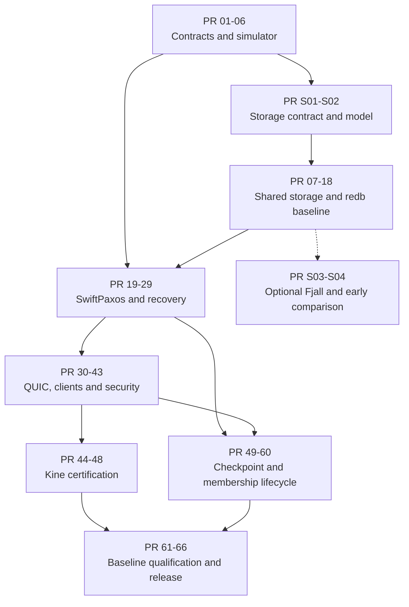

# Coord implementation PR plan

**Status:** Review proposal, version 1.2\
**Date:** 2026-09-12\
**Companion:** [Implementation-ready design v0.5](global-coordination-rust-design-v0.5.md)\
**Scope:** 70 tasks, each corresponding to exactly one proposed PR. Original PR-01 through PR-66 keep their IDs; four storage-experiment tasks are PR-S01 through PR-S04. These are backlog IDs, not existing GitHub issue or PR numbers. S01/S02 establish the common boundary; S03/S04 add an experimental adapter and matched performance analysis. No engine-migration or mixed-engine rollout work is included.

## How to use this plan

The design document is normative for behavior and dependency selection; this document partitions delivery. Prerequisites below form a dependency DAG, not an instruction to develop everything serially. A PR can start as a draft before dependencies merge, but must be reviewed against its final base and land only after prerequisites. No dates or effort estimates are implied by the number of tasks.

Aim for one invariant or observable behavior per implementation PR. A useful review target is roughly 200-700 handwritten implementation lines plus focused tests; it is not a quota or an estimate. If a task exceeds a comfortable review boundary, split it into named child PRs before coding and update the dependency map. Do not shrink patches by omitting tests or fold unrelated cleanup into a correctness change. Generated fixtures, lockfiles and model counterexamples are reviewed separately from source diff size.

Every PR includes a problem statement, relevant design sections, exact before/after behavior, test commands and results, one failure case, and any persistence/wire/security implications. Protocol PRs include the source-rule mapping and durable-publication prerequisites. Fixture/schema changes must state compatibility consequences. A qualification PR may add tests and evidence, but required behavioral fixes receive their own review rather than being hidden in test churn.

Intermediate compositions are test-only until G3. No public insecure listener, voting bypass, simulated key material or test-crypto feature may appear in a production artifact. A fixed-membership preview remains bounded and explicitly non-production until safe permanent replacement and quorum-backed trimming are complete.

## Workstreams and release boundaries

| PRs | Workstream | Boundary |
|---|---|---|
| 01-06 | Tooling, contracts and independent deterministic oracle | G0 foundation |
| 07-18 | Shared storage with the default redb adapter, state machine, watches, leases and replicated auth state | G1 single-node semantics |
| 19-29 | Source-mapped SwiftPaxos, durability, recovery and fast results | G2 fixed membership |
| 30-34 | Native QUIC, packet simulation, trusted collector and Rust SDK | Native transport foundation |
| 35-43 | Federated client/node identity and secure composition | G3 authenticated preview |
| 44-48 | Go codec/client, direct Kine backend and actual Kubernetes tests | G4 compatibility |
| 49-60 | Checkpoints, quorum-safe trimming, replacement, restore and upgrades | G5 operational lifecycle |
| 61-66 | Observability, matched WAN measurements and release evidence | G6 qualification |
| S01-S02 | Engine contract, model, common conformance kit and logical fixture replay | Required before baseline storage delivery |
| S03-S04 | Experimental Fjall adapter and fresh-database matched performance comparison | Isolated experiments, not a redb release dependency or production-support claim |



The diagram summarizes workstream relationships. Individual prerequisites below are authoritative and permit earlier parallel work, such as Go codec fixtures after PR-03 or node-issuer implementation independently of an operational quorum.

## Changes from plan v1.1

Remove former PR-S05 through PR-S08: complete local replica images, cross-engine conversion, mixed-engine rollout qualification and the additional engine-production decision. Their IDs are retired, not reused. No remaining task depends on them.

Keep PR-07 as the redb adapter, PR-08 as the shared durable coordinator and PR-11 as shared materialization/read views. PR-S01/S02 define and test the boundary; PR-S03 selects Fjall only in an isolated test/benchmark composition; PR-S04 creates fresh per-engine databases from the same logical setup and compares matched-load behavior. Existing PR-49/50 service checkpoints and PR-60 same-engine schema upgrades retain their original safety scope, not a migration role.

Do not wait until PR-62 to evaluate storage costs. PR-S04 supplies early local measurements; PR-62/63 can reuse those fixtures for separate fresh homogeneous experiment clusters after the real service harness exists. There is no requirement to convert data, operate a mixed-engine cluster or approve a second production engine to complete the comparison.

## Review index

| PR | Title | Direct prerequisites |
|---|---|---|
| [PR-01](#pr-01) | Lock the workspace, toolchains and review checks | None |
| [PR-02](#pr-02) | Define identities, canonical commands and ordered-key fixtures | [PR-01](#pr-01) |
| [PR-03](#pr-03) | Implement the bounded postcard wire codec | [PR-02](#pr-02) |
| [PR-04](#pr-04) | Establish pure event/effect and durable-barrier interfaces | [PR-02](#pr-02) |
| [PR-05](#pr-05) | Build the deterministic world and replay format | [PR-04](#pr-04) |
| [PR-06](#pr-06) | Add an independent history oracle | [PR-02](#pr-02), [PR-05](#pr-05) |
| [PR-07](#pr-07) | Implement the redb adapter and fail-closed generation lifecycle | [PR-01](#pr-01), [PR-02](#pr-02), [PR-S01](#pr-s01), [PR-S02](#pr-s02) |
| [PR-08](#pr-08) | Implement the shared single-writer storage coordinator | [PR-04](#pr-04), [PR-07](#pr-07) |
| [PR-09](#pr-09) | Exercise the actual redb engine with disk faults | [PR-05](#pr-05), [PR-08](#pr-08) |
| [PR-10](#pr-10) | Implement the pure KV and transaction planner | [PR-02](#pr-02), [PR-04](#pr-04), [PR-06](#pr-06) |
| [PR-11](#pr-11) | Apply shared KV plans atomically and serve pinned MVCC views | [PR-08](#pr-08), [PR-09](#pr-09), [PR-10](#pr-10) |
| [PR-12](#pr-12) | Persist deduplication, result resolution and retry floors | [PR-11](#pr-11) |
| [PR-13](#pr-13) | Implement atomic watch replay and live handoff | [PR-11](#pr-11), [PR-12](#pr-12) |
| [PR-14](#pr-14) | Add bounded MVCC compaction | [PR-11](#pr-11), [PR-13](#pr-13) |
| [PR-15](#pr-15) | Implement native lease grant, attachment and revoke | [PR-10](#pr-10), [PR-11](#pr-11), [PR-12](#pr-12) |
| [PR-16](#pr-16) | Implement replicated renewal and conservative expiry | [PR-05](#pr-05), [PR-06](#pr-06), [PR-15](#pr-15) |
| [PR-17](#pr-17) | Add native atomic Kine primitives and private TTL bindings | [PR-12](#pr-12), [PR-16](#pr-16) |
| [PR-18](#pr-18) | Implement replicated sessions, policy and grant commitments | [PR-10](#pr-10), [PR-11](#pr-11), [PR-12](#pr-12) |
| [PR-19](#pr-19) | Freeze SwiftPaxos source mapping and bounded models | [PR-02](#pr-02), [PR-04](#pr-04), [PR-05](#pr-05) |
| [PR-20](#pr-20) | Persist ballots, promises and configuration guards | [PR-08](#pr-08), [PR-19](#pr-19) |
| [PR-21](#pr-21) | Implement the dependency graph and closure evidence | [PR-19](#pr-19), [PR-20](#pr-20) |
| [PR-22](#pr-22) | Implement normal leader proposal handlers | [PR-20](#pr-20), [PR-21](#pr-21) |
| [PR-23](#pr-23) | Implement normal follower vote and adoption handlers | [PR-20](#pr-20), [PR-21](#pr-21), [PR-22](#pr-22) |
| [PR-24](#pr-24) | Implement slow learning and ordered materialization | [PR-11](#pr-11), [PR-12](#pr-12), [PR-13](#pr-13), [PR-18](#pr-18), [PR-22](#pr-22), [PR-23](#pr-23) |
| [PR-25](#pr-25) | Implement durable recovery summaries and payload transfer | [PR-20](#pr-20), [PR-21](#pr-21), [PR-23](#pr-23) |
| [PR-26](#pr-26) | Implement recovery selection and new-ballot activation | [PR-19](#pr-19), [PR-24](#pr-24), [PR-25](#pr-25) |
| [PR-27](#pr-27) | Qualify fixed-membership crash recovery end to end | [PR-06](#pr-06), [PR-09](#pr-09), [PR-16](#pr-16), [PR-18](#pr-18), [PR-26](#pr-26) |
| [PR-28](#pr-28) | Implement full fast-path learning evidence | [PR-19](#pr-19), [PR-23](#pr-23), [PR-26](#pr-26), [PR-27](#pr-27) |
| [PR-29](#pr-29) | Add bounded speculative execution and result-release gating | [PR-12](#pr-12), [PR-18](#pr-18), [PR-24](#pr-24), [PR-28](#pr-28) |
| [PR-30](#pr-30) | Implement the Quinn transport adapter and TLS lifecycle | [PR-03](#pr-03), [PR-04](#pr-04), [PR-08](#pr-08) |
| [PR-31](#pr-31) | Implement QUIC traffic isolation and backpressure | [PR-30](#pr-30) |
| [PR-32](#pr-32) | Add packet-level quinn-proto simulation | [PR-05](#pr-05), [PR-30](#pr-30), [PR-31](#pr-31) |
| [PR-33](#pr-33) | Wire the trusted frontend collector and native dispatch | [PR-17](#pr-17), [PR-18](#pr-18), [PR-29](#pr-29), [PR-30](#pr-30), [PR-31](#pr-31) |
| [PR-34](#pr-34) | Implement the Rust SDK request lifecycle | [PR-03](#pr-03), [PR-12](#pr-12), [PR-30](#pr-30), [PR-33](#pr-33) |
| [PR-35](#pr-35) | Implement hardened external JWT and issuer verification | [PR-18](#pr-18) |
| [PR-36](#pr-36) | Implement RFC 8693 exchange and service credential signing | [PR-18](#pr-18), [PR-33](#pr-33), [PR-35](#pr-35) |
| [PR-37](#pr-37) | Bind API sessions and authorize live/replayed output | [PR-13](#pr-13), [PR-18](#pr-18), [PR-33](#pr-33), [PR-34](#pr-34), [PR-36](#pr-36) |
| [PR-38](#pr-38) | Implement OIDC browser login and the service code flow | [PR-18](#pr-18), [PR-35](#pr-35), [PR-36](#pr-36) |
| [PR-39](#pr-39) | Implement device authorization with bounded polling | [PR-38](#pr-38) |
| [PR-40](#pr-40) | Implement refresh families and secure CLI login | [PR-34](#pr-34), [PR-37](#pr-37), [PR-38](#pr-38), [PR-39](#pr-39) |
| [PR-41](#pr-41) | Implement the independent WIF node issuer | [PR-30](#pr-30), [PR-35](#pr-35) |
| [PR-42](#pr-42) | Bind genesis and committed membership to peer TLS | [PR-20](#pr-20), [PR-26](#pr-26), [PR-30](#pr-30), [PR-41](#pr-41) |
| [PR-43](#pr-43) | Compose secure daemons and qualify the native preview | [PR-09](#pr-09), [PR-16](#pr-16), [PR-27](#pr-27), [PR-32](#pr-32), [PR-33](#pr-33), [PR-37](#pr-37), [PR-40](#pr-40), [PR-42](#pr-42) |
| [PR-44](#pr-44) | Implement the Go postcard subset and shared fixtures | [PR-03](#pr-03) |
| [PR-45](#pr-45) | Implement the Go QUIC client and workload credentials | [PR-34](#pr-34), [PR-36](#pr-36), [PR-44](#pr-44) |
| [PR-46](#pr-46) | Implement Kine driver registration and CRUD/range backend | [PR-17](#pr-17), [PR-43](#pr-43), [PR-45](#pr-45) |
| [PR-47](#pr-47) | Complete Kine watches, progress, compaction and TTL | [PR-13](#pr-13), [PR-14](#pr-14), [PR-16](#pr-16), [PR-46](#pr-46) |
| [PR-48](#pr-48) | Certify the selected Kubernetes storage profile | [PR-47](#pr-47) |
| [PR-49](#pr-49) | Export canonical shared checkpoints through portable snapshots | [PR-14](#pr-14), [PR-18](#pr-18), [PR-27](#pr-27) |
| [PR-50](#pr-50) | Install learner snapshots and reconcile catch-up state | [PR-25](#pr-25), [PR-42](#pr-42), [PR-49](#pr-49) |
| [PR-51](#pr-51) | Implement conservative all-voter checkpoint trimming | [PR-26](#pr-26), [PR-49](#pr-49), [PR-50](#pr-50) |
| [PR-52](#pr-52) | Model quorum-safe checkpoint activation | [PR-19](#pr-19), [PR-51](#pr-51) |
| [PR-53](#pr-53) | Implement quorum-safe checkpoint floors and recovery | [PR-26](#pr-26), [PR-50](#pr-50), [PR-52](#pr-52) |
| [PR-54](#pr-54) | Model sealed membership handoff | [PR-19](#pr-19), [PR-26](#pr-26), [PR-53](#pr-53) |
| [PR-55](#pr-55) | Persist old-configuration sealing and terminal recovery | [PR-25](#pr-25), [PR-26](#pr-26), [PR-54](#pr-54) |
| [PR-56](#pr-56) | Establish the unique handoff certificate | [PR-49](#pr-49), [PR-55](#pr-55) |
| [PR-57](#pr-57) | Activate the successor and recover interrupted handoffs | [PR-42](#pr-42), [PR-50](#pr-50), [PR-53](#pr-53), [PR-56](#pr-56) |
| [PR-58](#pr-58) | Implement node/key credential lifecycle and fencing tests | [PR-41](#pr-41), [PR-42](#pr-42), [PR-57](#pr-57) |
| [PR-59](#pr-59) | Implement backup, restore and disaster-recovery commands | [PR-49](#pr-49), [PR-50](#pr-50), [PR-57](#pr-57), [PR-58](#pr-58) |
| [PR-60](#pr-60) | Implement format/capability upgrades and rollback guards | [PR-03](#pr-03), [PR-07](#pr-07), [PR-50](#pr-50), [PR-57](#pr-57) |
| [PR-61](#pr-61) | Complete bounded observability and operator diagnostics | [PR-31](#pr-31), [PR-43](#pr-43), [PR-53](#pr-53), [PR-57](#pr-57) |
| [PR-62](#pr-62) | Build and run the matched native WAN benchmark matrix | [PR-29](#pr-29), [PR-32](#pr-32), [PR-43](#pr-43), [PR-53](#pr-53), [PR-61](#pr-61) |
| [PR-63](#pr-63) | Measure Kine end-to-end overhead and regression budgets | [PR-48](#pr-48), [PR-61](#pr-61), [PR-62](#pr-62) |
| [PR-64](#pr-64) | Run mixed-fault qualification and automatic minimization | [PR-09](#pr-09), [PR-27](#pr-27), [PR-32](#pr-32), [PR-40](#pr-40), [PR-48](#pr-48), [PR-53](#pr-53), [PR-57](#pr-57), [PR-58](#pr-58), [PR-60](#pr-60) |
| [PR-65](#pr-65) | Package and qualify supported deployment targets | [PR-43](#pr-43), [PR-48](#pr-48), [PR-59](#pr-59), [PR-60](#pr-60), [PR-61](#pr-61) |
| [PR-66](#pr-66) | Close security, supply-chain and production release gates | [PR-58](#pr-58), [PR-59](#pr-59), [PR-60](#pr-60), [PR-63](#pr-63), [PR-64](#pr-64), [PR-65](#pr-65) |
| [PR-S01](#pr-s01) | Define the portable engine contract and logical collection registry | [PR-02](#pr-02), [PR-04](#pr-04) |
| [PR-S02](#pr-s02) | Implement the model engine and common storage conformance kit | [PR-05](#pr-05), [PR-S01](#pr-s01) |
| [PR-S03](#pr-s03) | Add an experimental single-writer Fjall adapter | [PR-08](#pr-08), [PR-S02](#pr-s02) |
| [PR-S04](#pr-s04) | Replay fresh fixtures and compare local engine costs early | [PR-09](#pr-09), [PR-14](#pr-14), [PR-17](#pr-17), [PR-18](#pr-18), [PR-S03](#pr-s03) |

## PR specifications

<a id="pr-01"></a>

### PR-01: Lock the workspace, toolchains and review checks

**Prerequisites:** None. **Design:** Sections 16, 21.3.

**Implement:** Create the Rust/Go workspace skeleton, exact toolchain files, Cargo.lock/go.sum, explicit TLS feature selections and a checksummed tools manifest. Add xtask, formatting/lint/test entry points, dependency policy, Mermaid rendering and reference checks.

**Acceptance:** Build the selected graph on Linux x86_64 and aarch64. Record actual compiler/MSRV and cargo-tree feature output. Fail CI for an insecure test dependency in a production binary, missing lockfiles, malformed Mermaid or an unreviewed source override.

**Review boundary:** No protocol or service implementation. Resolve incompatibilities openly in this PR rather than treating the proposed pins as already compile-tested.

<a id="pr-02"></a>

### PR-02: Define identities, canonical commands and ordered-key fixtures

**Prerequisites:** [PR-01](#pr-01). **Design:** Sections 2.3, 4.4, 17.2.

**Implement:** Implement coord-types logical_v1, fixed IDs, checked revisions, stable request identity, structured errors and canonical command hashing. Specify namespace/key/revision byte encodings and store fixture vectors in fixtures/.

**Acceptance:** Property tests compare encoded-key ordering with byte-key/revision ordering, including zero bytes and prefixes. Same request with changed operation has a different digest; transport credentials do not change it. Reject counter overflow and ambiguous encodings.

**Review boundary:** No networking, wall time, random ID generation inside the core or automatic schema evolution.

<a id="pr-03"></a>

### PR-03: Implement the bounded postcard wire codec

**Prerequisites:** [PR-02](#pr-02). **Design:** Sections 11.2, 19.1.

**Implement:** Add wire_v1 DTOs, frame reader/writer, explicit kind/version registry and bounded Serde newtypes. Commit valid and invalid binary vectors plus a small fuzz target.

**Acceptance:** Reject every truncated-header case, integer/length overflow, trailing bytes, unknown version and oversized/nested collection before excessive allocation. Verify canonical re-encoding for identity-bearing payloads.

**Review boundary:** No sockets or general-purpose Go Serde library. Message records use stable DTOs, not implementation enums.

<a id="pr-04"></a>

### PR-04: Establish pure event/effect and durable-barrier interfaces

**Prerequisites:** [PR-02](#pr-02). **Design:** Sections 5.1, 18.

**Implement:** Add ClockSnapshot/entropy ports, typed actor events, PersistBatch and boot-scoped BarrierId, send prerequisites and private established-result/admission wrappers. Supply test adapters only.

**Acceptance:** A publication requiring two barriers cannot escape after one completion. Wrong-boot, duplicate and failed completions never release it. Compile-boundary checks keep Tokio, engine crates and system clocks out of coord-consensus/coord-state.

**Review boundary:** No actual consensus, database or production insecure composition.

<a id="pr-05"></a>

### PR-05: Build the deterministic world and replay format

**Prerequisites:** [PR-04](#pr-04). **Design:** Sections 12, 21.1.

**Implement:** Implement the ordered virtual event scheduler, process crash/restart, virtual clocks, message delivery and named ChaCha RNG streams. Add versioned replay bundles and a first deliberately faulty actor.

**Acceptance:** An identical replay has identical externally visible history and state digests. Different insertion ties are explicit. A deliberately dropped durable prerequisite is reproducibly detected and saved as a regression.

**Review boundary:** This is a logical simulator, not yet real redb or QUIC packet coverage.

<a id="pr-06"></a>

### PR-06: Add an independent history oracle

**Prerequisites:** [PR-02](#pr-02), [PR-05](#pr-05). **Design:** Sections 6, 21.1.

**Implement:** Implement a small separate reference model and complete-domain history checker for linearizability, revision ordering, retries and conditional operations. Define extensible lease/auth/watch observations.

**Acceptance:** Seed intentional bugs: stale reads after an acknowledged write, duplicate mutation, two operations sharing a revision incorrectly, and a missing transaction event. The checker must reject them and accept valid concurrent histories.

**Review boundary:** Do not call the production planner as the oracle or partition shared-revision histories by key.

<a id="pr-07"></a>

### PR-07: Implement the redb adapter and fail-closed generation lifecycle

**Prerequisites:** [PR-01](#pr-01), [PR-02](#pr-02), [PR-S01](#pr-s01), [PR-S02](#pr-s02). **Design:** Sections 5.2, 17.1, 17.9-17.11, 17.13.

**Implement:** Implement coord-storage-redb against the portable engine contract, with pinned cross-table snapshots, byte-key tables, explicit durable transactions and typed commit failures. Open the shared schema catalog through a verified generation manifest/root lock. Keep all logical codecs and schema interpretation in coord-storage.

**Acceptance:** Pass the common ordered-access/transaction suites against redb. Missing/empty/corrupt files and wrong cluster/domain/generation/engine fail closed; duplicate opens are excluded. One transaction is atomic across the full collection catalog, including read-your-writes scans.

**Review boundary:** No implicit create-on-open, engine-specific application semantics, custom WAL, Fjall implementation or live migration.

<a id="pr-08"></a>

### PR-08: Implement the shared single-writer storage coordinator

**Prerequisites:** [PR-04](#pr-04), [PR-07](#pr-07). **Design:** Sections 17.3, 17.8-17.10.

**Implement:** Implement StoreWorker<E>, semantic guard checks inside a write transaction, shared update lowering, atomic store_seq/batch stamps and boot-fenced Durable completions. Add the known-durable-head read gate and bounded grouping. Call the engine commit_durable contract rather than native redb APIs.

**Acceptance:** Run against model and redb. Inject visible-before-completion snapshots, definite precondition rejection, indeterminate commit, lost completion and old-boot completion. No read view or dependent publication escapes without its required evidence. Unrelated protocol stamp advances do not incorrectly invalidate an ApplyBase.

**Review boundary:** No direct engine imports in coord-storage, periodic durability flush profile, unbounded blocking tasks or public exposure of engine sequences.

<a id="pr-09"></a>

### PR-09: Exercise the actual redb engine with disk faults

**Prerequisites:** [PR-05](#pr-05), [PR-08](#pr-08). **Design:** Sections 17.3, 17.14, 21.2.

**Implement:** Implement the pinned redb StorageBackend fault model beneath coord-storage-redb with volatile/durable images and controllable writes/synchronization. Reuse shared contract/recovery fixtures, reopen from crash images and add subprocess-kill tests. Include generation-manager directory faults separately.

**Acceptance:** For a bounded transaction, crash at each recorded write/sync boundary and verify only permitted states reopen. Test sync errors with partial persistence, disk full, corruption quarantine and prevention of destructor flush after simulated crash.

**Review boundary:** Do not replace redb internals with the model engine and label it byte-level engine coverage. This PR does not certify Fjall or generic OS power-failure behavior.

<a id="pr-10"></a>

### PR-10: Implement the pure KV and transaction planner

**Prerequisites:** [PR-02](#pr-02), [PR-04](#pr-04), [PR-06](#pr-06). **Design:** Sections 6.1-6.3, 17.4.

**Implement:** Add point/range selection, compares, put/delete, selected transaction branches, per-command revision allocation and deterministic ReadView/ApplyPlan interfaces. Use an in-memory fixture view.

**Acceptance:** Reference histories cover create/mod/version fields, absent keys, range boundaries, transaction failure/no-op revisions, response-byte limits and one revision for an atomic multi-key mutation.

**Review boundary:** No production database access, lease expiry or wall-clock decisions in the planner.

<a id="pr-11"></a>

### PR-11: Apply shared KV plans atomically and serve pinned MVCC views

**Prerequisites:** [PR-08](#pr-08), [PR-09](#pr-09), [PR-10](#pr-10). **Design:** Sections 17.2, 17.4, 17.9-17.10.

**Implement:** Implement shared bounded read-view construction and current/history/events/execution updates through coord-store-api. Check ApplyBase in the write transaction. Add fixed-revision historical scans, bounded pages and snapshot-to-owned-view materialization without any redb/Fjall import.

**Acceptance:** Run the same fixtures against model and redb. Materialization crashes leave no partial events or mismatched frontier. Historical scans select versions before limits. A stale ApplyBase is replanned; collection/page boundaries, reverse scans and read-ahead-of-durability are checked.

**Review boundary:** A pinned engine view is not a linearizable-read certificate. No consensus publication or duplicate per-engine MVCC implementation.

<a id="pr-12"></a>

### PR-12: Persist deduplication, result resolution and retry floors

**Prerequisites:** [PR-11](#pr-11). **Design:** Sections 6.5, 17.1.

**Implement:** Atomically store request digest/result/executed identity with application effects. Add bounded outstanding windows, ResolveRequest and replicated retirement floors.

**Acceptance:** Lost response followed by same-ID retry returns the same logical result. Changed payload is rejected. Crash between materialization and notification does not duplicate. A retired request cannot be executed as new work.

**Review boundary:** No promise of infinite result retention or exactly-once retry without a stable upstream ID.

<a id="pr-13"></a>

### PR-13: Implement atomic watch replay and live handoff

**Prerequisites:** [PR-11](#pr-11), [PR-12](#pr-12). **Design:** Sections 6.4, 19.3.

**Implement:** Add event replay, snapshot-to-live registration frontier, complete-revision batching, bounded queues, progress tracking and explicit resumable cancellation.

**Acceptance:** Inject mutation exactly during registration; observe it once with no gap. Slow consumers never advance over omitted events. Multi-key revisions remain atomic across fragmentation. Add a Loom test for the handoff boundary.

**Review boundary:** No public watch release before authorization integration, and no progress based solely on transport receipt.

<a id="pr-14"></a>

### PR-14: Add bounded MVCC compaction

**Prerequisites:** [PR-11](#pr-11), [PR-13](#pr-13). **Design:** Sections 6.4, 17.5.

**Implement:** Implement ordered retention watermark changes and incremental history/event GC while preserving the latest version at/before the retention boundary needed for subsequent snapshots. Handle active read/watch retention explicitly. Keep row deletion and retention decisions in the shared layer; engines may only reclaim physical storage after those decisions.

**Acceptance:** Historical reads before the retained boundary return Compacted. Reads after it preserve untouched old values and tombstones. Concurrent pagination and watch resumption never skip missing history silently.

**Review boundary:** No consensus-record trimming, engine-owned TTL or retention filter, and no exclusive live-file compaction.

<a id="pr-15"></a>

### PR-15: Implement native lease grant, attachment and revoke

**Prerequisites:** [PR-10](#pr-10), [PR-11](#pr-11), [PR-12](#pr-12). **Design:** Sections 7.1, 17.1.

**Implement:** Add persistent lease IDs/generations, reverse key index, owner permissions interface and atomic attachment/detachment/revocation plans. Enforce count and worst-case event-byte limits.

**Acceptance:** Revoke atomically deletes only the currently attached keys. Later value growth cannot evade the deletion budget. Retries do not grant duplicate leases or allocate another revision.

**Review boundary:** No timers or keepalive acknowledgments outside consensus.

<a id="pr-16"></a>

### PR-16: Implement replicated renewal and conservative expiry

**Prerequisites:** [PR-05](#pr-05), [PR-06](#pr-06), [PR-15](#pr-15). **Design:** Sections 7.2-7.4.

**Implement:** Add renewal sequence, expiration-authority epoch, timer-generation effects and conditional expiration commands. Rearm surviving leases after authority recovery according to the conservative clock contract.

**Acceptance:** Check renewal/expiry permutations, delayed old-leader expiry, crash/restart rearming, no-quorum periods and fast-clock bounds. A stale timer cannot delete a newly renewed or reattached key.

**Review boundary:** No exact wall-clock expiry promise or external-resource fencing implied by a lease alone.

<a id="pr-17"></a>

### PR-17: Add native atomic Kine primitives and private TTL bindings

**Prerequisites:** [PR-12](#pr-12), [PR-16](#pr-16). **Design:** Sections 6.6, 19.5.

**Implement:** Define create/CAS-update/conditional-delete commands returning needed metadata and revision in one result. Map Kine TTL seconds to private per-key binding state; zero detaches.

**Acceptance:** Failed CAS changes neither value nor expiry. Replacing TTL fences old expiration. Retries reuse the same binding. Trace asserts one logical command and no mandatory pre-read/current-revision follow-up.

**Review boundary:** No Go code or nativeLeaseID=TTL mapping.

<a id="pr-18"></a>

### PR-18: Implement replicated sessions, policy and grant commitments

**Prerequisites:** [PR-10](#pr-10), [PR-11](#pr-11), [PR-12](#pr-12). **Design:** Sections 9.2-9.3, 20.2-20.3.

**Implement:** Add principal/scope ceilings, session and rule generations, one-time receipt/code commitments, ordered revocation and authorization decisions at execution. Extend the independent oracle.

**Acceptance:** Test branch-specific transaction permissions, range containment, lease attachment restrictions and policy changes after admission. Revoked users cannot retrieve protected cached retry results.

**Review boundary:** No external JWT verification, signing secrets, network discovery or wall-clock evaluation during replay.

<a id="pr-19"></a>

### PR-19: Freeze SwiftPaxos source mapping and bounded models

**Prerequisites:** [PR-02](#pr-02), [PR-04](#pr-04), [PR-05](#pr-05). **Design:** Sections 4, 5.1, 18.1.

**Implement:** Pin the inspected reference implementation commit and paper mapping. Specify message guards, path-learning predicates, C2 quorum membership and durable publication obligations. Add bounded TLC models and counterexample fixtures.

**Acceptance:** Reviewers can trace every planned handler and stored field to a source rule or marked engineering extension. Models reject arbitrary per-request preferred quorums and learner/duplicate-identity votes.

**Review boundary:** No performance optimizations or claimed general proof from bounded model checking.

<a id="pr-20"></a>

### PR-20: Persist ballots, promises and configuration guards

**Prerequisites:** [PR-08](#pr-08), [PR-19](#pr-19). **Design:** Sections 4.1, 5.1, 18.1.

**Implement:** Implement stable ballot promises, configuration/role checks, generation-aware peer identity tokens and typed protocol persistence rows. Wire promised-state recovery into actor initialization.

**Acceptance:** Promise replies wait for durable state. Old-ballot messages after restart cannot lower a promise. A valid identity in the wrong configuration cannot vote. Wrong-boot completions cannot release replies.

**Review boundary:** No full new-ballot recovery selection yet and no default Raft term semantics.

<a id="pr-21"></a>

### PR-21: Implement the dependency graph and closure evidence

**Prerequisites:** [PR-19](#pr-19), [PR-20](#pr-20). **Design:** Sections 4.2-4.5, 18.1-18.3.

**Implement:** Add immutable command payload binding, predecessor/path representation, exact traversal/closure guards and bounded incremental work. Persist source-required dependencies.

**Acceptance:** Tests distinguish direct dependency equality from full path-learning evidence. Duplicate/reordered graph messages converge. Resource limits backpressure admission without evicting accepted unresolved state.

**Review boundary:** No dependency compression, per-key conflict relaxation or receipt-order execution.

<a id="pr-22"></a>

### PR-22: Implement normal leader proposal handlers

**Prerequisites:** [PR-20](#pr-20), [PR-21](#pr-21). **Design:** Sections 4.1-4.5, 18.

**Implement:** Port the source-traceable leader normal-operation handlers and publication effects. Keep all commands conflicting within a domain and use the ballot-fixed preferred quorum.

**Acceptance:** Golden protocol traces match modeled transitions. Every leader reply is blocked on its exact stable prerequisites. Reordered proposals and duplicate client identities cannot create conflicting payload bindings.

**Review boundary:** No learning shortcut, speculative public result or recovery selection.

<a id="pr-23"></a>

### PR-23: Implement normal follower vote and adoption handlers

**Prerequisites:** [PR-20](#pr-20), [PR-21](#pr-21), [PR-22](#pr-22). **Design:** Sections 4, 5.1, 18.

**Implement:** Port follower handling for source-defined fast votes and slow adoption, preserving all publication prerequisites and stable histories.

**Acceptance:** Test leader/follower message races, duplicate requests, conflicting arrival orders and crash between each state update and vote. The same replica identity never supplies two quorum members.

**Review boundary:** Do not infer correctness from matching only direct dependency sets.

<a id="pr-24"></a>

### PR-24: Implement slow learning and ordered materialization

**Prerequisites:** [PR-11](#pr-11), [PR-12](#pr-12), [PR-13](#pr-13), [PR-18](#pr-18), [PR-22](#pr-22), [PR-23](#pr-23). **Design:** Sections 4.3-4.5, 17.4, 18.3.

**Implement:** Add the conservative slow-path learner, closed dependency execution and EstablishedResult creation. Materialize deterministic results through the redb worker and feed committed event frontiers.

**Acceptance:** Three/five-node logical simulations agree with the oracle for KV, transactions, retries and policy. A leader reply alone cannot release a result. No watch event appears before irreversible application.

**Review boundary:** Fast externally visible completion remains disabled. No read-index optimization.

<a id="pr-25"></a>

### PR-25: Implement durable recovery summaries and payload transfer

**Prerequisites:** [PR-20](#pr-20), [PR-21](#pr-21), [PR-23](#pr-23). **Design:** Sections 5.1-5.4, 17.1, 19.3.

**Implement:** Serialize source-required prior-ballot state, stable votes and unresolved dependency closure into bounded recovery pages. Verify transfer identity/digests and persist newly learned prerequisites.

**Acceptance:** Incomplete/corrupt summaries cannot count as recovery evidence. Summaries survive crash without discarding older ballot rows. Missing payloads block progress and are fetched, not replaced with empty operations.

**Review boundary:** No decision selection from an incomplete summary or application snapshot alone.

<a id="pr-26"></a>

### PR-26: Implement recovery selection and new-ballot activation

**Prerequisites:** [PR-19](#pr-19), [PR-24](#pr-24), [PR-25](#pr-25). **Design:** Sections 4.1, 5, 18.1.

**Implement:** Port the specified recovery selection cases, reconcile potentially chosen commands and dependency closure, and durably activate the recovered ballot. Rebuild execution and retry outcomes deterministically.

**Acceptance:** Model-derived histories preserve outcomes learned before all volatile commit notifications vanished. Competing recoveries and delayed prior-ballot replies never establish divergent outputs.

**Review boundary:** No membership change, majority-of-anything shortcut or dropping commands merely because no COMMIT record was found.

<a id="pr-27"></a>

### PR-27: Qualify fixed-membership crash recovery end to end

**Prerequisites:** [PR-06](#pr-06), [PR-09](#pr-09), [PR-16](#pr-16), [PR-18](#pr-18), [PR-26](#pr-26). **Design:** Sections 5, 12, 21.

**Implement:** Add real-engine plus logical-network campaigns covering every vote/reply/materialization barrier and node restart combination within the configured failure budget. Commit minimal replay regressions.

**Acceptance:** Acknowledged results survive allowed failures, retry digests remain stable, minority writes never succeed and leased/policy state matches the oracle. Deliberately remove one required durable write and show a test catches it.

**Review boundary:** This PR is qualification code, not a place to hide protocol changes; behavioral fixes get their own focused review.

<a id="pr-28"></a>

### PR-28: Implement full fast-path learning evidence

**Prerequisites:** [PR-19](#pr-19), [PR-23](#pr-23), [PR-26](#pr-26), [PR-27](#pr-27). **Design:** Sections 4.2-4.5, 18.3.

**Implement:** Add the exact source fast-learning/path predicate and private established evidence object. Share recovery and normal-operation records with the slow path.

**Acceptance:** Generate valid and invalid path certificates, mixed ballot/configuration evidence and duplicate identity cases. Fast completion and forced-slow execution yield identical logical histories under replay.

**Review boundary:** No speculative application overlay or externally visible response plumbing in this PR.

<a id="pr-29"></a>

### PR-29: Add bounded speculative execution and result-release gating

**Prerequisites:** [PR-12](#pr-12), [PR-18](#pr-18), [PR-24](#pr-24), [PR-28](#pr-28). **Design:** Sections 4.3-4.5, 17.4, 18.1.

**Implement:** Implement disposable deterministic overlays and result digests for established fast outcomes. Bind every release to the exact command, closed predecessors, policy state and retained recovery evidence.

**Acceptance:** Changing tentative order cannot leak an old value or credential. Crash after a fast client result but before COMMIT propagation recovers the same result. Tentative watches and token issuance are impossible at the API boundary.

**Review boundary:** Do not add another mandatory WAN commit phase or relax evidence to improve the chart.

<a id="pr-30"></a>

### PR-30: Implement the Quinn transport adapter and TLS lifecycle

**Prerequisites:** [PR-03](#pr-03), [PR-04](#pr-04), [PR-08](#pr-08). **Design:** Sections 11, 19.1-19.4.

**Implement:** Add bounded reliable streams, ALPN negotiation, explicit AWS-LC rustls provider, handshake/close handling and frame dispatch. Use isolated test certificates until production enrollment is integrated.

**Acceptance:** Malformed frames and role/protocol mismatch fail closed. No application data is accepted in 0-RTT. QUIC ACKs cannot trigger Durable or Established events. Shutdown does not create unlimited tasks.

**Review boundary:** No HTTP/3, peer voting admission based only on a test certificate, or public unauthenticated listener.

<a id="pr-31"></a>

### PR-31: Implement QUIC traffic isolation and backpressure

**Prerequisites:** [PR-30](#pr-30). **Design:** Sections 11.3-11.7, 19.2-19.3.

**Implement:** Add explicit CUBIC selection, separate bounded control/unary/watch/bulk connections, shared destination budgeting and priority-aware stream scheduling.

**Acceptance:** A stalled bulk stream or watch cannot consume all control queue/stream capacity. Large ingress frames cannot force unbounded buffering. Record queue wait separately from transport RTT.

**Review boundary:** No claim of universal latency superiority, unbounded connection pools or deliberate idle batching.

<a id="pr-32"></a>

### PR-32: Add packet-level quinn-proto simulation

**Prerequisites:** [PR-05](#pr-05), [PR-30](#pr-30), [PR-31](#pr-31). **Design:** Sections 12.2, 21.2.

**Implement:** Drive the pinned protocol crate with virtual packets/time and controlled protocol RNG. Isolate test-only crypto/time inputs from all production binary graphs.

**Acceptance:** Reproduce packet loss/reordering/MTU/stream-credit traces exactly under the test adapter. Cross-check message-level outcomes. Real rustls handshake integration remains a separate passing suite.

**Review boundary:** Do not claim EndpointConfig RNG seeding alone makes real TLS deterministic.

<a id="pr-33"></a>

### PR-33: Wire the trusted frontend collector and native dispatch

**Prerequisites:** [PR-17](#pr-17), [PR-18](#pr-18), [PR-29](#pr-29), [PR-30](#pr-30), [PR-31](#pr-31). **Design:** Sections 3, 4.3, 19.4.

**Implement:** Compose authenticated-admission interfaces, parallel direct-to-replica fanout, the trusted evidence collector, unary dispatch and committed watch delivery in a test-only service composition.

**Acceptance:** Packet traces show no unnecessary sequential region-to-leader hop. One follower/leader response cannot disclose a tentative result. Cancellation after admission preserves stable outcome resolution.

**Review boundary:** No untrusted SDK vote collection and no production listener until the security composition gate.

<a id="pr-34"></a>

### PR-34: Implement the Rust SDK request lifecycle

**Prerequisites:** [PR-03](#pr-03), [PR-12](#pr-12), [PR-30](#pr-30), [PR-33](#pr-33). **Design:** Sections 6.5, 11.5, 19.4.

**Implement:** Add credential-provider interfaces, bounded warm connection pooling, stable client instance/sequence, operation deadlines, ResolveRequest and structured retry errors.

**Acceptance:** Reconnect/reset/timeout reuse the same ID for the same invocation. Payload mutation under an ID is rejected. Deadline expiry reports unknown outcome where appropriate. Stream-credit pressure is bounded.

**Review boundary:** No implicit retries with fresh IDs or new credential exchanges for every KV request.

<a id="pr-35"></a>

### PR-35: Implement hardened external JWT and issuer verification

**Prerequisites:** [PR-18](#pr-18). **Design:** Sections 9, 20.1-20.2.

**Implement:** Add separate OIDC/WIF verifier interfaces, issuer-specific algorithm/audience/claim rules, bounded JWKS caches and hardened reqwest access. Add Kubernetes offline and explicit TokenReview modes.

**Acceptance:** Reject issuer mix-up, alg confusion, wrong audience, expired/future assertions, unknown kids under rate limits and token-directed URLs. Simulate stale cache, clock-health failure and TokenReview outage.

**Review boundary:** No token issuance or generic acceptance of arbitrary cloud identity documents.

<a id="pr-36"></a>

### PR-36: Implement RFC 8693 exchange and service credential signing

**Prerequisites:** [PR-18](#pr-18), [PR-33](#pr-33), [PR-35](#pr-35). **Design:** Sections 9.1-9.4, 20.2.

**Implement:** Add Axum token-exchange endpoints, trusted canonical admission receipts, atomic session creation, bounded signing-key publication/rotation and scoped ES256 service tokens.

**Acceptance:** Policy changed after verification is rechecked at execution. Issuer outage and stale key material fail closed. No raw JWT/private key enters replicated storage or logs. WIF lifetime and scope ceilings are enforced.

**Review boundary:** No long-lived WIF refresh credentials and no external IdP call on ordinary KV operations.

<a id="pr-37"></a>

### PR-37: Bind API sessions and authorize live/replayed output

**Prerequisites:** [PR-13](#pr-13), [PR-18](#pr-18), [PR-33](#pr-33), [PR-34](#pr-34), [PR-36](#pr-36). **Design:** Sections 6.4-6.5, 9.3, 19.4.

**Implement:** Implement persistent-connection auth binding, refresh/rebind, expiry checks, ordered revocation and authorization gates for reads, retry results and watch output batches.

**Acceptance:** Expired sessions on warm connections cannot admit new work. Policy revocation prevents later protected output even from stale reads/retries. Watch progress cannot bypass its output authorization barrier.

**Review boundary:** Admission token validity does not freeze policy for the entire connection or retroactively cancel already permitted in-flight commands.

<a id="pr-38"></a>

### PR-38: Implement OIDC browser login and the service code flow

**Prerequisites:** [PR-18](#pr-18), [PR-35](#pr-35), [PR-36](#pr-36). **Design:** Sections 8, 20.1.

**Implement:** Integrate openidconnect for upstream browser authentication and implement Coord authorization codes with PKCE, state/nonce, exact redirects and explicit azp validation.

**Acceptance:** Negative tests cover missing/wrong authorized party, multi-audience tokens, login CSRF, code/redirect substitution, concurrent tabs and broker restart. One code can create only one session.

**Review boundary:** The OIDC crate is not a ready-made service authorization server; no email-based principal identity.

<a id="pr-39"></a>

### PR-39: Implement device authorization with bounded polling

**Prerequisites:** [PR-38](#pr-38). **Design:** Sections 8.1, 20.1-20.3.

**Implement:** Add service device-code issuance, user confirmation, expiry, poll intervals/backoff and one-time consumption. Browser confirmation uses the established upstream OIDC flow.

**Acceptance:** Concurrent pollers cannot mint multiple sessions. Denied/expired codes and polling floods are handled deterministically. No external IdP device-flow support is assumed.

**Review boundary:** No secret disclosure in user codes/URLs or acceptance of codes without browser-authenticated approval.

<a id="pr-40"></a>

### PR-40: Implement refresh families and secure CLI login

**Prerequisites:** [PR-34](#pr-34), [PR-37](#pr-37), [PR-38](#pr-38), [PR-39](#pr-39). **Design:** Sections 8.2, 20.3.

**Implement:** Add refresh-generation commitments and reuse revocation, plus coordctl browser/device/logout/refresh flows using selected target-specific keyring stores. Serialize shared credential updates.

**Acceptance:** A lost rotated-secret response forces documented reauthentication rather than unsafe reuse. Concurrent refreshes, revoked families and missing/locked keyrings are tested. No plaintext fallback or credential logging.

**Review boundary:** Headless automation uses WIF; desktop refresh secrets are not stored as deployment config.

<a id="pr-41"></a>

### PR-41: Implement the independent WIF node issuer

**Prerequisites:** [PR-30](#pr-30), [PR-35](#pr-35). **Design:** Sections 10.1-10.2, 20.4.

**Implement:** Build coord-node-issuer with configured external trust, protected CA signer, rcgen CSR proof-of-possession and policy-constructed identities/constraints. Keep it operational without a Coord quorum.

**Acceptance:** Cold genesis enrollment works before any voter runs. Reject invalid CSR signatures, unauthorized SAN/CA requests, invalid issuer constraints, excessive lifetimes and wrong workload claims.

**Review boundary:** No copying arbitrary CSR extensions, quorum-dependent bootstrap authority or implication that a certificate authorizes a vote.

<a id="pr-42"></a>

### PR-42: Bind genesis and committed membership to peer TLS

**Prerequisites:** [PR-20](#pr-20), [PR-26](#pr-26), [PR-30](#pr-30), [PR-41](#pr-41). **Design:** Sections 10, 17.1, 20.4.

**Implement:** Implement signed/pinned genesis initialization and peer cert/key/generation/role checks against committed membership. Persist initialization evidence before voting.

**Acceptance:** Wrong-cluster, stale-generation, learner/frontend and cloned duplicate identities cannot count as voters. Missing/rolled-back storage requires quarantine/new-generation recovery. No TOFU join.

**Review boundary:** No online membership handoff yet; fixed configuration only.

<a id="pr-43"></a>

### PR-43: Compose secure daemons and qualify the native preview

**Prerequisites:** [PR-09](#pr-09), [PR-16](#pr-16), [PR-27](#pr-27), [PR-32](#pr-32), [PR-33](#pr-33), [PR-37](#pr-37), [PR-40](#pr-40), [PR-42](#pr-42). **Design:** Sections 22.1-22.2, 23 G3.

**Implement:** Add role-specific production binaries, strict TOML, bounded worker supervision, startup/readiness/shutdown state machines and secret-safe diagnostics. Publish the fixed-membership preview restrictions.

**Acceptance:** Exercise cold authenticated bootstrap, browser/device/WIF client flows, warm credential expiry, node restart, overload and disk quarantine. Production dependency graph has no simulator credentials or bypass flag.

**Review boundary:** No general-production claim: permanent replacement and quorum-safe trimming still await lifecycle PRs.

<a id="pr-44"></a>

### PR-44: Implement the Go postcard subset and shared fixtures

**Prerequisites:** [PR-03](#pr-03). **Design:** Sections 6.6, 19.1.

**Implement:** Create adapters/kine/wire using the fixed frame and schema manifest. Implement only required native DTOs with checked varints, signed values, lengths and full-consumption checks.

**Acceptance:** Rust encodes/Go decodes and vice versa for every valid fixture. Both reject the malformed corpus with bounded allocation. Require an explicit fixture update for any schema change.

**Review boundary:** No Go consensus, cgo/FFI, protobuf inside the native path or arbitrary Serde reflection.

<a id="pr-45"></a>

### PR-45: Implement the Go QUIC client and workload credentials

**Prerequisites:** [PR-34](#pr-34), [PR-36](#pr-36), [PR-44](#pr-44). **Design:** Sections 19.4-19.5.

**Implement:** Add plain quic-go streams, trust/cluster binding, WIF credentials, session rebind, bounded connection pools and stable invocation IDs with retry/resolve behavior.

**Acceptance:** Rust/Go real TLS interoperability, token expiry, stream reset, ambiguous timeout and warm reconnect pass. Observe zero per-operation token exchange and no HTTP/3 native transport.

**Review boundary:** No exactly-once promise across a lost upstream invocation identity.

<a id="pr-46"></a>

### PR-46: Implement Kine driver registration and CRUD/range backend

**Prerequisites:** [PR-17](#pr-17), [PR-43](#pr-43), [PR-45](#pr-45). **Design:** Sections 6.6, 19.5.

**Implement:** Register coord:// in the pinned Kine build and implement Start/Get/Create/Update/Delete/List/Count/DbSize/CurrentRevision with exact backend result/error mapping.

**Acceptance:** Bridge tests verify revisions, CAS conflict metadata, byte-range/count/pagination behavior and health-key handling. Traces assert one native conditional command with no mandatory WAN pre-read.

**Review boundary:** Do not wrap coord in the logstructured SQL/TTL backend or claim unsupported general etcd transactions.

<a id="pr-47"></a>

### PR-47: Complete Kine watches, progress, compaction and TTL

**Prerequisites:** [PR-13](#pr-13), [PR-14](#pr-14), [PR-16](#pr-16), [PR-46](#pr-46). **Design:** Sections 6.6, 19.5.

**Implement:** Implement Backend.Watch, WaitForSyncTo and Compact behavior; connect private TTL bindings and the bridge compaction metadata convention. Preserve batch and cursor semantics.

**Acceptance:** Replay/live races, compacted/future revisions, progress barriers, reconnection and old-expiry-after-update histories pass through the actual bridge. No local unconditional TTL deletes or dropped watch batches.

**Review boundary:** No claim that native leases map one-for-one to the pinned Kine lease API.

<a id="pr-48"></a>

### PR-48: Certify the selected Kubernetes storage profile

**Prerequisites:** [PR-47](#pr-47). **Design:** Sections 6.6, 23 G4.

**Implement:** Run real API-server storage tests and a pinned Kubernetes/Kine integration fixture. Publish exact supported versions, operations and exclusions plus reproducible CI commands.

**Acceptance:** Exercise CRUD/CAS, list pagination, watch resumption/progress, compaction, TTL, multi-client updates and failover with region faults. Correctness failures block compatibility labeling.

**Review boundary:** No blanket etcd replacement claim for workloads outside the tested profile.

<a id="pr-49"></a>

### PR-49: Export canonical shared checkpoints through portable snapshots

**Prerequisites:** [PR-14](#pr-14), [PR-18](#pr-18), [PR-27](#pr-27). **Design:** Sections 5.3, 17.6, 17.12.

**Implement:** Implement SharedCheckpointV1 with bounded canonical collection traversal, chunk hashes and a manifest at a certified execution boundary, using one pinned cross-collection view. Exclude node-local promises, store_seq and physical layout from the common hash.

**Acceptance:** Equal common logical state yields the same root across nodes despite different local storage stamps/layout; engine files never enter the hash. Retry/policy/lease state and required replay data are included. Mid-export mutation cannot corrupt the captured view.

**Review boundary:** No raw file copy, full same-voter image, identity reuse or permission to trim protocol records. No full local replica-image format is part of this refactor.

<a id="pr-50"></a>

### PR-50: Install learner snapshots and reconcile catch-up state

**Prerequisites:** [PR-25](#pr-25), [PR-42](#pr-42), [PR-49](#pr-49). **Design:** Sections 10.3, 17.6, 17.13.

**Implement:** Import verified shared chunks through the selected adapter into an inactive generation. Validate manifest/schema/identity, synchronize files and directories, and activate the pointer. Transfer unresolved protocol closure separately under the learner protocol.

**Acceptance:** Crash at every install/pointer step leaves a valid old or new generation. Missing chunks/hash mismatch block install. A learner never inherits a donor voter identity or votes from a partial checkpoint. A post-selection error never causes silent fallback to an older generation.

**Review boundary:** Normal learner installation only: no promotion to an active new configuration, reset of an existing voter's obligations or cross-engine conversion support.

<a id="pr-51"></a>

### PR-51: Implement conservative all-voter checkpoint trimming

**Prerequisites:** [PR-26](#pr-26), [PR-49](#pr-49), [PR-50](#pr-50). **Design:** Sections 5.3, 17.5-17.6.

**Implement:** Add durable identical checkpoint/floor acknowledgments from every configured voter and bounded incremental removal of eligible protocol records.

**Acceptance:** Unavailable voter prevents trimming and triggers documented backpressure rather than state eviction. Delayed old messages cannot resurrect history below an active floor. MVCC GC remains independent.

**Review boundary:** This is the conservative baseline, not the final permanent-node-loss availability story.

<a id="pr-52"></a>

### PR-52: Model quorum-safe checkpoint activation

**Prerequisites:** [PR-19](#pr-19), [PR-51](#pr-51). **Design:** Sections 5.3, 23 G5.

**Implement:** Specify prepare/readiness/activation evidence, permitted recovery intersections, required retained state and stale-message fencing for trimming without all voters. Add bounded TLC configurations.

**Acceptance:** Models cover a checkpoint signer failing, delayed activation, competing checkpoints, minority partitions and lagging recovery. Store invariants/counterexamples and a field-by-field implementation mapping.

**Review boundary:** Copying a snapshot to a majority is not itself the activation proof.

<a id="pr-53"></a>

### PR-53: Implement quorum-safe checkpoint floors and recovery

**Prerequisites:** [PR-26](#pr-26), [PR-50](#pr-50), [PR-52](#pr-52). **Design:** Sections 5.3, 17.6.

**Implement:** Implement the reviewed checkpoint protocol with durable floor publication, retrieval requirements and recovery honoring the highest applicable activated floor.

**Acceptance:** A permanently absent voter no longer prevents bounded storage progress. Restarted/lagging nodes cannot vote from a discarded baseline. Real redb crashes around every floor transition match the model.

**Review boundary:** No dependency compression or membership change combined into this PR.

<a id="pr-54"></a>

### PR-54: Model sealed membership handoff

**Prerequisites:** [PR-19](#pr-19), [PR-26](#pr-26), [PR-53](#pr-53). **Design:** Sections 10.3, 23 G5.

**Implement:** Specify the stop-and-transfer state machine, old-configuration fence, chosen-command closure, unique terminal successor and new-quorum activation certificate. Model competing and interrupted handoffs.

**Acceptance:** Show quorum-intersection/fencing obligations explicitly. Models reject two successors, old-generation resumed voting and a minority recreating an unavailable cluster.

**Review boundary:** Do not import Raft joint-consensus assumptions without a SwiftPaxos mapping.

<a id="pr-55"></a>

### PR-55: Persist old-configuration sealing and terminal recovery

**Prerequisites:** [PR-25](#pr-25), [PR-26](#pr-26), [PR-54](#pr-54). **Design:** Sections 10.3.

**Implement:** Add the old-quorum durable seal that disables ordinary voting and performs terminal recovery over all potentially chosen commands and dependencies.

**Acceptance:** Crash/reconnect after sealing cannot resume old ordinary service. A command learned just before the fence is preserved. Concurrent seal initiators cannot bypass terminal recovery.

**Review boundary:** No successor activation in this PR.

<a id="pr-56"></a>

### PR-56: Establish the unique handoff certificate

**Prerequisites:** [PR-49](#pr-49), [PR-55](#pr-55). **Design:** Sections 10.3, 17.6.

**Implement:** Bind terminal state/root, successor voter/key generations and closure evidence into one durable handoff certificate selected under the reviewed old configuration rules.

**Acceptance:** Two racing successor proposals cannot both receive valid terminal certificates. Partial/different-root evidence is rejected. Losing the initiator leaves enough durable state to resume.

**Review boundary:** No operator force override or source-less successor membership assignment.

<a id="pr-57"></a>

### PR-57: Activate the successor and recover interrupted handoffs

**Prerequisites:** [PR-42](#pr-42), [PR-50](#pr-50), [PR-53](#pr-53), [PR-56](#pr-56). **Design:** Sections 10.3, 23 G5.

**Implement:** Require the new quorum to install the same handoff state before activation; persist generation/configuration transition and recover each interrupted phase.

**Acceptance:** Test every crash boundary, permanent loss of one old voter, delayed old traffic, duplicated activation and new-node restart. Neither old nor partial new configuration can acknowledge unauthorized work.

**Review boundary:** Old-quorum destruction remains disaster recovery, not normal membership replacement.

<a id="pr-58"></a>

### PR-58: Implement node/key credential lifecycle and fencing tests

**Prerequisites:** [PR-41](#pr-41), [PR-42](#pr-42), [PR-57](#pr-57). **Design:** Sections 10.4, 20.4.

**Implement:** Add proactive leaf renewal, bounded key overlap, committed key/generation replacement and warm-connection expiry/revocation handling. Provide replace-node and inspect-membership workflows.

**Acceptance:** Issuer outage, expired warm connections, staged CA/key rotation and cloned stale disks fail safely. Certificate renewal cannot silently change voter membership.

**Review boundary:** No generic identity token as proof of exclusive node ownership.

<a id="pr-59"></a>

### PR-59: Implement backup, restore and disaster-recovery commands

**Prerequisites:** [PR-49](#pr-49), [PR-50](#pr-50), [PR-57](#pr-57), [PR-58](#pr-58). **Design:** Sections 5.4, 7.4, 22.2.

**Implement:** Add logical backup verification, explicit restore-as-new-cluster, protected manifests and an operator runbook for external fencing transitions and old-cluster isolation.

**Acceptance:** Restore rehearsals preserve retained KV/session/lease semantics under the declared policy, never reuse stale voting identity, and require explicit external fencing action before protected workloads resume.

**Review boundary:** No automatic minority force-new-cluster operation preserving the old identity.

<a id="pr-60"></a>

### PR-60: Implement format/capability upgrades and rollback guards

**Prerequisites:** [PR-03](#pr-03), [PR-07](#pr-07), [PR-50](#pr-50), [PR-57](#pr-57). **Design:** Sections 11.2, 13, 17.7, 17.10, 17.13.

**Implement:** Add capability negotiation, replicated feature activation and offline same-engine logical-schema migration with versioned fixtures. Keep command, wire, schema, checkpoint-envelope and adapter-format versions distinct. Reject engine/profile mismatch at normal startup and document binary rollback boundaries.

**Acceptance:** Mixed compatible binaries coexist before feature activation. An old binary refuses unsupported active state. Interrupted migration retains a valid generation. Rolling back a live voter via savepoint is prohibited. Physical engine selection is local and never alters shared hashes or logical protocol negotiation.

**Review boundary:** No arbitrary downgrade, live-handle schema rewrite or cross-engine migration. Experimental fixtures are versioned and regenerated independently instead of migrating their databases.

<a id="pr-61"></a>

### PR-61: Complete bounded observability and operator diagnostics

**Prerequisites:** [PR-31](#pr-31), [PR-43](#pr-43), [PR-53](#pr-53), [PR-57](#pr-57). **Design:** Sections 22.3.

**Implement:** Consolidate stage-specific latency/queue/stream/durability/recovery/watch metrics, redacted traces and diagnostic snapshots. Keep labels low-cardinality and access controlled. Add shared store-queue-to-Durable and commit-return histograms, pinned-view age, disk headroom and typed engine pressure metrics; unavailable metrics are not zero.

**Acceptance:** A scripted workload attributes a tail spike to the correct stage. Secret/key-pattern scans of logs and metric labels are clean. Diagnostics cannot block consensus or return tentative user data. Diagnostics distinguish engine synchronization from commit-return/backpressure delay.

**Review boundary:** Earlier PRs include their test instrumentation; this is not permission to postpone all operability.

<a id="pr-62"></a>

### PR-62: Build and run the matched native WAN benchmark matrix

**Prerequisites:** [PR-29](#pr-29), [PR-32](#pr-32), [PR-43](#pr-43), [PR-53](#pr-53), [PR-61](#pr-61). **Design:** Sections 14.1, 22.3.

**Implement:** Add a reproducible workload driver and report warm/cold, loss, asymmetric RTT, hot writes, leases and mixed watch/snapshot cases under the production durability profile. Reuse the early storage harness from PR-S04 when that optional track is enabled; do not defer baseline storage instrumentation until this PR.

**Acceptance:** Publish achieved load, errors, fast-path fraction, p50/p95/p99/p99.9, sample counts and CPU/WAN/disk cost. Isolate codec/transport experiments without changing persistence or quorum semantics. Any experimental engine result names its exact profile and uses a separate fresh homogeneous cluster; it does not change the production default or imply mixed-engine support.

**Review boundary:** Optimization patches are separate follow-ups justified by this report; no nondurable headline numbers.

<a id="pr-63"></a>

### PR-63: Measure Kine end-to-end overhead and regression budgets

**Prerequisites:** [PR-48](#pr-48), [PR-61](#pr-61), [PR-62](#pr-62). **Design:** Sections 14.1, 19.5, 22.3.

**Implement:** Run the same realistic storage workload through API server/Kine/native paths and break down Go codec, local compatibility hop, credential handling, native transport and consensus cost.

**Acceptance:** Publish comparable native/adapter results and reproducible traces proving no extra sequential WAN lookup, SQL polling or per-operation federation. Set budgets from measurements, not invented latency targets.

**Review boundary:** No transport-wide fastest claim from one topology or one serialization microbenchmark.

<a id="pr-64"></a>

### PR-64: Run mixed-fault qualification and automatic minimization

**Prerequisites:** [PR-09](#pr-09), [PR-27](#pr-27), [PR-32](#pr-32), [PR-40](#pr-40), [PR-48](#pr-48), [PR-53](#pr-53), [PR-57](#pr-57), [PR-58](#pr-58), [PR-60](#pr-60). **Design:** Sections 12, 21, 23 G6.

**Implement:** Extend the scenario minimizer and qualification matrix across disk/network/clock/issuer failures, full queues, schema transitions, leases, watches and interrupted membership changes. Use the redb production profile and its physical crash suite. Shared checks stay reusable for isolated engine experiments, but this PR adds no Fjall production qualification dependency.

**Acceptance:** Every failing seed yields a replay bundle and smaller regression. All independent invariants hold for the declared matrix. Inject known bug variants to verify the qualification checks still detect them.

**Review boundary:** No retry-until-green or quarantining unexplained flaky failures. Logical-model success does not substitute for real-engine evidence.

<a id="pr-65"></a>

### PR-65: Package and qualify supported deployment targets

**Prerequisites:** [PR-43](#pr-43), [PR-48](#pr-48), [PR-59](#pr-59), [PR-60](#pr-60), [PR-61](#pr-61). **Design:** Sections 16, 22.1-22.2.

**Implement:** Produce reproducible Linux x86_64/aarch64 server artifacts, supported CLI builds, locked containers/service units, example firewall/secret configuration and platform support matrix.

**Acceptance:** Run actual redb crash/reopen, AWS-LC/TLS, Quinn UDP, credential store and install/upgrade smoke tests on claimed targets. Packages start unprivileged and expose no admin listener remotely by default. Production packages do not link the experimental adapter or model engine.

**Review boundary:** Cross-compilation alone is not platform certification; no Windows support implied.

<a id="pr-66"></a>

### PR-66: Close security, supply-chain and production release gates

**Prerequisites:** [PR-58](#pr-58), [PR-59](#pr-59), [PR-60](#pr-60), [PR-63](#pr-63), [PR-64](#pr-64), [PR-65](#pr-65). **Design:** Sections 1.2, 15, 23.

**Implement:** Publish the final threat-model review, protocol-extension evidence index, SBOM/license/advisory report, conformance scope, WAN results and operator failure/recovery drills. Record reviewer sign-off per gate.

**Acceptance:** No unresolved safety-critical finding, unreviewed dependency exception or missing permanent-node-replacement/trim evidence. Production binaries cannot link simulator keys or auth bypasses. Release notes state exact supported profiles and limits. This plan releases redb only; experimental Fjall results are not production-support evidence.

**Review boundary:** This is a release evidence PR, not a last-minute omnibus implementation patch. It does not implicitly approve a second production engine or require storage migration.

<a id="pr-s01"></a>

### PR-S01: Define the portable engine contract and logical collection registry

**Prerequisites:** [PR-02](#pr-02), [PR-04](#pr-04). **Design:** Sections 16.3, 17.8-17.10.

**Implement:** Add coord-store-api with ordered bounded reads, pinned snapshot/unique-writer ownership, atomic commit_durable and explicit noncommit/indeterminate outcomes. Freeze collection IDs and local stamp records in the shared schema. Add package-boundary checks and store-schema fixtures.

**Acceptance:** The contract has no native engine/runtime types or actor-facing weak-durability switch. Compile the ownership examples, including non-Send transactions confined to the worker. Fixtures separate local StoreSeq from public execution/revision counters and common checkpoint hashes.

**Review boundary:** No real engine, database framework, command-planner rewrite, engine migration tool or production composition.

<a id="pr-s02"></a>

### PR-S02: Implement the model engine and common storage conformance kit

**Prerequisites:** [PR-05](#pr-05), [PR-S01](#pr-s01). **Design:** Sections 17.9, 17.12, 17.14, 21.1-21.2.

**Implement:** Add coord-store-testkit with a deterministic ordered model engine, pinned-view and transaction semantics, configurable completion visibility/failure outcomes, and reusable black-box adapter tests. Define versioned logical setup/replay fixtures and selected-state digest checks for later fresh-database comparisons. Keep the independent service history oracle separate.

**Acceptance:** Seed faulty adapters for torn cross-collection writes, mixed snapshots, reversed range bounds, swallowed iterator errors and false durable success; the suite rejects each. Unknown outcomes permit only full presence or full absence, and successful syncs retain acknowledged batches in the modeled contract.

**Review boundary:** This certifies the model/contract harness, not real redb/Fjall crash safety. No simulator/model linkage in production.

<a id="pr-s03"></a>

### PR-S03: Add an experimental single-writer Fjall adapter

**Prerequisites:** [PR-08](#pr-08), [PR-S02](#pr-s02). **Design:** Sections 16.1, 17.9, 17.11, 17.13.

**Implement:** Implement coord-storage-fjall for the pinned single-writer API with explicit SyncAll, cross-keyspace snapshots, grouped physical collection prefixes, bounded scans and error classification. Resolve features/lockfile in this PR. Add explicit fresh creation and same-engine reopen to the test/benchmark composition, without linking the adapter into production. Wrong-engine or missing expected storage fails closed.

**Acceptance:** Pass the same conformance suite and shared worker fixtures as redb without changes to coord-state/coord-consensus/coord-storage semantics. Verify aggregate memory budgeting, prefix isolation, abort/read-your-writes and no completion before full commit return. Production remains redb-only; the experimental build can select either adapter once per fresh run without semantic changes.

**Review boundary:** Experimental only. No conversion tool, full local image, production configuration switch, mixed-engine rollout or assumed deterministic internal flush/compaction coverage. No faster-than-redb claim without measurements.

<a id="pr-s04"></a>

### PR-S04: Replay fresh fixtures and compare local engine costs early

**Prerequisites:** [PR-09](#pr-09), [PR-14](#pr-14), [PR-17](#pr-17), [PR-18](#pr-18), [PR-S03](#pr-s03). **Design:** Sections 17.12-17.14, 21, 22.3.

**Implement:** Wire the existing shared fixtures to `store-bench`, `store-differential` and `store-compare` xtask entry points. Create independent fresh run directories, logical prefill/churn/warmup, run manifests and raw measurements. Cover protocol-shaped updates, multi-index application, retained snapshots, MVCC/lease/retry retention and same-engine crash/reopen. Add matched offered-load replay with bounded admission, scheduled-arrival-to-Durable timing and commit-return/queue breakdowns; reuse existing histogram and oracle components rather than building a general benchmark framework.

**Acceptance:** Controlled failure-free traces have matching outputs and selected common-state digests; faulted histories satisfy the independent checker without requiring equal outcomes for unacknowledged work. Record source/lockfile, fixture, engine/version/features, durability, cache/maintenance settings, hardware/filesystem, batching, limits, seeds and raw results. Repeated runs report p50/p95/p99/p99.9 with sample counts/variation, errors/rejections, queue growth, CPU/memory, disk/write cost where measurable, maintenance state and reopen behavior. A comparison refuses silent differences in logical workload, batching, durability contract or total resource budget; declared sensitivity/tuned runs are labeled separately. Existing output directories and production paths are not overwritten.

**Review boundary:** Early local performance and semantic comparison only, not a production-engine certification, full SwiftPaxos/WAN or Kubernetes qualification, migration utility, mixed-engine cluster or default switch. PR-62/63 may later reuse the artifacts for separate fresh homogeneous clusters. Behavioral fixes discovered by the harness remain separate reviewable PRs.

## Gate checklist and deferred work

The redb baseline includes PR-S01/S02 through PR-07. PR-S03/S04 are the isolated engine experiment track and need not merge for PR-66. Former PR-S05 through PR-S08 are removed; no production migration or mixed-engine support gate replaces them. Same-engine crash recovery, normal checkpoints, membership replacement and schema-upgrade safety remain baseline requirements.

G3 closes only after PR-43 and all of its transitive prerequisites. G4 additionally requires PR-48. G5 requires checkpoint/replacement/restore/upgrade work through PR-60; the all-voter baseline in PR-51 is insufficient. G6 closes at PR-66 and its dependencies. The PR index and explicit acceptance criteria are the evidence checklist, not just the fact that code merged.

Intentional non-goals remain separate from this backlog: a general etcd wire-compatible Rust server, cross-domain transactions, transparent sharding, conflict relaxation despite exposed domain revisions, unproven read shortcuts, arbitrary cloud identity document formats, building a new database engine from scratch, storage-engine migration or live swapping, mixed-engine production deployment, production unreliable-datagram consensus and a FIPS claim. Later optimization PRs should cite a measured bottleneck from PR-S04 or PR-62/63 and preserve the same correctness suites.

## Review record template

```markdown
## Behavior and invariant
What changes, and what must remain true?

## Scope
Implementation files, models, fixtures and explicit exclusions.

## Dependencies and compatibility
Plan IDs, base commits, schema/format/feature activation and rollback limits.

## Evidence
Commands actually run, supported platforms, replay seeds, negative tests and results.
Do not label planned or skipped tests as passing.

## Persistence, protocol and security
Durable prerequisites, externally visible effects, identity boundaries and failure handling.

## Reviewer focus
One or two critical correctness questions, with source/model references.
```

Crate/API and protocol sources are collected in Section 24 of the companion design; task boundaries and acceptance criteria here are proposed implementation work, not claims that the features are already implemented.
