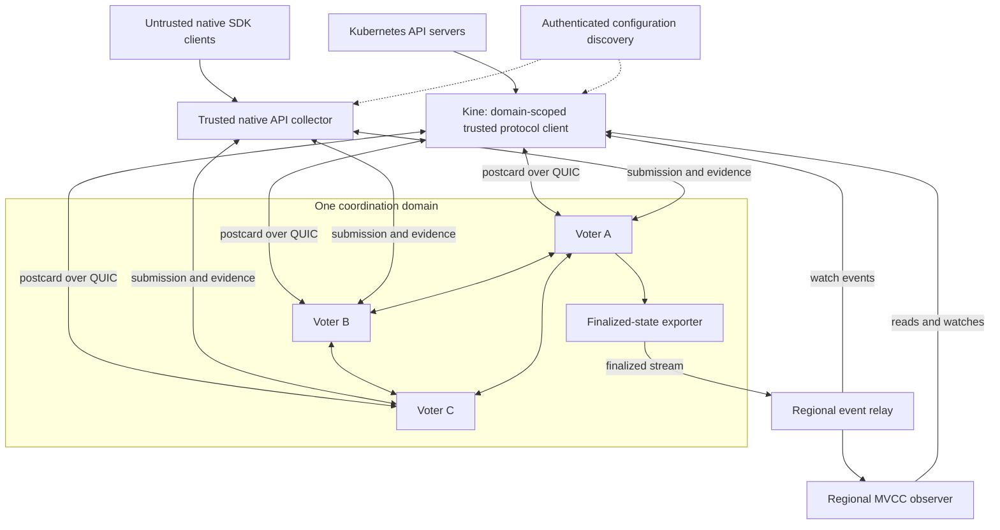
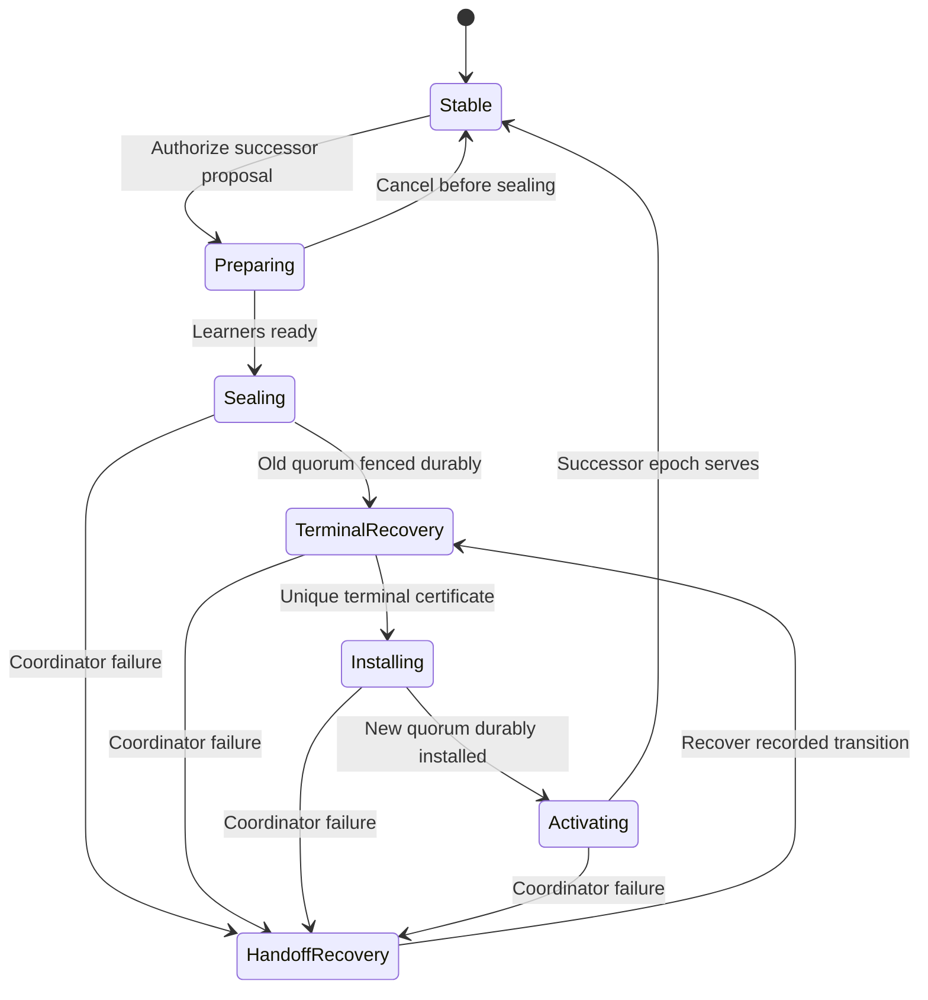
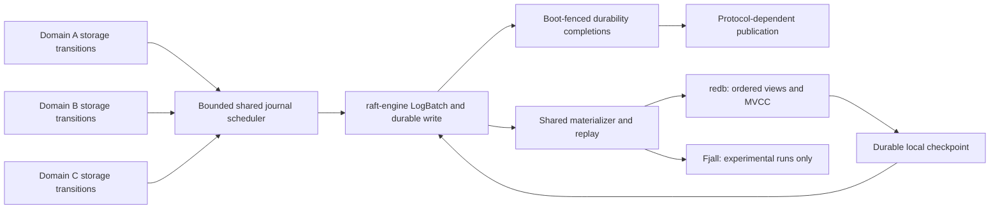
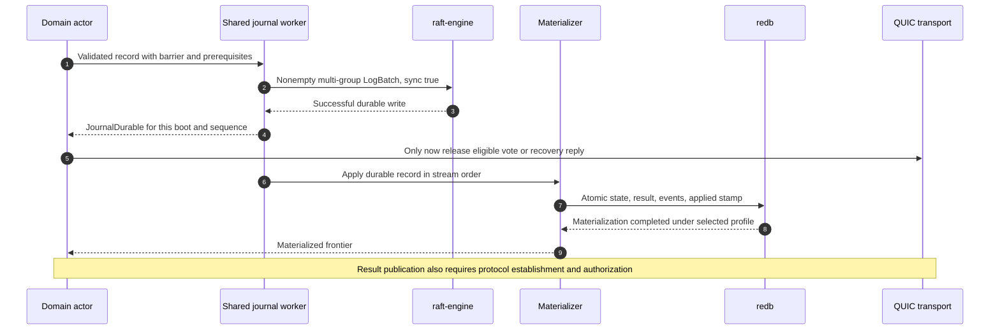

# TupleSky: implementation design v0.6

## Regional observers, client-aware membership, and a shared durable journal

**Status:** Proposed revision for implementation review; not a claim of implemented or proved extensions.  
**Date:** 2026-09-17.  
**Baseline:** `global-coordination-rust-design-v0.5.md`, dated 2026-09-12 [B1].  
**Companion:** [PR plan v1.3 update](tuplesky-pr-plan-v1.3-update.md).  
**Format:** Normative revision supplement. Apply the replacement map below to v0.5; unchanged baseline sections remain part of the design. This file is not a byte-for-byte consolidated copy of the original.  
**Naming:** TupleSky is the project name. Existing `coord-*` workspace names and ALPN identifiers are retained to avoid an unrelated mechanical rename.

> **Decision:** Run independent SwiftPaxos C2 groups with three voters by default and at most five voters per active configuration. Scale regional event distribution and appropriate reads through non-voting observers with no protocol-level count ceiling. Make Kine a domain-scoped, trusted TupleSky protocol client. Reuse `tikv/raft-engine` for a shared, durable, multi-group recovery journal; retain the common state-store abstraction with redb as the production materialized-state engine and Fjall as an experimental alternative. Do not introduce Raft consensus, per-request directory lookups, or observer acknowledgements into write completion.

## U0. Revision scope and provenance

The source baseline already contains watches, direct Kine integration, replicated lease renewals, deterministic simulation, checkpointing, and a sealed membership-handoff design. Those capabilities are extended here, not newly attributed to the Gemini Multi-Raft alternative. [B1, B2]

This supplement distinguishes three kinds of material:

* **Retained baseline:** the existing protocol/API/security requirements identified by baseline section number.
* **Conversation decisions:** voter limits, independently scalable observers, full-client Kine, and client-aware membership.
* **Proposed engineering:** concrete observer streams, journal/projection separation, checkpoint protocols, and qualification gates in this revision. External references establish library capabilities, not the correctness of these integrations.

### U0.1 Replacement and preservation map

| Baseline sections | v0.6 treatment |
|---|---|
| Header; 1; 2.1; 3 | Use TupleSky branding; promote multi-group hosting and observers to architectural goals; use U1-U2. |
| 2.2-2.3; 4 | Retain conservative domain-wide conflicts, identities, source-mapped SwiftPaxos transitions, and evidence predicates. Add U2, U6, and U7 identity/configuration rules. |
| 5.1 | Retain persistence-before-publication. Refine the meaning of storage completions using U8-U9. |
| 5.2; 17.1; 17.3; storage-related parts of 17.8-17.14 | Replace single-engine authority with the journal-plus-checkpoint authority described in U8-U9. Preserve shared logical codecs and application semantics. |
| 5.3; 17.6 | Retain quorum-safe protocol checkpoint/forgetting obligations. Distinguish them from local journal checkpoints and observer snapshots in U9. |
| 6; 19.5 | Retain the selected Kine semantics and atomic conditional primitives. Extend routing, collector trust, progress, and pin management in U3-U6. |
| 7 | Retain replicated native keepalives, conservative expiry, per-key Kine TTL mapping, and acquisition-scoped fencing. No adoption of Gemini's in-memory-only renewal contract. |
| 8-9; 10.1; 10.2; 10.4; 20 | Retain human/workload federation, deterministic authorization, node enrollment, credential lifecycle, and issuer separation. Extend observer/client roles without weakening them. |
| 10.3 | Retain the sealed handoff architecture and proof obligations; add operational and client details in U6-U7. |
| 11; 16; 18 | Extend packages, role-specific wire messages, and storage effects according to U2, U6, U8, U10. Preserve other dependency selections unless a review explicitly changes them. |
| 12; 14; 15; 21-23 | Add U11 qualification and revised gates. Preserve independent oracles, security gates, and production node-replacement requirements. |
| 24 | Retain original references. This update adds its own B/R references in U12. |

The original detailed OIDC flows, command semantics, wire bounds, and canonical encodings are not replaced by their brief summaries here. When a storage-specific statement in v0.5 assumes redb is the only authority, U8-U9 supersede that statement. All other baseline requirements remain applicable.

### U0.2 Deliberately unchanged contracts

One coordination domain remains the atomic transaction, revision, watch, lease, retry, and authorization boundary. No global revision is introduced across unrelated domains. Initially all replicated commands in one domain conflict, and execution position is distinct from a KV revision. The state planner still allocates a revision only for the specified KV mutations, not for every ballot, renewal, or storage write. [B1: Sections 2, 6, 7]

Native lease renewal remains replicated and durably established. Kine TTL values remain durations mapped to private per-key bindings, not native lease IDs. Kubernetes Lease objects remain ordinary stored API objects. Leadership changes and membership handoffs conservatively recover expiry authority; neither grants a client a fresh TTL measured from receipt of a delayed reply. [B1: Sections 6.6, 7]

Fjall experiments still start from fresh logical fixtures. Engine migration, live engine switching, source/target conversion, and mixed-engine production rollouts remain out of scope. The persistence change is a design change for a new implementation, not a supported migration tool for hypothetical existing deployments.

<a id="u1"></a>
## U1. Goals, deployment model, and limits

### U1.1 Primary product capability

Separate a small WAN write-authority set from independently placed state-serving capacity. The first observer milestone is useful even before observer-served linearizable reads: observers distribute complete committed event histories to regional Kine instances, while writes and current reads retain their authoritative path.

Support both a stretched Kubernetes cluster with regional API servers and independently homed tenant virtual clusters. A home region is a placement preference, not a correctness requirement. Moving one hosted database primary does not automatically move its Kubernetes domain. Physical worker/control-plane placement, endpoint routing, and the hosted workload's data plane remain separate decisions.

One group per domain is the first partitioning scheme. Multi-group hosting scales the tenant fleet; a single unusually large tenant still has one ordered history and one group's resource limits. Transparent intra-domain sharding and cross-group transactions are not introduced.

### U1.2 Replica roles

| Role | Votes | Counts toward five-voter maximum | Receives speculative protocol traffic | Main purpose |
|---|---:|---:|---:|---|
| Voting replica, including the leader | Yes | Yes | Yes | SwiftPaxos agreement, recovery, and durable state |
| MVCC observer | No | No | No | Finalized state, historical reads, watches, potential staging destination |
| Event relay | No | No | No | Bounded retained event history and subscription fan-out |
| Staging learner | No until activation | No until activation | Only reviewed catch-up/recovery material | Prepare a new voting incarnation |
| Trusted collector, including authorized Kine | No | No | Receives allowed completion evidence | Submission, validation, result collection |

An event relay is not automatically a full read replica. A fully caught-up observer is not automatically a voter. An authenticated peer is not automatically allowed to subscribe to every domain or receive voting state.

**Default voters = 3. Maximum voters per active epoch = 5.** Stable production configurations use three or five voters. A replacement of a five-voter group may temporarily involve six or more physical copies because staging observers do not count toward the cap. A sealed transition need not expose a four-voter normal-operation epoch when resizing three to five.

Observer count has no hard consensus limit. Per-domain, per-process, per-region, and per-connection quotas still govern memory, disk, catch-up bandwidth, subscriptions, and outstanding work. The management registry is paginated and must not be broadcast as one unbounded vector to all clients.

### U1.3 Fault tolerance and cost model

For v voters, ordinary progress requires the source-defined quorum and an available leader or completed recovery. Region placement must satisfy the selected outage budget. To survive loss of a region containing r voters, require:

`v - r >= floor(v / 2) + 1`.

Thus three voters need three separate regions to tolerate any one whole-region loss; a five-voter group can use 2-2-1 placement for that particular objective. Observer copies do not change quorum availability. These are placement calculations, not a stronger fault model.

Use `v` for voters and `o` for observers. Agreement dissemination remains O(v^2); finalized distribution is O(o) logical deliveries at a fixed voter factor. Do not turn it into O((v+o)^2) by enrolling observers in every vote broadcast. Cross-domain work scales with the sum of domain loads, not the square of total tenants.

Retain the baseline's matched performance evaluation. SwiftPaxos's message-delay claims are not universal end-to-end latency promises under recovery, overload, disk stalls, or arbitrary routing. Membership changes and observer reads have their own measured paths. [B1: Section 4.6]

<a id="u2"></a>
## U2. Architecture and trust boundaries



The exporter is a role, not another consensus leader. Initially one eligible voter serves a subscriber's finalized stream. Other eligible sources can resume it from the same established prefix. Source election is an availability/performance concern; it must not authorize new state or become a write-completion prerequisite.

### U2.1 Kine becomes an explicitly trusted collector

The original trusted collector responsibility can reside in a Kine backend component. This is a deliberate extension of the baseline trust boundary, not permission for arbitrary native users to submit trusted dependency metadata.

The domain-scoped Kine principal may submit canonical commands to all active voters and collect authorized result evidence. It must implement the same source-mapped acceptance predicates as the Rust collector. It cannot merely count a majority of replies, trust a leader result by itself, or merge replies for different paths, ballots, epochs, payloads, or replica incarnations. [B1: Sections 3-4]

Use one language-neutral collector specification and golden event traces, implemented in Rust and Go. Differential-test results over duplicates, loss, reordering, recovery, and epoch changes. Do not make an FFI transport or a second remote frontend mandatory just to avoid implementing the collector correctly in Go. A local trusted Rust sidecar remains an optional deployment composition, with its extra local cost measured separately.

Tenant authentication and authorization are enforced at voter admission and deterministic command execution as before. An `x-tenant-id`, observer endpoint, or configuration hint is routing information, not permission. Kine does not turn Kubernetes end-user identities into unverified TupleSky principals.

### U2.2 Connection topology

Keep warm connections only to needed voters, selected observers, sources/relays, and discovery endpoints. Multiplex group messages across authenticated node connections with per-group fair queues. Do not build a full mesh of all observers or make each client connect to every physical copy.

Control, command, watch, and bulk traffic keep separately bounded queues and the baseline's connection-level isolation. Share a destination budget so separate QUIC connections do not evade congestion/fairness controls. Relay reconnect storms and snapshots have admission limits. QUIC stream priority is not a guarantee that shared CPU, NIC, connection congestion, or disk cannot interfere.

The peer handshake binds role, domain scope, node generation, and capabilities. Observer identities cannot vote. Collector access permits only the evidence needed for its authorized domain. Preserve all baseline WIF issuer, TLS, rotation, and cold-start requirements.

<a id="u3"></a>
## U3. Finalized replication and observer lifecycle

### U3.1 Two streams that must not be confused

**Local recovery journal:** node-local protocol and storage transitions, including promises and unresolved votes. It is not a public changefeed and differs between replicas.

**Finalized domain stream:** immutable established execution results and deterministic state changes, ordered by domain execution position. This is the observer input. It contains no unestablished speculative result and does not expose another voter's private recovery obligations.

The finalized stream is a new internal contract, not an etcd watch reused as a complete replica image. Native watch events alone omit operations that change leases, policy, sessions, deduplication, or configuration without changing a KV revision.

A conceptual `FinalizedFrameV1` contains:

| Field | Required meaning |
|---|---|
| Cluster/restore identity and DomainId | Stable origin; prevent mixing restored histories or tenants |
| Configuration epoch / handoff link | Membership provenance; never a locally invented epoch |
| Execution position and previous-frame digest | Contiguous, established domain history, including non-KV commands |
| Command identity and result digest | Bind the frame to the immutable established outcome |
| Versioned deterministic state delta | Common replicated state only; no source-local ballot promise |
| KV revision and complete event batch | Zero or one new revision as specified by the operation; all events for it |
| Policy/session transition data | Permit ordered authorization and revocation handling |
| Retention/compaction information | Explicit floors and replay availability |
| Integrity and schema metadata | Detect corruption, wrong lineage, incompatible interpretation |

Wire-size bounds apply to nested data as well as outer framing. A large frame can use bounded transport chunks, but the observer may not expose any of it until reassembly, validation, and atomic application finish. A hash chain detects inconsistency; it is not a Byzantine quorum proof. Sources and replication channels remain within the declared trusted service boundary.

### U3.2 Establishment and publication

An exporter emits only a finalized frame supported by the baseline learning, dependency-closure, durability, execution, and authorization rules. A fast reply at one collector does not license a lagging source to guess an execution position. The source learns or recovers the necessary evidence first.

Export can lag client completion. This is allowed and measured. Neither source readiness nor observer application is required before the original mutation response. Watch latency and mutation latency remain separate metrics.

An observer atomically installs state changes, the full event batch, and its applied execution/revision frontier. It publishes events only from that committed local view, under a recoverable serving profile. A relay that does not retain local durable history can operate only as a disposable cache: after restart it must reacquire a validated source frontier and must not advertise a durable resume guarantee it cannot meet.

### U3.3 Snapshot and catch-up protocol

The join flow is `Authorized -> Installing -> CatchingUp -> Serving`, with `ReinstallRequired`, `Draining`, and `Quarantined` states.

A source opens a snapshot at an established prefix and reserves bounded replay from that boundary. The observer validates domain/restore identity, common checkpoint format, state digest, execution position, revision, compaction floor, and capabilities. It installs into an inactive generation and follows finalized frames strictly after that position. A source switch must match lineage and the last complete frame digest.

The observer never starts at a new source's latest head and silently skips the intervening history. A mismatched prefix is an error, not a duplicate to ignore. If required data was compacted or the bounded reservation expired, restart from a new checkpoint. Retention is not extended indefinitely because an observer is slow.

A materialized observer follows all common-state transitions for its domain. A prefix-filtered event relay can serve only the selected event capability and must not be advertised as promotable or as a full historical-read replica.

### U3.4 Retention and fan-out

Maintain separate limits for source replay retention, observer retained MVCC/history, client watch buffers, and protocol recovery state. Physical source log truncation must not depend on the slowest observer. Under pressure, reject new followers, shed subscriptions with explicit resumable errors, or force reinstallation; never discard silently within an established watch.

Regional relays use bounded fan-out, loop-free source selection, source health/backoff, and per-domain budgets. Source and relay acknowledgement is flow control only. It neither counts toward consensus nor proves fresh read authority.

Adding or removing an observer changes discovery/authorization state but not the voting membership epoch. Registry changes can themselves be ordinary durable management commands; that does not make the observer a voter.

<a id="u4"></a>
## U4. Kine routing, list/watch continuity, and progress

Kine already provides separate backend methods for mutations, revisioned reads, watches, and revision/compaction metadata at the original inspected pin. This permits backend-specific routing; it does not provide replica discovery or consistency selection automatically. [R5]

### U4.1 Default routing

| Request | Initial implementation | Later qualified optimization |
|---|---|---|
| Create, conditional update/delete, compact, native mutation | Full collector path to voters | Same; pipeline and batch without weakening response evidence |
| Current linearizable read / CurrentRevision | Baseline authoritative read command | Authoritative read barrier followed by an observer read |
| Explicit historical Get/List/Count | Eligible MVCC observer after permission checks | Same, with load-aware source selection |
| Watch / event following | Regional observer or event relay | Regional fan-out trees and equivalent source failover |
| Native lease renewal | Replicated renewal through voters | Batch replicated renewals; no observer-local success |
| Kine TTL expiry | Conditional authoritative command | Never an unconditional local observer deletion |

Prefer nearby capable observers but fall back to another region or an eligible voter-backed stream. Lag and compaction availability are part of source selection. Do not hide overload by returning stale current reads.

### U4.2 List-to-watch continuity

A list returns a snapshot with revision R. The associated underlying etcd-style event watch must cover revisions after that snapshot under the pinned API's inclusive/exclusive conventions; the adapter uses tested translation rather than assuming that every layer interprets a start cursor identically.

The observer must retain the required suffix or return compaction/future-revision errors. Attach replay and live following with an atomic registration boundary, or subscribe first and deduplicate the replay overlap. Preserve complete-revision boundaries during failover. Never split a multi-key transaction across externally visible partial revisions.

For a watch-only relay, the initial list can come from a voter or a different MVCC observer. A shared physical endpoint is not required; a consistent revision/history contract is.

### U4.3 Progress is an ordered statement

Maintain four distinct frontiers: source finalized, observer applied, Kine processed, and per-watch delivered. A progress notification for revision P is legal only after all matching events through P have crossed that watch's event delivery ordering point.

`progress_revision <= delivered_complete_revision`.

A filter with no matching event may advance when the pipeline has processed complete source history through P; the last matching object's modification revision is not the progress frontier. The source's newest revision is not a substitute for downstream progress. A heartbeat showing connectivity is not a freshness certificate.

Use ordered internal markers. Queue a marker behind the events it covers; propagate it through replay, filtering, buffering, and gRPC delivery. Do not let a separate progress goroutine overtake event batches. These are implementation requirements derived from the retained ordered-watch contract. [B1: Section 6.6; R7]

A watch resumes from the last complete delivered revision. A failed send has an uncertain delivery outcome: internal replay may duplicate, but adapter deduplication and revision handling must prevent gaps and illegal ordering. Cancellation, credential expiration, compaction, and source replacement must unblock pending waits.

### U4.4 Kine pin and compatibility change

Retain `746ef418669e2131e1d4447024ac7489ee2bb5d0` as the original compatibility reference, not a claim that it is current. Its backend includes `WaitForSyncTo(revision)` without context/error and watches carry event slices. The source on `master` inspected for this update instead exposes `EventBatch.CurrentRev`, `ListStream`, and a changed Watch signature, without that old wait method. [R5, R6]

**Do not mix those interfaces in one purported implementation.** The Kine integration PR must choose a full commit, record any small fork patches, freeze Go fixtures, and test the complete watch bridge. For the original pin, make synchronization cancellable/error-aware in the reviewed compatibility patch. For a newer pin, map ordered stream markers to its batch/progress machinery and audit filtering before delivery. Moving to a newer pin is a named compatibility change with API-server conformance, not a silent dependency refresh.

Neither inspected Backend signature carries the etcd serializable-read flag directly. Default to the stronger current-read behavior unless the chosen edge patch explicitly preserves a weaker-read request end to end. Positive historical revision does not eliminate authorization checks.

<a id="u5"></a>
## U5. Observer reads and authorization

### U5.1 Historical and current reads

A historical read is eligible locally only when the observer has applied through the needed domain execution frontier, retains the required MVCC history, and can supply a consistent pinned snapshot. Count, pagination, keys-only, and range boundary behavior must match the selected Kine contract. A local latest snapshot is not automatically a linearizable current read.

For a later read-barrier optimization, submit a real authoritative `ReadFence` after request invocation. It is a command in the domain's conservative ordering, not an unproved adaptation of Raft ReadIndex. The established response binds domain/restore identity, execution position, KV revision, request identity, range/scope, authorization decision, and required schema to the requested read.

The observer waits for the corresponding established execution position, then reads at the certified snapshot revision with the bound request options. Pin history while this bounded request is active, or fail and reissue a new authoritative fence if compaction made it unavailable. Return the revision corresponding to the actual certified snapshot. Do not return a newer state with an older header. Internal authorization state is indexed by execution position even when KV revision has not advanced.

This still performs WAN coordination for freshness; the benefit is serving bulk data and range scans regionally. Batching concurrent fences is a future optimization with a defined temporal cut, not reuse of an arbitrary old fence for later requests. Plain reads through the established baseline path remain the initial release behavior.

### U5.2 No stale authorization shortcut

An observer does not trust locally stale policy to admit a new protected read or subscription. Initial authorization is an authoritative, request-bound decision through the existing domain mechanisms. Federation token verification alone is not sufficient when a replicated policy/session revocation is relevant.

An established subscription consumes common-state authorization changes in order. No event after its revocation boundary may be sent under the revoked subscription. Historical event delivery and reconnects use the baseline watch authorization policy; membership or source changes cannot reset it. Long-lived connections still expire and reauthenticate according to the original credential contract. A disconnected observer must not mint or refresh authorization from stale state.

Initial domain-scoped Kine authorization does not require a new external OIDC exchange per watch event. External identity verification, authoritative domain permission decisions, and event delivery are different operations. Do not weaken immediate ordered policy rules into an undocumented time-based cache merely to remove the control-path check.

Observer credential scope, relay scope, audit records, and snapshot encryption requirements are part of production security qualification. Full-state observers are trusted with the common state they replicate; this feature is not end-to-end encryption against those operators.

<a id="u6"></a>
## U6. Client-aware membership and discovery

### U6.1 Separate identities and generations

| Name | Scope and rule |
|---|---|
| Cluster/restore identity | Changes under the explicit disaster-restore procedure; never inferred from endpoints |
| DomainId | Stable namespace for commands, revisions, leases, and retries |
| Configuration epoch | Exact authorized voter incarnations and quorum-policy identity |
| Ballot | Leadership and source-defined fast-quorum selection inside an epoch |
| Endpoint generation | Address/certificate routing update; does not grant voting authority |
| Observer catalog generation | Read/event topology; no effect on quorum size |
| LocalJournalSeq | Node-local storage order only; see U8 |

Keep the baseline command identity stable across endpoint, ballot, and membership transitions. The epoch belongs to the protocol envelope/evidence context, not the canonical logical request hash. Reusing the same retry identity with a different operation remains an error.

### U6.2 Authoritative records

A conceptual `GroupConfigurationV1` binds the domain, restore identity, monotonic epoch, exact voter IDs and incarnation/key bindings, supported quorum policy, prior-epoch certificate hash, and activation evidence. Transport endpoint hints and preferred regions may accompany it but are not authority by themselves.

`BallotConfigurationV1` binds the permitted leader and C2 fast majority under the established ballot. The client cannot choose a different arbitrary fastest majority for each request. Retain historical key/configuration evidence needed to validate delayed completion and recovery without live issuer access. [B1: Sections 4, 10]

The authority-chain representation is a required protocol extension: the implementation/model must define how clients validate genesis trust, each handoff's old and new quorum evidence, and ballot updates. A signature from an arbitrary discovery node or a numerically higher epoch alone is insufficient.

### U6.3 Distribution and stale clients

Collectors cache authoritative voter configuration and warm the small voter connection set. Use background configuration subscriptions, authenticated newer-configuration hints on errors/responses, and a redundant bootstrap path when all cached addresses fail. No mandatory directory lookup is added to every successful operation.

Reconfiguration does not wait for acknowledgements from all clients. Persistent server-side epoch fencing provides safety; refresh provides liveness. A cached directory can remain temporarily stale without becoming a second authority.

On a hint, verify provenance, install the new configuration monotonically, and reconnect as needed. Scope vote collections to one command, epoch, ballot, and exact evidence predicate. Never combine two old votes and one new vote into a majority. Replica IDs are distinct from connections; two connections from one identity count once.

A request completed before the old epoch's seal may have a valid late response. Do not discard it solely because the client has learned a newer epoch. Validate its historical evidence and retry outcome under the retained rules. A timeout does not prove nonexecution. Reissue unresolved work with the same logical identity; the successor's transferred deduplication state resolves it.

### U6.4 Client crash and source disappearance

A Kine process can disappear after sending a command to only some voters. Existing missing-payload repair and recovery must resolve dependencies without waiting for that process. Its client credentials need not remain valid for the cluster to recover already accepted data. Permission to reveal a recovered result is still checked separately.

Bootstrap, retry, watch resumption, and protocol collection use bounded deadlines and cancellation. A removed node may return with an old disk or certificate; the epoch/incarnation fence, not DNS freshness, must prevent it from resuming a voting role.

<a id="u7"></a>
## U7. Membership lifecycle and regional placement

### U7.1 Two levels of optimization

First tune leader and fixed fast quorum within the current voter set using the reviewed new-ballot recovery mechanism. This moves no bulk replica state and does not create a new membership epoch. Observe the source protocol's pause/recovery rules; it is not a local routing rewrite.

Move or resize voters only for sustained locality changes, maintenance, capacity, region evacuation, or fault-tolerance policy. Use hard region/failure-domain constraints before latency scoring. Score the measured client-to-voter and voter-to-voter topology, steady load, and relevant single-region outage cases; include the slow path. Set hysteresis, minimum residence, and fleet migration budgets. Do not chase momentary packet jitter.

### U7.2 One serialized sealed handoff per group



The diagram is lifecycle guidance, not a complete proof of a reconfiguration algorithm. In particular the durable seal, unique terminal choice, and recovery-quorum rules remain the original explicit proof/model obligations. [B1: Section 10.3]

**Prepare:** authorize the intended new voter set and incarnation identities. Catch up staging observers without letting them vote. Readiness includes verified common checkpoint, bounded tail, sufficient disk, compatible schema, and ability to accept the terminal handoff state. An up-to-date KV revision alone is insufficient.

**Seal:** an authorized old-configuration quorum durably rejects further ordinary voting across all old ballots. Handoff-only recovery is still allowed. Frontend admission closure alone is not a seal; stale Kine clients and in-flight messages exist. The seal reports must preserve all state needed to recover potentially completed work.

**Terminal recovery:** resolve all potentially chosen commands and dependency closure. Select one terminal successor certificate using the reviewed old-configuration rules. It binds final common state, execution/revision boundaries, retry results/floors, lease/authority state, policy/session state, checkpoint lineage, and exact successor configuration. A normal KV write saying "new membership" is not enough.

**Install and activate:** the required new quorum durably installs the same terminal state and activation evidence before ordinary service. Preserve logical identity, revision continuity, command identities, and fencing scope. Restart and observer import cannot roll them back. After the irreversible seal, controller recovery completes the recorded transition; it does not silently revert to the old epoch.

Existing native lease authority recovery remains conservative and replicated. End the old finalized stream at the certified boundary and link the new epoch's stream to it. Observers must follow that continuity, not restart revision numbering or treat missing transition data as no-op history.

### U7.3 Availability and administrative policy

Background catch-up normally occurs while old voters serve. Final sealing/recovery/activation can pause new mutations. Queue within a bounded budget or return an explicit retryable error; do not promise a fixed pause independent of WAN failures and disk lag.

A functioning old quorum may replace an absent member; the removed node's participation is not required. Without an authorized old quorum or previously established handoff, observers cannot form a new authoritative majority. Loss of that authority invokes disaster recovery with separately disclosed guarantees.

Client refresh and observer catch-up do not block activation. A management controller proposes and monitors operations but does not override quorum decisions. Its own storage/discovery must not depend solely on the tenant being recovered. Promotion, demotion, tenant deletion, and physical data cleanup are distinct durable lifecycle operations.

<a id="u8"></a>
## U8. Persistence decision: reuse raft-engine, not Raft consensus

### U8.1 Verified fit and dependency choice

The upstream engine batches durable writes across logical groups and keeps one shared log stream. Its README distinguishes entry indexes from key/value state held in memory and describes explicit log reclamation. These capabilities make it a candidate for a shared TupleSky recovery journal, not a replacement for the full MVCC state database. [R1]

Upstream commit `097c499a19fbb38754c73aa2f31532329df7c0c6` adds extensible value codecs, allowing custom encoded entries through `MessageExt<Codec>` and `add_entries_with`. Implement a TupleSky postcard codec; there is no built-in postcard codec in that change. Pin this revision or a separately reviewed descendant. Do not assume an older published crate has those interfaces. [R2, R3]

Proposed manifest selection, to compile and qualify in the dependency PR:

```toml
[dependencies]
raft-engine = { git = "https://github.com/tikv/raft-engine", rev = "097c499a19fbb38754c73aa2f31532329df7c0c6", default-features = false }
```

Record the resolved feature graph and any required platform features in Cargo.lock/build metadata. No unreviewed floating branch or implicit local patch is permitted. Do not enable JSON/bincode just to obtain custom-codec support. Existing transitive protobuf support in the dependency does not put protobuf on TupleSky's native path. The integration does not use `raft-rs`, `RawNode`, Raft terms, or Raft's `Ready` lifecycle.

### U8.2 New authority boundary

The authoritative local recovery state becomes:

> **The published durable local checkpoint plus the validated durable suffix of the shared raft-engine journal.**

redb supplies ordered snapshots and materialized protocol/application tables. It is not an independently authoritative second database whose latest contents can override the journal. Fjall uses the same materialization contract in isolated experiments.

This replaces v0.5's single-transactional-engine authority. There is no distributed transaction between raft-engine and redb. Correctness comes from write-ahead ordering, atomic materialization, explicit checkpoint publication, and replay. A redb commit does not compensate for a missing required journal record.



### U8.3 Group namespaces and sequences

Allocate a persistent `StorageStreamId: u64` for each local `(cluster, domain, replica_incarnation)` stream. The mapping and allocator high-water mark are journaled in reserved node metadata before the stream is used. Never hash an arbitrary DomainId into a collision-prone u64 or recycle an ID while old files/evidence can exist. A local journal shard is shared by many domains; a small bounded shard count can distribute disks and failure blast radius.

Each stream has strictly increasing `LocalJournalSeq`. This is the engine entry index; it is neither a SwiftPaxos command ordering position nor a KV revision, ballot, fencing token, or global sequence across replicas. The existing common `StoreSeq` becomes this local semantic commit stamp (or a one-to-one explicitly mapped stamp); do not maintain two uncorrelated counters for the same transition.

SwiftPaxos proposals form protocol state, not a Raft log to overwrite after an election. Journal records are append-only descriptions of validated transitions. Use new entries for later votes/adoption/seals; never truncate on a leadership change by applying Raft conflict rules.

### U8.4 Record types and atomic batches

The common storage layer creates a bounded `JournalRecordV1` containing domain/incarnation identity, local sequence, format, batch digest, prerequisites, and one validated immutable set of logical mutations. Use typed variants for protocol updates, established application updates, local checkpoint publication, and lifecycle metadata. The existing logical collection IDs and codecs remain common across adapters.

An application record includes everything needed to replay its atomic outcome: common state changes, exact execution position, revision/events, deterministic results, deduplication updates, lease/policy changes, and applicable guards. Replay does not rerun ambient authentication, random generation, clock decisions, or mutable external lookups.

A per-domain serialization owner validates transition preconditions against the accepted durable head. Initially allow only one uncompleted authoritative journal batch per local stream. This bounds ordering ambiguity while still batching many domains. A later pipeline must prove reservations/predecessor ordering before permitting concurrent same-stream writes.

Use entry storage for payloads and journal records. Keep engine key/value metadata small (identity, heads, checkpoint references); do not store the entire MVCC database or an unbounded payload map in that in-memory indexed KV area. Version the postcard record independently from transport messages. Validate declared sizes, nested allocation, digest, index, and domain before accepting replay.

### U8.5 Group commit and publication

The concrete append unit is `LogBatch`, not the alternative draft's hypothetical `WriteBatch::commit`. Submit a nonempty batch with `Engine::write(&mut batch, true)`. Engine write success returns a byte count, not a TupleSky durability sequence. Map completion back to the exact submitted stream sequences and boot-fenced barrier IDs. [R4]

A bounded shared scheduler drains already-ready work across domains; it does not wait a fixed multi-millisecond interval while idle. Retain the initial 64-transition/256-KiB batch targets as tunables, with a separate admitted maximum-record path so a valid larger atomic command is not split incorrectly. Preserve order within each domain. Do not merge two application plans based on the same old state as if they were serially valid.

Either form an explicit multi-group batch or allow bounded concurrent callers to use the engine's internal write grouping. Do not add a second hidden timer-based batcher. Measure actual bytes and records per sync instead of assuming one sync per operation or one physical write syscall per group.



`JournalDurable` is not `Established`, and `Materialized` is not proof of quorum learning. `SendAfterDurable` can release only the votes justified by that record and its prerequisites. An old-boot completion cannot release any current-process effect. Correctly durable fast results retain the baseline evidence path; the observer exporter is allowed to follow later.

### U8.6 Initial and optimized materialization profiles

**Initial journaled-strict profile:** journal all authoritative transitions first; apply to redb using the baseline Immediate/local-two-phase durable transaction contract. It is the conservative bring-up profile. It reuses cross-group journal commit but can incur additional materialization synchronizations. Do not advertise that the whole operation is now one fsync.

**Qualified journaled-replay profile:** after U9 and J06 qualification, allow atomic working-state materialization without a per-transaction persistence barrier. Durable redo plus a published durable checkpoint still protects acknowledged outcomes. A crash discards or revalidates the working generation and replays; it never treats an unsynchronized database as the only recovery source.

This is not a global operator switch to weaken durability. Expose separate typed internal methods for atomic working-state application and durable checkpoint publication. Keep the old `commit_durable` interface for the strict profile and checkpoints; never return its success from an unsynchronized transaction. Benchmark profiles by explicit names and equal external guarantees. The replay profile is disabled until its recovery matrix passes, not silently enabled because a WAL exists.

### U8.7 Failures, resource isolation, and upstream behavior

At the inspected pin, a synchronization failure in the nonempty write-group path uses `expect`, so it can panic rather than return an ordinary error. Handle this as fail-stop for the affected journal service/process; do not catch a worker panic and continue serving from that shared engine. Convenience compaction also is not a durable semantic checkpoint operation. [R4]

An indeterminate append or sync failure blocks all dependent effects and admission for affected streams. A definite pre-append guard rejection can be replanned; a timeout after submission cannot. Recovery reconciles durable records, not an assumption that a failed caller rolled back. Shared disk corruption may affect many domains; separate scheduler fairness from actual disk failure isolation.

Limit journal backlog, retained bytes, per-domain outstanding transitions, recovery memory, and writer CPU. A few busy tenants must not consume all write queue capacity. Entry-index memory and rewrite/maintenance cost remain real even though the journal is shared.

Do not interpret `purge_expired_files` suggestions as permission to delete application-required history. The service decides safe retention using U9. Maintenance and checkpoints run under I/O budgets and are included in latency tests. Inability to maintain a safe bound causes explicit backpressure, not eviction of unresolved accepted commands.

<a id="u9"></a>
## U9. Replay, checkpoints, and recovery correctness

### U9.1 Three different checkpoints

| Checkpoint | Contains | May replace existing voter's local obligations? |
|---|---|---|
| `LocalRecoveryCheckpointV1` | Complete local logical storage image at LocalJournalSeq, including promises, unresolved votes/payloads, seals, common state, and retry metadata | Yes, only for its exact local incarnation and with the journal publication chain |
| Existing `SharedCheckpointV1` | Agreed common state and required protocol floor/lineage for catch-up | No; excludes unrelated local promises and unresolved obligations |
| Observer/event snapshot | Capability-specific common state/history and finalized cursor | No; may not even be a full MVCC image |

A local checkpoint is not a cross-engine migration artifact. It is created and restored through the selected adapter's normal same-engine lifecycle. Common logical encodings remain useful for verification and experiments; no operational engine-conversion command is added.

### U9.2 Frontiers and invariants

For each local stream, track `J` (known durable journal head), `M` (materialized head), and `C` (durably published local checkpoint boundary). At a valid checkpoint boundary, require `C <= M <= J`. Preserve execution/revision frontiers separately. Working state can be visible inside the database before a completion notification; public views must still satisfy finalized-history and durable-source gates.

After a crash, recover the actual valid suffix and derive a fresh J; do not trust a volatile head or reuse old completion tokens. A checkpoint digest alone does not assert that its bytes were synchronized, nor does an engine-returned byte count establish J.

The core invariant is that every released storage-dependent effect can be justified from the published checkpoint plus retained journal and the separate protocol evidence. Compaction and file deletion must preserve that invariant after every individual crash point.

### U9.3 Crash-safe local checkpoint publication

1. Select a pinned atomic materialized view at a fully represented local sequence C. Ensure every local protocol obligation at or below C is in that view. Freeze the chosen view or use a verified engine snapshot; do not copy a mutating live file and call it a checkpoint.
2. Produce the complete inactive checkpoint, manifest, and identity/sequence/digest metadata. Synchronize contents and required filesystem directory/rename metadata. Keep the prior published checkpoint and journal intact.
3. Append a `PublishLocalCheckpoint` record referring to C and the validated manifest; make that record durable through the journal. This pointer, not the newest-looking directory name, selects the recoverable checkpoint.
4. Only after successful publication may a later durable compaction batch retire journal entries covered by C. Express compaction explicitly and synchronize its batch; do not use a convenience unsynchronized truncation as authority.
5. Allow engine reclamation and delete old checkpoints only after the surviving publication chain and retained suffix are sufficient. Cleanup is retryable and idempotent. Never remove the only published checkpoint before its replacement is established.

The publication record itself is newer than C and remains part of the suffix until covered by a later checkpoint. Compact only the prefix actually represented by C. New unresolved protocol records after C remain journaled; older unresolved obligations stay in the checkpoint until the protocol safely resolves/forgets them.

### U9.4 Startup and replay

Acquire node/shard and domain locks, verify expected identities/formats, recover the journal, validate the selected checkpoint, and reconstruct working state through the durable suffix. In the replay profile, start from an immutable published checkpoint rather than assuming the unsynchronized live redb image is recoverable. A missing/corrupt selected checkpoint or a gap inside a required durable suffix quarantines the stream/shard.

Reapply records in LocalJournalSeq order, validating prior sequence/digest and deterministic guards. Restore exact recorded results and metadata; do not emit network votes, credentials, watches, or user responses during raw replay. After local reconstruction, perform the necessary SwiftPaxos protocol recovery before ordinary authoritative service. A restored observer uses the observer catch-up state machine instead.

A recovered complete but previously unacknowledged journal record may exist after a lost completion. Treat it consistently with the protocol and retry semantics; do not overwrite it or infer that it was publicly acknowledged. Detect malformed records explicitly. A decode error is not end-of-scan or a missing optional row.

The very first voter initialization must durably establish genesis identity and an initial recovery baseline before serving. `open-existing` remains mandatory on restart. Missing storage is not permission to initialize a new voter with the same identity. Shared shard IDs and local checkpoint pointers are part of backup/recovery metadata.

### U9.5 Physical retention is not protocol forgetting

A full local checkpoint permits compacting earlier local redo while retaining unresolved promises/votes in that checkpoint. It does not justify forgetting them. The original quorum-safe checkpoint/floor protocol remains necessary to bound semantic recovery history with an absent voter. [B1: Section 5.3; B2: PR-51 through PR-53]

Similarly, MVCC compaction, observer event retention, native retry floors, and physical raft-engine file reclamation have different eligibility rules. A single universal "compact revision" cannot replace them. An observer must reinstall when its bounded history is unavailable instead of pinning consensus storage indefinitely.

### U9.6 Crash acceptance matrix

| Crash point | Required outcome |
|---|---|
| Before journal append | No durability-dependent publication; retry may proceed under ordinary identity rules |
| During append or sync | No success assumed; valid recovered record may be present or absent; incomplete invalid tail handled only under qualified engine recovery rules |
| Journal durable, completion lost | Recover record and its obligations; do not replay old-boot callbacks |
| Journal durable, redb not applied | Replay materializes the same state/result |
| redb applied, response lost | Deduplication returns the same authorized outcome |
| Checkpoint files complete, pointer not durable | Old publication remains authoritative; new files are unactivated garbage |
| Pointer durable, truncation incomplete | New checkpoint plus overlapping suffix recovers without duplicate effects |
| Journal compacted, old checkpoint cleanup interrupted | Published new checkpoint plus retained suffix suffices |
| Sync panic or shared-shard corruption | Affected service stops publishing; recovery/quarantine is explicit |

Do not treat arbitrary damage to a previously durable prefix as an ordinary torn-tail case. Pin and test the exact engine recovery mode; a permissive corruption mode cannot silently discard acknowledged state.

<a id="u10"></a>
## U10. Implementation boundaries and configuration

### U10.1 Package changes

| Package | v0.6 responsibility |
|---|---|
| `coord-consensus` | Same pure SwiftPaxos core; explicit role/epoch/ballot evidence predicates and handoff inputs |
| `coord-state` | Same deterministic common state planner and domain semantics |
| `coord-journal-api` | Immutable journal records, barriers, local sequences, errors, checkpoint publication contract |
| `coord-journal-raft-engine` | Pinned engine mapping, postcard ValueCodec, shared write grouping, physical maintenance, filesystem test adapter |
| `coord-storage` | Common guards/codecs, redo planning, replay/materialization, visibility gates, local recovery checkpoint orchestration |
| `coord-store-api` | Ordered views and atomic materialization; explicitly separate durable checkpoint and strict transaction capabilities |
| `coord-storage-redb` / `coord-storage-fjall` | Physical state adapters; no duplicate MVCC, retry, or lease implementations |
| `coord-observer` | Finalized export/import, capability negotiation, cursor validation, retention and relay scheduling |
| `coord-membership` | Typed configuration records, persistent handoff orchestration, discovery and placement policy; no bypass of consensus |
| `coord-client`, `coord-api`, `adapters/kine` | Shared protocol spec; epoch-aware collection/routing/retries; observer read/watch routing |
| `coord-sim`, `coord-store-testkit` | Deterministic journal/materializer models, real-engine fault campaigns, common histories |

The deterministic core still emits effects. New event names distinguish `JournalDurable`, `Materialized`, `LocalCheckpointPublished`, and protocol `Established`. Node generation and boot ID fence every asynchronous completion. File I/O, real clocks, issuer queries, and thread scheduling remain outside pure transitions.

### U10.2 Example operator configuration

Illustrative schema to implement, not a currently accepted server config:

```toml
config_version = 2
role = "voter-frontend-observer"

[voting_policy]
default_voters = 3
max_voters = 5
stable_voter_counts = [3, 5]

[journal]
engine = "raft-engine"
shards = 1
profile = "journaled-strict-v1"
max_ready_batch_records = 64
max_ready_batch_bytes = 262144
wait_to_fill_idle_batch = false
# Root, shard identity, and format must match persistent manifests.

[state]
engine = "redb"
# Fjall belongs to separate disposable experiment compositions.

[observers]
# Deliberately no protocol max_observer_count.
max_live_subscriptions_per_process = 4096
max_buffer_bytes_per_subscription = 1048576
catchup_bytes_per_second = 16777216
source_fanout_limit = 32

[membership]
max_concurrent_handoffs_per_domain = 1
placement_mode = "operator-approved"

[kine]
watch_source = "regional-observer-with-fallback"
current_read_path = "authoritative"
config_refresh = "push-hints-bootstrap"
```

Numerical queue/fan-out examples are starting limits to measure, not capacity claims or semantic constraints. Limits must accommodate admitted atomic operations or reject them before acceptance. A single record larger than the batch target uses the separately bounded large-record path; a record larger than the hard admitted command limit is rejected consistently.

Store discovery metadata and source health separately from quorum authority. Roles can coexist on a machine, but queues, credentials, disk budgets, and readiness are role-specific. Observer disk lag must not masquerade as voter quorum failure.

<a id="u11"></a>
## U11. Testing, performance experiments, and release gates

### U11.1 Deterministic and real-engine evidence

Retain the baseline's independent history oracle and three fidelity levels. Add a shared-journal model with successful/failed/indeterminate writes, lost completions, checkpoint pointer publication, and per-domain scheduling. Actual engine fault tests use raft-engine's filesystem extension and the existing redb byte-fault adapter. The exposed filesystem interface is useful, but does not by itself control background threads or every directory operation. Audit those boundaries and label any uncontrolled schedules. [R8]

Inject process death around each journal write, sync, projection commit, checkpoint file/rename/sync, publication, compaction, and source-switch boundary. Prevent destructors from flushing a simulated pre-crash image. Keep real subprocess-kill tests as an independent check. An in-memory journal model is not byte-level engine qualification.

The simulator must execute the same protocol and materialization code as production. Retain deterministic RNG substreams, replay manifests, source/build/lock digests, schedule minimization, and deliberately faulty variants to check the oracle.

### U11.2 Required new scenarios

| Area | Minimum scenario set |
|---|---|
| Collector/configuration | Stale client during seal; mixed epochs; duplicate voter connections; wrong incarnation; delayed valid old completion; configuration hints forged or rolled back |
| Client death | Kine dies after partial fan-out; no client returns; missing payload/dependency repaired; same logical retry after epoch change |
| Observers | Long outage; history compacted; reconnect to behind source; wrong lineage; source dies between replay and live attach; filtered watch with no matching events |
| Progress | Events queued when progress arrives; partial revision chunks; authorization changes without KV changes; multiple watches with different delivery lag |
| Reads | Barrier established after invocation; observer behind execution but same KV revision; compaction while waiting; denied/revoked reader; cross-domain token misuse |
| Membership | Competing successors; coordinator dies at each state; removed member restarts old disk; new quorum partly installed; resize 3 to 5 and 5 to 3 |
| Persistence | Shared group batch, completion reordering, nonempty sync panic, disk full, torn unacknowledged tail, corrupt durable prefix, checkpoint/truncate crashes |
| Isolation | Hot tenant, stalled watch, relay storm, snapshot flood, maintenance rewrite, and a lagging projection while unrelated domains continue |
| Authorization | Wrong observer role votes; policy changes during replay; cached stale grant on reconnect; credential expiry and issuer outage |

Model three- and five-voter instances and small observer/client populations; increase load sizes in simulation and integration tests. Finite models support the proof review but do not claim an unrestricted correctness proof.

### U11.3 Experiment matrix

Compare matched external durability/consistency, same regions, equivalent resource budgets, and the actual conservative revision semantics. Report native and Kine paths separately. Preserve comparisons with ordinary Raft/Multi-Paxos and an all-to-all acknowledgement baseline. Do not attribute all direct-reply benefit to the SwiftPaxos fast path.

New axes are 3/5 voters; 0/1/10/100 observers (load targets, not promised supported counts); home-local/distributed/migrating clients; one hot/many sparse domains; direct voter watches versus observers/relays; single-domain versus shared journal; strict versus qualified replay materialization; and redb versus independent Fjall experiment runs.

Report p50/p95/p99/p99.9 mutation latency, event-observation latency by region, current-read latency, sustained load at a stated latency objective, syncs and durable bytes per operation, records per journal group, observer lag, source fan-out bytes, queue time, memory/index size, checkpoint/purge cost, handoff interruption, full recovery time, and expiry lateness. Include source failure, one unavailable voter, compaction, and real auth in measured runs.

Do not predeclare the replay profile a speedup or the strict profile one-fsync. Keep observer placement benefits distinct from faster consensus and from API-server cache behavior.

### U11.4 Revised gates

| Gate | Required addition |
|---|---|
| Protocol/storage preview | Journal-before-vote and replay invariants, fixed membership, collector parity; no unsafe public deployment |
| Kine/observer preview | Pinned adapter, complete event replay, progress/cancel correctness, role authorization, failure fallback |
| Operational replacement | Original quorum-safe forgetting and sealed handoff plus client epoch handling, observer promotion discipline, shared-journal checkpoint recovery |
| Production strict profile | Real engine crash/panic tests, platform qualification, bounded resources, mixed-fault histories, security review |
| Replay materialization enablement | Complete recovery source and restart proof obligations, full dual-engine crash matrix, reproducible measured benefit; otherwise remain disabled |

The companion plan preserves the original task identities and adds explicit tasks instead of pretending the original single-store acceptance tests automatically validate the new authority boundary.

<a id="u12"></a>
## U12. Sources and audit notes

The following are the sources for this revision, inspected on 2026-09-17 unless stated otherwise. Reference claims are limited to the identified behavior; observer, membership, and journal integration mechanisms above are proposed TupleSky engineering.

**[B1]** `global-coordination-rust-design-v0.5.md`, dated 2026-09-12, File Library upload modified 2026-09-13T01:36:26Z. Source baseline for exact protocol/API/auth/lease contracts. Retrieved relevant source sections for this update; this supplement does not reproduce untouched source text.

**[B2]** `global-coordination-rust-pr-plan-v1.2.md`, File Library upload modified 2026-09-13T01:36:22Z. Original 70 tasks: PR-01 through PR-66 and PR-S01 through PR-S04.

**[R1]** raft-engine README at the selected revision: engine scope, write grouping, in-memory indexing, shared log and maintenance.  
<https://raw.githubusercontent.com/tikv/raft-engine/097c499a19fbb38754c73aa2f31532329df7c0c6/README.md>

**[R2]** raft-engine codec merge, PR #411, commit `097c499a19fbb38754c73aa2f31532329df7c0c6`: extensible codecs, not a native postcard implementation.  
<https://github.com/tikv/raft-engine/commit/097c499a19fbb38754c73aa2f31532329df7c0c6>

**[R3]** `ValueCodec` at that revision: interface to implement for postcard.  
<https://raw.githubusercontent.com/tikv/raft-engine/097c499a19fbb38754c73aa2f31532329df7c0c6/src/value_codec.rs>

**[R4]** Engine source at that revision: write and synchronization behavior, typed entry APIs, compaction helpers.  
<https://raw.githubusercontent.com/tikv/raft-engine/097c499a19fbb38754c73aa2f31532329df7c0c6/src/engine.rs>

**[R5]** Kine backend types at the original design's full pin; source compatibility reference, not a current-version claim.  
<https://raw.githubusercontent.com/k3s-io/kine/746ef418669e2131e1d4447024ac7489ee2bb5d0/pkg/server/types.go>

**[R6]** Kine backend types on master as inspected: evidence of interface drift. Floating URL is diagnostic only; implementation must select a full revision.  
<https://raw.githubusercontent.com/k3s-io/kine/master/pkg/server/types.go>

**[R7]** etcd v3.6 API guarantees, retained semantic reference for the supported subset, not a claim of full etcd replacement.  
<https://etcd.io/docs/v3.6/learning/api_guarantees/>

**[R8]** raft-engine filesystem abstraction at the selected pin; useful injection boundary, not automatic deterministic execution.  
<https://raw.githubusercontent.com/tikv/raft-engine/097c499a19fbb38754c73aa2f31532329df7c0c6/src/env/mod.rs>

The SwiftPaxos protocol/proof, federation standards, selected redb profile, and other retained dependency sources remain those in [B1: Section 24]. No crate build, Rust/Go conformance run, distributed model check, storage crash campaign, or performance result is claimed by this document revision.
