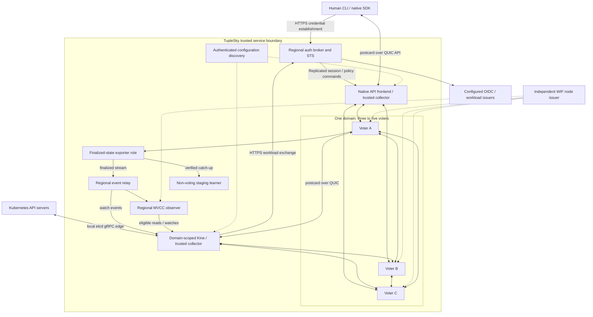
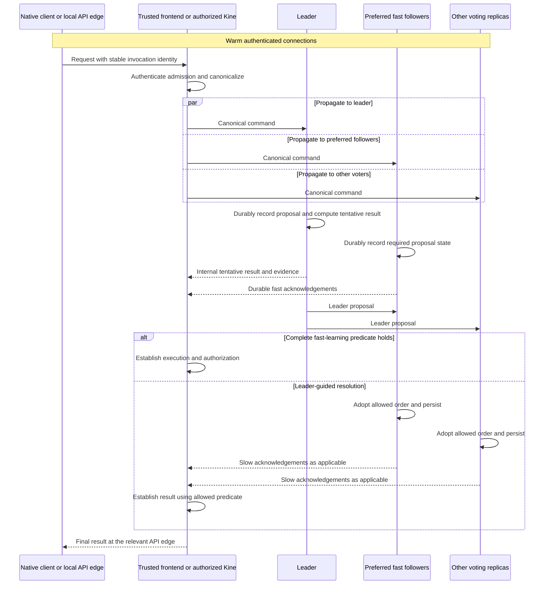
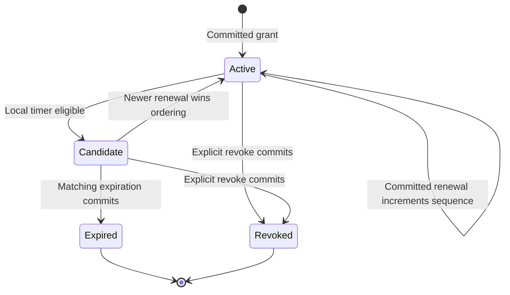
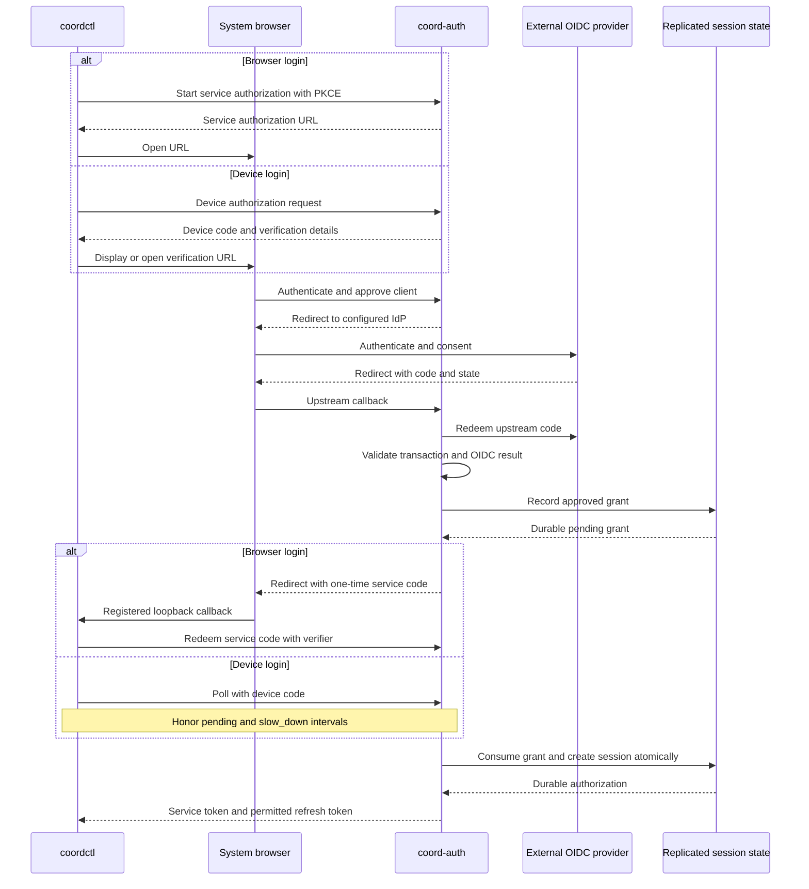
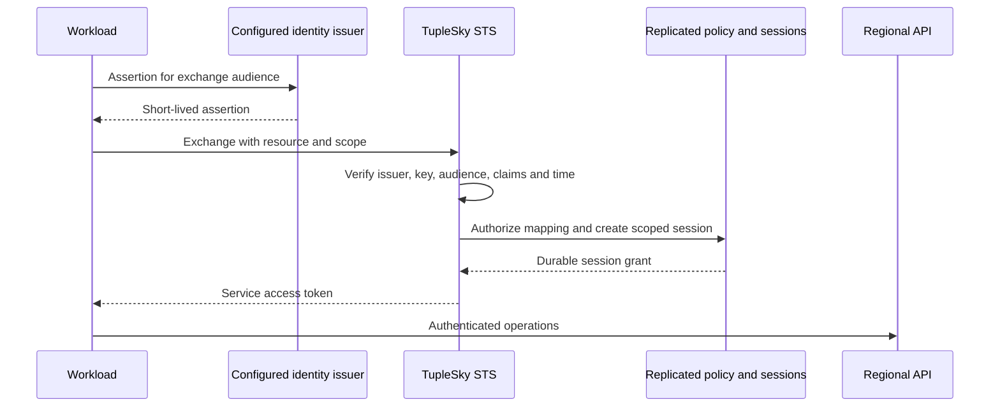
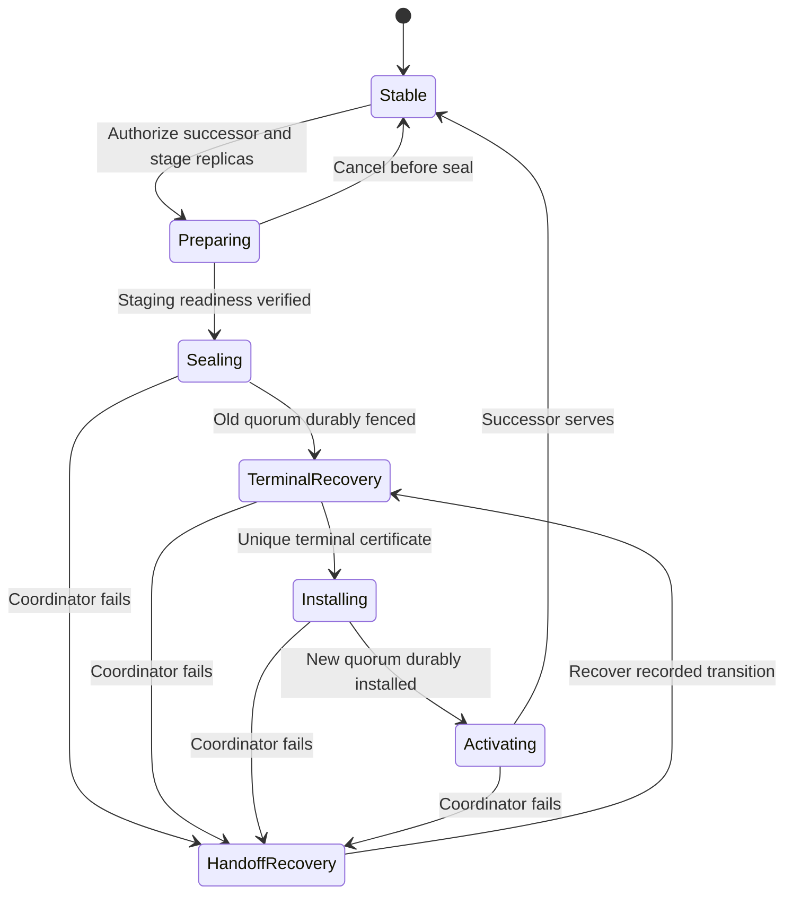
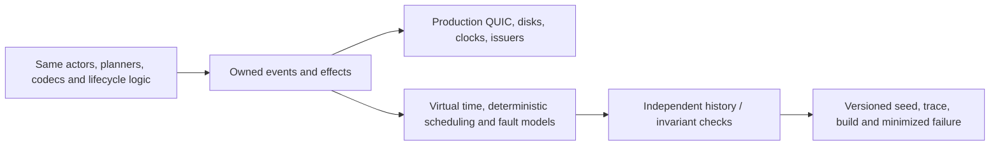
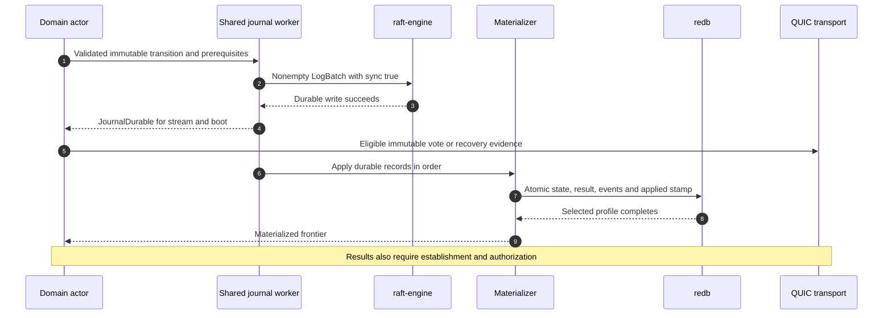
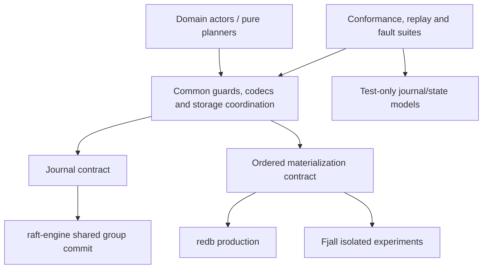

# TupleSky implementation design

**Status:** Proposed implementation design for review, consolidated v0.7.  
**Date:** 2026-09-17.  
**Companion:** [Implementation PR plan](tuplesky-prs-plan.md).  
**Implementation:** Rust 2024; selected dependency candidates and build gates are in Section 16.  
**Scope:** A self-contained specification. Earlier baselines, supplements and amendments are not additional normative documents. Existing `coord-*` package names, proposed ALPN identifiers and wire identifiers remain unchanged.

> **Decision:** Independent SwiftPaxos C2 groups, three voters by default and at most five voters per active configuration; postcard over warm QUIC connections; domain-scoped trusted Kine collectors; independently scalable non-voting read/watch observers; shared `tikv/raft-engine` group commits with journal/checkpoint recovery authority and redb materialization. Fjall remains an isolated performance experiment. Native renewals are replicated. Public durability, strict authorization and source-exact learning/recovery predicates are not traded for latency.

This document integrates the original protocol, API, identity, lease and storage detail with the observer, membership and shared-journal revision and the reviewed upstream-issue safeguards. It describes engineering to implement and qualify, not an already implemented service, an unrestricted proof of its extensions, a compiled dependency lockfile or measured performance.

## Review navigation

| Area | Sections |
|---|---|
| Goals, domains, roles and trust | [1](#s1), [2](#s2), [3](#s3) |
| SwiftPaxos, publication and recovery safeguards | [4](#s4), [5](#s5), [18](#s18) |
| KV, Kine, finalized streams, observers and watches | [6](#s6), [19](#s19) |
| Leases, human/workload identity and membership | [7](#s7), [8](#s8), [9](#s9), [10](#s10), [20](#s20) |
| Stack, journal, state materialization and checkpoints | [11](#s11), [16](#s16), [17](#s17) |
| Simulation, operations, evaluation and gates | [12](#s12), [13](#s13), [14](#s14), [15](#s15), [21](#s21), [22](#s22), [23](#s23) |
| Sources and provenance | [24](#s24) |

<a id="s1"></a>
## 1. Goals, scope and assumptions

The service provides small, security-sensitive coordination state across regions: configuration, compare-and-swap, ownership records, distributed locks, service registrations, renewable leases and a Kine-backed Kubernetes storage profile. Availability requires a quorum. An isolated minority must not acknowledge new mutations or claim fresh reads.

The first implementation contains KV range operations, atomic transactions, revisions, watches, compaction, lease grant/renew/revoke/expiration, federated human/workload sessions and authenticated replica communication. The same Rust state machine and consensus implementation run under production I/O and deterministic simulation.

<a id="s1-1"></a>
### 1.1 Explicit non-goals

This is not a bulk database, a Byzantine-fault-tolerant system, a multi-master eventually consistent store, or a wire-compatible implementation of every etcd API. Kubernetes storage through a tested Kine adapter is in scope; unmodified Kubernetes clients do not speak native QUIC directly. No promise is made of region-local writes during partitions, lossless recovery after destruction of a quorum's durable state or exact wall-clock expiration during outages. Cross-group transactions and transparent intra-domain sharding are deferred.

Storage-engine migration, live engine switching, authoritative dual writes, cross-engine conversion and mixed-engine production deployment are not deliverables. Alternative state engines run from fresh, independent fixtures and need not read an existing engine's database. Ordinary same-engine recovery, service snapshots, schema upgrades, membership changes and disaster recovery retain their own requirements.

<a id="s1-2"></a>
### 1.2 Fault and trust model

| Area | Assumption and contract |
|---|---|
| Consensus | Crash/recovery failures; delayed, lost, duplicated and reordered messages; eventual synchrony for progress. |
| Durability | A successful qualified barrier survives the stated process/OS/storage failures. Detected corruption quarantines state. Storage that promises durability and subsequently loses it is outside ordinary failure assumptions. |
| Deployment | Failure budgets count voting replicas and actual failure domains, not just region labels. Collectors and observers add no quorum resilience. |
| Security | External clients and networks are untrusted. Authorized voters, collectors, state-serving observers, identity validators and their authorities are trusted for their declared roles. |
| Time | Consensus safety does not require synchronized clocks. Authentication and real-time lease guarantees have separate clock assumptions. |
| Identity | WIF establishes identity under configured trust, not software integrity, exclusive possession of a voter identity or permission to vote. |

A compromised authorized voter is outside SwiftPaxos's crash-fault model. Rust, mTLS, WIF and short-lived credentials reduce particular risks without changing that model. Full-state observers are trusted with the common state they replicate; this is not end-to-end encryption against those operators.

<a id="s1-3"></a>
### 1.3 Primary product capability

Separate a small WAN write-authority set from independently placed state-serving capacity. The initial observer milestone is useful before observer-based linearizable reads: distribute complete finalized event history to regional Kine instances while mutations and current reads retain their authoritative paths.

Support a stretched Kubernetes cluster with regional API servers and independently homed tenant virtual clusters. Home region is a placement preference, not a correctness requirement. Moving a hosted database primary does not automatically move the Kubernetes domain. Worker placement, control-plane placement, endpoint routing and data-plane replication are separate concerns.

One consensus group per domain is the initial partitioning. Multi-group hosting scales the tenant fleet; one unusually large tenant still has one ordered history and one group's capacity limits. No fleet-wide sequencer is introduced.

<a id="s1-4"></a>
### 1.4 Replica roles and limits

| Role | Votes | Counts toward five-voter maximum | Input and purpose |
|---|---:|---:|---|
| Voting replica, including leader | Yes | Yes | Protocol messages, agreement, recovery and durable local obligations |
| MVCC observer | No | No | Finalized common state, historical reads, watches and potential staging destination |
| Event relay | No | No | Bounded event history and subscription fan-out; not necessarily an MVCC database |
| Staging learner | Not before activation | Not before activation | Reviewed checkpoint/catch-up and terminal recovery material |
| Trusted collector, including authorized Kine | No | No | Canonical submission, authorized completion evidence and result validation |

Default to three voters; maximum five per active configuration. Stable production configurations use three or five. Replacing a voter can temporarily require more than five physical copies because staging replicas do not count as voters. A sealed resize may move directly from three to five without exposing a four-voter ordinary-service epoch.

Observers have no protocol-level count ceiling, but per-domain/process/region/connection quotas bound memory, disk, catch-up bandwidth, subscriptions and work. Paginate the observer registry; do not broadcast an unbounded registry to every client. A caught-up observer is not automatically a voter, a relay is not automatically a read replica, and an authenticated connection is not permission for every domain or role.

<a id="s1-5"></a>
### 1.5 Fault-tolerance and cost model

For `v` voters, preserving majority availability after loss of a region containing `r` voters requires `v - r >= floor(v / 2) + 1`, in addition to usable communication and recovery. Three voters therefore require three separate regions to survive any one whole-region outage. Five can use 2-2-1 placement for that objective; five copies do not imply tolerance of two arbitrary regional outages.

Use `v` for voters and `o` for observers. Agreement dissemination is O(v²); finalized distribution is O(o) logical deliveries at fixed voter factor. Do not create O((v+o)²) communication by enrolling observers in vote broadcast. Aggregate work scales with domain load and replication factor, not the square of the number of tenants.

Message-delay bounds are not universal elapsed-time promises under arbitrary routing, overload, storage stalls or recovery. Measure consensus latency, event visibility, current reads and handoff interruption separately.

<a id="s2"></a>
## 2. Compatibility domains rather than a service-wide revision

<a id="s2-1"></a>
### 2.1 Compatibility boundary

Kine implements a Kubernetes-oriented etcd subset. Its backend exposes revisioned reads, conditional create/update/delete, watches, current revision and compaction; it need not speak SQL or gRPC internally. [S19-S21]

One coordination domain, normally one Kine-backed Kubernetes cluster, is the transaction, revision, watch, lease, retry and authorization boundary. Independent domains have independent histories. A one-domain test composition is an early increment; production hosts isolated groups with node-wide and per-domain budgets.

The selected etcd semantics assign one increasing KV revision to a mutation, including an atomic transaction affecting several keys. Kine must not invent local revisions, allocate independent regional counters or sort already acknowledged changes by wall time. Its scalar revision and replay history are shared within the domain. [S3]

<a id="s2-2"></a>
### 2.2 Ordering and optimization boundary

Initially every replicated command in a domain conflicts with every other command in that domain. This is a conservative reference contract, not a claim that every possible native API fundamentally requires unrelated keys to conflict. Returned revisions, MVCC/watch history, ranges, lease attachments, policy and deduplication matter to independence.

Revision allocation is part of deterministic application of the established command, not a separate WAN round trip. Moving it into Kine would merely move the ordering problem. Optimize single-command conditional operations, pipelining, bounded batching and later certified read barriers against the conservative implementation. Any finer conflict predicate needs a separate correctness review.

A future revision-free native profile could expose per-object versions and dependency-aware cursors, but it would have a different contract. Do not claim transparent mapping into one Kine revision history without additional ordering. Measure fast-path rate for concurrent disjoint-key writers as well as hot keys. QUIC stream independence removes transport ordering constraints, not semantic dependencies.

<a id="s2-3"></a>
### 2.3 Identities and counters

| Identifier | Meaning |
|---|---|
| Cluster/restore identity | Distinguishes a live deployment from a restored history |
| DomainId | Transaction, revision, watch, lease, retry and authorization namespace |
| Execution position | Established command position, including reads/internal commands; never speculative receipt order |
| KV revision | Increases once when a command actually mutates KV; all its changes share it |
| Configuration epoch | Exact authorized voting identities and quorum-policy binding |
| Ballot | Leadership and source-defined fast-quorum selection subordinate to an epoch |
| Endpoint/catalog generation | Routing or observer discovery update, not voting authority |
| LocalJournalSeq | One local storage stream's recoverable order, not any public or consensus counter |

No transaction, native lease, watch or fencing sequence spans independent domains in v1. Equal numeric revisions in different domains are incomparable. Domain-local sessions avoid a cross-domain authorization transaction per request. Shared external identity infrastructure still submits session/policy changes to each relevant domain. Section 10.5 defines configuration provenance; Section 17.3 defines local storage identities.

<a id="s3"></a>
## 3. Architecture and trust boundaries



Voting deployments may colocate a frontend and auth broker, but those roles have separate credentials and work budgets. Additional collectors can be near clients without becoming voters. The collector fans out to replicas rather than blindly forwarding every request to the leader.

The public API never exposes tentative values. Even a tentative read can disclose data; telling an untrusted SDK not to use it does not undo disclosure. A speculative permission grant cannot release protected data or usable credentials. Native SDKs therefore speak to a trusted frontend, which validates complete execution and authorization evidence before releasing a result. Include the frontend/client leg in measurements.

<a id="s3-1"></a>
### 3.1 Transport and compatibility boundaries

Kine performs etcd protobuf conversion only at the compatibility edge and is deployed beside or within the API server's region. The authorized adapter talks directly to the assigned voters. It does not require another remote frontend hop. The native SDK continues to use a frontend because it is not a trusted protocol collector.

No HTTP/2, gRPC, SQL polling or mandatory JSON conversion is on the native inter-region data path. Browser/device flows, issuer discovery, JWKS, introspection when configured and RFC 8693 exchange remain HTTPS credential-establishment traffic. Already authenticated operations must not perform another global token exchange per request.

<a id="s3-2"></a>
### 3.2 Kine as a trusted collector

A domain-scoped Kine principal may submit canonical commands to all active voters and collect the evidence permitted for that domain. It must implement the same source-mapped learning predicates as the Rust collector. A leader result alone, a loosely counted majority, or votes mixed across paths, ballots, epochs, payloads or incarnations cannot establish success.

Specify one language-neutral collector contract with Rust/Go golden event traces. Differential-test loss, duplication, reordering, recovery and configuration changes. Go implements client collection, not a second voting state machine. An optional local Rust sidecar is a deployment composition to measure, not a mandatory FFI or extra WAN gateway.

Untrusted clients cannot submit trusted dependency metadata. Voters enforce admission and deterministic authorization; a tenant header or configuration hint is routing, not permission. Kine does not automatically forward Kubernetes end-user identities as TupleSky identities.

<a id="s3-3"></a>
### 3.3 Sparse connection topology

Maintain warm connections only to needed voters, selected observers, sources/relays and discovery endpoints. Multiplex group messages across authenticated connections with fair per-group queues. No fleet-wide observer mesh or connection from every client to every copy is required.

Control, commands, watches and bulk traffic have separately bounded queues/connections and a shared destination budget. More connections cannot evade congestion/fairness limits. Relay reconnect storms, catch-up and snapshots are admitted work. QUIC priority is not a guarantee against shared NIC, CPU, disk or path interference.

Handshakes bind role, domain scope, node generation and capabilities. An observer cannot vote. Collector credentials permit only needed evidence for the authorized domain. The exporter is a role, not another consensus leader: multiple eligible sources can resume the same established prefix, but source selection grants no authority and never gates ordinary write completion.

<a id="s4"></a>
## 4. SwiftPaxos integration

<a id="s4-1"></a>
### 4.1 Source protocol and evidence

Implement normal-operation, response-learning and recovery rules from the SwiftPaxos paper with a handler-to-Rust-to-test traceability table. The Go repository is a prototype reference, not a production correctness oracle. [S1, S2]

Every fast and slow quorum includes the ballot's leader. Slow quorums are majorities; any two fast quorums must intersect in a majority. C1 uses more than three quarters of replicas; C2 uses one fixed majority. Fast learning considers dependency paths, not only matching direct dependency sets. Recovery retains potentially chosen commands, including applicable preaccepted state. Membership extension details are not supplied by the paper. [S1]

<a id="s4-2"></a>
### 4.2 Quorum policy

Use C2 by default. The exact preferred fast set, including its leader, is immutable within a ballot. A different choice requires a higher ballot and recovery even if leadership stays on the same node.

| Voters | Slow majority | C2 fixed fast set | C1 alternative |
|---:|---:|---:|---:|
| 3 | 2 | 2 | 3 |
| 5 | 3 | 3 | 4 |

An arbitrary fastest majority for each request is not C2. Two independently chosen three-member sets among five can intersect in only one member. Losing a fixed-fast member disables that fast path, not necessarily the slow path; leader failure requires recovery.

Initial placement profiles are one voter in each of three regions or five across three in 2-2-1 placement. These are replica-count arguments, not protection from correlated provider, issuer or network failures. Start with an operator-configured quorum table indexed by configuration/leader. Measurements select it before activation, never independently at each node. Retain historical quorum definitions for recovery; updates never reinterpret an old ballot.

<a id="s4-3"></a>
### 4.3 Request and result flow



Kine occupies G rather than sending to a second remote collector. The diagram omits peer acknowledgement broadcasts for readability; it is not replacement pseudocode. All broadcasts, dependency processing and guards remain required. Opening a stream on a warm connection is not another request/accept handshake.

Evidence binds cluster, domain, configuration epoch, ballot, command and relevant order information. Never count an identity twice, including when frontend and voter are colocated. Messages on different streams/connections can arrive independently; stream IDs or arrival order do not establish semantic order. Keep bounded dependency queues and fetch missing prerequisites without blocking socket processing.

A QUIC ACK confirms transport receipt only, not protocol acceptance, durable storage, permission, learning or authorization to reply.

<a id="s4-4"></a>
### 4.4 Command identity and malicious clients

External clients do not supply executable peer messages or trusted dependency metadata. The collector validates limits and canonicalizes the request.

```text
retry_key  = (cluster_id, domain_id, session_id, client_instance_id, request_sequence)
command_id = H(protocol_domain, retry_key, canonical_operation)
```

Canonical operations include domain, tenant, operation type, keys, values, comparisons and semantic flags. Tokens, connection IDs, stream IDs, framing and negotiated transport representation are excluded. Freeze a versioned logical schema and normalize unordered collections before postcard encoding. Postcard alone does not supply application canonicalization or schema evolution.

Allocate nondeterministic IDs/input once at the trusted boundary or derive them from the stable identity. Replicas and retries must reproduce lease IDs, session outcomes and response values; replay never generates new randomness. Different payloads under one retry key produce different command hashes, but the state machine accepts at most the first and rejects mismatches with `RequestIdentityConflict`. Collision resistance is an explicit assumption.

Membership epoch is an evidence/envelope context, not a reason to change the logical request hash on retry. Preserve request identity across endpoint, token, ballot and configuration changes.

<a id="s4-5"></a>
### 4.5 Speculation and side effects

Tentative execution uses a copy-on-write overlay over committed state and may calculate responses, candidate revisions and authorization. It cannot publish events, sign usable sessions, issue node credentials, invoke external services or modify committed materialization. Discard superseded overlays. Established outcomes must be reproducible from recovered durable history.

Large speculative results may use the ordinary finalized-execution path; label its latency. An established speculative response can precede materialization only when the complete learning predicate determines command, predecessor order, authorization and exact result durably. No extra volatile COMMIT broadcast is assumed to have reached a quorum.

<a id="s4-6"></a>
### 4.6 Performance hypotheses

The paper's two-/three-message-delay bounds apply under its model. The service adds durable storage, computation, authorization, queueing and frontend delivery. Measure leader-result and acknowledgement arrivals separately and account for the actual slowest required evidence. Missing fast evidence does not justify an artificial fast-path timeout before processing valid slow evidence. [S1]

Warm-path budgets include client/collector transit, admission, actual parallel proposal/evidence paths with persistence and final delivery. Measure cold TLS and credential setup separately. Do not add a sequential region-to-leader RPC before protocol fan-out. QUIC avoids cross-stream transport blocking but does not remove WAN propagation, congestion, shared flow control or semantic dependency waits. [S13, S18]

Compare equivalently durable Raft/Multi-Paxos and an all-to-all-acknowledgement Paxos baseline to distinguish direct evidence delivery from SwiftPaxos fast learning. Measure p99/p99.9 under loss, load, snapshots and disk stalls; no universal fastest-protocol or zero-jitter claim is made.

<a id="s4-7"></a>
### 4.7 Atomic initialization and dependency visibility

Installing initialized command state and exposing it through conflict/dependency lookup must be one atomic logical transition. A single actor does not suffice if it updates an index, yields for storage and handles another proposal before completing initialization. Journal payload binding, phase, dependencies and necessary index changes together; rebuild derived indexes from complete authoritative records. Pending ingress and missing-payload placeholders cannot masquerade as processed commands. [X1]

Enforce source normal-operation guards: direct dependencies are ACCEPT or COMMIT before entering ACCEPT; dependencies are committed before entering COMMIT; dependencies have executed before finalized execution. Recovery follows its own source-mapped cases. These guards do not disable the separately qualified speculative-result path. Speculation still cannot reach ordinary reads, watches or irreversible side effects. [S1]

<a id="s4-8"></a>
### 4.8 Durable recovery cut and logical outbox

A recovery response summarizes authoritative protocol state at a defined durable cut, not an arbitrary available database view. Use the actor's durable state or wait for materialization through the cut and read a consistent snapshot. Persist-before-send alone does not prevent this prohibited composition:

```text
Projection is materialized through local sequence 40.
Sequence 41 durably records a vote, and its acknowledgement is released.
Recovery reads the sequence-40 projection and omits the voting obligation.
```

This is an illustrative integration counterexample, not a reproduced upstream trace. Before authorizing a higher-ballot reply, stop admitting new old-ballot voting transitions, resolve submitted journal work relative to the cut, durably establish the new promise, and include all source-required recovery state. Timeout or missing completion does not prove absence. Reconcile indeterminate writes or stop serving; do not guess or blindly union historical dependency sets.

Define actor-owned logical publication of immutable eligible evidence separately from physical transmission. Each vote-producing effect binds domain, replica incarnation, boot, membership epoch, ballot and prerequisite durable state. A late callback may update valid durability bookkeeping without authorizing a newly obsolete vote. Boot fencing alone is insufficient for same-process elections.

Previously authorized old evidence can arrive late; never relabel it or combine configurations. Dropping a queue cannot recall transmitted packets. Historical completion can remain valid after configuration refresh; retain stable retries. Recovery need not wait for every old packet to reach every peer. Per-domain cuts and effect ordering are compatible with cross-domain group commit, subject to model/refinement review. [X2]

<a id="s4-9"></a>
### 4.9 Recovery selection and stable publication

One leader selects the recovery Sync result and followers adopt it. Different local progress phases are not themselves divergent committed dependencies. Follow source ballot selection and possible-fast-decision recovery, not a generic highest-phase-wins merge. Validate command/dependency equivalence where eligible accepted candidates must agree. Unexpected incompatible accepted candidates stop recovery with diagnostic evidence; normal preaccept disagreement remains valid input. [S1, X2, X3]

Canonical deterministic choice aids reproducibility wherever the protocol allows choice, but does not prove it safe. Durably bind the selected result to epoch/ballot before publishing Sync. After crash, reuse it or enter a valid new ballot; do not publish incompatible results under one identity.

<a id="s4-10"></a>
### 4.10 Upstream review boundary

The 2026-09-17 review of issues #1/#2 and code `35c69365f1c7737a08e237bfbaf828ee68897080` found implementation/paper-invariant scheduling differences. The maintainer acknowledges ordering differences but argues weaker properties suffice. The reviewed discussions contain neither a completed replacement proof nor a demonstrated end-to-end consensus safety failure. Do not label them a proved fundamental protocol flaw or a fully resolved correctness question. Status is not assumed unchanged after that review. [X1-X3]

Sections 4.7-4.9 are TupleSky requirements, not a claim that upstream traces or a full formal proof ran here. Section 21.6 defines regression schedules. These findings identify no raft-engine defect; the service must correctly compose storage, authoritative snapshots and publication.

<a id="s5"></a>
## 5. Durable state, recovery and bounded storage

<a id="s5-1"></a>
### 5.1 Persistence before publication

Disk completion is an input event. Issuing a write or producing a message does not establish durability.

| Publication | Required durable support |
|---|---|
| New promise / recovery response | Promised ballot and complete source-required recovery state at its cut |
| Fast acknowledgement | Payload, vote, path/order evidence and stable prerequisite dependencies |
| Leader reply used for learning | Corresponding recoverable proposal/payload state |
| Slow acknowledgement | Valid adopted leader order and prerequisite acceptance state |
| Finalized application result | Recoverable established command and atomic application/deduplication outcome, materialized or deterministically replayable |
| Checkpoint readiness | Complete validated checkpoint, identity and required recovery-floor metadata |

The persistence mapping is a crash-recovery extension to qualify; a crash-stop proof does not automatically cover storage. Test crashes before/after every barrier/publication. Recovery must reproduce acknowledged outcomes even when all volatile commit notifications vanished; it cannot assume an extra COMMIT marker was durably broadcast before reply.

<a id="s5-2"></a>
### 5.2 Authoritative storage layout

The local recovery authority is **a published durable local checkpoint plus the validated durable suffix of the shared raft-engine journal**. redb supplies ordered materialized protocol/application views. It is not a second independent authority allowed to override the journal. Fjall uses the common materialization contract only in isolated experiments.

There is no atomic transaction across raft-engine and redb. Write-ahead ordering, immutable records, atomic materialization, checkpoint publication and replay provide the composition contract. A projection commit cannot compensate for a missing required journal transition.

Persist cluster/configuration/incarnation identity, promises and recovered ballots, unresolved payloads/votes/dependencies, execution/results, MVCC, lease generations, sessions, retries/floors, policies and retention/checkpoint metadata. Rebuild clocks/timers, transport state and speculative overlays after restart. Engine reader snapshots do not themselves implement historical KV revisions.

The initial strict profile journals first and then uses the selected durable redb transaction. A separately gated replay profile permits atomic unsynchronized working-state materialization only when published checkpoint and durable redo suffice to reconstruct it. Never return `commit_durable` success for a weaker transaction. Sections 17.3 and 17.16 are the complete contracts.

<a id="s5-3"></a>
### 5.3 Protocol checkpoints and forgetting

MVCC compaction, physical journal reclamation and semantic consensus forgetting differ. A complete local checkpoint can replace old redo while preserving unresolved votes inside that checkpoint; it does not authorize forgetting them.

The first correctness increment trims protocol state only after every configured voter durably acknowledges the same checkpoint/floor. An unavailable voter can therefore delay trimming; bound retained state and backpressure. This is a reference increment, not the production availability target.

Production uses a modeled quorum-certified checkpoint protocol. Its certificate binds configuration, executed prefix, state hash, format and recovery floor. Signers retain the complete checkpoint durably. Every permitted recovery must discover/honor the highest applicable activated floor and obtain its state before voting. A lagging replica cannot vote from discarded history.

Copying a snapshot to a majority is not the activation proof. Check intersections, competing floors and delayed traffic; pre-floor messages cannot resurrect forgotten state. Preserve unresolved suffix commands, retry outcomes and required dependency/path closure. A checkpoint is not a time stamp or license to discard unknown commands. Bound outstanding bytes/commands/speculation; reject new work instead of evicting accepted obligations.

<a id="s5-4"></a>
### 5.4 State loss and disaster recovery

Lost/rolled-back voter storage cannot restart as an empty voter under the same identity. Reintroduce it as a learner with a new authorized generation through membership. Renewed WIF/certificates erase no voting obligations.

Ordinary recovery preserves identity and acknowledged outcomes within the stated budget. Backup restore is a separate workflow: new cluster/restore identity, invalidated old sessions, revoked restored leases, watch resynchronization, explicit external fencing transition and an RPO determined by backup. Do not expose rewound revisions as the same live history. Losing old quorum authority does not authorize observers to self-promote.

<a id="s6"></a>
## 6. KV, transactions, Kine, observers and watches

<a id="s6-1"></a>
### 6.1 Public API

Expose native `coord.v1` commands over postcard/QUIC, a Rust SDK and `coordctl`. Names below are typed commands, not gRPC services. Kine implements the tested Kubernetes subset through a registered native backend, not SQL emulation. A parallel Rust etcd gRPC server is not a v1 requirement.

Every operation belongs to one domain. Kine binds an endpoint to one domain and cannot combine revisions from several. Native clients may use richer transactions and leases than the selected Kine bridge.

| API | Contract |
|---|---|
| Range | Exact key or half-open interval, latest linearizable by default, explicit historical revision, bounded pagination |
| Put | Create/update, optional prior value and lease attachment, consistent create/mod/version metadata |
| DeleteRange | Atomic bounded deletion with optional previous values |
| Txn | Compare version/create/mod revision/value/lease; execute exactly one success/failure branch atomically |
| Watch | Ordered resumable revision history, atomic revision batches, compaction and slow-consumer errors |
| Compact | Ordered MVCC retention floor; physical maintenance follows asynchronously |
| LeaseGrant/KeepAlive/Revoke/TimeToLive | Section 7 |
| Identity/session/membership | Explicit native operations, not approximated via etcd username/password |

Initially exclude nested transactions and multiple writes to the same key within a transaction. Reject unsupported requests explicitly instead of silently altering them. The selected etcd field semantics are the reference for supported behavior, not full compatibility. [S4]

<a id="s6-2"></a>
### 6.2 Atomic application and revisions

Evaluate comparisons against one state snapshot. Validate the selected branch, permissions, quotas and bindings before any mutation. A branch changing KV receives one revision; read-only/no-op outcomes do not. A same-value Put is still a mutation. Delete finding no keys is not.

Lease administration, reads and policy/session updates advance execution without necessarily changing KV revision. Revocation/expiration deleting attached keys uses one revision for the whole set. Store `{key, value, create_revision, mod_revision, version, lease_id, lease_generation}`. Attach/detach/rebind are deterministic state transitions, not a frontend's cached key list.

<a id="s6-3"></a>
### 6.3 Reads and pagination

Initially a complete current read is an ordered command. Local leader belief, heartbeat success and application leases are not current-read authority. The later ReadFence path in Section 6.9 establishes a request-bound execution point and checks applied state and authorization.

Historical pages hold one logical revision across pages. A future revision is a defined error or bounded wait; missing compacted history returns Compacted. Pagination does not pin a physical snapshot forever. A weaker stale-data read must be explicit and still requires fresh authorization under the strict profile. Stale data never authorizes stale policy decisions.

<a id="s6-4"></a>
### 6.4 Watch and output authorization

Only irrevocable application produces events. Preserve complete revisions and deterministic within-revision order. Cursor inclusive/exclusive conventions are translated explicitly. Progress states every relevant event through its revision has crossed that watch's delivery ordering point; it neither proves cluster freshness nor makes a watch linearizable. [S3]

Bound buffers and close slow consumers with a resumption requirement. Do not silently skip changes or expose half a transaction/lease revocation. Admission limits ensure each logical revision fits the supported atomic-event budget even when transport chunks are needed.

**The retained strict authorization profile authorizes each selected output batch against an ordered authorization barrier.** Share a barrier only among batches already selected for that check, not as an indefinite lease. This prevents isolated frontends/observers from making new permission decisions from stale policy. Previously authorized bytes may arrive after revocation because the network cannot recall them. Observer policy/session replay and subscription admission are additional safeguards, not a replacement for this per-output requirement.

<a id="s6-5"></a>
### 6.5 Retries and ambiguous outcomes

Persist session/client-instance identity and request sequence for transport retries; reuse the same logical key and payload. Return the stored logical result only after current authorization to retrieve it. Reauthorize ResolveRequest and cached results; a later denial does not undo the earlier operation.

Retain an acknowledgement floor and bounded outstanding results for concurrency. Advance the floor only after all results through that sequence are received. Requests at/below retired floor are TooOld, never new work. Session IDs are not recycled. Closed/reclaimed or unknown sessions fail closed.

Timeout means unknown outcome, not abort. Kine preserves one native identity per backend invocation across its own retries. Without a stable upstream identifier or persisted mapping it cannot infer that a new API-server RPC after adapter crash is the same invocation. Do not promise exactly-once behavior across that boundary; conditional operations and revision checks remain essential.

<a id="s6-6"></a>
### 6.6 Direct Kine integration and exact compatibility behavior

The compatibility reference is `k3s-io/kine@746ef418669e2131e1d4447024ac7489ee2bb5d0`; it is not a claim of newest or certified release. Select a full production Kine/Kubernetes pin in CI. The factory returns `server.Backend`; register a proposed `coord://` driver in a Kine build containing the adapter. A changed DSN alone cannot add a driver to an unmodified binary. [S19-S21]

The Go adapter uses native QUIC, restricted versioned postcard schemas and the trusted collector contract. quic-go supplies streams, not arbitrary Serde interoperability. Rust encoding and frozen cross-language vectors are normative. Replica consensus, storage and authentication remain Rust. [S17, S26]

| Backend surface at reference pin | Native mapping and requirements |
|---|---|
| Start | Connect, validate domain/capabilities, acquire WIF session, initialize watch/catch-up and any health keys idempotently; no voting admission |
| Get/List/Count | One appropriately authorized revisioned read with range/limit/historical/keys-only semantics; return safe data/revision together, not mandatory follow-up CurrentRevision WAN call |
| Create | One create-if-absent command; revision and TTL attachment atomic; exact duplicate-key result |
| Update | One compare-mod-revision-and-update including TTL replacement; mismatch/success metadata from same execution point, no remote pre-read |
| Delete | One conditional deletion retaining zero-revision, absent-key and mismatch distinctions |
| Watch | Push replay/live stream with filter/previous-value/current/compacted metadata and explicit failures; no SQL polling |
| CurrentRevision/WaitForSyncTo | Authoritative frontier and synchronized adapter delivery pipeline; never progress over missing events; cancel waits according to the selected interface |
| Compact | Ordered retention and bridge compaction conventions; preserve needed history or terminate affected watches, not consensus GC |
| DbSize | Defined domain storage accounting, not fictitious SQL or unrelated node totals |

Test actual server handlers as well as signatures: nil versus existing rows, error fields, response revisions, health keys and synthetic compaction-key behavior are observable. The interface is not the whole specification. [S20, S23, S24]

At the reference pin LeaseGrant returns requested TTL as apparent lease ID; keepalive/revoke/time-to-live/enumeration are unsupported, and the conventional log-structured backend has a separate TTL worker. [S22, S23] Interpret Kine `lease` as `ttl_seconds`. Positive TTL creates/replaces a hidden private per-key native expiry binding atomically with create/update. Derive hidden identity from the stable request; return the Kine-facing TTL, not hidden ID. Zero removes the compatibility binding. Never attach unrelated keys with TTL 60 to native lease ID 60.

Expiration is an authoritative conditional command matching binding generation and expected key mod revision. Replacing/refreshing the key invalidates old candidates. Apply conservative recovery rearming from Section 7; no unconditional local Kine deletion or separate lease-grant WAN call before Put. Full native leases remain available independently; expanding the etcd lease API is separate scope.

All adapters see the same domain revision history. Initial list, next watch, reconnect and compaction must be gap-free. Patch/audit the selected bridge rather than claiming native push makes progress correct. Reserve the backend domain for one Kubernetes storage installation. Direct application access cannot bypass reserved-keyspace/schema assumptions; Kubernetes end-user authorization remains the API server's responsibility.

Compatibility qualification uses a real pinned API server: CRUD/CAS races, stale resource versions, pagination, list/watch, progress, compaction, event TTL, watch-cache/adapter restart, QUIC reconnect, regional outage and restore. Differential-test only the promised subset and document deviations. Kubernetes leader-election Lease objects are ordinary stored objects, not proof of etcd lock/lease support.

<a id="s6-7"></a>
### 6.7 Finalized replication and observer lifecycle

<a id="s6-7-1"></a>
#### 6.7.1 Separate local recovery from exported history

A local recovery journal contains node-specific promises, votes and unresolved state and differs between replicas. It is not an observer changefeed. Observers consume immutable finalized domain execution results and deterministic common-state deltas, ordered by established execution position. No speculative values or another voter's private obligations are exported as shared state.

A KV watch is not a complete state-transfer format: policy, sessions, leases, retries and configuration can change without KV revision. Define bounded `FinalizedFrameV1` with:

| Field | Meaning |
|---|---|
| Cluster/restore identity, DomainId | Prevent mixed deployments/tenants |
| Epoch and handoff link | Authorized membership provenance |
| Execution position, previous digest | Contiguous established history including non-KV operations |
| Command identity, result digest | Immutable established outcome |
| Versioned deterministic common-state delta | No source-private promise |
| KV revision and complete event batch | Only the operation's specified revision change; entire revision |
| Policy/session changes | Ordered permission and revocation handling |
| Retention/compaction information | Explicit floors and replay availability |
| Schema/integrity metadata | Corruption, lineage and interpretation checks |

Bound nested allocations as well as frame size. Chunk large frames only with bounded assembly; publish nothing until full validation and atomic application. A digest chain detects inconsistency but is not a Byzantine quorum certificate; sources remain trusted role principals.

<a id="s6-7-2"></a>
#### 6.7.2 Establishment and publication

Export only frames supported by complete learning, closed dependencies, durability, execution and authorization. A collector's fast result does not permit a lagging source to invent an execution position; learn/recover evidence first. Export may lag mutation completion and is measured separately. Source/observer readiness never becomes an additional write-completion gate.

An observer atomically installs state, complete events and execution/revision frontier, publishing only from a recoverable finalized view. A nondurable event relay can be a disposable cache, but after restart must reacquire a validated frontier and cannot advertise durable resumption it does not provide.

<a id="s6-7-3"></a>
#### 6.7.3 Snapshot, catch-up and source switch

Lifecycle: Authorized → Installing → CatchingUp → Serving, with ReinstallRequired, Draining and Quarantined states. Sources reserve bounded suffix retention at a consistent established snapshot. Validate origin, epoch/lineage, format, digest, execution position, KV revision, compaction floor and capability before inactive-generation installation. Follow strictly after its boundary.

A new source must agree on lineage and the last complete frame digest. Do not resume at its latest head or ignore a prefix mismatch as a duplicate. If history was compacted or a bounded reservation expired, reinstall from a validated snapshot. Slow observers do not pin retention indefinitely.

A full MVCC observer follows all common-state transitions. A prefix-filtered relay serves only its declared event capability, not arbitrary historical reads or promotion readiness. Importing current KV does not reconstruct voter promises.

<a id="s6-7-4"></a>
#### 6.7.4 Retention, distribution and capacity

Separately bound source suffix history, observer MVCC/events, subscription queues and semantic protocol state. Source log truncation does not wait for the slowest observer. Under pressure reject attachment, close with explicit resume/reinstall requirements or backpressure before admission; never silently omit data in a live established stream.

Use bounded fan-out regional relays, loop-free source choices, health/backoff and per-domain budgets. Relay/observer acknowledgements are flow control, not votes or read-freshness evidence. Registry updates may be durable management commands but do not change voting epoch. Promotion is an explicit membership transition.

<a id="s6-8"></a>
### 6.8 Kine routing, continuity and progress

<a id="s6-8-1"></a>
#### 6.8.1 Routing policy

| Operation | Initial route | Qualified extension |
|---|---|---|
| Mutations, CAS, compaction, native renewal | Trusted collector to voters | Same authority with safe pipelining/batching |
| Current read/CurrentRevision | Authoritative ordered command | Request-bound ReadFence plus observer snapshot |
| Historical Get/List/Count | Capable observer with required permission/history | Load-aware source selection |
| Watch/event following | Regional observer/relay with voter-backed fallback | Bounded relay trees and source failover |
| Kine TTL expiry | Conditional authoritative command | Never local unconditional delete |

Source choice considers locality, capability, lag and retained history. Fall back explicitly, not by returning stale data for a current read. Watch-only relays may pair with a list served elsewhere; physical endpoint identity is less important than the shared revision contract.

<a id="s6-8-2"></a>
#### 6.8.2 Replay-to-live continuity

A list snapshot at R must be followed by all required later events under tested inclusive/exclusive conventions at each layer. An observer behind R catches up; it does not skip to an available head. Missing compacted history produces Compacted so the caller can reconstruct state.

Provide an atomic replay/live registration boundary or subscribe first and filter replay overlap. Preserve complete revisions during chunking and source failover. Reconnect from the last complete delivered revision. Uncertain send outcomes may cause internal replay; adapter revision/dedup rules prevent externally illegal gaps/order.

<a id="s6-8-3"></a>
#### 6.8.3 Ordered progress

Keep source-finalized, observer-applied, Kine-processed and per-watch-delivered frontiers distinct. `progress_revision <= delivered_complete_revision`. A filtered watch can advance without matching changes only after complete source history was processed through that point. The last matching object's mod revision is not the frontier.

Place progress markers behind the covered events through replay, filtering, queues and gRPC output. A separate progress goroutine must not overtake events. A source head or connection heartbeat is not downstream progress. Cancellation, source replacement, credentials and compaction unblock pending waits. Preserve the strict output-authorization barrier; progress cannot bypass it.

<a id="s6-8-4"></a>
#### 6.8.4 Pin-dependent interface and cancellation

The reference Kine pin exposes `WaitForSyncTo(revision)` without context/error and watches with event slices. The `master` source inspected on 2026-09-17 instead exposes `EventBatch.CurrentRev`, ListStream and a changed Watch signature, without the old wait method. [R5, R6]

Do not combine incompatible interfaces. The implementation selects a full commit, records any small fork patch and freezes Go fixtures. At the old pin make synchronization cancellable/error-aware; at a newer pin bind markers to the actual batch/progress bridge and audit filtering/delivery. A newer pin is a named compatibility change with real API-server tests.

Neither inspected Backend read signature carries the etcd Serializable flag directly. Provide the stronger current-read contract unless a reviewed edge change propagates weaker-read intent. A positive historical revision does not remove authorization requirements.

<a id="s6-9"></a>
### 6.9 Observer reads and authorization

<a id="s6-9-1"></a>
#### 6.9.1 Historical and current read execution

Historical reads require the observer to have the necessary established execution frontier and retained MVCC, and to return a consistent snapshot including Count, range limits, pagination and keys-only behavior. Its local latest value is not proof of freshness.

For later current-read offload, submit a real ordered ReadFence after invocation, not an unproved SwiftPaxos adaptation of Raft ReadIndex. Bind origin/domain, execution position, KV revision, invocation, range/options/scope, authorization decision and schema. Wait for that execution frontier, then read the certified snapshot revision. Pin needed history for a bounded request or fail/reissue an authoritative fence if compacted. Do not return newer data with an older header. Policy state is ordered by execution even when KV revision did not advance.

This retains WAN freshness coordination while moving bulk scan/data serving regionally. Future fence batching needs a precise temporal cut; an old fence cannot serve a later invocation. The initial full ordered-read path remains available.

<a id="s6-9-2"></a>
#### 6.9.2 Permission and connection lifetime

New reads/subscriptions require an authoritative request-bound permission decision. External token validation alone cannot bypass replicated session/policy revocation. Process common-state authorization transitions in order; source switch or reconnect cannot reset revocation history. Long-lived connections expire and reauthenticate, and an isolated observer cannot mint/refresh authority from stale policy.

Initial Kine domain authorization does not imply a new IdP exchange for every event. External validation, ordered domain permission decisions and event delivery are separate. Do not replace strict ordered rules with undocumented time caches.

<a id="s6-9-3"></a>
#### 6.9.3 Preserved strict output profile

The observer admission/replay rules above do not supersede Section 6.4's existing per-selected-output-batch authorization barrier. This consolidation explicitly preserves that requirement instead of silently choosing a weaker interpretation. Observer offload moves history, filtering and delivery capacity; it does not remove that authorization-control path. Credentials, snapshot access, role scope and audits remain security qualification requirements.

<a id="s7"></a>
## 7. Leases, expiration and external fencing

<a id="s7-1"></a>
### 7.1 Replicated lease model

Store lease ID, generation, owner principal, granted TTL, renewal sequence and attached-key accounting. Do not recycle ownership IDs/generations. Native KeepAlive is a replicated renewal, not a leader-local promise. Successful response has KV-write durability. Batch renewals only while each response waits for establishment; one retry cannot repeatedly extend a lease.

Ownership belongs to a principal, not a QUIC session/token/connection. An authorized newly authenticated session can renew; logout does not automatically delete every principal-owned lease. Explicit revocation or inability to renew determines lifecycle. Kine private TTL bindings are the distinct mapping in Section 6.6.

<a id="s7-2"></a>
### 7.2 Time and expiry authority

The recovered leader schedules expiration under a replicated LeaseAuthorityEpoch. Timers are scheduling hints, not permission to mutate deterministic state. After recovery establish a new authority epoch and conservatively arm surviving leases for full granted TTL from observation of recovered state. After observing a committed renewal, rearm from that observation point. This permits late expiry and avoids comparing monotonic timestamps from different processes.

Assume a documented maximum fast clock-rate error rho. To wait at least TTL real seconds after an anchor, wait at least `(1 + rho) * TTL` local units. Anchors are no earlier than observed committed grants/renewals. Detectable anomalies suspend expiration and force conservative rearming. Arbitrary undetectable clock violations are outside the real-time guarantee.

TTL is anchored to operation linearization, not receipt of a delayed reply. A reply does not give a fresh full TTL at arrival.

<a id="s7-3"></a>
### 7.3 Conditional expiration

```text
ExpireLease(lease_id, lease_generation, expected_renewal_sequence,
            lease_authority_epoch)
```

Apply only if all fields match. Renewal ordered first makes old expiry a no-op; expiry first makes later renewal LeaseNotFound. A former leader's epoch is rejected after a successor authority is established. Without quorum neither expiry nor renewal succeeds; conservative rearming can delay cleanup after recovery.

LeaseTimeToLive obtains existence/generation/granted TTL authoritatively. Remaining time is a separately labeled scheduler estimate with authority/observation context, not replicated ownership proof. It may be absent or increase after failover. No local clock is consulted inside deterministic application to manufacture identical results.



Cap attached-key count and total atomic deletion/event bytes. Recheck on later value growth, not just attachment, so leases cannot become unrevocably large.

<a id="s7-4"></a>
### 7.4 Locks and fencing

Acquire a lock by an atomic transaction creating an absent ownership key attached to a lease; use that acquisition's creation revision as fencing sequence. The external resource persists its accepted high-water mark and rejects older ownership. Token scope is `(cluster_identity, domain_id, acquisition_revision)`; unrelated UUIDs are not ordered to compare restored clusters. Restore requires an explicit external fencing-domain transition rejecting old tokens.

Leases do not stop paused processes, terminate writers or retract previously issued external requests. Clients stop new protected work when ownership is uncertain; downstream enforcement is required wherever stale actions are unsafe.

<a id="s8"></a>
## 8. Human sessions: OIDC browser and device login

<a id="s8-1"></a>
### 8.1 Service-owned authentication

Deploy regional `coord-auth` as an OIDC relying party to configured IdPs and issuer of service-specific sessions. The CLI is a public client without a client secret/static root token. Use maintained OAuth/OIDC libraries and interoperability tests, not bespoke token cryptography. Browser login uses external browser, authorization code and PKCE. [S6-S8]

Provide the CLI-facing device grant. The verification page can authenticate through upstream OIDC even when the upstream has no device endpoint. Implement standard approval/polling/expiry/single-use semantics, not pasted provider tokens. [S9]



Identity endpoints use HTTPS; session-store commands use native internal transport. Credential release waits for durable single-use transitions. Retrying cannot create unrelated grants. CLI/broker PKCE and broker/upstream OIDC have distinct state, redirect and code bindings. Never reuse upstream codes as service codes. Polling retains all denial/pending/expired states; the diagram shows success. Later native operations reuse credentials without interactive work.

<a id="s8-2"></a>
### 8.2 Validation and credential storage

Pin allowed issuers/registrations. Validate algorithms, signature, issuer, audience, expiry and applicable nonce/authorized-party rules. Use transaction-bound state, exact redirects and PKCE S256; avoid implicit and password grants. Browser loopback listener binds loopback only and checks expected callback. Device UI displays cluster/privileges and recognizable client details; rate-limit code attempts and respect slow_down. [S6-S9]

Store refresh secrets in supported OS secure stores. Redact from arguments, logs, shell history, traces and dumps. Access tokens are short-lived; refresh rotates with reuse detection and absolute session lifetime. High-risk administration requires recent IdP authentication.

Confidential broker authentication, when needed, belongs in protected broker storage; prefer non-exportable signing/private_key_jwt where supported. IdP secrets never belong in CLI/application config. Avoiding static user credentials does not remove root trust or registration provisioning.

<a id="s9"></a>
## 9. Workload identity federation and authorization

<a id="s9-1"></a>
### 9.1 Token exchange

Expose RFC 8693 exchange of an external assertion for a cluster-specific access token. KV endpoints do not accept arbitrary external JWTs. [S5]



Initial adapters support configured OIDC JWT issuers, including audience-bound projected Kubernetes service accounts and GitHub Actions assertions with constrained repository/workflow claims. Signed cloud API identity requests require separate verifiers/replay/audience designs; do not label all cloud identities JWTs. [S10, S11]

Workloads get no long-lived refresh secret; reacquire external assertion and exchange. Token lifetime is capped by policy and remaining assertion validity. SDK providers handle rotating token files, cached expiry, single-flight refresh, jitter and failures. Environment configuration names paths, not bearer contents.

<a id="s9-2"></a>
### 9.2 Trust and permission rules

A rule binds configured issuer, allowed subject-token type, exact audience, required claims, destination principal, resource scope and maximum lifetime; deny by default. Human identity is `(issuer,subject)`, not mutable email. Workloads constrain stable platform identities: immutable GitHub owner/repository IDs and approved workflow/environment; intended Kubernetes issuer/namespace/account and a specific instance for node enrollment. [S6, S10, S11]

Policy covers principal/action/namespace/key interval. Range permissions contain the full interval. Transactions require permission for comparisons and the selected branch. Attachment, inspection, renewal and revoke have explicit lease permissions; binding cannot indirectly grant deletion of protected keys.

Separate actions/token purposes for KV, session/issuer administration, node enrollment, membership and recovery. Human/API tokens are not replica credentials, and node certificates are not permission for arbitrary public administration.

<a id="s9-3"></a>
### 9.3 Deterministic authentication boundary

Discovery, JWKS/introspection, randomness and wall-clock verification occur outside replicated execution. Submit a canonical trusted admission receipt carrying identity/relevant claims, issuer/rule version, scope ceiling and unique receipt ID, never raw bearer tokens. The state machine validates origin and current replicated policy before consuming it/creating a session.

Session principal and scope ceiling are immutable. Refresh changes credential validity, not identity/ceiling; scope changes require another session. Bind requests to stable authorization context so token rotation does not alter replay. Expiration is admission-time I/O policy, not a branch on each replica's wall clock. Validly admitted in-flight work may finish later; ordered revocation can still deny execution at its position.

Tokens express privilege ceilings, not immunity from current policy. Store source rule/generation in sessions; disabling the rule invalidates its sessions by default. Signing-key rotation is distinct from rule revocation. External issuer account disablement is not instantly visible without explicit online/revocation integration.

<a id="s9-4"></a>
### 9.4 Issuer and clock failures

Fetch only configured endpoints; never dereference token-supplied jku/x5u/arbitrary issuer URLs. Bound caches, bodies, timeouts and unknown-key storms. Cached trusted verification has an explicit freshness limit. Unknown/unusable keys fail closed. Issuer outage blocks new exchange and eventually renewal, not every valid ordinary operation.

Offline JWT validation does not establish current Kubernetes bound-object existence. A policy requiring that uses TokenReview and accepts/tests its live availability dependency. Otherwise revocation visibility is bounded by credentials/service policy. [S10]

Use injected clock-health/uncertainty intervals for conservative admission validity. Inability to establish validity denies admission. This is separate from time-independent consensus safety.

<a id="s10"></a>
## 10. Node WIF, bootstrap and membership

<a id="s10-1"></a>
### 10.1 Credential issuance is not voting admission

Provision independently available WIF-capable node issuance, either existing integration or the separately deployable reference issuer sharing verifier code. It is an explicit deployment/M4 deliverable, operational before quorum exists. Verify workload identity and possession of a generated node key; issue short-lived cluster/role-bound certificates.

QUIC peer voting requires normal client/server TLS checks plus matching node ID, key/generation and committed membership. A WIF JWT is not a TLS handshake; an eligible certificate does not enroll a voter. Client exchange and node enrollment have separate audiences/policies. A common service account cannot authorize arbitrary processes for one voter slot.

Intact-storage restart can rotate credentials without resetting history. Lost storage/new generation uses learner admission and handoff. Key changes require proof of possession. Orchestration/storage fencing prevent cloned independent processes from voting under one identity; WIF alone cannot.

<a id="s10-2"></a>
### 10.2 Genesis

Create one signed immutable genesis manifest binding cluster ID, initial voter IDs and key/generation, issuer roots, initial WIF rules, admin principal mapping and protocol/version policy. Collect verified node identities/keys before signing and deliver the same manifest through deployment trust. No open enrollment, first-request admin or TOFU peer discovery.

Provisioning signer authorization may use existing OIDC/cloud identity instead of a static API root token, but protected trust anchors and signing authority remain necessary.

<a id="s10-3"></a>
### 10.3 Membership lifecycle and regional optimization

<a id="s10-3-1"></a>
#### 10.3.1 Separate ballot tuning from voter moves

First tune leader/fixed fast quorum among existing members using source-defined higher-ballot recovery; no bulk state moves or new membership epoch. This is not a client-local quorum rewrite, and its recovery pause must be measured.

Use voter changes for sustained geography, maintenance, capacity, evacuation or resilience needs. Enforce hard fault-domain budgets before latency scoring. Include client-to-voter and inter-voter paths, load, slow-path behavior and degraded-region cases. Use hysteresis, minimum residence, migration concurrency limits and operator approval initially; do not chase transient jitter.

<a id="s10-3-2"></a>
#### 10.3.2 Serialized sealed handoff

The first consensus composition is fixed-membership. Production membership is an explicitly modeled stop-and-transfer extension, not an ordinary KV config write or unmodified Raft joint consensus.



This lifecycle is not a completed proof. Permit one transition per domain. Prepare exact successor incarnations and non-voting staging copies. Readiness includes validated common checkpoint, compatible schema, bounded suffix, disk/capacity and ability to install terminal state; current KV revision alone is insufficient.

An authorized old quorum durably seals ordinary voting for the entire old configuration across ballots. Handoff-only recovery remains possible. Frontend admission closure, stale-client disappearance or applied KV snapshot does not establish a fence. Seal reports preserve all potentially completed commands and delayed voting obligations under Section 4.8.

Terminal recovery resolves potentially chosen commands and dependency closure. Under the reviewed old-configuration selection rules, choose one terminal certificate binding final common state/history, execution and revision boundaries, retries/floors/results, leases/authority, sessions/policy, checkpoint lineage and exact successor. Coordinator recovery cannot permit competing destinations.

The required successor quorum durably installs the same state/certificate before ordinary service. Every message/evidence binds epoch and exact identity. Preserve revisions, stable requests, retry outcomes and external fencing scope. After irreversible sealing, finish the recorded transition rather than silently resuming old service. Preserve conservative replicated lease-authority recovery. End/link finalized streams at the certified boundary; no reset or skipped transition history.

<a id="s10-3-3"></a>
#### 10.3.3 Availability and administration

Background staging can occur while old voters serve. Sealing/recovery/activation may pause mutations; use bounded queues or explicit retryable errors, not fixed millisecond promises independent of faults. A live old quorum can replace an absent member without that member's consent. Without valid old authority or established handoff, forming a new majority is disaster recovery, not ordinary repair.

Neither client refresh nor observer catch-up acknowledgements gate activation. Management proposes and monitors but cannot override quorum authority. Its recovery cannot depend exclusively on the tenant it must restore. Promotion, demotion, deletion and physical cleanup are separate durable lifecycle steps. Model interrupted seals, competing admins, old leader return, new-node restart and coordinator loss before enabling changes.

<a id="s10-4"></a>
### 10.4 Credential rotation and outages

Renew proactively with overlap/jitter and reconnect before enforced expiry. Rotation does not change voter count. Preserve historical keys/configurations for evidence verification without live issuer calls during replay. Cap authenticated connection lifetime; TLS key update is not certificate renewal. Close/drain at deadlines and bind resumption to current trust/generation.

Expired credentials cannot be bypassed for availability. Deploy issuer across failure domains and test full cold start after prolonged outage. Suspected voter compromise needs a valid configuration fence, not just credential revocation, before assuming it cannot affect consensus. This does not add Byzantine tolerance.

<a id="s10-5"></a>
### 10.5 Client-aware configuration and discovery

<a id="s10-5-1"></a>
#### 10.5.1 Configuration identities

Domain/restore identity is stable until explicit disaster restore. Epoch binds exact voter incarnations and quorum policy. Ballot identifies source-defined leader/fast set within epoch. Endpoint generation changes addresses/cert routing without voting authority; observer catalog generation changes serving topology without quorum size. LocalJournalSeq is node-local storage order.

Keep request identity stable across all ordinary transitions. An epoch belongs to envelopes/evidence, not canonical logical operations. Reusing an ID with a changed operation remains a conflict.

<a id="s10-5-2"></a>
#### 10.5.2 Authoritative records

GroupConfigurationV1 binds cluster/domain, epoch, exact voter/key-incarnation identities, supported quorum-policy ID, previous-epoch certificate hash and activation evidence. Routing hints and preferred regions can accompany it but cannot authorize it. BallotConfigurationV1 binds leader and immutable C2 fast set under a valid recovered ballot.

The configuration-chain verification is an explicit extension to specify/model: trusted genesis, old/new quorum handoff evidence and ballot updates. A discovery-node signature or larger numeric epoch alone is not sufficient. Retain historical evidence/keys for delayed results and recovery.

<a id="s10-5-3"></a>
#### 10.5.3 Cached propagation and stale clients

Cache configuration and warm the small voter set. Refresh using background subscriptions, authenticated response/error hints and redundant bootstrap if cached endpoints disappear. No required sequential directory lookup on every healthy request.

Reconfiguration completes by server-side durable fencing, not all-client acknowledgement. Verify provenance before monotonic installation. Collect one command/epoch/ballot/path with exact source predicates; never mix old/new votes or count two connections from one identity twice.

Valid old completion may arrive after new epoch discovery. Validate its historical evidence instead of rejecting merely for age. Retry unresolved work with stable identity; transferred dedup resolves it. An offline client cannot block replacement, and a directory can be stale without becoming a second authority.

<a id="s10-5-4"></a>
#### 10.5.4 Client death and stale replicas

A Kine client may die after partial fan-out. Replicas fetch/recover missing payload/dependency state without its return. Expired original credentials do not block recovery of accepted state, though revealing a result requires separate current authorization.

Bound bootstrap, collection, retry and watch waits; cancellation must work. A removed node can return with old disk/cert, so persistent epoch/incarnation fencing, not fresh DNS, prevents resumed voting.

<a id="s11"></a>
## 11. Rust structure and transport contracts

The workspace and interfaces below are proposed, not implemented code. Section 16 selects dependencies and Section 18 refines runtime effects.

| Package | Responsibility |
|---|---|
| coord-types | Versioned commands/DTOs, canonical IDs, postcard fixtures, bounded errors |
| coord-consensus | Pure source-exact SwiftPaxos, learning, recovery and fencing |
| coord-state | Deterministic MVCC/CAS, leases, policy, sessions and retry planner |
| coord-journal-api | Immutable records, local stream/sequence, barriers, errors and checkpoint publication |
| coord-journal-raft-engine | Pinned engine/codec mapping, grouping, physical maintenance and fault adapter |
| coord-store-api | Ordered views, atomic materialization, strict transaction and separate checkpoint capabilities |
| coord-storage | Common guards/codecs, journal-first coordination, replay/materialization, visibility and checkpoints |
| coord-storage-redb/fjall | Physical mappings only; redb production, Fjall isolated experiments |
| coord-store-testkit | Development model/conformance, fixture replay, local comparison; no production linkage |
| coord-observer | Finalized export/import, cursors, capability snapshots, retention and relays |
| coord-membership | Typed authority records, durable handoff orchestration, discovery and placement; no quorum bypass |
| coord-runtime | Production task/process shell, network/filesystem/clock/entropy ports and supervision |
| coord-transport | Shared frame/session/stream lifecycle, bounded queues and reconnect |
| coord-auth | Shared verifiers, broker/exchange, issuer and credential lifecycle |
| coord-api | Admission, trusted collector, native dispatch, watches and Kine atomic primitives |
| adapters/kine | Go restricted codec, trusted collector and exact backend mapping |
| coord-client/coordctl | Native credentials, invocation/retry lifecycle and operator workflows |
| coord-sim | Deterministic world, controlled I/O, workloads and independent checkers |

Prefer small synchronous transitions with owned inputs/effects. Tokio stays outside the core. No runtime handles, ambient I/O, hidden task spawning or nondeterministic iteration inside state decisions.

```rust
// Interface sketch, not a complete implementation.
pub trait DeterministicMachine {
    type Event;
    type Effect;
    fn step(&mut self, event: Self::Event) -> Vec<Self::Effect>;
}
pub enum StorageEvent {
    JournalDurable { barrier_id: BarrierId, journal_seq: LocalJournalSeq },
    Materialized { barrier_id: BarrierId, journal_seq: LocalJournalSeq },
    LocalCheckpointPublished { checkpoint_id: CheckpointId, journal_seq: LocalJournalSeq },
    Failed { barrier_id: BarrierId, error: StorageError },
}
pub enum ProtocolEffect {
    Persist { barrier_id: BarrierId, updates: Vec<StoreUpdate> },
    SendAfterDurable { context: EffectContext, barrier_id: BarrierId,
                       peer: ReplicaId, message: Message },
    Schedule { timer_id: TimerId, delay: Duration },
    PublishEstablished { command_id: CommandId, result: CommandResult },
}
```

Effect vector order does not imply asynchronous completion. Fence callbacks by incarnation/boot and new authorizations by epoch/ballot/prerequisite state. Deterministic iteration matters wherever results/encoding/protocol choice depend on it. Production secrets use OS entropy, never a selectable simulation seed. Audit unsafe/native dependencies; integer overflow, canonicalization and schema changes are compatibility-sensitive.

<a id="s11-1"></a>
### 11.1 QUIC implementation and role negotiation

Use QUIC TLS 1.3 reliable streams with Quinn. Share framing/admission/reconnect/scheduling state between production and simulation. `quinn-proto` separates logic from sockets and ambient timestamps, but crypto/RNG/certificate-time boundaries still need injection/audit. [S13, S14, S18, S27]

Proposed ALPNs are `coord-api/1` and `coord-peer/1`, not registered standards. Native SDKs use API; trusted frontends, authorized Kine collectors, voters, observers and staging peers negotiate explicit internal capabilities. Peer access is not voting access. Bind cluster/domain/role/generation before accepting traffic.

Warm pools avoid handshake/schema/token work per operation. Cold queued requests cannot execute until verification and mandatory capabilities succeed. Unsupported ALPN/features fail closed, not by silent gRPC downgrade.

<a id="s11-2"></a>
### 11.2 Framing and schema

```text
u32_be frame_length
u16_be message_kind
u16_be schema_version
postcard_payload[frame_length - 4]
```

Length excludes its own four bytes and includes kind/version. Reject below four, beyond negotiated class limits, inconsistent stream final length, incomplete frames and trailing bytes. Socket reads/UDP packets are not messages; read bounded exact frames. Check before allocation. [S17]

Use explicit integer widths, opaque bytes, bounded UTF-8 where needed, fixed layouts and bounded vectors. No platform usize, native endian, floats for consensus, unordered maps or dynamic objects. Check nesting, item count, cumulative allocation and conversions; outer frame size alone is insufficient.

Freeze message-kind discriminants, field and enum variant order; repr alone does not fix Serde encodings. Incompatible changes require a schema version with supported old decoder window. Separate command identity, transport negotiation and durable record/snapshot versions. Normalize/reject noncanonical identity encodings; upgraded transport cannot change retry identity.

Kine implements only published API and authorized collection/configuration DTOs, not arbitrary Rust Serde. Shared vectors cover signed/unsigned boundaries, options, binary/empty data, malformed/truncated lengths and every supported operation. No COBS/base64 over already framed streams or default small-message compression.

<a id="s11-3"></a>
### 11.3 Streams and isolation

| Traffic | Mapping | Required rule |
|---|---|---|
| Native unary | Short bidirectional stream/request on warm API connection | Stable ID in message, not stream number |
| Proposals/votes/evidence | Short reliable unidirectional stream/message or ready bounded batch | Source guards, retained recovery/retransmit state; not stream-derived consensus order |
| Watch | Long-lived bidirectional stream with ordered events on separate bounded streaming connection | Slow consumers cannot consume unary budget |
| Finalized replication | Reliable role-authorized replay/follow stream | Validate whole frames, lineage and progress; no observer vote fan-out |
| Snapshots/recovery pages | Chunked resumable bulk connection | Bounds/checksums/floors; not ahead of votes on one FIFO |
| Auth binding | Setup/explicit reauthentication | Lifetime at admission plus ordered policy at execution |
| Optional liveness hints | DATAGRAM only when loss is harmless | Never votes, writes, renewals, expiry or durable outcomes |

Streams share congestion and flow control. Separate connections isolate some queues, not shared path/CPU/disk. Apply global peer/destination budget so connection count cannot multiply allowed bandwidth. Reserve queue, stream credit and receive CPU for recovery/control. Bound opens and bytes passed into Quinn. Snapshot work has separate CPU/disk limits. Priority APIs are optimizations, not correctness or a Go dependency. [S13]

Benchmark per-message streams versus bounded ready batches; avoid an endless ordered stream for all peer traffic that recreates blocking above QUIC. Bound pools, decoders and workers by count and bytes.

<a id="s11-4"></a>
### 11.4 Reliability, cancellation and timeout

Authoritative traffic uses reliable streams. DATAGRAM would require separate audited reliability/fragmentation and is not the default. [S16] Completed write/FIN only means transport state, not execution. Reset/deadline/reconnect after admission is ambiguous and uses stable retry/ResolveRequest; before admission unused work may be discarded. Accepted obligations continue to be recoverable despite client cancellation.

Retries and bounded hedges keep the same identity. Backoff/jitter reconnects but do not delay eligible protocol sends or ignore already warm alternatives for a full reconnect interval. RTT, keepalive and transport ACK are liveness/performance, not leases, membership or read authority. Never wait for transport ACK before a reply whose durable learning predicate already holds. Tune ACK behavior only under supported standards/interoperability tests. [S15]

<a id="s11-5"></a>
### 11.5 Transport authentication and replay

Use normal TLS service validation and internal mTLS under WIF issuance, plus explicit role/membership binding. Warm API session handles reduce bytes but retain expiry and ordered permission checks. Disable application 0-RTT, including reads whose replay could affect grants/retries/watches/disclosure. Resumption cannot revive revoked sessions/incarnations. [S14]

Expired tokens/certs deny new work and drain/close bindings; native leases have independent replicated lifetime. Validly admitted operations keep Section 9.3 semantics. QUIC IDs, key updates, addresses, rebinding or migration are not identity renewal. Initially disable active migration for server peers; separately test needed client/NAT behavior. Budget handshake amplification/CPU, connection creation, decoding and certificate validation. No bearer material in peer journals/qlog/snapshots.

<a id="s11-6"></a>
### 11.6 Latency and jitter budget

Optimize avoidable sequential WAN work first, then concurrent fan-out, credential/connection reuse, encode-once buffers, short-message scheduling and bulk isolation. One mutation includes revision, CAS, TTL and retry result; no mandatory pre-read or separate remote authorization lookup before ordinary deterministic mutation authorization.

Batch ready work with explicit bounds/urgent flush policy, not a fixed idle sleep. Small frames stay uncompressed; compress large data only after measured thresholds. Parallel I/O/decoding preserves deterministic event boundaries. Validate UDP reachability, MTU, NAT timeout, load balancer routing, CPU and socket buffers. A UDP-blocked site is unsupported unless a separately evaluated fallback is selected; do not silently tunnel through TCP/HTTP while keeping the same latency claim.

<a id="s11-7"></a>
### 11.7 Observability and upgrades

Measure opens/credit waits, per-class queues, encoding CPU, active streams, flow stalls, loss, RTT variation/PTO, congestion limitation, reconnect and handshake time. Correlate with evidence/durability. Packet diagnostics are bounded/redacted, not permanent unbounded qlog.

Pin Rust/Go QUIC/codecs and vectors. Test supported mixed versions, mandatory-kind rejection, downgrade and rolling reconnect. Negotiation does not authorize consensus feature activation before its replicated gate.

<a id="s12"></a>
## 12. FoundationDB-style deterministic simulation

The goal is the real implementation behind controlled event/I/O boundaries, not random sleeps in an integration test. FoundationDB's single-process deterministic-world approach motivates this structure. [S12]

<a id="s12-1"></a>
### 12.1 One implementation, different world



The world owns runnable queues, timers, deliveries, disk completions, process generations and external responses, advancing logical time to the next event. Reproduction includes build/configuration identity and trace, not seed alone.

Use message-level exploration plus packet-level `quinn-proto`/framing/session simulation with virtual datagrams/time. Audit entropy, certificate checks and TLS inputs; quinn-proto alone does not make production crypto deterministic. Test crypto is separately linked and impossible to enable in production. Actual Rust/Go TLS/QUIC tests remain independent. Use actual wire/storage encoders and real-engine fault adapters, not only ideal maps.

<a id="s12-2"></a>
### 12.2 Fault families

| Boundary | Required cases |
|---|---|
| Network | Directed partitions, asymmetric/burst loss, reorder/duplication, UDP blackhole, MTU/NAT changes, ACK/PTO races, bandwidth starvation |
| Transport | Reset after admission, exhausted stream/connection credit, stalled watch, bulk competition, warm credential expiry, denied early data, Rust/Go mismatch |
| Processes | Crashes at transitions, restart, pause, stale callbacks, regional loss |
| Storage | Delayed sync, torn/partial unsynced tails, reordered unsynced writes, ENOSPC/I/O failure, bad snapshot, durable-prefix corruption |
| Time | Offsets/rates/suspension, timer race, unhealthy clocks; invalid fast-rate tests labeled assumption violations |
| Identity | Issuer/JWKS outage/rotation/storm, wrong claims/audience, refresh race, node key/role mismatch, revoked mapping |
| Lifecycle | Floor/checkpoint races, stale snapshot, observer/staging lag, interrupted handoff, supported mixed formats |
| Clients | Partial fan-out death, retries/cancel, conflicting IDs, malformed requests, expired sessions, slow watches |

Include prolonged outage and cold start; short steady-state runs miss lifecycle faults. Transport-realistic failures complement arbitrary message-level schedules.

<a id="s12-3"></a>
### 12.3 Independent oracles

Use a separately implemented reference state machine and complete-domain invocation/response checker, including pending work. Per-key decomposition is invalid where transactions/revisions/leases/policy/watches connect keys. Continuously check:

| Property | Failure |
|---|---|
| Established history/results | Divergent order or changed recovered response |
| Durability | Acknowledged mutation lost within assumptions |
| Revision atomicity | Partial transaction/expiry, wrong revision, speculative events |
| Lease order | Stale expiry or old authority deletes current ownership |
| Retry | Duplicate execution or conflicting payloads accepted |
| Authorization | Post-revocation protected output or speculative disclosure |
| Membership | Nonmember, old generation/epoch or duplicate identity counted |
| Recovery/retention | Floor hides obligations or delayed traffic revives forgotten history |
| Progress | Enabled work fails after faults cease and dependencies recover under declared bounds |

Use simulator true time to test declared lease clock assumptions. Passing an invalid-clock test does not prove real-time behavior without those assumptions.

<a id="s12-4"></a>
### 12.4 Verification layers

Model normal operations, learning, recovery and persistence before optimizing; extend separately for checkpoints/handoff. Explore tractable three-/five-voter cases, not claim an unrestricted proof. Every implementation PR runs regressions, bounded deterministic campaigns, relevant fuzz/concurrency tests. Larger scheduled runs cover multi-fault workloads, outages, credentials and minimization. Preserve minimized failures without real secrets.

Real processes, actual TLS/QUIC, filesystems, Kine/API servers and network impairment independently test kernel/crypto/IdP behavior. Differential compatibility allows only documented deviations. Future documentation CI renders every Mermaid block, including sequence diagrams; avoid message semicolons or escape them as `#59;`. This design PR does not include local authoring scripts or claim these implementation suites have run. [S25]

<a id="s13"></a>
## 13. Operations, resource controls and security

Bound live/history/request bytes, transaction work, atomic events, attached leases, protocol/dependency state, speculation, auth flows, retry retention and subscriptions. Admission checks happen before taking responsibility; overload cannot turn accepted state into evictable data. Reserve capacity for recovery, expiry and revocation. Retry backoff is bounded; workloads cannot starve renewal or credential refresh.

Multi-domain hosting applies aggregate node budgets as well as per-domain quotas. Do not allocate full cache/thread pools per idle tenant. Separate process health, observer lag, credential validity and fresh-quorum readiness. Expose fast/slow rates by region, stage latency, queue/storage waits, graph/ballot/floor state, expiry lateness, watch/relay backlog and issuer health without unbounded labels.

Audit accepted/rejected policy, session, enrollment, membership, compaction and recovery actions with principal/decision/configuration/command but no bearer secrets. Ship audits externally; host-local logs are not tamper-proof against host compromise.

At-rest encrypted volumes and scoped access protect files/checkpoints/backups. Voters, collectors and observers see role-required data; no operator-blind encryption claim. A domain's scalar revision can disclose aggregate activity across namespaces; independent domains avoid a fleet-wide counter side channel. Protocol/data feature activation is replicated after compatible binaries; unsupported versions fail explicitly. Upgrades retain recovery and rollback rules.

<a id="s14"></a>
## 14. Evaluation and architectural milestones

<a id="s14-1"></a>
### 14.1 Matched workload comparisons

Measure sequential coordination, mixed regional disjoint/hot writers, transactions/CAS, current/historical/large reads, native leases, Kine Lease-object churn, watches, retries and administration. Include three/five voters, local/remote/migrating collectors and many sparse plus hot domains. Report percentiles with samples/errors/achieved load, CPU/RAM/WAN/disk bytes, path rate, recovery and expiry lateness.

Compare transport variants only in controlled harnesses with equal semantics/durability/auth: framed postcard QUIC, framed postcard TLS/TCP and gRPC baseline. These are not three production stacks. Distinguish serialization, direct evidence, transport isolation and observer offload. Include warm/cold, small/large, loss/burst and simultaneous snapshots/watches. One native create/CAS/delete command, push watches, no per-op federation and no hidden CurrentRevision pre/post round trip are observable requirements.

Targets depend on chosen regions/workloads and measured reference. SwiftPaxos's value is demonstrated service benefit, not an attractive arrow count. A throughput peak with dropped work is not a latency improvement.

<a id="s14-2"></a>
### 14.2 Capability milestones

| Milestone | Deliverable and exit condition |
|---|---|
| M0 | Domain/API oracle, schema/vectors, deterministic runtime and message/packet/disk models; reproducible histories and injected bugs detected |
| M1 | Fixed source-exact SwiftPaxos and authenticated QUIC; reordered/recovery guards and no speculative leakage |
| M2 | Durable KV/MVCC/transactions/retries/read/retention; acknowledged results survive lost volatile evidence |
| M3 | Push watches, private Kine TTL/native leases/fencing and real API-server storage behavior |
| M4 | Browser/device/WIF, policy sessions and independent node issuance/bootstrap; negative identity and outage tests |
| M5 | Quorum-safe forgetting, observer staging, permanent voter replacement, sealed handoff, restore and upgrade; modeled and fault-tested |
| M6 | Shared-journal, observer and client-aware service qualification; supported Kine/platform/security scope and matched WAN evidence |

These are capability groupings, not merge order; Section 23 and the task DAG control dependencies. Design auth alongside M0-M2; M4 is integration completion, not permission for late security. A bounded fixed-membership preview can precede M5, but general production requires permanent replacement and bounded protocol state without every original voter returning.

<a id="s14-3"></a>
### 14.3 Journal, observer and placement experiments

Keep external guarantees, resource budgets, real revision semantics and deployment fixed when comparing. Report native/Kine separately and retain Raft/Multi-Paxos plus all-to-all-ack baselines. Test 3/5 voters; observer counts 0/1/10/100 as experimental loads, not promised support; home/distributed/migrating traffic; direct watches versus relays; one versus many journal groups; strict versus qualified replay projection; separate fresh redb/Fjall fixtures.

Report p50/p95/p99/p99.9 mutation, per-region event and read latency; sustainable load at stated latency target; records/bytes/syncs per operation/group; source bandwidth, observer lag, queues, index memory, checkpoint/rewrite costs; handoff pause, full recovery and expiry lateness. Include one voter absent, source loss, actual authentication, compaction and steady maintenance. Never label strict journal+redb as one-fsync or replay mode as faster without measurements.

<a id="s15"></a>
## 15. Decisions requiring implementation evidence

Selected defaults are domain-local ordering; C2; three to five voters; trusted regional frontends and Kine collectors; postcard/QUIC; independent observers; isolated bulk traffic; replicated native renewals/private Kine TTL; conservative expiry; service-owned OIDC and WIF; independent node issuance; deterministic development; shared journal/checkpoint authority with redb materialization.

Remaining evidence is explicit: source-to-durable mapping and authoritative cuts; full learning/recovery and result preservation; bounded dependencies and quorum-safe floors; sealed handoff/client refresh; finalized observer history/progress/authorization; Rust/Go parity; composed storage/checkpoint recovery; supported IdP/OS/Kine builds and matched performance. Replay working-state mode and observer read fences are gated optimizations. Fixed single-store and fixed-membership increments are references, not competing production architecture.

No library selection proves the service extensions. Do not substitute assumptions about healthy clouds, rare faults or attractive benchmarks for these gates.

<a id="s16"></a>
## 16. Selected stack and ownership

<a id="s16-1"></a>
### 16.1 Dependency candidates and version policy

redb remains production materialized state, not a dependency of common semantics. Each local domain has one state adapter while many streams share bounded journal shards. redb ordered snapshots/single-writer transactions fit the model but copy-on-write, versions, long views and synchronization consume resources. No superiority over LSM is assumed. Fjall comparison uses identical logical semantics in fresh isolated storage. [I1-I4, I22-I24]

Use Rust 2024 and initial declared minimum 1.90 matching the selected redb. PR-01 resolves/builds the entire graph/toolchain on Linux x86_64/aarch64; one crate's MSRV is not proof the workspace builds. The following are recorded starting pins from the original 2026-09-11 dependency review (storage rechecked 2026-09-12), not a compiled lockfile or a new current-version verification. Commit Cargo.lock, go.sum, toolchain/tool hashes and build with locked resolution. [I1]

| Layer | Starting candidates | Boundary |
|---|---|---|
| State | redb 4.2.0 | Ordered synchronous projection and actual StorageBackend fault tests |
| Experiment | fjall 3.1.10 | Single-writer, explicit SyncAll; not linked in production |
| QUIC | quinn 0.11.11; quinn-proto 0.11.17 | Production runtime and matched protocol simulator; use resolved quinn-udp |
| TLS | rustls 0.23.44, AWS-LC | Explicit provider, ordinary certificate validation and TupleSky identity |
| Async shell | tokio 1.53.1 | Outside pure core; bounded I/O/tasks |
| Encoding | postcard 1.1.3; serde 1.0.229; bytes 1.12.1 | Frozen bounded schemas, not ordered-key encoding |
| Digests | blake3 1.8.7 | Domain-separated command/checkpoint identity, not token/password cryptography |
| OIDC/OAuth | openidconnect 4.0.1; oauth2 5.0.0 | Upstream client flows; not a ready-made service authorization server |
| HTTPS client | reqwest 0.12.28 | Deliberate compatibility with selected OAuth stack; no implicit redirects/proxies |
| HTTP control | axum 0.8.9; tower-http 0.7.1; hyper 1; hyper-util 0.1; tokio-rustls 0.26 | Identity/admin only, never native KV/consensus |
| JWT | jsonwebtoken 11.0.0 with aws_lc_rs | Distinct issuer/algorithm/purpose verifiers |
| Certificates | rcgen 0.14.10; x509-parser 0.18.1; rustls-pki-types 1 | Narrow issuer and parsing, not bypassed validation |
| Secrets | secrecy 0.10.3; zeroize 1.9.0; getrandom 0.4 | OS production entropy and best-effort erasure |
| CLI storage | keyring-core 1; apple-native-keyring-store 1; zbus-secret-service-keyring-store 1 | Explicit platform stores, no plaintext fallback |
| Telemetry | tracing 0.1; tracing-subscriber 0.3.23; prometheus-client 0.25.1; hdrhistogram 7.6.0 | Redacted bounded diagnostics; no mandatory OTLP/gRPC |
| CLI/config/errors | clap 4.6.6; toml 1.1.6; thiserror 2.0.20; anyhow 1 | Strict typed config, library errors; context at binary boundary |
| Deterministic tests | rand_chacha 0.10.0; proptest 1.11.0; loom 0.7 | Named test RNG/property/local concurrency, not cluster proof |
| Development tools | arbitrary 1; libfuzzer-sys 0.4; criterion 0.8.2; tempfile 3 | Fuzz/microbench fixtures only |
| Go edge | quic-go v0.62.0 and a full Kine commit | Restricted native codec/collector/backend, no voting state machine |
| Shared journal | raft-engine Git pin in Section 16.4 | Storage reuse only, no raft-rs |

Major-only entries select a family; PR-01 reviews an exact patch. Cargo toml requirement is `=1.1.6` despite upstream spec build metadata. cargo-deny/nextest/fuzz/TLC/Mermaid tools have a reviewed checksummed manifest. No floating branches, silent feature activation, unreviewed override or prerelease bridge. Dependency updates are separate PRs rerunning affected compatibility/recovery/security/simulation suites.

<a id="s16-2"></a>
### 16.2 Feature selection

This intended fragment is executable input to the dependency task, not evidence that it already builds:

```toml
[workspace]
resolver = "3"

[workspace.package]
edition = "2024"
rust-version = "1.90"

[workspace.dependencies]
redb = { version = "=4.2.0", default-features = false, features = ["std"] }
quinn = { version = "=0.11.11", default-features = false, features = ["runtime-tokio", "rustls-aws-lc-rs"] }
quinn-proto = { version = "=0.11.17", default-features = false, features = ["rustls-aws-lc-rs"] }
rustls = { version = "=0.23.44", default-features = false, features = ["std", "aws_lc_rs"] }
tokio = { version = "=1.53.1", default-features = false, features = ["rt-multi-thread", "macros", "net", "time", "sync", "signal", "io-util"] }
postcard = { version = "=1.1.3", default-features = false, features = ["alloc"] }
serde = { version = "=1.0.229", default-features = false, features = ["derive", "alloc"] }
bytes = "=1.12.1"
blake3 = "=1.8.7"
openidconnect = { version = "=4.0.1", default-features = false, features = ["reqwest"] }
oauth2 = { version = "=5.0.0", default-features = false, features = ["reqwest"] }
reqwest = { version = "=0.12.28", default-features = false, features = ["json", "rustls-tls-webpki-roots-no-provider"] }
jsonwebtoken = { version = "=11.0.0", default-features = false, features = ["aws_lc_rs"] }
rcgen = { version = "=0.14.10", default-features = false, features = ["aws_lc_rs", "x509-parser", "zeroize"] }
raft-engine = { git = "https://github.com/tikv/raft-engine", rev = "097c499a19fbb38754c73aa2f31532329df7c0c6", default-features = false }
```

Use DER in the reference signer; PEM only at a needed operator import boundary. HTTP TLS integration stays in auth binaries. Audit feature unification for native TLS, other providers/HTTP3 or accidental default features. Explicit rustls AWS-LC does not eliminate independent OIDC signature dependencies. [I5, I6, I10-I14]

One schema crate has separate logical/wire/store modules. Dependency or engine-file version does not change command identity. Avoid broad RPC/actor/policy/ORM frameworks. The narrow store port preserves semantics for experiments, not arbitrary database support; a Raft crate cannot implement SwiftPaxos by replacing transport.

<a id="s16-3"></a>
### 16.3 Ownership boundaries

Follow Section 11's package table. Types contain no I/O/clocks/secrets. Consensus/state contain no async tasks, native database types or external verification. Common storage owns codecs/guards/materialization/replay, not quorum decisions. Journal adapter owns native LogBatch/codec/filesystem mapping, not authorization or retention policy. Physical state adapters own transaction/view/lifecycle mapping without duplicated MVCC/CAS/TTL.

Transport owns connection state but cannot infer consensus order. API owns admission/collector/output gating; auth owns verification and credential services, not policy bypass from token scope. Membership controller does not invent quorum certificates; observers do not grant themselves voter roles. Runtime dispatches production ports without an alternative protocol implementation. Testkit/simulation/tools never link into production as a weak-mode feature.

`bins/coordd`, `coord-authd`, `coord-node-issuer` and `coordctl` compose declared roles. The issuer works before quorum; colocated brokers have separate credentials and budgets. Frontend-only/observer-only modes mint no voting identity. `adapters/kine` owns restricted Go protocol-client and backend mapping, no new revision counter, SQL emulation or local unconditional expiry. Future spec/fixtures/tests/xtask directories hold reviewed models and tooling, not generated unreviewed protocol definitions.

<a id="s16-4"></a>
### 16.4 raft-engine selection

The reviewed engine supports shared multi-group logging/write grouping, entry indexes, small in-memory-indexed key/value metadata and explicit physical reclamation. It is a candidate for a recovery journal, not the complete MVCC store. [R1]

Commit `097c499a19fbb38754c73aa2f31532329df7c0c6` adds extensible ValueCodec/MessageExt and codec-aware entry APIs such as add_entries_with. Implement a bounded postcard codec; the change is not built-in postcard support. Pin this or a separately reviewed descendant and qualify actual feature/platform resolution. Do not assume old published crates expose the interface or enable JSON/bincode just to obtain it. [R2, R3]

Transitive protobuf inside the engine does not place protobuf on native wire. No raft-rs, RawNode, Ready, Raft terms or Raft conflict-truncation rules are introduced.

<a id="s17"></a>
## 17. Storage, journal, materialization and recovery

<a id="s17-1"></a>
### 17.1 Lifecycle and logical collections

Bind manifests to cluster/domain, local replica incarnation, StorageStreamId, journal shard, selected state engine/profile, schema and checkpoint lineage. Protect local roots with exclusive locks and dedicated encrypted deployment storage; replicas never share writable files. redb projection uses `domain.redb`; a disposable Fjall generation has its own directory layout.

Startup opens existing journal and selected recovery sources. Explicit genesis and inactive observer/learner creation are separate. Missing/empty/corrupt/identity-mismatched files are not permission for create-or-open to resurrect an empty voter. Local locks do not fence copied disks elsewhere. Replay mode rebuilds working projection under Section 17.16, not from the newest directory name. [I4, I23]

Common schema owns stable logical collection IDs, canonical values and reviewed ordered-key encoders. Values use bounded `StoreEnvelopeV1 { record_kind, schema_version, payload }`; postcard is not an ordered-key codec.

| Collection | Key | Value/requirements |
|---|---|---|
| meta_v1 | Stable ASCII field name | Origin/incarnation/genesis, formats/features, execution/KV/retention/floor frontiers, local applied stamp and batch digest |
| config_v1 | Epoch | Exact voters/key generations/quorums/sealed-active state and certificates; retain historical evidence |
| payload_v1 | 32-byte command ID | Immutable canonical command/admission context; rehash on read/import |
| protocol_v1 | Epoch, ballot, command ID | Source preaccept/accept/recovery, dependencies and publication prerequisites; newer promise alone does not erase old state |
| execution_v1 | Established position | Command/result identity and reconciliation information, never receipt order |
| executed_v1 | Command ID | Applied identity/position/result, retained under semantic recovery floor |
| kv_current_v1 | Namespace, key | Value/create/mod/version and native or Kine lease metadata |
| kv_history_v1 | Namespace, key, KV revision | Version/tombstone and metadata for historical API |
| events_v1 | Revision, ordinal | Complete ordered revision with previous/new values/metadata |
| lease_v1 | Lease/binding ID | Principal, generation, TTL, renewal, purpose and deletion budget |
| lease_keys_v1 | Lease, namespace, key | Reverse binding/generation/mod-revision index |
| session_v1 / policy_v1 | Session / stable policy key | Identity/ceiling/rule generations and ordered revocation/permissions |
| auth_grant_v1 | Hashed code/family ID | Admission/PKCE commitments and consumed/refresh state; no raw bearer or private keys |
| retry_v1 | Session, client, sequence | Canonical operation digest and exact retained result |
| retry_floor_v1 | Session, client | Retired floor and bounded outstanding window |
| checkpoint_v1 | Checkpoint ID | Common root, certified boundary/floor and activation evidence |

Protocol state cannot be reduced to a Raft-like last_applied: application snapshots do not recreate unresolved dependency/vote obligations. Physical placement is adapter-private; logical schema/index maintenance is common.

<a id="s17-2"></a>
### 17.2 Ordered keys and views

Use fixed 16-byte IDs and big-endian fixed-width counters. Encode variable key bytes by copying nonzero bytes, escaping zero as `00 ff`, ending with `00 00`; prefix namespace and append big-endian historical revision. Property-test empty/zero/ff/prefix cases against unsigned byte ordering. API rejection of empty exact keys is independent of encoding.

History selects greatest version of that exact key ≤ requested R. A historical range selects per distinct key, excludes tombstones, then applies limits. Do not limit raw history rows first. Use one R across pages and an exclusive cursor constrained to the authorized interval. Missing retained history returns Compacted.

Pinned engine snapshots are local consistency, not linearizability. Read results must reflect their established ordering point, not newer state that happened to exist when a worker ran.

<a id="s17-3"></a>
### 17.3 Shared journal and publication

<a id="s17-3-1"></a>
#### 17.3.1 Streams and sequence identities

Durably allocate `StorageStreamId: u64` for each local `(cluster, domain, replica_incarnation)`; journal mapping and allocator high-water before use. Do not hash arbitrary IDs into collision-prone u64 or recycle while old files/evidence exist. A small bounded shard set shares disks across domains and defines real failure blast radius.

Within a stream LocalJournalSeq is strictly increasing and becomes the engine entry index. It is not execution position, KV revision, ballot, fencing token or cross-replica sequence. StoreSeq is the same semantic stamp or a documented one-to-one mapping, not another uncorrelated counter. Append descriptions of state transitions; election never invokes Raft-style suffix overwrites.

<a id="s17-3-2"></a>
#### 17.3.2 Atomic records and guards

Bound JournalRecordV1 by origin/incarnation, local sequence, format, batch digest, prerequisites and complete immutable logical updates. Typed records cover protocol transitions, established application outcomes, local checkpoint publication and lifecycle metadata. Reuse common collection codecs.

Application redo includes state delta, execution/revision/events, exact result/dedup, lease/policy and guards. Replay does not call clocks, random generators, issuers or mutable external services. Atomic initialization/conflict publication follows Section 4.7.

The per-domain owner validates against accepted durable head. Initially one uncompleted authoritative journal batch per stream avoids ambiguous reservations while many streams group together. Later same-stream pipelining must prove predecessor/reservation order. Keep payload/history in engine entries; indexed KV metadata stays small. Validate nested allocation, identity/digest/index/version during replay. Version persisted postcard independently from transport.

<a id="s17-3-3"></a>
#### 17.3.3 Durable group writes and effects

Use nonempty `LogBatch` with `Engine::write(&mut batch, true)`. Its return is byte count, not a sequence; map success to exact caller-owned stream sequences/barriers. [R4] Drain ready work with bounded fair scheduler: initial targets 64 transitions/256 KiB, no idle timer. Valid larger atomic records use a separately bounded admitted path rather than illegal splitting.

Preserve per-domain order and promise/acceptance guards. Each vote must be justified by final durable state, not an intermediate update overwritten within the batch. Never combine ApplyPlans computed from the same predecessor as serially valid. Either form explicit multi-group batches or bounded concurrent callers use internal grouping; do not stack hidden timer batchers. Measure actual bytes/records/syncs.



JournalDurable is not Established; Materialized is not quorum learning. Release only effects whose exact durable prerequisites and current authorization context hold. Section 4.8's recovery cut and logical outbox govern old-ballot work even in the same boot. Observer export can follow established fast results later.

<a id="s17-3-4"></a>
#### 17.3.4 Strict and replay-backed profiles

Initial `journaled-strict-v1`: journal authoritative transitions first, then atomic redb application with Immediate/local two-phase durability. This gains shared journal grouping but may perform additional state synchronizations; no one-fsync claim.

```rust
// Inside the strict state adapter, after the journal prerequisite.
let mut tx = db.begin_write()?;
tx.set_durability(redb::Durability::Immediate)?;
tx.set_two_phase_commit(true);
{
    // Apply complete recorded state/result/events and applied stamp.
    // Drop table guards before consuming tx.
}
tx.commit()?;
// Materialized completion, not proof of protocol establishment.
```

Immediate and local two-phase hardening are selected from the reviewed redb contract; keep quick-repair off initially and measure recovery. The latter is not another WAN phase and its I/O cost remains in strict benchmarks. [I2, I3]

Optional `journaled-replay`: after PR-J06 qualification, atomic working-state updates need not fsync each transaction because durable redo plus a published durable checkpoint reconstruct acknowledged state. Discard or validate working generations after crash; never depend on an unsynced live database as the only source. Provide a separate internal atomic-working-state capability and durable checkpoint method; do not weaken commit_durable or expose an unsafe actor/operator switch. Keep strict mode until the full composed matrix and measured benefit justify enabling replay mode.

<a id="s17-4"></a>
### 17.4 Application materialization and speculation

The pure planner consumes canonical command and owned immutable view at an established predecessor, returning ApplyPlan. Common storage builds that bounded view from one verified snapshot, including dynamic lease keys and policy/retry/frontiers; the core cannot hold an engine handle or I/O closure.

Validate/journal the complete plan; materialization rechecks its recorded base and atomically applies current/history/events, reverse lease accounting, policy/sessions, retry result, execution mapping and frontiers. Error/read-only outcomes record required execution/retry without fake KV revision. Base mismatch replans, not success against different state.

State/cache/events advance only after atomic application, recoverable journal/checkpoint coverage, establishment and required authorization; strict mode additionally honors selected projection durability. Reader gates prevent premature native visibility. No surviving KV update can lose its corresponding result/index.

A trusted collector may return a fully established speculative response without waiting for another materialization round trip only after exact durable evidence proves result/predecessors/permission. PR-29 requires PR-27 crash qualification and PR-28 full learning. Events and credentials still await irrevocable application. No extra volatile COMMIT quorum is assumed.

<a id="s17-5"></a>
### 17.5 MVCC and physical maintenance

Replicate retention watermark before bounded local pruning/cursor persistence. Preserve newest value/tombstone at or below the retained boundary where needed plus all newer versions. Delete complete event revisions. Protocol records remain until separately safe forgetting.

Page tokens carry logical revision, not infinite physical snapshots. Bound read/export lifetime and disk headroom; abort/restart exports if needed. Backpressure cannot delete unresolved state. redb starts with page reuse, not exclusive live-file rewrite. Fjall flush/compaction cannot choose logical retention. Common coordinator authorizes deletion and reserves safety capacity. Local recovery checkpoint work in Section 17.16 is not an engine-conversion tool.

<a id="s17-6"></a>
### 17.6 Common snapshots and generation installation

Export logical SharedCheckpointV1 from one stable cross-collection view, ordered canonically, chunked at 1 MiB with BLAKE3. Hash only specified common state at the closed execution boundary. Exclude node ID/generation, private keys, boot, local promises/unrelated unresolved votes and local journal/materialization stamps; these differ among replicas. Donor supplies required post-boundary commands/evidence separately.

Import inactive generation after checking origin/configuration/format, row order/uniqueness/counts/bounds, hashes and indexes. Persist data/manifest and necessary directory changes before active-pointer selection; retain old selected state until replacement is durable. A learner inherits no donor identity or authority. Complete bytes alone do not prove recovery-floor/install eligibility. The common snapshot is not a full existing-voter image or migration format.

<a id="s17-7"></a>
### 17.7 Schema upgrades

Same-engine schema upgrades require old/new fixtures and interrupted-generation tests. V1 uses explicit offline/generation replacement, not destructive in-place startup changes or engine savepoint rollback of live promises. Unsupported format fails before admission. Journal, snapshot, application and adapter formats have separate reviewed transitions.

<a id="s17-8"></a>
### 17.8 Semantic port and physical boundaries

| Boundary | Vocabulary and ownership |
|---|---|
| Actor → common storage | Immutable transitions, ApplyPlan, owned ReadView, JournalDurable/Materialized/failures; protocol/application prerequisites and effect context |
| Common storage → journal | Stream/sequence, complete records, synced batch and checkpoint references; recoverable local redo |
| Common storage → selected state adapter | Logical collection IDs, ordered bytes, pinned snapshots, atomic transactions; strict or separately gated working state |
| Composition → lifecycle factories | Explicit create/open-existing, inactive install and selected profile; no conversion framework |

`coord-storage` owns guards/codecs, lowering, replay, views, semantic maintenance and publication. Physical adapters must not duplicate MVCC, TTL, CAS, auth, retry or checkpoint selection. Consensus still decides quorums; state planner still decides application. Atomic cross-collection state and pinned views are mandatory; missing capabilities are unsupported, not emulated by unsafe sequential operations.

Use statically selected StoreWorker/Reader implementations per composition, not hot-path engine switches. No ORM, SQL dialect, generic transaction framework or plugin ABI. Isolated single-store reference tasks help qualification but are not an alternate production authority.



<a id="s17-9"></a>
### 17.9 Narrow strict state-adapter contract

This standard-library sketch specifies ownership and failure semantics, not a compiled adapter. Real errors add reviewed redacted diagnostics.

```rust
use std::{num::NonZeroU32, ops::Bound};
#[derive(Clone, Copy, Debug, Eq, PartialEq, Ord, PartialOrd)]
pub struct CollectionId(pub u16);
#[derive(Clone, Copy, Debug)]
pub enum Direction { Forward, Reverse }
#[derive(Clone, Debug)]
pub struct ScanRequest {
    pub lower: Bound<Vec<u8>>,
    pub upper: Bound<Vec<u8>>,
    pub direction: Direction,
    pub resume_after: Option<Vec<u8>>,
    pub max_rows: NonZeroU32,
    pub max_bytes: NonZeroU32,
}
#[derive(Debug)]
pub struct Row { pub key: Vec<u8>, pub value: Vec<u8> }
#[derive(Debug)]
pub struct RowPage { pub rows: Vec<Row>, pub exhausted: bool }
#[derive(Clone, Copy, Debug)]
pub enum ErrorClass { Io, Corrupt, NoSpace, Unsupported, Limit, Busy }
#[derive(Debug)]
pub struct EngineError { pub class: ErrorClass, pub diagnostic: String }
#[derive(Debug)]
pub enum CommitFailure {
    DefinitelyNotCommitted(EngineError),
    Indeterminate(EngineError),
}
pub trait OrderedRead {
    fn get(&self, collection: CollectionId, key: &[u8])
        -> Result<Option<Vec<u8>>, EngineError>;
    fn scan_page(&self, collection: CollectionId, request: &ScanRequest)
        -> Result<RowPage, EngineError>;
}
pub trait WriteTxn: OrderedRead + Sized {
    fn put(&mut self, collection: CollectionId, key: &[u8], value: &[u8])
        -> Result<(), EngineError>;
    fn delete(&mut self, collection: CollectionId, key: &[u8])
        -> Result<(), EngineError>;
    fn abort(self) -> Result<(), EngineError>;
    fn commit_durable(self) -> Result<(), CommitFailure>;
}
pub trait SnapshotSource: Clone + Send + Sync + 'static {
    type View: OrderedRead;
    fn snapshot(&self) -> Result<Self::View, EngineError>;
}
pub trait LocalEngine: Send + 'static {
    type Reader: SnapshotSource;
    type Write<'a>: WriteTxn where Self: 'a;
    fn reader(&self) -> Self::Reader;
    fn begin_write(&mut self) -> Result<Self::Write<'_>, EngineError>;
}
```

The unique writer belongs to one bounded materializer. Transactions/views stay inside a job, need not be Send and do not cross await or borrow returned guards. Core inputs are owned and bounded. Journal preconditions at the durable head and projection ApplyBase checks are distinct.

Normative adapter semantics:

1. Atomic updates across all logical collections, with point/scan read-your-writes. Validate projection guards within that transaction. The common coordinator serializes journaled application, protocol, retention and metadata transitions as required.
2. One snapshot across every collection/page; never reopen between pages. Historical selection and public freshness are separate.
3. Unsigned lexicographic key comparison, identical endpoints/exclusive cursor; reverse resumes below prior key; physical prefixes never leak and unbounded ranges remain inside the logical collection.
4. Account rows, bytes and allocation overhead. Oversized next row in an empty page is a typed limit, not endless empty non-exhausted pages. Iterator failure is not EOF. Validate semantic limits including physical prefix/escaping overhead.
5. commit_durable success meets the whole transaction's qualified OS/storage durability. OS-buffer flush, visibility, later periodic sync or clean shutdown do not qualify. Largest admitted atomic request/lease cleanup cannot split visibly or change result due to native engine limit.
6. Commit/sync failures are Indeterminate unless specific noncommit evidence exists. Corruption, uncertain I/O and abort cleanup failure quarantine affected work. Only pre-commit shared guard rejection is an ordinary replan. A deadline proves neither cancellation nor rollback.
7. No actor-facing weak durability, savepoint rollback, TTL/merge callback, native transaction ID or public engine sequence. Optional maintenance cannot change guarantees.

Do not expose successful commit followed by optional public flush. The adapter may combine engine primitives internally but offers indivisible durable success. PR-J06 adds separately typed atomic-working-state capability and durable checkpoint publication; it never implements commit_durable with weaker behavior. No production network task runs database I/O, and no unbounded per-vote blocking tasks are created.

<a id="s17-10"></a>
### 17.10 Registry, stamps and visibility

Freeze IDs: `0x0001 meta_v1`, `0002 config_v1`, `0003 payload_v1`, `0004 protocol_v1`, `0005 execution_v1`, `0006 executed_v1`, `0007 kv_current_v1`, `0008 kv_history_v1`, `0009 events_v1`, `000a lease_v1`, `000b lease_keys_v1`, `000c session_v1`, `000d policy_v1`, `000e auth_grant_v1`, `000f retry_v1`, `0010 retry_floor_v1`, `0011 checkpoint_v1`. Assign explicitly, never enum-order/recycled. New journal/lifecycle kinds have separately reviewed versioning.

Common code owns envelopes/tombstones/indexes. Reverse indexes are ordinary explicit updates, not required native multimaps or engine merge/TTL/filter logic. Physical mapping cannot change IDs, command bytes, revisions or common hashes.

Projection updates atomically persist applied StoreSeq/LocalJournalSeq mapping and last_batch_digest with data. The digest binds immutable batch and guard context. Local stamps cover non-KV work, are not public order and are excluded from common hashes. Inactive generation creation has no actor-publication capability.

Validate guards against durable accepted state; journal complete records in stream order; issue JournalDurable; materialize and update stamp atomically. Replan stale application base, but unrelated protocol sequence advance alone does not invalidate it. Reconcile indeterminate outcomes from semantic records, not blindly retry byte batches.

A read wrapper obtains snapshot data and stamp together, verifies coverage by recovered journal/checkpoint and completed materialization frontier for its incarnation/boot/profile, and holds/discards ahead views. Quarantine fails pending views; issued old views retain proven snapshots. This is not a current-read certificate. Recovery summaries require the stronger authoritative cut from Section 4.8 including journaled-but-unmaterialized obligations.

On restart derive a fresh durable head, restore exact stored results and never replay old send callbacks. Logical command, journal, store schema, common/local checkpoint and adapter formats remain distinct. Experimental fixtures regenerate separately; actual upgrades follow Section 17.7.

<a id="s17-11"></a>
### 17.11 redb and Fjall mappings

| Concern | redb production projection | Fjall experimental projection |
|---|---|---|
| Unit | One domain database | One domain SingleWriterTxDatabase |
| Collections | Byte-key/value tables | Keyspaces or collection prefixes grouped into fewer physical keyspaces |
| Snapshot | One cross-table read transaction | One cross-keyspace read_tx |
| Write | Serialized atomic transaction | Serialized cross-keyspace transaction |
| Strict durability | Immediate plus local two-phase | Explicit Some(PersistMode::SyncAll), never implicit default |
| Fault tests | Real StorageBackend byte faults | Actual journal/flush/compaction/filesystem; deterministic internals only when implemented |
| Maintenance | Reuse and bounded logical pruning | Budgeted flush/compaction/keyspaces and logical pruning |

These are state APIs beneath the shared journal, not two authoritative databases with a distributed commit. Native capabilities do not prove equal fault coverage/performance. Record exact configuration and assumptions. SyncAll versus redb two-phase is a comparison under ordinary crash assumptions, not proof of equal malicious-storage resistance. [I2-I4, I22-I24]

Keep engine calls within adapters. RequiredDurableCommitV1 is a failure contract, not identical sync count. Fjall physical grouping/cache/compression/maintenance are private tunables recorded in fixtures; do not allocate a keyspace per logical table automatically. Prefix every operation/range with CollectionId and clamp boundaries; atomicity/snapshots cover all groups.

Measure commit-entry-to-return including backpressure, not just sync. Report view age, bytes, debt, free disk and queues; unavailable metrics are not zero. MaintenanceAdvisor suggests work; common code authorizes deletion. No callback independently expires leases, removes public history or drops promises. Optional range deletion requires equivalent semantics/crash tests, not initial dependence on acceleration.

<a id="s17-12"></a>
### 17.12 Logical experiment fixtures

Create identical logical workload independently per engine. StoreScenarioV1 is development-only seed/generator or input trace, initial test configuration/limits/setup and expected checks; no live voter identity, engine files, conversion state or voting authority.

| Level | Inputs | Measures |
|---|---|---|
| Local replay | Controlled protocol-shaped persistence, ApplyPlans, bounded reads/retention with fixed prerequisites/order | Common-storage and engine cost without changing transport schedules |
| Service workload | Native operations against fresh homogeneous cluster, same arrivals/topology/oracle | Real queue/consensus/retry effects |

Prefill uses actual common codecs. Include overwrites/deletes/retention/leases/retries, not only new bulk-loaded data. Generated unresolved protocol state can test reopen but is not a live-replica export. Each trial starts a unique directory, times setup/warmup separately and verifies chosen logical digests. Physical layout/files/internal sequence may differ. No redb-to-Fjall copy or backup/restore just to seed experiments.

Controlled failure-free traces produce equal revisions/events/lease/auth/retry outputs and selected common digests. Concurrent/faulted histories may legitimately differ for unacknowledged work; validate each independently. Control prefill time/TTL so slow setup cannot silently change starting lease populations. Common service checkpoints exclude local obligations; production LocalRecoveryCheckpointV1 is separate and supplies no engine-conversion guarantee.

<a id="s17-13"></a>
### 17.13 Experiment selection and lifecycle

Production links redb, not experimental adapter/model. A test composition selects once before fresh initialization and runs the same common worker/state/protocol/auth paths. A model is a correctness reference, not a durable-engine speed baseline.

Allocate an absent run root under experiment directory; never reset service state. Record StoreExperimentV1 with source/build/lock, fixture/digest/seed, engine/version/features, schema/profile, collection layout, batch/limits, total budget, OS/filesystem/device, workers/cache condition, workload timing/arrival and repetition. Initialize, prefill, validate, warm, then measure with maintenance active. Close/crash only as declared; reopen same engine/run without recreating missing state. Preserve raw/errors/failed runs. Cleanup only stopped manifest-identified disposable roots.

End-to-end comparisons use separate fresh all-redb and all-Fjall clusters, not rolling conversion or mixed deployment. Same-engine CURRENT/inactive generations/directory sync remain for service install/schema work. Engine/profile mismatch or absent expected data fails closed. Adopting another production engine is a later decision, not automatic benchmark output.

<a id="s17-14"></a>
### 17.14 Conformance and comparison acceptance

Run the same testkit semantics against model/redb/experimental adapters while preserving the independent service oracle.

| Suite | Evidence |
|---|---|
| Ordered access | Point/reverse/prefix/zero bytes, absence/tombstone, errors and bounded progress |
| Transactions | Cross-collection atomicity, read-your-writes, pinned pages, abort/drop, max batch and guards |
| Publication | No false durability/view readiness, stale callbacks or success after indeterminate outcomes; exact semantic retry recovery |
| Application | Equal controlled revisions/events/leases/auth/retry/common digests |
| Reopen/faults | Promised outcomes persist under tested assumptions; ambiguous records whole or absent; missing/wrong engine fails closed |
| Maintenance/load | Sustained retention/engine maintenance, pinned reads/disk pressure, offered load and tails |
| Fresh reproduction | Setup/cache/configuration manifest, independent trial and raw correctness/results |

Semantic eligibility for comparison is not production power-loss/internal-scheduler qualification. Report untested modes. Atomicity, promised durability or history failures disqualify like-for-like speedups; no need to certify Fjall for production to collect honestly labeled experiments.

Use paired repetitions, alternated/randomized engine order, same scheduled offered load/logical batching/limits/total budgets. Include scheduled-arrival generator lag/queues, admission, commit entry/return and publication. Count rejection/timeouts/errors/backlog; do not hide overload by observing only admitted requests. Report samples/variation/p50/p95/p99/p99.9, not unsupported extreme tails. Separate saturation curves from matched-load runs.

Hold shared journal/profile/topology fixed for state-engine comparison, labeling strict single-store references separately. Redb one-phase/sensitivity runs cannot silently replace two-phase primary configuration. Tuned runs may vary private caches/grouping/compression within equivalent budgets with all differences recorded. Do not force identical layouts. Record CPU/RSS, device counters when available, peak space, view age/debt/reopen and warm/cold assumptions; fresh directory/restart does not prove cold OS cache. Keep maintenance enabled and report unfinished debt. Short bursts are not steady state.

PR-S01/S02 establish contract/model/reference; S03/S04 add fresh Fjall experiments. No engine migration or extra production-engine gate is introduced. Normal local recovery/checkpoint obligations remain mandatory.

<a id="s17-15"></a>
### 17.15 Journal failures and shared-resource limits

At the inspected pin a nonempty grouped-write synchronization failure can panic through expect instead of returning an ordinary error. Fail-stop the affected journal service/process; do not catch one worker panic and continue using uncertain shared storage. Convenience compaction is not durable semantic checkpoint publication. [R4]

An indeterminate append/sync blocks dependent effects/admission. Definite guard rejection before append may replan; timeout after submission may not assume rollback. Recover actual valid records. Corruption can affect many domains on a shard; scheduler fairness is not disk-failure isolation.

Bound backlog, retained bytes, per-domain transitions, memory indexes, rewrite and writer CPU. Do not let hot domains exhaust shared admission. Engine purge suggestions do not authorize loss of required history; Section 17.16 governs eligibility. Maintenance/checkpoints are budgeted and benchmarked. Under pressure backpressure, never evict unresolved acceptance state.

<a id="s17-16"></a>
### 17.16 Replay and checkpoint correctness

<a id="s17-16-1"></a>
#### 17.16.1 Distinct artifacts

| Artifact | Contents and authority |
|---|---|
| LocalRecoveryCheckpointV1 | Exact local incarnation's complete logical storage at LocalJournalSeq, including promises, unresolved votes/payloads, seals, common state and retries; replaces local redo only through published lineage |
| SharedCheckpointV1 | Agreed common state/floor and catch-up lineage, not unrelated local promises/obligations |
| Observer snapshot | Declared capability's common state/history and finalized cursor; may not even be full MVCC |

Local checkpoints are same-engine lifecycle artifacts, not migration interfaces. Restoring a common/observer image cannot reset an existing voter's obligations. Logical encodings aid verification but imply no conversion command.

<a id="s17-16-2"></a>
#### 17.16.2 Frontiers

Track J known durable journal head, M completed materialization and C published durable local checkpoint boundary with `C <= M <= J` for a valid checkpoint. Track execution/KV separately. Native database visibility may precede callbacks; public views still require proven frontiers, established state and permission.

After crash derive actual valid suffix/J, not volatile head or old completion tokens. Digest does not prove sync; engine byte count is not J. Every released storage-dependent effect must remain justifiable from selected checkpoint+retained journal plus protocol evidence across each possible compaction/crash step.

<a id="s17-16-3"></a>
#### 17.16.3 Crash-safe publication and reclamation

1. Pin atomic materialized state at represented sequence C including all local obligations through it. Freeze/read a verified snapshot, not a mutating raw file.
2. Build complete inactive checkpoint/manifest with origin, sequence and digest; sync contents and necessary directory/rename metadata while keeping prior checkpoint+journal.
3. Append/sync PublishLocalCheckpoint referencing C and validated manifest. That durable pointer, not newest directory, chooses recovery state.
4. Only afterward may a later durable compaction batch retire entries actually represented through C. Explicitly sync compaction; a convenience unsynced truncation is insufficient.
5. Reclaim files/delete old checkpoints only when surviving publication chain and suffix suffice. Cleanup is retryable/idempotent; never remove the only published baseline early.

Publication record is newer than C and stays in suffix until a later checkpoint covers it. Preserve unresolved post-C records; older obligations remain in checkpoint until source-safe semantic forgetting. Truncation must not include records merely because files happened to be copied later.

<a id="s17-16-4"></a>
#### 17.16.4 Startup and replay

Acquire shard/domain locks, verify identities/formats, recover journal, validate selected checkpoint and reconstruct durable suffix. In replay profile start from immutable selected checkpoint rather than assuming unsynced live redb survives. Missing/corrupt selected image or gap in required suffix quarantines affected scope.

Apply LocalJournalSeq order and verify predecessor/digest/guards, restoring exact recorded results. No clock/issuer/random reevaluation and no votes/credentials/events/user responses during raw replay. Complete required SwiftPaxos recovery before authoritative serving. Observers use their own catch-up lifecycle.

A complete record with lost callback may recover though caller never learned success; retain/reconcile it without claiming it was acknowledged. Decode error is not EOF or optional absence. Genesis durably establishes origin/initial recovery baseline before service; normal startup is open-existing. Shard mappings/checkpoint pointers belong in recovery metadata.

<a id="s17-16-5"></a>
#### 17.16.5 Retention separation

Physical redo reclamation preserves unresolved obligations inside complete local checkpoints. Semantic forgetting still requires the quorum-safe floor protocol. Public MVCC, observer replay, retry floors and engine file purge each have distinct rules; one Compact revision cannot control them all. A lagging observer reinstalls instead of pinning voting storage forever.

<a id="s17-16-6"></a>
#### 17.16.6 Crash matrix

| Crash boundary | Outcome |
|---|---|
| Before append | No dependent success; retry follows identity rules |
| Append/sync uncertain | No success assumed; complete record may recover or not; only qualified torn-tail handling |
| Durable journal, callback lost | Restore record/obligations, never old-boot sends |
| Durable journal, unapplied state | Replay same state/result |
| Applied state, response lost | Dedup returns same currently authorized outcome |
| Checkpoint bytes ready, pointer not durable | Prior publication authoritative; new inactive files unselected |
| Pointer durable, trim incomplete | New checkpoint plus overlap/suffix replays without double effects |
| Trim complete, old cleanup interrupted | Selected new checkpoint and suffix suffice |
| Sync panic or shard corruption | Stop publication, recover/quarantine explicitly |

Previously durable-prefix damage is not normal torn tail. Pin/test engine recovery mode; permissive mode cannot silently discard acknowledged state.

<a id="s18"></a>
## 18. Deterministic core and production execution

<a id="s18-1"></a>
### 18.1 Explicit events and capabilities

The same step(Event)→Effects runs in production and simulation. Events carry generation/provenance: authenticated peer messages, admitted requests, views, journal durability, materialization/checkpoint completion, errors, timers and connection close. A decoded frame cannot be cast into an authenticated event.

```rust
// Contract sketch: domain types are defined by implementation tasks.
struct BarrierId { node_generation: u64, boot_id: [u8; 16], sequence: u64 }
struct ApplyBase { configuration: u64, execution_position: u64 }
struct EffectContext {
    domain: DomainId,
    replica_incarnation: ReplicaIncarnation,
    boot_id: [u8; 16],
    configuration: u64,
    ballot: Ballot,
    required_journal_seq: LocalJournalSeq,
}
enum Effect {
    Persist(PersistBatch),
    ReadView(ReadViewRequest),
    SendWhenDurable { context: EffectContext, requires: Vec<BarrierId>,
                      to: PeerId, frame: PeerFrame },
    ArmTimer { id: TimerId, after_ticks: u64 },
    CancelTimer { id: TimerId },
    Established(EstablishedResult),
}
```

EstablishedResult constructor stays inside learning validation, binding command/epoch/ballot, closed predecessors and digest. Auth receipts/membership proof wrappers have similar private boundaries. Rust types help but do not prove predicates. `spec/swiftpaxos-mapping.md` maps guards, learning paths, recovery cases and each message's durable records; no simplified equal-deps majority or highest-term replay. Preserve all potentially chosen state.

<a id="s18-2"></a>
### 18.2 Scheduling and failures

One serial domain actor owns protocol/application coordination. Network tasks decode/enqueue owned inputs, never mutate its state. Bounded journal/materializer/verifier/read pools complete asynchronously. Simulation reproduces actor/effect/lifecycle boundaries, not every Tokio instruction.

Prioritize recovery/fencing, progress, admitted commands, watches, then bulk/GC with quotas for eventual low-priority progress. Bound turn work; graph closure/results continue via scheduled chunks. Arrival timestamps are diagnostics, not order. Reserve count/bytes for safety work; accepted work is not evictable because of an arbitrary memory cap. Invariants cause supervised fail-stop, not continued voting from partial mutation.

Timers have logical generations and obsolete events are ignored. ClockSnapshot injects monotonic ticks, wall-time bounds and health. No ambient Instant/SystemTime, RNG, DNS/filesystem in core. Production entropy and test seeds use separate composition/binary graphs, not an insecure config boolean. Same-boot election fences vote-producing callbacks under Section 4.8.

<a id="s18-3"></a>
### 18.3 Reference before optimization

Start with source-complete protocol, conservative domain conflicts, durable promises, ordered reads and finalized state. Add fast learning/speculation with the same evidence structures. Fast success is a measured protocol result, not disabled checking.

No HashMap iteration dependence, usize wire values, host endian, floating time comparison or native engine/runtime handles in core. Revisions use checked unsigned counters capped at i64::MAX for Kine. Overflow stops; IDs/sequences do not wrap or recycle.

<a id="s19"></a>
## 19. Native transport and Kine implementation detail

<a id="s19-1"></a>
### 19.1 Schema ownership

Maintain `spec/wire-v1.md` and binary fixtures. Fixed header is eight bytes; length excludes itself and includes kind/version. Reject invalid class length, incomplete stream, trailing bytes and unsupported mandatory kind before dispatch. Multiple frames per stream are allowed only where specified.

Reserve separate kind ranges for negotiation, API, watches, protocol evidence, configuration/observer replication and snapshots. DTOs do not derive from evolving internal state structs. Keep wire negotiation, canonical logical commands and durable formats distinct. Bound deserialization depth/items/bytes/conversions/cumulative allocations. Hash normalized logical operations, not framing/compression/bearer/auth handles. [I8]

Rust↔Go valid/invalid fixtures include all operations/evidence, signed boundaries, opaque/empty data, overflowing varints, every-byte truncation, duplicate/unknown forms and maximum nested collections. No reflection-based Serde emulator or mandatory cgo.

<a id="s19-2"></a>
### 19.2 Connection scheduling

Use Quinn normal UDP/offload support and explicit CUBIC. Alternative supported congestion control is benchmark-only until reviewed. No HTTP/3, authoritative DATAGRAM or application early data. Validated handshake precedes application. [I5]

Peer pairs have a bounded role-specific set of control/consensus, unary, watch and bulk connections; Kine/collectors reuse warm authorized channels. First-frame handshake binds role/origin; short evidence uses independent reliable streams, not semantic stream order. Destination budgets prevent unfair multiplied windows. Bound opens/queued bytes and measure credit wait separately. Successful sends are transport-only; ambiguous cancellation preserves request identity.

<a id="s19-3"></a>
### 19.3 Limits

These starting limits are not capacity claims. Replicated semantic limits and local scheduling/cache budgets differ; lower local budgets backpressure but cannot change a chosen result.

| Limit | Initial target |
|---|---|
| Key/value | 8 KiB / 1 MiB |
| Logical request | 2 MiB including comparisons/operations |
| Txn work | 128 total comparisons and branch operations, also byte bound |
| Response/complete watch revision | 8 MiB encoded; precheck worst-case lease/transaction events |
| Lease attachments | ≤128 and deletion/event bytes, rechecked on value growth |
| Snapshot chunk | ≤1 MiB uncompressed plus bounded metadata |
| Control | Message-class bound; recovery segmented with verified total assembly |
| redb cache | 256 MiB initial per active allocation, subject to node aggregate cap |
| Ready journal batch | 64 records/256 KiB target, no idle wait; separate hard-bounded larger record path |
| Recovery/control | Reserved count+bytes independent of ordinary admission |

Chunks/pages bind transfer ID, number, total bounds and digest; huge advertised totals cannot force unlimited graph allocation or partial activation. Local config rejects unknown fields and must support active semantic maximums before serving.

<a id="s19-4"></a>
### 19.4 Persistent-session security

Warm authentication bindings retain expiry/role/domain/key generation and ordered permissions; reauthentication cannot rewrite the stable invocation. End expired/disabled connections and keep TLS proof plus current membership separate. Reserved control processing cannot bypass malformed-input bounds. Redact tokens, keys, auth handles and user data in traces/errors. Native SDK and trusted Go collector have different authority despite sharing codecs.

<a id="s19-5"></a>
### 19.5 Kine implementation package and mapping

Use `adapters/kine` with wire/client/backend separation, one frozen interface revision and compatibility fixtures. Section 6.6 records the reference; Section 6.8.4 governs selecting production pin and cancellable progress plumbing. Do not use newer EventBatch with old WaitForSyncTo code as though one interface.

CRUD/CAS and private TTL each take one logical native operation returning needed revision/metadata. CurrentRevision is authoritative; Count/pagination/filter semantics match the actual server bridge. Watch preserves progress, compaction and cancellation through replay/live and observer source changes. No SQL/TTL wrapper around the native backend.

The Go credential provider reacquires WIF, caches with expiry/single-flight and handles token-file replacement. Scoped collector admission, direct fan-out, exact Rust/Go evidence parity, epoch refresh and stable retries are explicit work, not automatic consequences of Backend. A frontend-proxy composition can be an early integration fixture but is not a required extra production WAN hop. Real API-server testing certifies the selected combination, not every Kubernetes/etcd deployment.

<a id="s20"></a>
## 20. Authentication and identity implementation

<a id="s20-1"></a>
### 20.1 Two distinct authentication roles

`coord-authd` is an upstream OIDC relying party and narrow service authorization server. openidconnect handles discovery/exchange/signature/claims; bounded Axum handlers implement service codes, device/refresh and RFC8693. The client library is not the server. [I10, I12]

Use PKCE S256, unpredictable state/nonce, exact redirect/issuer/client binding. The selected crate does not implement azp: application checks exact expected client when present and applicable multi-audience policy. Test issuer mix-up, missing/wrong azp, state/nonce replay and code substitution. Principal is verified issuer/subject, never email. [S6-S9, I10]

Use shared reqwest with redirects and implicit environment proxies disabled unless configured, bounded time/body and allowed endpoints. Unverified tokens select only configured issuer/key namespaces. Pending OIDC login may be bounded broker-local state with restart forcing login again, not falsely durable failover state. [I11]

<a id="s20-2"></a>
### 20.2 WIF and service signing

Use separate JWT verifier types and explicit algorithms. Start ES256 service tokens, issuer-specific RS256/ES256 WIF where applicable. Check subject/issuer/audience/claims/expiry/nbf and configured iat/max-age. No symmetric/asymmetric substitution or OIDC verifier reused as generic audience check. [S5, S10, S11, I13]

Clock/health checks outside core produce bounded canonical admission receipts; raw JWT never persists. Ordered receipt consumption/session creation rechecks current policy; verifier workers grant no permission. Bound JWKS issuer/key count/TTL, single-flight and unknown-kid refresh; outages never permit indefinite stale or allow-all. TokenReview versus offline mode is an explicit dependency.

Service lifetime respects rule/assertion ceiling. Keys have purpose/kid/activation/retirement; publish before issuing and bound overlap. Private material stays in protected signer storage, not replication. Workload refresh reacquires external identity.

<a id="s20-3"></a>
### 20.3 Single-use grants and CLI secrets

Store hashes/commitments of browser/device codes and refresh families in auth_grant_v1. Generate entropy outside consensus, then order commitments. Verify PKCE/registration and atomically consume/create session or advance refresh generation. No raw codes, upstream tokens or private keys in logs.

Rotate on every accepted refresh; retired-secret reuse revokes the family. First implementation chooses fail-closed fresh interactive login when a rotated-secret response is lost rather than inventing transparent recovery without sealed response/idempotent reissue design. Concurrent CLI processes serialize shared secret use.

Use keyring-core with Apple store on macOS and zbus Secret Service on supported Linux desktops. Unsandboxed Apple CLI explicitly enables `keychain`. No secure store means memory-only interactive token or WIF for headless automation, not plaintext refresh config. Wrappers/zeroization reduce exposure, not compromised-process access. [I15, I16]

<a id="s20-4"></a>
### 20.4 Independent node issuer and certificate binding

Reference issuer has protected mounted PKCS#8 CA key, restrictive permissions, encrypted storage and narrow signer port, deployable before quorum. WIF does not remove root secrets. A KMS/HSM signer can substitute without membership changes but is not a missing v1 dependency.

Use rcgen to verify CSR proof-of-possession. Independently check configured CA/key match and CA/key-usage constraints at startup; signing alone does not validate those. Build SAN/subject/EKU/constraints from verified role policy, never blindly copy CSR extensions. Reject CA requests, bad algorithms/critical extensions, overlong lifetime and unauthorized names. x509-parser extracts; rustls validates paths/handshake. [I6, I14]

Bind cluster/node/generation/role SANs plus normal endpoint DNS. Current committed key/incarnation authorizes votes, not merely certificate validity. Keep normal rustls validation; no permissive URI workaround. Same-key/generation renewal is not membership; voting-key/generation replacement is a committed lifecycle transition. Expiry affects warm sessions. Cloned identity cannot count twice and requires orchestration/storage fencing.

<a id="s20-5"></a>
### 20.5 Production security gate

Non-test listeners require TLS, explicit cluster identity, replicated permission checks, bounded decode and redacted audit/error handling. Test compositions/keys are separately linked; no production insecure switch or feature unification leak.

Tests cover selected-branch/range permission, revoked retry retrieval, indirect lease attachment, strict watch barriers, policy change after external verification, warm credential expiry, role misuse, source reconnect with stale grants and snapshot access. Key rotation, revocation and node replacement are different transitions with distinct histories.

<a id="s21"></a>
## 21. Test harness, models and qualification

<a id="s21-1"></a>
### 21.1 Scheduler and reproducible artifacts

Use ordered discrete events keyed `(virtual_tick,insertion_sequence)` with the production actor/planner. Control network/storage/clock/issuer/process ports. Seeded ChaCha12Rng has named substreams, pinned generator/version and serialized schedule so unrelated generators do not perturb faults. [I19]

Replay bundle includes scenario/build/source/lock/schema identity, seeds/substreams, domain/genesis, admitted external receipts, event trace and necessary initial disk images, no real secrets. Reject incompatible replay rather than claim seed portability across versions. Independent complete-domain oracle checks real-time histories, immutable established results, durable outcomes, complete revisions, lease and membership order separately from performance.

<a id="s21-2"></a>
### 21.2 Fidelity levels

**A: logical faults.** Same common code behind model journal/state and message transport explores schedules. It tests protocol/application/authorization, not actual engine bytes or congestion.

**B: physical engines.** Real redb runs over StorageBackend len/read/set_len/write/sync_data with distinct volatile/durable images. Control failed/short/torn writes, unsynced reorder, disk full, sync errors and crash points; sync error may persist any permitted subset. Use deterministic cooperative worker or recorded I/O replay, not claim async mocking intercepts internals. Freeze/reject pre-crash handles so destructor cannot flush; discard caches and reopen durable image. Separate real-process kill and directory/rename/sync tests. Corrupt durable prefix is quarantine, not ordinary power loss. [I4]

For Fjall qualify actual journal/flush/compaction/reopen and report controlled/uncontrolled schedules. Model/temp filesystem does not equal byte-level determinism. No requirement to promote Fjall to production or perfectly reproduce internals merely for honestly scoped experiments. Journal and composed tests in Section 21.4 remain additional.

**C: packets.** Drive resolved quinn-proto with virtual datagrams/Instant mapping and shared framing/session state. Endpoint RNG seed controls protocol randomness, not all TLS key/ID/time sources. Inject separately linked crypto/identity test adapters, including rustls TimeProvider where applicable; production crypto never changes by configuration. Real Quinn/rustls/quic-go interoperability is independent. [I5, I6]

Packet tests include burst/reorder/MTU/corruption protection, congestion/credit, stalled watches and snapshots; compare logical visible outcomes under equivalent failures. Tokio paused time and Loom remain local aids, not the distributed simulator.

<a id="s21-3"></a>
### 21.3 Model/property/fuzz/interop work

TLC models cover full learning, persistence/recovery, floor activation and sealed handoff with tractable 3/5-voter populations and client/observer subsets. Record exact checked invariants, input scope and counterexamples. Finite checking supports, not replaces, refinement/proof.

Use proptest for canonical IDs/keys, histories and loss/retry transformations; Loom for completion gates/channels/watch registration/shutdown; fuzz frames/JWK/CSR/storage import with allocation budgets. Insecure test verifier success is not auth qualification.

Proposed future task entry points include check-contracts, sim/replay, store-conformance, per-engine crash matrix, fresh store-differential/store-bench/store-compare, wire-interop, model recovery, kube-storage-conformance and bench-wan. They belong to implementation tasks, not authoring scripts delivered by this PR. Every permanent regression and bounded seed set runs in CI; longer schedules cover outages/storage pressure. No retry-until-green or unexplained flaky suppression; minimize/fix the harness or save the counterexample.

<a id="s21-4"></a>
### 21.4 Journal and composed fault evidence

Add shared journal models for durable/volatile/indeterminate outcomes, missing callbacks, checkpoint publication and per-domain scheduling. Use the selected raft-engine filesystem port plus actual redb faults, auditing operations and background threads outside controllable boundaries; the port alone is not deterministic execution. [R8]

Inject death around append/sync, projection transactions, checkpoint file/rename/directory sync, pointer publication, compaction, purge and source switch. Preserve independent subprocess-kill and history checks. Production and simulator share transitions/materialization, while physical qualification names platform and uncontrolled schedules.

<a id="s21-5"></a>
### 21.5 Cross-component matrix

| Area | Required schedules |
|---|---|
| Collector/config | Stale client across seal, mixed epoch/ballot, duplicate connections, wrong incarnation, forged/rollback hints, late valid old outcome |
| Partial client death | Missing payload after fan-out, no client return, stable retry through successor |
| Observer | Long outage/compacted history, behind/conflicting source, replay/live race, capability mismatch, filtered no-match watch |
| Progress | Queued events versus markers, partial revision, non-KV policy change, watches with different lag |
| Reads | Post-invocation fence, equal KV but stale execution, compaction during wait, denied/revoked/scope mismatch |
| Membership | Competing successor, coordinator crash each state, removed disk return, partial new install, 3↔5 resizing |
| Storage | Cross-group batch, callback reorder, sync panic, disk full, torn unacknowledged tail, corrupt prefix, checkpoint/trim crash |
| Isolation | Hot tenant, stalled consumer, relay storm, snapshot flood, rewrite and lagging projection while other domains proceed |
| Identity | Observer attempts vote, policy during replay, stale reconnect grants, issuer/credential outage |

Increase population/load in simulation and real integration beyond small finite models. Configuration/certificate checks are not substitutes for quorum/source predicates.

<a id="s21-6"></a>
### 21.6 Upstream-issue regressions

| Schedule | Required property |
|---|---|
| Pause command initialization, admit conflicting command | No half-initialized dependency is visible |
| Leader evidence before dependency readiness | No premature accept/commit/finalized execution |
| Old vote queued across recovery | Required vote state survives physical send reordering |
| Journal durable, projection held behind | Summary uses authoritative cut |
| Old-ballot I/O completes in same-boot recovery | No newly unauthorized obsolete vote |
| Permuted recovery reports with legitimate phase differences | Source-correct selection and canonical stable result |
| Crash after Sync or during seal | No incompatible same-ballot publication/lost outcome |
| Old completion after Kine refresh | Valid historical result, no mixed quorum or duplicate mutation |
| Observer source change after acknowledged write/voter loss | Same outcome/revision/event history |

Run actual transition/effect code, source-mapped models and trace validation; deliberately remove guards to prove the oracle detects errors. These are required tests, not reports that upstream traces or TupleSky verification already passed. [X1-X3]

<a id="s22"></a>
## 22. Startup, deployment and performance operations

<a id="s22-1"></a>
### 22.1 Configuration and lifecycle

Use strict typed TOML with unknown-field rejection; local capability must cover active semantic limits. This is illustrative input to implement, not a currently supported configuration:

```toml
config_version = 2
role = "voter-frontend-observer"
cluster_manifest = "/etc/coord/genesis.json"
domain = "control-plane-a"
state_directory = "/var/lib/coord/control-plane-a"

[listen]
api_quic = "[::]:7443"
peer_quic = "[::]:7444"
admin_http = "127.0.0.1:7446"

[voting_policy]
default_voters = 3
max_voters = 5
stable_voter_counts = [3, 5]

[journal]
engine = "raft-engine"
root = "/var/lib/coord/journal"
shards = 1
profile = "journaled-strict-v1"
max_ready_batch_records = 64
max_ready_batch_bytes = 262144
wait_to_fill_idle_batch = false

[state]
engine = "redb"
read_workers = 2
writer_queue_bytes = 16777216

[state.redb]
cache_bytes = 268435456

[observers]
# No hard observer-count limit in consensus.
max_live_subscriptions_per_process = 4096
max_buffer_bytes_per_subscription = 1048576
catchup_bytes_per_second = 16777216
source_fanout_limit = 32

[membership]
max_concurrent_handoffs_per_domain = 1
placement_mode = "operator-approved"

[kine]
watch_source = "regional-observer-with-fallback"
current_read_path = "authoritative"
config_refresh = "push-hints-bootstrap"

[transport]
congestion = "cubic"
application_0rtt = false
bulk_bytes_per_second = 16777216

[identity]
issuer_config = "/etc/coord/node-issuer.toml"
workload_token_file = "/run/identity/coord-node.jwt"
trust_bundle = "/etc/coord/trust.pem"
```

Examples are starting measurements, not capacity promises/firewall defaults. Root/profile/format must match manifests. A valid record beyond ready-batch target uses a bounded large-record path; a request beyond hard limits rejects before responsibility. Observer quotas are not protocol-count caps. Discovery/health is not authority.

Issuer/broker HTTPS has separate keys/trust; development HTTP is loopback test-only. Startup: Boot→StorageValidated→IdentityValidated→MembershipChecked→ProtocolRecovered→Serving. Learners cannot vote before durable activation. Readiness distinguishes process, local view, credentials and fresh-quorum ability; cached leader is insufficient.

Orderly shutdown stops admission, drains bounded durable work, stops usable output and closes channels. Crash reconstructs selected checkpoint+journal, validates frontiers/obligations and performs recovery before service. Unavailable/corrupt/mismatched storage quarantines instead of creating or rolling back. Role readiness and budgets remain separate even when colocated.

<a id="s22-2"></a>
### 22.2 Deployment and secrets

Qualify Linux x86_64/aarch64 servers first and supported Linux/macOS CLI credential stores. Cross-compilation alone is not deployment certification. Test journal/checkpoint and redb profile, AWS-LC/TLS, UDP/offload and filesystem sync on each target. Fjall reports its own experimental platforms, not production support.

Dedicated unprivileged accounts, private encrypted writable storage, bounded resources and controlled/redacted dumps are required. Metrics/admin remain loopback or independently authenticated. Native, peer and issuer admin have distinct principals/firewall rules.

Backups include logical state plus required recovery/configuration metadata. Restore normally creates a new identity and explicit external fencing change before protected resources reconnect. Never restore stale voting state into an active cluster silently.

<a id="s22-3"></a>
### 22.3 Metrics and comparisons

Instrument admission/verification, client transit, fan-out, dependency closure, durable journal, projection, evidence learning, stream credits, watches, checkpoint/rewrite and bulk interference separately. Record path rates/fencing/recovery stalls with low-cardinality metrics; no keys/tokens/unbounded IDs. [I17]

Measure scheduled arrivals to avoid coordinated omission, achieved load/errors/samples and tails. Match durability/CPU/payload/placement/faults. Strict journal+redb two-phase is initial primary; any replay or weaker sensitivity profile is separate, with maintenance/recovery included. Isolated codec/TLS/syscall/storage microbenchmarks cannot become nondurable production headlines.

PR-S04 is early local storage evaluation; later WAN/Kine harnesses reuse fresh independent fixtures. No migration/mixed-engine qualification is needed for experiment. Report whole-operation queue and commit-return, not only sync, and retain missing metrics as unavailable.

<a id="s23"></a>
## 23. Implementation gates and review plan

The [89-task plan](tuplesky-prs-plan.md) partitions delivery with direct prerequisites, bounded scope and explicit acceptance; task IDs are backlog labels, not existing GitHub PR numbers. Independent work may run concurrently, but cannot land before prerequisites. Existing IDs remain stable; S05-S08 are retired, not reused.

| Gate | Evidence and allowed exposure |
|---|---|
| G0 | Locked builds/contracts/fixtures, independent oracle, source/secret checks; no service |
| G1 | Strict reference state semantics, atomic views/MVCC/retries/leases and real redb faults; isolated test harness |
| G2 | Source-exact fixed-member learning/recovery/durable publication; bounded test composition |
| G3 | TLS/WIF/permissions/node identities, browser/device and bounded transport; explicitly limited authenticated preview |
| G4 | Pinned Kine/API-server, Rust/Go, TTL/watch/progress/reconnect; tested profile, not blanket etcd compatibility |
| G5 | Quorum-safe forgetting with absent voter, permanent replacement and interrupted handoff, backup/restore/fencing; production-review candidate |
| G6 | Mixed fault/platform/security/supply-chain and matched WAN evidence, including the combined extension gates below; reviewed release |

No performance shortcut/operator flag can bypass a correctness gate. Production cannot require every original voter to return forever or tolerate unbounded recovery state. Protocol refinements, floor activation, handoff and storage composition remain explicit proof/model/test work.

<a id="s23-1"></a>
### 23.1 Integrated journal/observer/membership gates

| Capability | Additional requirement |
|---|---|
| Protocol/storage preview | Journal-before-vote, replay/cut and source predicates, collector parity; no insecure public exposure |
| Observer/Kine preview | Frozen adapter, complete replay/progress/cancel, scoped roles and failover |
| Operational replacement | Quorum-safe semantic floors, sealed handoff, epoch-aware clients, promotion discipline and local journal checkpoints |
| Strict production | Actual engine panic/crash/platform matrix, bounded shared resources and mixed histories |
| Replay profile | PR-J06, reconstruction/visibility proofs and full composed matrix with measured benefit; otherwise absent/disabled |
| Observer current reads | ReadFence-specific temporal/permission/snapshot tests; otherwise authoritative full-read path |

PR-66 additionally requires PR-Q01. Journal/observer/client-aware membership tasks extend reference increments without circular prerequisites. S03/S04 stay isolated experiments, J06 optional. The source-issue guards are integrated into protocol/storage/lifecycle tests, not a separate unresolved amendment reviewers must apply manually.

<a id="s24"></a>
## 24. References and consolidation provenance

References support source protocols, standards and recorded library behavior; they do not prove this service's proposed composition. Original dependency observations are dated 2026-09-11, storage 2026-09-12, journal/Kine drift and upstream issues 2026-09-17. Consolidation does not re-verify external versions. A `latest` source link is not permission for floating builds.

### Protocol, APIs and standards

- **[S1]** Ryabinin, Gotsman, Sutra, SwiftPaxos, NSDI 2024, Sections 2-4/Appendix A. <https://www.usenix.org/system/files/nsdi24-ryabinin.pdf>
- **[S2]** SwiftPaxos prototype; pin reviewed code, not a correctness oracle. <https://github.com/imdea-software/swiftpaxos>
- **[S3]** etcd v3.6 API guarantees, selected semantic reference. <https://etcd.io/docs/v3.6/learning/api_guarantees/>
- **[S4]** etcd v3.6 field API reference. <https://etcd.io/docs/v3.6/learning/api/>
- **[S5]** RFC8693 token exchange. <https://www.rfc-editor.org/rfc/rfc8693.html>
- **[S6]** OpenID Connect Core, errata set2. <https://openid.net/specs/openid-connect-core-1_0.html>
- **[S7]** RFC9700 OAuth security. <https://www.rfc-editor.org/rfc/rfc9700.html>
- **[S8]** RFC8252 native applications. <https://www.rfc-editor.org/rfc/rfc8252.html>
- **[S9]** RFC8628 device authorization. <https://www.rfc-editor.org/rfc/rfc8628.html>
- **[S10]** Kubernetes service accounts/projected tokens. <https://kubernetes.io/docs/reference/access-authn-authz/service-accounts-admin/>
- **[S11]** GitHub OIDC claims. <https://docs.github.com/en/actions/reference/security/oidc>
- **[S12]** FoundationDB simulation/testing. <https://apple.github.io/foundationdb/testing.html>
- **[S13]** RFC9000 QUIC. <https://www.rfc-editor.org/rfc/rfc9000.html>
- **[S14]** RFC9001 TLS in QUIC. <https://www.rfc-editor.org/rfc/rfc9001.html>
- **[S15]** RFC9002 loss/congestion. <https://www.rfc-editor.org/rfc/rfc9002.html>
- **[S16]** RFC9221 unreliable datagrams. <https://www.rfc-editor.org/rfc/rfc9221.html>
- **[S17]** Postcard wire format and crate. <https://postcard.jamesmunns.com/wire-format> <https://docs.rs/postcard/latest/index.html>
- **[S18]** Quinn transfer and API. <https://quinn-rs.github.io/quinn/quinn/data-transfer.html> <https://docs.rs/quinn/latest/>
- **[S19]** Kine reference README. <https://github.com/k3s-io/kine/blob/746ef418669e2131e1d4447024ac7489ee2bb5d0/README.md>
- **[S20]** Reference Backend. <https://github.com/k3s-io/kine/blob/746ef418669e2131e1d4447024ac7489ee2bb5d0/pkg/server/types.go>
- **[S21]** Reference driver factory. <https://github.com/k3s-io/kine/blob/746ef418669e2131e1d4447024ac7489ee2bb5d0/pkg/drivers/factory.go>
- **[S22]** Reference lease bridge. <https://github.com/k3s-io/kine/blob/746ef418669e2131e1d4447024ac7489ee2bb5d0/pkg/server/lease.go>
- **[S23]** Reference log-structured behavior. <https://github.com/k3s-io/kine/blob/746ef418669e2131e1d4447024ac7489ee2bb5d0/pkg/logstructured/logstructured.go>
- **[S24]** Reference watch bridge. <https://github.com/k3s-io/kine/blob/746ef418669e2131e1d4447024ac7489ee2bb5d0/pkg/server/watch.go>
- **[S25]** Mermaid sequence escaping. <https://mermaid.js.org/syntax/sequenceDiagram.html>
- **[S26]** quic-go streams. <https://quic-go.net/docs/quic/streams/>
- **[S27]** quinn-proto deterministic interface. <https://docs.rs/quinn-proto/latest/quinn_proto/>

### Dependency/API observations

- **[I1]** redb version/compiler/model. <https://docs.rs/crate/redb/latest> <https://docs.rs/crate/redb/latest/source/Cargo.toml>
- **[I2]** redb WriteTransaction. <https://docs.rs/redb/latest/redb/struct.WriteTransaction.html>
- **[I3]** redb durability. <https://docs.rs/redb/latest/redb/enum.Durability.html>
- **[I4]** redb StorageBackend/Builder. <https://docs.rs/redb/latest/redb/trait.StorageBackend.html> <https://docs.rs/redb/latest/redb/struct.Builder.html>
- **[I5]** Quinn API/features/CUBIC/protocol RNG. <https://docs.rs/quinn/latest/quinn/> <https://docs.rs/crate/quinn/latest/features> <https://docs.rs/quinn/latest/quinn/congestion/struct.CubicConfig.html> <https://docs.rs/quinn-proto/latest/quinn_proto/> <https://docs.rs/quinn-proto/latest/quinn_proto/struct.EndpointConfig.html> <https://docs.rs/crate/quinn-proto/latest/features>
- **[I6]** rustls/provider/time. <https://docs.rs/crate/rustls/latest> <https://docs.rs/rustls/latest/rustls/time_provider/trait.TimeProvider.html>
- **[I7]** Tokio. <https://docs.rs/tokio/latest/tokio/>
- **[I8]** Encoding/buffers. <https://postcard.jamesmunns.com/wire-format> <https://docs.rs/postcard/latest/postcard/> <https://docs.rs/serde/latest/serde/> <https://docs.rs/bytes/latest/bytes/>
- **[I9]** BLAKE3. <https://docs.rs/blake3/latest/blake3/>
- **[I10]** OIDC/OAuth limitations and API. <https://docs.rs/crate/openidconnect/latest> <https://docs.rs/openidconnect/latest/openidconnect/> <https://docs.rs/oauth2/latest/oauth2/>
- **[I11]** reqwest 0.12.28. <https://docs.rs/crate/reqwest/0.12.28/features> <https://docs.rs/reqwest/0.12.28/reqwest/struct.ClientBuilder.html>
- **[I12]** HTTP control crates. <https://docs.rs/axum/latest/axum/> <https://docs.rs/tower-http/latest/tower_http/> <https://docs.rs/hyper/latest/hyper/> <https://docs.rs/hyper-util/latest/hyper_util/> <https://docs.rs/tokio-rustls/latest/tokio_rustls/>
- **[I13]** JWT. <https://docs.rs/jsonwebtoken/latest/jsonwebtoken/> <https://docs.rs/crate/jsonwebtoken/latest/features>
- **[I14]** CSR/X.509. <https://docs.rs/rcgen/latest/rcgen/struct.CertificateSigningRequestParams.html> <https://docs.rs/crate/rcgen/latest/features> <https://docs.rs/x509-parser/latest/x509_parser/>
- **[I15]** Secrets/entropy. <https://docs.rs/secrecy/latest/secrecy/> <https://docs.rs/zeroize/latest/zeroize/> <https://docs.rs/getrandom/latest/getrandom/>
- **[I16]** Platform keyring. <https://docs.rs/keyring/latest/keyring/> <https://docs.rs/keyring/latest/keyring/cli/index.html> <https://docs.rs/keyring-core/latest/keyring_core/> <https://docs.rs/apple-native-keyring-store/latest/apple_native_keyring_store/> <https://docs.rs/zbus-secret-service-keyring-store/latest/zbus_secret_service_keyring_store/>
- **[I17]** Metrics/tracing. <https://docs.rs/tracing/latest/tracing/> <https://docs.rs/tracing-subscriber/latest/tracing_subscriber/> <https://docs.rs/prometheus-client/latest/prometheus_client/> <https://docs.rs/hdrhistogram/latest/hdrhistogram/>
- **[I18]** Configuration/errors. <https://docs.rs/clap/latest/clap/> <https://docs.rs/toml/latest/toml/> <https://docs.rs/thiserror/latest/thiserror/> <https://docs.rs/anyhow/latest/anyhow/>
- **[I19]** Tests. <https://docs.rs/rand_chacha/latest/rand_chacha/> <https://docs.rs/proptest/latest/proptest/> <https://docs.rs/loom/latest/loom/>
- **[I20]** Fuzz/bench. <https://docs.rs/arbitrary/latest/arbitrary/> <https://docs.rs/libfuzzer-sys/latest/libfuzzer_sys/> <https://docs.rs/criterion/latest/criterion/> <https://docs.rs/tempfile/latest/tempfile/>
- **[I21]** Go QUIC candidate. <https://pkg.go.dev/github.com/quic-go/quic-go@v0.62.0> <https://quic-go.net/docs/quic/streams/>
- **[I22]** Fjall model/configuration. <https://docs.rs/crate/fjall/latest>
- **[I23]** Fjall single writer/snapshots. <https://docs.rs/fjall/3.1.10/fjall/struct.SingleWriterTxDatabase.html> <https://docs.rs/fjall/latest/fjall/struct.SingleWriterWriteTx.html>
- **[I24]** Fjall persistence. <https://docs.rs/fjall/latest/fjall/enum.PersistMode.html>

### Journal, observers and source-issue review

- **[R1]** Pinned raft-engine scope/grouping/indexing. <https://raw.githubusercontent.com/tikv/raft-engine/097c499a19fbb38754c73aa2f31532329df7c0c6/README.md>
- **[R2]** Codec change, PR411/full commit. <https://github.com/tikv/raft-engine/commit/097c499a19fbb38754c73aa2f31532329df7c0c6>
- **[R3]** ValueCodec. <https://raw.githubusercontent.com/tikv/raft-engine/097c499a19fbb38754c73aa2f31532329df7c0c6/src/value_codec.rs>
- **[R4]** Writes/sync/compaction API. <https://raw.githubusercontent.com/tikv/raft-engine/097c499a19fbb38754c73aa2f31532329df7c0c6/src/engine.rs>
- **[R5]** Old Kine backend reference. <https://raw.githubusercontent.com/k3s-io/kine/746ef418669e2131e1d4447024ac7489ee2bb5d0/pkg/server/types.go>
- **[R6]** Kine interface drift observed 2026-09-17; floating diagnostic URL, not production pin. <https://raw.githubusercontent.com/k3s-io/kine/master/pkg/server/types.go>
- **[R7]** Selected watch/read guarantees. <https://etcd.io/docs/v3.6/learning/api_guarantees/>
- **[R8]** Journal filesystem injection port, not automatic determinism. <https://raw.githubusercontent.com/tikv/raft-engine/097c499a19fbb38754c73aa2f31532329df7c0c6/src/env/mod.rs>
- **[X1]** Issue1 implementation/invariant discussion, reviewed 2026-09-17. <https://github.com/imdea-software/swiftpaxos/issues/1>
- **[X2]** Issue2 recovery/acknowledgement discussion, reviewed 2026-09-17. <https://github.com/imdea-software/swiftpaxos/issues/2>
- **[X3]** Inspected recovery source. <https://github.com/imdea-software/swiftpaxos/blob/35c69365f1c7737a08e237bfbaf828ee68897080/swift/recovery.go>

### Provenance and interpretation

Consolidated from the original v0.5 design, v0.6 observer/membership/journal revision and source-issue safeguards present at repository commit `2acf4eb724a36dcdb74baeb0c3b13368bc1317eb`. Historical documents remain in Git history, not competing specifications in this tree. Overlapping explanations are combined while preserving the detailed service contracts and explicit replacement of single-store authority and frontend-only Kine routing.

The strict per-output authorization requirement was retained explicitly because observer admission and ordered policy replay did not specify its removal. This is stated in Section 6.9.3 rather than silently relaxing the older security contract. Proposed references/incremental fixtures remain distinct from production composition. No external-version re-verification, Rust/Go build, protocol proof/trace execution, real storage fault qualification or benchmark is claimed by this document consolidation. Local workspace/authoring scripts and generated reports are excluded from the PR.
