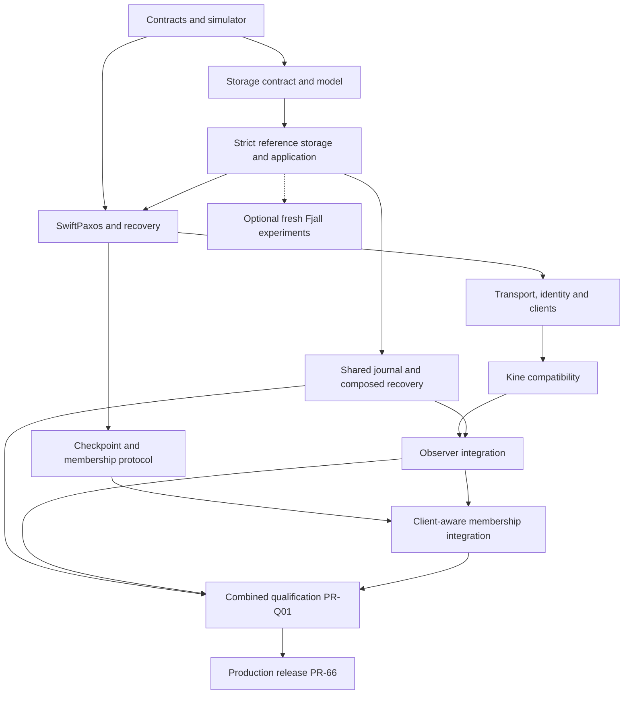

# TupleSky implementation PR plan

**Status:** Review proposal, consolidated v1.4.  
**Date:** 2026-09-17.  
**Companion:** [TupleSky implementation design](tuplesky-design.md).  
**Scope:** 89 tasks, each corresponding to one proposed implementation PR. PR-01 through PR-66, PR-S01 through PR-S04, PR-J01 through PR-J07, PR-O01 through PR-O06, PR-M01 through PR-M05 and PR-Q01 retain their IDs. They are backlog IDs, not existing GitHub PR or issue numbers. No baseline, supplement or separate amendment is needed to use this plan.

## How to use this plan

The design is normative for behavior/dependency choices; this document partitions delivery. Direct prerequisites form a DAG, not a demand for serial development. Draft work may begin earlier but must be reviewed against its final base and land after prerequisites. Task count implies neither dates nor effort estimates.

Aim for one invariant or observable behavior per PR. Roughly 200-700 handwritten implementation lines plus focused tests is a review target, not a quota. Split oversized tasks into named child PRs before coding and update dependencies; never omit tests or fold unrelated cleanup into correctness work to reduce apparent size. Review generated fixtures, lockfiles and model counterexamples separately.

Every PR states problem, exact before/after behavior, design sections, test commands/results, a failure case and persistence/wire/security implications. Protocol work includes source-rule mapping and publication prerequisites. Schema changes state compatibility. Qualification assembles evidence; behavioral fixes receive focused review rather than hiding in test churn.

Reference single-store and fixed-membership compositions are early increments, not competing production architectures. No public insecure listener, simulator keys, weak-store bypass or test crypto may enter production artifacts. The authenticated fixed-membership preview remains explicitly bounded until permanent replacement and quorum-safe forgetting are complete. Production additionally requires the shared-journal, observer and client-aware integration gates below.

## Workstreams and release boundaries

| Tasks | Workstream | Boundary |
|---|---|---|
| PR-01–06 | Contracts, locked tooling and independent deterministic oracle | G0 |
| PR-S01–02, PR-07–18 | Storage contract/model, strict redb reference, state, watch, leases and replicated auth | G1 |
| PR-19–29 | Source-mapped SwiftPaxos, durability, recovery and fast results | G2 |
| PR-30–43 | Native QUIC, clients and federated security | G3 authenticated preview |
| PR-44–48 | Go/Kine edge and actual Kubernetes conformance | G4 |
| PR-49–60 | Common checkpoints, semantic trimming, sealed handoff, restore and upgrades | G5 |
| PR-61–66 | Operability, WAN measurements and release evidence | G6, extended by PR-Q01 |
| PR-S03–04 | Fresh isolated Fjall experiments and local comparison | Optional; not migration or second-engine production support |
| PR-J01–07 | Shared journal, materialization, local checkpoint and multi-group qualification | PR-J06 separately optional |
| PR-O01–06 | Finalized streams, regional observers/relays, Kine watch/read integration | Capability-specific gates |
| PR-M01–05 | Authoritative discovery, full-client Kine and integrated membership | Operational production requirement |
| PR-Q01 | Combined durable WAN/Kine qualification | Required before PR-66 |



This is a workstream overview; the individual prerequisites are authoritative. Optional PR-J06 is not an unconditional prerequisite of PR-Q01. Enabling that profile requires its separate evidence and inclusion in the applicable combined matrix. Former PR-S05 through PR-S08 remain retired and are not reused.

## Review index

| PR | Title | Direct prerequisites |
|---|---|---|
| [PR-01](#pr-01) | Lock workspace, toolchains and checks | None |
| [PR-02](#pr-02) | Identities, canonical commands and keys | PR-01 |
| [PR-03](#pr-03) | Bounded postcard codec | PR-02 |
| [PR-04](#pr-04) | Event/effect and durability interfaces | PR-02 |
| [PR-05](#pr-05) | Deterministic world and replay | PR-04 |
| [PR-06](#pr-06) | Independent history oracle | PR-02, PR-05 |
| [PR-07](#pr-07) | redb adapter and generation lifecycle | PR-01, PR-02, PR-S01, PR-S02 |
| [PR-08](#pr-08) | Strict shared storage coordinator | PR-04, PR-07 |
| [PR-09](#pr-09) | Real redb disk faults | PR-05, PR-08 |
| [PR-10](#pr-10) | Pure KV/transaction planner | PR-02, PR-04, PR-06 |
| [PR-11](#pr-11) | Atomic plans and MVCC views | PR-08, PR-09, PR-10 |
| [PR-12](#pr-12) | Deduplication and retry floors | PR-11 |
| [PR-13](#pr-13) | Watch replay/live handoff | PR-11, PR-12 |
| [PR-14](#pr-14) | Bounded MVCC compaction | PR-11, PR-13 |
| [PR-15](#pr-15) | Native grant/attachment/revoke | PR-10, PR-11, PR-12 |
| [PR-16](#pr-16) | Replicated renewal and expiry | PR-05, PR-06, PR-15 |
| [PR-17](#pr-17) | Kine conditional primitives and private TTL | PR-12, PR-16 |
| [PR-18](#pr-18) | Replicated sessions/policy/grants | PR-10, PR-11, PR-12 |
| [PR-19](#pr-19) | Source mapping and bounded models | PR-02, PR-04, PR-05 |
| [PR-20](#pr-20) | Durable promises/configuration guards | PR-08, PR-19 |
| [PR-21](#pr-21) | Dependency graph/closure evidence | PR-19, PR-20 |
| [PR-22](#pr-22) | Leader proposal handlers | PR-20, PR-21 |
| [PR-23](#pr-23) | Follower vote/adoption handlers | PR-20, PR-21, PR-22 |
| [PR-24](#pr-24) | Slow learning/materialization | PR-11, PR-12, PR-13, PR-18, PR-22, PR-23 |
| [PR-25](#pr-25) | Recovery summaries/payload transfer | PR-20, PR-21, PR-23 |
| [PR-26](#pr-26) | Recovery selection/activation | PR-19, PR-24, PR-25 |
| [PR-27](#pr-27) | Fixed-membership crash qualification | PR-06, PR-09, PR-16, PR-18, PR-26 |
| [PR-28](#pr-28) | Full fast-path learning | PR-19, PR-23, PR-26, PR-27 |
| [PR-29](#pr-29) | Speculation and result release | PR-12, PR-18, PR-24, PR-28 |
| [PR-30](#pr-30) | Quinn/TLS adapter | PR-03, PR-04, PR-08 |
| [PR-31](#pr-31) | Traffic isolation/backpressure | PR-30 |
| [PR-32](#pr-32) | Packet-level simulation | PR-05, PR-30, PR-31 |
| [PR-33](#pr-33) | Trusted collector/native dispatch | PR-17, PR-18, PR-29, PR-30, PR-31 |
| [PR-34](#pr-34) | Rust SDK lifecycle | PR-03, PR-12, PR-30, PR-33 |
| [PR-35](#pr-35) | External JWT/issuer verification | PR-18 |
| [PR-36](#pr-36) | Exchange and service signing | PR-18, PR-33, PR-35 |
| [PR-37](#pr-37) | Sessions/live and replay authorization | PR-13, PR-18, PR-33, PR-34, PR-36 |
| [PR-38](#pr-38) | Browser OIDC/service code flow | PR-18, PR-35, PR-36 |
| [PR-39](#pr-39) | Device authorization | PR-38 |
| [PR-40](#pr-40) | Refresh families and CLI | PR-34, PR-37, PR-38, PR-39 |
| [PR-41](#pr-41) | Independent WIF node issuer | PR-30, PR-35 |
| [PR-42](#pr-42) | Genesis/membership TLS binding | PR-20, PR-26, PR-30, PR-41 |
| [PR-43](#pr-43) | Secure native preview | PR-09, PR-16, PR-27, PR-32, PR-33, PR-37, PR-40, PR-42 |
| [PR-44](#pr-44) | Go postcard subset | PR-03 |
| [PR-45](#pr-45) | Go QUIC/WIF client | PR-34, PR-36, PR-44 |
| [PR-46](#pr-46) | Kine driver and CRUD/range | PR-17, PR-43, PR-45 |
| [PR-47](#pr-47) | Kine watches/progress/TTL | PR-13, PR-14, PR-16, PR-46 |
| [PR-48](#pr-48) | Kubernetes storage conformance | PR-47 |
| [PR-49](#pr-49) | Canonical common checkpoint export | PR-14, PR-18, PR-27 |
| [PR-50](#pr-50) | Learner install/catch-up | PR-25, PR-42, PR-49 |
| [PR-51](#pr-51) | Conservative all-voter trimming | PR-26, PR-49, PR-50 |
| [PR-52](#pr-52) | Quorum-safe checkpoint model | PR-19, PR-51 |
| [PR-53](#pr-53) | Quorum-safe floor/recovery | PR-26, PR-50, PR-52 |
| [PR-54](#pr-54) | Sealed handoff model | PR-19, PR-26, PR-53 |
| [PR-55](#pr-55) | Old-config seal/terminal recovery | PR-25, PR-26, PR-54 |
| [PR-56](#pr-56) | Unique terminal certificate | PR-49, PR-55 |
| [PR-57](#pr-57) | Successor activation/recovery | PR-42, PR-50, PR-53, PR-56 |
| [PR-58](#pr-58) | Node/key lifecycle/fencing | PR-41, PR-42, PR-57 |
| [PR-59](#pr-59) | Backup/restore/DR | PR-49, PR-50, PR-57, PR-58 |
| [PR-60](#pr-60) | Format/capability upgrade guards | PR-03, PR-07, PR-50, PR-57 |
| [PR-61](#pr-61) | Observability and diagnostics | PR-31, PR-43, PR-53, PR-57 |
| [PR-62](#pr-62) | Native matched WAN experiments | PR-29, PR-32, PR-43, PR-53, PR-61 |
| [PR-63](#pr-63) | Kine end-to-end measurement | PR-48, PR-61, PR-62 |
| [PR-64](#pr-64) | Mixed faults/minimization | PR-09, PR-27, PR-32, PR-40, PR-48, PR-53, PR-57, PR-58, PR-60 |
| [PR-65](#pr-65) | Supported deployment targets | PR-43, PR-48, PR-59, PR-60, PR-61 |
| [PR-66](#pr-66) | Production release evidence | PR-58, PR-59, PR-60, PR-63, PR-64, PR-65, PR-Q01 |
| [PR-S01](#pr-s01) | Portable state contract/registry | PR-02, PR-04 |
| [PR-S02](#pr-s02) | Model/conformance kit | PR-05, PR-S01 |
| [PR-S03](#pr-s03) | Experimental Fjall adapter | PR-08, PR-S02 |
| [PR-S04](#pr-s04) | Fresh local engine comparisons | PR-09, PR-14, PR-17, PR-18, PR-S03 |
| [PR-J01](#pr-j01) | Journal interfaces and model | PR-01, PR-02, PR-S01, PR-S02 |
| [PR-J02](#pr-j02) | raft-engine/postcard adapter | PR-J01 |
| [PR-J03](#pr-j03) | Journal-first shared storage | PR-J02, PR-08, PR-11 |
| [PR-J04](#pr-j04) | Local checkpoint and redo GC | PR-J03, PR-09 |
| [PR-J05](#pr-j05) | Physical composed storage faults | PR-J02, PR-J03, PR-J04, PR-09 |
| [PR-J06](#pr-j06) | Replay materialization, optional | PR-J04, PR-J05 |
| [PR-J07](#pr-j07) | Multi-group batching/isolation | PR-J03, PR-J05, PR-31 |
| [PR-O01](#pr-o01) | Finalized frames/capabilities | PR-02, PR-03, PR-28, PR-49 |
| [PR-O02](#pr-o02) | MVCC observer lifecycle | PR-O01, PR-J03, PR-50 |
| [PR-O03](#pr-o03) | Regional relays/failover | PR-O02, PR-31 |
| [PR-O04](#pr-o04) | Kine observer watches/progress | PR-O02, PR-48 |
| [PR-O05](#pr-o05) | Historical reads/read fences | PR-O04, PR-18 |
| [PR-O06](#pr-o06) | Observer correctness/scaling | PR-O03, PR-O04, PR-O05, PR-J05 |
| [PR-M01](#pr-m01) | Authoritative configurations | PR-02, PR-19 |
| [PR-M02](#pr-m02) | Epoch-aware Kine collector | PR-M01, PR-33, PR-48 |
| [PR-M03](#pr-m03) | Staging/handoff integration | PR-M01, PR-O02, PR-57, PR-J04 |
| [PR-M04](#pr-m04) | Regional placement/quorum tuning | PR-M03, PR-M02 |
| [PR-M05](#pr-m05) | Client-aware membership faults | PR-M02, PR-M03, PR-M04, PR-58 |
| [PR-Q01](#pr-q01) | Combined durable WAN/Kine report | PR-J07, PR-O06, PR-M05, PR-63, PR-64 |

## PR specifications

<a id="pr-01"></a>
### PR-01: Lock the workspace, toolchains and review checks

**Prerequisites:** None.  
**Design:** Sections 16, 21.3.

**Implement:** Create Rust/Go workspace skeleton, exact toolchain files, Cargo.lock/go.sum, explicit TLS features and checksummed tool manifest. Add xtask, format/lint/test entry points, dependency policy, Mermaid rendering and references. Include the full raft-engine Git candidate, feature/platform audit and codec smoke test; do not silently change other selections.

**Acceptance:** Build the selected graph on Linux x86_64/aarch64; record actual compiler/MSRV and feature trees. Fail checks for insecure test dependency in production, missing locks, malformed Mermaid or unreviewed override. Resolve candidate incompatibilities explicitly.

**Review boundary:** No service/protocol implementation. Proposed pins are not presumed compile-tested. This describes future repository checks, not local authoring scripts included in the present design PR.

<a id="pr-02"></a>
### PR-02: Define identities, canonical commands and ordered-key fixtures

**Prerequisites:** PR-01.  
**Design:** Sections 2.3, 4.4, 10.5.1, 17.2.

**Implement:** Add coord-types logical_v1, fixed IDs, checked revisions, stable invocation identity/errors and canonical hashes. Freeze namespace/key/revision encoding vectors. Reserve configuration epochs, finalized-frame/read-fence identities and local journal sequence separately.

**Acceptance:** Property-test encoded ordering including zeros/prefixes. Payload change changes digest; token/endpoint/epoch refresh does not change the same logical request. Reject overflow, ambiguous encodings and mistaken identity/counter reuse.

**Review boundary:** No network, ambient clocks/random IDs inside core or automatic schema evolution.

<a id="pr-03"></a>
### PR-03: Implement the bounded postcard wire codec

**Prerequisites:** PR-02.  
**Design:** Sections 11.2, 19.1, 6.7.1, 10.5.

**Implement:** wire_v1 DTOs, frame reader/writer, explicit kinds/versions, bounded Serde types, valid/invalid vectors and fuzz target. Reserve distinct observer/configuration/collector-evidence/read-fence schemas; durable journal representation is separately versioned.

**Acceptance:** Reject all header truncations, integer/length overflow, trailing bytes, unknown versions and oversized nested collections before excessive allocation. Identity-bearing payloads canonicalize consistently.

**Review boundary:** No sockets or general Go Serde framework. Stable DTOs, not implementation-enum serialization.

<a id="pr-04"></a>
### PR-04: Establish pure event/effect and durable-barrier interfaces

**Prerequisites:** PR-02.  
**Design:** Sections 5.1, 4.8, 18.

**Implement:** Add injected clocks/entropy, owned events/effects, PersistBatch, incarnation/boot-scoped barriers and private established/admission capabilities. Distinguish JournalDurable, Materialized and LocalCheckpointPublished from protocol establishment. Vote-producing effects carry epoch/ballot/prerequisite context; supply test ports only.

**Acceptance:** A two-barrier effect cannot release after one. Wrong-boot, duplicate/failed and obsolete-ballot completions never newly authorize it. Compile-boundary checks exclude Tokio, engine crates/system clocks from pure core.

**Review boundary:** No actual database, consensus or insecure production composition; types support but do not prove learning predicates.

<a id="pr-05"></a>
### PR-05: Build the deterministic world and replay format

**Prerequisites:** PR-04.  
**Design:** Sections 12, 21.1.

**Implement:** Ordered virtual scheduler, lifecycle crashes/restarts, clocks, messages and named ChaCha streams. Versioned replay bundles include source/build/config/lock and explicit schedules. Add deliberately faulty actor.

**Acceptance:** Identical replay has identical visible history/digests; insertion ties explicit. An omitted durable prerequisite is reproducibly caught/minimized and saved. Wrong version fails clearly, not a false reproducibility claim.

**Review boundary:** Logical simulation is not real-engine or QUIC packet coverage. No production secret/test entropy leakage.

<a id="pr-06"></a>
### PR-06: Add an independent history oracle

**Prerequisites:** PR-02, PR-05.  
**Design:** Sections 6, 12.3, 21.1.

**Implement:** Separate reference model and complete-domain linearizability/revision/retry/conditional checker with extensible lease/auth/watch observations and pending-operation treatment.

**Acceptance:** Reject injected stale read after acknowledged write, duplicate mutation, wrongly shared revision and missing transaction event; accept valid concurrent histories. Keep performance and correctness reporting separate.

**Review boundary:** Do not reuse production planner as oracle or partition shared-revision/transaction/policy histories by key.

<a id="pr-07"></a>
### PR-07: Implement the redb adapter and fail-closed generation lifecycle

**Prerequisites:** PR-01, PR-02, PR-S01, PR-S02.  
**Design:** Sections 5.2, 17.1, 17.9–17.11, 17.13.

**Implement:** coord-storage-redb maps pinned cross-table snapshots, byte tables, explicit durable transactions and typed failures to common contract. Verified manifests/root locks gate opening; codecs remain common. This is the strict materialization/reference foundation; journal-first production arrives in PR-J03.

**Acceptance:** Common ordered-access/transaction suites pass; wrong origin/domain/generation/engine, empty/missing/corrupt files fail closed, duplicate open excluded. Cross-catalog atomicity includes read-your-writes scans.

**Review boundary:** No implicit create-on-open, engine-local application semantics, bespoke WAL, Fjall implementation or migration. A real-engine pass does not establish composed journal recovery.

<a id="pr-08"></a>
### PR-08: Implement the shared single-writer storage coordinator

**Prerequisites:** PR-04, PR-07.  
**Design:** Sections 17.3, 17.8–17.10.

**Implement:** Strict reference StoreWorker<E>, guard validation in transactions, shared update lowering/stamps, bounded grouping and durable-view gate; call commit_durable, not redb in common code. Preserve as a reference increment; PR-J03 introduces authoritative journal-first transitions and distinct projection events.

**Acceptance:** Model/redb fixtures cover visibility before completion, definite guard rejection, indeterminate commit, lost/old-boot completion. No view/publication escapes without required support. Unrelated protocol stamp updates do not invalidate application predecessor.

**Review boundary:** No direct native engine imports in coord-storage, unbounded blocking work, public storage sequences or silently weakened periodic flush profile.

<a id="pr-09"></a>
### PR-09: Exercise the actual redb engine with disk faults

**Prerequisites:** PR-05, PR-08.  
**Design:** Sections 17.3, 17.14, 21.2.

**Implement:** Pinned real redb StorageBackend with volatile/durable images and controlled writes/sync; shared fixtures, reopen and subprocess death, plus generation-manager directory faults.

**Acceptance:** Crash at each bounded transaction write/sync boundary and reopen only permitted states. Test partial persistence on sync error, ENOSPC, durable-prefix corruption quarantine and prevention of destructor flush after simulated crash.

**Review boundary:** Model engine is not byte-level redb testing. This does not certify Fjall, arbitrary OS power loss, raft-engine or the composed boundary in PR-J05.

<a id="pr-10"></a>
### PR-10: Implement the pure KV and transaction planner

**Prerequisites:** PR-02, PR-04, PR-06.  
**Design:** Sections 6.1–6.3, 17.4.

**Implement:** Exact/range views, compares, put/delete, chosen transaction branch, revisions and deterministic owned ReadView/ApplyPlan using fixture views. Include semantic work/response limits.

**Acceptance:** Check create/mod/version, absence, byte intervals, failed/read-only/no-op revisions and one revision for an atomic multi-key mutation. Limits fail before partial changes.

**Review boundary:** No production DB, clock-dependent lease expiry or ambient time in planner.

<a id="pr-11"></a>
### PR-11: Apply shared KV plans atomically and serve pinned MVCC views

**Prerequisites:** PR-08, PR-09, PR-10.  
**Design:** Sections 17.2, 17.4, 17.9–17.10.

**Implement:** Common bounded view construction/current/history/events/execution updates through state port; ApplyBase check, fixed-revision scan and owned pages without engine imports. PR-J03 later journals immutable plans before this same atomic materialization.

**Acceptance:** Model/redb identical fixtures; crash leaves no partial events/frontier mismatch; choose history versions before limit. Stale base replans; page/reverse/boundary and ahead-of-durability views are tested.

**Review boundary:** Pinned snapshot is not linearizable authority or quorum establishment. No per-engine MVCC implementations.

<a id="pr-12"></a>
### PR-12: Persist deduplication, result resolution and retry floors

**Prerequisites:** PR-11.  
**Design:** Sections 6.5, 17.1, 10.5.3.

**Implement:** Atomic request digest/result/executed identity and effects; bounded outstanding window, ResolveRequest and replicated retirement floor. State is transferable across epochs and exact replay.

**Acceptance:** Lost response/same ID yields same currently authorized logical result. Changed payload rejected; materialization-notification crash does not duplicate. Retired/unknown session request cannot execute as new work.

**Review boundary:** No infinite retention or exactly-once guarantee across lost upstream invocation identity.

<a id="pr-13"></a>
### PR-13: Implement atomic watch replay and live handoff

**Prerequisites:** PR-11, PR-12.  
**Design:** Sections 6.4, 6.8.2–6.8.3, 19.3.

**Implement:** Replay/live registration frontier, complete revisions, bounded queues, ordered progress and resumable close/cancellation.

**Acceptance:** Mutation during registration appears with no gap; slow consumers cannot advance over omitted changes. Fragmented multi-key revision remains atomic. Loom covers local handoff boundary; progress cannot overtake pending events.

**Review boundary:** No public watch before auth composition and no progress from socket receipt.

<a id="pr-14"></a>
### PR-14: Add bounded MVCC compaction

**Prerequisites:** PR-11, PR-13.  
**Design:** Sections 6.4, 17.5.

**Implement:** Ordered retention floor and incremental history/event GC preserving needed value/tombstone at/before boundary and newer versions. Explicit active-view/watch retention. Common layer chooses deletion; physical engines reclaim afterward.

**Acceptance:** Before-floor reads return Compacted; later reads retain untouched old values. Pagination/watch resume either maintain history or fail explicitly, never skip gaps.

**Review boundary:** No semantic protocol trimming, engine-owned TTL/filter or exclusive live-file compaction.

<a id="pr-15"></a>
### PR-15: Implement native lease grant, attachment and revoke

**Prerequisites:** PR-10, PR-11, PR-12.  
**Design:** Sections 7.1, 17.1.

**Implement:** Stable nonreused lease IDs/generations, owner permissions, reverse index and atomic attach/detach/revoke plans with count/worst-case byte quotas. Keep Kine private bindings distinct.

**Acceptance:** Revoke deletes only current attachments atomically; later value growth cannot evade event budget. Retry does not grant twice/allocate new revision. Unauthorized attachment cannot imply protected-key deletion.

**Review boundary:** No timers/keepalive success outside consensus or automatic logout-based ownership change.

<a id="pr-16"></a>
### PR-16: Implement replicated renewal and conservative expiry

**Prerequisites:** PR-05, PR-06, PR-15.  
**Design:** Sections 7.2–7.4.

**Implement:** Renewal sequence, replicated expiry authority epoch, timer generations and conditional expiration; conservative recovery rearming under clock assumptions. Renewals stay replicated with exact retry semantics.

**Acceptance:** Renewal/expiry permutations, delayed old leader, restart, no quorum and fast-clock bounds are checked against true simulator time. Stale timer cannot delete renewed/rebound keys; delayed reply creates no new TTL anchor.

**Review boundary:** No exact expiry deadline, observer-local keepalive success or external fencing implied by lease alone.

<a id="pr-17"></a>
### PR-17: Add native atomic Kine primitives and private TTL bindings

**Prerequisites:** PR-12, PR-16.  
**Design:** Sections 6.6, 19.5.

**Implement:** Create/CAS-update/conditional-delete returns all revision/conflict metadata in one result. Kine TTL seconds map to private per-key binding; zero detaches. Stable invocation derives binding identity; expiry is conditional.

**Acceptance:** Failed CAS changes neither data nor expiry. Replaced TTL fences prior timer. Retries preserve binding. Trace proves one logical operation, no mandatory pre-read/CurrentRevision/lease-grant round trip.

**Review boundary:** No Go code, nativeLeaseID=TTL or unconditional local deletes.

<a id="pr-18"></a>
### PR-18: Implement replicated sessions, policy and grant commitments

**Prerequisites:** PR-10, PR-11, PR-12.  
**Design:** Sections 9.2–9.3, 20.2–20.3.

**Implement:** Principal/ceiling, session/rule generations, one-time receipt/code commitments and ordered permission/revocation at execution. Extend independent oracle; policy can advance execution without KV revision.

**Acceptance:** Check branch-specific comparisons/operations, full range containment, lease restrictions and policy changes after admission. Revoked users cannot read protected cached retry outcomes.

**Review boundary:** No external JWT verification/signing/network/clock during deterministic replay.

<a id="pr-19"></a>
### PR-19: Freeze SwiftPaxos source mapping and bounded models

**Prerequisites:** PR-02, PR-04, PR-05.  
**Design:** Sections 4, 5.1, 18.1, 21.6.

**Implement:** Pin paper/code source rules, guards, full path-learning predicates, C2 memberships and durable publication obligations. Model concrete phases, atomic dependency publication, recovery cuts and source-defined candidate selection with traceability.

**Acceptance:** Every handler/field maps to source or marked extension. Reject arbitrary fastest-majority, observer/duplicate votes and half-initialized dependencies. Permute valid phase/preaccept reports without replacing source selection by highest-phase-wins. Save counterexamples.

**Review boundary:** No optimization or unrestricted proof claim from finite models. Upstream implementation/invariant mismatches are neither proved fundamental failure nor automatically resolved.

<a id="pr-20"></a>
### PR-20: Persist ballots, promises and configuration guards

**Prerequisites:** PR-08, PR-19.  
**Design:** Sections 4.1, 4.7–4.8, 5.1, 18.1.

**Implement:** Stable promises/config-role/generation guards and source-required protocol rows. Wire recovered promises to actor. Carry same-boot epoch/ballot context on effects as well as boot identity; production persistence later uses PR-J03 events.

**Acceptance:** Promise replies wait for complete durable state. Old messages cannot lower it after restart. Wrong configuration identity does not vote. Delay callbacks/batcher across election; bookkeeping cannot authorize a new obsolete vote. Atomic initialized-state/index publication and dependency-phase prerequisites hold.

**Review boundary:** No full recovery selection or Raft term semantics. Future journal integration must rerun these tests at its cut, not presume reference tests suffice.

<a id="pr-21"></a>
### PR-21: Implement the dependency graph and closure evidence

**Prerequisites:** PR-19, PR-20.  
**Design:** Sections 4.2–4.9, 18.1–18.3.

**Implement:** Immutable payload binding, path/predecessor state, exact traversal/closure, source phase guards and bounded incremental work. Publish initialization and dependency lookup atomically; persist required dependencies.

**Acceptance:** Direct-set equality differs from full path evidence. Duplicate/reordered messages converge; conflict arriving while another command initializes cannot see START as processed state. Bounds backpressure without deleting unresolved acceptance. Dependencies reach required accept/commit/execute phase before dependent transition.

**Review boundary:** No path compression, per-key conflict relaxation or receipt-order execution.

<a id="pr-22"></a>
### PR-22: Implement normal leader proposal handlers

**Prerequisites:** PR-20, PR-21.  
**Design:** Sections 4.1–4.8, 18.

**Implement:** Source-mapped leader transitions/publication, conservative conflicts and ballot-fixed fast set. Use atomic initialization and prerequisite-gated effects.

**Acceptance:** Golden traces match models; every leader reply has exact stable support. Reordered/duplicate client requests cannot bind conflicting payload. Block premature accept/commit/finalized execution while dependencies lag.

**Review boundary:** No learning shortcut, speculative public response or recovery-selection implementation hidden here.

<a id="pr-23"></a>
### PR-23: Implement normal follower vote and adoption handlers

**Prerequisites:** PR-20, PR-21, PR-22.  
**Design:** Sections 4, 5.1, 18.

**Implement:** Source fast votes/leader-order adoption with all persistence/history prerequisites and atomic phase/index visibility.

**Acceptance:** Leader/follower message races, conflict arrival permutations, duplicate identities and crashes between state/vote preserve learning obligations. Half-initialized dependencies never appear; dependency-phase guards are explicit, not an inherited prototype TODO.

**Review boundary:** Matching direct dependencies is not a complete learning proof. Keep source semantics with new storage event names; no Raft terms/indexes.

<a id="pr-24"></a>
### PR-24: Implement slow learning and ordered materialization

**Prerequisites:** PR-11, PR-12, PR-13, PR-18, PR-22, PR-23.  
**Design:** Sections 4.3–4.5, 17.4, 18.3.

**Implement:** Conservative slow learner, closed dependency execution, EstablishedResult capability and deterministic application through common materializer; feed complete finalized event frontiers.

**Acceptance:** Three/five-voter logical histories match KV/transaction/retry/policy oracle. One leader response cannot establish success. No watch event precedes irrevocable application. Preserve source learning under later journal-first composition.

**Review boundary:** Externally visible fast completion remains off. No copied read-index shortcut or projection commit mistaken for quorum learning.

<a id="pr-25"></a>
### PR-25: Implement durable recovery summaries and payload transfer

**Prerequisites:** PR-20, PR-21, PR-23.  
**Design:** Sections 4.8–4.9, 5, 17.1, 19.3.

**Implement:** Bounded source prior-ballot summaries, stable votes, unresolved closure/payload transfer with identity/digest checks and durable prerequisites. Define authoritative recovery cut independent of lagging projection.

**Acceptance:** Incomplete/corrupt pages never count; old required ballot state survives crash. Missing payload fetches/blocks, not fabricated empty command. Hold projection behind journal and old sends/callbacks across recovery. Source phase differences remain legal where allowed; incompatible required-equal candidates are diagnosed.

**Review boundary:** No selection from incomplete summary/application-only snapshot, physical packet-drain correctness assumption or blind union of histories.

<a id="pr-26"></a>
### PR-26: Implement recovery selection and new-ballot activation

**Prerequisites:** PR-19, PR-24, PR-25.  
**Design:** Sections 4.1, 4.8–4.9, 5, 18.1.

**Implement:** Source recovery cases preserve potentially chosen commands/closure, durably bind selected Sync and activate the recovered ballot; restore exact results/retries. Resolve submitted work at authoritative cut before new reply.

**Acceptance:** Preserve learned outcomes despite lost volatile commit notifications. Competing recovery, delayed replies, lagging projection and same-boot old effects cannot establish divergence. Permuted reports give permitted stable selection; crash after Sync cannot publish incompatible result under same ballot.

**Review boundary:** No membership change, majority-of-anything, highest-phase heuristic, or dropping work for absent COMMIT marker.

<a id="pr-27"></a>
### PR-27: Qualify fixed-membership crash recovery end to end

**Prerequisites:** PR-06, PR-09, PR-16, PR-18, PR-26.  
**Design:** Sections 4.9, 5, 12, 21.

**Implement:** Real-engine plus logical-network campaigns around vote/reply/materialization and restart combinations within budget; retain minimal regressions and recovery-report permutations.

**Acceptance:** Acknowledged outputs, retry digests and lease/policy state survive; minority cannot write. Deliberately omit durable record and detect failure. Crash after recovery result publication preserves same-ballot choice. State precise reference versus later composed-storage coverage.

**Review boundary:** Qualification does not hide protocol fixes; those get focused review. No claim that reference redb tests qualify raft-engine automatically.

<a id="pr-28"></a>
### PR-28: Implement full fast-path learning evidence

**Prerequisites:** PR-19, PR-23, PR-26, PR-27.  
**Design:** Sections 4.2–4.9, 18.3.

**Implement:** Exact source path-learning predicate and private establishment object sharing normal/recovery history with slow path.

**Acceptance:** Valid/invalid paths, mixed ballot/epoch, duplicate identity and recovery-phase variations are covered. Forced-slow/fast paths yield equal controlled logical results. Persisted recovery selection remains stable across restart and does not use generic phase priority.

**Review boundary:** No speculative overlay/public response plumbing or arbitrary quorum counter.

<a id="pr-29"></a>
### PR-29: Add bounded speculative execution and result-release gating

**Prerequisites:** PR-12, PR-18, PR-24, PR-28.  
**Design:** Sections 4.3–4.9, 17.4, 18.1.

**Implement:** Disposable deterministic overlays and digests for established fast outcomes; release binds command, closed order, permission and durable recovery evidence.

**Acceptance:** Tentative reordering leaks no value/credential. Fast result followed by crash before COMMIT propagation recovers same outcome; recovery report permutations and restart preserve Sync selection. Speculative events/tokens are impossible at public boundary.

**Review boundary:** No extra mandatory WAN commit phase, weakened predicate or durability to improve charts.

<a id="pr-30"></a>
### PR-30: Implement the Quinn transport adapter and TLS lifecycle

**Prerequisites:** PR-03, PR-04, PR-08.  
**Design:** Sections 11, 19.1–19.4.

**Implement:** Bounded reliable streams, ALPN, explicit AWS-LC provider, handshake/close and owned dispatch. Separate role negotiation for collectors/voters/observers; isolated test certificates until real issuance.

**Acceptance:** Malformed frames, origin/role/version mismatch fail closed. No application 0-RTT. Transport ACK never triggers durability/establishment. Bound shutdown/work. Sparse necessary connections are supported, not an assumed fleet full mesh.

**Review boundary:** No HTTP3, voting solely from test certificate, public unauthenticated service or untrusted Kine collector role.

<a id="pr-31"></a>
### PR-31: Implement QUIC traffic isolation and backpressure

**Prerequisites:** PR-30.  
**Design:** Sections 3.3, 11.3–11.7, 19.2–19.3.

**Implement:** Explicit CUBIC, bounded control/unary/watch/bulk connections, shared destination budget, fair group scheduling and role-specific replication capacity.

**Acceptance:** Stalled bulk/watch cannot consume all control queues/streams; large frames cannot force unlimited buffering. Measure queue/credit wait distinct from RTT. Relay fan-out respects node/destination admission.

**Review boundary:** No universal no-jitter/latency claim, unbounded pools, idle-delay batching or congestion-budget evasion by more connections.

<a id="pr-32"></a>
### PR-32: Add packet-level quinn-proto simulation

**Prerequisites:** PR-05, PR-30, PR-31.  
**Design:** Sections 12.2, 21.2.

**Implement:** Pinned packet/time-driven protocol and controlled protocol RNG, separately linked test crypto/identity; shared framing/queue behavior.

**Acceptance:** Reproduce packet loss/reorder/MTU/credit schedules; cross-check message-level visible outcomes. Production graph excludes deterministic keys. Real rustls handshake/Go interoperability independently passes. Include sparse observer/collector topology under bounds.

**Review boundary:** Endpoint RNG alone does not make TLS/all ID generation deterministic.

<a id="pr-33"></a>
### PR-33: Wire the trusted frontend collector and native dispatch

**Prerequisites:** PR-17, PR-18, PR-29, PR-30, PR-31.  
**Design:** Sections 3, 4.3, 19.4.

**Implement:** Admission interface, parallel direct voter fan-out, source-exact collector, unary and finalized watch dispatch in test composition. Freeze the collector contract for authorized Go reuse; role-scoped access never becomes general user voting access.

**Acceptance:** Packet traces have no unnecessary serial leader hop; lone reply never releases tentative data. Cancellation preserves identity/outcome resolution. Count voter identities rather than connections; bound per-domain collection.

**Review boundary:** No untrusted SDK votes or production listener before security gate. Full Go/epoch collector integration is PR-M02.

<a id="pr-34"></a>
### PR-34: Implement the Rust SDK request lifecycle

**Prerequisites:** PR-03, PR-12, PR-30, PR-33.  
**Design:** Sections 6.5, 11.5, 19.4.

**Implement:** Credential providers, bounded warm pools, stable instance/sequence, deadlines, ResolveRequest and typed retry errors.

**Acceptance:** Reconnect/reset/timeout preserves invocation/payload. Payload change conflicts; ambiguous timeout reports unknown outcome. Stream pressure bounded, no fresh token exchange per operation.

**Review boundary:** No implicit fresh-ID retry or unauthenticated exposure of protocol evidence.

<a id="pr-35"></a>
### PR-35: Implement hardened external JWT and issuer verification

**Prerequisites:** PR-18.  
**Design:** Sections 9, 20.1–20.2.

**Implement:** Distinct OIDC/WIF verifier types, configured algorithms/audiences/claims, bounded JWKS and hardened HTTP. Kubernetes offline JWT and explicit TokenReview are separate modes.

**Acceptance:** Reject mix-up/alg confusion/wrong audience/time/claims, token-directed endpoints and unknown-kid floods. Simulate cache staleness, clock-health failure, issuer and TokenReview outage. Record admitted receipts, never raw JWTs.

**Review boundary:** No signing, arbitrary cloud identity formats or claims directly granting permission.

<a id="pr-36"></a>
### PR-36: Implement RFC 8693 exchange and service credential signing

**Prerequisites:** PR-18, PR-33, PR-35.  
**Design:** Sections 9.1–9.4, 20.2.

**Implement:** Bounded Axum exchange, canonical receipts, atomic session creation and ES256 tokens with key publication/rotation. Keep keys outside replicated state.

**Acceptance:** Execution rechecks policy changed after verification. Outage/stale keys fail closed; no raw JWT/private keys in storage/logs. Lifetime/scope ceiling and single-use receipt hold.

**Review boundary:** No long-lived WIF refresh or per-operation IdP calls.

<a id="pr-37"></a>
### PR-37: Bind API sessions and authorize live/replayed output

**Prerequisites:** PR-13, PR-18, PR-33, PR-34, PR-36.  
**Design:** Sections 6.4–6.5, 6.9.3, 9.3, 19.4.

**Implement:** Persistent auth binding/rebind, expiry, ordered revocation and fresh permission gates for reads, retries and each selected output batch. Share barriers only for already-selected batches.

**Acceptance:** Expired warm connection cannot admit; post-revocation protected data denied even from historical/cached results. Watch progress cannot bypass output barrier. Previously authorized in-flight work follows documented completion semantics.

**Review boundary:** Token admission freezes neither policy for connection lifetime nor retroactive cancellation. Observer ordered policy replay never silently weakens this requirement.

<a id="pr-38"></a>
### PR-38: Implement OIDC browser login and the service code flow

**Prerequisites:** PR-18, PR-35, PR-36.  
**Design:** Sections 8, 20.1.

**Implement:** Upstream openidconnect client plus service code/PKCE/state/nonce/exact redirects, application azp validation and bounded pending login. Keep service/upstream flow identities separate.

**Acceptance:** Wrong/missing azp and multi-audience, CSRF/mix-up, code/redirect substitution, concurrent tabs and broker restart negative tests. One code creates at most one session.

**Review boundary:** Crate is not a service authorization server; no email-based principal or public CLI secret.

<a id="pr-39"></a>
### PR-39: Implement device authorization with bounded polling

**Prerequisites:** PR-38.  
**Design:** Sections 8.1, 20.1–20.3.

**Implement:** Service device/user codes, browser approval, expiry, bounded poll/backoff and atomic consumption using existing upstream browser login.

**Acceptance:** Concurrent pollers cannot mint multiple sessions. Denied/expired/pending/slow_down handled; attempts/floods bounded. Upstream device grant is not assumed.

**Review boundary:** No secret in user code/URL or unapproved code acceptance.

<a id="pr-40"></a>
### PR-40: Implement refresh families and secure CLI login

**Prerequisites:** PR-34, PR-37, PR-38, PR-39.  
**Design:** Sections 8.2, 20.3.

**Implement:** Rotating family commitments/reuse revocation; coordctl browser/device/logout/refresh with explicit OS keyring stores and serialized shared-credential updates.

**Acceptance:** Lost rotated-secret response requires documented fresh login. Concurrent refresh/revoked family/missing or locked keyring tests. Explicit Apple keychain feature; no plaintext fallback, args/log leakage or simulator entropy.

**Review boundary:** Headless uses WIF, not desktop refresh in deployment config. No unimplemented transparent secret recovery.

<a id="pr-41"></a>
### PR-41: Implement the independent WIF node issuer

**Prerequisites:** PR-30, PR-35.  
**Design:** Sections 10.1–10.2, 20.4.

**Implement:** Independently deployed issuer, protected reference CA signer, configured external trust, CSR possession and policy-constructed identities/extensions. Validate CA/key/constraints at startup.

**Acceptance:** Cold enrollment works before any voter. Reject signature/algorithm/SAN/CA/lifetime/workload errors; issuer outage fails closed. Root credentials remain protected outside quorum data.

**Review boundary:** No arbitrary CSR extension copy, quorum-dependent bootstrap or certificate-implies-vote assumption. HSM is optional implementation, not missing required service.

<a id="pr-42"></a>
### PR-42: Bind genesis and committed membership to peer TLS

**Prerequisites:** PR-20, PR-26, PR-30, PR-41.  
**Design:** Sections 10, 17.1, 20.4.

**Implement:** Signed/pinned genesis with durable initialization, ordinary TLS plus committed key/incarnation/role checks and exact voter identity.

**Acceptance:** Wrong origin/stale generation/frontend/observer/learner cannot vote. Duplicate/cloned identity not counted twice. Missing/rolled-back files require quarantine/new-generation lifecycle, not TOFU/reinitialize.

**Review boundary:** Fixed configuration; membership handoff remains later. Normal certificate validation must not be disabled for URI binding.

<a id="pr-43"></a>
### PR-43: Compose secure daemons and qualify the native preview

**Prerequisites:** PR-09, PR-16, PR-27, PR-32, PR-33, PR-37, PR-40, PR-42.  
**Design:** Sections 22.1–22.2, 23 G3.

**Implement:** Role-specific binaries, strict TOML, bounded supervised workers, startup/readiness/shutdown and secret-safe diagnostics. Document fixed-member/reference-storage preview restrictions.

**Acceptance:** Cold auth bootstrap, browser/device/WIF, warm expiry, restart, overload and disk quarantine. Production dependency graph excludes test keys/bypasses; cached leadership not fresh-quorum readiness.

**Review boundary:** No general-production claim; lifecycle and journal/observer/client integration gates remain. Reference preview does not supersede selected production architecture.

<a id="pr-44"></a>
### PR-44: Implement the Go postcard subset and shared fixtures

**Prerequisites:** PR-03.  
**Design:** Sections 3.2, 6.6, 19.1.

**Implement:** adapters/kine/wire from frozen frames/schema manifest, required DTOs with checked varints/signed/length/full-consumption handling. Reserve authorized collector/configuration schemas for later client integration.

**Acceptance:** Rust→Go and Go→Rust all valid vectors; malformed corpus rejected within budget. Schema change requires reviewed fixtures and version consequences.

**Review boundary:** No Go voting state machine, cgo/FFI, native protobuf or arbitrary Serde reflection.

<a id="pr-45"></a>
### PR-45: Implement the Go QUIC client and workload credentials

**Prerequisites:** PR-34, PR-36, PR-44.  
**Design:** Sections 19.4–19.5.

**Implement:** Plain quic-go streams, trust/origin binding, WIF provider/rebind, bounded pools and stable invocation retry/resolve. Handle rotating token files/single-flight refresh.

**Acceptance:** Actual Rust/Go TLS, expiry, stream reset, timeout and warm reconnect pass. No per-operation federation or HTTP3 native transport. Unknown outcomes remain explicit.

**Review boundary:** No exactly-once across lost upstream identity; epoch-aware collection is PR-M02.

<a id="pr-46"></a>
### PR-46: Implement Kine driver registration and CRUD/range backend

**Prerequisites:** PR-17, PR-43, PR-45.  
**Design:** Sections 6.6, 19.5.

**Implement:** Register coord:// in frozen Kine build and exact Start/Get/Create/Update/Delete/List/Count/DbSize/CurrentRevision/error metadata mapping. Bind one domain, handle reserved/health conventions.

**Acceptance:** Actual bridge tests revisions, absent/mismatch metadata, byte intervals/count/pagination and idempotent startup keys. Trace one conditional command, no WAN pre-read/revision follow-up.

**Review boundary:** No logstructured SQL/TTL wrapper, invented counters or unsupported general etcd transaction claims. Early proxy composition is a test increment, not permanent WAN hop.

<a id="pr-47"></a>
### PR-47: Complete Kine watches, progress, compaction and TTL

**Prerequisites:** PR-13, PR-14, PR-16, PR-46.  
**Design:** Sections 6.6, 6.8, 19.5.

**Implement:** Backend watch, selected pin's synchronization/progress and Compact conventions with private TTL bindings and exact cursors/batches. Make waits cancellable in the chosen edge.

**Acceptance:** Replay/live gaps, future/compacted start, queued progress, reconnect and stale expiration pass through actual bridge. No skipped batch, local unconditional TTL or progress from mere receipt.

**Review boundary:** No assumption native leases match reference Lease API; no mix of old WaitForSyncTo and new EventBatch signatures.

<a id="pr-48"></a>
### PR-48: Certify the selected Kubernetes storage profile

**Prerequisites:** PR-47.  
**Design:** Sections 6.6, 6.8.4, 23 G4.

**Implement:** Real pinned API-server storage/integration suite, exact supported versions/operations/deviations and reproducible commands. This is the compatibility base; O04/M02 subsequently qualify observer routing/full collection at selected pin.

**Acceptance:** CRUD/CAS, pagination, watch resume/progress, compaction/TTL, concurrent clients and regional failover. Any semantic failure blocks compatibility labeling; clean boot alone is insufficient.

**Review boundary:** No blanket etcd replacement beyond tested profile or inference that later routing inherits conformance automatically.

<a id="pr-49"></a>
### PR-49: Export canonical shared checkpoints through portable snapshots

**Prerequisites:** PR-14, PR-18, PR-27.  
**Design:** Sections 5.3, 17.6, 17.12, 17.16.1.

**Implement:** SharedCheckpointV1 with bounded canonical traversal/chunks/root at certified execution boundary using one pinned multi-collection view. Common digest excludes local promises/stamps/physical files.

**Acceptance:** Equal common logical state hashes equally despite node-private history/layout. Include required common retry/policy/lease/history. Mutation during export cannot mix views.

**Review boundary:** No raw mutable file copy, identity reuse or authority to trim. This common snapshot is not the LocalRecoveryCheckpointV1 in J04 and cannot recreate an existing voter's obligations.

<a id="pr-50"></a>
### PR-50: Install learner snapshots and reconcile catch-up state

**Prerequisites:** PR-25, PR-42, PR-49.  
**Design:** Sections 10.3, 17.6, 17.13.

**Implement:** Verified shared chunks into inactive selected-engine generation, manifest/identity/schema checks, synced files/directories and active-pointer lifecycle; required unresolved closure transferred separately.

**Acceptance:** Crash each install/pointer step leaves valid selected state or fails closed. Missing/corrupt chunk blocks; learner cannot inherit donor identity or vote early. Error after selection never silently falls back to old generation.

**Review boundary:** No active-epoch promotion, reset of local promises, engine conversion or interchangeability with local recovery checkpoint.

<a id="pr-51"></a>
### PR-51: Implement conservative all-voter checkpoint trimming

**Prerequisites:** PR-26, PR-49, PR-50.  
**Design:** Sections 5.3, 17.5–17.6, 17.16.5.

**Implement:** Durable identical common checkpoint/floor acknowledgements from every voter, then bounded eligible protocol trimming.

**Acceptance:** Missing voter stops trimming with bounded backpressure rather than evicting obligations. Delayed old messages cannot revive below-floor state. Public MVCC and physical journal retention remain separate; observers supply no trim votes.

**Review boundary:** Conservative reference, not production permanent-loss availability. Local redo compaction cannot substitute for semantic forgetting.

<a id="pr-52"></a>
### PR-52: Model quorum-safe checkpoint activation

**Prerequisites:** PR-19, PR-51.  
**Design:** Sections 5.3, 23 G5.

**Implement:** Prepare/readiness/activation evidence, recovery intersections, retained state and stale-message fences for trimming without all voters; bounded TLC variants and field mapping.

**Acceptance:** Signer loss, delayed activation, competing checkpoints, partitions/lagging recovery preserve obligations. Save checked invariants/counterexamples. Observer and physical-log retention do not alter quorum rules.

**Review boundary:** Majority snapshot copy alone is not activation proof; no imported Raft shortcut.

<a id="pr-53"></a>
### PR-53: Implement quorum-safe checkpoint floors and recovery

**Prerequisites:** PR-26, PR-50, PR-52.  
**Design:** Sections 5.3, 17.6, 17.16.5.

**Implement:** Reviewed floor protocol, durable publication/state retrieval and recovery honoring highest applicable activated floor.

**Acceptance:** Permanently absent voter no longer prevents bounded semantic history. Restarted lagging nodes cannot vote from discarded baseline. Crash every transition against model; later J05 tests composed journal too. No dependence on observer acknowledgements.

**Review boundary:** No dependency compression or membership change bundled here.

<a id="pr-54"></a>
### PR-54: Model sealed membership handoff

**Prerequisites:** PR-19, PR-26, PR-53.  
**Design:** Sections 4.8, 10.3, 23 G5.

**Implement:** Stop/transfer state machine, old-epoch fence, potentially chosen closure, unique successor and new-quorum activation. Model concurrent and interrupted operations including delayed vote/effect obligations.

**Acceptance:** Explicit intersection/fencing obligations reject two successors, old-generation vote resurrection and minority recreation. An applied KV view or admission shutdown alone never defines terminal state.

**Review boundary:** No borrowed Raft joint-consensus assumptions without a SwiftPaxos mapping. M03 is orchestration integration, not a new ad hoc algorithm.

<a id="pr-55"></a>
### PR-55: Persist old-configuration sealing and terminal recovery

**Prerequisites:** PR-25, PR-26, PR-54.  
**Design:** Sections 4.8, 10.3.

**Implement:** Durable old-quorum seal disables ordinary voting across old ballots while permitting terminal recovery of every potentially chosen command/closure, including pending effects at authoritative cut.

**Acceptance:** Restart/reconnect cannot resume old service. Work learned immediately before sealing survives even with delayed response. Competing initiators cannot bypass recovery or authorize divergent terminal histories.

**Review boundary:** No successor activation, controller override or mere frontend-close fence.

<a id="pr-56"></a>
### PR-56: Establish the unique handoff certificate

**Prerequisites:** PR-49, PR-55.  
**Design:** Sections 4.8–4.9, 10.3, 17.6.

**Implement:** Durable selected certificate binds terminal state/root, history/retry/lease/policy/floors, successor incarnations and source-defined closure evidence. Selection stable across restart.

**Acceptance:** Racing successor sets cannot both obtain authority. Partial/mixed-root evidence rejected. Initiator loss leaves resumable durable state; latent old completion remains represented.

**Review boundary:** No force override or source-less config assignment; full KV snapshot alone insufficient.

<a id="pr-57"></a>
### PR-57: Activate the successor and recover interrupted handoffs

**Prerequisites:** PR-42, PR-50, PR-53, PR-56.  
**Design:** Sections 10.3, 23 G5.

**Implement:** New quorum installs identical terminal state before durable activation; recover every phase, preserving logical identities and late-operation outcomes.

**Acceptance:** Crash points, one absent old voter, delayed old traffic, duplicate activation and new-node restart preserve authority. Partial new and sealed old configurations cannot acknowledge new unauthorized work. M03 later couples observers/client notifications without changing protocol.

**Review boundary:** Destruction of old quorum authority remains DR; no casual rollback after seal.

<a id="pr-58"></a>
### PR-58: Implement node/key credential lifecycle and fencing tests

**Prerequisites:** PR-41, PR-42, PR-57.  
**Design:** Sections 10.4, 20.4.

**Implement:** Proactive leaf renewal, bounded key overlap, committed key/incarnation replacement and warm expiry/revocation; replace-node/inspect workflows. Include observer/collector role lifecycles without voting entitlement.

**Acceptance:** Issuer outage, expired warm streams, staged CA/key rotation and cloned stale disk fail safely. Renewal never silently changes membership. Preserve journal shard/checkpoint and epoch metadata across authorized replacement.

**Review boundary:** Generic identity token does not prove exclusive voter ownership.

<a id="pr-59"></a>
### PR-59: Implement backup, restore and disaster-recovery commands

**Prerequisites:** PR-49, PR-50, PR-57, PR-58.  
**Design:** Sections 5.4, 7.4, 17.16, 22.2.

**Implement:** Verify logical backups/manifests, restore-as-new-cluster and runbook for old-cluster isolation/external fencing. Preserve the distinct common/local recovery artifacts and selected journal lineage.

**Acceptance:** Rehearsals obey explicit KV/session/lease restore policy, never reuse stale voting authority and require external fencing action. No observer or common snapshot is mistaken for an existing voter's full local checkpoint.

**Review boundary:** No automatic minority force-new-cluster preserving identity or zero-loss promise beyond declared backup RPO.

<a id="pr-60"></a>
### PR-60: Implement format/capability upgrades and rollback guards

**Prerequisites:** PR-03, PR-07, PR-50, PR-57.  
**Design:** Sections 11.2, 13, 17.7, 17.10, 17.13, 17.16.

**Implement:** Negotiation/replicated feature activation, offline same-engine schema migration/fixtures; separate command/wire/journal/common-local checkpoint/adapter formats. Reject engine/profile mismatch and document rollback limits including observer/collector capability.

**Acceptance:** Compatible mixed binaries coexist before activation; old binary refuses unsupported active state. Interrupted migration preserves valid selection, live voter savepoint rollback prohibited. Physical engine choice changes no common hash/protocol identity.

**Review boundary:** No arbitrary downgrade, live-handle rewrite or cross-engine migration. Regenerate disposable experimental fixtures independently.

<a id="pr-61"></a>
### PR-61: Complete bounded observability and operator diagnostics

**Prerequisites:** PR-31, PR-43, PR-53, PR-57.  
**Design:** Sections 13, 22.3.

**Implement:** Stage-specific queue/stream/durability/learning/recovery/watch metrics, protected snapshots and redacted traces. Add journal/materialization separation, commit-return, view age, headroom and engine-pressure accounting with bounded labels. Include observer roles and shard budgets.

**Acceptance:** Scripted tail spike attributed correctly; log/label scans reveal no secrets/key patterns. Diagnostics cannot block consensus or leak speculation. Unavailable metrics are not zero; sync and commit-return/backpressure are distinct.

**Review boundary:** Earlier tasks still instrument their own tests; operability is not postponed until here.

<a id="pr-62"></a>
### PR-62: Build and run the matched native WAN benchmark matrix

**Prerequisites:** PR-29, PR-32, PR-43, PR-53, PR-61.  
**Design:** Sections 14.1, 14.3, 22.3.

**Implement:** Reproducible warm/cold, loss/asymmetric RTT, hot writers, transactions, native leases and watch/snapshot driver under named durability. Reuse S04 optional fresh fixtures, not deferred storage instrumentation.

**Acceptance:** Publish scheduled/achieved load/errors/path rates/percentiles/samples/CPU/WAN/disk/queues. Isolate codec/transport with equal persistence/quorums. New journal/observer matrices are extended by J07/O06/Q01; label reference results accurately. Experimental engines use separate fresh homogeneous clusters/profile.

**Review boundary:** Optimizations are separate measured follow-ups. No nondurable headline or implicit default/migration change.

<a id="pr-63"></a>
### PR-63: Measure Kine end-to-end overhead and regression budgets

**Prerequisites:** PR-48, PR-61, PR-62.  
**Design:** Sections 14.1, 14.3, 19.5, 22.3.

**Implement:** Equivalent realistic workload through API server/Kine/native paths, separating Go codec, compatibility edge, credentials, transport/consensus and event observation. Integrate later observer/full-collector results in Q01.

**Acceptance:** Comparable raw traces show no needless sequential WAN lookup, SQL polling or per-operation federation. Budgets come from measurements. Distinguish cache/event delay from write acknowledgement.

**Review boundary:** No global fastest claim from one topology or microbenchmark.

<a id="pr-64"></a>
### PR-64: Run mixed-fault qualification and automatic minimization

**Prerequisites:** PR-09, PR-27, PR-32, PR-40, PR-48, PR-53, PR-57, PR-58, PR-60.  
**Design:** Sections 12, 21, 23 G6.

**Implement:** Minimize combined storage/network/clock/issuer/queue/format/lease/watch/handoff faults. Retain actual redb reference suite and reusable oracles; composed journal and observer integration is explicitly exercised by later qualification.

**Acceptance:** Each failure yields replay/minimal regression; all stated invariants hold for declared matrix. Known faulty variants still detected. Scope actual engine/platform/uncontrolled scheduling rather than claiming simulator proof.

**Review boundary:** No retry-until-green, unexplained flaky quarantine or hidden protocol changes. No compulsory Fjall production qualification.

<a id="pr-65"></a>
### PR-65: Package and qualify supported deployment targets

**Prerequisites:** PR-43, PR-48, PR-59, PR-60, PR-61.  
**Design:** Sections 16, 22.1–22.2.

**Implement:** Reproducible Linux x86_64/aarch64 server artifacts, supported CLI stores, locked containers/service units, firewall/secret examples and platform matrix; incorporate declared journal/observer roles/profile readiness in integrated release.

**Acceptance:** Actual filesystem crash/reopen, AWS-LC/TLS, UDP, credential store and install/upgrade smoke tests on claimed targets. Unprivileged runtime and local admin defaults. Production excludes experimental/model/test-crypto linkage.

**Review boundary:** Cross-compilation is not qualification; no implied Windows support or copied local workspace tooling.

<a id="pr-66"></a>
### PR-66: Close security, supply-chain and production release gates

**Prerequisites:** PR-58, PR-59, PR-60, PR-63, PR-64, PR-65, PR-Q01.  
**Design:** Sections 1.2, 15, 23.

**Implement:** Final threat-model/source-extension evidence index, SBOM/license/advisories, exact conformance scope/WAN results and operator drills with sign-offs. Include the strict shared-journal, observer and client-aware report from Q01.

**Acceptance:** No unresolved safety-critical finding, unreviewed dependency exception or missing permanent-replacement/floor evidence. Production excludes simulator keys/bypasses. State exact supported profiles/limits; J06 replay mode remains off unless separately accepted/included. redb is the production state engine.

**Review boundary:** Evidence assembly, not omnibus last-minute implementation. No second-engine production approval, migration or unsupported capacity claim.

<a id="pr-s01"></a>
### PR-S01: Define the portable engine contract and logical collection registry

**Prerequisites:** PR-02, PR-04.  
**Design:** Sections 16.3, 17.8–17.10.

**Implement:** coord-store-api bounded ordered reads, pinned snapshot/unique writer, atomic commit_durable and noncommit/indeterminate outcomes. Freeze collection IDs/stamp fixtures and package boundaries. Distinguish future journal durability, atomic working-state and durable-checkpoint capabilities rather than overloading one weak commit.

**Acceptance:** No engine/runtime types or actor weak switch; ownership examples compile with non-Send worker-local transactions. Separate local sequence from public execution/revision/common hashes; define explicit journal mapping later.

**Review boundary:** No real engine, generic DB framework, planner rewrite, conversion or production composition.

<a id="pr-s02"></a>
### PR-S02: Implement the model engine and common storage conformance kit

**Prerequisites:** PR-05, PR-S01.  
**Design:** Sections 17.9, 17.12, 17.14, 21.1–21.2.

**Implement:** Deterministic model, pinned views/transactions and configurable completion/visibility/outcomes; black-box adapter tests and versioned logical setup/replay fixtures. Separate independent service oracle. Represent journal/materialization/checkpoint/establishment as different events.

**Acceptance:** Deliberate torn writes/mixed snapshots/reversed bounds/swallowed iterator errors/false durability fail. Unknown commit permits full presence/absence only, successful barriers retain promised batches. Check allocations/progress and reference semantics.

**Review boundary:** Contract harness is not actual redb/Fjall/journal crash qualification; no model linked into production.

<a id="pr-s03"></a>
### PR-S03: Add an experimental single-writer Fjall adapter

**Prerequisites:** PR-08, PR-S02.  
**Design:** Sections 16.1, 17.9, 17.11, 17.13.

**Implement:** Pinned SingleWriterTxDatabase, explicit SyncAll, cross-keyspace snapshots, grouped collection prefixes, bounded scans/error classification. Resolve features in isolated build and fresh create/same-engine reopen; wrong engine/missing expected data fails.

**Acceptance:** Same model/redb common suites and worker fixtures without semantic changes. Aggregate budget/prefix isolation/abort/read-your-writes/no early completion. Production remains redb-only. State comparison with journal holds journal/profile/topology constant; original strict single-store reference is labeled separately.

**Review boundary:** Experimental only; no conversion, cross-engine image, live switch/mixed rollout or assumed deterministic internal flush coverage. No speed claim without measurements.

<a id="pr-s04"></a>
### PR-S04: Replay fresh fixtures and compare local engine costs early

**Prerequisites:** PR-09, PR-14, PR-17, PR-18, PR-S03.  
**Design:** Sections 17.12–17.14, 21, 22.3.

**Implement:** Existing fixtures feed store-bench/differential/compare tasks, unique run roots, prefill/churn/warmup/manifests/raw measurements. Cover protocol-shaped and multi-index changes, MVCC/lease/retry retention, pinned reads and same-engine reopen. Scheduled offered-load replay includes generator/queue, commit-entry/return and publication.

**Acceptance:** Controlled failure-free outputs/digests match; faulted histories individually satisfy oracle without requiring unacknowledged work to match. Record full source/lock/fixture/engine/features/profile/cache/maintenance/hardware/filesystem/batching/limits/seeds. Report repeated percentile samples/variation, rejections/errors/backlog, CPU/RAM/logical and available physical writes/debt/reopen. Reject silent workload/durability/budget changes; tuned/sensitivity runs explicitly labeled. Never overwrite run or production roots. Hold journal/profile fixed where included.

**Review boundary:** Early semantic/performance comparison, not production engine/WAN/Kubernetes qualification or migration. Later 62/63 reuse fresh artifacts. Behavioral fixes get separate review.

<a id="pr-j01"></a>
### PR-J01: Define the journal, sequence and materialization contracts

**Prerequisites:** PR-01, PR-02, PR-S01, PR-S02.  
**Design:** Sections 5.2, 17.3.1–17.3.2, 17.16, 18.

**Implement:** coord-journal-api types for stream allocation/local sequence, immutable complete records, barriers, definite/indeterminate failure, applied frontier and checkpoint pointer. Common model distinguishes journal durability/materialization/protocol establishment; logical codecs stay shared.

**Acceptance:** LocalJournalSeq cannot be used as KV/consensus/fencing position. Cross-domain IDs do not collide/recycle. Record rejects mismatched domain/incarnation/index/digest or bounds. Model atomic initialization/index visibility and source dependency-phase guards; no half-state seen by competing proposal.

**Review boundary:** No real engine or weakened commit_durable. Keep native wire and durable record formats separate.

<a id="pr-j02"></a>
### PR-J02: Implement the pinned raft-engine journal and postcard codec

**Prerequisites:** PR-J01.  
**Design:** Sections 16.4, 17.3.1–17.3.3, 17.15.

**Implement:** Map streams/entries to full pinned codec-capable engine; bounded postcard ValueCodec, durable mapping metadata, nonempty LogBatch writes and exact per-stream completion. Keep indexed KV small and payloads in entries; audit sync/error/maintenance behavior and features.

**Acceptance:** Round-trip/adversarial codec tests, sync-before-success, stream order/isolation, actual multi-group batch and recorded byte-count-to-barrier mapping. Old published-crate APIs are not assumed. Nonempty sync panic has supervised fail-stop semantics, no worker-only recovery with uncertain shared engine.

**Review boundary:** No raft-rs/Ready/term-log logic, custom physical WAL, observer replication from private journal, or engine purge authorizing logical history deletion.

<a id="pr-j03"></a>
### PR-J03: Integrate journal-first shared storage and atomic materialization

**Prerequisites:** PR-J02, PR-08, PR-11.  
**Design:** Sections 4.7–4.8, 17.3.2–17.3.4, 17.4, 17.10, 18.

**Implement:** Validate/sequence immutable common transitions, journal first, then ordered atomic state application. Separate JournalDurable/Materialized/Established. Initially one pending authoritative batch per stream with multi-domain grouping, exact guards/digests and incarnation/boot/epoch/ballot effect context. Strict profile retains durable redb projection.

**Acceptance:** Replay restores exact state/results/events without ambient inputs. Atomic initialization and conflict lookup hold under yielding. Projection visibility cannot bypass authority; recovery held behind journal still summarizes all voting obligations. Late old-ballot callback may update bookkeeping but never newly authorize a vote. Ambiguous write is reconciled, not blind retried. No global packet drain or cross-domain election barrier.

**Review boundary:** Do not silently enable unsynchronized state or claim one fsync overall. No duplicate application logic in physical adapters.

<a id="pr-j04"></a>
### PR-J04: Publish local recovery checkpoints and reclaim journal prefixes

**Prerequisites:** PR-J03, PR-09.  
**Design:** Sections 17.16.1–17.16.6.

**Implement:** Export complete local obligations/state at represented sequence into inactive same-engine checkpoint; sync files/directories, journal publication reference, then later durable covered-prefix compaction. Recover selected checkpoint plus contiguous suffix; keep SharedCheckpointV1 distinct.

**Acceptance:** Crash at create/sync/rename/pointer/trim/purge/old-delete steps; valid selected source plus suffix or explicit quarantine every time. Missing selected image/gap/corruption never becomes fresh initialization. Unresolved old vote persists in checkpoint even after its redo reclaimed.

**Review boundary:** Physical checkpoint does not permit semantic forgetting, quorum-loss recovery or migration. No mutable live-file copy as consistent snapshot.

<a id="pr-j05"></a>
### PR-J05: Qualify the real journal and composed persistence boundary

**Prerequisites:** PR-J02, PR-J03, PR-J04, PR-09.  
**Design:** Sections 4.8, 17.15, 17.16.6, 21.4, 21.6.

**Implement:** Pinned filesystem injection with audited unhooked/background operations; combine actual raft-engine/redb faults, subprocess death, ENOSPC/sync errors and recovery modes. Keep independent protocol/application/retry oracles.

**Acceptance:** Acknowledged outcomes survive declared failures; sync panic stops affected shared service. Distinguish model from physical evidence and report uncontrolled schedules/platforms. Inject WAL/projection-cut/order errors and same-boot callbacks; suite detects missing obligations and unauthorized late effects. No permissive recovery silently loses durable prefix.

**Review boundary:** Clean close or process kill alone does not prove power-loss behavior.

<a id="pr-j06"></a>
### PR-J06: Enable replay-backed working-state materialization, optional

**Prerequisites:** PR-J04, PR-J05.  
**Design:** Sections 17.3.4, 17.16.

**Implement:** Separate internal atomic-working-state capability without per-transaction projection sync, preserving durable journal and local checkpoint publication. Reconstruct new working generation from selected source/suffix; fail closed on missing authority. Retain strict supported/default profile until reviewed enablement.

**Acceptance:** Entire composed fault matrix succeeds when unsynced live projection is discarded/invalid. No weaker success masquerades as commit_durable. Measure durable end-to-end, checkpoint maintenance and recovery. Enable only after complete evidence and measured benefit, and include profile in Q01's applicable matrix.

**Review boundary:** No generic unsafe operator switch, dual authority, old-directory fallback, durability downgrade or headline omitting maintenance.

<a id="pr-j07"></a>
### PR-J07: Validate multi-group batching and resource isolation

**Prerequisites:** PR-J03, PR-J05, PR-31.  
**Design:** Sections 1, 17.3.3–17.3.4, 17.15, 11, 21.

**Implement:** Many sparse plus hot groups on bounded shard set; scheduling/sync/queue/materialization/checkpoint/index/rewrite/rejection metrics. Node-wide budgets prevent per-idle-domain full caches/threads. Evaluate explicit versus internal grouping without extra idle timers.

**Acceptance:** Reproducible low-load/saturation results retain within-domain ordering, bounded memory and no artificial idle wait. Shard failure blast radius explicit. Compare equivalent single-store reference, record whether writer pool helps or adds queueing.

**Review boundary:** No universal throughput/latency assertion or consensus choice justified by one microbenchmark.

<a id="pr-o01"></a>
### PR-O01: Specify finalized frames and observer capabilities

**Prerequisites:** PR-02, PR-03, PR-28, PR-49.  
**Design:** Sections 3, 6.7, 6.9.2.

**Implement:** FinalizedFrameV1 origin/epoch/execution/revision/digest, complete events/common state/authorization transitions and capability snapshots. Specify exporter eligibility/source continuity and Rust/Go vectors/reference observer.

**Acceptance:** Model excludes speculation, missing history/mixed restore identities and fake KV advancement for non-KV state. Relay cannot advertise MVCC/promotion eligibility. Bounded chunking exposes no partial revision.

**Review boundary:** No private voter-journal streaming or hash-as-Byzantine-proof claim.

<a id="pr-o02"></a>
### PR-O02: Build MVCC observer install, catch-up and serving lifecycle

**Prerequisites:** PR-O01, PR-J03, PR-50.  
**Design:** Sections 6.7.2–6.7.4, 6.9.

**Implement:** Authorized inactive snapshot install, validated replay cursor, atomic common state/events/frontier, source resumption and reinstall on retention exhaustion using common materializer/profile. Scope identity/domain strictly.

**Acceptance:** Kill source/observer during install/replay and verify lineage/outcomes. Same KV revision with behind policy execution is not caught up. Wrong scope/voting rejected. Offline observer neither pins source obligations indefinitely nor gates mutations.

**Review boundary:** No leader eligibility, new voter authority or automatic promotion.

<a id="pr-o03"></a>
### PR-O03: Add regional relays, bounded fan-out and source failover

**Prerequisites:** PR-O02, PR-31.  
**Design:** Sections 3.3, 6.7.4.

**Implement:** Sparse loop-free sources, bounded fan-out/queues, subscription/snapshot admission, reconnect jitter and health. Resume same finalized prefix from another eligible source; no permanently required exporter.

**Acceptance:** Slow/disconnected region cannot consume all control/voter resources. Failover neither skips nor accepts conflicting prefix. Report total distribution versus voter-NIC cost. Retention loss returns explicit compaction/reinstall state.

**Review boundary:** No observer acknowledgement in write completion or cluster-wide observer mesh.

<a id="pr-o04"></a>
### PR-O04: Route Kine watches to observers with correct progress

**Prerequisites:** PR-O02, PR-48.  
**Design:** Sections 6.8, 6.4, 6.9.3.

**Implement:** Freeze exact Kine revision/fork, route eligible regional watches/fallback, historical/live attach, complete-revision resume, per-watch markers/cancellation and needed edge patch. Commit cross-language/bridge fixtures. Preserve strict per-selected-output authorization; ordered observer revocation replay supplements it.

**Acceptance:** Actual API server list/watch-gap, future/compacted start, events queued before progress, no-match filter, chunks/restart/source loss/compaction. No SQL polling or per-event external token exchange. Source head cannot outrun delivered frontier and permission barriers cannot be skipped.

**Review boundary:** No assumption old WaitForSyncTo or new EventBatch exists at wrong pin; healthy boot is not cache correctness proof.

<a id="pr-o05"></a>
### PR-O05: Add observer historical reads and authoritative read fences

**Prerequisites:** PR-O04, PR-18.  
**Design:** Sections 6.8.1, 6.9.

**Implement:** First authorized historical reads; then capability-gated ordered ReadFence with bound invocation/options/scope/execution/revision/permission and observer snapshot wait. Handle pin/compaction/source cancellation. Keep strict output authorization and current-read fallback.

**Acceptance:** Reject fence predating a later invocation, stale policy admission and newer data with old header. No indefinite wait after retention/source loss. Differential Get/List/Count/pages; feature off uses authoritative full read.

**Review boundary:** No unproved ReadIndex clone, stale current-read downgrade or token-only static permission cache.

<a id="pr-o06"></a>
### PR-O06: Qualify observer correctness and regional scaling

**Prerequisites:** PR-O03, PR-O04, PR-O05, PR-J05.  
**Design:** Sections 14.3, 21.4–21.6, 23.1.

**Implement:** Combined relay/Kine/policy/compaction/storage/network failures, event-only versus MVCC capability, and rising observer/subscriber load. Include acknowledged write then voter failure/source change.

**Acceptance:** Complete histories, bounded queues and resumable exact outcomes/revisions; event/read delay separate from mutation. Added unavailable observer changes no quorum/completion condition. Publish measured supported capacity, not physical infinity inferred from no protocol cap. Source switch preserves established result and history.

**Review boundary:** No quorum-fault-tolerance gain from observer count or hidden API-server freshness bypass.

<a id="pr-m01"></a>
### PR-M01: Define authoritative configuration discovery and epoch records

**Prerequisites:** PR-02, PR-19.  
**Design:** Sections 10.5.1–10.5.3.

**Implement:** GroupConfigurationV1/BallotConfigurationV1, authenticated hints, certificate chain, endpoint generations, paginated observer discovery and bootstrap/subscription messages. Freeze rollback/trust validation preserving source quorums/evidence.

**Acceptance:** Models/vectors reject fabricated larger epoch, wrong incarnation, arbitrary per-request fast majority and observer vote. Address/certificate refresh alone cannot change voters. Historical evidence remains verifiable without live issuer.

**Review boundary:** Directory is not transition authority and controller cannot bypass handoff proof.

<a id="pr-m02"></a>
### PR-M02: Make Kine a full epoch-aware trusted collector

**Prerequisites:** PR-M01, PR-33, PR-48.  
**Design:** Sections 3.2, 10.5.

**Implement:** Authorized Go client direct fan-out, exact completion, configuration refresh, stable retry, voter identity dedup and historical result handling. Shared language-neutral Rust/Go traces; optional local sidecar measured separately.

**Acceptance:** Identical decisions on lost/reordered/mixed path/ballot/epoch evidence. No normal serial directory lookup. Offline client never blocks activation. Partial client death repaired by voters; epoch retry does not duplicate mutation. Late valid old outcome is not blindly discarded.

**Review boundary:** No leader-only trust, loose majority or arbitrary public client as trusted collector.

<a id="pr-m03"></a>
### PR-M03: Connect observer staging to sealed handoff and activation

**Prerequisites:** PR-M01, PR-O02, PR-57, PR-J04.  
**Design:** Sections 4.8, 10.3, 17.16.

**Implement:** Integrate modeled seal/terminal/activation with non-voter readiness, shared journal/certificates, authoritative notifications and finalized-stream epoch links. Support replacement and 3→5/5→3.

**Acceptance:** Staged replica cannot vote early; common snapshot/current KV not local protocol recovery. Old disk stays fenced; preserve requests/revisions/leases/policy/lineage and delayed voting obligations. Physical copies may exceed five while each active voter set respects cap.

**Review boundary:** No ad hoc dual-majority algorithm, rollback after seal without authority or self-promoted observer majority-loss rescue.

<a id="pr-m04"></a>
### PR-M04: Implement conservative regional placement and quorum tuning

**Prerequisites:** PR-M03, PR-M02.  
**Design:** Sections 1.5, 10.3.1, 10.3.3.

**Implement:** Hard failure-domain constraints, current-set leader/fast-quorum scoring versus slower voter moves, dry-run explanations, operation identities, hysteresis/residence/rate limits and initial operator approval. Status not exclusively dependent on affected tenant.

**Acceptance:** Noise does not trigger storms; reject fast layout violating regional budget. Quorum changes use ballots, not local client rewrites. Interrupted work resumes idempotently. Repair needs neither removed node nor all observers.

**Review boundary:** No universal optimizer or automatic authority from latency measurements.

<a id="pr-m05"></a>
### PR-M05: Qualify client-aware membership under mixed failures

**Prerequisites:** PR-M02, PR-M03, PR-M04, PR-58.  
**Design:** Sections 4.8, 10.3, 10.5, 21.5–21.6.

**Implement:** Competing operators, coordinator failure each handoff stage, stale/isolated Kine, delayed old completions/effects, stale disks, partial successor install, cert rotation and observer/checkpoint/GC faults.

**Acceptance:** No two successors/mixed-epoch majority, lost completed outcome, revision rollback or authority resurrection. Dead client/observer never becomes required ACK. Terminal cut includes latent vote obligations. Report normal/degraded handoff interruption separately from ordinary message-delay bounds.

**Review boundary:** No absolute availability when required authority is unavailable; DR is separately declared workflow.

<a id="pr-q01"></a>
### PR-Q01: Produce the combined durable WAN/Kine qualification report

**Prerequisites:** PR-J07, PR-O06, PR-M05, PR-63, PR-64.  
**Design:** Sections 14.3, 21, 23.1.

**Implement:** Fixed/changing membership, realistic Kine object churn, replicated native leases, current/historical reads, observer watches, snapshots and actual auth. Collect complete build/config/source identifiers, raw measurements, model/trace coverage, history checks, limits and supported deployments. Include all upstream-issue schedules and post-completion observer source failover.

**Acceptance:** Strict shared-journal profile meets combined gate before PR-66. Measure real cross-group sync amortization and event offload, not assumed improvement. State exact Kine pin/fork. ReadFence only enabled with its gate; replay profile absent/disabled unless J06 accepted and tested in applicable matrix. Retain independent redb/Fjall experimental distinction. Local document checks are not release evidence.

**Review boundary:** Evidence/release review, not changing semantics to hide faults, suppressing failing schedules or folding correctness fixes into an omnibus report.

## Gate checklist and deferred work

PR-S01/S02 feed the strict storage reference through PR-07. Optional S03/S04 need not merge to release redb; retired S05-S08 are not replaced by migration or mixed-engine support gates. Same-engine crash/restore, common/local checkpoints, safe replacement and schema lifecycle remain requirements.

G3 requires PR-43/transitive prerequisites, G4 PR-48, G5 checkpoint/replacement/restore/upgrade through PR-60 rather than merely all-voter PR-51, and G6 PR-66 including PR-Q01. Fixed-member observer previews may precede dynamic membership, but general production combines both. Code merged is not evidence that acceptance passed.

PR-J06 is optional and cannot silently relax durable materialization. ReadFence is its own capability gate. Observers do not improve quorum fault tolerance or acquire voting rights by catching up. Interface drift in Kine is resolved at one explicit pin, not mixed across examples. Strict per-output authorization remains authoritative even for regional observers.

Deferred/non-goals: full Rust etcd wire server, cross-domain transactions, transparent sharding, finer conflict predicates despite exposed revisions, unproved read shortcuts, arbitrary cloud identity formats, new physical database engine, live engine migration/switching, mixed-engine production, unreliable authoritative DATAGRAM and FIPS claims. Optimizations cite measured bottlenecks while retaining correctness checks.

The upstream #1/#2 safeguards are embedded in affected protocol, storage, membership and observer acceptance fields; they are not a separate appendix to apply. The reviewed issues did not supply a completed weaker-invariant proof or demonstrated end-to-end safety counterexample; this plan neither invents one nor treats the prototype as authoritative.

## Review record template

```markdown
## Behavior and invariant
What changes, and what remains true?

## Scope
Implementation files, models, fixtures and explicit exclusions.

## Dependencies and compatibility
Plan IDs, base commits, format/features and rollback limits.

## Evidence
Commands actually run, platforms, seeds, negative cases and results.
Do not label planned or skipped tests as passing.

## Persistence, protocol and security
Durable prerequisites, external effects, identity and failure handling.

## Reviewer focus
Critical correctness questions with source/model references.
```

## Provenance and validation boundary

This plan integrates the original 70 tasks, the 19 journal/observer/membership tasks and source-issue acceptance refinements from repository commit `2acf4eb724a36dcdb74baeb0c3b13368bc1317eb`. One index and complete specifications replace the layered documents; historical inputs remain in Git history. Direct dependencies retain the documented PR-66→PR-Q01 release extension.

The current PR contains only Markdown design/plan/navigation, not local consolidation scripts, validators, generated graphs/reports, workflows or workspace files. Proposed future service tooling and CI in tasks remain intentional engineering deliverables. Dependency/source references are in design Section 24. No code build, model run, real crash qualification or benchmark is claimed by document consolidation.
