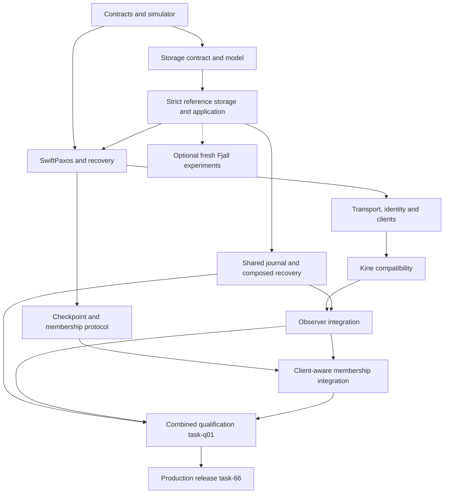

# TupleSky implementation task plan

**Status:** Review proposal, consolidated v1.4.  
**Date:** 2026-09-17.  
**Companion:** [TupleSky implementation design](tuplesky-design.md).  
**Scope:** 92 implementation tasks with stable `task-*` identifiers. The `task-01` through `task-66`, `task-s01` through `task-s04`, `task-j01` through `task-j10`, `task-o01` through `task-o06`, `task-m01` through `task-m05` and `task-q01` suffixes and prerequisites are preserved. Task IDs are not GitHub pull-request or issue numbers. One implementation PR corresponds to one task; its GitHub-assigned number is recorded separately. No baseline, supplement or separate amendment is needed.

## How to use this plan

**Convention:** use the full lowercase task ID in task references, anchors, branch names and PR titles (for example, `task-01: workspace and CI`). Open one PR for each task, and link that PR back to its task anchor. GitHub assigns an independent PR number; do not rename the task to match it. Historical review comments keep their old labels, but the current documents use `task-*` throughout.

The design is normative for behavior/dependency choices; this document partitions delivery. Direct prerequisites form a DAG, not a demand for serial development. Draft work may begin earlier but must be reviewed against its final base and land after prerequisites. Task count implies neither dates nor effort estimates.

Aim for one invariant or observable behavior per PR. Roughly 200-700 handwritten implementation lines plus focused tests is a review target, not a quota. Split an oversized task into explicitly named child tasks before coding and update the plan and prerequisites; each resulting task receives its own implementation PR. Never omit tests or fold unrelated cleanup into correctness work to reduce apparent size. Review generated fixtures, lockfiles and model counterexamples separately.

Every PR states problem, exact before/after behavior, design sections, test commands/results, a failure case and persistence/wire/security implications. Protocol work includes source-rule mapping and publication prerequisites. Schema changes state compatibility. Qualification assembles evidence; behavioral fixes receive focused review rather than hiding in test churn.

Reference single-store and fixed-membership compositions are early increments, not competing production architectures. No public insecure listener, simulator keys, weak-store bypass or test crypto may enter production artifacts. The authenticated fixed-membership preview remains explicitly bounded until permanent replacement and quorum-safe forgetting are complete. Production additionally requires the shared-journal, observer and client-aware integration gates below.

## Workstreams and release boundaries

| Tasks | Workstream | Boundary |
|---|---|---|
| task-01 through task-06 | Contracts, locked tooling and independent deterministic oracle | G0 |
| task-s01 through task-s02, task-07 through task-18 | Storage contract/model, strict redb reference, state, watch, leases and replicated auth | G1 |
| task-19 through task-29 | Source-mapped SwiftPaxos, durability, recovery and fast results | G2 |
| task-30 through task-43 | Native QUIC, clients and federated security | G3 authenticated preview |
| task-44 through task-48 | Go/Kine edge and actual Kubernetes conformance | G4 |
| task-49 through task-60 | Common checkpoints, semantic trimming, sealed handoff, restore and upgrades | G5 |
| task-61 through task-66 | Operability, WAN measurements and release evidence | G6, extended by task-q01 |
| task-s03 through task-s04 | Fresh isolated Fjall experiments and local comparison | Optional; not migration or second-engine production support |
| task-j01 through task-j10 | Shared journal, materialization, local checkpoint, runtime composition and multi-group qualification | task-j06 separately optional |
| task-o01 through task-o06 | Finalized streams, regional observers/relays, Kine watch/read integration | Capability-specific gates |
| task-m01 through task-m05 | Authoritative discovery, full-client Kine and integrated membership | Operational production requirement |
| task-q01 | Combined durable WAN/Kine qualification | Required before task-66 |



This is a workstream overview; the individual prerequisites are authoritative. Optional task-j06 is not an unconditional prerequisite of task-q01. Enabling that profile requires its separate evidence and inclusion in the applicable combined matrix. Former task-s05 through task-s08 remain retired and are not reused.

## Review index

| Task | Title | Direct prerequisites |
|---|---|---|
| [task-01](#task-01) | Lock the workspace and implement filtered GitHub CI | None |
| [task-02](#task-02) | Define identities, canonical commands and ordered-key fixtures | task-01 |
| [task-03](#task-03) | Implement the bounded postcard wire codec | task-02 |
| [task-04](#task-04) | Establish pure event/effect and durable-barrier interfaces | task-02 |
| [task-05](#task-05) | Build the deterministic world and replay format | task-04 |
| [task-06](#task-06) | Add an independent history oracle | task-02, task-05 |
| [task-07](#task-07) | Implement the redb adapter and fail-closed generation lifecycle | task-01, task-02, task-s01, task-s02 |
| [task-08](#task-08) | Implement the shared single-writer storage coordinator | task-04, task-07 |
| [task-09](#task-09) | Exercise the actual redb engine with disk faults | task-05, task-08 |
| [task-10](#task-10) | Implement the pure KV and transaction planner | task-02, task-04, task-06 |
| [task-11](#task-11) | Apply shared KV plans atomically and serve pinned MVCC views | task-08, task-09, task-10 |
| [task-12](#task-12) | Persist deduplication, result resolution and retry floors | task-11 |
| [task-13](#task-13) | Implement atomic watch replay and live handoff | task-11, task-12 |
| [task-14](#task-14) | Add bounded MVCC compaction | task-11, task-13 |
| [task-15](#task-15) | Implement native lease grant, attachment and revoke | task-10, task-11, task-12 |
| [task-16](#task-16) | Implement replicated renewal and conservative expiry | task-05, task-06, task-15 |
| [task-17](#task-17) | Add native atomic Kine primitives and private TTL bindings | task-12, task-16 |
| [task-18](#task-18) | Implement replicated sessions, policy and grant commitments | task-10, task-11, task-12 |
| [task-19](#task-19) | Freeze SwiftPaxos source mapping and bounded models | task-02, task-04, task-05 |
| [task-20](#task-20) | Persist ballots, promises and configuration guards | task-08, task-19 |
| [task-21](#task-21) | Implement the dependency graph and closure evidence | task-19, task-20 |
| [task-22](#task-22) | Implement normal leader proposal handlers | task-20, task-21 |
| [task-23](#task-23) | Implement normal follower vote and adoption handlers | task-20, task-21, task-22 |
| [task-24](#task-24) | Implement slow learning and ordered materialization | task-11, task-12, task-13, task-18, task-22, task-23 |
| [task-25](#task-25) | Implement durable recovery summaries and payload transfer | task-20, task-21, task-23 |
| [task-26](#task-26) | Implement recovery selection and new-ballot activation | task-19, task-24, task-25 |
| [task-27](#task-27) | Qualify fixed-membership crash recovery end to end | task-06, task-09, task-16, task-18, task-26 |
| [task-28](#task-28) | Implement full fast-path learning evidence | task-19, task-23, task-26, task-27 |
| [task-29](#task-29) | Add bounded speculative execution and result-release gating | task-12, task-18, task-24, task-28 |
| [task-30](#task-30) | Implement the Quinn transport adapter and TLS lifecycle | task-03, task-04, task-08 |
| [task-31](#task-31) | Implement QUIC traffic isolation and backpressure | task-30 |
| [task-32](#task-32) | Add packet-level quinn-proto simulation | task-05, task-30, task-31 |
| [task-33](#task-33) | Wire the trusted frontend collector and native dispatch | task-17, task-18, task-29, task-30, task-31 |
| [task-34](#task-34) | Implement the Rust SDK request lifecycle | task-03, task-12, task-30, task-33 |
| [task-35](#task-35) | Implement hardened external JWT and issuer verification | task-18 |
| [task-36](#task-36) | Implement RFC 8693 exchange and service credential signing | task-18, task-33, task-35 |
| [task-37](#task-37) | Bind API sessions and authorize live/replayed output | task-13, task-18, task-33, task-34, task-36 |
| [task-38](#task-38) | Implement OIDC browser login and the service code flow | task-18, task-35, task-36 |
| [task-39](#task-39) | Implement device authorization with bounded polling | task-38 |
| [task-40](#task-40) | Implement refresh families and secure CLI login | task-34, task-37, task-38, task-39 |
| [task-41](#task-41) | Implement the independent WIF node issuer | task-30, task-35 |
| [task-42](#task-42) | Bind genesis and committed membership to peer TLS | task-20, task-26, task-30, task-41 |
| [task-43](#task-43) | Compose secure daemons and qualify the native preview | task-09, task-16, task-27, task-32, task-33, task-37, task-40, task-42 |
| [task-44](#task-44) | Implement the Go postcard subset and shared fixtures | task-03 |
| [task-45](#task-45) | Implement the Go QUIC client and workload credentials | task-34, task-36, task-44 |
| [task-46](#task-46) | Implement Kine driver registration and CRUD/range backend | task-17, task-43, task-45 |
| [task-47](#task-47) | Complete Kine watches, progress, compaction and TTL | task-13, task-14, task-16, task-46 |
| [task-48](#task-48) | Certify the selected Kubernetes storage profile | task-47, task-j08 |
| [task-49](#task-49) | Export canonical shared checkpoints through portable snapshots | task-14, task-18, task-27 |
| [task-50](#task-50) | Install learner snapshots and reconcile catch-up state | task-25, task-42, task-49 |
| [task-51](#task-51) | Implement conservative all-voter checkpoint trimming | task-26, task-49, task-50 |
| [task-52](#task-52) | Model quorum-safe checkpoint activation | task-19, task-51 |
| [task-53](#task-53) | Implement quorum-safe checkpoint floors and recovery | task-26, task-50, task-52 |
| [task-54](#task-54) | Model sealed membership handoff | task-19, task-26, task-53 |
| [task-55](#task-55) | Persist old-configuration sealing and terminal recovery | task-25, task-26, task-54 |
| [task-56](#task-56) | Establish the unique handoff certificate | task-49, task-55 |
| [task-57](#task-57) | Activate the successor and recover interrupted handoffs | task-42, task-50, task-53, task-56 |
| [task-58](#task-58) | Implement node/key credential lifecycle and fencing tests | task-41, task-42, task-57 |
| [task-59](#task-59) | Implement backup, restore and disaster-recovery commands | task-49, task-50, task-57, task-58 |
| [task-60](#task-60) | Implement format/capability upgrades and rollback guards | task-03, task-07, task-50, task-57 |
| [task-61](#task-61) | Complete bounded observability and operator diagnostics | task-31, task-43, task-53, task-57 |
| [task-62](#task-62) | Build and run the matched native WAN benchmark matrix | task-29, task-32, task-43, task-53, task-61 |
| [task-63](#task-63) | Measure Kine end-to-end overhead and regression budgets | task-48, task-61, task-62 |
| [task-64](#task-64) | Run mixed-fault qualification and automatic minimization | task-09, task-27, task-32, task-40, task-48, task-53, task-57, task-58, task-60 |
| [task-65](#task-65) | Package and qualify supported deployment targets | task-43, task-48, task-59, task-60, task-61 |
| [task-66](#task-66) | Close security, supply-chain and production release gates | task-58, task-59, task-60, task-63, task-64, task-65, task-q01 |
| [task-s01](#task-s01) | Define the portable engine contract and logical collection registry | task-02, task-04 |
| [task-s02](#task-s02) | Implement the model engine and common storage conformance kit | task-05, task-s01 |
| [task-s03](#task-s03) | Add an experimental single-writer Fjall adapter | task-08, task-s02 |
| [task-s04](#task-s04) | Replay fresh fixtures and compare local engine costs early | task-09, task-14, task-17, task-18, task-s03 |
| [task-j01](#task-j01) | Define the journal, sequence and materialization contracts | task-01, task-02, task-s01, task-s02 |
| [task-j02](#task-j02) | Implement the pinned raft-engine journal and postcard codec | task-j01 |
| [task-j03](#task-j03) | Integrate journal-first shared storage and atomic materialization | task-j02, task-08, task-11 |
| [task-j04](#task-j04) | Publish local recovery checkpoints and reclaim journal prefixes | task-j03, task-09 |
| [task-j05](#task-j05) | Qualify the real journal and composed persistence boundary | task-j02, task-j03, task-j04, task-j08, task-09 |
| [task-j06](#task-j06) | Enable replay-backed working-state materialization, optional | task-j04, task-j05 |
| [task-j07](#task-j07) | Validate multi-group batching and resource isolation | task-j03, task-j05, task-31 |
| [task-j08](#task-j08) | Compose journal-backed application and serving storage | task-j03, task-43 |
| [task-j09](#task-j09) | Establish a caller's session as a replicated command | task-18, task-37, task-j08 |
| [task-j10](#task-j10) | Give the Rust client a real unary request path | task-34, task-43 |
| [task-o01](#task-o01) | Specify finalized frames and observer capabilities | task-02, task-03, task-28, task-49 |
| [task-o02](#task-o02) | Build MVCC observer install, catch-up and serving lifecycle | task-o01, task-j03, task-50 |
| [task-o03](#task-o03) | Add regional relays, bounded fan-out and source failover | task-o02, task-31 |
| [task-o04](#task-o04) | Route Kine watches to observers with correct progress | task-o02, task-48 |
| [task-o05](#task-o05) | Add observer historical reads and authoritative read fences | task-o04, task-18 |
| [task-o06](#task-o06) | Qualify observer correctness and regional scaling | task-o03, task-o04, task-o05, task-j05 |
| [task-m01](#task-m01) | Define authoritative configuration discovery and epoch records | task-02, task-19 |
| [task-m02](#task-m02) | Make Kine a full epoch-aware trusted collector | task-m01, task-33, task-48 |
| [task-m03](#task-m03) | Connect observer staging to sealed handoff and activation | task-m01, task-o02, task-57, task-j04 |
| [task-m04](#task-m04) | Implement conservative regional placement and quorum tuning | task-m03, task-m02 |
| [task-m05](#task-m05) | Qualify client-aware membership under mixed failures | task-m02, task-m03, task-m04, task-58 |
| [task-q01](#task-q01) | Produce the combined durable WAN/Kine qualification report | task-j07, task-j08, task-o06, task-m05, task-63, task-64 |

## Task specifications

<a id="task-01"></a>
### task-01: Lock the workspace and implement filtered GitHub CI

**Prerequisites:** None.  
**Design:** Sections 12.4.1, 16, 21.3.

**Implement:** Create Rust/Go workspace skeleton, exact toolchain files, Cargo.lock/go.sum, explicit TLS features and checksummed tool manifest. Add xtask, format/lint/test entry points, dependency policy, Mermaid rendering and references. Include the full raft-engine Git candidate, feature/platform audit and codec smoke test; do not silently change other selections.

Add the actual GitHub Actions entry/documentation workflows and reusable Rust/Go build-test workflow, plus a repository-owned filter script and fixtures, implementing design Section 12.4.1. The lightweight classifier gates expensive jobs before toolchain setup; docs-only changes still run documentation checks and report the stable required CI gate. Pin actions/tools, use minimal permissions and preserve a manual/scheduled full-run path. These are deliverables of task-01, not scripts to add to the design package.

**Acceptance:** Build the selected graph on Linux x86_64/aarch64; record actual compiler/MSRV and feature trees. Fail checks for insecure test dependency in production, missing locks, malformed Mermaid or unreviewed override. Resolve candidate incompatibilities explicitly.

Test docs-only and mixed changes; Rust/Go source, lock/toolchain/schema/fixture/model/workflow/filter changes; unknown paths; additions/deletions/type changes/renames; more than 300 changed files; missing/shallow history; PR/push/merge-group events; and manual/scheduled full runs. Demonstrate that a docs-only PR starts no heavy build job, a code-bearing change starts the appropriate jobs, and a failed/missing/cancelled required job or classifier never yields a green gate or a permanently pending path-filtered required check. Check Markdown references, every full task ID/anchor, graph consistency and Mermaid in the lightweight job.

**Review boundary:** No service/protocol implementation. Proposed pins are not presumed compile-tested. This describes future repository checks, not local authoring scripts included in the design package.

The filter/workflows are maintained repository CI, not the temporary authoring/validation utilities excluded from the design package. No service/protocol implementation or placeholder success for not-yet-implemented test suites.

<a id="task-02"></a>
### task-02: Define identities, canonical commands and ordered-key fixtures

**Prerequisites:** task-01.  
**Design:** Sections 2.3, 4.4, 10.5.1, 17.2.

**Implement:** Add coord-types logical_v1, fixed IDs, checked revisions, stable invocation identity/errors and canonical hashes. Freeze namespace/key/revision encoding vectors. Reserve configuration epochs, finalized-frame/read-fence identities and local journal sequence separately.

**Acceptance:** Property-test encoded ordering including zeros/prefixes. Payload change changes digest; token/endpoint/epoch refresh does not change the same logical request. Reject overflow, ambiguous encodings and mistaken identity/counter reuse.

**Review boundary:** No network, ambient clocks/random IDs inside core or automatic schema evolution.

<a id="task-03"></a>
### task-03: Implement the bounded postcard wire codec

**Prerequisites:** task-02.  
**Design:** Sections 11.2, 19.1, 6.7.1, 10.5.

**Implement:** wire_v1 DTOs, frame reader/writer, explicit kinds/versions, bounded Serde types, valid/invalid vectors and fuzz target. Reserve distinct observer/configuration/collector-evidence/read-fence schemas; durable journal representation is separately versioned.

**Acceptance:** Reject all header truncations, integer/length overflow, trailing bytes, unknown versions and oversized nested collections before excessive allocation. Identity-bearing payloads canonicalize consistently.

**Review boundary:** No sockets or general Go Serde framework. Stable DTOs, not implementation-enum serialization.

<a id="task-04"></a>
### task-04: Establish pure event/effect and durable-barrier interfaces

**Prerequisites:** task-02.  
**Design:** Sections 5.1, 4.8, 18.

**Implement:** Add injected clocks/entropy, owned events/effects, PersistBatch, incarnation/boot-scoped barriers and private established/admission capabilities. Distinguish JournalDurable, Materialized and LocalCheckpointPublished from protocol establishment. Vote-producing effects carry epoch/ballot/prerequisite context; supply test ports only.

**Acceptance:** A two-barrier effect cannot release after one. Wrong-boot, duplicate/failed and obsolete-ballot completions never newly authorize it. Compile-boundary checks exclude Tokio, engine crates/system clocks from pure core.

**Review boundary:** No actual database, consensus or insecure production composition; types support but do not prove learning predicates.

<a id="task-05"></a>
### task-05: Build the deterministic world and replay format

**Prerequisites:** task-04.  
**Design:** Sections 12, 21.1.

**Implement:** Ordered virtual scheduler, lifecycle crashes/restarts, clocks, messages and named ChaCha streams. Versioned replay bundles include source/build/config/lock and explicit schedules. Add deliberately faulty actor.

**Acceptance:** Identical replay has identical visible history/digests; insertion ties explicit. An omitted durable prerequisite is reproducibly caught/minimized and saved. Wrong version fails clearly, not a false reproducibility claim.

**Review boundary:** Logical simulation is not real-engine or QUIC packet coverage. No production secret/test entropy leakage.

<a id="task-06"></a>
### task-06: Add an independent history oracle

**Prerequisites:** task-02, task-05.  
**Design:** Sections 6, 12.3, 21.1.

**Implement:** Separate reference model and complete-domain linearizability/revision/retry/conditional checker with extensible lease/auth/watch observations and pending-operation treatment.

**Acceptance:** Reject injected stale read after acknowledged write, duplicate mutation, wrongly shared revision and missing transaction event; accept valid concurrent histories. Keep performance and correctness reporting separate.

**Review boundary:** Do not reuse production planner as oracle or partition shared-revision/transaction/policy histories by key.

<a id="task-07"></a>
### task-07: Implement the redb adapter and fail-closed generation lifecycle

**Prerequisites:** task-01, task-02, task-s01, task-s02.  
**Design:** Sections 5.2, 17.1, 17.9–17.11, 17.13.

**Implement:** coord-storage-redb maps pinned cross-table snapshots, byte tables, explicit durable transactions and typed failures to common contract. Verified manifests/root locks gate opening; codecs remain common. This is the strict materialization/reference foundation; journal-first production arrives in task-j03.

**Acceptance:** Common ordered-access/transaction suites pass; wrong origin/domain/generation/engine, empty/missing/corrupt files fail closed, duplicate open excluded. Cross-catalog atomicity includes read-your-writes scans.

**Review boundary:** No implicit create-on-open, engine-local application semantics, bespoke WAL, Fjall implementation or migration. A real-engine pass does not establish composed journal recovery.

<a id="task-08"></a>
### task-08: Implement the shared single-writer storage coordinator

**Prerequisites:** task-04, task-07.  
**Design:** Sections 17.3, 17.8–17.10.

**Implement:** Strict reference StoreWorker<E>, guard validation in transactions, shared update lowering/stamps, bounded grouping and durable-view gate; call commit_durable, not redb in common code. Preserve as a reference increment; task-j03 introduces authoritative journal-first transitions and distinct projection events.

**Acceptance:** Model/redb fixtures cover visibility before completion, definite guard rejection, indeterminate commit, lost/old-boot completion. No view/publication escapes without required support. Unrelated protocol stamp updates do not invalidate application predecessor.

**Review boundary:** No direct native engine imports in coord-storage, unbounded blocking work, public storage sequences or silently weakened periodic flush profile.

<a id="task-09"></a>
### task-09: Exercise the actual redb engine with disk faults

**Prerequisites:** task-05, task-08.  
**Design:** Sections 17.3, 17.14, 21.2.

**Implement:** Pinned real redb StorageBackend with volatile/durable images and controlled writes/sync; shared fixtures, reopen and subprocess death, plus generation-manager directory faults.

**Acceptance:** Crash at each bounded transaction write/sync boundary and reopen only permitted states. Test partial persistence on sync error, ENOSPC, durable-prefix corruption quarantine and prevention of destructor flush after simulated crash.

**Review boundary:** Model engine is not byte-level redb testing. This does not certify Fjall, arbitrary OS power loss, raft-engine or the composed boundary in task-j05.

<a id="task-10"></a>
### task-10: Implement the pure KV and transaction planner

**Prerequisites:** task-02, task-04, task-06.  
**Design:** Sections 6.1–6.3, 17.4.

**Implement:** Exact/range views, compares, put/delete, chosen transaction branch, revisions and deterministic owned ReadView/ApplyPlan using fixture views. Include semantic work/response limits.

**Acceptance:** Check create/mod/version, absence, byte intervals, failed/read-only/no-op revisions and one revision for an atomic multi-key mutation. Limits fail before partial changes.

**Review boundary:** No production DB, clock-dependent lease expiry or ambient time in planner.

<a id="task-11"></a>
### task-11: Apply shared KV plans atomically and serve pinned MVCC views

**Prerequisites:** task-08, task-09, task-10.  
**Design:** Sections 17.2, 17.4, 17.9–17.10.

**Implement:** Common bounded view construction/current/history/events/execution updates through state port; ApplyBase check, fixed-revision scan and owned pages without engine imports. task-j03 later journals immutable plans before this same atomic materialization.

**Acceptance:** Model/redb identical fixtures; crash leaves no partial events/frontier mismatch; choose history versions before limit. Stale base replans; page/reverse/boundary and ahead-of-durability views are tested.

**Review boundary:** Pinned snapshot is not linearizable authority or quorum establishment. No per-engine MVCC implementations.

<a id="task-12"></a>
### task-12: Persist deduplication, result resolution and retry floors

**Prerequisites:** task-11.  
**Design:** Sections 6.5, 17.1, 10.5.3.

**Implement:** Atomic request digest/result/executed identity and effects; bounded outstanding window, ResolveRequest and replicated retirement floor. State is transferable across epochs and exact replay.

**Acceptance:** Lost response/same ID yields same currently authorized logical result. Changed payload rejected; materialization-notification crash does not duplicate. Retired/unknown session request cannot execute as new work.

**Review boundary:** No infinite retention or exactly-once guarantee across lost upstream invocation identity.

<a id="task-13"></a>
### task-13: Implement atomic watch replay and live handoff

**Prerequisites:** task-11, task-12.  
**Design:** Sections 6.4, 6.8.2–6.8.3, 19.3.

**Implement:** Replay/live registration frontier, complete revisions, bounded queues, ordered progress and resumable close/cancellation.

**Acceptance:** Mutation during registration appears with no gap; slow consumers cannot advance over omitted changes. Fragmented multi-key revision remains atomic. Loom covers local handoff boundary; progress cannot overtake pending events.

**Review boundary:** No public watch before auth composition and no progress from socket receipt.

<a id="task-14"></a>
### task-14: Add bounded MVCC compaction

**Prerequisites:** task-11, task-13.  
**Design:** Sections 6.4, 17.5.

**Implement:** Ordered retention floor and incremental history/event GC preserving needed value/tombstone at/before boundary and newer versions. Explicit active-view/watch retention. Common layer chooses deletion; physical engines reclaim afterward.

**Acceptance:** Before-floor reads return Compacted; later reads retain untouched old values. Pagination/watch resume either maintain history or fail explicitly, never skip gaps.

**Review boundary:** No semantic protocol trimming, engine-owned TTL/filter or exclusive live-file compaction.

<a id="task-15"></a>
### task-15: Implement native lease grant, attachment and revoke

**Prerequisites:** task-10, task-11, task-12.  
**Design:** Sections 7.1, 17.1.

**Implement:** Stable nonreused lease IDs/generations, owner permissions, reverse index and atomic attach/detach/revoke plans with count/worst-case byte quotas. Keep Kine private bindings distinct.

**Acceptance:** Revoke deletes only current attachments atomically; later value growth cannot evade event budget. Retry does not grant twice/allocate new revision. Unauthorized attachment cannot imply protected-key deletion.

**Review boundary:** No timers/keepalive success outside consensus or automatic logout-based ownership change.

<a id="task-16"></a>
### task-16: Implement replicated renewal and conservative expiry

**Prerequisites:** task-05, task-06, task-15.  
**Design:** Sections 7.2–7.4.

**Implement:** Renewal sequence, replicated expiry authority epoch, timer generations and conditional expiration; conservative recovery rearming under clock assumptions. Renewals stay replicated with exact retry semantics.

**Acceptance:** Renewal/expiry permutations, delayed old leader, restart, no quorum and fast-clock bounds are checked against true simulator time. Stale timer cannot delete renewed/rebound keys; delayed reply creates no new TTL anchor.

**Review boundary:** No exact expiry deadline, observer-local keepalive success or external fencing implied by lease alone.

<a id="task-17"></a>
### task-17: Add native atomic Kine primitives and private TTL bindings

**Prerequisites:** task-12, task-16.  
**Design:** Sections 6.6, 19.5.

**Implement:** Create/CAS-update/conditional-delete returns all revision/conflict metadata in one result. Kine TTL seconds map to private per-key binding; zero detaches. Stable invocation derives binding identity; expiry is conditional.

**Acceptance:** Failed CAS changes neither data nor expiry. Replaced TTL fences prior timer. Retries preserve binding. Trace proves one logical operation, no mandatory pre-read/CurrentRevision/lease-grant round trip.

**Review boundary:** No Go code, nativeLeaseID=TTL or unconditional local deletes.

<a id="task-18"></a>
### task-18: Implement replicated sessions, policy and grant commitments

**Prerequisites:** task-10, task-11, task-12.  
**Design:** Sections 9.2–9.3, 20.2–20.3.

**Implement:** Principal/ceiling, session/rule generations, one-time receipt/code commitments and ordered permission/revocation at execution. Extend independent oracle; policy can advance execution without KV revision.

**Acceptance:** Check branch-specific comparisons/operations, full range containment, lease restrictions and policy changes after admission. Revoked users cannot read protected cached retry outcomes.

**Review boundary:** No external JWT verification/signing/network/clock during deterministic replay.

<a id="task-19"></a>
### task-19: Freeze SwiftPaxos source mapping and bounded models

**Prerequisites:** task-02, task-04, task-05.  
**Design:** Sections 4, 5.1, 18.1, 21.6.

**Implement:** Pin paper/code source rules, guards, full path-learning predicates, C2 memberships and durable publication obligations. Model concrete phases, atomic dependency publication, recovery cuts and source-defined candidate selection with traceability.

**Acceptance:** Every handler/field maps to source or marked extension. Reject arbitrary fastest-majority, observer/duplicate votes and half-initialized dependencies. Permute valid phase/preaccept reports without replacing source selection by highest-phase-wins. Save counterexamples.

**Review boundary:** No optimization or unrestricted proof claim from finite models. Upstream implementation/invariant mismatches are neither proved fundamental failure nor automatically resolved.

<a id="task-20"></a>
### task-20: Persist ballots, promises and configuration guards

**Prerequisites:** task-08, task-19.  
**Design:** Sections 4.1, 4.7–4.8, 5.1, 18.1.

**Implement:** Stable promises/config-role/generation guards and source-required protocol rows. Wire recovered promises to actor. Carry same-boot epoch/ballot context on effects as well as boot identity; production persistence later uses task-j03 events.

**Acceptance:** Promise replies wait for complete durable state. Old messages cannot lower it after restart. Wrong configuration identity does not vote. Delay callbacks/batcher across election; bookkeeping cannot authorize a new obsolete vote. Atomic initialized-state/index publication and dependency-phase prerequisites hold.

**Review boundary:** No full recovery selection or Raft term semantics. Future journal integration must rerun these tests at its cut, not presume reference tests suffice.

<a id="task-21"></a>
### task-21: Implement the dependency graph and closure evidence

**Prerequisites:** task-19, task-20.  
**Design:** Sections 4.2–4.9, 18.1–18.3.

**Implement:** Immutable payload binding, path/predecessor state, exact traversal/closure, source phase guards and bounded incremental work. Publish initialization and dependency lookup atomically; persist required dependencies.

**Acceptance:** Direct-set equality differs from full path evidence. Duplicate/reordered messages converge; conflict arriving while another command initializes cannot see START as processed state. Bounds backpressure without deleting unresolved acceptance. Dependencies reach required accept/commit/execute phase before dependent transition.

**Review boundary:** No path compression, per-key conflict relaxation or receipt-order execution.

<a id="task-22"></a>
### task-22: Implement normal leader proposal handlers

**Prerequisites:** task-20, task-21.  
**Design:** Sections 4.1–4.8, 18.

**Implement:** Source-mapped leader transitions/publication, conservative conflicts and ballot-fixed fast set. Use atomic initialization and prerequisite-gated effects.

**Acceptance:** Golden traces match models; every leader reply has exact stable support. Reordered/duplicate client requests cannot bind conflicting payload. Block premature accept/commit/finalized execution while dependencies lag.

**Review boundary:** No learning shortcut, speculative public response or recovery-selection implementation hidden here.

<a id="task-23"></a>
### task-23: Implement normal follower vote and adoption handlers

**Prerequisites:** task-20, task-21, task-22.  
**Design:** Sections 4, 5.1, 18.

**Implement:** Source fast votes/leader-order adoption with all persistence/history prerequisites and atomic phase/index visibility.

**Acceptance:** Leader/follower message races, conflict arrival permutations, duplicate identities and crashes between state/vote preserve learning obligations. Half-initialized dependencies never appear; dependency-phase guards are explicit, not an inherited prototype TODO.

**Review boundary:** Matching direct dependencies is not a complete learning proof. Keep source semantics with new storage event names; no Raft terms/indexes.

<a id="task-24"></a>
### task-24: Implement slow learning and ordered materialization

**Prerequisites:** task-11, task-12, task-13, task-18, task-22, task-23.  
**Design:** Sections 4.3–4.5, 17.4, 18.3.

**Implement:** Conservative slow learner, closed dependency execution, EstablishedResult capability and deterministic application through common materializer; feed complete finalized event frontiers.

**Acceptance:** Three/five-voter logical histories match KV/transaction/retry/policy oracle. One leader response cannot establish success. No watch event precedes irrevocable application. Preserve source learning under later journal-first composition.

**Review boundary:** Externally visible fast completion remains off. No copied read-index shortcut or projection commit mistaken for quorum learning.

<a id="task-25"></a>
### task-25: Implement durable recovery summaries and payload transfer

**Prerequisites:** task-20, task-21, task-23.  
**Design:** Sections 4.8–4.9, 5, 17.1, 19.3.

**Implement:** Bounded source prior-ballot summaries, stable votes, unresolved closure/payload transfer with identity/digest checks and durable prerequisites. Define authoritative recovery cut independent of lagging projection.

**Acceptance:** Incomplete/corrupt pages never count; old required ballot state survives crash. Missing payload fetches/blocks, not fabricated empty command. Hold projection behind journal and old sends/callbacks across recovery. Source phase differences remain legal where allowed; incompatible required-equal candidates are diagnosed.

**Review boundary:** No selection from incomplete summary/application-only snapshot, physical packet-drain correctness assumption or blind union of histories.

<a id="task-26"></a>
### task-26: Implement recovery selection and new-ballot activation

**Prerequisites:** task-19, task-24, task-25.  
**Design:** Sections 4.1, 4.8–4.9, 5, 18.1.

**Implement:** Source recovery cases preserve potentially chosen commands/closure, durably bind selected Sync and activate the recovered ballot; restore exact results/retries. Resolve submitted work at authoritative cut before new reply.

**Acceptance:** Preserve learned outcomes despite lost volatile commit notifications. Competing recovery, delayed replies, lagging projection and same-boot old effects cannot establish divergence. Permuted reports give permitted stable selection; crash after Sync cannot publish incompatible result under same ballot.

**Review boundary:** No membership change, majority-of-anything, highest-phase heuristic, or dropping work for absent COMMIT marker.

<a id="task-27"></a>
### task-27: Qualify fixed-membership crash recovery end to end

**Prerequisites:** task-06, task-09, task-16, task-18, task-26.  
**Design:** Sections 4.9, 5, 12, 21.

**Implement:** Real-engine plus logical-network campaigns around vote/reply/materialization and restart combinations within budget; retain minimal regressions and recovery-report permutations.

**Acceptance:** Acknowledged outputs, retry digests and lease/policy state survive; minority cannot write. Deliberately omit durable record and detect failure. Crash after recovery result publication preserves same-ballot choice. State precise reference versus later composed-storage coverage.

**Review boundary:** Qualification does not hide protocol fixes; those get focused review. No claim that reference redb tests qualify raft-engine automatically.

<a id="task-28"></a>
### task-28: Implement full fast-path learning evidence

**Prerequisites:** task-19, task-23, task-26, task-27.  
**Design:** Sections 4.2–4.9, 18.3.

**Implement:** Exact source path-learning predicate and private establishment object sharing normal/recovery history with slow path.

**Acceptance:** Valid/invalid paths, mixed ballot/epoch, duplicate identity and recovery-phase variations are covered. Forced-slow/fast paths yield equal controlled logical results. Persisted recovery selection remains stable across restart and does not use generic phase priority.

**Review boundary:** No speculative overlay/public response plumbing or arbitrary quorum counter.

<a id="task-29"></a>
### task-29: Add bounded speculative execution and result-release gating

**Prerequisites:** task-12, task-18, task-24, task-28.  
**Design:** Sections 4.3–4.9, 17.4, 18.1.

**Implement:** Disposable deterministic overlays and digests for established fast outcomes; release binds command, closed order, permission and durable recovery evidence.

**Acceptance:** Tentative reordering leaks no value/credential. Fast result followed by crash before COMMIT propagation recovers same outcome; recovery report permutations and restart preserve Sync selection. Speculative events/tokens are impossible at public boundary.

**Review boundary:** No extra mandatory WAN commit phase, weakened predicate or durability to improve charts.

<a id="task-30"></a>
### task-30: Implement the Quinn transport adapter and TLS lifecycle

**Prerequisites:** task-03, task-04, task-08.  
**Design:** Sections 11, 19.1–19.4.

**Implement:** Bounded reliable streams, ALPN, explicit AWS-LC provider, handshake/close and owned dispatch. Separate role negotiation for collectors/voters/observers; isolated test certificates until real issuance.

**Acceptance:** Malformed frames, origin/role/version mismatch fail closed. No application 0-RTT. Transport ACK never triggers durability/establishment. Bound shutdown/work. Sparse necessary connections are supported, not an assumed fleet full mesh.

**Review boundary:** No HTTP3, voting solely from test certificate, public unauthenticated service or untrusted Kine collector role.

<a id="task-31"></a>
### task-31: Implement QUIC traffic isolation and backpressure

**Prerequisites:** task-30.  
**Design:** Sections 3.3, 11.3–11.7, 19.2–19.3.

**Implement:** Explicit CUBIC, bounded control/unary/watch/bulk connections, shared destination budget, fair group scheduling and role-specific replication capacity.

**Acceptance:** Stalled bulk/watch cannot consume all control queues/streams; large frames cannot force unlimited buffering. Measure queue/credit wait distinct from RTT. Relay fan-out respects node/destination admission.

**Review boundary:** No universal no-jitter/latency claim, unbounded pools, idle-delay batching or congestion-budget evasion by more connections.

<a id="task-32"></a>
### task-32: Add packet-level quinn-proto simulation

**Prerequisites:** task-05, task-30, task-31.  
**Design:** Sections 12.2, 21.2.

**Implement:** Pinned packet/time-driven protocol and controlled protocol RNG, separately linked test crypto/identity; shared framing/queue behavior.

**Acceptance:** Reproduce packet loss/reorder/MTU/credit schedules; cross-check message-level visible outcomes. Production graph excludes deterministic keys. Real rustls handshake/Go interoperability independently passes. Include sparse observer/collector topology under bounds.

**Review boundary:** Endpoint RNG alone does not make TLS/all ID generation deterministic.

<a id="task-33"></a>
### task-33: Wire the trusted frontend collector and native dispatch

**Prerequisites:** task-17, task-18, task-29, task-30, task-31.  
**Design:** Sections 3, 4.3, 19.4.

**Implement:** Admission interface, parallel direct voter fan-out, source-exact collector, unary and finalized watch dispatch in test composition. Freeze the collector contract for authorized Go reuse; role-scoped access never becomes general user voting access.

**Acceptance:** Packet traces have no unnecessary serial leader hop; lone reply never releases tentative data. Cancellation preserves identity/outcome resolution. Count voter identities rather than connections; bound per-domain collection.

**Review boundary:** No untrusted SDK votes or production listener before security gate. Full Go/epoch collector integration is task-m02.

<a id="task-34"></a>
### task-34: Implement the Rust SDK request lifecycle

**Prerequisites:** task-03, task-12, task-30, task-33.  
**Design:** Sections 6.5, 11.5, 19.4.

**Implement:** Credential providers, bounded warm pools, stable instance/sequence, deadlines, ResolveRequest and typed retry errors.

**Acceptance:** Reconnect/reset/timeout preserves invocation/payload. Payload change conflicts; ambiguous timeout reports unknown outcome. Stream pressure bounded, no fresh token exchange per operation.

**Review boundary:** No implicit fresh-ID retry or unauthenticated exposure of protocol evidence.

<a id="task-35"></a>
### task-35: Implement hardened external JWT and issuer verification

**Prerequisites:** task-18.  
**Design:** Sections 9, 20.1–20.2.

**Implement:** Distinct OIDC/WIF verifier types, configured algorithms/audiences/claims, bounded JWKS and hardened HTTP. Kubernetes offline JWT and explicit TokenReview are separate modes.

**Acceptance:** Reject mix-up/alg confusion/wrong audience/time/claims, token-directed endpoints and unknown-kid floods. Simulate cache staleness, clock-health failure, issuer and TokenReview outage. Record admitted receipts, never raw JWTs.

**Review boundary:** No signing, arbitrary cloud identity formats or claims directly granting permission.

<a id="task-36"></a>
### task-36: Implement RFC 8693 exchange and service credential signing

**Prerequisites:** task-18, task-33, task-35.  
**Design:** Sections 9.1–9.4, 20.2.

**Implement:** Bounded Axum exchange, canonical receipts, atomic session creation and ES256 tokens with key publication/rotation. Keep keys outside replicated state.

**Acceptance:** Execution rechecks policy changed after verification. Outage/stale keys fail closed; no raw JWT/private keys in storage/logs. Lifetime/scope ceiling and single-use receipt hold.

**Review boundary:** No long-lived WIF refresh or per-operation IdP calls.

<a id="task-37"></a>
### task-37: Bind API sessions and authorize live/replayed output

**Prerequisites:** task-13, task-18, task-33, task-34, task-36.  
**Design:** Sections 6.4–6.5, 6.9.3, 9.3, 19.4.

**Implement:** Persistent auth binding/rebind, expiry, ordered revocation and fresh permission gates for reads, retries and each selected output batch. Share barriers only for already-selected batches.

**Acceptance:** Expired warm connection cannot admit; post-revocation protected data denied even from historical/cached results. Watch progress cannot bypass output barrier. Previously authorized in-flight work follows documented completion semantics.

**Review boundary:** Token admission freezes neither policy for connection lifetime nor retroactive cancellation. Observer ordered policy replay never silently weakens this requirement.

<a id="task-38"></a>
### task-38: Implement OIDC browser login and the service code flow

**Prerequisites:** task-18, task-35, task-36.  
**Design:** Sections 8, 20.1.

**Implement:** Upstream openidconnect client plus service code/PKCE/state/nonce/exact redirects, application azp validation and bounded pending login. Keep service/upstream flow identities separate.

**Acceptance:** Wrong/missing azp and multi-audience, CSRF/mix-up, code/redirect substitution, concurrent tabs and broker restart negative tests. One code creates at most one session.

**Review boundary:** Crate is not a service authorization server; no email-based principal or public CLI secret.

<a id="task-39"></a>
### task-39: Implement device authorization with bounded polling

**Prerequisites:** task-38.  
**Design:** Sections 8.1, 20.1–20.3.

**Implement:** Service device/user codes, browser approval, expiry, bounded poll/backoff and atomic consumption using existing upstream browser login.

**Acceptance:** Concurrent pollers cannot mint multiple sessions. Denied/expired/pending/slow_down handled; attempts/floods bounded. Upstream device grant is not assumed.

**Review boundary:** No secret in user code/URL or unapproved code acceptance.

<a id="task-40"></a>
### task-40: Implement refresh families and secure CLI login

**Prerequisites:** task-34, task-37, task-38, task-39.  
**Design:** Sections 8.2, 20.3.

**Implement:** Rotating family commitments/reuse revocation; coordctl browser/device/logout/refresh with explicit OS keyring stores and serialized shared-credential updates.

**Acceptance:** Lost rotated-secret response requires documented fresh login. Concurrent refresh/revoked family/missing or locked keyring tests. Explicit Apple keychain feature; no plaintext fallback, args/log leakage or simulator entropy.

**Review boundary:** Headless uses WIF, not desktop refresh in deployment config. No unimplemented transparent secret recovery.

<a id="task-41"></a>
### task-41: Implement the independent WIF node issuer

**Prerequisites:** task-30, task-35.  
**Design:** Sections 10.1–10.2, 20.4.

**Implement:** Independently deployed issuer, protected reference CA signer, configured external trust, CSR possession and policy-constructed identities/extensions. Validate CA/key/constraints at startup.

**Acceptance:** Cold enrollment works before any voter. Reject signature/algorithm/SAN/CA/lifetime/workload errors; issuer outage fails closed. Root credentials remain protected outside quorum data.

**Review boundary:** No arbitrary CSR extension copy, quorum-dependent bootstrap or certificate-implies-vote assumption. HSM is optional implementation, not missing required service.

<a id="task-42"></a>
### task-42: Bind genesis and committed membership to peer TLS

**Prerequisites:** task-20, task-26, task-30, task-41.  
**Design:** Sections 10, 17.1, 20.4.

**Implement:** Signed/pinned genesis with durable initialization, ordinary TLS plus committed key/incarnation/role checks and exact voter identity.

**Acceptance:** Wrong origin/stale generation/frontend/observer/learner cannot vote. Duplicate/cloned identity not counted twice. Missing/rolled-back files require quarantine/new-generation lifecycle, not TOFU/reinitialize.

**Review boundary:** Fixed configuration; membership handoff remains later. Normal certificate validation must not be disabled for URI binding.

<a id="task-43"></a>
### task-43: Compose secure daemons and qualify the native preview

**Prerequisites:** task-09, task-16, task-27, task-32, task-33, task-37, task-40, task-42.  
**Design:** Sections 22.1–22.2, 23 G3.

**Implement:** Role-specific binaries, strict TOML, bounded supervised workers, startup/readiness/shutdown and secret-safe diagnostics. Document fixed-member/reference-storage preview restrictions.

**Acceptance:** Cold auth bootstrap, browser/device/WIF, warm expiry, restart, overload and disk quarantine. Production dependency graph excludes test keys/bypasses; cached leadership not fresh-quorum readiness.

**Review boundary:** No general-production claim; lifecycle and journal/observer/client integration gates remain. Reference preview does not supersede selected production architecture.

<a id="task-44"></a>
### task-44: Implement the Go postcard subset and shared fixtures

**Prerequisites:** task-03.  
**Design:** Sections 3.2, 6.6, 19.1.

**Implement:** adapters/kine/wire from frozen frames/schema manifest, required DTOs with checked varints/signed/length/full-consumption handling. Reserve authorized collector/configuration schemas for later client integration.

**Acceptance:** Rust→Go and Go→Rust all valid vectors; malformed corpus rejected within budget. Schema change requires reviewed fixtures and version consequences.

**Review boundary:** No Go voting state machine, cgo/FFI, native protobuf or arbitrary Serde reflection.

<a id="task-45"></a>
### task-45: Implement the Go QUIC client and workload credentials

**Prerequisites:** task-34, task-36, task-44.  
**Design:** Sections 19.4–19.5.

**Implement:** Plain quic-go streams, trust/origin binding, WIF provider/rebind, bounded pools and stable invocation retry/resolve. Handle rotating token files/single-flight refresh.

**Acceptance:** Actual Rust/Go TLS, expiry, stream reset, timeout and warm reconnect pass. No per-operation federation or HTTP3 native transport. Unknown outcomes remain explicit.

**Review boundary:** No exactly-once across lost upstream identity; epoch-aware collection is task-m02.

**Deferred to task-46:** the session binding handshake. On task-45 the client sends only the Hello, reads no HelloAck and sends no Bind, so the service token is obtained but never presented and the Rust frontend refuses the connection's requests as not bound. task-46 keeps the control stream open, reads the HelloAck, presents the token once in a Bind frame and waits for the BindAck.

<a id="task-46"></a>
### task-46: Implement Kine driver registration and CRUD/range backend

**Prerequisites:** task-17, task-43, task-45.  
**Design:** Sections 6.6, 19.5.

**Implement:** Register coord:// in frozen Kine build and exact Start/Get/Create/Update/Delete/List/Count/DbSize/CurrentRevision/error metadata mapping. Bind one domain, handle reserved/health conventions.

Configure the privileged API-server-to-Kine edge according to Section 3.1: restricted local transport or verified mTLS, with Kine accepting only authorized API-server identities for its domain. Same-region placement does not justify plaintext or unauthenticated network access.

**Acceptance:** Actual bridge tests revisions, absent/mismatch metadata, byte intervals/count/pagination and idempotent startup keys. Trace one conditional command, no WAN pre-read/revision follow-up.

Reject insecure network-listener configuration and invalid server/client identity; verify the intended local-only deployment is not reachable by untrusted workloads.

**Review boundary:** No logstructured SQL/TTL wrapper, invented counters or unsupported general etcd transaction claims. Early proxy composition is a test increment, not permanent WAN hop.

<a id="task-47"></a>
### task-47: Complete Kine watches, progress, compaction and TTL

**Prerequisites:** task-13, task-14, task-16, task-46.  
**Design:** Sections 6.6, 6.8, 19.5.

**Implement:** Backend watch, selected pin's synchronization/progress and Compact conventions with private TTL bindings and exact cursors/batches. Make waits cancellable in the chosen edge.

**Acceptance:** Replay/live gaps, future/compacted start, queued progress, reconnect and stale expiration pass through actual bridge. No skipped batch, local unconditional TTL or progress from mere receipt.

**Review boundary:** No assumption native leases match reference Lease API; no mix of old WaitForSyncTo and new EventBatch signatures.

<a id="task-48"></a>
### task-48: Certify the selected Kubernetes storage profile

**Prerequisites:** task-47, task-j08.  
**Design:** Sections 6.6, 6.8.4, 23 G4.

**Gate:** task-j08's served-request and authoritative-cut recovery tests must pass first. Having a local dispatch branch implemented is not that gate: a conformance suite run against a composition that cannot carry a request through to an answer measures nothing. Both that gate and task-j09's are now met.

The harness and the suite have landed and run: `crates/coord-harness` provisions and starts a real three-voter domain outside `cargo test`, `scripts/e2e/` stands the storage edge up in front of it, `adapters/kine/certify` drives the profile with the API server's own client library, and `.github/workflows/kubernetes-certification.yml` runs both that and a k3s control plane on it. The procedure and the current profile -- including the exact supported transaction shapes and the rows that do not pass -- are `docs/operations/kubernetes-certification.md`.

Every row of the profile passes. That is not a compatibility claim -- it is this profile, these operations, this pin, on one host -- and what would turn it into one is widening the suite: regional outage, restore, adapter and API-server restart, and the k3s control plane the workflow's second job runs.

Four gaps that suite found are fixed here. Concurrent callers are served across a quorum: two callers issuing one request each at a time against three voters used to complete 13 of 100 operations. The cause was not the conservative conflict key but the driver, which lowered one journal group per round however many batches that round submitted, so anything decided two-at-once left a batch queued that nothing came back for -- and a follower's acknowledgement, which requires every batch it has outstanding, waited behind it for ever. Watches are served: `Step::Watch` used to count the subscription and drop the responder, and the daemon now holds that stream, replays what the registration named out of one pinned snapshot and drains the hub onto it every time round its loop. Two shape errors in the Go client came out with that -- a watch open that never ended its request half, which the frontend waited out and closed the connection over, and a cancel written onto the stream the frontend delivers on rather than sent as its own request. A key written under a time to live expires: the leader now orders an authority epoch for its own boot, arms every surviving lease from the observation that epoch committed under, and proposes a conditional expiry when a deadline passes -- as two appended canonical operations that execute only for a command accepted with no admission, which only a voter's own proposal is. Getting a leader-originated command to a quorum took two latent defects out of the payload-transfer path: a placeholder was treated as acceptable, so a proposal that arrived before its payload was silently dropped, and a payload arriving for a command already known by identity was discarded rather than bound. And a connection used to stop being answered after exactly 61 requests: nothing retired an executed record from the leader's command table, so its capacity bounded how many commands a replica could execute in its lifetime. None of the four was visible before a harness drove the composition the way an API server does -- the Kine backend holds one session and one in-flight invocation, and every integration test the project had asked one caller a handful of questions.

**Implement:** Real pinned API-server storage/integration suite, exact supported versions/operations/deviations and reproducible commands. This is the compatibility base; task-o04, task-m02 subsequently qualify observer routing/full collection at selected pin.

**Acceptance:** CRUD/CAS, pagination, watch resume/progress, compaction/TTL, concurrent clients and regional failover. Any semantic failure blocks compatibility labeling; clean boot alone is insufficient.

Test the API-server-to-Kine storage edge directly: unauthenticated, plaintext, wrong-CA, expired and valid-but-unauthorized/wrong-domain clients cannot read or mutate the domain. Verify API-server server-name validation, permitted client rotation and expiry, restricted local transport and absence of insecure fallback. Kubernetes end-user RBAC cannot be bypassed through a reachable Kine listener.

**Review boundary:** No blanket etcd replacement beyond tested profile or inference that later routing inherits conformance automatically.

<a id="task-49"></a>
### task-49: Export canonical shared checkpoints through portable snapshots

**Prerequisites:** task-14, task-18, task-27.  
**Design:** Sections 5.3, 17.6, 17.12, 17.16.1.

**Implement:** SharedCheckpointV1 with bounded canonical traversal/chunks/root at certified execution boundary using one pinned multi-collection view. Common digest excludes local promises/stamps/physical files.

**Acceptance:** Equal common logical state hashes equally despite node-private history/layout. Include required common retry/policy/lease/history. Mutation during export cannot mix views.

**Review boundary:** No raw mutable file copy, identity reuse or authority to trim. This common snapshot is not the LocalRecoveryCheckpointV1 in task-j04 and cannot recreate an existing voter's obligations.

<a id="task-50"></a>
### task-50: Install learner snapshots and reconcile catch-up state

**Prerequisites:** task-25, task-42, task-49.  
**Design:** Sections 10.3, 17.6, 17.13.

**Implement:** Verified shared chunks into inactive selected-engine generation, manifest/identity/schema checks, synced files/directories and active-pointer lifecycle; required unresolved closure transferred separately.

**Acceptance:** Crash each install/pointer step leaves valid selected state or fails closed. Missing/corrupt chunk blocks; learner cannot inherit donor identity or vote early. Error after selection never silently falls back to old generation.

**Review boundary:** No active-epoch promotion, reset of local promises, engine conversion or interchangeability with local recovery checkpoint.

<a id="task-51"></a>
### task-51: Implement conservative all-voter checkpoint trimming

**Prerequisites:** task-26, task-49, task-50.  
**Design:** Sections 5.3, 17.5–17.6, 17.16.5.

**Implement:** Durable identical common checkpoint/floor acknowledgements from every voter, then bounded eligible protocol trimming.

**Acceptance:** Missing voter stops trimming with bounded backpressure rather than evicting obligations. Delayed old messages cannot revive below-floor state. Public MVCC and physical journal retention remain separate; observers supply no trim votes.

**Review boundary:** Conservative reference, not production permanent-loss availability. Local redo compaction cannot substitute for semantic forgetting.

<a id="task-52"></a>
### task-52: Model quorum-safe checkpoint activation

**Prerequisites:** task-19, task-51.  
**Design:** Sections 5.3, 23 G5.

**Implement:** Prepare/readiness/activation evidence, recovery intersections, retained state and stale-message fences for trimming without all voters; bounded TLC variants and field mapping.

`coord-consensus::floor` is the vocabulary and the predicates. A voter records readiness only once it durably holds the checkpoint a candidate names, and readiness is a promise never to vote from below that position -- possession certifies nothing. A majority of the configuration's voters, all for one candidate, activates. Discovery reads promises from a majority, not certificates: a signer promised before any certificate existed and keeps the promise whether or not it ever saw one, and two majorities of one voter set intersect. A voter never records two subjects at one position, which is what makes at most one subject per position certifiable. Nothing here consults a ballot or its leader: a floor belongs to a configuration and outlives every term in it.

**Acceptance:** Signer loss, delayed activation, competing checkpoints, partitions/lagging recovery preserve obligations. Save checked invariants/counterexamples. Observer and physical-log retention do not alter quorum rules.

Every assignment of a readiness script to each of three, four and five voters, with every certification those promises allow and every majority read of them: no position is ever certified for two subjects, no majority read discovers less than a certified floor, installing certificates in any order holds the same floor and never a lower one, and a permanently absent voter does not stop certification. Three rules removed one at a time, each with the counterexample it exists for, frozen under `fixtures/counterexamples`.

**Review boundary:** Majority snapshot copy alone is not activation proof; no imported Raft shortcut.

<a id="task-53"></a>
### task-53: Implement quorum-safe checkpoint floors and recovery

**Prerequisites:** task-26, task-50, task-52.  
**Design:** Sections 5.3, 17.6, 17.16.5.

**Implement:** Reviewed floor protocol, durable publication/state retrieval and recovery honoring highest applicable activated floor.

`coord_checkpoint::floor` is the durable side of task-52's rules. Three records, in order: `CheckpointReadinessV1`, one per voter, written only through `record_readiness` so the promise rules are applied against the row already there; `ActivatedFloorV1`, the certificate, naming its signers; and the `TrimmedFloorV1` it yields, published before the first deletion exactly as task-51 publishes it. Everything after the floor exists is shared with task-51 -- the same fence, the same bounded trimming, the same deletions -- and task-51's all-voter path is unchanged.

**Acceptance:** Permanently absent voter no longer prevents bounded semantic history. Restarted lagging nodes cannot vote from discarded baseline. Crash every transition against model; later task-j05 tests composed journal too. No dependence on observer acknowledgements.

Against the same store task-51's own tests use: two promises of three certify the floor the missing voter blocked, and trimming proceeds; possession without a promise certifies nothing and a minority certifies nothing; a promise moves up, never down, and never holds two checkpoints at one boundary; an observer or a foreign checkpoint supplies no signature; a recovery reads a majority, honours the highest floor it finds and refuses a narrower read; the published certificate never moves backwards; and a crash between the certificate and the floor deletes nothing, with the next attempt recomputing the same certificate.

**Review boundary:** No dependency compression or membership change bundled here.

<a id="task-54"></a>
### task-54: Model sealed membership handoff

**Prerequisites:** task-19, task-26, task-53.  
**Design:** Sections 4.8, 10.3, 23 G5.

**Implement:** Stop/transfer state machine, old-epoch fence, potentially chosen closure, unique successor and new-quorum activation. Model concurrent and interrupted operations including delayed vote/effect obligations.

Model pre-seal cancellation, partial durable sealing, indeterminate writes and outstanding/stale sealing attempts explicitly; the recovery branch must be justified by authoritative evidence, not the coordinator label or a missing local record.

`coord_consensus::handoff` is the vocabulary and the predicates. An old voter records one stance per transition and never reverses it, and a transition it cancelled stays cancelled after another replaces it, so a seal and a cancellation cannot both certify and no retry clears a fence. A terminal certificate is selected only after the seal, from a majority of the old voters agreeing on one root, and each sealed voter reports one root once, so two coordinators cannot select two roots; before the fence an old voter can still accept work, so what it calls terminal is not. The successor is bound through the root, not checked by the module: the caller derives it from the reported terminal state, whose root covers it (task-56). The successor activates only once a majority of it has durably installed that exact root. `resume` takes durable records and nothing else -- `Evidence` has no lifecycle label and deliberately no place to put one -- and has no path from a fence back to `Stable`; a fence another transition left is `FencedByAnother`, because the domain permits one transition and a fence belongs to the configuration.

**Acceptance:** Explicit intersection/fencing obligations reject two successors, old-generation vote resurrection and minority recreation. An applied KV view or admission shutdown alone never defines terminal state.

Every assignment of a stance script to each of three old voters (including a cancellation replaced by another and followed by a late seal), crossed with how far the coordinator got before it died and with a replacement coordinator asking for a second terminal root: no fence is ever cleared, no voter ever records both stances for one transition, no voter reports two roots and no majority of everything reported certifies a second one, a terminal certificate always follows a seal, an activation always implies a majority of the successor installed the certificate's exact root, and accumulating evidence never moves the stage backwards. Seven rules removed one at a time, each with the counterexample it exists for, frozen under `fixtures/counterexamples`.

Cancellation and seal completion cannot both authorize conflicting continuations. Partial/unknown seal state never clears persistent fences or enters terminal recovery without an authorized old-quorum seal.

**Review boundary:** No borrowed Raft joint-consensus assumptions without a SwiftPaxos mapping. task-m03 is orchestration integration, not a new ad hoc algorithm.

<a id="task-55"></a>
### task-55: Persist old-configuration sealing and terminal recovery

**Prerequisites:** task-25, task-26, task-54.  
**Design:** Sections 4.8, 10.3.

**Implement:** Durable old-quorum seal disables ordinary voting across old ballots while permitting terminal recovery of every potentially chosen command/closure, including pending effects at authoritative cut.

`rows::SealRecordV1` is the row, at key `epoch || 0x04` in `protocol_v1`, written once and never rewritten or removed; trimming retains it like a promise. `BallotState::seal` writes it and publishes the seal report through the logical outbox requiring the row *and* every batch submitted before the cut -- the Section 4.8 rule applied to a fence, so a report is never built over state the replica has not finished making durable. `BallotState::recover_sealed` reads it back and `on_new_leader` then refuses every ballot of the configuration; `RecoveredProtocol.seal` carries it from the store, and the authoritative cut sees it while the projection still lags. Nothing clears a seal: not a timeout, not a missing local row, not a retry, and no method exists that would.

**Acceptance:** Restart/reconnect cannot resume old service. Work learned immediately before sealing survives even with delayed response. Competing initiators cannot bypass recovery or authorize divergent terminal histories.

The report requires the row and both batches submitted before the cut, and releases only when all three are durable. A restart recovers sealed from the row alone and refuses ballot 1, ballot 2 and `u64::MAX`; a replica that reads no row has no seal, which is not evidence of a cancellation. A second initiator is refused both while the row is in flight and after it is durable, while retrying the same transition is the same seal. A failed seal row leaves the replica unsealed, says so, and admits being asked again.

Recover coordinator loss before, during and after seal durability. Reconcile partial/indeterminate seals; do not infer a safe return to old ordinary service from a timeout or missing local seal record.

**Review boundary:** No successor activation, controller override or mere frontend-close fence.

<a id="task-56"></a>
### task-56: Establish the unique handoff certificate

**Prerequisites:** task-49, task-55.  
**Design:** Sections 4.8–4.9, 10.3, 17.6.

**Implement:** Durable selected certificate binds terminal state/root, history/retry/lease/policy/floors, successor incarnations and source-defined closure evidence. Selection stable across restart.

`coord_checkpoint::handoff::TerminalStateV1` is what a sealed old voter reports, and every field is something the configuration already decided -- there is nowhere in it for a coordinator to put a choice. `terminal_root` binds the closed boundary, the shared checkpoint root of the terminal common state (history, retries, results, leases, sessions and policy are inside it because they are inside the common collections), a digest of the source-defined selection over the reports at the seal cut, the activated floor lineage and the exact successor incarnations. `select_certificate` delegates the quorum rule to task-54's `select_terminal`, so the seal is required by the signature and there is no selection before the fence; `publish_certificate` accepts the identical certificate and refuses any other.

**Acceptance:** Racing successor sets cannot both obtain authority. Partial/mixed-root evidence rejected. Initiator loss leaves resumable durable state; latent old completion remains represented.

Thirteen separate changes to the terminal state each change its root, the successor incarnations included, so a racing successor set is a different root rather than something a check has to catch; mixed roots are refused and never merged or picked between; a minority certifies nothing; a published certificate republishes and refuses to become another, which is what lets a replacement coordinator reuse the decision rather than recompute one; and dropping a command the selection resolved changes the terminal state, so a completion latent at the fence stays represented.

**Review boundary:** No force override or source-less config assignment; full KV snapshot alone insufficient.

<a id="task-57"></a>
### task-57: Activate the successor and recover interrupted handoffs

**Prerequisites:** task-42, task-50, task-53, task-56.  
**Design:** Sections 10.3, 23 G5.

**Implement:** New quorum installs identical terminal state before durable activation; recover every phase, preserving logical identities and late-operation outcomes.

`coord_checkpoint::handoff::record_install` is one successor replica's durable record that it holds the terminal state, and it is written only from an install receipt whose verified root and boundary are the certificate's, for an installer whose replica and incarnation are the certificate's entry (`record_local_install` reads both from the installing store) -- so "installs *identical* terminal state" is evidence of having the state rather than of having been told to say so. `activate_successor` takes the successor set from the certificate rather than from a caller, so an activation cannot be computed against a different successor than the old quorum certified, and `publish_handoff_activation` checks even a first activation against the certificate's transition, root and successor majority, accepts the identical activation and refuses any other, which makes a duplicate activation a no-op rather than a second grant of authority. `LocalEvidence::read` is what one store can answer about a handoff; a coordinator combines it with the stances it gathered and asks task-54's `resume` where to carry on.

**Acceptance:** Crash points, one absent old voter, delayed old traffic, duplicate activation and new-node restart preserve authority. Partial new and sealed old configurations cannot acknowledge new unauthorized work. task-m03 later couples observers/client notifications without changing protocol.

The whole handoff is driven over a store with the coordinator dying after every durable step, and the stage comes out of the rows each time rather than from anything the loop remembers: sealed only resumes at terminal recovery, a published certificate at installing, one installation of three still at installing, two at activating, and the published activation at served. A replacement recomputes the selection from the same reports and gets the same certificate. A replica outside the successor writes no installation record and a receipt for other bytes writes none either; a minority activates nothing; an installation of another root is refused rather than counted; and one old voter absent for good stops none of it.

Resume the evidence-backed stage and reuse established terminal/activation decisions. Certified pre-seal cancellation is distinct from irreversible sealing; retries never clear a partial fence or recompute an incompatible successor.

**Review boundary:** Destruction of old quorum authority remains DR; no casual rollback after seal.

<a id="task-58"></a>
### task-58: Implement node/key credential lifecycle and fencing tests

**Prerequisites:** task-41, task-42, task-57.  
**Design:** Sections 10.4, 20.4.

**Implement:** Proactive leaf renewal, bounded key overlap, committed key/incarnation replacement and warm expiry/revocation; replace-node/inspect workflows. Include observer/collector role lifecycles without voting entitlement.

`coord_node_issuer::lifecycle` holds the arithmetic -- `RenewalPolicy::decide`, `due_at` with per-node jitter, `retire_at` for the rotation overlap and `session_deadline` for a warm session -- and deliberately has no outcome that means "serve on an expired leaf". `Membership::classify_credential` is the one rule that says what a presented credential is against committed membership (`Renewal`, `UncommittedKey`, `RequiresCommit`, `Stale`, `NotAVoter`); the peer binder binds exactly `Renewal` and tells a refused peer nothing else, and `coordd inspect` reports the distinction on the node itself, before placement, starting nothing. Warm connections end at the earlier of `Limits::max_connection_age` and the credential deadline the binder reports through the new `IdentityBinder::expires_at`. An authorized replacement keeps the node's durable state: `Generation::adopt` advances the store manifest forwards only, `StreamAllocator::adopt` and `JournaledStore::adopt_stream` carry the journal stream forward, and the append, read, replay and journal-open guards take the generation from the current mapping (as a bound, not an equality) instead of from the stream's first record. The stream is carried *before* the manifest advances, reading the generation to carry from with `Generation::adoption_pending`: the manifest is the only record of that generation, so the opposite order left an interrupted replacement with a moved manifest and an unmoved stream that the next start could not tell from a fresh node, and quarantined.

**Acceptance:** Issuer outage, expired warm streams, staged CA/key rotation and cloned stale disk fail safely. Renewal never silently changes membership. Preserve journal shard/checkpoint and epoch metadata across authorized replacement.

An outage is walked hour by hour from the due point to the deadline: the answer stays "renew" and the credential stays valid the whole way down, and past the deadline it is `Expired` however long the outage runs. A warm peer connection closes at its credential's end and at the age cap, and the same peers reconnect immediately afterwards -- expiry ends a connection, it does not fence a node. A staged CA rotation admits leaves under both roots while both are trusted and refuses the outgoing one once it is dropped. The end-to-end `coordd` test that replaces a running node's voting key (same command identifier and outcome afterwards; the retired credential refused, and `inspect` reporting `state=stale committed=2 presented=1`) is pending the committed reconfiguration path, because the genesis pin admits no edited manifest; the adoption it drives is held below the pin by a store test that stops between the stream carry and the manifest write and shows the next start finishes. Writing the new generation into the projection database was tried and reverted: a redb commit there makes the previous run's uncommitted work durable and pushes the materialized frontier past the journal's head, so the in-database identity record may lag the manifest and never lead it.

**Not in this task, and fails safe without it:** two runtime pieces are deliberately left out, and neither softens a deadline. The serving daemon does not renew its leaf: `RenewalPolicy::decide` is reached only through `coordd inspect`, the endpoint identity is built once at startup, and nothing enrolls at the issuer or reloads a leaf. A node whose leaf reaches `notAfter` has its warm connections closed as `Expired` by its peers and fails its own handshakes, and is put back by restarting it on a renewed leaf; no later task owns the in-process renewal driver yet (sleep until `Wait`, enroll at `Due`, rebuild the endpoint identity), and it is recorded here so that is not silent. And installing a new committed membership does not revisit connections already bound: `PeerBinder::install` swaps the membership and touches no connection, so a peer bound under a key the new membership replaces keeps its session until its own leaf's `notAfter` or the age cap, not until `retire_at`. `PeerBinder::install` has no production caller on this branch -- a replacement here is a manifest change and a restart, which ends every connection -- and runtime overlap enforcement (re-arm or disconnect a bound peer that no longer classifies as `Renewal`, capped by `retire_at`) is deferred to the membership-activation task, task-m03, where a committed membership is first installed into a running binder.

**Committed key replacement waits for the committed reconfiguration path.** The genesis pin (task-43-compose) admits no manifest change, including a voter entry moved to a higher incarnation with a new key: Section 20.4 makes that a committed lifecycle transition, and a manifest-level key change under an unchanged epoch has no representation in the configuration chain. So a replacement cannot be driven through `coordd` on this branch; the credential classification, the fencing of a left-behind disk and the interrupted-adoption recovery stand without it, and the end-to-end replacement tests run once a committed path carries replacements (task-m03 is where a committed membership is first installed). **Genesis signature:** `coordd` reads the manifest as plain JSON and never calls `verify_genesis`, so `init` pins whatever file it is handed; task-42's "signed/pinned genesis" holds for the pin and not for the signature. With a strict pin this is a bootstrap-time gap. Closing it means loading the manifest through `verify_genesis` against the admin key at `init`; no task owns that yet, and it is recorded here so that is not silent.

**Review boundary:** Generic identity token does not prove exclusive voter ownership.

<a id="task-59"></a>
### task-59: Implement backup, restore and disaster-recovery commands

**Prerequisites:** task-49, task-50, task-57, task-58.  
**Design:** Sections 5.4, 7.4, 17.16, 22.2.

**Implement:** Verify logical backups/manifests, restore-as-new-cluster and runbook for old-cluster isolation/external fencing. Preserve the distinct common/local recovery artifacts and selected journal lineage.

`coord_checkpoint::restore` holds the decision. A `BackupManifestV1` binds the `SharedCheckpointV1` root it names, so a backup index repointed at different bytes fails verification rather than at the restore; `plan_restore` refuses anything but a common snapshot, refuses a successor equal to the source, and requires a `FencingAttestationV1` naming that exact abandoned cluster, that exact successor and that exact backup with a non-empty operator reference. The plan states the recovery point and the disposition of every class of state, and `restore_shared` writes exactly what the plan says: KV, history, events, retries and floors at the boundary; configuration, policy, sessions, grants and leases not carried; lease attachments cleared from the keys they held. The runbook is `docs/operations/disaster-recovery.md`; `coordd backup`, `coordd verify` and `coordd restore --plan` are its commands.

**Acceptance:** Rehearsals obey explicit KV/session/lease restore policy, never reuse stale voting authority and require external fencing action. No observer or common snapshot is mistaken for an existing voter's full local checkpoint.

The `coordd` rehearsal runs the runbook end to end: a running node is backed up, the backup is verified off the disk, a tampered chunk fails verification, a second backup into the same directory is refused, a restore without an attestation and a restore in place are both refused, `--plan` writes nothing and prints every disposition, and the restore then brings up a *different* cluster on the same bytes. The library tests hold the rest: the restored store carries no `config_v1` and no `policy_v1` row, so membership and authorization can only come from the successor's own genesis, and the one key held by a lease comes back detached. Writing to the projection happens in the window between creating the generation and attaching it to the journal (`store::open_storage_with`), because that is the only point at which a whole store's worth of rows may be written directly.

**Review boundary:** No automatic minority force-new-cluster preserving identity or zero-loss promise beyond declared backup RPO.

<a id="task-60"></a>
### task-60: Implement format/capability upgrades and rollback guards

**Prerequisites:** task-03, task-07, task-50, task-57.  
**Design:** Sections 11.2, 13, 17.7, 17.10, 17.13, 17.16.

**Implement:** Negotiation/replicated feature activation, offline same-engine schema migration/fixtures; separate command/wire/journal/common-local checkpoint/adapter formats. Reject engine/profile mismatch and document rollback limits including observer/collector capability.

`coord_types::formats` is the frozen registry: nine independently versioned formats, each with a decoder window, and the constants elsewhere in the tree are defined *from* it rather than checked against it, so the registry cannot drift. `coord_consensus::feature` holds the activation rule -- unanimity of the configured voters, no withdrawal, no deactivation -- and `coord_checkpoint::feature` its two rows, a per-voter `FeatureSupportV1` derived from the registry and the `ActiveFeaturesV1` that names its reporters. `coord_storage_redb::migrate` is the offline same-engine migration: stage, rewrite every row, activate, with `CURRENT` written last and this node's `protocol_v1` obligations carried forward, which an install still refuses to touch.

**Acceptance:** Compatible mixed binaries coexist before activation; old binary refuses unsupported active state. Interrupted migration preserves valid selection, live voter savepoint rollback prohibited. Physical engine choice changes no common hash/protocol identity.

Activation is the one-way point: while nothing is active every build serves, a majority of reports activates nothing, and an activation naming a feature identifier a build does not know is refused rather than decoded to a smaller set -- the dangerous reading, because that build would conclude it may serve precisely when it may not. `coordd` prints its own formats and features on every start and refuses the store before the domain is attached. The migration test interrupts at each activation step and finds the previous generation still selected with its rows intact; the replaced generation is left on disk, because reclaiming it is `prune_unselected`, deliberately separate. A manifest above or below the window is refused before the engine behind it is opened, and there is no operation that lowers a schema version: rollback before activation is running the old binary, and after it is a restore (task-59).

**Review boundary:** No arbitrary downgrade, live-handle rewrite or cross-engine migration. Regenerate disposable experimental fixtures independently.

<a id="task-61"></a>
### task-61: Complete bounded observability and operator diagnostics

**Prerequisites:** task-31, task-43, task-53, task-57.  
**Design:** Sections 13, 22.3.

**Implement:** Stage-specific queue/stream/durability/learning/recovery/watch metrics, protected snapshots and redacted traces. Add journal/materialization separation, commit-return, view age, headroom and engine-pressure accounting with bounded labels. Include observer roles and shard budgets.

`coord_daemon::metrics` holds it, shaped by four rules. Every reading is a `Measure`, so an unavailable one says *why* -- `NotThisRole`, `NoSamples`, `Quarantined`, `NoBound`, `NotInstrumented` -- and never reports zero. Labels are bounded by construction: `Stage`, `Lane` and a `ShardIndex` capped at `MAX_REPORTED_SHARDS` are the only breakdowns, and there is no string map anywhere, so no key, command, session or principal can become one. `Durability` keeps sync, commit-return and backpressure as three fields. `Recorder` is atomics only, so a snapshot takes no lock. `coordd` records admission, the journal and materialization into one recorder for the run (the voter's node records the latter two), reports every other stage and every lane count as `NotInstrumented`, and prints the rendered snapshot on the startup report and again at shutdown.

**Acceptance:** Scripted tail spike attributed correctly; log/label scans reveal no secrets/key patterns. Diagnostics cannot block consensus or leak speculation. Unavailable metrics are not zero; sync and commit-return/backpressure are distinct.

The tail-spike test drives a hundred fast operations through five stages and one slow one through the journal: the journal's peak carries it, the other four stay under ten milliseconds, and the mean stays well below the peak so the tail is not buried. The scan runs over the rendered snapshot for credential shapes and for any alphanumeric run longer than twenty characters, which is what an identity, digest or key smuggled in as a label would look like; the `coordd` test runs the same scan over the real startup line. `Frontiers` reports `J`, `M` and `C` separately, with `unmaterialized` and `unreclaimed` derived rather than a single storage position. Nothing speculative is recorded: the stages are the ones design Section 22.3 names, and a speculative execution has no stage of its own to leak through.

**Review boundary:** Earlier tasks still instrument their own tests; operability is not postponed until here.

<a id="task-62"></a>
### task-62: Build and run the matched native WAN benchmark matrix

**Prerequisites:** task-29, task-32, task-43, task-53, task-61.  
**Design:** Sections 14.1, 14.3, 22.3.

**Implement:** Reproducible warm/cold, loss/asymmetric RTT, hot writers, transactions, native leases and watch/snapshot driver under named durability. Reuse task-s04 optional fresh fixtures, not deferred storage instrumentation.

**Acceptance:** Publish scheduled/achieved load/errors/path rates/percentiles/samples/CPU/WAN/disk/queues. Isolate codec/transport with equal persistence/quorums. New journal/observer matrices are extended by task-j07, task-o06/task-q01; label reference results accurately. Experimental engines use separate fresh homogeneous clusters/profile.

Include the Section 21.5 five-voter 2-2-1 two-voter-region-loss schedules. Distinguish a live-leader slow path from leader recovery and a subsequently restored fast quorum; report per-region latency, queue growth and time to restore redundancy.

The harness has landed: `crates/coord-wan-bench` offers a seeded workload to a provisioned domain over the real client path with arrivals scheduled against absolute instants, `scripts/bench/wan-topology.sh` imposes the delay, loss, asymmetry and region loss between regions, and `scripts/bench/wan-matrix.sh` runs every row against one standing domain and indexes what it produced, recording a row it could not run as not run with the reason rather than as a zero. A report separates the wait before an operation started from the operation itself and from the whole thing, so a harness that cannot keep up widens a reported distribution instead of shortening the window; every metric it did not read is absent with a reason and never a zero; and `--durability` is required, because a number without one is not a result. How to run a row and how to read it is `docs/operations/wan-benchmarks.md`; the results are `docs/operations/wan-results.md`.

Running it found five defects the certification suite could not, each of which became findable only once the one before it was fixed: a follower that forgot a command the leader was about to name and wedged its domain for good; a leader that discarded every acknowledgement arriving before its own proposal and so lost the fast path under concurrency; a replica that stopped asking for a payload it was waiting on once its domain went idle; a voter's acknowledgement for a peer-learned command handed to the wrong collector, which lost about one operation in two hundred; and -- once that straggler was fixed and the matrix ran eight times faster -- a voter that filled its command table and never emptied it again, refusing every read its own frontend served for the rest of the run. All five are fixed, with a regression test and a verified negative control each, and all five are written up in `docs/tuplesky-impl-notes.md`.

A sixth was published with the matrix rather than hidden in it and has since been closed: a replica that fell behind recovered, but not quickly, and the read-heavy rows lost about three operations in ten to the caller's deadline while it did. What it was doing is repeating a bounded payload ask whenever the count of what it was missing moved -- which, because that count moves when a command arrives by identity as well as when a payload arrives, is on nearly every turn under load. The bulk lane the transfer was separated onto filled with answers to asks already superseded, the answers were dropped, and the replica fell further behind for having asked. A replica now asks again when its last batch was answered in full and otherwise on the retry floor; the read-heavy rows complete every operation across five trials where they previously lost between 2 and 172 of 1500. The impaired rows and the Section 21.5 five-voter 2-2-1 region-loss schedules need `NET_ADMIN` and iproute2, which the environment the published rows were run in does not have; they are recorded as not run, and the runner takes them unchanged on a host that does.

**Review boundary:** Optimizations are separate measured follow-ups. No nondurable headline or implicit default/migration change.

<a id="task-63"></a>
### task-63: Measure Kine end-to-end overhead and regression budgets

**Prerequisites:** task-48, task-61, task-62.  
**Design:** Sections 14.1, 14.3, 19.5, 22.3.

**Implement:** Equivalent realistic workload through API server/Kine/native paths, separating Go codec, compatibility edge, credentials, transport/consensus and event observation. Integrate later observer/full-collector results in task-q01.

**Acceptance:** Comparable raw traces show no needless sequential WAN lookup, SQL polling or per-operation federation. Budgets come from measurements. Distinguish cache/event delay from write acknowledgement.

The harness has landed. `adapters/kine/bench` offers one seeded workload three ways against one domain in one run -- `coord-wan-bench` over the Rust client, `kine-bench -arm backend` over the Go `coord://` backend, and `kine-bench -arm edge` over an etcd v3 client into `kine-coord` -- because a single arm can measure none of the stages beneath it. The backend arm instruments the Go codec, the native exchange, the credential exchanges per caller and the native commands per storage operation; the Go backend measures them only when an observer is attached, so an unobserved production path pays nothing for it, and `driver.Open` hands back the backend, the client and the credential provider together so the count of exchanges is read rather than assumed. Every field an arm cannot measure carries a reason instead of a zero. The runner is `scripts/bench/kine-overhead.sh`; how to read a difference between two arms, and what a subtraction between them is not, is `docs/operations/kine-overhead.md`.

Running it found four defects. The Go result decoder did not know `Outcome::ErrRejected`, so the planner's deterministic refusal -- a replicated budget exceeded, a sequence that is not this session's, an admission that does not authorize the operation -- reached an API server as `codes.Internal`, "undecodable result", which is the one answer that makes a client retry something that can only ever be refused again. And behind that refusal was the larger one: nothing in the serving path ever advanced a client's replicated retry floor, so every client instance served exactly one outstanding window -- 1024 invocations -- and was refused for the life of its session. The Kubernetes storage edge puts every operation an API server makes through one instance, so it died in about a minute. Both are fixed here, each with a regression test and a verified negative control, and both are written up in `docs/tuplesky-impl-notes.md`.

The other two came out of chasing the WAN matrix's open finding with this task's arms beside it. A voter's evidence for a command whose submitter it does not know yet waited on a depth bound rather than on the race it covers, so an ordinary consequence of backpressure -- a fan-out the peer's lane could not queue -- was reported as a bound that was wrong; it waits on a window now, with the bound kept as a ceiling that means something else. And a send the transport could not queue printed a line per frame, in a loop that runs as fast as the runtime turns: one run wrote a 157 MB log and filled the disk, which is its own denial of service and which destroyed the benchmark rows that were measuring the fix. Both are written up with the others.

**Review boundary:** No global fastest claim from one topology or microbenchmark.

<a id="task-64"></a>
### task-64: Run mixed-fault qualification and automatic minimization

**Prerequisites:** task-09, task-27, task-32, task-40, task-48, task-53, task-57, task-58, task-60.  
**Design:** Sections 12, 21, 23 G6.

**Implement:** Minimize combined storage/network/clock/issuer/queue/format/lease/watch/handoff faults. Retain actual redb reference suite and reusable oracles; composed journal and observer integration is explicitly exercised by later qualification.

**Acceptance:** Each failure yields replay/minimal regression; all stated invariants hold for declared matrix. Known faulty variants still detected. Scope actual engine/platform/uncontrolled scheduling rather than claiming simulator proof.

**Review boundary:** No retry-until-green, unexplained flaky quarantine or hidden protocol changes. No compulsory Fjall production qualification.

<a id="task-65"></a>
### task-65: Package and qualify supported deployment targets

**Prerequisites:** task-43, task-48, task-59, task-60, task-61.  
**Design:** Sections 16, 22.1–22.2.

**Implement:** Reproducible Linux x86_64/aarch64 server artifacts, supported CLI stores, locked containers/service units, firewall/secret examples and platform matrix; incorporate declared journal/observer roles/profile readiness in integrated release.

**Acceptance:** Actual filesystem crash/reopen, AWS-LC/TLS, UDP, credential store and install/upgrade smoke tests on claimed targets. Unprivileged runtime and local admin defaults. Production excludes experimental/model/test-crypto linkage.

**Review boundary:** Cross-compilation is not qualification; no implied Windows support or copied local workspace tooling.

<a id="task-66"></a>
### task-66: Close security, supply-chain and production release gates

**Prerequisites:** task-58, task-59, task-60, task-63, task-64, task-65, task-q01.  
**Design:** Sections 1.2, 15, 23.

**Implement:** Final threat-model/source-extension evidence index, SBOM/license/advisories, exact conformance scope/WAN results and operator drills with sign-offs. Include the strict shared-journal, observer and client-aware report from task-q01.

**Acceptance:** No unresolved safety-critical finding, unreviewed dependency exception or missing permanent-replacement/floor evidence. Production excludes simulator keys/bypasses. State exact supported profiles/limits; task-j06 replay mode remains off unless separately accepted/included. redb is the production state engine.

**Review boundary:** Evidence assembly, not omnibus last-minute implementation. No second-engine production approval, migration or unsupported capacity claim.

<a id="task-s01"></a>
### task-s01: Define the portable engine contract and logical collection registry

**Prerequisites:** task-02, task-04.  
**Design:** Sections 16.3, 17.8–17.10.

**Implement:** coord-store-api bounded ordered reads, pinned snapshot/unique writer, atomic commit_durable and noncommit/indeterminate outcomes. Freeze collection IDs/stamp fixtures and package boundaries. Distinguish future journal durability, atomic working-state and durable-checkpoint capabilities rather than overloading one weak commit.

**Acceptance:** No engine/runtime types or actor weak switch; ownership examples compile with non-Send worker-local transactions. Separate local sequence from public execution/revision/common hashes; define explicit journal mapping later.

**Review boundary:** No real engine, generic DB framework, planner rewrite, conversion or production composition.

<a id="task-s02"></a>
### task-s02: Implement the model engine and common storage conformance kit

**Prerequisites:** task-05, task-s01.  
**Design:** Sections 17.9, 17.12, 17.14, 21.1–21.2.

**Implement:** Deterministic model, pinned views/transactions and configurable completion/visibility/outcomes; black-box adapter tests and versioned logical setup/replay fixtures. Separate independent service oracle. Represent journal/materialization/checkpoint/establishment as different events.

**Acceptance:** Deliberate torn writes/mixed snapshots/reversed bounds/swallowed iterator errors/false durability fail. Unknown commit permits full presence/absence only, successful barriers retain promised batches. Check allocations/progress and reference semantics.

**Review boundary:** Contract harness is not actual redb/Fjall/journal crash qualification; no model linked into production.

<a id="task-s03"></a>
### task-s03: Add an experimental single-writer Fjall adapter

**Prerequisites:** task-08, task-s02.  
**Design:** Sections 16.1, 17.9, 17.11, 17.13.

**Implement:** Pinned SingleWriterTxDatabase, explicit SyncAll, cross-keyspace snapshots, grouped collection prefixes, bounded scans/error classification. Resolve features in isolated build and fresh create/same-engine reopen; wrong engine/missing expected data fails.

**Acceptance:** Same model/redb common suites and worker fixtures without semantic changes. Aggregate budget/prefix isolation/abort/read-your-writes/no early completion. Production remains redb-only. State comparison with journal holds journal/profile/topology constant; original strict single-store reference is labeled separately.

**Review boundary:** Experimental only; no conversion, cross-engine image, live switch/mixed rollout or assumed deterministic internal flush coverage. No speed claim without measurements.

<a id="task-s04"></a>
### task-s04: Replay fresh fixtures and compare local engine costs early

**Prerequisites:** task-09, task-14, task-17, task-18, task-s03.  
**Design:** Sections 17.12–17.14, 21, 22.3.

**Implement:** Existing fixtures feed store-bench/differential/compare tasks, unique run roots, prefill/churn/warmup/manifests/raw measurements. Cover protocol-shaped and multi-index changes, MVCC/lease/retry retention, pinned reads and same-engine reopen. Scheduled offered-load replay includes generator/queue, commit-entry/return and publication.

**Acceptance:** Controlled failure-free outputs/digests match; faulted histories individually satisfy oracle without requiring unacknowledged work to match. Record full source/lock/fixture/engine/features/profile/cache/maintenance/hardware/filesystem/batching/limits/seeds. Report repeated percentile samples/variation, rejections/errors/backlog, CPU/RAM/logical and available physical writes/debt/reopen. Reject silent workload/durability/budget changes; tuned/sensitivity runs explicitly labeled. Never overwrite run or production roots. Hold journal/profile fixed where included.

**Review boundary:** Early semantic/performance comparison, not production engine/WAN/Kubernetes qualification or migration. Later task-62, task-63 reuse fresh artifacts. Behavioral fixes get separate review.

<a id="task-j01"></a>
### task-j01: Define the journal, sequence and materialization contracts

**Prerequisites:** task-01, task-02, task-s01, task-s02.  
**Design:** Sections 5.2, 17.3.1–17.3.2, 17.16, 18.

**Implement:** coord-journal-api types for stream allocation/local sequence, immutable complete records, barriers, definite/indeterminate failure, applied frontier and checkpoint pointer. Common model distinguishes journal durability/materialization/protocol establishment; logical codecs stay shared.

**Acceptance:** LocalJournalSeq cannot be used as KV/consensus/fencing position. Cross-domain IDs do not collide/recycle. Record rejects mismatched domain/incarnation/index/digest or bounds. Model atomic initialization/index visibility and source dependency-phase guards; no half-state seen by competing proposal.

**Review boundary:** No real engine or weakened commit_durable. Keep native wire and durable record formats separate.

<a id="task-j02"></a>
### task-j02: Implement the pinned raft-engine journal and postcard codec

**Prerequisites:** task-j01.  
**Design:** Sections 16.4, 17.3.1–17.3.3, 17.15.

**Implement:** Map streams/entries to full pinned codec-capable engine; bounded postcard ValueCodec, durable mapping metadata, nonempty LogBatch writes and exact per-stream completion. Keep indexed KV small and payloads in entries; audit sync/error/maintenance behavior and features.

**Acceptance:** Round-trip/adversarial codec tests, sync-before-success, stream order/isolation, actual multi-group batch and recorded byte-count-to-barrier mapping. Old published-crate APIs are not assumed. Nonempty sync panic has supervised fail-stop semantics, no worker-only recovery with uncertain shared engine.

**Review boundary:** No raft-rs/Ready/term-log logic, custom physical WAL, observer replication from private journal, or engine purge authorizing logical history deletion.

<a id="task-j03"></a>
### task-j03: Integrate journal-first shared storage and atomic materialization

**Prerequisites:** task-j02, task-08, task-11.  
**Design:** Sections 4.7–4.8, 17.3.2–17.3.4, 17.4, 17.10, 18.

**Implement:** Validate/sequence immutable common transitions, journal first, then ordered atomic state application. Separate JournalDurable/Materialized/Established. Initially one pending authoritative batch per stream with multi-domain grouping, exact guards/digests and incarnation/boot/epoch/ballot effect context. Strict profile retains durable redb projection.

**Acceptance:** Replay restores exact state/results/events without ambient inputs. Atomic initialization and conflict lookup hold under yielding. Projection visibility cannot bypass authority; recovery held behind journal still summarizes all voting obligations. Late old-ballot callback may update bookkeeping but never newly authorize a vote. Ambiguous write is reconciled, not blind retried. No global packet drain or cross-domain election barrier.

**Review boundary:** Do not silently enable unsynchronized state or claim one fsync overall. No duplicate application logic in physical adapters.

<a id="task-j04"></a>
### task-j04: Publish local recovery checkpoints and reclaim journal prefixes

**Prerequisites:** task-j03, task-09.  
**Design:** Sections 17.16.1–17.16.6.

**Implement:** Export complete local obligations/state at represented sequence into inactive same-engine checkpoint; sync files/directories, journal publication reference, then later durable covered-prefix compaction. Recover selected checkpoint plus contiguous suffix; keep SharedCheckpointV1 distinct.

`LocalRecoveryCheckpointV1` carries every collection of the registry, node-private ones included, because it is what lets a replica reclaim journal prefix without forgetting an obligation. `SharedCheckpointV1` deliberately carries none of them. The two are separate artifacts under separate hash domains and neither can be mistaken for the other.

The five steps live in three crates -- the snapshot and the image in storage and the filesystem, the pointer and the retirement in the journal -- and `LocalBaseline` is where a running node drives them as one. *When* is a local setting (`limits.checkpoint_after_records`, the tolerated `J - C`): no replicated result depends on when a node images its own storage, so a node that published on a rule of its own would still be correct. The baseline is read from the journal and validated against the image before the projection is attached, because what it answers is which projection to attach.

**Acceptance:** Crash at create/sync/rename/pointer/trim/purge/old-delete steps; valid selected source plus suffix or explicit quarantine every time. Missing selected image/gap/corruption never becomes fresh initialization. Unresolved old vote persists in checkpoint even after its redo reclaimed.

On the serving path: a running daemon publishes its own baseline, retires the prefix it represents, reclaims the images it supersedes, reports the baseline it recovers on, and answers the same invocation the same way afterwards -- from an image plus a journal whose prefix is gone.

**Review boundary:** Physical checkpoint does not permit semantic forgetting, quorum-loss recovery or migration. No mutable live-file copy as consistent snapshot.

<a id="task-j05"></a>
### task-j05: Qualify the real journal and composed persistence boundary

**Prerequisites:** task-j02, task-j03, task-j04, task-j08, task-09.  
**Design:** Sections 4.8, 17.15, 17.16.6, 21.4, 21.6.

**Implement:** Pinned filesystem injection with audited unhooked/background operations; combine actual raft-engine/redb faults, subprocess death, ENOSPC/sync errors and recovery modes. Keep independent protocol/application/retry oracles.

**Acceptance:** Acknowledged outcomes survive declared failures; sync panic stops affected shared service. Distinguish model from physical evidence and report uncontrolled schedules/platforms. Inject WAL/projection-cut/order errors and same-boot callbacks; suite detects missing obligations and unauthorized late effects. No permissive recovery silently loses durable prefix.

**Review boundary:** Clean close or process kill alone does not prove power-loss behavior.

<a id="task-j06"></a>
### task-j06: Enable replay-backed working-state materialization, optional

**Prerequisites:** task-j04, task-j05.  
**Design:** Sections 17.3.4, 17.16.

**Implement:** Separate internal atomic-working-state capability without per-transaction projection sync, preserving durable journal and local checkpoint publication. Reconstruct new working generation from selected source/suffix; fail closed on missing authority. Retain strict supported/default profile until reviewed enablement.

**Acceptance:** Entire composed fault matrix succeeds when unsynced live projection is discarded/invalid. No weaker success masquerades as commit_durable. Measure durable end-to-end, checkpoint maintenance and recovery. Enable only after complete evidence and measured benefit, and include profile in task-q01's applicable matrix.

**Review boundary:** No generic unsafe operator switch, dual authority, old-directory fallback, durability downgrade or headline omitting maintenance.

<a id="task-j07"></a>
### task-j07: Validate multi-group batching and resource isolation

**Prerequisites:** task-j03, task-j05, task-31.  
**Design:** Sections 1, 17.3.3–17.3.4, 17.15, 11, 21.

**Implement:** Many sparse plus hot groups on bounded shard set; scheduling/sync/queue/materialization/checkpoint/index/rewrite/rejection metrics. Node-wide budgets prevent per-idle-domain full caches/threads. Evaluate explicit versus internal grouping without extra idle timers.

**Acceptance:** Reproducible low-load/saturation results retain within-domain ordering, bounded memory and no artificial idle wait. Shard failure blast radius explicit. Compare equivalent single-store reference, record whether writer pool helps or adds queueing.

**Review boundary:** No universal throughput/latency assertion or consensus choice justified by one microbenchmark.

<a id="task-j08"></a>
### task-j08: Compose journal-backed application and serving storage

**Prerequisites:** task-j03, task-43.  
**Design:** Sections 4.7–4.8, 17.3.2–17.3.4, 22.1.

**Implement:** Split the application path into shared preparation and completion around one persistence seam, so the planner, admission, retry resolution and `plan_to_batch` produce the exact immutable batch both drivers record. Route the serving profile's application *and* protocol transitions through the one shared `JournaledStore`, by domain-scoped handles that preserve cross-domain batching; keep `StoreWorker` as the explicitly named reference driver over the same application logic. Recover and attach before admitting work, and initialize watch state from the recovered frontier.

**Implement (two principals, two planes):** A process that serves clients and votes is two principals. It presents its node credential when it votes and a separate collector credential when it submits on a client's behalf, because a node certificate binds exactly one role and the role that may act for other principals is the collector's, never the voter's. Half a collector credential, or none where the process must submit to a voter elsewhere, is refused at startup. The submission itself is an enumerated raw kind on an API-class request stream, admitted from exactly a role that may submit for clients -- checked at the transport against the bound certificate, and again at the collector boundary where the receipt is minted, from one rule rather than two. Each listener offers only its own plane's ALPN, so a node's published addresses are an unlabelled list a dialler tries in order; a machine addresses a peer with an open generation and the runtime resolves it against the committed configuration on the way out, refusing a generation the configuration has replaced.

**Implement (local delivery):** A frontend co-located with one of its domain's voters delivers submissions through that voter's own bounded ingress rather than over a QUIC connection to itself. The local destination is a runtime-owned capability bound to the actual voter instance and its committed identity, never a route a request acquires by naming a replica; a frontend-only or observer-only process has none. Delivery is bounded and scheduled -- a mailbox the voter drains on its own turn -- never an inline call that drives the voter to completion inside a request handler, and every destination is enqueued independently so local backpressure cannot prevent otherwise-admissible remote submissions from being dispatched. Local is the production default; a forced-wire variant is test-only and not an operator-facing setting. Both routes converge before admission or protocol processing diverges: the local route may skip serialization, QUIC and transport authentication, never their semantic guarantees (authenticated submitting role, correct domain, current membership and incarnation, canonical request validation, admission limits, protocol checks). Dispatch reports `queued_local`, `queued_remote` and rejections by reason, keeping membership mismatch separate from queue saturation and from an unavailable destination; no counter implies a vote, durability or a successful application. Local is not free in resource accounting: frontend work is charged to frontend limits and voter work to voter limits, both bounded in message count and bytes, and scheduling prevents frontend load starving voter control and recovery work. Cancellation releases frontend response resources without pretending an admitted consensus operation was undone. Readiness distinguishes listener availability, process liveness and role readiness; "frontend initialized" means a usable verifier configuration was validated, not that a key file parsed.

**Acceptance:** The same failure-free workload through both drivers yields identical results, revisions, retry records and events. A journaled record whose projection is held is not an applied outcome and publishes nothing; another batch's or domain's completion never completes it; completion requires the matching barrier's own `Materialized` with its expected application metadata. A definite or indeterminate projection failure after journal success is reconciled or materialized, never a false definite failure or a replacement plan, and a persistently refused materialization yields to reconciliation rather than spinning. Protocol durability rests on `JournalDurable` and does not wait for materialization. Ballot recovery uses the authoritative recovery cut rather than a projection snapshot, and the recovery test fails when recovery is deliberately changed to read only the lagging projection.

Three separate processes agreeing is the gate, not one process holding a quorum: a request the caller sends to one of three voters is established only if that node's frontend submitted to the other two as this domain's collector, over the API plane and under its collector credential, and only if those voters' evidence returned to the collector that submitted rather than to the one sharing each of their processes. A submission stream opened by a role that may not act for other principals is refused at the transport; a listener refuses the other plane's ALPN; and a protocol frame addressed to a generation the configuration has replaced is not sent.

Closing tests, all required: a real three-voter cluster serves a request end to end; a co-located submission and the same submission over the wire produce the same effects, and duplicate delivery yields **one counted voter contribution** -- not necessarily one emitted evidence frame, since a retry may legitimately retransmit -- with no double-counted replica, no command applied twice and no second revision; four stages stay distinct (queue admission accepts responsibility and is not a vote; protocol evidence is released through the outbox; an application outcome requires its matching `Materialized`; collector completion is the quorum's); local evidence enters the same collector validation and voter-identity deduplication path as remote evidence, with no `self_vote` flag, pre-counted acknowledgement or local-success shortcut, so one co-located voter is not a quorum of three; a restart serves again and a retry resolves; frontend and voter budgets are enforced separately; and a process whose verifier configuration is unusable refuses to start rather than binding listeners and rejecting every caller. A successful `Bind` alone is not the served-request gate. A clean restart is integration evidence and is not task-j05's filesystem and power-loss qualification.

**Not in this task, and latent until leader election is wired:** the store stamps every transition it records with the ballot its voter holds. `Voter::new` hands it the genesis ballot and `Voter::set_ballot` moves both together, but `set_ballot` has no production caller. The points where a voter adopts a higher ballot are inside `coord-consensus` (a follower's `NewLeader`, and `PromiseOutcome::Promised` when a promise row turns durable), and neither reaches the `Voter`, so a promise for a higher ballot would still be recorded under the genesis ballot. Nothing in this build sends `NewLeader`, and `JournaledStore::fence` has no production caller, so this cannot happen yet. The work that wires leader election into `coordd` has to surface every adopted ballot (promise and sync adoption) to `Voter::set_ballot`. No task in this plan names that wiring yet, and it is recorded here so the gap is not silent.

**Review boundary:** No second writer beside or beneath `JournaledStore` on the serving profile, and no duplicate application logic in a physical adapter. Journal durability alone is never an applied application outcome, and storage never manufactures establishment. Local delivery is a transport optimization and never a consensus shortcut: no direct `StoreWorker` path for local submissions, no local route obtained from a request's contents, and no acknowledgement a voter did not produce. No second definition of which role may submit on a client's behalf, no voter credential used to submit, and no evidence returned to a collector other than the one that submitted the command. Keeps `journaled-strict-v1`: no one-fsync claim and no enablement of optional task-j06. This is integration evidence and does not substitute for task-j05's filesystem and power-loss qualification.

<a id="task-j09"></a>
### task-j09: Establish a caller's session as a replicated command

**Prerequisites:** task-18, task-37, task-j08.  
**Design:** Sections 9.3, 12, 22.1.

**Implement:** Drive the session row a command's execution authorizes against from the bound caller, as an ordinary replicated command rather than a fixture: a verified binding proposes the session establishment its claims describe, execution writes the session and its scope under the committed policy, and the row is durable before any command of that session can be authorized by it. Keep the trusted-boundary rule: the claims are verified outside replicated execution, the receipt is minted there, and nothing about the session is asserted by a command's payload.

The authentication boundary may attest the principal, the trust rule and its generation, the scope ceiling and the credential's validity bound, provided each is derived from the verified credential and configured trust. `CanonicalOperation::ConsumeAdmission` therefore carries nothing: it names one action, and the session's claims come from the admission travelling beside the payload. That admission is part of what the command durably is -- it is recorded with the payload and its digest is carried by every acknowledgement -- so two voters cannot accept one command as different session-creation facts. The command's identity stays the retry key and the canonical request, so a retry under a rotated credential is the same command.

A domain has to trust something before it can trust anyone: a session exists only under an enabled trust rule, and permission is allow-only. `coordd init` writes the domain's genesis policy -- the trust rule its configured issuer signs under and the permissions its genesis grants -- from configuration, identically on every replica and without taking an execution position.

**Acceptance:** A bound caller's first command executes against a session row this path wrote, with a revision, rather than being refused `SessionInvalid`; retry resolution of that command returns the retained result rather than re-executing it. A caller whose binding was refused establishes nothing. Two bindings of the same session converge on one row. The establishment is replicated: a replica that did not see the binding still authorizes the session's commands after learning the command that wrote it.

Four further groups, each against the real applying path rather than a direct store write. *Authority:* the payload cannot select another principal, rule, ceiling or deadline; an establishing admission authorizes exactly one action and that action exists for nothing else; a receipt of another cluster or domain, or one presented on an ingress without session-issuing authority, admits nothing. *Binding and replay:* a fresh receipt presented for an already accepted command does not replace its facts; a duplicate delivery recovers the established outcome; another command cannot reuse a consumed receipt; a quorum cannot form across senders that accepted one identity as different facts. *Ordering and time:* a trust rule revoked or regenerated before the admission is consumed creates nothing; a retired session is never resurrected; an accepted command executes the same way long after its credential expired, with no issuer and no replica clock. *Serving path:* establishment through authenticated ingress, consensus, journaled application and the acknowledgement that follows it, including restart and retry.

**Review boundary:** No session row written outside replicated execution, no bootstrap fixture in a production path, and no authorization that reads a session the cluster has not agreed on.

<a id="task-j10"></a>
### task-j10: Give the Rust client a real unary request path

**Prerequisites:** task-34, task-43.  
**Design:** Sections 3.3, 5, 22.1.

**Implement:** A client-side unary request that keeps both halves of the stream it opens, so the answer the node writes back on it can be read. `Transport::send` and `ApiDelivery` keep their current meanings -- delivering *to* a node this side dialed -- and this is added beside them, not in place of them. Bound the response size and the deadline, and preserve ambiguous-outcome semantics on timeout or cancellation: a request whose answer did not arrive is pending and resolvable by identity, never failed.

**Acceptance:** A Rust caller sends a request and reads its answer through the SDK, against the same daemon the direct-Quinn test drives. A response above the bound is refused as a bound rather than truncated. A timeout or a cancellation reports the outcome as unknown and the invocation as resolvable, and re-resolving it returns the same result. Cancelling a request releases the caller's resources without asserting the command was undone.

A question is asked only on an API-class connection this side dialed: on an accepted one the streams this side opens are output, read as a delivery at the far end, so a request written there would be answered by nobody. The request is admitted under the destination and node budgets before a stream is opened, as a reply is, and it names no group -- a group is what the lane's fair queue shares capacity between, and a question owns its stream.

**Review boundary:** The Rust SDK's live request path is described by this task's own evidence, never qualified by the direct-Quinn caller in a daemon test.

<a id="task-o01"></a>
### task-o01: Specify finalized frames and observer capabilities

**Prerequisites:** task-02, task-03, task-28, task-49.  
**Design:** Sections 3, 6.7, 6.9.2.

**Implement:** FinalizedFrameV1 origin/epoch/execution/revision/digest, complete events/common state/authorization transitions and capability snapshots. Specify exporter eligibility/source continuity and Rust/Go vectors/reference observer.

**Acceptance:** Model excludes speculation, missing history/mixed restore identities and fake KV advancement for non-KV state. Relay cannot advertise MVCC/promotion eligibility. Bounded chunking exposes no partial revision.

**Review boundary:** No private voter-journal streaming or hash-as-Byzantine-proof claim.

<a id="task-o02"></a>
### task-o02: Build MVCC observer install, catch-up and serving lifecycle

**Prerequisites:** task-o01, task-j03, task-50.  
**Design:** Sections 6.7.2–6.7.4, 6.9.

**Implement:** Authorized inactive snapshot install, validated replay cursor, atomic common state/events/frontier, source resumption and reinstall on retention exhaustion using common materializer/profile. Scope identity/domain strictly.

**Acceptance:** Kill source/observer during install/replay and verify lineage/outcomes. Same KV revision with behind policy execution is not caught up. Wrong scope/voting rejected. Offline observer neither pins source obligations indefinitely nor gates mutations.

**Review boundary:** No leader eligibility, new voter authority or automatic promotion.

<a id="task-o03"></a>
### task-o03: Add regional relays, bounded fan-out and source failover

**Prerequisites:** task-o02, task-31.  
**Design:** Sections 3.3, 6.7.4.

**Implement:** Sparse loop-free sources, bounded fan-out/queues, subscription/snapshot admission, reconnect jitter and health. Resume same finalized prefix from another eligible source; no permanently required exporter.

**Acceptance:** Slow/disconnected region cannot consume all control/voter resources. Failover neither skips nor accepts conflicting prefix. Report total distribution versus voter-NIC cost. Retention loss returns explicit compaction/reinstall state.

**Review boundary:** No observer acknowledgement in write completion or cluster-wide observer mesh.

<a id="task-o04"></a>
### task-o04: Route Kine watches to observers with correct progress

**Prerequisites:** task-o02, task-48.  
**Design:** Sections 6.8, 6.4, 6.9.3.

**Implement:** Freeze exact Kine revision/fork, route eligible regional watches/fallback, historical/live attach, complete-revision resume, per-watch markers/cancellation and needed edge patch. Commit cross-language/bridge fixtures. Preserve strict per-selected-output authorization; ordered observer revocation replay supplements it.

**Acceptance:** Actual API server list/watch-gap, future/compacted start, events queued before progress, no-match filter, chunks/restart/source loss/compaction. No SQL polling or per-event external token exchange. Source head cannot outrun delivered frontier and permission barriers cannot be skipped.

**Review boundary:** No assumption old WaitForSyncTo or new EventBatch exists at wrong pin; healthy boot is not cache correctness proof.

<a id="task-o05"></a>
### task-o05: Add observer historical reads and authoritative read fences

**Prerequisites:** task-o04, task-18.  
**Design:** Sections 6.8.1, 6.9.

**Implement:** First authorized historical reads; then capability-gated ordered ReadFence with bound invocation/options/scope/execution/revision/permission and observer snapshot wait. Handle pin/compaction/source cancellation. Keep strict output authorization and current-read fallback.

**Acceptance:** Reject fence predating a later invocation, stale policy admission and newer data with old header. No indefinite wait after retention/source loss. Differential Get/List/Count/pages; feature off uses authoritative full read.

**Review boundary:** No unproved ReadIndex clone, stale current-read downgrade or token-only static permission cache.

<a id="task-o06"></a>
### task-o06: Qualify observer correctness and regional scaling

**Prerequisites:** task-o03, task-o04, task-o05, task-j05.  
**Design:** Sections 14.3, 21.4–21.6, 23.1.

**Implement:** Combined relay/Kine/policy/compaction/storage/network failures, event-only versus MVCC capability, and rising observer/subscriber load. Include acknowledged write then voter failure/source change.

**Acceptance:** Complete histories, bounded queues and resumable exact outcomes/revisions; event/read delay separate from mutation. Added unavailable observer changes no quorum/completion condition. Publish measured supported capacity, not physical infinity inferred from no protocol cap. Source switch preserves established result and history.

**Review boundary:** No quorum-fault-tolerance gain from observer count or hidden API-server freshness bypass.

<a id="task-m01"></a>
### task-m01: Define authoritative configuration discovery and epoch records

**Prerequisites:** task-02, task-19.  
**Design:** Sections 10.5.1–10.5.3.

**Implement:** GroupConfigurationV1/BallotConfigurationV1, authenticated hints, certificate chain, endpoint generations, paginated observer discovery and bootstrap/subscription messages. Freeze rollback/trust validation preserving source quorums/evidence.

**Acceptance:** Models/vectors reject fabricated larger epoch, wrong incarnation, arbitrary per-request fast majority and observer vote. Address/certificate refresh alone cannot change voters. Historical evidence remains verifiable without live issuer.

**Review boundary:** Directory is not transition authority and controller cannot bypass handoff proof.

<a id="task-m02"></a>
### task-m02: Make Kine a full epoch-aware trusted collector

**Prerequisites:** task-m01, task-33, task-48.  
**Design:** Sections 3.2, 10.5.

**Implement:** Authorized Go client direct fan-out, exact completion, configuration refresh, stable retry, voter identity dedup and historical result handling. Shared language-neutral Rust/Go traces; optional local sidecar measured separately.

**Acceptance:** Identical decisions on lost/reordered/mixed path/ballot/epoch evidence. No normal serial directory lookup. Offline client never blocks activation. Partial client death repaired by voters; epoch retry does not duplicate mutation. Late valid old outcome is not blindly discarded.

**Review boundary:** No leader-only trust, loose majority or arbitrary public client as trusted collector.

<a id="task-m03"></a>
### task-m03: Connect observer staging to sealed handoff and activation

**Prerequisites:** task-m01, task-o02, task-57, task-j04.  
**Design:** Sections 4.8, 10.3, 17.16.

**Implement:** Integrate modeled seal/terminal/activation with non-voter readiness, shared journal/certificates, authoritative notifications and finalized-stream epoch links. Support replacement and 3→5/5→3.

**Acceptance:** Staged replica cannot vote early; common snapshot/current KV not local protocol recovery. Old disk stays fenced; preserve requests/revisions/leases/policy/lineage and delayed voting obligations. Physical copies may exceed five while each active voter set respects cap.

**Review boundary:** No ad hoc dual-majority algorithm, rollback after seal without authority or self-promoted observer majority-loss rescue.

<a id="task-m04"></a>
### task-m04: Implement conservative regional placement and quorum tuning

**Prerequisites:** task-m03, task-m02.  
**Design:** Sections 1.5, 10.3.1, 10.3.3.

**Implement:** Hard failure-domain constraints, current-set leader/fast-quorum scoring versus slower voter moves, dry-run explanations, operation identities, hysteresis/residence/rate limits and initial operator approval. Status not exclusively dependent on affected tenant.

**Acceptance:** Noise does not trigger storms; reject fast layout violating regional budget. Quorum changes use ballots, not local client rewrites. Interrupted work resumes idempotently. Repair needs neither removed node nor all observers.

**Review boundary:** No universal optimizer or automatic authority from latency measurements.

<a id="task-m05"></a>
### task-m05: Qualify client-aware membership under mixed failures

**Prerequisites:** task-m02, task-m03, task-m04, task-58.  
**Design:** Sections 4.8, 10.3, 10.5, 21.5–21.6.

**Implement:** Competing operators, coordinator failure each handoff stage, stale/isolated Kine, delayed old completions/effects, stale disks, partial successor install, cert rotation and observer/checkpoint/GC faults.

Include the evidence-conditioned handoff recovery branches and the explicit five-voter 2-2-1 whole-region-outage cases in Section 21.5, with fixed-fast-set loss, leader-region loss, a further survivor failure, and eventual authorized repair.

**Acceptance:** No two successors/mixed-epoch majority, lost completed outcome, revision rollback or authority resurrection. Dead client/observer never becomes required ACK. Terminal cut includes latent vote obligations. Report normal/degraded handoff interruption separately from ordinary message-delay bounds.

A surviving three-voter majority progresses only after required leader recovery, and only through a valid available path. Until redundancy is restored it has no further voter-failure margin; observers cannot substitute as voters. Report that interval and degraded latency.

**Review boundary:** No absolute availability when required authority is unavailable; DR is separately declared workflow.

<a id="task-q01"></a>
### task-q01: Produce the combined durable WAN/Kine qualification report

**Prerequisites:** task-j07, task-j08, task-o06, task-m05, task-63, task-64.  
**Design:** Sections 14.3, 21, 23.1.

**Implement:** Fixed/changing membership, realistic Kine object churn, replicated native leases, current/historical reads, observer watches, snapshots and actual auth. Collect complete build/config/source identifiers, raw measurements, model/trace coverage, history checks, limits and supported deployments. Include all upstream-issue schedules and post-completion observer source failover.

**Acceptance:** Strict shared-journal profile meets combined gate before task-66. Measure real cross-group sync amortization and event offload, not assumed improvement. State exact Kine pin/fork. ReadFence only enabled with its gate; replay profile absent/disabled unless task-j06 accepted and tested in applicable matrix. Retain independent redb/Fjall experimental distinction. Local document checks are not release evidence.

Require the named 2-2-1 region-loss schedules and privileged API-server/Kine edge tests, not only a generic single-node-failure test or successful Kubernetes boot.

**Review boundary:** Evidence/release review, not changing semantics to hide faults, suppressing failing schedules or folding correctness fixes into an omnibus report.

## Gate checklist and deferred work

task-s01, task-s02 feed the strict storage reference through task-07. Optional task-s03, task-s04 need not merge to release redb; retired task-s05 through task-s08 are not replaced by migration or mixed-engine support gates. Same-engine crash/restore, common/local checkpoints, safe replacement and schema lifecycle remain requirements.

G3 requires task-43/transitive prerequisites, G4 task-48, G5 checkpoint/replacement/restore/upgrade through task-60 rather than merely all-voter task-51, and G6 task-66 including task-q01. Fixed-member observer previews may precede dynamic membership, but general production combines both. Code merged is not evidence that acceptance passed.

task-j06 is optional and cannot silently relax durable materialization. ReadFence is its own capability gate. Observers do not improve quorum fault tolerance or acquire voting rights by catching up. Interface drift in Kine is resolved at one explicit pin, not mixed across examples. Strict per-output authorization remains authoritative even for regional observers.

Deferred/non-goals: full Rust etcd wire server, cross-domain transactions, transparent sharding, finer conflict predicates despite exposed revisions, unproved read shortcuts, arbitrary cloud identity formats, new physical database engine, live engine migration/switching, mixed-engine production, unreliable authoritative DATAGRAM and FIPS claims. Optimizations cite measured bottlenecks while retaining correctness checks.

The upstream #1/#2 safeguards are embedded in affected protocol, storage, membership and observer acceptance fields; they are not a separate appendix to apply. The reviewed issues did not supply a completed weaker-invariant proof or demonstrated end-to-end safety counterexample; this plan neither invents one nor treats the prototype as authoritative.

## Review record template

```markdown
## Behavior and invariant
What changes, and what remains true?

## Scope
Implementation files, models, fixtures and explicit exclusions.

## Dependencies and compatibility
Plan IDs, base commits, format/features and rollback limits.

## Evidence
Commands actually run, platforms, seeds, negative cases and results.
Do not label planned or skipped tests as passing.

## Persistence, protocol and security
Durable prerequisites, external effects, identity and failure handling.

## Reviewer focus
Critical correctness questions with source/model references.
```

## Provenance and validation boundary

This plan integrates the original 70 tasks, the 19 journal/observer/membership tasks and source-issue acceptance refinements from repository commit `2acf4eb724a36dcdb74baeb0c3b13368bc1317eb`. One index and complete specifications replace the layered documents; historical inputs remain in Git history. Direct dependencies retain the documented task-66→task-q01 release extension.

The design package contains only Markdown design/plan/navigation, not local consolidation scripts, validators, generated graphs/reports, workflows or workspace files. Proposed future service tooling and CI in tasks remain intentional engineering deliverables. Dependency/source references are in design Section 24. No code build, model run, real crash qualification or benchmark is claimed by document consolidation.
