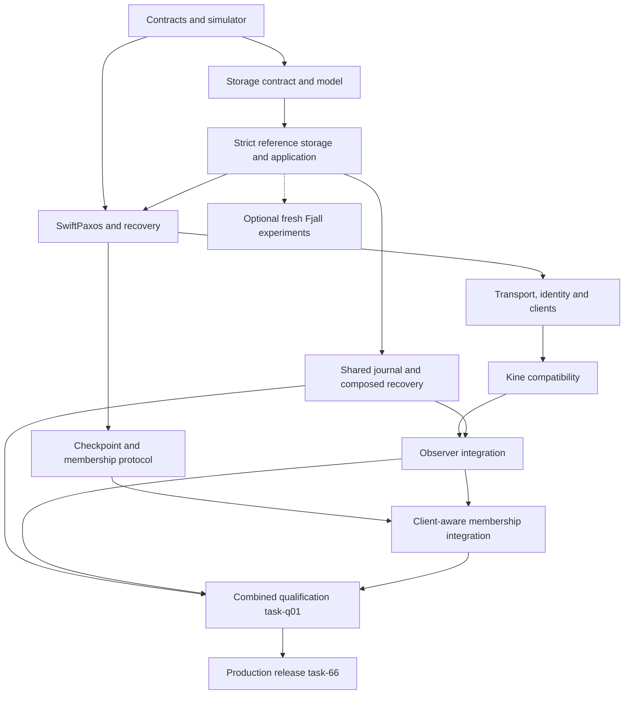

# TupleSky implementation task plan

**Status:** Review proposal, consolidated v1.5.  
**Date:** 2026-09-24.  
**Companion:** [TupleSky implementation design](tuplesky-design.md).  
**Scope:** 152 implementation tasks with stable `task-*` identifiers. The `task-01` through `task-66`, `task-s01` through `task-s04`, `task-j01` through `task-j10`, `task-o01` through `task-o06`, `task-m01` through `task-m05`, `task-c01`, `task-c02`, `task-c03`, `task-d01` through `task-d57` and `task-q01` suffixes and prerequisites are preserved. v1.5 adds `task-d01` through `task-d04` from review of the open implementation PRs and of multi-host readiness, `task-d05` through `task-d17` from the Jepsen client's runs, `task-d18` through `task-d33` from a review against an external SwiftPaxos correctness checklist ([review record](tuplesky-checklist-review.md)), `task-d34` from what the protocol simulator of task-d30 found, `task-d35` through `task-d44` from a review of recovery time and storage integrity (an execution chain, a scrub, and voter replacement through a prepared transition, a staged learner, terminal recovery after the seal, serving across a transition and a running membership install), `task-d45` through `task-d50` from measuring the throughput of the Jepsen client's first unthrottled runs, `task-d51` from task-d46's long runs, `task-d52` and `task-d53` from a profile of the domain thread after task-d46, `task-d54` from the Jepsen runs of task-d50, `task-d55` through `task-d57` from the Jepsen runs of task-j06, and moves committed key replacement from `task-58` to `task-m03`; the changes are listed under [Gate checklist and deferred work](#gate-checklist-and-deferred-work). Task IDs are not GitHub pull-request or issue numbers. One implementation PR corresponds to one task; its GitHub-assigned number is recorded separately. No baseline, supplement or separate amendment is needed.

## How to use this plan

**Convention:** use the full lowercase task ID in task references, anchors, branch names and PR titles (for example, `task-01: workspace and CI`). Open one PR for each task, and link that PR back to its task anchor. GitHub assigns an independent PR number; do not rename the task to match it. Historical review comments keep their old labels, but the current documents use `task-*` throughout.

The design is normative for behavior/dependency choices; this document partitions delivery. Direct prerequisites form a DAG, not a demand for serial development. Draft work may begin earlier but must be reviewed against its final base and land after prerequisites. Task count implies neither dates nor effort estimates.

Aim for one invariant or observable behavior per PR. Roughly 200-700 handwritten implementation lines plus focused tests is a review target, not a quota. Split an oversized task into explicitly named child tasks before coding and update the plan and prerequisites; each resulting task receives its own implementation PR. Never omit tests or fold unrelated cleanup into correctness work to reduce apparent size. Review generated fixtures, lockfiles and model counterexamples separately.

Every PR states problem, exact before/after behavior, design sections, test commands/results, a failure case and persistence/wire/security implications. Protocol work includes source-rule mapping and publication prerequisites. Schema changes state compatibility. Qualification assembles evidence; behavioral fixes receive focused review rather than hiding in test churn.

Reference single-store and fixed-membership compositions are early increments, not competing production architectures. No public insecure listener, simulator keys, weak-store bypass or test crypto may enter production artifacts. The authenticated fixed-membership preview remains explicitly bounded until permanent replacement and quorum-safe forgetting are complete. Production additionally requires the shared-journal, observer and client-aware integration gates below.

## Workstreams and release boundaries

| Tasks | Workstream | Boundary |
|---|---|---|
| task-01 through task-06 | Contracts, locked tooling and independent deterministic oracle | G0 |
| task-s01 through task-s02, task-07 through task-18 | Storage contract/model, strict redb reference, state, watch, leases and replicated auth | G1 |
| task-19 through task-29 | Source-mapped SwiftPaxos, durability, recovery and fast results | G2 |
| task-30 through task-43 | Native QUIC, clients and federated security | G3 authenticated preview |
| task-44 through task-48 | Go/Kine edge and actual Kubernetes conformance | G4 |
| task-49 through task-60 | Common checkpoints, semantic trimming, sealed handoff, restore and upgrades | G5 |
| task-61 through task-66 | Operability, WAN measurements and release evidence | G6, extended by task-q01 |
| task-s03 through task-s04 | Fresh isolated Fjall experiments and local comparison | Optional; not migration or second-engine production support |
| task-j01 through task-j10 | Shared journal, materialization, local checkpoint, runtime composition and multi-group qualification | task-j06 separately optional |
| task-o01 through task-o06 | Finalized streams, regional observers/relays, Kine watch/read integration | Capability-specific gates |
| task-m01 through task-m05 | Authoritative discovery, full-client Kine and integrated membership | Operational production requirement |
| task-d01 through task-d44 | Daemon runtime wiring (election, leaf renewal, reconnection and why a dial failed), one execution order on every replica, recovery bounded by execution, a Sync that leaves no stale acceptance, a new leader that chains after what it executed, a diverged node that stays stopped and says what it compared, a decision that names its admission facts, every proposal and decision reaching every voter, every vote reaching the leader, catch-up, multi-host test provisioning, and the correctness-checklist remediation (a promise a Sync cannot lower, slow decisions recovery keeps, a Sync that fits its row, collector obligations that end, client outcomes, table room for recovery, a resource contract, forgetting wired into `coordd` and a learner reinstall behind its floor, the failure and obligation contract, the real machines under simulation, and the recovery bugs that simulation found), an execution chain every voter compares, a scrub of the replicated state, a prepared transition, a staged learner, a configuration installed into a running daemon, and voter replacement through the sealed handoff | Required before task-64/task-65 qualification and task-66 |
| task-d45 through task-d54 | Throughput: a command's cost measured on every node and gated in CI, per-turn work independent of history, durable group writes, the projection's durability under the journal, re-sends only once an answer is due, reads and the fast path off the slow path, the local checkpoint off the domain thread, execution and materialization on a pipelined applier, an execution established without walking what already executed, and the journal's syncs off the domain thread | task-d45 through task-d49 and task-d51 through task-d53 required before task-64, task-q01 and task-62's remaining rows, task-d54 before task-62's remaining rows; task-d50 after its design amendment |
| task-d55 through task-d57 | From the Jepsen runs of task-j06: a publication's steps, a restart's replay and the domain thread's scheduling measured; a restarted voter that neither fills the leader's control lane nor takes the ballot from a live leader; a read's index bounded by what the voters confirming it had voted | task-d55 before task-d51's acceptance run; task-d56 before task-64; task-d57 after its design amendment |
| task-q01 | Combined durable WAN/Kine qualification | Required before task-66 |


```mermaid
flowchart TD
    A["Contracts and simulator"] --> S["Storage contract and model"]
    S --> B["Strict reference storage and application"]
    A --> C["SwiftPaxos and recovery"]
    B --> C
    C --> D["Transport, identity and clients"]
    D --> K["Kine compatibility"]
    C --> L["Checkpoint and membership protocol"]
    B --> J["Shared journal and composed recovery"]
    K --> O["Observer integration"]
    J --> O
    L --> M["Client-aware membership integration"]
    O --> M
    J --> Q["Combined qualification task-q01"]
    O --> Q
    M --> Q
    Q --> R["Production release task-66"]
    B -.-> X["Optional fresh Fjall experiments"]
```

This is a workstream overview; the individual prerequisites are authoritative. Optional task-j06 is not an unconditional prerequisite of task-q01. Enabling that profile requires its separate evidence and inclusion in the applicable combined matrix. Former task-s05 through task-s08 remain retired and are not reused.

## Review index

| Task | Title | Direct prerequisites |
|---|---|---|
| [task-01](#task-01) | Lock the workspace and implement filtered GitHub CI | None |
| [task-02](#task-02) | Define identities, canonical commands and ordered-key fixtures | task-01 |
| [task-03](#task-03) | Implement the bounded postcard wire codec | task-02 |
| [task-04](#task-04) | Establish pure event/effect and durable-barrier interfaces | task-02 |
| [task-05](#task-05) | Build the deterministic world and replay format | task-04 |
| [task-06](#task-06) | Add an independent history oracle | task-02, task-05 |
| [task-07](#task-07) | Implement the redb adapter and fail-closed generation lifecycle | task-01, task-02, task-s01, task-s02 |
| [task-08](#task-08) | Implement the shared single-writer storage coordinator | task-04, task-07 |
| [task-09](#task-09) | Exercise the actual redb engine with disk faults | task-05, task-08 |
| [task-10](#task-10) | Implement the pure KV and transaction planner | task-02, task-04, task-06 |
| [task-11](#task-11) | Apply shared KV plans atomically and serve pinned MVCC views | task-08, task-09, task-10 |
| [task-12](#task-12) | Persist deduplication, result resolution and retry floors | task-11 |
| [task-13](#task-13) | Implement atomic watch replay and live handoff | task-11, task-12 |
| [task-14](#task-14) | Add bounded MVCC compaction | task-11, task-13 |
| [task-15](#task-15) | Implement native lease grant, attachment and revoke | task-10, task-11, task-12 |
| [task-16](#task-16) | Implement replicated renewal and conservative expiry | task-05, task-06, task-15 |
| [task-17](#task-17) | Add native atomic Kine primitives and private TTL bindings | task-12, task-16 |
| [task-18](#task-18) | Implement replicated sessions, policy and grant commitments | task-10, task-11, task-12 |
| [task-19](#task-19) | Freeze SwiftPaxos source mapping and bounded models | task-02, task-04, task-05 |
| [task-20](#task-20) | Persist ballots, promises and configuration guards | task-08, task-19 |
| [task-21](#task-21) | Implement the dependency graph and closure evidence | task-19, task-20 |
| [task-22](#task-22) | Implement normal leader proposal handlers | task-20, task-21 |
| [task-23](#task-23) | Implement normal follower vote and adoption handlers | task-20, task-21, task-22 |
| [task-24](#task-24) | Implement slow learning and ordered materialization | task-11, task-12, task-13, task-18, task-22, task-23 |
| [task-25](#task-25) | Implement durable recovery summaries and payload transfer | task-20, task-21, task-23 |
| [task-26](#task-26) | Implement recovery selection and new-ballot activation | task-19, task-24, task-25 |
| [task-27](#task-27) | Qualify fixed-membership crash recovery end to end | task-06, task-09, task-16, task-18, task-26 |
| [task-28](#task-28) | Implement full fast-path learning evidence | task-19, task-23, task-26, task-27 |
| [task-29](#task-29) | Add bounded speculative execution and result-release gating | task-12, task-18, task-24, task-28 |
| [task-30](#task-30) | Implement the Quinn transport adapter and TLS lifecycle | task-03, task-04, task-08 |
| [task-31](#task-31) | Implement QUIC traffic isolation and backpressure | task-30 |
| [task-32](#task-32) | Add packet-level quinn-proto simulation | task-05, task-30, task-31 |
| [task-33](#task-33) | Wire the trusted frontend collector and native dispatch | task-17, task-18, task-29, task-30, task-31 |
| [task-34](#task-34) | Implement the Rust SDK request lifecycle | task-03, task-12, task-30, task-33 |
| [task-35](#task-35) | Implement hardened external JWT and issuer verification | task-18 |
| [task-36](#task-36) | Implement RFC 8693 exchange and service credential signing | task-18, task-33, task-35 |
| [task-37](#task-37) | Bind API sessions and authorize live/replayed output | task-13, task-18, task-33, task-34, task-36 |
| [task-38](#task-38) | Implement OIDC browser login and the service code flow | task-18, task-35, task-36 |
| [task-39](#task-39) | Implement device authorization with bounded polling | task-38 |
| [task-40](#task-40) | Implement refresh families and secure CLI login | task-34, task-37, task-38, task-39 |
| [task-41](#task-41) | Implement the independent WIF node issuer | task-30, task-35 |
| [task-42](#task-42) | Bind genesis and committed membership to peer TLS | task-20, task-26, task-30, task-41 |
| [task-43](#task-43) | Compose secure daemons and qualify the native preview | task-09, task-16, task-27, task-32, task-33, task-37, task-40, task-42 |
| [task-44](#task-44) | Implement the Go postcard subset and shared fixtures | task-03 |
| [task-45](#task-45) | Implement the Go QUIC client and workload credentials | task-34, task-36, task-44 |
| [task-46](#task-46) | Implement Kine driver registration and CRUD/range backend | task-17, task-43, task-45 |
| [task-47](#task-47) | Complete Kine watches, progress, compaction and TTL | task-13, task-14, task-16, task-46 |
| [task-48](#task-48) | Certify the selected Kubernetes storage profile | task-47, task-j08 |
| [task-49](#task-49) | Export canonical shared checkpoints through portable snapshots | task-14, task-18, task-27 |
| [task-50](#task-50) | Install learner snapshots and reconcile catch-up state | task-25, task-42, task-49 |
| [task-51](#task-51) | Implement conservative all-voter checkpoint trimming | task-26, task-49, task-50 |
| [task-52](#task-52) | Model quorum-safe checkpoint activation | task-19, task-51 |
| [task-53](#task-53) | Implement quorum-safe checkpoint floors and recovery | task-26, task-50, task-52 |
| [task-54](#task-54) | Model sealed membership handoff | task-19, task-26, task-53 |
| [task-55](#task-55) | Persist old-configuration sealing and terminal recovery | task-25, task-26, task-54 |
| [task-56](#task-56) | Establish the unique handoff certificate | task-49, task-55 |
| [task-57](#task-57) | Activate the successor and recover interrupted handoffs | task-42, task-50, task-53, task-56 |
| [task-58](#task-58) | Implement node/key credential lifecycle and fencing tests | task-41, task-42, task-57 |
| [task-59](#task-59) | Implement backup, restore and disaster-recovery commands | task-49, task-50, task-57, task-58 |
| [task-60](#task-60) | Implement format/capability upgrades and rollback guards | task-03, task-07, task-50, task-57 |
| [task-61](#task-61) | Complete bounded observability and operator diagnostics | task-31, task-43, task-53, task-57 |
| [task-62](#task-62) | Build and run the matched native WAN benchmark matrix | task-29, task-32, task-43, task-53, task-61 |
| [task-63](#task-63) | Measure Kine end-to-end overhead and regression budgets | task-48, task-61, task-62 |
| [task-64](#task-64) | Run mixed-fault qualification and automatic minimization | task-09, task-27, task-32, task-40, task-48, task-53, task-57, task-58, task-60, task-d01, task-d03, task-d05, task-d06, task-d07, task-d08, task-d09, task-d10, task-d11, task-d12, task-d14, task-d15, task-d18, task-d19, task-d20, task-d21, task-d22, task-d23, task-d24, task-d25, task-d26, task-d27, task-d28, task-d29, task-d30, task-d31, task-d32, task-d33, task-d34, task-d35, task-d36, task-d37, task-d38, task-d39, task-d40, task-d41, task-d42, task-d43, task-d44, task-d45, task-d46, task-d47, task-d48, task-d49, task-d51, task-d52, task-d53, task-d56 |
| [task-65](#task-65) | Package and qualify supported deployment targets | task-43, task-48, task-59, task-60, task-61, task-d02, task-d04 |
| [task-66](#task-66) | Close security, supply-chain and production release gates | task-58, task-59, task-60, task-63, task-64, task-65, task-d02, task-q01 |
| [task-s01](#task-s01) | Define the portable engine contract and logical collection registry | task-02, task-04 |
| [task-s02](#task-s02) | Implement the model engine and common storage conformance kit | task-05, task-s01 |
| [task-s03](#task-s03) | Add an experimental single-writer Fjall adapter | task-08, task-s02 |
| [task-s04](#task-s04) | Replay fresh fixtures and compare local engine costs early | task-09, task-14, task-17, task-18, task-s03 |
| [task-j01](#task-j01) | Define the journal, sequence and materialization contracts | task-01, task-02, task-s01, task-s02 |
| [task-j02](#task-j02) | Implement the pinned raft-engine journal and postcard codec | task-j01 |
| [task-j03](#task-j03) | Integrate journal-first shared storage and atomic materialization | task-j02, task-08, task-11 |
| [task-j04](#task-j04) | Publish local recovery checkpoints and reclaim journal prefixes | task-j03, task-09 |
| [task-j05](#task-j05) | Qualify the real journal and composed persistence boundary | task-j02, task-j03, task-j04, task-j08, task-09 |
| [task-j06](#task-j06) | Replay-backed working-state materialization, promoted, off by default | task-j04; task-j05 before it may be a default |
| [task-j07](#task-j07) | Validate multi-group batching and resource isolation | task-j03, task-j05, task-31 |
| [task-j08](#task-j08) | Compose journal-backed application and serving storage | task-j03, task-43 |
| [task-j09](#task-j09) | Establish a caller's session as a replicated command | task-18, task-37, task-j08 |
| [task-j10](#task-j10) | Give the Rust client a real unary request path | task-34, task-43 |
| [task-o01](#task-o01) | Specify finalized frames and observer capabilities | task-02, task-03, task-28, task-49 |
| [task-o02](#task-o02) | Build MVCC observer install, catch-up and serving lifecycle | task-o01, task-j03, task-50 |
| [task-o03](#task-o03) | Add regional relays, bounded fan-out and source failover | task-o02, task-31 |
| [task-o04](#task-o04) | Route Kine watches to observers with correct progress | task-o02, task-48 |
| [task-o05](#task-o05) | Add observer historical reads and authoritative read fences | task-o04, task-18 |
| [task-o06](#task-o06) | Qualify observer correctness and regional scaling | task-o03, task-o04, task-o05, task-j05 |
| [task-m01](#task-m01) | Define authoritative configuration discovery and epoch records | task-02, task-19 |
| [task-c01](#task-c01) | Give the collector a submission delivery lifecycle (contract revision 3) | task-33, task-62 |
| [task-m02](#task-m02) | Make Kine a full epoch-aware trusted collector | task-m01, task-33, task-48, task-c01 |
| [task-m03](#task-m03) | Connect observer staging to sealed handoff and activation | task-m01, task-o02, task-57, task-j04, task-58, task-d40, task-d41 |
| [task-m04](#task-m04) | Implement conservative regional placement and quorum tuning | task-m03, task-m02 |
| [task-m05](#task-m05) | Qualify client-aware membership under mixed failures | task-m02, task-m03, task-m04, task-58, task-d01 |
| [task-c02](#task-c02) | Repair lost frontend evidence, and complete a half-held command from the durable record (contract revision 2) | task-23, task-33, task-62 |
| [task-c03](#task-c03) | Give the collector boundary its own monotonic clock | task-33, task-37 |
| [task-d01](#task-d01) | Wire leader election and ballot adoption into coordd | task-26, task-27, task-43, task-j08, task-d03 |
| [task-d02](#task-d02) | Drive leaf renewal inside the serving daemon | task-41, task-43, task-58 |
| [task-d03](#task-d03) | Re-dial peers and collector links on a timer | task-43, task-j08, task-c01 |
| [task-d04](#task-d04) | Provision a multi-host test domain and write its runbook | task-43, task-48, task-d03 |
| [task-d05](#task-d05) | Bound recovery reports and Syncs by what the voters executed | task-26, task-53, task-d01, task-d06 |
| [task-d06](#task-d06) | Keep one execution order on every replica when a table reclaims | task-21, task-24, task-c02 |
| [task-d07](#task-d07) | Re-send a proposal until every voter has voted on it | task-23, task-25, task-d03, task-d06 |
| [task-d08](#task-d08) | Bring a lagging voter up from a peer's executed history | task-d05, task-d09, task-d14, task-d17 |
| [task-d09](#task-d09) | Carry the leader's commit decision to every voter | task-24, task-d07 |
| [task-d10](#task-d10) | Flow-control catch-up from each voter's own frontier | task-25, task-d09 |
| [task-d11](#task-d11) | Leave no acceptance of an earlier ballot behind a Sync | task-26, task-d05 |
| [task-d12](#task-d12) | Chain a new leader's proposals after what it executed | task-26, task-d06 |
| [task-d13](#task-d13) | Keep a diverged node stopped across a restart | task-d17 |
| [task-d14](#task-d14) | Name a recovered decision's admission facts | task-d09, task-d12 |
| [task-d15](#task-d15) | Ask again for every vote the leader still needs | task-d07 |
| [task-d16](#task-d16) | Say why each address of a dial failed | task-d03 |
| [task-d17](#task-d17) | Say what a divergence stop compared | task-d12 |
| [task-d18](#task-d18) | Never let a Sync lower a durable promise | task-20, task-26, task-d11 |
| [task-d19](#task-d19) | Count only adoptions toward the slow majority | task-24, task-26, task-28 |
| [task-d20](#task-d20) | Prove the largest Sync fits its row, or refuse the campaign | task-d05, task-d14 |
| [task-d21](#task-d21) | Settle whether a recovery cycle is reachable, and never stall on one | task-26, task-d12 |
| [task-d22](#task-d22) | End every collector entry the voters refuse | task-c01, task-c02, task-d14 |
| [task-d23](#task-d23) | Tell a client what is known of its outcome | task-34, task-c02, task-d22 |
| [task-d24](#task-d24) | Keep table room for recovery work | task-d08, task-d19, task-d20 |
| [task-d25](#task-d25) | Make catch-up outpace the domain | task-d08, task-d18, task-d19 |
| [task-d26](#task-d26) | State the resource contract and test its accounting | task-d20, task-d24, task-d25 |
| [task-d27](#task-d27) | Wire quorum-safe forgetting into coordd | task-53, task-j04, task-d08, task-d26 |
| [task-d28](#task-d28) | Let a recovery report survive a lost page | task-25, task-d05 |
| [task-d29](#task-d29) | Write the failure and obligation contract | task-d18, task-d19, task-d22 |
| [task-d30](#task-d30) | Run the real replica machines in the deterministic simulator | task-05, task-d18, task-d19, task-d34 |
| [task-d31](#task-d31) | Refuse epochs other than three or five voters and read the source fast set from its ballot | task-26, task-m01 |
| [task-d32](#task-d32) | Reinstall a voter behind the forgetting floor as a learner | task-50, task-d27, task-d41 |
| [task-d33](#task-d33) | Hold the simulated domain to its budgets and to progress after healing | task-d22, task-d24, task-d26, task-d28, task-d30 |
| [task-d34](#task-d34) | Keep every decision through recovery where the protocol simulator lost one | task-d11, task-d18, task-d19, task-d21 |
| [task-d35](#task-d35) | Chain every replica's execution | task-49, task-d08, task-d12, task-d17 |
| [task-d36](#task-d36) | Compare execution chains between voters | task-d13, task-d35 |
| [task-d37](#task-d37) | Scrub the replicated state at agreed positions | task-49, task-d13, task-d36 |
| [task-d38](#task-d38) | Bind the handoff to the execution chain | task-57, task-d35, task-d37, task-d39, task-d43 |
| [task-d39](#task-d39) | Follow the domain as a staged learner | task-50, task-d08, task-d37, task-d42 |
| [task-d40](#task-d40) | Install an activated configuration into the running daemon | task-57, task-58, task-m01, task-d01, task-d39, task-d42, task-d43, task-d44 |
| [task-d41](#task-d41) | Replace one voter through the sealed handoff | task-59, task-d13, task-d38, task-d39, task-d40, task-d42, task-d43 |
| [task-d42](#task-d42) | Record an authorized, prepared transition | task-54, task-55, task-m01 |
| [task-d43](#task-d43) | Recover the terminal closure after the seal | task-55, task-56, task-d05, task-d11, task-d14, task-d44 |
| [task-d44](#task-d44) | Serve executed history across a transition | task-d08, task-d35, task-d39, task-d42 |
| [task-d45](#task-d45) | Measure a command's cost on every node, and gate on it | task-61, task-j08 |
| [task-d46](#task-d46) | Keep per-turn and per-event work independent of history | task-d06, task-d24, task-d27, task-d30, task-d45 |
| [task-d47](#task-d47) | Lower a turn's transitions as durable groups | task-j03, task-j05, task-j08, task-d24, task-d30, task-d45, task-d46 |
| [task-d48](#task-d48) | Commit the projection in one phase under the journal | task-53, task-59, task-j04, task-j05, task-d47 |
| [task-d49](#task-d49) | Re-send a proposal only once its answer is due | task-d07, task-d08, task-d15, task-d45 |
| [task-d50](#task-d50) | Serve reads and the fast path without waiting on the slow path | task-28, task-29, task-d46, task-d47, task-d49 |
| [task-d51](#task-d51) | Export the local checkpoint off the domain thread, and bound it | task-j04, task-d37, task-d55 |
| [task-d52](#task-d52) | Execute and materialize on a pipelined applier | task-j03, task-j08, task-d47, task-d48 |
| [task-d53](#task-d53) | Establish an execution without walking what already executed | task-21, task-24, task-d46 |
| [task-d54](#task-d54) | Append the journal's groups on a journal worker | task-j03, task-d47, task-d52 |
| [task-d55](#task-d55) | Measure a publication's steps, a restart's replay and the domain thread's scheduling | task-j04, task-j06, task-d45, task-d54 |
| [task-d56](#task-d56) | Keep a restarted voter from stalling the domain | task-31, task-d01, task-d08, task-d10 |
| [task-d57](#task-d57) | Bound a read's index by what the confirming voters had voted | task-d50 |
| [task-q01](#task-q01) | Produce the combined durable WAN/Kine qualification report | task-j07, task-j08, task-o06, task-m05, task-63, task-64, task-d45, task-d46, task-d47, task-d48, task-d49, task-d51, task-d52, task-d53 |

## Task specifications

<a id="task-01"></a>
### task-01: Lock the workspace and implement filtered GitHub CI

**Prerequisites:** None.  
**Design:** Sections 12.4.1, 16, 21.3.

**Implement:** Create Rust/Go workspace skeleton, exact toolchain files, Cargo.lock/go.sum, explicit TLS features and checksummed tool manifest. Add xtask, format/lint/test entry points, dependency policy, Mermaid rendering and references. Include the full raft-engine Git candidate, feature/platform audit and codec smoke test; do not silently change other selections.

Add the actual GitHub Actions entry/documentation workflows and reusable Rust/Go build-test workflow, plus a repository-owned filter script and fixtures, implementing design Section 12.4.1. The lightweight classifier gates expensive jobs before toolchain setup; docs-only changes still run documentation checks and report the stable required CI gate. Pin actions/tools, use minimal permissions and preserve a manual/scheduled full-run path. These are deliverables of task-01, not scripts to add to the design package.

**Acceptance:** Build the selected graph on Linux x86_64/aarch64; record actual compiler/MSRV and feature trees. Fail checks for insecure test dependency in production, missing locks, malformed Mermaid or unreviewed override. Resolve candidate incompatibilities explicitly.

Test docs-only and mixed changes; Rust/Go source, lock/toolchain/schema/fixture/model/workflow/filter changes; unknown paths; additions/deletions/type changes/renames; more than 300 changed files; missing/shallow history; PR/push/merge-group events; and manual/scheduled full runs. Demonstrate that a docs-only PR starts no heavy build job, a code-bearing change starts the appropriate jobs, and a failed/missing/cancelled required job or classifier never yields a green gate or a permanently pending path-filtered required check. Check Markdown references, every full task ID/anchor, graph consistency and Mermaid in the lightweight job.

**Review boundary:** No service/protocol implementation. Proposed pins are not presumed compile-tested. This describes future repository checks, not local authoring scripts included in the design package.

The filter/workflows are maintained repository CI, not the temporary authoring/validation utilities excluded from the design package. No service/protocol implementation or placeholder success for not-yet-implemented test suites.

<a id="task-02"></a>
### task-02: Define identities, canonical commands and ordered-key fixtures

**Prerequisites:** task-01.  
**Design:** Sections 2.3, 4.4, 10.5.1, 17.2.

**Implement:** Add coord-types logical_v1, fixed IDs, checked revisions, stable invocation identity/errors and canonical hashes. Freeze namespace/key/revision encoding vectors. Reserve configuration epochs, finalized-frame/read-fence identities and local journal sequence separately.

**Acceptance:** Property-test encoded ordering including zeros/prefixes. Payload change changes digest; token/endpoint/epoch refresh does not change the same logical request. Reject overflow, ambiguous encodings and mistaken identity/counter reuse.

**Review boundary:** No network, ambient clocks/random IDs inside core or automatic schema evolution.

<a id="task-03"></a>
### task-03: Implement the bounded postcard wire codec

**Prerequisites:** task-02.  
**Design:** Sections 11.2, 19.1, 6.7.1, 10.5.

**Implement:** wire_v1 DTOs, frame reader/writer, explicit kinds/versions, bounded Serde types, valid/invalid vectors and fuzz target. Reserve distinct observer/configuration/collector-evidence/read-fence schemas; durable journal representation is separately versioned.

**Acceptance:** Reject all header truncations, integer/length overflow, trailing bytes, unknown versions and oversized nested collections before excessive allocation. Identity-bearing payloads canonicalize consistently.

**Review boundary:** No sockets or general Go Serde framework. Stable DTOs, not implementation-enum serialization.

<a id="task-04"></a>
### task-04: Establish pure event/effect and durable-barrier interfaces

**Prerequisites:** task-02.  
**Design:** Sections 5.1, 4.8, 18.

**Implement:** Add injected clocks/entropy, owned events/effects, PersistBatch, incarnation/boot-scoped barriers and private established/admission capabilities. Distinguish JournalDurable, Materialized and LocalCheckpointPublished from protocol establishment. Vote-producing effects carry epoch/ballot/prerequisite context; supply test ports only.

**Acceptance:** A two-barrier effect cannot release after one. Wrong-boot, duplicate/failed and obsolete-ballot completions never newly authorize it. Compile-boundary checks exclude Tokio, engine crates/system clocks from pure core.

**Review boundary:** No actual database, consensus or insecure production composition; types support but do not prove learning predicates.

<a id="task-05"></a>
### task-05: Build the deterministic world and replay format

**Prerequisites:** task-04.  
**Design:** Sections 12, 21.1.

**Implement:** Ordered virtual scheduler, lifecycle crashes/restarts, clocks, messages and named ChaCha streams. Versioned replay bundles include source/build/config/lock and explicit schedules. Add deliberately faulty actor.

**Acceptance:** Identical replay has identical visible history/digests; insertion ties explicit. An omitted durable prerequisite is reproducibly caught/minimized and saved. Wrong version fails clearly, not a false reproducibility claim.

**Review boundary:** Logical simulation is not real-engine or QUIC packet coverage. No production secret/test entropy leakage.

<a id="task-06"></a>
### task-06: Add an independent history oracle

**Prerequisites:** task-02, task-05.  
**Design:** Sections 6, 12.3, 21.1.

**Implement:** Separate reference model and complete-domain linearizability/revision/retry/conditional checker with extensible lease/auth/watch observations and pending-operation treatment.

**Acceptance:** Reject injected stale read after acknowledged write, duplicate mutation, wrongly shared revision and missing transaction event; accept valid concurrent histories. Keep performance and correctness reporting separate.

**Review boundary:** Do not reuse production planner as oracle or partition shared-revision/transaction/policy histories by key.

<a id="task-07"></a>
### task-07: Implement the redb adapter and fail-closed generation lifecycle

**Prerequisites:** task-01, task-02, task-s01, task-s02.  
**Design:** Sections 5.2, 17.1, 17.9–17.11, 17.13.

**Implement:** coord-storage-redb maps pinned cross-table snapshots, byte tables, explicit durable transactions and typed failures to common contract. Verified manifests/root locks gate opening; codecs remain common. This is the strict materialization/reference foundation; journal-first production arrives in task-j03.

**Acceptance:** Common ordered-access/transaction suites pass; wrong origin/domain/generation/engine, empty/missing/corrupt files fail closed, duplicate open excluded. Cross-catalog atomicity includes read-your-writes scans.

**Review boundary:** No implicit create-on-open, engine-local application semantics, bespoke WAL, Fjall implementation or migration. A real-engine pass does not establish composed journal recovery.

<a id="task-08"></a>
### task-08: Implement the shared single-writer storage coordinator

**Prerequisites:** task-04, task-07.  
**Design:** Sections 17.3, 17.8–17.10.

**Implement:** Strict reference StoreWorker<E>, guard validation in transactions, shared update lowering/stamps, bounded grouping and durable-view gate; call commit_durable, not redb in common code. Preserve as a reference increment; task-j03 introduces authoritative journal-first transitions and distinct projection events.

**Acceptance:** Model/redb fixtures cover visibility before completion, definite guard rejection, indeterminate commit, lost/old-boot completion. No view/publication escapes without required support. Unrelated protocol stamp updates do not invalidate application predecessor.

**Review boundary:** No direct native engine imports in coord-storage, unbounded blocking work, public storage sequences or silently weakened periodic flush profile.

<a id="task-09"></a>
### task-09: Exercise the actual redb engine with disk faults

**Prerequisites:** task-05, task-08.  
**Design:** Sections 17.3, 17.14, 21.2.

**Implement:** Pinned real redb StorageBackend with volatile/durable images and controlled writes/sync; shared fixtures, reopen and subprocess death, plus generation-manager directory faults.

**Acceptance:** Crash at each bounded transaction write/sync boundary and reopen only permitted states. Test partial persistence on sync error, ENOSPC, durable-prefix corruption quarantine and prevention of destructor flush after simulated crash.

**Review boundary:** Model engine is not byte-level redb testing. This does not certify Fjall, arbitrary OS power loss, raft-engine or the composed boundary in task-j05.

<a id="task-10"></a>
### task-10: Implement the pure KV and transaction planner

**Prerequisites:** task-02, task-04, task-06.  
**Design:** Sections 6.1–6.3, 17.4.

**Implement:** Exact/range views, compares, put/delete, chosen transaction branch, revisions and deterministic owned ReadView/ApplyPlan using fixture views. Include semantic work/response limits.

**Acceptance:** Check create/mod/version, absence, byte intervals, failed/read-only/no-op revisions and one revision for an atomic multi-key mutation. Limits fail before partial changes.

**Review boundary:** No production DB, clock-dependent lease expiry or ambient time in planner.

<a id="task-11"></a>
### task-11: Apply shared KV plans atomically and serve pinned MVCC views

**Prerequisites:** task-08, task-09, task-10.  
**Design:** Sections 17.2, 17.4, 17.9–17.10.

**Implement:** Common bounded view construction/current/history/events/execution updates through state port; ApplyBase check, fixed-revision scan and owned pages without engine imports. task-j03 later journals immutable plans before this same atomic materialization.

**Acceptance:** Model/redb identical fixtures; crash leaves no partial events/frontier mismatch; choose history versions before limit. Stale base replans; page/reverse/boundary and ahead-of-durability views are tested.

**Review boundary:** Pinned snapshot is not linearizable authority or quorum establishment. No per-engine MVCC implementations.

<a id="task-12"></a>
### task-12: Persist deduplication, result resolution and retry floors

**Prerequisites:** task-11.  
**Design:** Sections 6.5, 17.1, 10.5.3.

**Implement:** Atomic request digest/result/executed identity and effects; bounded outstanding window, ResolveRequest and replicated retirement floor. State is transferable across epochs and exact replay.

**Acceptance:** Lost response/same ID yields same currently authorized logical result. Changed payload rejected; materialization-notification crash does not duplicate. Retired/unknown session request cannot execute as new work.

**Review boundary:** No infinite retention or exactly-once guarantee across lost upstream invocation identity.

<a id="task-13"></a>
### task-13: Implement atomic watch replay and live handoff

**Prerequisites:** task-11, task-12.  
**Design:** Sections 6.4, 6.8.2–6.8.3, 19.3.

**Implement:** Replay/live registration frontier, complete revisions, bounded queues, ordered progress and resumable close/cancellation.

**Acceptance:** Mutation during registration appears with no gap; slow consumers cannot advance over omitted changes. Fragmented multi-key revision remains atomic. Loom covers local handoff boundary; progress cannot overtake pending events.

**Review boundary:** No public watch before auth composition and no progress from socket receipt.

<a id="task-14"></a>
### task-14: Add bounded MVCC compaction

**Prerequisites:** task-11, task-13.  
**Design:** Sections 6.4, 17.5.

**Implement:** Ordered retention floor and incremental history/event GC preserving needed value/tombstone at/before boundary and newer versions. Explicit active-view/watch retention. Common layer chooses deletion; physical engines reclaim afterward.

**Acceptance:** Before-floor reads return Compacted; later reads retain untouched old values. Pagination/watch resume either maintain history or fail explicitly, never skip gaps.

**Review boundary:** No semantic protocol trimming, engine-owned TTL/filter or exclusive live-file compaction.

<a id="task-15"></a>
### task-15: Implement native lease grant, attachment and revoke

**Prerequisites:** task-10, task-11, task-12.  
**Design:** Sections 7.1, 17.1.

**Implement:** Stable nonreused lease IDs/generations, owner permissions, reverse index and atomic attach/detach/revoke plans with count/worst-case byte quotas. Keep Kine private bindings distinct.

**Acceptance:** Revoke deletes only current attachments atomically; later value growth cannot evade event budget. Retry does not grant twice/allocate new revision. Unauthorized attachment cannot imply protected-key deletion.

**Review boundary:** No timers/keepalive success outside consensus or automatic logout-based ownership change.

<a id="task-16"></a>
### task-16: Implement replicated renewal and conservative expiry

**Prerequisites:** task-05, task-06, task-15.  
**Design:** Sections 7.2–7.4.

**Implement:** Renewal sequence, replicated expiry authority epoch, timer generations and conditional expiration; conservative recovery rearming under clock assumptions. Renewals stay replicated with exact retry semantics.

**Acceptance:** Renewal/expiry permutations, delayed old leader, restart, no quorum and fast-clock bounds are checked against true simulator time. Stale timer cannot delete renewed/rebound keys; delayed reply creates no new TTL anchor.

**Review boundary:** No exact expiry deadline, observer-local keepalive success or external fencing implied by lease alone.

<a id="task-17"></a>
### task-17: Add native atomic Kine primitives and private TTL bindings

**Prerequisites:** task-12, task-16.  
**Design:** Sections 6.6, 19.5.

**Implement:** Create/CAS-update/conditional-delete returns all revision/conflict metadata in one result. Kine TTL seconds map to private per-key binding; zero detaches. Stable invocation derives binding identity; expiry is conditional.

**Acceptance:** Failed CAS changes neither data nor expiry. Replaced TTL fences prior timer. Retries preserve binding. Trace proves one logical operation, no mandatory pre-read/CurrentRevision/lease-grant round trip.

**Review boundary:** No Go code, nativeLeaseID=TTL or unconditional local deletes.

<a id="task-18"></a>
### task-18: Implement replicated sessions, policy and grant commitments

**Prerequisites:** task-10, task-11, task-12.  
**Design:** Sections 9.2–9.3, 20.2–20.3.

**Implement:** Principal/ceiling, session/rule generations, one-time receipt/code commitments and ordered permission/revocation at execution. Extend independent oracle; policy can advance execution without KV revision.

**Acceptance:** Check branch-specific comparisons/operations, full range containment, lease restrictions and policy changes after admission. Revoked users cannot read protected cached retry outcomes.

**Review boundary:** No external JWT verification/signing/network/clock during deterministic replay.

<a id="task-19"></a>
### task-19: Freeze SwiftPaxos source mapping and bounded models

**Prerequisites:** task-02, task-04, task-05.  
**Design:** Sections 4, 5.1, 18.1, 21.6.

**Implement:** Pin paper/code source rules, guards, full path-learning predicates, C2 memberships and durable publication obligations. Model concrete phases, atomic dependency publication, recovery cuts and source-defined candidate selection with traceability.

**Acceptance:** Every handler/field maps to source or marked extension. Reject arbitrary fastest-majority, observer/duplicate votes and half-initialized dependencies. Permute valid phase/preaccept reports without replacing source selection by highest-phase-wins. Save counterexamples.

**Review boundary:** No optimization or unrestricted proof claim from finite models. Upstream implementation/invariant mismatches are neither proved fundamental failure nor automatically resolved.

<a id="task-20"></a>
### task-20: Persist ballots, promises and configuration guards

**Prerequisites:** task-08, task-19.  
**Design:** Sections 4.1, 4.7–4.8, 5.1, 18.1.

**Implement:** Stable promises/config-role/generation guards and source-required protocol rows. Wire recovered promises to actor. Carry same-boot epoch/ballot context on effects as well as boot identity; production persistence later uses task-j03 events.

**Acceptance:** Promise replies wait for complete durable state. Old messages cannot lower it after restart. Wrong configuration identity does not vote. Delay callbacks/batcher across election; bookkeeping cannot authorize a new obsolete vote. Atomic initialized-state/index publication and dependency-phase prerequisites hold.

**Review boundary:** No full recovery selection or Raft term semantics. Future journal integration must rerun these tests at its cut, not presume reference tests suffice.

<a id="task-21"></a>
### task-21: Implement the dependency graph and closure evidence

**Prerequisites:** task-19, task-20.  
**Design:** Sections 4.2–4.9, 18.1–18.3.

**Implement:** Immutable payload binding, path/predecessor state, exact traversal/closure, source phase guards and bounded incremental work. Publish initialization and dependency lookup atomically; persist required dependencies.

**Acceptance:** Direct-set equality differs from full path evidence. Duplicate/reordered messages converge; conflict arriving while another command initializes cannot see START as processed state. Bounds backpressure without deleting unresolved acceptance. Dependencies reach required accept/commit/execute phase before dependent transition.

**Review boundary:** No path compression, per-key conflict relaxation or receipt-order execution.

<a id="task-22"></a>
### task-22: Implement normal leader proposal handlers

**Prerequisites:** task-20, task-21.  
**Design:** Sections 4.1–4.8, 18.

**Implement:** Source-mapped leader transitions/publication, conservative conflicts and ballot-fixed fast set. Use atomic initialization and prerequisite-gated effects.

**Acceptance:** Golden traces match models; every leader reply has exact stable support. Reordered/duplicate client requests cannot bind conflicting payload. Block premature accept/commit/finalized execution while dependencies lag.

**Review boundary:** No learning shortcut, speculative public response or recovery-selection implementation hidden here.

<a id="task-23"></a>
### task-23: Implement normal follower vote and adoption handlers

**Prerequisites:** task-20, task-21, task-22.  
**Design:** Sections 4, 5.1, 18.

**Implement:** Source fast votes/leader-order adoption with all persistence/history prerequisites and atomic phase/index visibility.

**Acceptance:** Leader/follower message races, conflict arrival permutations, duplicate identities and crashes between state/vote preserve learning obligations. Half-initialized dependencies never appear; dependency-phase guards are explicit, not an inherited prototype TODO.

**Review boundary:** Matching direct dependencies is not a complete learning proof. Keep source semantics with new storage event names; no Raft terms/indexes.

<a id="task-24"></a>
### task-24: Implement slow learning and ordered materialization

**Prerequisites:** task-11, task-12, task-13, task-18, task-22, task-23.  
**Design:** Sections 4.3–4.5, 17.4, 18.3.

**Implement:** Conservative slow learner, closed dependency execution, EstablishedResult capability and deterministic application through common materializer; feed complete finalized event frontiers.

**Acceptance:** Three/five-voter logical histories match KV/transaction/retry/policy oracle. One leader response cannot establish success. No watch event precedes irrevocable application. Preserve source learning under later journal-first composition.

**Review boundary:** Externally visible fast completion remains off. No copied read-index shortcut or projection commit mistaken for quorum learning.

<a id="task-25"></a>
### task-25: Implement durable recovery summaries and payload transfer

**Prerequisites:** task-20, task-21, task-23.  
**Design:** Sections 4.8–4.9, 5, 17.1, 19.3.

**Implement:** Bounded source prior-ballot summaries, stable votes, unresolved closure/payload transfer with identity/digest checks and durable prerequisites. Define authoritative recovery cut independent of lagging projection.

**Acceptance:** Incomplete/corrupt pages never count; old required ballot state survives crash. Missing payload fetches/blocks, not fabricated empty command. Hold projection behind journal and old sends/callbacks across recovery. Source phase differences remain legal where allowed; incompatible required-equal candidates are diagnosed.

**Review boundary:** No selection from incomplete summary/application-only snapshot, physical packet-drain correctness assumption or blind union of histories.

<a id="task-26"></a>
### task-26: Implement recovery selection and new-ballot activation

**Prerequisites:** task-19, task-24, task-25.  
**Design:** Sections 4.1, 4.8–4.9, 5, 18.1.

**Implement:** Source recovery cases preserve potentially chosen commands/closure, durably bind selected Sync and activate the recovered ballot; restore exact results/retries. Resolve submitted work at authoritative cut before new reply.

**Acceptance:** Preserve learned outcomes despite lost volatile commit notifications. Competing recovery, delayed replies, lagging projection and same-boot old effects cannot establish divergence. Permuted reports give permitted stable selection; crash after Sync cannot publish incompatible result under same ballot.

**Review boundary:** No membership change, majority-of-anything, highest-phase heuristic, or dropping work for absent COMMIT marker.

<a id="task-27"></a>
### task-27: Qualify fixed-membership crash recovery end to end

**Prerequisites:** task-06, task-09, task-16, task-18, task-26.  
**Design:** Sections 4.9, 5, 12, 21.

**Implement:** Real-engine plus logical-network campaigns around vote/reply/materialization and restart combinations within budget; retain minimal regressions and recovery-report permutations.

**Acceptance:** Acknowledged outputs, retry digests and lease/policy state survive; minority cannot write. Deliberately omit durable record and detect failure. Crash after recovery result publication preserves same-ballot choice. State precise reference versus later composed-storage coverage.

**Review boundary:** Qualification does not hide protocol fixes; those get focused review. No claim that reference redb tests qualify raft-engine automatically.

<a id="task-28"></a>
### task-28: Implement full fast-path learning evidence

**Prerequisites:** task-19, task-23, task-26, task-27.  
**Design:** Sections 4.2–4.9, 18.3.

**Implement:** Exact source path-learning predicate and private establishment object sharing normal/recovery history with slow path.

**Acceptance:** Valid/invalid paths, mixed ballot/epoch, duplicate identity and recovery-phase variations are covered. Forced-slow/fast paths yield equal controlled logical results. Persisted recovery selection remains stable across restart and does not use generic phase priority.

**Review boundary:** No speculative overlay/public response plumbing or arbitrary quorum counter.

<a id="task-29"></a>
### task-29: Add bounded speculative execution and result-release gating

**Prerequisites:** task-12, task-18, task-24, task-28.  
**Design:** Sections 4.3–4.9, 17.4, 18.1.

**Implement:** Disposable deterministic overlays and digests for established fast outcomes; release binds command, closed order, permission and durable recovery evidence.

**Acceptance:** Tentative reordering leaks no value/credential. Fast result followed by crash before COMMIT propagation recovers same outcome; recovery report permutations and restart preserve Sync selection. Speculative events/tokens are impossible at public boundary.

**Review boundary:** No extra mandatory WAN commit phase, weakened predicate or durability to improve charts.

<a id="task-30"></a>
### task-30: Implement the Quinn transport adapter and TLS lifecycle

**Prerequisites:** task-03, task-04, task-08.  
**Design:** Sections 11, 19.1–19.4.

**Implement:** Bounded reliable streams, ALPN, explicit AWS-LC provider, handshake/close and owned dispatch. Separate role negotiation for collectors/voters/observers; isolated test certificates until real issuance.

**Acceptance:** Malformed frames, origin/role/version mismatch fail closed. No application 0-RTT. Transport ACK never triggers durability/establishment. Bound shutdown/work. Sparse necessary connections are supported, not an assumed fleet full mesh.

**Review boundary:** No HTTP3, voting solely from test certificate, public unauthenticated service or untrusted Kine collector role.

<a id="task-31"></a>
### task-31: Implement QUIC traffic isolation and backpressure

**Prerequisites:** task-30.  
**Design:** Sections 3.3, 11.3–11.7, 19.2–19.3.

**Implement:** Explicit CUBIC, bounded control/unary/watch/bulk connections, shared destination budget, fair group scheduling and role-specific replication capacity.

**Acceptance:** Stalled bulk/watch cannot consume all control queues/streams; large frames cannot force unlimited buffering. Measure queue/credit wait distinct from RTT. Relay fan-out respects node/destination admission.

**Review boundary:** No universal no-jitter/latency claim, unbounded pools, idle-delay batching or congestion-budget evasion by more connections.

<a id="task-32"></a>
### task-32: Add packet-level quinn-proto simulation

**Prerequisites:** task-05, task-30, task-31.  
**Design:** Sections 12.2, 21.2.

**Implement:** Pinned packet/time-driven protocol and controlled protocol RNG, separately linked test crypto/identity; shared framing/queue behavior.

**Acceptance:** Reproduce packet loss/reorder/MTU/credit schedules; cross-check message-level visible outcomes. Production graph excludes deterministic keys. Real rustls handshake/Go interoperability independently passes. Include sparse observer/collector topology under bounds.

**Review boundary:** Endpoint RNG alone does not make TLS/all ID generation deterministic.

<a id="task-33"></a>
### task-33: Wire the trusted frontend collector and native dispatch

**Prerequisites:** task-17, task-18, task-29, task-30, task-31.  
**Design:** Sections 3, 4.3, 19.4.

**Implement:** Admission interface, parallel direct voter fan-out, source-exact collector, unary and finalized watch dispatch in test composition. Freeze the collector contract for authorized Go reuse; role-scoped access never becomes general user voting access.

**Acceptance:** Packet traces have no unnecessary serial leader hop; lone reply never releases tentative data. Cancellation preserves identity/outcome resolution. Count voter identities rather than connections; bound per-domain collection.

**Review boundary:** No untrusted SDK votes or production listener before security gate. Full Go/epoch collector integration is task-m02.

<a id="task-34"></a>
### task-34: Implement the Rust SDK request lifecycle

**Prerequisites:** task-03, task-12, task-30, task-33.  
**Design:** Sections 6.5, 11.5, 19.4.

**Implement:** Credential providers, bounded warm pools, stable instance/sequence, deadlines, ResolveRequest and typed retry errors.

**Acceptance:** Reconnect/reset/timeout preserves invocation/payload. Payload change conflicts; ambiguous timeout reports unknown outcome. Stream pressure bounded, no fresh token exchange per operation.

**Review boundary:** No implicit fresh-ID retry or unauthenticated exposure of protocol evidence.

<a id="task-35"></a>
### task-35: Implement hardened external JWT and issuer verification

**Prerequisites:** task-18.  
**Design:** Sections 9, 20.1–20.2.

**Implement:** Distinct OIDC/WIF verifier types, configured algorithms/audiences/claims, bounded JWKS and hardened HTTP. Kubernetes offline JWT and explicit TokenReview are separate modes.

**Acceptance:** Reject mix-up/alg confusion/wrong audience/time/claims, token-directed endpoints and unknown-kid floods. Simulate cache staleness, clock-health failure, issuer and TokenReview outage. Record admitted receipts, never raw JWTs.

**Review boundary:** No signing, arbitrary cloud identity formats or claims directly granting permission.

<a id="task-36"></a>
### task-36: Implement RFC 8693 exchange and service credential signing

**Prerequisites:** task-18, task-33, task-35.  
**Design:** Sections 9.1–9.4, 20.2.

**Implement:** Bounded Axum exchange, canonical receipts, atomic session creation and ES256 tokens with key publication/rotation. Keep keys outside replicated state.

**Acceptance:** Execution rechecks policy changed after verification. Outage/stale keys fail closed; no raw JWT/private keys in storage/logs. Lifetime/scope ceiling and single-use receipt hold.

**Review boundary:** No long-lived WIF refresh or per-operation IdP calls.

<a id="task-37"></a>
### task-37: Bind API sessions and authorize live/replayed output

**Prerequisites:** task-13, task-18, task-33, task-34, task-36.  
**Design:** Sections 6.4–6.5, 6.9.3, 9.3, 19.4.

**Implement:** Persistent auth binding/rebind, expiry, ordered revocation and fresh permission gates for reads, retries and each selected output batch. Share barriers only for already-selected batches.

**Acceptance:** Expired warm connection cannot admit; post-revocation protected data denied even from historical/cached results. Watch progress cannot bypass output barrier. Previously authorized in-flight work follows documented completion semantics.

**Review boundary:** Token admission freezes neither policy for connection lifetime nor retroactive cancellation. Observer ordered policy replay never silently weakens this requirement.

<a id="task-38"></a>
### task-38: Implement OIDC browser login and the service code flow

**Prerequisites:** task-18, task-35, task-36.  
**Design:** Sections 8, 20.1.

**Implement:** Upstream openidconnect client plus service code/PKCE/state/nonce/exact redirects, application azp validation and bounded pending login. Keep service/upstream flow identities separate.

**Acceptance:** Wrong/missing azp and multi-audience, CSRF/mix-up, code/redirect substitution, concurrent tabs and broker restart negative tests. One code creates at most one session.

**Review boundary:** Crate is not a service authorization server; no email-based principal or public CLI secret.

<a id="task-39"></a>
### task-39: Implement device authorization with bounded polling

**Prerequisites:** task-38.  
**Design:** Sections 8.1, 20.1–20.3.

**Implement:** Service device/user codes, browser approval, expiry, bounded poll/backoff and atomic consumption using existing upstream browser login.

**Acceptance:** Concurrent pollers cannot mint multiple sessions. Denied/expired/pending/slow_down handled; attempts/floods bounded. Upstream device grant is not assumed.

**Review boundary:** No secret in user code/URL or unapproved code acceptance.

<a id="task-40"></a>
### task-40: Implement refresh families and secure CLI login

**Prerequisites:** task-34, task-37, task-38, task-39.  
**Design:** Sections 8.2, 20.3.

**Implement:** Rotating family commitments/reuse revocation; coordctl browser/device/logout/refresh with explicit OS keyring stores and serialized shared-credential updates.

**Acceptance:** Lost rotated-secret response requires documented fresh login. Concurrent refresh/revoked family/missing or locked keyring tests. Explicit Apple keychain feature; no plaintext fallback, args/log leakage or simulator entropy.

**Review boundary:** Headless uses WIF, not desktop refresh in deployment config. No unimplemented transparent secret recovery.

<a id="task-41"></a>
### task-41: Implement the independent WIF node issuer

**Prerequisites:** task-30, task-35.  
**Design:** Sections 10.1–10.2, 20.4.

**Implement:** Independently deployed issuer, protected reference CA signer, configured external trust, CSR possession and policy-constructed identities/extensions. Validate CA/key/constraints at startup.

**Acceptance:** Cold enrollment works before any voter. Reject signature/algorithm/SAN/CA/lifetime/workload errors; issuer outage fails closed. Root credentials remain protected outside quorum data.

**Review boundary:** No arbitrary CSR extension copy, quorum-dependent bootstrap or certificate-implies-vote assumption. HSM is optional implementation, not missing required service.

<a id="task-42"></a>
### task-42: Bind genesis and committed membership to peer TLS

**Prerequisites:** task-20, task-26, task-30, task-41.  
**Design:** Sections 10, 17.1, 20.4.

**Implement:** Signed/pinned genesis with durable initialization, ordinary TLS plus committed key/incarnation/role checks and exact voter identity.

**Acceptance:** Wrong origin/stale generation/frontend/observer/learner cannot vote. Duplicate/cloned identity not counted twice. Missing/rolled-back files require quarantine/new-generation lifecycle, not TOFU/reinitialize.

**Review boundary:** Fixed configuration; membership handoff remains later. Normal certificate validation must not be disabled for URI binding.

<a id="task-43"></a>
### task-43: Compose secure daemons and qualify the native preview

**Prerequisites:** task-09, task-16, task-27, task-32, task-33, task-37, task-40, task-42.  
**Design:** Sections 22.1–22.2, 23 G3.

**Implement:** Role-specific binaries, strict TOML, bounded supervised workers, startup/readiness/shutdown and secret-safe diagnostics. Document fixed-member/reference-storage preview restrictions.

Load the genesis manifest only through `verify_genesis` against the configured admin public key: at `init` before anything is pinned, and at every start before the pinned digest is compared. A manifest whose signature does not verify is refused and pins nothing, and `coordd` never reads the manifest as plain JSON. Without this, task-42's "signed/pinned genesis" is a pin without a signature check, and the pin alone is an unauthenticated per-node file (recorded on task-58). This lands as a task-43 follow-up in its own PR at the top of the stack: the change reaches every configuration and genesis fixture the later tasks write, the harness's included, and making it on the task-43 branch would have it re-resolved through each of them. The configuration gains a required `genesis_admin_key`.

**Acceptance:** Cold auth bootstrap, browser/device/WIF, warm expiry, restart, overload and disk quarantine. An unsigned, wrong-key or edited genesis manifest is refused at `init` and at start, before any pin, attach or listener. Production dependency graph excludes test keys/bypasses; cached leadership not fresh-quorum readiness.

**Review boundary:** No general-production claim; lifecycle and journal/observer/client integration gates remain. Reference preview does not supersede selected production architecture.

<a id="task-44"></a>
### task-44: Implement the Go postcard subset and shared fixtures

**Prerequisites:** task-03.  
**Design:** Sections 3.2, 6.6, 19.1.

**Implement:** adapters/kine/wire from frozen frames/schema manifest, required DTOs with checked varints/signed/length/full-consumption handling. Reserve authorized collector/configuration schemas for later client integration.

**Acceptance:** Rust→Go and Go→Rust all valid vectors; malformed corpus rejected within budget. Schema change requires reviewed fixtures and version consequences.

**Review boundary:** No Go voting state machine, cgo/FFI, native protobuf or arbitrary Serde reflection.

<a id="task-45"></a>
### task-45: Implement the Go QUIC client and workload credentials

**Prerequisites:** task-34, task-36, task-44.  
**Design:** Sections 19.4–19.5.

**Implement:** Plain quic-go streams, trust/origin binding, WIF provider/rebind, bounded pools and stable invocation retry/resolve. Handle rotating token files/single-flight refresh.

**Acceptance:** Actual Rust/Go TLS, expiry, stream reset, timeout and warm reconnect pass. No per-operation federation or HTTP3 native transport. Unknown outcomes remain explicit.

**Review boundary:** No exactly-once across lost upstream identity; epoch-aware collection is task-m02.

**Deferred to task-46:** the session binding handshake. On task-45 the client sends only the Hello, reads no HelloAck and sends no Bind, so the service token is obtained but never presented and the Rust frontend refuses the connection's requests as not bound. task-46 keeps the control stream open, reads the HelloAck, presents the token once in a Bind frame and waits for the BindAck.

<a id="task-46"></a>
### task-46: Implement Kine driver registration and CRUD/range backend

**Prerequisites:** task-17, task-43, task-45.  
**Design:** Sections 6.6, 19.5.

**Implement:** Register coord:// in frozen Kine build and exact Start/Get/Create/Update/Delete/List/Count/DbSize/CurrentRevision/error metadata mapping. Bind one domain, handle reserved/health conventions.

Configure the privileged API-server-to-Kine edge according to Section 3.1: restricted local transport or verified mTLS, with Kine accepting only authorized API-server identities for its domain. Same-region placement does not justify plaintext or unauthenticated network access.

**Acceptance:** Actual bridge tests revisions, absent/mismatch metadata, byte intervals/count/pagination and idempotent startup keys. Trace one conditional command, no WAN pre-read/revision follow-up.

Reject insecure network-listener configuration and invalid server/client identity; verify the intended local-only deployment is not reachable by untrusted workloads.

**Review boundary:** No logstructured SQL/TTL wrapper, invented counters or unsupported general etcd transaction claims. Early proxy composition is a test increment, not permanent WAN hop.

<a id="task-47"></a>
### task-47: Complete Kine watches, progress, compaction and TTL

**Prerequisites:** task-13, task-14, task-16, task-46.  
**Design:** Sections 6.6, 6.8, 19.5.

**Implement:** Backend watch, selected pin's synchronization/progress and Compact conventions with private TTL bindings and exact cursors/batches. Make waits cancellable in the chosen edge.

**Acceptance:** Replay/live gaps, future/compacted start, queued progress, reconnect and stale expiration pass through actual bridge. No skipped batch, local unconditional TTL or progress from mere receipt.

**Review boundary:** No assumption native leases match reference Lease API; no mix of old WaitForSyncTo and new EventBatch signatures.

<a id="task-48"></a>
### task-48: Certify the selected Kubernetes storage profile

**Prerequisites:** task-47, task-j08.  
**Design:** Sections 6.6, 6.8.4, 23 G4.

**Gate:** task-j08's served-request and authoritative-cut recovery tests must pass first. Having a local dispatch branch implemented is not that gate: a conformance suite run against a composition that cannot carry a request through to an answer measures nothing. Both that gate and task-j09's are now met.

The harness and the suite have landed and run: `crates/coord-harness` provisions and starts a real three-voter domain outside `cargo test`, `scripts/e2e/` stands the storage edge up in front of it, `adapters/kine/certify` drives the profile with the API server's own client library, and `.github/workflows/kubernetes-certification.yml` runs both that and a k3s control plane on it. The procedure and the current profile -- including the exact supported transaction shapes and the rows that do not pass -- are `docs/operations/kubernetes-certification.md`.

Every row of the profile passes. That is not a compatibility claim -- it is this profile, these operations, this pin, on one host -- and what would turn it into one is widening the suite: regional outage, restore, adapter and API-server restart, and the k3s control plane the workflow's second job runs.

Four gaps that suite found are fixed here. Concurrent callers are served across a quorum: two callers issuing one request each at a time against three voters used to complete 13 of 100 operations. The cause was not the conservative conflict key but the driver, which lowered one journal group per round however many batches that round submitted, so anything decided two-at-once left a batch queued that nothing came back for -- and a follower's acknowledgement, which requires every batch it has outstanding, waited behind it for ever. Watches are served: `Step::Watch` used to count the subscription and drop the responder, and the daemon now holds that stream, replays what the registration named out of one pinned snapshot and drains the hub onto it every time round its loop. Two shape errors in the Go client came out with that -- a watch open that never ended its request half, which the frontend waited out and closed the connection over, and a cancel written onto the stream the frontend delivers on rather than sent as its own request. A key written under a time to live expires: the leader now orders an authority epoch for its own boot, arms every surviving lease from the observation that epoch committed under, and proposes a conditional expiry when a deadline passes -- as two appended canonical operations that execute only for a command accepted with no admission, which only a voter's own proposal is. Getting a leader-originated command to a quorum took two latent defects out of the payload-transfer path: a placeholder was treated as acceptable, so a proposal that arrived before its payload was silently dropped, and a payload arriving for a command already known by identity was discarded rather than bound. And a connection used to stop being answered after exactly 61 requests: nothing retired an executed record from the leader's command table, so its capacity bounded how many commands a replica could execute in its lifetime. None of the four was visible before a harness drove the composition the way an API server does -- the Kine backend holds one session and one in-flight invocation, and every integration test the project had asked one caller a handful of questions.

**Implement:** Real pinned API-server storage/integration suite, exact supported versions/operations/deviations and reproducible commands. This is the compatibility base; task-o04, task-m02 subsequently qualify observer routing/full collection at selected pin.

**Acceptance:** CRUD/CAS, pagination, watch resume/progress, compaction/TTL, concurrent clients and regional failover. Any semantic failure blocks compatibility labeling; clean boot alone is insufficient.

Regional failover is not in the suite the profile above passed, and cannot be until a leader is re-elected after the leader's region is lost: nothing in `coordd` starts a campaign or adopts a higher ballot before task-d01. That acceptance row is open until task-d01 lands and the suite is widened; this task's PR does not certify it and is not held for it.

Test the API-server-to-Kine storage edge directly: unauthenticated, plaintext, wrong-CA, expired and valid-but-unauthorized/wrong-domain clients cannot read or mutate the domain. Verify API-server server-name validation, permitted client rotation and expiry, restricted local transport and absence of insecure fallback. Kubernetes end-user RBAC cannot be bypassed through a reachable Kine listener.

**Review boundary:** No blanket etcd replacement beyond tested profile or inference that later routing inherits conformance automatically.

<a id="task-49"></a>
### task-49: Export canonical shared checkpoints through portable snapshots

**Prerequisites:** task-14, task-18, task-27.  
**Design:** Sections 5.3, 17.6, 17.12, 17.16.1.

**Implement:** SharedCheckpointV1 with bounded canonical traversal/chunks/root at certified execution boundary using one pinned multi-collection view. Common digest excludes local promises/stamps/physical files.

**Acceptance:** Equal common logical state hashes equally despite node-private history/layout. Include required common retry/policy/lease/history. Mutation during export cannot mix views.

**Review boundary:** No raw mutable file copy, identity reuse or authority to trim. This common snapshot is not the LocalRecoveryCheckpointV1 in task-j04 and cannot recreate an existing voter's obligations.

<a id="task-50"></a>
### task-50: Install learner snapshots and reconcile catch-up state

**Prerequisites:** task-25, task-42, task-49.  
**Design:** Sections 10.3, 17.6, 17.13.

**Implement:** Verified shared chunks into inactive selected-engine generation, manifest/identity/schema checks, synced files/directories and active-pointer lifecycle; required unresolved closure transferred separately.

**Acceptance:** Crash each install/pointer step leaves valid selected state or fails closed. Missing/corrupt chunk blocks; learner cannot inherit donor identity or vote early. Error after selection never silently falls back to old generation.

**Review boundary:** No active-epoch promotion, reset of local promises, engine conversion or interchangeability with local recovery checkpoint.

<a id="task-51"></a>
### task-51: Implement conservative all-voter checkpoint trimming

**Prerequisites:** task-26, task-49, task-50.  
**Design:** Sections 5.3, 17.5–17.6, 17.16.5.

**Implement:** Durable identical common checkpoint/floor acknowledgements from every voter, then bounded eligible protocol trimming.

**Acceptance:** Missing voter stops trimming with bounded backpressure rather than evicting obligations. Delayed old messages cannot revive below-floor state. Public MVCC and physical journal retention remain separate; observers supply no trim votes.

**Review boundary:** Conservative reference, not production permanent-loss availability. Local redo compaction cannot substitute for semantic forgetting.

<a id="task-52"></a>
### task-52: Model quorum-safe checkpoint activation

**Prerequisites:** task-19, task-51.  
**Design:** Sections 5.3, 23 G5.

**Implement:** Prepare/readiness/activation evidence, recovery intersections, retained state and stale-message fences for trimming without all voters; bounded TLC variants and field mapping.

`coord-consensus::floor` is the vocabulary and the predicates. A voter records readiness only once it durably holds the checkpoint a candidate names, and readiness is a promise never to vote from below that position -- possession certifies nothing. A majority of the configuration's voters, all for one candidate, activates. Discovery reads promises from a majority, not certificates: a signer promised before any certificate existed and keeps the promise whether or not it ever saw one, and two majorities of one voter set intersect. A voter never records two subjects at one position, which is what makes at most one subject per position certifiable. Nothing here consults a ballot or its leader: a floor belongs to a configuration and outlives every term in it.

**Acceptance:** Signer loss, delayed activation, competing checkpoints, partitions/lagging recovery preserve obligations. Save checked invariants/counterexamples. Observer and physical-log retention do not alter quorum rules.

Every assignment of a readiness script to each of three, four and five voters, with every certification those promises allow and every majority read of them: no position is ever certified for two subjects, no majority read discovers less than a certified floor, installing certificates in any order holds the same floor and never a lower one, and a permanently absent voter does not stop certification. Three rules removed one at a time, each with the counterexample it exists for, frozen under `fixtures/counterexamples`.

**Review boundary:** Majority snapshot copy alone is not activation proof; no imported Raft shortcut.

<a id="task-53"></a>
### task-53: Implement quorum-safe checkpoint floors and recovery

**Prerequisites:** task-26, task-50, task-52.  
**Design:** Sections 5.3, 17.6, 17.16.5.

**Implement:** Reviewed floor protocol, durable publication/state retrieval and recovery honoring highest applicable activated floor.

`coord_checkpoint::floor` is the durable side of task-52's rules. Three records, in order: `CheckpointReadinessV1`, one per voter, written only through `record_readiness` so the promise rules are applied against the row already there; `ActivatedFloorV1`, the certificate, naming its signers; and the `TrimmedFloorV1` it yields, published before the first deletion exactly as task-51 publishes it. Everything after the floor exists is shared with task-51 -- the same fence, the same bounded trimming, the same deletions -- and task-51's all-voter path is unchanged.

**Acceptance:** Permanently absent voter no longer prevents bounded semantic history. Restarted lagging nodes cannot vote from discarded baseline. Crash every transition against model; later task-j05 tests composed journal too. No dependence on observer acknowledgements.

Against the same store task-51's own tests use: two promises of three certify the floor the missing voter blocked, and trimming proceeds; possession without a promise certifies nothing and a minority certifies nothing; a promise moves up, never down, and never holds two checkpoints at one boundary; an observer or a foreign checkpoint supplies no signature; a recovery reads a majority, honours the highest floor it finds and refuses a narrower read; the published certificate never moves backwards; and a crash between the certificate and the floor deletes nothing, with the next attempt recomputing the same certificate.

**Review boundary:** No dependency compression or membership change bundled here.

<a id="task-54"></a>
### task-54: Model sealed membership handoff

**Prerequisites:** task-19, task-26, task-53.  
**Design:** Sections 4.8, 10.3, 23 G5.

**Implement:** Stop/transfer state machine, old-epoch fence, potentially chosen closure, unique successor and new-quorum activation. Model concurrent and interrupted operations including delayed vote/effect obligations.

Model pre-seal cancellation, partial durable sealing, indeterminate writes and outstanding/stale sealing attempts explicitly; the recovery branch must be justified by authoritative evidence, not the coordinator label or a missing local record.

`coord_consensus::handoff` is the vocabulary and the predicates. An old voter records one stance per transition and never reverses it, and a transition it cancelled stays cancelled after another replaces it, so a seal and a cancellation cannot both certify and no retry clears a fence. A terminal certificate is selected only after the seal, from a majority of the old voters agreeing on one root, and each sealed voter reports one root once, so two coordinators cannot select two roots; before the fence an old voter can still accept work, so what it calls terminal is not. The successor is bound through the root, not checked by the module: the caller derives it from the reported terminal state, whose root covers it (task-56). The successor activates only once a majority of it has durably installed that exact root. `resume` takes durable records and nothing else -- `Evidence` has no lifecycle label and deliberately no place to put one -- and has no path from a fence back to `Stable`; a fence another transition left is `FencedByAnother`, because the domain permits one transition and a fence belongs to the configuration.

**Acceptance:** Explicit intersection/fencing obligations reject two successors, old-generation vote resurrection and minority recreation. An applied KV view or admission shutdown alone never defines terminal state.

Every assignment of a stance script to each of three old voters (including a cancellation replaced by another and followed by a late seal), crossed with how far the coordinator got before it died and with a replacement coordinator asking for a second terminal root: no fence is ever cleared, no voter ever records both stances for one transition, no voter reports two roots and no majority of everything reported certifies a second one, a terminal certificate always follows a seal, an activation always implies a majority of the successor installed the certificate's exact root, and accumulating evidence never moves the stage backwards. Seven rules removed one at a time, each with the counterexample it exists for, frozen under `fixtures/counterexamples`.

Cancellation and seal completion cannot both authorize conflicting continuations. Partial/unknown seal state never clears persistent fences or enters terminal recovery without an authorized old-quorum seal.

**Review boundary:** No borrowed Raft joint-consensus assumptions without a SwiftPaxos mapping. task-m03 is orchestration integration, not a new ad hoc algorithm.

<a id="task-55"></a>
### task-55: Persist old-configuration sealing and terminal recovery

**Prerequisites:** task-25, task-26, task-54.  
**Design:** Sections 4.8, 10.3.

**Implement:** Durable old-quorum seal disables ordinary voting across old ballots while permitting terminal recovery of every potentially chosen command/closure, including pending effects at authoritative cut.

`rows::SealRecordV1` is the row, at key `epoch || 0x04` in `protocol_v1`, written once and never rewritten or removed; trimming retains it like a promise. `BallotState::seal` writes it and publishes the seal report through the logical outbox requiring the row *and* every batch submitted before the cut -- the Section 4.8 rule applied to a fence, so a report is never built over state the replica has not finished making durable. `BallotState::recover_sealed` reads it back and `on_new_leader` then refuses every ballot of the configuration; `RecoveredProtocol.seal` carries it from the store, and the authoritative cut sees it while the projection still lags. Nothing clears a seal: not a timeout, not a missing local row, not a retry, and no method exists that would.

**Acceptance:** Restart/reconnect cannot resume old service. Work learned immediately before sealing survives even with delayed response. Competing initiators cannot bypass recovery or authorize divergent terminal histories.

The report requires the row and both batches submitted before the cut, and releases only when all three are durable. A restart recovers sealed from the row alone and refuses ballot 1, ballot 2 and `u64::MAX`; a replica that reads no row has no seal, which is not evidence of a cancellation. A second initiator is refused both while the row is in flight and after it is durable, while retrying the same transition is the same seal. A failed seal row leaves the replica unsealed, says so, and admits being asked again.

Recover coordinator loss before, during and after seal durability. Reconcile partial/indeterminate seals; do not infer a safe return to old ordinary service from a timeout or missing local seal record.

**Review boundary:** No successor activation, controller override or mere frontend-close fence.

<a id="task-56"></a>
### task-56: Establish the unique handoff certificate

**Prerequisites:** task-49, task-55.  
**Design:** Sections 4.8–4.9, 10.3, 17.6.

**Implement:** Durable selected certificate binds terminal state/root, history/retry/lease/policy/floors, successor incarnations and source-defined closure evidence. Selection stable across restart.

`coord_checkpoint::handoff::TerminalStateV1` is what a sealed old voter reports, and every field is something the configuration already decided -- there is nowhere in it for a coordinator to put a choice. `terminal_root` binds the closed boundary, the shared checkpoint root of the terminal common state (history, retries, results, leases, sessions and policy are inside it because they are inside the common collections), a digest of the source-defined selection over the reports at the seal cut, the activated floor lineage and the exact successor incarnations. `select_certificate` delegates the quorum rule to task-54's `select_terminal`, so the seal is required by the signature and there is no selection before the fence; `publish_certificate` accepts the identical certificate and refuses any other.

**Acceptance:** Racing successor sets cannot both obtain authority. Partial/mixed-root evidence rejected. Initiator loss leaves resumable durable state; latent old completion remains represented.

Thirteen separate changes to the terminal state each change its root, the successor incarnations included, so a racing successor set is a different root rather than something a check has to catch; mixed roots are refused and never merged or picked between; a minority certifies nothing; a published certificate republishes and refuses to become another, which is what lets a replacement coordinator reuse the decision rather than recompute one; and dropping a command the selection resolved changes the terminal state, so a completion latent at the fence stays represented.

**Review boundary:** No force override or source-less config assignment; full KV snapshot alone insufficient.

<a id="task-57"></a>
### task-57: Activate the successor and recover interrupted handoffs

**Prerequisites:** task-42, task-50, task-53, task-56.  
**Design:** Sections 10.3, 23 G5.

**Implement:** New quorum installs identical terminal state before durable activation; recover every phase, preserving logical identities and late-operation outcomes.

`coord_checkpoint::handoff::record_install` is one successor replica's durable record that it holds the terminal state, and it is written only from an install receipt whose verified root and boundary are the certificate's, for an installer whose replica and incarnation are the certificate's entry (`record_local_install` reads both from the installing store) -- so "installs *identical* terminal state" is evidence of having the state rather than of having been told to say so. `activate_successor` takes the successor set from the certificate rather than from a caller, so an activation cannot be computed against a different successor than the old quorum certified, and `publish_handoff_activation` checks even a first activation against the certificate's transition, root and successor majority, accepts the identical activation and refuses any other, which makes a duplicate activation a no-op rather than a second grant of authority. `LocalEvidence::read` is what one store can answer about a handoff; a coordinator combines it with the stances it gathered and asks task-54's `resume` where to carry on.

**Acceptance:** Crash points, one absent old voter, delayed old traffic, duplicate activation and new-node restart preserve authority. Partial new and sealed old configurations cannot acknowledge new unauthorized work. task-m03 later couples observers/client notifications without changing protocol.

The whole handoff is driven over a store with the coordinator dying after every durable step, and the stage comes out of the rows each time rather than from anything the loop remembers: sealed only resumes at terminal recovery, a published certificate at installing, one installation of three still at installing, two at activating, and the published activation at served. A replacement recomputes the selection from the same reports and gets the same certificate. A replica outside the successor writes no installation record and a receipt for other bytes writes none either; a minority activates nothing; an installation of another root is refused rather than counted; and one old voter absent for good stops none of it.

Resume the evidence-backed stage and reuse established terminal/activation decisions. Certified pre-seal cancellation is distinct from irreversible sealing; retries never clear a partial fence or recompute an incompatible successor.

**Review boundary:** Destruction of old quorum authority remains DR; no casual rollback after seal.

<a id="task-58"></a>
### task-58: Implement node/key credential lifecycle and fencing tests

**Prerequisites:** task-41, task-42, task-57.  
**Design:** Sections 10.4, 20.4.

**Implement:** Renewal policy and credential classification against committed membership, bounded key overlap, warm expiry/revocation and the durable adoption of an authorized replacement on the node; replace-node/inspect workflows. Include observer/collector role lifecycles without voting entitlement. The in-process renewal driver is task-d02; committed replacement of a voter by a new incarnation is task-d41, over task-d40's install of the activated membership into the running daemon, and the in-place key rotation's overlap is task-m03's; v1.5 moved all of them out of this task, where they were listed before.

`coord_node_issuer::lifecycle` holds the arithmetic -- `RenewalPolicy::decide`, `due_at` with per-node jitter, `retire_at` for the rotation overlap and `session_deadline` for a warm session -- and deliberately has no outcome that means "serve on an expired leaf". `Membership::classify_credential` is the one rule that says what a presented credential is against committed membership (`Renewal`, `UncommittedKey`, `RequiresCommit`, `Stale`, `NotAVoter`); the peer binder binds exactly `Renewal` and tells a refused peer nothing else, and `coordd inspect` reports the distinction on the node itself, before placement, starting nothing. Warm connections end at the earlier of `Limits::max_connection_age` and the credential deadline the binder reports through the new `IdentityBinder::expires_at`. An authorized replacement keeps the node's durable state: `Generation::adopt` advances the store manifest forwards only, `StreamAllocator::adopt` and `JournaledStore::adopt_stream` carry the journal stream forward, and the append, read, replay and journal-open guards take the generation from the current mapping (as a bound, not an equality) instead of from the stream's first record. The stream is carried *before* the manifest advances, reading the generation to carry from with `Generation::adoption_pending`: the manifest is the only record of that generation, so the opposite order left an interrupted replacement with a moved manifest and an unmoved stream that the next start could not tell from a fresh node, and quarantined.

**Acceptance:** Issuer outage, expired warm streams, staged CA/key rotation and cloned stale disk fail safely. Renewal never silently changes membership. Preserve journal shard/checkpoint and epoch metadata across authorized replacement.

An outage is walked hour by hour from the due point to the deadline: the answer stays "renew" and the credential stays valid the whole way down, and past the deadline it is `Expired` however long the outage runs. A warm peer connection closes at its credential's end and at the age cap, and the same peers reconnect immediately afterwards -- expiry ends a connection, it does not fence a node. A staged CA rotation admits leaves under both roots while both are trusted and refuses the outgoing one once it is dropped. The end-to-end `coordd` test that replaces a running node's voting key (same command identifier and outcome afterwards; the retired credential refused, and `inspect` reporting `state=stale committed=2 presented=1`) is pending the committed reconfiguration path, because the genesis pin admits no edited manifest; the adoption it drives is held below the pin by a store test that stops between the stream carry and the manifest write and shows the next start finishes. Writing the new generation into the projection database was tried and reverted: a redb commit there makes the previous run's uncommitted work durable and pushes the materialized frontier past the journal's head, so the in-database identity record may lag the manifest and never lead it.

**Not in this task, and fails safe without it:** two runtime pieces were deliberately left out, and neither softens a deadline. The in-process renewal driver is task-d02's and is now in place: a node configured with a `[renewal]` section sleeps until `Wait`, enrolls at the issuer at `Due` with a request signed by its committed key, checks the renewed leaf against the one it replaces, writes it where a restart reads it, and presents it on every handshake that begins afterwards, leaving open connections to end at their own deadline; at `Expired` it stops serving. A node without that section stops at its leaf's `notAfter`: its transports refuse every handshake and end every connection there, the process exits 2 with `reason=credential-expired`, and it is put back by restarting it on a renewed leaf. And installing a new committed membership does not revisit connections already bound: `PeerBinder::install` swaps the membership and touches no connection, so a peer bound under a key the new membership replaces keeps its session until its own leaf's `notAfter` or the age cap, not until `retire_at`. `PeerBinder::install` has no production caller on this branch -- a replacement here is a manifest change and a restart, which ends every connection -- and runtime overlap enforcement (re-arm or disconnect a bound peer that no longer classifies as `Renewal`, capped by `retire_at`) is split between task-d40, which installs a committed membership into a running daemon and disconnects a bound peer that no longer classifies as `Renewal`, and task-m03, which caps a key rotation's overlap at `retire_at`.

**Committed key replacement waits for the committed reconfiguration path.** The genesis pin (task-43-compose) admits no manifest change, including a voter entry moved to a higher incarnation with a new key: Section 20.4 makes that a committed lifecycle transition, and a manifest-level key change under an unchanged epoch has no representation in the configuration chain. So a replacement cannot be driven through `coordd` on this branch; the credential classification, the fencing of a left-behind disk and the interrupted-adoption recovery stand without it, and the end-to-end replacement tests, which replace a node's key in place and keep its state, run under task-m03's rotation; task-d40 installs an activated configuration into the running daemon, and task-d41 replaces a voter by a new incarnation. **Genesis signature:** `coordd` reads the manifest as plain JSON and never calls `verify_genesis`, so `init` pins whatever file it is handed; task-42's "signed/pinned genesis" holds for the pin and not for the signature. With a strict pin this is a bootstrap-time gap. Closing it means loading the manifest through `verify_genesis` against the admin key at `init` and at every start, which task-43 owns; its follow-up at the top of the stack does it.

**Review boundary:** Generic identity token does not prove exclusive voter ownership.

<a id="task-59"></a>
### task-59: Implement backup, restore and disaster-recovery commands

**Prerequisites:** task-49, task-50, task-57, task-58.  
**Design:** Sections 5.4, 7.4, 17.16, 22.2.

**Implement:** Verify logical backups/manifests, restore-as-new-cluster and runbook for old-cluster isolation/external fencing. Preserve the distinct common/local recovery artifacts and selected journal lineage.

`coord_checkpoint::restore` holds the decision. A `BackupManifestV1` binds the `SharedCheckpointV1` root it names, so a backup index repointed at different bytes fails verification rather than at the restore; `plan_restore` refuses anything but a common snapshot, refuses a successor equal to the source, and requires a `FencingAttestationV1` naming that exact abandoned cluster, that exact successor and that exact backup with a non-empty operator reference. The plan states the recovery point and the disposition of every class of state, and `restore_shared` writes exactly what the plan says: KV, history, events, retries and floors at the boundary; configuration, policy, sessions, grants and leases not carried; lease attachments cleared from the keys they held. The runbook is `docs/operations/disaster-recovery.md`; `coordd backup`, `coordd verify` and `coordd restore --plan` are its commands.

**Acceptance:** Rehearsals obey explicit KV/session/lease restore policy, never reuse stale voting authority and require external fencing action. No observer or common snapshot is mistaken for an existing voter's full local checkpoint.

The `coordd` rehearsal runs the runbook end to end: a running node is backed up, the backup is verified off the disk, a tampered chunk fails verification, a second backup into the same directory is refused, a restore without an attestation and a restore in place are both refused, `--plan` writes nothing and prints every disposition, and the restore then brings up a *different* cluster on the same bytes. The library tests hold the rest: the restored store carries no `config_v1` and no `policy_v1` row, so membership and authorization can only come from the successor's own genesis, and the one key held by a lease comes back detached. Writing to the projection happens in the window between creating the generation and attaching it to the journal (`store::open_storage_with`), because that is the only point at which a whole store's worth of rows may be written directly.

**Review boundary:** No automatic minority force-new-cluster preserving identity or zero-loss promise beyond declared backup RPO.

<a id="task-60"></a>
### task-60: Implement format/capability upgrades and rollback guards

**Prerequisites:** task-03, task-07, task-50, task-57.  
**Design:** Sections 11.2, 13, 17.7, 17.10, 17.13, 17.16.

**Implement:** Negotiation/replicated feature activation, offline same-engine schema migration/fixtures; separate command/wire/journal/common-local checkpoint/adapter formats. Reject engine/profile mismatch and document rollback limits including observer/collector capability.

`coord_types::formats` is the frozen registry: nine independently versioned formats, each with a decoder window, and the constants elsewhere in the tree are defined *from* it rather than checked against it, so the registry cannot drift. `coord_consensus::feature` holds the activation rule -- unanimity of the configured voters, no withdrawal, no deactivation -- and `coord_checkpoint::feature` its two rows, a per-voter `FeatureSupportV1` derived from the registry and the `ActiveFeaturesV1` that names its reporters. `coord_storage_redb::migrate` is the offline same-engine migration: stage, rewrite every row, activate, with `CURRENT` written last and this node's `protocol_v1` obligations carried forward, which an install still refuses to touch.

**Acceptance:** Compatible mixed binaries coexist before activation; old binary refuses unsupported active state. Interrupted migration preserves valid selection, live voter savepoint rollback prohibited. Physical engine choice changes no common hash/protocol identity.

Activation is the one-way point: while nothing is active every build serves, a majority of reports activates nothing, and an activation naming a feature identifier a build does not know is refused rather than decoded to a smaller set -- the dangerous reading, because that build would conclude it may serve precisely when it may not. `coordd` prints its own formats and features on every start and refuses the store before the domain is attached. The migration test interrupts at each activation step and finds the previous generation still selected with its rows intact; the replaced generation is left on disk, because reclaiming it is `prune_unselected`, deliberately separate. A manifest above or below the window is refused before the engine behind it is opened, and there is no operation that lowers a schema version: rollback before activation is running the old binary, and after it is a restore (task-59).

**Review boundary:** No arbitrary downgrade, live-handle rewrite or cross-engine migration. Regenerate disposable experimental fixtures independently.

<a id="task-61"></a>
### task-61: Complete bounded observability and operator diagnostics

**Prerequisites:** task-31, task-43, task-53, task-57.  
**Design:** Sections 13, 22.3.

**Implement:** Stage-specific queue/stream/durability/learning/recovery/watch metrics, protected snapshots and redacted traces. Add journal/materialization separation, commit-return, view age, headroom and engine-pressure accounting with bounded labels. Include observer roles and shard budgets.

`coord_daemon::metrics` holds it, shaped by four rules. Every reading is a `Measure`, so an unavailable one says *why* -- `NotThisRole`, `NoSamples`, `Quarantined`, `NoBound`, `NotInstrumented` -- and never reports zero. Labels are bounded by construction: `Stage`, `Lane` and a `ShardIndex` capped at `MAX_REPORTED_SHARDS` are the only breakdowns, and there is no string map anywhere, so no key, command, session or principal can become one. `Durability` keeps sync, commit-return and backpressure as three fields. `Recorder` is atomics only, so a snapshot takes no lock. `coordd` records admission, the journal and materialization into one recorder for the run (the voter's node records the latter two), reports every other stage and every lane count as `NotInstrumented`, and prints the rendered snapshot on the startup report and again at shutdown.

**Acceptance:** Scripted tail spike attributed correctly; log/label scans reveal no secrets/key patterns. Diagnostics cannot block consensus or leak speculation. Unavailable metrics are not zero; sync and commit-return/backpressure are distinct.

The tail-spike test drives a hundred fast operations through five stages and one slow one through the journal: the journal's peak carries it, the other four stay under ten milliseconds, and the mean stays well below the peak so the tail is not buried. The scan runs over the rendered snapshot for credential shapes and for any alphanumeric run longer than twenty characters, which is what an identity, digest or key smuggled in as a label would look like; the `coordd` test runs the same scan over the real startup line. `Frontiers` reports `J`, `M` and `C` separately, with `unmaterialized` and `unreclaimed` derived rather than a single storage position. Nothing speculative is recorded: the stages are the ones design Section 22.3 names, and a speculative execution has no stage of its own to leak through.

**Review boundary:** Earlier tasks still instrument their own tests; operability is not postponed until here.

<a id="task-62"></a>
### task-62: Build and run the matched native WAN benchmark matrix

**Prerequisites:** task-29, task-32, task-43, task-53, task-61.  
**Design:** Sections 14.1, 14.3, 22.3.

**Implement:** Reproducible warm/cold, loss/asymmetric RTT, hot writers, transactions, native leases and watch/snapshot driver under named durability. Reuse task-s04 optional fresh fixtures, not deferred storage instrumentation.

**Acceptance:** Publish scheduled/achieved load/errors/path rates/percentiles/samples/CPU/WAN/disk/queues. Isolate codec/transport with equal persistence/quorums. New journal/observer matrices are extended by task-j07, task-o06/task-q01; label reference results accurately. Experimental engines use separate fresh homogeneous clusters/profile.

Include the Section 21.5 five-voter 2-2-1 two-voter-region-loss schedules. Distinguish a live-leader slow path from leader recovery and a subsequently restored fast quorum; report per-region latency, queue growth and time to restore redundancy.

The harness has landed: `crates/coord-wan-bench` offers a seeded workload to a provisioned domain over the real client path with arrivals scheduled against absolute instants, `scripts/bench/wan-topology.sh` imposes the delay, loss, asymmetry and region loss between regions, and `scripts/bench/wan-matrix.sh` runs every row against one standing domain and indexes what it produced, recording a row it could not run as not run with the reason rather than as a zero. A report separates the wait before an operation started from the operation itself and from the whole thing, so a harness that cannot keep up widens a reported distribution instead of shortening the window; every metric it did not read is absent with a reason and never a zero; and `--durability` is required, because a number without one is not a result. How to run a row and how to read it is `docs/operations/wan-benchmarks.md`; the results are `docs/operations/wan-results.md`.

Running it found five defects the certification suite could not, each of which became findable only once the one before it was fixed: a follower that forgot a command the leader was about to name and wedged its domain for good; a leader that discarded every acknowledgement arriving before its own proposal and so lost the fast path under concurrency; a replica that stopped asking for a payload it was waiting on once its domain went idle; a voter's acknowledgement for a peer-learned command handed to the wrong collector, which lost about one operation in two hundred; and -- once that straggler was fixed and the matrix ran eight times faster -- a voter that filled its command table and never emptied it again, refusing every read its own frontend served for the rest of the run. All five are fixed, with a regression test and a verified negative control each, and all five are written up in `docs/tuplesky-impl-notes.md`.

A sixth was published with the matrix rather than hidden in it and has since been closed, and closing it took two fixes rather than one. The published finding was a replica that fell behind, recovered but not quickly, and lost about three operations in ten of the read-heavy rows to the caller's deadline while it did. The first half of the cause is the catch-up path: a replica repeated its bounded payload ask whenever the count of what it was missing moved, which -- because that count moves when a command arrives by identity as well as when a payload arrives -- is on nearly every turn under load, so the bulk lane the transfer was separated onto filled with answers to asks already superseded and the replica fell further behind for having asked. A replica now asks again when its last batch was answered in full and otherwise on the retry floor.

The second half was not in the catch-up path at all, and only became total once the asks were paced: the drive loop polls the peer plane and the caller's plane in a biased select, peer first, and on a busy domain the peer plane is ready on every poll -- so one voter served 4560 api events and then not one more while its peer arm took another 80000, and every caller bound to that frontend waited out its deadline against a node that was otherwise working. The bias is a budget now. With both, the re-run matrix answers every operation it offers except a handful that meet the ten-second deadline on a saturated domain, where the published run lost 113 to 126 of 400 on every read-heavy row. The impaired rows and the Section 21.5 five-voter 2-2-1 region-loss schedules need `NET_ADMIN` and iproute2, which the environment the published rows were run in does not have; they are recorded as not run, and the runner takes them unchanged on a host that does.

The rows still recorded as not run, and any reference result published again, wait on task-d45 through task-d49 and task-d51 through task-d54, so that the matrix measures the protocol rather than the sync chain and the history scans those tasks remove (the [throughput amendment](#gate-checklist-and-deferred-work)). This cannot be a prerequisite edge: task-c01 and task-c02 came out of this task's first runs, and the throughput tasks build on them (task-d46 depends on task-c02 through task-d06, and task-d49 on task-c01 through task-d07 and task-d03). A result taken before task-d49 merges is labelled with the commit it ran on and is not a reference result. Until task-d51 merges, a node with local checkpoints at their default (`limits.checkpoint_after_records = 4096`) stalls its domain thread for every export, for 1.1 to 2.5 s at a 365,000-record projection and longer as it grows, so a throughput row taken with that default is not reproducible: such a run sets `checkpoint_after_records = 0` and says so.

**Review boundary:** Optimizations are separate measured follow-ups. No nondurable headline or implicit default/migration change.

<a id="task-63"></a>
### task-63: Measure Kine end-to-end overhead and regression budgets

**Prerequisites:** task-48, task-61, task-62.  
**Design:** Sections 14.1, 14.3, 19.5, 22.3.

**Implement:** Equivalent realistic workload through API server/Kine/native paths, separating Go codec, compatibility edge, credentials, transport/consensus and event observation. Integrate later observer/full-collector results in task-q01.

**Acceptance:** Comparable raw traces show no needless sequential WAN lookup, SQL polling or per-operation federation. Budgets come from measurements. Distinguish cache/event delay from write acknowledgement.

The harness has landed. `adapters/kine/bench` offers one seeded workload three ways against one domain in one run -- `coord-wan-bench` over the Rust client, `kine-bench -arm backend` over the Go `coord://` backend, and `kine-bench -arm edge` over an etcd v3 client into `kine-coord` -- because a single arm can measure none of the stages beneath it. The backend arm instruments the Go codec, the native exchange, the credential exchanges per caller and the native commands per storage operation; the Go backend measures them only when an observer is attached, so an unobserved production path pays nothing for it, and `driver.Open` hands back the backend, the client and the credential provider together so the count of exchanges is read rather than assumed. Every field an arm cannot measure carries a reason instead of a zero. The runner is `scripts/bench/kine-overhead.sh`; how to read a difference between two arms, and what a subtraction between them is not, is `docs/operations/kine-overhead.md`.

Running it found four defects. The Go result decoder did not know `Outcome::ErrRejected`, so the planner's deterministic refusal -- a replicated budget exceeded, a sequence that is not this session's, an admission that does not authorize the operation -- reached an API server as `codes.Internal`, "undecodable result", which is the one answer that makes a client retry something that can only ever be refused again. And behind that refusal was the larger one: nothing in the serving path ever advanced a client's replicated retry floor, so every client instance served exactly one outstanding window -- 1024 invocations -- and was refused for the life of its session. The Kubernetes storage edge puts every operation an API server makes through one instance, so it died in about a minute. Both are fixed here, each with a regression test and a verified negative control, and both are written up in `docs/tuplesky-impl-notes.md`.

The other two came out of chasing the WAN matrix's open finding with this task's arms beside it. A voter's evidence for a command whose submitter it does not know yet waited on a depth bound rather than on the race it covers, so an ordinary consequence of backpressure -- a fan-out the peer's lane could not queue -- was reported as a bound that was wrong; it waits on a window now, with the bound kept as a ceiling that means something else. And a send the transport could not queue printed a line per frame, in a loop that runs as fast as the runtime turns: one run wrote a 157 MB log and filled the disk, which is its own denial of service and which destroyed the benchmark rows that were measuring the fix. Both are written up with the others.

**Review boundary:** No global fastest claim from one topology or microbenchmark.

<a id="task-64"></a>
### task-64: Run mixed-fault qualification and automatic minimization

**Prerequisites:** task-09, task-27, task-32, task-40, task-48, task-53, task-57, task-58, task-60, task-d01, task-d03, task-d05, task-d06, task-d07, task-d08, task-d09, task-d10, task-d11, task-d12, task-d14, task-d15, task-d18, task-d19, task-d20, task-d21, task-d22, task-d23, task-d24, task-d25, task-d26, task-d27, task-d28, task-d29, task-d30, task-d31, task-d32, task-d33, task-d34, task-d35, task-d36, task-d37, task-d38, task-d39, task-d40, task-d41, task-d42, task-d43, task-d44, task-d45, task-d46, task-d47, task-d48, task-d49, task-d51, task-d52, task-d53, task-d56.  
**Design:** Sections 12, 21, 23 G6.

**Implement:** Minimize combined storage/network/clock/issuer/queue/format/lease/watch/handoff faults. Retain actual redb reference suite and reusable oracles; composed journal and observer integration is explicitly exercised by later qualification. Leader loss and re-election under every fault class is in the matrix, which is why task-d01 is a prerequisite: before it a leader-region outage is an outage of the domain, and the matrix would measure the absence of an election rather than its safety.

**Acceptance:** Each failure yields replay/minimal regression; all stated invariants hold for declared matrix. Known faulty variants still detected. Scope actual engine/platform/uncontrolled scheduling rather than claiming simulator proof.

**Review boundary:** No retry-until-green, unexplained flaky quarantine or hidden protocol changes. No compulsory Fjall production qualification.

<a id="task-65"></a>
### task-65: Package and qualify supported deployment targets

**Prerequisites:** task-43, task-48, task-59, task-60, task-61, task-d02, task-d04.  
**Design:** Sections 16, 22.1–22.2.

**Implement:** Reproducible Linux x86_64/aarch64 server artifacts, supported CLI stores, locked containers/service units, firewall/secret examples and platform matrix; incorporate declared journal/observer roles/profile readiness in integrated release.

**Acceptance:** Actual filesystem crash/reopen, AWS-LC/TLS, UDP, credential store and install/upgrade smoke tests on claimed targets. Unprivileged runtime and local admin defaults. Production excludes experimental/model/test-crypto linkage. A packaged node renews its own leaf across a service restart and an issuer outage shorter than the renewal window (task-d02); no supported target relies on an operator restart to pick up a renewed leaf.

**Review boundary:** Cross-compilation is not qualification; no implied Windows support or copied local workspace tooling.

<a id="task-66"></a>
### task-66: Close security, supply-chain and production release gates

**Prerequisites:** task-58, task-59, task-60, task-63, task-64, task-65, task-d02, task-q01.  
**Design:** Sections 1.2, 15, 23.

**Implement:** Final threat-model/source-extension evidence index, SBOM/license/advisories, exact conformance scope/WAN results and operator drills with sign-offs. Include the strict shared-journal, observer and client-aware report from task-q01.

**Acceptance:** No unresolved safety-critical finding, unreviewed dependency exception or missing permanent-replacement/floor evidence. Production excludes simulator keys/bypasses. State exact supported profiles/limits; task-j06 replay mode remains off unless separately accepted/included. redb is the production state engine. The three runtime gaps the task PRs recorded have closing evidence, not a note: genesis verified against the admin key at `init` and at start (task-43), every adopted ballot surfaced to the store (task-d01), and a serving node renewing its own leaf (task-d02).

**Review boundary:** Evidence assembly, not omnibus last-minute implementation. No second-engine production approval, migration or unsupported capacity claim.

<a id="task-s01"></a>
### task-s01: Define the portable engine contract and logical collection registry

**Prerequisites:** task-02, task-04.  
**Design:** Sections 16.3, 17.8–17.10.

**Implement:** coord-store-api bounded ordered reads, pinned snapshot/unique writer, atomic commit_durable and noncommit/indeterminate outcomes. Freeze collection IDs/stamp fixtures and package boundaries. Distinguish future journal durability, atomic working-state and durable-checkpoint capabilities rather than overloading one weak commit.

**Acceptance:** No engine/runtime types or actor weak switch; ownership examples compile with non-Send worker-local transactions. Separate local sequence from public execution/revision/common hashes; define explicit journal mapping later.

**Review boundary:** No real engine, generic DB framework, planner rewrite, conversion or production composition.

<a id="task-s02"></a>
### task-s02: Implement the model engine and common storage conformance kit

**Prerequisites:** task-05, task-s01.  
**Design:** Sections 17.9, 17.12, 17.14, 21.1–21.2.

**Implement:** Deterministic model, pinned views/transactions and configurable completion/visibility/outcomes; black-box adapter tests and versioned logical setup/replay fixtures. Separate independent service oracle. Represent journal/materialization/checkpoint/establishment as different events.

**Acceptance:** Deliberate torn writes/mixed snapshots/reversed bounds/swallowed iterator errors/false durability fail. Unknown commit permits full presence/absence only, successful barriers retain promised batches. Check allocations/progress and reference semantics.

**Review boundary:** Contract harness is not actual redb/Fjall/journal crash qualification; no model linked into production.

<a id="task-s03"></a>
### task-s03: Add an experimental single-writer Fjall adapter

**Prerequisites:** task-08, task-s02.  
**Design:** Sections 16.1, 17.9, 17.11, 17.13.

**Implement:** Pinned SingleWriterTxDatabase, explicit SyncAll, cross-keyspace snapshots, grouped collection prefixes, bounded scans/error classification. Resolve features in isolated build and fresh create/same-engine reopen; wrong engine/missing expected data fails.

**Acceptance:** Same model/redb common suites and worker fixtures without semantic changes. Aggregate budget/prefix isolation/abort/read-your-writes/no early completion. Production remains redb-only. State comparison with journal holds journal/profile/topology constant; original strict single-store reference is labeled separately.

**Review boundary:** Experimental only; no conversion, cross-engine image, live switch/mixed rollout or assumed deterministic internal flush coverage. No speed claim without measurements.

<a id="task-s04"></a>
### task-s04: Replay fresh fixtures and compare local engine costs early

**Prerequisites:** task-09, task-14, task-17, task-18, task-s03.  
**Design:** Sections 17.12–17.14, 21, 22.3.

**Implement:** Existing fixtures feed store-bench/differential/compare tasks, unique run roots, prefill/churn/warmup/manifests/raw measurements. Cover protocol-shaped and multi-index changes, MVCC/lease/retry retention, pinned reads and same-engine reopen. Scheduled offered-load replay includes generator/queue, commit-entry/return and publication.

**Acceptance:** Controlled failure-free outputs/digests match; faulted histories individually satisfy oracle without requiring unacknowledged work to match. Record full source/lock/fixture/engine/features/profile/cache/maintenance/hardware/filesystem/batching/limits/seeds. Report repeated percentile samples/variation, rejections/errors/backlog, CPU/RAM/logical and available physical writes/debt/reopen. Reject silent workload/durability/budget changes; tuned/sensitivity runs explicitly labeled. Never overwrite run or production roots. Hold journal/profile fixed where included.

**Review boundary:** Early semantic/performance comparison, not production engine/WAN/Kubernetes qualification or migration. Later task-62, task-63 reuse fresh artifacts. Behavioral fixes get separate review.

<a id="task-j01"></a>
### task-j01: Define the journal, sequence and materialization contracts

**Prerequisites:** task-01, task-02, task-s01, task-s02.  
**Design:** Sections 5.2, 17.3.1–17.3.2, 17.16, 18.

**Implement:** coord-journal-api types for stream allocation/local sequence, immutable complete records, barriers, definite/indeterminate failure, applied frontier and checkpoint pointer. Common model distinguishes journal durability/materialization/protocol establishment; logical codecs stay shared.

**Acceptance:** LocalJournalSeq cannot be used as KV/consensus/fencing position. Cross-domain IDs do not collide/recycle. Record rejects mismatched domain/incarnation/index/digest or bounds. Model atomic initialization/index visibility and source dependency-phase guards; no half-state seen by competing proposal.

**Review boundary:** No real engine or weakened commit_durable. Keep native wire and durable record formats separate.

<a id="task-j02"></a>
### task-j02: Implement the pinned raft-engine journal and postcard codec

**Prerequisites:** task-j01.  
**Design:** Sections 16.4, 17.3.1–17.3.3, 17.15.

**Implement:** Map streams/entries to full pinned codec-capable engine; bounded postcard ValueCodec, durable mapping metadata, nonempty LogBatch writes and exact per-stream completion. Keep indexed KV small and payloads in entries; audit sync/error/maintenance behavior and features.

**Acceptance:** Round-trip/adversarial codec tests, sync-before-success, stream order/isolation, actual multi-group batch and recorded byte-count-to-barrier mapping. Old published-crate APIs are not assumed. Nonempty sync panic has supervised fail-stop semantics, no worker-only recovery with uncertain shared engine.

**Review boundary:** No raft-rs/Ready/term-log logic, custom physical WAL, observer replication from private journal, or engine purge authorizing logical history deletion.

<a id="task-j03"></a>
### task-j03: Integrate journal-first shared storage and atomic materialization

**Prerequisites:** task-j02, task-08, task-11.  
**Design:** Sections 4.7–4.8, 17.3.2–17.3.4, 17.4, 17.10, 18.

**Implement:** Validate/sequence immutable common transitions, journal first, then ordered atomic state application. Separate JournalDurable/Materialized/Established. Initially one pending authoritative batch per stream with multi-domain grouping, exact guards/digests and incarnation/boot/epoch/ballot effect context. Strict profile retains durable redb projection.

**Acceptance:** Replay restores exact state/results/events without ambient inputs. Atomic initialization and conflict lookup hold under yielding. Projection visibility cannot bypass authority; recovery held behind journal still summarizes all voting obligations. Late old-ballot callback may update bookkeeping but never newly authorize a vote. Ambiguous write is reconciled, not blind retried. No global packet drain or cross-domain election barrier.

**Review boundary:** Do not silently enable unsynchronized state or claim one fsync overall. No duplicate application logic in physical adapters.

<a id="task-j04"></a>
### task-j04: Publish local recovery checkpoints and reclaim journal prefixes

**Prerequisites:** task-j03, task-09.  
**Design:** Sections 17.16.1–17.16.6.

**Implement:** Export complete local obligations/state at represented sequence into inactive same-engine checkpoint; sync files/directories, journal publication reference, then later durable covered-prefix compaction. Recover selected checkpoint plus contiguous suffix; keep SharedCheckpointV1 distinct.

`LocalRecoveryCheckpointV1` carries every collection of the registry, node-private ones included, because it is what lets a replica reclaim journal prefix without forgetting an obligation. `SharedCheckpointV1` deliberately carries none of them. The two are separate artifacts under separate hash domains and neither can be mistaken for the other.

The five steps live in three crates -- the snapshot and the image in storage and the filesystem, the pointer and the retirement in the journal -- and `LocalBaseline` is where a running node drives them as one. *When* is a local setting (`limits.checkpoint_after_records`, the tolerated `J - C`): no replicated result depends on when a node images its own storage, so a node that published on a rule of its own would still be correct. The baseline is read from the journal and validated against the image before the projection is attached, because what it answers is which projection to attach.

**Acceptance:** Crash at create/sync/rename/pointer/trim/purge/old-delete steps; valid selected source plus suffix or explicit quarantine every time. Missing selected image/gap/corruption never becomes fresh initialization. Unresolved old vote persists in checkpoint even after its redo reclaimed.

On the serving path: a running daemon publishes its own baseline, retires the prefix it represents, reclaims the images it supersedes, reports the baseline it recovers on, and answers the same invocation the same way afterwards -- from an image plus a journal whose prefix is gone.

**Review boundary:** Physical checkpoint does not permit semantic forgetting, quorum-loss recovery or migration. No mutable live-file copy as consistent snapshot.

<a id="task-j05"></a>
### task-j05: Qualify the real journal and composed persistence boundary

**Prerequisites:** task-j02, task-j03, task-j04, task-j08, task-09.  
**Design:** Sections 4.8, 17.15, 17.16.6, 21.4, 21.6.

**Implement:** Pinned filesystem injection with audited unhooked/background operations; combine actual raft-engine/redb faults, subprocess death, ENOSPC/sync errors and recovery modes. Keep independent protocol/application/retry oracles.

**Acceptance:** Acknowledged outcomes survive declared failures; sync panic stops affected shared service. Distinguish model from physical evidence and report uncontrolled schedules/platforms. Inject WAL/projection-cut/order errors and same-boot callbacks; suite detects missing obligations and unauthorized late effects. No permissive recovery silently loses durable prefix.

**Review boundary:** Clean close or process kill alone does not prove power-loss behavior.

<a id="task-j06"></a>
### task-j06: Replay-backed working-state materialization, promoted, off by default

**Prerequisites:** task-j04. task-j05 before the profile may be a default or part of a supported production profile.  
**Design:** Sections 17.3.4, 17.16.

**Trigger for the promotion.** This row was optional. task-d48's row routed a non-durable projection here, to be promoted if task-d45's numbers showed the remaining projection sync still bounded throughput. #143's runs on the Jepsen runner did: after task-d54 the leader's loop was 48% busy at the same throughput, and the disk rows' p50 sat about 26 ms above tmpfs at six nodes. Every write's chain holds three syncs, the leader's journal, the follower's journal and the projection's; this profile takes the third off it. The review on #98 (5962787328) chose this path over doing task-j05 first: the profile is built and tested with the crash evidence that exists today, measured with the profile on and labelled so, and the default stays strict until task-j05 lands.

**Implement:**
- A separate engine capability, `WriteTxn::commit_working` (redb `Durability::None`), with `LocalEngine::WORKING_STATE` and `LocalEngine::sync_working`. `commit_durable` and `commit_under_journal` keep their contracts, and an engine without the capability is refused the profile rather than given a weaker success.
- A named profile, `journal.profile = "journaled-replay-v1"`; strict stays the default, and there is no switch that weakens durability under another name.
- A durable-commit cadence bounded by working commits, records applied, and time, plus a forced durable commit before every checkpoint publication (so `C <= M_durable <= J` holds when a pointer retires a prefix) and at a clean stop. Journal reclaim happens only through that publication, so it is keyed on the projection's durable stamp. redb frees pages and releases its write cache only at a durable commit, so the cadence also bounds file growth and memory.
- At start, the projection's applied stamp is validated against the journal before anything is attached: at or past the selected baseline, and naming the record the journal holds there (the next record's predecessor digest, or the record's own digest at the head). A projection that validates is replayed forward from its stamp. One that does not is discarded and the selected baseline's image installed in a new generation, after which `(C, J]` is replayed (17.16.4). Without a baseline there is nothing to install and the node refuses to serve. The live database is never the only source.
- `Materialized` means applied and visible. The projection's durable frontier is separate (`projection_durable`, on the metrics line), and checkpoint publication and reclaim use it. Replay runs before the node answers, so a resolve answered from the projection still sees every journaled command.

**Acceptance:**
- The redb faultkit crash matrix in both profiles: a crash at every write and sync of the projection, with nothing, everything or a seeded subset of what was unsynced surviving, recovers the journal's state.
- A unit test that crashes after N unsynced commits and replays them; the cadence, a requested durable commit, a checkpoint publication and a stop each make the working commits durable; an invalid projection is refused at attach and reinstalled at start.
- SIGKILL under the Jepsen kill nemesis with the profile on: every journaled command answered after the restart.
- Boot replay time bounded by the cadence.
- The 6-node disk rows run with the profile on, labelled as such, after #143's fence fix so the faults scenario runs on the same carry.
- Before it may be a default: the entire composed fault matrix of task-j05 succeeds when the unsynced live projection is discarded or invalid, and the profile is in task-q01's applicable matrix.

**Review boundary:** No generic unsafe operator switch, dual authority, old-directory fallback, durability downgrade or headline omitting maintenance. No default other than strict until task-j05's evidence.

<a id="task-j07"></a>
### task-j07: Validate multi-group batching and resource isolation

**Prerequisites:** task-j03, task-j05, task-31.  
**Design:** Sections 1, 17.3.3–17.3.4, 17.15, 11, 21.

**Implement:** Many sparse plus hot groups on bounded shard set; scheduling/sync/queue/materialization/checkpoint/index/rewrite/rejection metrics. Node-wide budgets prevent per-idle-domain full caches/threads. Evaluate explicit versus internal grouping without extra idle timers.

**Acceptance:** Reproducible low-load/saturation results retain within-domain ordering, bounded memory and no artificial idle wait. Shard failure blast radius explicit. Compare equivalent single-store reference, record whether writer pool helps or adds queueing.

**Review boundary:** No universal throughput/latency assertion or consensus choice justified by one microbenchmark.

<a id="task-j08"></a>
### task-j08: Compose journal-backed application and serving storage

**Prerequisites:** task-j03, task-43.  
**Design:** Sections 4.7–4.8, 17.3.2–17.3.4, 22.1.

**Implement:** Split the application path into shared preparation and completion around one persistence seam, so the planner, admission, retry resolution and `plan_to_batch` produce the exact immutable batch both drivers record. Route the serving profile's application *and* protocol transitions through the one shared `JournaledStore`, by domain-scoped handles that preserve cross-domain batching; keep `StoreWorker` as the explicitly named reference driver over the same application logic. Recover and attach before admitting work, and initialize watch state from the recovered frontier.

**Implement (two principals, two planes):** A process that serves clients and votes is two principals. It presents its node credential when it votes and a separate collector credential when it submits on a client's behalf, because a node certificate binds exactly one role and the role that may act for other principals is the collector's, never the voter's. Half a collector credential, or none where the process must submit to a voter elsewhere, is refused at startup. The submission itself is an enumerated raw kind on an API-class request stream, admitted from exactly a role that may submit for clients -- checked at the transport against the bound certificate, and again at the collector boundary where the receipt is minted, from one rule rather than two. Each listener offers only its own plane's ALPN, so a node's published addresses are an unlabelled list a dialler tries in order; a machine addresses a peer with an open generation and the runtime resolves it against the committed configuration on the way out, refusing a generation the configuration has replaced.

**Implement (local delivery):** A frontend co-located with one of its domain's voters delivers submissions through that voter's own bounded ingress rather than over a QUIC connection to itself. The local destination is a runtime-owned capability bound to the actual voter instance and its committed identity, never a route a request acquires by naming a replica; a frontend-only or observer-only process has none. Delivery is bounded and scheduled -- a mailbox the voter drains on its own turn -- never an inline call that drives the voter to completion inside a request handler, and every destination is enqueued independently so local backpressure cannot prevent otherwise-admissible remote submissions from being dispatched. Local is the production default; a forced-wire variant is test-only and not an operator-facing setting. Both routes converge before admission or protocol processing diverges: the local route may skip serialization, QUIC and transport authentication, never their semantic guarantees (authenticated submitting role, correct domain, current membership and incarnation, canonical request validation, admission limits, protocol checks). Dispatch reports `queued_local`, `queued_remote` and rejections by reason, keeping membership mismatch separate from queue saturation and from an unavailable destination; no counter implies a vote, durability or a successful application. Local is not free in resource accounting: frontend work is charged to frontend limits and voter work to voter limits, both bounded in message count and bytes, and scheduling prevents frontend load starving voter control and recovery work. Cancellation releases frontend response resources without pretending an admitted consensus operation was undone. Readiness distinguishes listener availability, process liveness and role readiness; "frontend initialized" means a usable verifier configuration was validated, not that a key file parsed.

**Acceptance:** The same failure-free workload through both drivers yields identical results, revisions, retry records and events. A journaled record whose projection is held is not an applied outcome and publishes nothing; another batch's or domain's completion never completes it; completion requires the matching barrier's own `Materialized` with its expected application metadata. A definite or indeterminate projection failure after journal success is reconciled or materialized, never a false definite failure or a replacement plan, and a persistently refused materialization yields to reconciliation rather than spinning. Protocol durability rests on `JournalDurable` and does not wait for materialization. Ballot recovery uses the authoritative recovery cut rather than a projection snapshot, and the recovery test fails when recovery is deliberately changed to read only the lagging projection.

Three separate processes agreeing is the gate, not one process holding a quorum: a request the caller sends to one of three voters is established only if that node's frontend submitted to the other two as this domain's collector, over the API plane and under its collector credential, and only if those voters' evidence returned to the collector that submitted rather than to the one sharing each of their processes. A submission stream opened by a role that may not act for other principals is refused at the transport; a listener refuses the other plane's ALPN; and a protocol frame addressed to a generation the configuration has replaced is not sent.

Closing tests, all required: a real three-voter cluster serves a request end to end; a co-located submission and the same submission over the wire produce the same effects, and duplicate delivery yields **one counted voter contribution** -- not necessarily one emitted evidence frame, since a retry may legitimately retransmit -- with no double-counted replica, no command applied twice and no second revision; four stages stay distinct (queue admission accepts responsibility and is not a vote; protocol evidence is released through the outbox; an application outcome requires its matching `Materialized`; collector completion is the quorum's); local evidence enters the same collector validation and voter-identity deduplication path as remote evidence, with no `self_vote` flag, pre-counted acknowledgement or local-success shortcut, so one co-located voter is not a quorum of three; a restart serves again and a retry resolves; frontend and voter budgets are enforced separately; and a process whose verifier configuration is unusable refuses to start rather than binding listeners and rejecting every caller. A successful `Bind` alone is not the served-request gate. A clean restart is integration evidence and is not task-j05's filesystem and power-loss qualification.

**Not in this task, and latent until leader election is wired:** the store stamps every transition it records with the ballot its voter holds. `Voter::new` hands it the genesis ballot and `Voter::set_ballot` moves both together, but `set_ballot` has no production caller. The points where a voter adopts a higher ballot are inside `coord-consensus` (a follower's `NewLeader`, and `PromiseOutcome::Promised` when a promise row turns durable), and neither reaches the `Voter`, so a promise for a higher ballot would still be recorded under the genesis ballot. Nothing in this build sends `NewLeader`, and `JournaledStore::fence` has no production caller, so this cannot happen yet. The work that wires leader election into `coordd` has to surface every adopted ballot (promise and sync adoption) to `Voter::set_ballot`. task-d01 owns that wiring, and does it: a campaign, a candidate's `NewLeader` and any promise the machine makes by another path reach `Voter::set_ballot`, and the store is fenced at the promised ballot.

**Review boundary:** No second writer beside or beneath `JournaledStore` on the serving profile, and no duplicate application logic in a physical adapter. Journal durability alone is never an applied application outcome, and storage never manufactures establishment. Local delivery is a transport optimization and never a consensus shortcut: no direct `StoreWorker` path for local submissions, no local route obtained from a request's contents, and no acknowledgement a voter did not produce. No second definition of which role may submit on a client's behalf, no voter credential used to submit, and no evidence returned to a collector other than the one that submitted the command. Keeps `journaled-strict-v1`: no one-fsync claim and no enablement of optional task-j06. This is integration evidence and does not substitute for task-j05's filesystem and power-loss qualification.

<a id="task-j09"></a>
### task-j09: Establish a caller's session as a replicated command

**Prerequisites:** task-18, task-37, task-j08.  
**Design:** Sections 9.3, 12, 22.1.

**Implement:** Drive the session row a command's execution authorizes against from the bound caller, as an ordinary replicated command rather than a fixture: a verified binding proposes the session establishment its claims describe, execution writes the session and its scope under the committed policy, and the row is durable before any command of that session can be authorized by it. Keep the trusted-boundary rule: the claims are verified outside replicated execution, the receipt is minted there, and nothing about the session is asserted by a command's payload.

The authentication boundary may attest the principal, the trust rule and its generation, the scope ceiling and the credential's validity bound, provided each is derived from the verified credential and configured trust. `CanonicalOperation::ConsumeAdmission` therefore carries nothing: it names one action, and the session's claims come from the admission travelling beside the payload. That admission is part of what the command durably is -- it is recorded with the payload and its digest is carried by every acknowledgement -- so two voters cannot accept one command as different session-creation facts. The command's identity stays the retry key and the canonical request, so a retry under a rotated credential is the same command.

A domain has to trust something before it can trust anyone: a session exists only under an enabled trust rule, and permission is allow-only. `coordd init` writes the domain's genesis policy -- the trust rule its configured issuer signs under and the permissions its genesis grants -- from configuration, identically on every replica and without taking an execution position.

**Acceptance:** A bound caller's first command executes against a session row this path wrote, with a revision, rather than being refused `SessionInvalid`; retry resolution of that command returns the retained result rather than re-executing it. A caller whose binding was refused establishes nothing. Two bindings of the same session converge on one row. The establishment is replicated: a replica that did not see the binding still authorizes the session's commands after learning the command that wrote it.

Four further groups, each against the real applying path rather than a direct store write. *Authority:* the payload cannot select another principal, rule, ceiling or deadline; an establishing admission authorizes exactly one action and that action exists for nothing else; a receipt of another cluster or domain, or one presented on an ingress without session-issuing authority, admits nothing. *Binding and replay:* a fresh receipt presented for an already accepted command does not replace its facts; a duplicate delivery recovers the established outcome; another command cannot reuse a consumed receipt; a quorum cannot form across senders that accepted one identity as different facts. *Ordering and time:* a trust rule revoked or regenerated before the admission is consumed creates nothing; a retired session is never resurrected; an accepted command executes the same way long after its credential expired, with no issuer and no replica clock. *Serving path:* establishment through authenticated ingress, consensus, journaled application and the acknowledgement that follows it, including restart and retry.

**Review boundary:** No session row written outside replicated execution, no bootstrap fixture in a production path, and no authorization that reads a session the cluster has not agreed on.

<a id="task-j10"></a>
### task-j10: Give the Rust client a real unary request path

**Prerequisites:** task-34, task-43.  
**Design:** Sections 3.3, 5, 22.1.

**Implement:** A client-side unary request that keeps both halves of the stream it opens, so the answer the node writes back on it can be read. `Transport::send` and `ApiDelivery` keep their current meanings -- delivering *to* a node this side dialed -- and this is added beside them, not in place of them. Bound the response size and the deadline, and preserve ambiguous-outcome semantics on timeout or cancellation: a request whose answer did not arrive is pending and resolvable by identity, never failed.

**Acceptance:** A Rust caller sends a request and reads its answer through the SDK, against the same daemon the direct-Quinn test drives. A response above the bound is refused as a bound rather than truncated. A timeout or a cancellation reports the outcome as unknown and the invocation as resolvable, and re-resolving it returns the same result. Cancelling a request releases the caller's resources without asserting the command was undone.

A question is asked only on an API-class connection this side dialed: on an accepted one the streams this side opens are output, read as a delivery at the far end, so a request written there would be answered by nobody. The request is admitted under the destination and node budgets before a stream is opened, as a reply is, and it names no group -- a group is what the lane's fair queue shares capacity between, and a question owns its stream.

**Review boundary:** The Rust SDK's live request path is described by this task's own evidence, never qualified by the direct-Quinn caller in a daemon test.

<a id="task-o01"></a>
### task-o01: Specify finalized frames and observer capabilities

**Prerequisites:** task-02, task-03, task-28, task-49.  
**Design:** Sections 3, 6.7, 6.9.2.

**Implement:** FinalizedFrameV1 origin/epoch/execution/revision/digest, complete events/common state/authorization transitions and capability snapshots. Specify exporter eligibility/source continuity and Rust/Go vectors/reference observer.

**Acceptance:** Model excludes speculation, missing history/mixed restore identities and fake KV advancement for non-KV state. Relay cannot advertise MVCC/promotion eligibility. Bounded chunking exposes no partial revision.

**Review boundary:** No private voter-journal streaming or hash-as-Byzantine-proof claim.

<a id="task-o02"></a>
### task-o02: Build MVCC observer install, catch-up and serving lifecycle

**Prerequisites:** task-o01, task-j03, task-50.  
**Design:** Sections 6.7.2–6.7.4, 6.9.

**Implement:** Authorized inactive snapshot install, validated replay cursor, atomic common state/events/frontier, source resumption and reinstall on retention exhaustion using common materializer/profile. Scope identity/domain strictly.

**Acceptance:** Kill source/observer during install/replay and verify lineage/outcomes. Same KV revision with behind policy execution is not caught up. Wrong scope/voting rejected. Offline observer neither pins source obligations indefinitely nor gates mutations.

**Review boundary:** No leader eligibility, new voter authority or automatic promotion.

<a id="task-o03"></a>
### task-o03: Add regional relays, bounded fan-out and source failover

**Prerequisites:** task-o02, task-31.  
**Design:** Sections 3.3, 6.7.4.

**Implement:** Sparse loop-free sources, bounded fan-out/queues, subscription/snapshot admission, reconnect jitter and health. Resume same finalized prefix from another eligible source; no permanently required exporter.

**Acceptance:** Slow/disconnected region cannot consume all control/voter resources. Failover neither skips nor accepts conflicting prefix. Report total distribution versus voter-NIC cost. Retention loss returns explicit compaction/reinstall state.

**Review boundary:** No observer acknowledgement in write completion or cluster-wide observer mesh.

<a id="task-o04"></a>
### task-o04: Route Kine watches to observers with correct progress

**Prerequisites:** task-o02, task-48.  
**Design:** Sections 6.8, 6.4, 6.9.3.

**Implement:** Freeze exact Kine revision/fork, route eligible regional watches/fallback, historical/live attach, complete-revision resume, per-watch markers/cancellation and needed edge patch. Commit cross-language/bridge fixtures. Preserve strict per-selected-output authorization; ordered observer revocation replay supplements it.

**Acceptance:** Actual API server list/watch-gap, future/compacted start, events queued before progress, no-match filter, chunks/restart/source loss/compaction. No SQL polling or per-event external token exchange. Source head cannot outrun delivered frontier and permission barriers cannot be skipped.

**Review boundary:** No assumption old WaitForSyncTo or new EventBatch exists at wrong pin; healthy boot is not cache correctness proof.

<a id="task-o05"></a>
### task-o05: Add observer historical reads and authoritative read fences

**Prerequisites:** task-o04, task-18.  
**Design:** Sections 6.8.1, 6.9.

**Implement:** First authorized historical reads; then capability-gated ordered ReadFence with bound invocation/options/scope/execution/revision/permission and observer snapshot wait. Handle pin/compaction/source cancellation. Keep strict output authorization and current-read fallback.

**Acceptance:** Reject fence predating a later invocation, stale policy admission and newer data with old header. No indefinite wait after retention/source loss. Differential Get/List/Count/pages; feature off uses authoritative full read.

**Review boundary:** No unproved ReadIndex clone, stale current-read downgrade or token-only static permission cache.

<a id="task-o06"></a>
### task-o06: Qualify observer correctness and regional scaling

**Prerequisites:** task-o03, task-o04, task-o05, task-j05.  
**Design:** Sections 14.3, 21.4–21.6, 23.1.

**Implement:** Combined relay/Kine/policy/compaction/storage/network failures, event-only versus MVCC capability, and rising observer/subscriber load. Include acknowledged write then voter failure/source change.

**Acceptance:** Complete histories, bounded queues and resumable exact outcomes/revisions; event/read delay separate from mutation. Added unavailable observer changes no quorum/completion condition. Publish measured supported capacity, not physical infinity inferred from no protocol cap. Source switch preserves established result and history.

**Review boundary:** No quorum-fault-tolerance gain from observer count or hidden API-server freshness bypass.

<a id="task-m01"></a>
### task-m01: Define authoritative configuration discovery and epoch records

**Prerequisites:** task-02, task-19.  
**Design:** Sections 10.5.1–10.5.3.

**Implement:** GroupConfigurationV1/BallotConfigurationV1, authenticated hints, certificate chain, endpoint generations, paginated observer discovery and bootstrap/subscription messages. Freeze rollback/trust validation preserving source quorums/evidence.

**Acceptance:** Models/vectors reject fabricated larger epoch, wrong incarnation, arbitrary per-request fast majority and observer vote. Address/certificate refresh alone cannot change voters. Historical evidence remains verifiable without live issuer.

**Review boundary:** Directory is not transition authority and controller cannot bypass handoff proof.

<a id="task-m02"></a>
### task-m02: Make Kine a full epoch-aware trusted collector

**Prerequisites:** task-m01, task-33, task-48, task-c01.  
**Design:** Sections 3.2, 10.5.

**Implement:** Authorized Go client direct fan-out, exact completion, configuration refresh, stable retry, voter identity dedup and historical result handling. Shared language-neutral Rust/Go traces; optional local sidecar measured separately.

**Acceptance:** Identical decisions on lost/reordered/mixed path/ballot/epoch evidence. No normal serial directory lookup. Offline client never blocks activation. Partial client death repaired by voters; epoch retry does not duplicate mutation. Late valid old outcome is not blindly discarded.

**Review boundary:** No leader-only trust, loose majority or arbitrary public client as trusted collector.

<a id="task-m03"></a>
### task-m03: Connect observer staging to sealed handoff and activation

**Prerequisites:** task-m01, task-o02, task-57, task-j04, task-58, task-d40, task-d41.  
**Design:** Sections 4.8, 10.3, 17.16.

**Implement:** Integrate modeled seal/terminal/activation with non-voter readiness, shared journal/certificates, authoritative notifications and finalized-stream epoch links. Support replacement and 3→5/5→3. Installing an activated membership into a running daemon is task-d40's, and replacing one voter, without observers, is task-d41's; this task builds on both and adds observer staging, the in-place key rotation's overlap, finalized-stream epoch links, authoritative client notifications and resizing.

Carry a voter's in-place voting-key rotation (Section 20.4) as the same committed transition: a successor configuration that differs from its predecessor in exactly one voter's key, sealed, certified and activated through the same handoff, with no manifest edit and no restart as the mechanism, using task-d40's install of the activated membership into the running daemon. What this task adds is the rotation's overlap: a bound peer that no longer classifies as `Renewal` because its key rotated is re-armed or disconnected by `RenewalPolicy::retire_at`, not by its leaf's `notAfter`. Re-enable task-58's ignored end-to-end replacement tests here: they replace a node's key in place and keep its state, which is this rotation.

**Acceptance:** Staged replica cannot vote early; common snapshot/current KV not local protocol recovery. Old disk stays fenced; preserve requests/revisions/leases/policy/lineage and delayed voting obligations. Physical copies may exceed five while each active voter set respects cap. A running node's voting key is replaced with the same command identifier and outcome afterwards; the retired credential is refused, `inspect` reports it stale against the committed incarnation, and a peer still bound under the retired key is disconnected by `retire_at`, not by its leaf's `notAfter`. The replaced node keeps its journal stream, checkpoints and epoch metadata.

**Review boundary:** No ad hoc dual-majority algorithm, rollback after seal without authority or self-promoted observer majority-loss rescue.

<a id="task-m04"></a>
### task-m04: Implement conservative regional placement and quorum tuning

**Prerequisites:** task-m03, task-m02.  
**Design:** Sections 1.5, 10.3.1, 10.3.3.

**Implement:** Hard failure-domain constraints, current-set leader/fast-quorum scoring versus slower voter moves, dry-run explanations, operation identities, hysteresis/residence/rate limits and initial operator approval. Status not exclusively dependent on affected tenant.

**Acceptance:** Noise does not trigger storms; reject fast layout violating regional budget. Quorum changes use ballots, not local client rewrites. Interrupted work resumes idempotently. Repair needs neither removed node nor all observers.

**Review boundary:** No universal optimizer or automatic authority from latency measurements.

<a id="task-m05"></a>
### task-m05: Qualify client-aware membership under mixed failures

**Prerequisites:** task-m02, task-m03, task-m04, task-58, task-d01.  
**Design:** Sections 4.8, 10.3, 10.5, 21.5–21.6.

**Implement:** Competing operators, coordinator failure each handoff stage, stale/isolated Kine, delayed old completions/effects, stale disks, partial successor install, cert rotation and observer/checkpoint/GC faults. Include a committed key replacement (task-m03) interrupted at each handoff stage, including a coordinator failing after the seal and before activation: the replacement completes or the retired key stays refused, never both keys admitted, and the old disk stays fenced. Leader loss during a handoff needs the election task-d01 wires.

Include the evidence-conditioned handoff recovery branches and the explicit five-voter 2-2-1 whole-region-outage cases in Section 21.5, with fixed-fast-set loss, leader-region loss, a further survivor failure, and eventual authorized repair.

**Acceptance:** No two successors/mixed-epoch majority, lost completed outcome, revision rollback or authority resurrection. Dead client/observer never becomes required ACK. Terminal cut includes latent vote obligations. Report normal/degraded handoff interruption separately from ordinary message-delay bounds.

A surviving three-voter majority progresses only after required leader recovery, and only through a valid available path. Until redundancy is restored it has no further voter-failure margin; observers cannot substitute as voters. Report that interval and degraded latency.

**Review boundary:** No absolute availability when required authority is unavailable; DR is separately declared workflow.

<a id="task-c01"></a>
### task-c01: Give the collector a submission delivery lifecycle (contract revision 3)

**Prerequisites:** task-33, task-62.  
**Design:** Sections 3.2, 4.3, 4.4.

**Implement:** Revision 1 said fan-out reaches every voter at once and said nothing about a destination that could not take it, so the transport dropped that copy and nothing re-offered it -- 317 of about 880 submissions in one measured run, with the command committing on whatever subset was free and the caller told nothing. The rule is that all-voter targeting is required and all-voter acceptance is not: every voter is offered the submission independently and without blocking, and while the command is unresolved the collector that accepted it owns re-offering what could not be queued. Reserve the pending slot *and* the envelope's bytes before any destination is offered anything, so a refusal means nothing was sent by this attempt and no later answer from a destination can become a refusal of the command. Retain the original envelope rather than a recipe; classify a full queue and an absent route as delivery backpressure and a configuration disagreement or an oversized envelope as something repeating cannot settle; bound the rate with a floor, backoff and a per-turn budget fair across commands, never the obligation; retire at settlement, recording the voters that never took it; reconcile destinations on reconfiguration.

**Acceptance:** A destination's saturation costs that destination and nothing else, and is offered again without a caller retry. Collector capacity refuses only before dispatch. A caller's timeout or disconnection does not discard the obligation. A permanently unavailable minority never blocks a quorum result, and settlement clears the retry state. A repeat carries the original command identity and admission facts and cannot be counted as a second vote. Sustained saturation stays inside the byte, command and per-turn bounds. A voter's hold for an unplaced acknowledgement outlasts the repeat schedule's ceiling, because a duplicate submission produces no effects.

**Follow-up on this task, in its own PR:** `limits.max_request_bytes` was read for the undelivered budget above and for the writer-queue check, and enforced nowhere: a submission was bounded only by the API frame class limit, so lowering the setting changed the budget and not what a caller may send. It now bounds a request at admission: a request whose cost as the protocol counts it (`LogicalRequest::cost`, the bytes of its keys, values and range ends) exceeds the setting is refused as `AdmissionRefusal::RequestTooLarge`, before any slot is reserved, with the appended frozen code `REQUEST_TOO_LARGE` (0x0006), which the SDK reports as `RetryError::RequestTooLarge` and the Kine backend as `InvalidArgument`. At the default setting the bound is the protocol's own, so nothing that validates is refused for its size. The refusal is answered under the invocation's own command identity.

**Review boundary:** Delivery only. No change to the learning predicate, the leader release gate or what evidence a command is established on; queue acceptance is never promoted into delivery evidence, and reliable end-to-end delivery is not claimed.

<a id="task-c02"></a>
### task-c02: Repair lost frontend evidence, and complete a half-held command from the durable record (contract revision 2)

**Prerequisites:** task-23, task-33, task-62.  
**Design:** Sections 3.2, 4.3, 4.4, 5.1.

**Implement:** A voter that learns a command from a peer acknowledges it before any submission has told its frontend which collector asked; the frontend holds such evidence for a while and lets it go, and a submission arriving afterwards was refused as a duplicate with no effects, so the collector was one voter short for ever on a command the domain had executed -- and when that voter was the leader, unable to learn at all. Keep, in each machine, exactly what it published to the frontend for each command it still remembers (context, required barriers, bytes), bounded by the command table's live records and tombstones and never by a count of unrelated commands. On an exact duplicate -- the retry key's binding, the canonical request, the admission facts and the acknowledged floor all as accepted -- publish it again to the frontend only, through the same outbox, so the boot fence, the durable prerequisites and the promise are judged at release as they were the first time; release in the same step. Refuse, with a named reason that changes nothing about the command, when the replica is fenced, the retained ballot is not the configured one, the batch is not yet durable (the original is still queued), the batch failed, nothing was published this boot, the command is forgotten, or a per-boot cap is reached. Split `AlreadyInitialized` from `PayloadConflict`; a presentation under other facts is a conflict, never a replay. Nothing is recomputed, voted, persisted or executed again. In the collector, complete a command that holds half of what a release needs -- the predicate without the release, or the release without the predicate -- from the durable retry record of its execution on the collector's own node, the same committed state that answers a caller's retry before anything is submitted: the record must name the command, and must agree with a held release on digest and bytes. Never from nothing; never counted as a vote. Move the runtime's parked-evidence bookkeeping (`coord_daemon::parked`) and the record lookup (`coord_daemon::settle`) out of the serving loop, with the instant as an input, so the hold expiring and the depth crowding out are schedules a test produces rather than waits for.

**Acceptance:** A late exact duplicate repairs the identified failure at a follower and at the leader and lets the collector finish under the existing predicate and release gate, with no peer sends, no second execution and no vote counted twice. A duplicate before durability adds no copy and the original still goes; after a failed batch nothing is replayed; a fenced replica replays nothing; other facts under the same identity are a conflict. Repairs of one command are bounded per boot and the bound is per command. Retention survives table pressure for unresolved work and is gone after a restart. Forcing the replay cache past what the table remembers exercises the record path: the collector completes from its own node's record, and a record that disagrees with a held release settles nothing and is reported. All-voter targeting and majority availability are unchanged. An in-process three-voter schedule over real stores, the real voter door, the real parked bookkeeping and the real collector (`coord-daemon/tests/repair.rs`) lets the parked evidence expire, and separately lets the depth crowd it out with no time passing, delivers the duplicate afterwards and shows the collector learn and release from the republished evidence alone; a refused repair (the per-boot bound spent) is followed by the record path completing the same request, and a lost release is completed the same way from the counted votes. Negative control: reverting the duplicate path to no effects fails the core regression (the same schedule with the repair's output discarded leaves the caller waiting).

**Review boundary:** Delivery repair and record settlement only. No change to the learning predicate, the leader release gate or what evidence a command is established on. The runtime's hold and depth for unplaced evidence are performance controls, not the recoverability boundary. Peer retransmission and reliable end-to-end delivery are not claimed.

<a id="task-c03"></a>
### task-c03: Give the collector boundary its own monotonic clock

**Prerequisites:** task-33, task-37.  
**Design:** Sections 3.2, 9.3.

**Implement:** `ClockHealth.now` is Unix seconds, and it is what validates a token's `exp`, `nbf`, `iat`, age and uncertainty; the collector's request deadlines add `deadline_ms` to it, so a nominal 1,500 ms deadline is 1,500 seconds. Do not change `ClockHealth`: it is the authentication clock and its units are load-bearing there. Give the collector boundary a distinct monotonic millisecond reading -- a small named type, not another ambiguous `now_ticks` -- for request deadlines and repeat scheduling, injected into the deterministic logic rather than read inside it, so submission, retry attachment and expiration share one time base that wall-clock steps cannot move. Wiring `expire()` into the serving loop, with timeout responses and caller-stream cleanup, is a behaviour change of its own and is named as such, not an incidental part of the unit fix.

**Acceptance:** A 1,500 ms deadline is not expired immediately before it and is at it; subsecond deadlines work; a wall-clock jump with no monotonic progress expires nothing; the existing zero-deadline behaviour is preserved. A caller's timeout never cancels accepted work or releases its outstanding obligation: expiration reports and retains.

**Review boundary:** Clock inputs at one boundary. Authentication time semantics are untouched.

<a id="task-d01"></a>
### task-d01: Wire leader election and ballot adoption into coordd

**Prerequisites:** task-26, task-27, task-43, task-j08, task-d03.  
**Design:** Sections 4.2, 4.8–4.9, 18.1, 22.1.

**Implement:** `coord-consensus` has the campaign (task-26), the follower's `NewLeader` handling and the promise rows; `coordd` has none of the wiring, so the genesis leader is the only leader a domain ever has and losing it is losing the domain. Give the daemon the election it is missing as runtime wiring over the existing machines, with nothing new in the protocol: a configured, bounded campaign trigger (a follower's leader silence past a jittered patience, and an operator's explicit request, so a partitioned minority does not campaign for ever at full rate); the campaign replacing the machine in place, as `Machine` is built for; `NewLeader` and the campaign's promise and payload requests sent over the peer plane; and every adopted ballot -- a follower's `NewLeader`, `PromiseOutcome::Promised` when the row turns durable, and the campaign's own bound Sync -- surfaced to `Voter::set_ballot`, and through it to the store, so nothing is stamped with a ballot the voter no longer holds. Fence the obsolete ballot's queued transitions with `JournaledStore::fence` when the promise is made, refusing the fenced work with a named reason. Keep the epoch above the ballot: a campaign changes leadership within the committed configuration and never the voter set, the fast set or the quorum table.

**Acceptance:** With the leader stopped, the remaining majority of a real three-voter domain elects a leader and serves the next request; every command established under the old ballot keeps its result and revision, and the old leader, returning, follows. A promise for a higher ballot is recorded under that ballot in the journal, and the negative control (the adopted ballot not surfaced) fails the recovery test task-j08 named. A late vote from the old ballot updates bookkeeping and authorizes nothing (Section 4.8). Two candidates campaigning at once end with one leader and no divergence. An election never changes membership, never spans domains, and an obsolete ballot's queued transitions are refused, not held.

**Review boundary:** Wiring and triggers only; source selection, promise rules and the recovery cases stay task-26's and are not reopened here. No leader lease or clock-based leadership, no election on a minority, and no change to task-m03's handoff.

<a id="task-d02"></a>
### task-d02: Drive leaf renewal inside the serving daemon

**Prerequisites:** task-41, task-43, task-58.  
**Design:** Sections 10.4, 20.4, 22.1.

**Implement:** task-58 left the renewal arithmetic (`RenewalPolicy::decide`, `due_at`, `retire_at`) reachable only through `coordd inspect`; the serving daemon builds its endpoint identity once at startup and never renews, so a leaf reaching `notAfter` takes the node out until an operator restarts it on a renewed leaf. Run the policy in the serving loop: sleep until `Wait`, enroll at the issuer at `Due` under the node's committed key and incarnation (a same-key renewal, which Section 20.4 says is not membership), rebuild the endpoint identity from the renewed leaf without dropping connections bound under the old one, and let those end at their own credential deadline or the age cap as task-58's binder already does. Bound the retry: an issuer outage keeps the node on its current leaf, retrying with backoff until the deadline and `Expired` after it, and never extends a deadline or serves on an expired leaf. Report the renewal state in the startup report and diagnostics without secrets.

**Acceptance:** A node whose leaf is due renews and keeps serving, with no restart and no connection dropped for the renewal itself; peers admit the renewed leaf as `Renewal`. With the issuer down from the due point the node serves to the deadline and fails closed at it; the issuer returning before the deadline renews, and returning after it does not revive the node without a restart. The renewed leaf carries the same key and incarnation, and membership is unchanged before, during and after. Collector and observer roles renew the same way without acquiring voting entitlement.

**Review boundary:** Renewal only; a new key or incarnation is task-m03's committed replacement and is refused here as task-58 classifies it. No deadline is softened for availability, and the issuer stays independent of the quorum.

<a id="task-d03"></a>
### task-d03: Re-dial peers and collector links on a timer

**Prerequisites:** task-43, task-j08, task-c01.  
**Design:** Sections 3.3, 19.2, 22.1.

**Implement:** Both planes are dialled once, when the serving loop starts (`PeerPlane::dial_missing` and `CollectorLinks::dial_missing`), and a closed connection only refreshes the `peers connected=` report; the transport ends every connection at its age cap (twelve hours by default) or after thirty seconds idle. So a mesh heals today only by restarting nodes: a dropped peer link stays down for the survivors, a restarted voter is re-dialled by nobody, and half a day after start the whole domain goes quiet. Drive both `dial_missing`s from the loop's existing `Deadline` mechanism: after any `Closed`, and periodically while any committed voter's lane is unheld, with bounded exponential backoff and per-peer jitter, so a permanently absent peer costs a bounded attempt rate and a full mesh does not storm (the rule that one of every pair's two connections is closed when the two meet stays). When a link returns, let due re-offers (task-c01) go out on the next turn rather than at their next scheduled time. Keep the transport's limits as they are; the age cap is not the problem and is not to be raised to hide it. Report attempts beside the connected count.

**Acceptance:** In an in-process three-voter schedule over real transports, a peer connection ended by a shortened age cap, and one ended by killing and restarting a voter, are re-established by the survivors on both planes without a restart; a submission that arrived while the link was down is delivered by its re-offer when the link returns; a restarted voter's collector links from the survivors return (the case task-j08's `holds` rule leaves one-sided today, since an inbound collector connection carries no replica identity). With all three voters up, the dial rate is bounded and observable in the attempt count; with one voter permanently absent, attempts back off to a floor and never stop. Negative control: dial-once fails the age-cap case.

**Review boundary:** Connection maintenance only. No change to what evidence is counted or when a command is established; no protocol retransmission (frames that could not be queued are still dropped and counted); no election, which is task-d01; no new configuration beyond a backoff ceiling if one is needed.

<a id="task-d04"></a>
### task-d04: Provision a multi-host test domain and write its runbook

**Prerequisites:** task-43, task-48, task-d03.  
**Design:** Sections 10.2, 20.4, 22.1–22.2.

**Implement:** `coordd` itself has no single-host assumption: it binds any address, learns peers from the signed endpoint catalog, which may carry DNS names or IP literals, and verifies identity from certificates. Provisioning does: `coord-harness provision` writes catalog addresses and listeners on `127.0.0.1` with random ports, node, collector, edge and token-service certificates whose only IP SAN is loopback, absolute paths under one run directory, and `up` spawns every voter locally; the harness token service refuses to bind anything but loopback. Add `--hosts n1=host:api_port:peer_port,...` to `provision`, each host an IP literal or a DNS name: catalog entries carry the given addresses; each node's `coordd.toml` listens on the given fixed ports; node and collector certificates carry the host's IP or DNS SAN beside the URI SAN, under the same key so the genesis stays valid; the edge and token-service certificates carry their hosts; and each `nN/` directory is a self-contained bundle whose paths do not require the same absolute location on every host (a documented install prefix is acceptable; the daemon's configuration schema is not changed for this). Give the test-only token service a `--listen` with a matching SAN, keeping it test-only. Add a per-node start (`coord-harness start --node N`, or document running `coordd` directly with `phase=live` as the ready marker). Write `docs/operations/multi-host-test.md`: build, provision on one host, copy the bundles, firewall ports (UDP for the API and peer planes, TCP for the token service and the edge), time sync within the five-second token tolerance, init and start order, the `peers connected=` and `phase=live` markers, running `kine-coord` and the certification suite from another host, killing and restarting a voter, stopping, and the known limits (the leader is the lowest node id until task-d01; no leaf renewal until task-d02; storage growth until history garbage collection is driven by the daemon).

**Acceptance:** A provision with three distinct non-loopback addresses on the local range (for example `127.0.0.2` through `127.0.0.4`, so the test runs on one CI runner while exercising non-default SANs and catalog entries) comes up, serves a request through Kine, and rejoins a killed and restarted voter (task-d03). Provisioning without `--hosts` is byte-for-byte what it was, and the Kubernetes certification workflow still passes. The runbook is followed literally once on three real hosts and the markers it names are recorded in the document. `coord-harness` stays test-only in the production dependency graph.

**Status:** The tooling and runbook merge with the real-hosts run recorded as not done. That run is the maintainer's, on their own test nodes, on a build carrying task-d03's both-lanes re-dial, task-d01's restart rule and task-d05's bounded recovery (or without restarting or losing the leader host); it lands as a follow-up documentation PR on task-d04, and task-d04 stays open until it does.

**Review boundary:** Test tooling and documentation. No production provisioning tool: signed genesis, catalog signing and node issuance for production remain task-42/task-43 and task-65 concerns. No weakening of identity checks or of the token service's test-only status, and no change to `coordd` beyond what a relocatable bundle strictly needs, which is expected to be nothing.

<a id="task-d05"></a>
### task-d05: Bound recovery reports and Syncs by what the voters executed

**Prerequisites:** task-26, task-53, task-d01, task-d06.  
**Design:** Sections 4.8–4.9.

**Implement:** Recovery today carries the whole history. Dependency rows are never pruned, `DurableLedger` reports every one, and so a report, and the Sync selected from reports, names every command the domain ever ran. A voter remembers only its last `capacity` retirements, so for an older command it executed `phase_of` answers `None`, the same answer as for a command it never heard of. After enough history, every election leaves the candidate asking for payloads of commands it executed long ago, or a follower installing placeholders for them, until the table fills and new work is refused as `Backpressure`. The Jepsen client's leader-kill run shows this as a domain that elects but never serves its final read. The deterministic cluster shows it too: at capacity 32, 200 commands before a leader loss leave the candidate waiting on 160 payloads. Bound what recovery carries by what the voters have executed. The mechanism is this task's decision, under task-26's rules. Three candidates:
- an execution floor below which no voter reports and every voter treats a selected command as executed, established from what a quorum has executed (task-53's floors are the model);
- a pruned ledger, whose dependency rows go once every voter has executed them;
- a durable "executed" answer the machine can consult for any command, not only the last `capacity`.

Whichever it is, a lagging voter below the floor catches up by the checkpoint path, not by recovery.

This is the top liveness priority. Without it a domain that has executed more than about twice its table's capacity cannot elect a leader at all: the candidate must hold the whole selection, gets its payloads back at most `MAX_PAYLOAD_TRANSFER` at a time, and a table of 64 cannot hold a selection of hundreds, so no fault that costs the leader is survivable after the first minute. As its first, separate commit, the command table's capacity becomes configuration (`coordd`'s voter configurations hard-code 64 today) with a raised default. That is a memory bound and an operational setting, documented as moving the cliff, not removing it, and not a safety switch; it lets the Jepsen and stress runs exercise the fault paths while the floor is built.

**Acceptance:** In the deterministic cluster, an election after more history than the table holds completes within one campaign attempt, with no re-campaign, and the new ballot serves, with no payload asked for a command every voter executed; the candidate never needs to hold more records than the live window. A voter that executed less than the floor is brought up by a checkpoint, and a command above it is still recovered exactly as before. The Jepsen client's leader-kill run (`--fault leader`) serves its final read. Reports and Syncs are bounded by the live window, not by history.

**Review boundary:** `coord-consensus` recovery and its durable rows, plus the daemon wiring the floor needs. No change to selection among commands above the floor, to the commit rule, or to what a command's dependencies are beyond task-d06's rule (a retired command stays its key's latest). A key's latest can sit below the floor on a quiet key, so whatever answers for commands below the floor answers for it as executed. Nothing below the floor is re-executed, and nothing above it is skipped.

<a id="task-d06"></a>
### task-d06: Keep one execution order on every replica when a table reclaims

**Prerequisites:** task-21, task-24, task-c02.  
**Design:** Sections 4.2, 4.6–4.7.

**Implement:** Every command is initialized on the conservative key and depends on that key's latest command, which is what makes the dependency chain total. `CommandTable::retire` cleared the key's latest when it retired it, and `initialize` reclaims -- retiring every executed record -- exactly when the table is full and before it computes the dependencies. So the first command a full leader proposed named no dependency. A follower still behind the command it should have named (a payload missing, its own table full) found it committed and ready, executed it first, and executed the same committed commands in another order than the leader; its frontend then answered from that state, since a votes-only delivery and a retry are both answered from this node's own execution record. The Jepsen client found it as `:valid? false` (G1a, a lost update, a PL-1 cycle), all of it through one follower, and the pause stress driver as a follower whose acknowledged appends no other voter holds. Keep the key's latest across retirement, and never evict the tombstone of a command that is still some key's latest, so the guards always answer for what the next proposal names. The same chain breaks at an election: a follower's latest command moves when a payload arrives, in arrival order, and a follower that wins re-proposes the recovered order without moving it, so its first fresh command could name a command in the middle of that order. The new leader makes the recovered tail its latest before it proposes anything new. A node whose leader's release contradicts its own execution record (`release-record-mismatch`) has diverged: it stops rather than answer from that record.

**Acceptance:** A table at capacity whose records all executed gives the next command a dependency on the last one. In a three-voter cluster, a follower that never receives one command's payload does not execute the command a full leader proposes next before it, and once the payload arrives it executes both in the leader's order. A follower that won an election after receiving the leader's last two payloads in the other order gives its first fresh command a dependency on the recovered tail, and a voter holding that tail without its payload waits for it rather than executing the fresh command first. A mismatch between a held release and the local record ends that turn without sending anything read from the record. The `settle_from_records` and retained-answer paths are recorded as trusting one execution order on every replica, which this task is what provides.

**Review boundary:** `coord-consensus`'s conflict index and tombstones, and the divergence stop in `coordd`. No change to how dependencies are chosen for a table with room, to the commit rule or to recovery selection, beyond which command a new leader's first proposal names; no new durable format.

<a id="task-d07"></a>
### task-d07: Re-send a proposal until every voter has voted on it

**Prerequisites:** task-23, task-25, task-d03, task-d06.  
**Design:** Sections 4.2, 4.7.

**Implement:** The protocol assumes a proposal reaches every voter, and the transport drops a frame by design when a lane is full, so a proposal a voter never receives is never sent again. Three triggers are known. A follower not yet linked when the proposal went out (the Jepsen client's reads that never complete through the last voters started). A frame a full lane refused: a new leader re-proposes its whole selection in one pass, and a bounded control lane refuses dozens of those frames. A re-proposal that reaches a follower before its Sync, refused as `FencedByPromise`. In each case the follower never learns the command or its order, holds it (or everything after it, since every later proposal depends on it through the conservative key) and executes nothing more until a Sync realigns it; writes still succeed where the leader answers them, and reads through that follower wait for ever. Re-sending is the protocol's job: the leader re-sends a proposal to each voter whose vote it lacks, paced and bounded per turn, until every voter has voted on it; and `from_recovered` re-proposes its selection in bounded batches rather than all at once, continuing as acknowledgements arrive.

**Acceptance:** Voters 1 and 2 serve a write, voter 3 starts afterwards, and a read through voter 3 is served. The same with a proposal dropped to a linked follower, and with a re-proposal refused ahead of its Sync. The re-send is bounded per turn and paced, and a follower missing more than one batch catches up. `shim-stress.py --fault leader` and `--fault majority` serve their final read and keep serving after the election, and a Jepsen run's throughput continues past its first election.

**Review boundary:** Protocol transfer only: what a leader re-sends, when, and in what batches. No change to what is proposed, voted, committed or executed.

<a id="task-d08"></a>
### task-d08: Bring a lagging voter up from a peer's executed history

**Prerequisites:** task-d05, task-d09, task-d14, task-d17.  
**Design:** Sections 5.3, 17.6, 17.16.

**Implement:** A voter down longer than the leader keeps what it needs has no path back: every command it lacks is one no peer re-sends, since the leader re-sends only what its table still holds, and the Jepsen runs' voters cut off for 100 s and more came back holding tables of commands they could never commit, refusing new work as `Backpressure` for the rest of the run. The design's catch-up was a peer's checkpoint, and it cannot be wired as written: a checkpoint installs into an empty store only, the journal cannot swap generations under a live voter, and nothing trims the rows a lagging voter lacks, so every peer still holds them. The voter asks a peer for the commands it executed after the voter's own `executed_through`, on the bulk lane, one page outstanding, bounded in commands and bytes, and executed before the next ask. The donor is a voter of the current configuration synchronized at the requester's ballot, the leader first; it serves positions up to its own `executed_through`, read from its durable rows only: the payload, the admission digest, the decided dependencies (its dependency row) and the executed row (position, revision, result digest). Pages are tagged with that ballot, and a page from any other ballot, or from a peer that is not a voter, is dropped. Each pulled command enters as a decided commit, not as bare execution, through the checks a Sync's COMMIT entry goes through (task-d14): a record below COMMIT under other facts is rebound, one at COMMIT or beyond under other facts is a second decision and stops the voter. It is let into a full table, and the ordinary executor runs it once its decision is durable. Where the donor keeps no dependency row, the command is installed with none, the voter's own row of it is deleted, and it goes to history once executed: no command is reported committed with other than the decided dependencies. After executing, the voter compares position, revision and result digest with the donor's executed row; a difference is a divergence stop through task-d17's description, as a third check naming catch-up, under the unchanged first line. (Amended by task-d35 and task-d36: a page carries each row's chain value and digests, a page whose chain does not continue is fetched again from another donor, and a difference after executing is decided by task-d36's majority rule rather than on one donor's word.) The donor reads its position order once, from the whole of `executed_v1`, and keeps it in memory, current with its own executions. A restart resumes from the durable frontier; the executed row is the guard against executing twice.

**Acceptance:** Two voters cut off for 100 s under load are both back within a table, with no more `Backpressure`. A follower partitioned for 30 s at 20 operations a second serves within 10 s of healing. A pulled command executed to another result than the donor's stops the voter, the stop naming the catch-up check. A page from another ballot is dropped. A full table does not block catch-up, and drains afterwards. A restart in the middle of catch-up resumes without executing anything twice. Nothing is reported as committed with other than the decided dependencies.

**Review boundary:** Catch-up transfer and installation, with no format change: two peer messages are added, and no row changes.

**Residuals.** Once quorum-certified forgetting (task-52, task-53) is wired, a voter behind that floor cannot pull below it; the forgetting task decides how that voter comes back. The donor's first read of its position order is O(history), in time and memory; a durable position index would remove it and is out of scope. A donor that itself executed in another order than the domain is not caught here: the requester trusts one peer's order at one ballot, as it trusts that ballot's Sync, and the donor's own divergence stops are what catch it. A pulled command whose decided dependencies name a command this voter executed and has since forgotten (more than a table's worth of retirements ago, and no key's latest) is not installed, and catch-up stops there. A record whose command the domain never decided, such as a submission that reached only this voter or a leader's proposal that no quorum saw, is not drained by catch-up: it leaves the table when the command is decided (a collector's re-offer, a caller's retry, or a later selection that carries it), and while it stays the voter asks for catch-up once a second and is answered with nothing. Evicting such a record once a Sync has shown it undecided would be a change to the table's rule that nothing unresolved is evicted, and is left to its own task. A candidate's selection payloads, and a campaign making progress past its ceiling (task-d01's residual), stay with task-d10's record. Windowed catch-up (task-d25) carries two more detection gaps here, and loses no order in either: a voter that wins a campaign after a restart and before its first ask skips the since-boot comparison, and an execution made durable just before a crash is at or below the boot frontier, so the first ask does not cover it.

<a id="task-d09"></a>
### task-d09: Carry the leader's commit decision to every voter

**Prerequisites:** task-24, task-d07.  
**Design:** Sections 4.3-4.5.

**Implement:** A follower commits a command only from the acknowledgements it receives itself, each published once to every voter on a lane that drops frames by design. Nothing publishes a missed one again, and no message carries a decision from the leader to a follower outside an election's Sync. With five voters a follower needs two of its peers' acknowledgements besides the leader's proposal and its own; one that missed them sits at ACCEPT on that command, and with the chain total (task-d06) on everything after it. Within a table's worth it refuses new payloads as backpressure and the leader loses its vote: the Jepsen five-node runs' followers held a thousand adopted commands with payloads and could commit none past the first partition. The leader announces its commit frontier, the highest sequence number of its ballot whose whole prefix is committed with its batch durable, on the re-send timer. A follower commits every proposal it durably adopted from that leader in that ballot at or below the frontier, in sequence order. The leader's commit is a decision under the crash-fault model, and the proposal a follower adopted carries the leader's dependencies. A command whose turn has come and which the frontier covers is let into a full table, since a table full of later commands none of which can be adopted before it would otherwise hold it out for ever; a follower's bounded payload ask names those commands first. A follower killed with adoptions in flight comes back with them restored from the rows without the ballot's sequence numbers (a ballot numbers from zero and the row names no ballot), so the frontier cannot commit them and the leader, having counted them, never re-sends them; it asks the leader for their proposals, paced by the frontier, and adopts them again with their sequence numbers.

**Acceptance:** A follower that receives no peer's acknowledgements executes everything the leader commits. A follower restarted under a live leader with adoptions in flight executes everything the leader commits. Two followers cut off from each other under a live leader both execute. A follower whose table filled while it could learn nothing catches up and executes in the leader's order. The frontier commits nothing a follower did not adopt, and a frontier from any voter but the ballot's leader is ignored. On the Jepsen five-node run, every voter's execution tracks the leader's, and service returns within seconds of the last heal, as it does on the etcd baseline; the time from the last heal to the first ok on every node is the number both runs report.

**Review boundary:** Learning from the leader's word, and admission for the command whose turn has come. No change to what is proposed, to the fast or slow predicates, to what an acknowledgement means, or to recovery.

<a id="task-d10"></a>
### task-d10: Flow-control catch-up from each voter's own frontier

**Prerequisites:** task-25, task-d09.  
**Design:** Sections 4.2, 4.7, 4.8.

**Implement:** task-d07's re-send is paced at 16 proposals per voter per 250 ms on the lane that carries new proposals, and payloads are asked 8 at a time from the leader alone, one ask outstanding; a burst of hundreds of refused frames is not repaired at that rate while new commands keep arriving. Catch-up driven from the voter's own frontier is task-d08's. A candidate's selection payloads, and a campaign that is making progress not being abandoned at its ceiling (task-d01's residual), remain recorded here. First, and ahead of the rest: a promised ballot that has not synchronized within the campaign ceiling counts as leaderless, so a candidate that stands down without a Sync holds no voter that promised it for longer. Next, a candidate more than a table behind the voters it asks does not lead. A voter restarted far behind can have its election timer fire first and win, and a leader that far behind cannot serve: what it lacks was executed and retired by the voters that would send it, a leader asks nobody for payloads, and it may hold a command undecided whose decision no reporter still holds (task-d12). The replica's own table cannot tell it is behind, since its rows say ACCEPT for commands that were committed in memory; its peers can. `NewLeader` carries the candidate's executed position, and a voter whose own executed position is more than its table capacity past it refuses to promise, replying `PromiseRefused` with its position; the refused ballot is remembered, this voter's next campaign goes above it, and it promises no other ballot at or below it, since the candidate promised itself that ballot and has to follow the next leader to catch up. Only a configured voter's refusal is honoured. A leader that refuses a higher ballot as behind steps down and campaigns above it at once, so the refused voter, which a restart's timer can fire before it hears the leader, promises and follows rather than sitting deaf above the live ballot until an election; it costs one election per refused campaign, bounded because the refused voter does not campaign again until it has caught up. The window is `limits.command_table_capacity`, which is set alike on every voter of a domain so that voters judge alike; nothing enforces that, and a voter with a larger table only refuses later. The candidate abandons its campaign on the first refusal, unless its selection is already being bound, and does not campaign again until it has executed as far as the refuser. A voter that refused never promised, so for it the ballot is leaderless and it campaigns after its patience; nobody waits out the campaign ceiling and nothing is withdrawn. The most advanced live voter is refused by nobody, so someone can always lead; a candidate whose `NewLeader` reaches only voters as far behind as itself still leads, which is catch-up's case.

**Acceptance:** A candidate that stands down after its promises leaves no voter waiting on it past the ceiling, and a live candidate is not campaigned over. A candidate whose reporters' windows are a full table binds its selection. Three voters, one restarted more than a table behind the others and the leader gone: the behind voter campaigns first and is refused by the other, which names its position and has not promised; the behind voter abandons, does not campaign again while it is behind that position, and promises and follows the refuser's campaign above the refused ballot; with the old leader back the domain serves. A replica refused at a position it can reach campaigns again, and leads, once it has executed that far. A voter that refused campaigns above the refused ballot and promises no ballot at or below it; a refusal from a replica that is not a voter is ignored. A live leader a table ahead of a voter that campaigns refuses it, leads again above the refused ballot, and the refused voter promises that ballot and follows. Bounded memory and lane use per voter throughout.

**Review boundary:** Transfer and pacing, and who is promised: `NewLeader` gains the candidate's executed position and a voter may answer it with `PromiseRefused`. No change to what is proposed, committed or executed, and no durable format change.

<a id="task-d11"></a>
### task-d11: Leave no acceptance of an earlier ballot behind a Sync

**Prerequisites:** task-26, task-d05.  
**Design:** Sections 4.8, 4.9.

**Implement:** A voter installs a Sync's entries and nothing else, so an acceptance it made under an earlier ballot, of a command the Sync re-proposes or omits, stays at ACCEPT. Its next report is labelled with the new synchronized ballot, so that acceptance reads as the new ballot's: beside a voter that adopted the command again under the new ballot, with other dependencies, every later selection fails as `IncompatibleAccepted`, and without one, a selection installs dependencies no quorum of the new ballot agreed on. At Sync installation, demote to PRE-ACCEPT every record at ACCEPT that the decision does not carry as an entry, durably in the batch of the synchronized-ballot row, keeping its payload and dependencies; a winning leader installs its own Sync the same way. A committed record is a decision and stays.

**Acceptance:** A voter that accepted a command under an earlier ballot and then installs a Sync that re-proposes it reports it at PRE-ACCEPT, before and after a restart, and a selection over its report and a new-ballot acceptance completes with the new ballot's dependencies. `IncompatibleAccepted` no longer ends campaigns in the stress runs.

**Review boundary:** Sync installation and its rows. No change to selection, the report format or the commit rule.

<a id="task-d12"></a>
### task-d12: Chain a new leader's proposals after what it executed

**Prerequisites:** task-26, task-d06.  
**Design:** Sections 4.2, 4.8, 4.9.

**Implement:** task-d06 keeps the chain total at an election by making the recovered tail the new leader's latest command, and the anchor it chose was wrong. `Leader::from_recovered` walked the selection's re-proposed commands in identity order and moved the anchor to every one the leader knew, including commands it had executed and retired long before, which it then did not propose. A selection over a behind reporter's rows is exactly that input, so the first fresh proposal depended only on the largest identity among old commands, and a voter that had executed the tail ran it beside the tail with no edge between them. A command the leader had at Commit or beyond was re-proposed chained after the anchor, not with its decided dependencies, and with an empty recovered order the first re-proposal depended on nothing. The d10 stress run found it as `release-record-mismatch`, and the Jepsen run as lost appends: guarded appends that held on the forked node and failed on the main line. A re-proposed command the new leader has at Commit or beyond is neither chained nor re-proposed. The chain starts after all of: the recovered order's last command the leader has not executed, every last command the leader committed and has not executed yet (a restarted table can hold two, a Sync-installed commit coming back from its row and the commit between them not), and the last command it executed, which the table keeps as it executes and restores from the executed rows in execution-position order on a restart. Each is the tail when the table is right, and depending on one already behind the tail orders nothing wrongly; any one alone has been wrong. A refused command took its execution position and wrote no executed row, so a restart replayed it as unexecuted: the node executed it a second time, at another position, and a new leader whose selection carried it chained after it alone, forking from everything executed since (stress run d12-11). A refusal now writes the executed row every other command writes, and nothing under the retry key. A follower also accepted in the ballot it had promised away: a proposal it held at the promise (its payload or a dependency not there yet) was adopted once it became ready, during the campaign, and its own acceptance with the old leader's proposal made a quorum there, so it executed a command the candidate's selection, taken from reports sent at the promise, never saw; the new leader chained its first command after the same predecessor (stress runs d12c-1, -7, -9 and -11, and the reviewer's `--faults 2,1` replay). A follower adopts nothing, and acknowledges no payload that reaches it, while it may not vote; activation drops what it holds. The same hazard remains where the leader holds a decided command only at ACCEPT and the decision sits in reports below the source ballot, since the source rule sent all of those to `reproposed`. This task amends task-26's selection rule: an entry at Commit in a report below the source ballot, executed-as-committed ones included, enters the selection at Commit with its dependencies and paths, while PRE-ACCEPT and ACCEPT below the source are still re-proposed; the agreement check applies to it as to any entry, so a below-source commit meeting an at-source acceptance under other dependencies is `IncompatibleAccepted`. A commit is a quorum's acceptance of one dependency set, final whatever ballot it was reached in, and the source rule chooses among acceptances. The new leader re-proposes such an entry with its decided dependencies where it has not executed it, a behind voter installing the Sync commits it without a vote, and the Sync grows by the behind reporters' commits, bounded by the reports it already reads. What this leaves is no reporter holding the decision at all, every voter that had it having retired it, while the candidate holds the command undecided: that candidate is behind by definition, and task-d10's rule catches it. A voter far behind can hold the opposite: an acceptance, from a Sync it installed, of a command whose payload never reached it and which every other voter executed long ago and so leaves out of its report (task-d05); one that retired it may no longer hold the payload either. No report then supplies the payload, and every campaign whose majority included that voter's report failed as `HalfInitialized` (stress run d12-15, and the five-node Jepsen stalls). A command the candidate itself holds or executed counts as supplied: it is selected, and committed before binding when executed. Otherwise the campaign sets the behind report aside while a majority of reports remains without it, since any majority of promises is a sound basis for the selection; it never sets aside its own, and with neither it waits for the voters that have not reported and fails only once every voter has. A collector that answered a command from this node's record compares a later release with the execution the answer came from, response, result digest, position and revision, and a difference stops the node as `release-record-mismatch` does; nothing more is answered in that pass. The first wrong answer is not prevented by that comparison; it makes the node stop rather than go on answering from a diverged state. A voter holding a decided command the Sync omits is at PRE-ACCEPT after task-d11 and learns the decision only by catch-up (task-d08); before task-d11 it sat at ACCEPT with no commit coming, so nothing regresses.

**Acceptance:** A new leader whose selection re-proposes a command it already executed gives its first fresh proposal a dependency on its executed tail, and so does a re-proposal with no recovered entry before it. A new leader holding committed commands it has not executed yet chains after them, whether or not one of them is re-proposed. A candidate restarted with no entries, whose executed rows' identity order differs from their positions, wins and chains after the command it executed last. A history read back from a trimmed store comes back in execution order. A refused command's executed row is written with its position and result digest, and a restart replays it as executed. A proposal held when the follower promises a higher ballot is not accepted after the promise, when its payload arrives. A new leader whose table holds an old command unexecuted, with the selection carrying it, still gives its first fresh proposal a dependency on the command it executed last. A below-source report holding a command at Commit under D, the candidate holding it at ACCEPT under D and at-source reporters without it select it at Commit with D, and the candidate proposes it with D; an at-source acceptance under other dependencies against that commit is `IncompatibleAccepted`. A campaign whose reports include another voter's acceptance that no report has the payload for selects it, committed, when the candidate executed it; otherwise it selects from a majority without that report, waits while no such majority has reported, and fails as `HalfInitialized` only when its own report holds the acceptance and every voter has reported. A late release that contradicts an answer given from the record, in the response, the digest, the position or the revision alone, is refused with the command named and stops `coordd`; one that agrees settles nothing further.

**Review boundary:** `from_recovered`'s anchor and which re-proposed commands it proposes, the table's committed and last executed commands, the order in which history is read back, the executed row a refusal writes, the follower's promise fence on held proposals, the source rule's treatment of commits below the source ballot, what a campaign counts as supplied and its setting aside of a report that holds an acceptance nobody can supply, and the late-release comparison. No change to the commit rule, the report format or any durable format: a refusal writes an `executed_v1` row in the existing layout.

<a id="task-d13"></a>
### task-d13: Keep a diverged node stopped across a restart

**Prerequisites:** task-d17.  
**Design:** Sections 4.7, 5.4, 17.6.

**Implement:** A node that stops on `release-record-mismatch` has executed the domain's commands in another order than the leader, and its store holds a history the domain did not decide. The stop ends the process and nothing more, so a restarted node serves again from that store. Write a durable stop marker with the stop, naming the command and the ballot, and refuse to start while it is there, until an operator clears it. A diverged node is not brought back by catch-up, which adds to a history and cannot undo one: it is rebuilt by replacement through membership (Section 5.4, task-d41).

**Acceptance:** A node stopped on a mismatch refuses to start, saying why and naming the command; it starts after the marker is cleared, and a node replaced through membership starts without it.

**Review boundary:** The marker, its check at start and its clearing. Planned only; no change to how divergence is detected.

<a id="task-d14"></a>
### task-d14: Name a recovered decision's admission facts

**Prerequisites:** task-d09, task-d12.  
**Design:** Sections 4.8, 4.9, 9.3.

**Implement:** One command is one set of attested facts: a vote under another admission digest than the ones a vote set counted is refused, so a decision has one digest. Each presentation of a request mints its own receipt, though, so a voter can hold a command under a presentation other than the one a quorum accepted, and nothing in recovery said which one that was: `ReportEntry` and `SyncEntry` carried no facts, and a new leader re-proposed a selected entry under its own record's. A follower holding the command past PRE-ACCEPT under the old leader's facts answered `AdmissionConflict` and never voted, task-d09's rebind covering PRE-ACCEPT only, so with the third voter out the entry never committed and everything chained after it waited, the leader's own lease command included. (The stress runs raf-2 and repaf-4, a leader republishing its lease command until the end, were first taken for this case; their stores hold every command under one digest, and they are a separate stall.) With every voter up, that follower stayed at ACCEPT on it for good. And a Sync COMMIT entry made a new leader holding another presentation execute the command, without a vote, under facts no quorum accepted, which for a session-establishing command writes another receipt identity into replicated state. Both entry types carry the digest the reporter's record holds; a Sync entry whose payload has not arrived reports the digest its Sync named. In the selection, copies at ACCEPT or beyond of one command under different digests are `IncompatibleAdmission`, a second decision and never a merge, whether or not either copy has its payload; an acceptance below the source ballot decides nothing and is re-proposed as before, whatever its facts. A command counts as supplied to a candidate only when it holds the payload under the named digest, or executed the command; otherwise the payload is fetched like a missing one and the candidate's record rebound before binding, so re-proposals carry the selected facts. A candidate that committed or executed a selected command under other facts stops its campaign as `IncompatibleAdmission`. A voter installing an entry whose digest differs from its record rebinds at PRE-ACCEPT and ACCEPT, fetching the payload under the named facts first; a payload under other facts than a selection names is not taken. At COMMIT or beyond a different digest is two decisions of one command: that voter does not install the entry and stops voting and executing, as a selection stops on `IncompatibleAccepted`, and `coordd` stops the process as on `release-record-mismatch`; staying stopped across a restart is task-d13's marker. A command executed and retired is compared against its payload row where one is kept; with none it has nothing to compare, and after this task nothing to fear, since a voter can only have executed a command under other facts than its decision through the path this task removes; `ExecutedRecordV1` is unchanged. The report pages and the Sync carry the digest on the wire, and the bound Sync row carries it durably: schema version 3, and a row of an earlier version is refused as corrupt rather than read as a selection without facts. Stores are started fresh.

**Acceptance:** With r0 proposing X under one presentation's facts and r1 holding a second presentation, r1's campaign with r2 out re-proposes X under r0's facts, both voters execute X and a later command, and r0 refuses no proposal as `AdmissionConflict`; with every voter up, all three execute X under those facts. A command decided and executed under one presentation's facts executes under them on a new leader that held another presentation. Two eligible copies of one command under different digests, a COMMIT beside an ACCEPT, are `IncompatibleAdmission`; an ACCEPT below the source under other facts than the source's is re-proposed without an alarm. A voter at ACCEPT under other facts than an installed Sync names fetches the named payload and rebinds; one that committed the command under other facts reports `IncompatibleAdmission` and executes nothing more. A Sync row of version 1 or 2 is refused.

**Review boundary:** The admission digest in report entries, Sync entries and the bound Sync row; the selection's agreement check on it; what a candidate counts as supplied and its rebinding before binding; a voter's rebinding at installation and its stop on a committed mismatch. No change to the vote set's admission rule, the commit rule or `ExecutedRecordV1`.

<a id="task-d15"></a>
### task-d15: Ask again for every vote the leader still needs

**Prerequisites:** task-d07.  
**Design:** Sections 4.2, 4.7.

**Implement:** task-d07's re-send sends a voter the proposals it has not adopted, but only those after the latest one whose adoption from that voter the leader counted: the chain is total, so a voter that adopted a proposal holds every earlier one. That is true of the voter and says nothing about which of its acknowledgements reached the leader. One lost acknowledgement for a proposal, with a later one counted, and that proposal is never asked for again; with the domain's other votes lost too (a follower whose frames to the leader were refused by a full lane, or that the leader cannot reach), the leader never learns the command, and everything chained after it waits at ACCEPT, its own lease command included, while the followers commit and execute it among themselves (the stress runs rep108-3 and repaf-4, and most likely raf-2). This amends task-d07's rule: a proposal the leader holds below COMMIT is sent until the voter's adoption of it arrives, however far past it that voter's counted adoptions reach. The skip stays only for a proposal the leader has committed, which is the case it was written for: a voter that executed and retired the command may keep no record to answer from, and the leader no longer needs its vote. The budget is task-d07's, oldest first per voter per round.

**Acceptance:** With one voter down and the other's acknowledgement of one proposal lost while its acknowledgement of a later one on the same key is counted, the leader executes both within a bounded number of re-send rounds; with task-d07's rule it executes neither. A proposal the leader has committed is not sent again to a voter whose adoption of a later one was counted. The `--faults 2,1` stress replay and random stress end with no leader behind its own followers, and five-node Jepsen runs show no leader republishing its lease command past the final heal.

**Review boundary:** Which proposals the leader re-sends. No change to what is proposed, voted, committed or executed, or to the re-send's pace and budget. A voter that swept a command's record before answering is recorded, not closed: answering from its executed row needs its own argument about which ballot's order it executed under.

<a id="task-d16"></a>
### task-d16: Say why each address of a dial failed

**Prerequisites:** task-d03.  
**Design:** Sections 3.3, 19.2, 22.1.

**Implement:** A node has two listeners, one per plane, and the catalog lists both of its addresses without saying which is which; a dial tries each address in turn, and the listener of the other plane refuses it by design, negotiating none of its application protocols (TLS alert 120, `no_application_protocol`). `coordd`'s dial kept only the last address's error. When the address serving the dial's plane was listed first and failed, the other listener's refusal was the one logged, so every failed peer dial in the Jepsen and stress runs said alert 120, and why the peer address failed was discarded: the likely reason `n2`'s dials to `n1` never recovered in d12-15, and `n2`'s 1336 `NotConnected` frames in rep108-3, have never been visible. The transport reports the other plane's refusal as its own error, `TransportError::WrongPlane`, and a dial that reaches no address keeps every address's error; what is logged is the error of each address that could have served the dial, and a refusal by the other plane's listener is not counted as a failure. A voter whose every address serves the other plane is said to be that.

**Acceptance:** A voter dialled on the peer plane with a closed peer address and its api address, listed in either order, is logged with the peer address's failure, not alert 120. A dial to the other plane's listener alone is refused as `WrongPlane`. A replay of the stress run that produced rep108-3 shows why the restarted voters' dials fail.

**Review boundary:** What a dial reports and logs. No change to which addresses are tried or in what order, to what a listener accepts, or to the re-dial schedule.

<a id="task-d17"></a>
### task-d17: Say what a divergence stop compared

**Prerequisites:** task-d12.  
**Design:** Sections 4.7, 17.6.

**Implement:** A node stops on `release-record-mismatch` from two checks: a release the collector holds against this node's own record of the command (task-d06), and a release that arrives after the collector answered against the answer it gave (task-d12). Both printed the command's first four bytes and a sentence saying the node executed the domain's commands in another order than the leader, whatever the comparison found; a stop in a five-node Jepsen run whose stores were not kept could not be read further than that. The collector's errors carry what they compared: which check, the full command identity, and for each side the position, revision, result digest and response length, with the release's sender, epoch, ballot and `speculative` flag, and on this node's side the same for the answer it gave from an earlier release, and which of the compared fields differ. The settle turn carries them out of the collector unchanged, and `coordd`'s stop prints them after the first line's unchanged prefix, `this node stopped: release-record-mismatch(<8 hex>)`, with this node's ballot, leader and `executed_through` at the stop, and its own `executed_v1` rows within eight positions of both positions, each as `position revision digest command`. "In another order" is said only when the positions differ.

**Acceptance:** Each check's error carries both sides and exactly the fields a forked record changes: another response, another result digest, another position, another revision (which also changes the response a caller is handed). A position-only mismatch is described as another order and a digest-only one is not. The first line's prefix is unchanged on both paths. The rows shown include the command where this node executed it, and only rows within eight positions of either side.

**Review boundary:** What a divergence stop says and what the collector's mismatch errors carry. No change to what is compared, to when a node stops, or to what it answers.

<a id="task-d18"></a>
### task-d18: Never let a Sync lower a durable promise

**Prerequisites:** task-20, task-26, task-d11.  
**Design:** Sections 4.8, 5.1.

**Implement:** A voter that has promised ballot P1 durably and then accepts a `NewLeader` for P3 queues the promise row `{P3}` and publishes `Promise(P3)` once that row is durable. If P1's Sync arrives in between, `Follower::on_sync` accepts it: the Sync's ballot equals the durable promise, and unlike `may_vote` it never looks at a promise in flight. `BallotState::mark_synced` then builds `{promised: P1, synced: P1}` and queues it after the P3 row. The journal applies rows in order, so the durable promise ends at P1 after the voter told P3's candidate it would vote in nothing below P3, and a crash brings the voter back willing to vote in P1. A Sync of a ballot below a promise in flight is held, as a Sync ahead of the promise already is, and is installed only if that promise fails. Every write of the promise row, from a promise, a Sync or a seal, carries the highest promise already queued for disk, so no row that lands later can lower one that landed earlier.

**Acceptance:** `a_sync_behind_a_promise_in_flight_does_not_lower_the_durable_promise` (checklist review, D1/D4), which fails today, passes. A model test drives every order of `NewLeader` for two ballots, the lower ballot's Sync and the storage completions of their rows: in none is the durable promise below a ballot for which `Promise` was published, and the voter installs the lower Sync only when the higher promise's row failed.

**Review boundary:** Sync admission against promises in flight and the content of promise-row writes. No change to the commit rule, the Sync's selection or any row format.

<a id="task-d19"></a>
### task-d19: Count only adoptions toward the slow majority

**Prerequisites:** task-24, task-26, task-28.  
**Design:** Sections 4.1, 4.9.

**Implement:** `VoteSet::learned` and `learned_slow` count a fast-set member's fast acknowledgement toward the slow majority when its dependencies equal the leader's (the mapping cites the prototype's `acceptFastAndSlowAck`, `Dep == nil || leaderDep.Equals(dep)`). Recovery keeps a PRE-ACCEPT only through the possible-fast rule, which needs every reporting fast-set member to hold the command with the same path. With five voters and fast set {r0, r1, r2}, a command learned from r0's proposal, r1's fast acknowledgement and r3's adoption is re-proposed with new dependencies when r2 recovers from r1, r2 and r4, although the collector may have released its result. With three voters the fast set is a majority and the possible-fast rule covers it.

Count only adoption acknowledgements toward the slow majority, leaving the fast predicate unchanged. Recovery cannot be made to keep the pre-accept instead: at five voters a recovering majority {r1, r2, r4} can hold two fast-set pre-accepts of one command, r1's with D and r2's with D′, and with neither the leader nor an ACCEPT copy among the reports, a slow decision through {r0, r1, r3} with D is indistinguishable from one through {r0, r2, r3} with D′. With adoptions only, a slow decision is the leader and `slow_size − 1` durable ACCEPT copies at its ballot, any majority of reports holds one, and selection already keeps ACCEPT at the source. The cost is latency only: every non-leader already adopts and sends its adoption acknowledgement, and `adopted_by` and the re-send already count adoptions only. The change reaches every learner that uses `VoteSet`: the leader's, the followers' `commit_learned` and the collector's release. The mapping's `acceptFastAndSlowAck` row becomes `[EXT: stricter]`, with this counterexample, and records that the paper's recovery appendix was not consulted and why the rule stands without it.

**Acceptance:** `a_slow_decision_counting_a_fast_ack_survives_recovery` (checklist review, P5/P6), which fails today, passes. A bounded model for three and five voters joins learning with selection: for every vote set that learns a command and every majority of reports consistent with it, `select` keeps the command with the learned dependencies. A collector-level test shows the collector does not release a result on a fast acknowledgement counted as an adoption. The five-node Jepsen stop `release-record-mismatch(c96f0e70)` is read again against the fix and its conclusion recorded.

**Review boundary:** The slow-learning predicate in `VoteSet`, every learner that uses it, and the mapping row. No change to the fast-learning predicate, the quorum policy, recovery selection or any row format.

<a id="task-d20"></a>
### task-d20: Prove the largest Sync fits its row, or refuse the campaign

**Prerequisites:** task-d05, task-d14.  
**Design:** Sections 4.9, 5.3.

**Implement:** `MAX_COMMAND_TABLE_CAPACITY` (1536) rests on one test that sizes a Sync from three disjoint reports whose entries carry no admission digest. A campaign selects over every complete report it holds, up to five; entries carry a digest since task-d14; adoptions past capacity and every pending Sync entry go into a report; and `sync_pending` is never cleared between Syncs, so a voter behind across failed ballots reports more each time. The candidate binds with `sync_update(..).expect("bounded")` and every installer writes the same way, so a Sync over the row limit ends the process in the middle of an election. Bound what a report may carry and clear pending Sync entries a later Sync supersedes. Derive the capacity limit from a measured worst case with real entries and five reports, or cap what a selection may carry. A Sync that would still not fit refuses the campaign with a named error.

**Acceptance:** At the largest capacity, five disjoint reports of the most a report may carry, every entry with its digest, give a Sync that encodes within the row and the frame; the same test at one entry more is refused with the named error and does not panic. A voter behind through three failed ballots reports no more than one ballot's worth.

**Review boundary:** Report and Sync size bounds, `sync_pending` retention, the capacity limit and the campaign's refusal. No change to the selection rule or the Sync format.

<a id="task-d21"></a>
### task-d21: Settle whether a recovery cycle is reachable, and never stall on one

**Prerequisites:** task-26, task-d12.  
**Design:** Sections 4.7, 4.9.

**Implement:** When the commands a new leader re-proposes depend on each other in a cycle, the ordering loop in `Leader::from_recovered` stops without an error and leaves the rest unproposed, so the ballot waits on commands no one will propose. A named error alone would only turn the silent stall loud, since every later campaign sees the same reports. First argue whether a cycle is reachable. The loop's comment covers ACCEPT copies from the source ballot only, which one leader's order cannot make cyclic; selection also merges commits from lower ballots (task-d12) and possible-fast candidates carrying their reporters' own dependencies, and whether `guard_accept` rules out every mixed case is to be argued, not assumed. If a cycle is reachable, resolve it deterministically in a way that keeps every decided command's dependencies. If it is not, a cycle is an invariant violation: the node stops as on a divergence, naming the commands, and the selection is not retried as an ordinary failure.

**Acceptance:** The reachability argument is recorded in the notes and the mapping. If reachable, a selection with such a cycle completes and the domain serves, with every decided command's dependencies unchanged. If unreachable, a constructed cycle stops the node with the commands named, and nothing more is proposed.

**Review boundary:** The re-proposal ordering and what it does on a cycle. No change to what is selected.

<a id="task-d22"></a>
### task-d22: End every collector entry the voters refuse

**Prerequisites:** task-c01, task-c02, task-d14.  
**Design:** Sections 4.3, 6.5.

**Implement:** A voter answers three refusals with no effect at all: a request under another admission's facts (`RequestFactsConflict`), another payload under a bound identity, and a duplicate whose payload it has forgotten. The collector removes an entry only when it settles, so such an entry stays pending for good and holds one of the domain's pending slots; once a key's binding leaves the resolved window, a new payload under that key is new work again. A ballot change voids the evidence the collector counted and nothing asks for it again, so a command that executed under the old ballot never settles; evidence addressed to a closed remote connection is dropped. Every refusal is answered with an explicit reply the collector settles on. A pending entry that holds neither half is solicited again after a bounded time and then resolved from the durable record. A ballot change solicits evidence again for every pending entry.

**Acceptance:** A session sends 256 retries that the voters refuse, one per pending slot, and the domain still serves new work. A command executed under a ballot that changed before its evidence reached the collector settles under the new one. Each refusal kind has a test showing the reply and the settled entry.

**Review boundary:** Voter replies to refused submissions, the collector's escalation of a pending entry and its re-solicitation on a ballot change. No change to what a voter accepts or to the evidence rules.

<a id="task-d23"></a>
### task-d23: Tell a client what is known of its outcome

**Prerequisites:** task-34, task-c02, task-d22.  
**Design:** Sections 6.5.

**Implement:** The output gate answers `NOT_ADMITTED` when it withholds the result of a command that executed, and the SDK maps `NOT_ADMITTED` to a definite failure. `ResolveRequest` is answered from the collector's memory alone, so an outcome evicted from the resolved window, or asked of another frontend, is `Unknown` even when the node holds the executed record, and the SDK treats `Unknown` as final; `retry()` after it replays the stored outcome and sends nothing. A withheld result gets its own status, distinct from not admitted. `ResolveRequest` consults the durable record. The SDK gains a "retired, result unavailable" outcome, and `retry()` after `Unknown` submits again under the same identity.

**Acceptance:** A command that executed and whose output is withheld is never reported as not admitted. A resolve through a frontend that never saw the request returns the executed result from the record. A resolve past the retained window says retired rather than unknown. A retry after `Unknown` reaches the voters and returns the retained result.

**Review boundary:** Outcome statuses on the wire and in the SDK, and the resolve path's durable lookup. No change to authorization of output.

<a id="task-d24"></a>
### task-d24: Keep table room for recovery work

**Prerequisites:** task-d08, task-d19, task-d20.  
**Design:** Sections 5.3, 13.

**Implement:** Work that finishes or recovers admitted commands can be refused by a full table. Installing a Sync entry drops its placeholder silently under backpressure, and the payload that follows goes through the bounded path, so only catch-up gets such an entry in. A record no Sync selected and no history names keeps its slot until the command is decided somewhere (task-d08's recorded residual). Sync entries enter a full table as pulled commands do. A share of the table is reserved for recovery and catch-up work. In the Sync's own install batch, as task-d11 puts its demotions there, the records present when the Sync is installed that it neither selected nor re-proposed are released from the table and the key index is repaired. No ballot has to be tracked per record: a record the new leader proposes after the Sync does not exist yet at installation, and a restart resumes the installation from the Sync row, so nothing proposed after it is released this way. The Sync is selected from a majority's reports, and selection keeps every command a quorum of an earlier ballot could have decided (at five voters only once task-d19 is in), so a command it leaves out cannot have been decided below its ballot. A later decision then reaches this voter as any other command does, through the leader or catch-up. The argument is recorded with the change, and no voter outside the majority is waited for. This takes up task-d08's residual on records decided nowhere (its requirement 7).

**Acceptance:** A voter with a full table installs a Sync whose entries it lacks and executes them. A table filled with records decided nowhere drains after the next Sync at a voter whose report the selection did not use: five voters, the old leader permanently absent, and that voter's report arriving after the selection. New work is then admitted without `Backpressure`. (With three voters and one absent, both reports left are always used, so nothing is released.) A Sync carries at most `MAX_REPORT_ENTRIES` commands: every kept entry, then re-proposals in the selection's order. What it leaves out is released by the same rule. After a leader crash right after installing such a Sync, the next campaign completes. A record the Sync selected or re-proposed, or one proposed after it, is never released. New admission never takes the reserved share.

**Review boundary:** Table admission of recovery work, the reservation and the release of undecided records. No change to the selection or commit rules.

<a id="task-d25"></a>
### task-d25: Make catch-up outpace the domain

**Prerequisites:** task-d08, task-d18, task-d19.  
**Design:** Sections 5.4, 13.

**Implement:** Catch-up installs one pulled command, waits for its batch to be durable, executes it and only then installs the next, so a voter pulls about 100 commands a second on the test host and never closes its gap under a load above that. Install a window of up to a page (64 commands and 1 MiB) in one batch ahead of execution. The dependency chain is total (task-d06), so a window of decided commits with dependency rows executes in the donor's positions through the ordinary learner, and a command whose donor kept no dependency row is a window of its own. After a restart the first ask starts at the `executed_through` read at boot, so every row executed since then is compared with the donor's and no comparison is lost. Catch-up can outpace only a domain that leaves execution headroom; task-d26's contract bounds the admitted rate below what a catching-up voter executes, and says so.

**Acceptance:** The unthrottled `follower-out` run (about 113 appends a second, a follower 3400 behind at its restart) catches up and serves, with catch-up's rate reported beside the domain's. A crash at every point of a window resumes without executing anything twice, and every row executed after the boot frontier is compared with the donor's.

**Review boundary:** Windowed installation and its restart path, as its own PR on task-d08. No change to the page format or the donor's rules.

<a id="task-d26"></a>
### task-d26: State the resource contract and test its accounting

**Prerequisites:** task-d20, task-d24, task-d25.  
**Design:** Sections 5.3, 13.

**Implement:** The configuration names limits for a request, a response, a session's outstanding requests, the table and checkpoints, and nothing more. Write a resource contract in the design with separate limits for memory, durable protocol data, application data, a single message, each queue and temporary files. Bound the admitted rate below the rate at which a catching-up voter executes (task-d25), so a returning voter's recovery time is bounded. Account for peaks, not the steady state: the candidate's report pages and their clones, the Sync's encoding, receive-side reassembly of partly arrived frames, and the executor's working set. Bound the per-boot bindings and the executed-history set, and make `advance_sync` stop rescanning every pending entry each round.

**Acceptance:** Each limit has a test that drives it and fails when it is exceeded. A long run shows memory flat in history once admission stops.

**Review boundary:** The contract text, the accounting and the bounds it adds. No change to protocol messages or rows. The executed-history set (`CommandTable.history`) and the per-key tombstones in memory are not bounded here: their owner is task-d46, which retires in-memory history above the floor continuously; the durable rows below the floor are task-d27's.

<a id="task-d27"></a>
### task-d27: Wire quorum-safe forgetting into coordd

**Prerequisites:** task-53, task-j04, task-d08, task-d26.  
**Design:** Sections 5.3, 5.4.

**Implement:** Quorum-safe floors and trim exist as libraries (task-51 to task-53), and `coordd` wires none of them: the payload, executed, dependency and proposal rows, session rows and retry records are never reclaimed, so disk grows with history and recovery reads grow with it. Wire the floor into `coordd`; trim every row below it that no voting, recovery, dependency resolution, execution or deduplication path still needs; reclaim abandoned sessions' rows and retry records by an executed command or under the activated floor, never on a local timer, since both are in the common hash task-d37 scrubs; check disk headroom before publishing a checkpoint. A voter behind the floor, which catch-up can no longer serve, stops with a named reason and waits for task-d32. Trimming stays off by default until task-d32 is in, so no voter is stopped behind a floor that nothing can bring it back from.

**Split, from the review of its first PR.** task-d27 lands in three parts, in order. The first agrees a floor and forgets nothing: every voter exports, keeps and promises the shared checkpoint every `FLOOR_INTERVAL` executed positions, and a majority's promises activate it. It rests on work that lands first in its own PR: a third barrier space for the runtime's own batches, an applier that hands on the facts of batches it did not lower (kept only when shared), and the node reconciling them. The first part exports inline, on the serving loop, at O(common state) in reads, memory and written bytes with an fsync per chunk, so it refuses `[floor] enabled = true` at start over a measured cap of common state and stops promising once an image outgrows it; the notes record the measurement and the operator's path when a floor does not reopen. The second part's first item moves the export off the serving loop onto the pinned snapshot task-d37 builds: the snapshot is opened in `Node::execute` at the boundary, the export and the image's write run on a worker within a bound derived from the state size, and the readiness is journaled on the turn the worker reports; the cap then goes. The second part then trims below the activated floor and stops a voter behind it; the third reclaims sessions' rows and retry records. `FLOOR_INTERVAL` is a schema constant until it moves into `policy_v1` with task-d35's report and scrub intervals. The floor stays off by default until its export is off the serving loop.

**Acceptance:** A long run keeps disk bounded by the floor's distance. A voter held down past the floor stops, naming the floor and its own frontier, and serves nothing. A crash at every step of a trim leaves either the old or the new floor, never less.

**Review boundary:** Floor wiring, trim and reclamation, and, first in their own PR, the runtime barrier space, the applier's delivery of other batches' facts and the node's reconcile. No change to the floor's certificate format.

<a id="task-d28"></a>
### task-d28: Let a recovery report survive a lost page

**Prerequisites:** task-25, task-d05.  
**Design:** Sections 4.9.

**Implement:** A voter publishes each recovery report page once, on a lane that drops when full, and nothing asks for a missing page, so one lost page costs the whole ballot. A regenerated report for the same ballot is refused as inconsistent. The candidate asks for the pages it lacks, a voter answers from the same report version, and the candidate's assembler is bounded across ballots.

**Acceptance:** With one page of each report dropped, the campaign completes in its ballot. Repeated interrupted campaigns leave the candidate's memory flat.

**Review boundary:** Page retransmission and assembler bounds. No change to the report format.

<a id="task-d29"></a>
### task-d29: Write the failure and obligation contract

**Prerequisites:** task-d18, task-d19, task-d22.  
**Design:** Sections 1.2, 4.8, 5.1.

**Implement:** The failure model, the transitions and the obligations they create are spread across the design, the collector specification and the notes. Write one section: tolerated failures, restart semantics, storage and corruption handling, and what restores progress; the eight transitions (receipt, admission, durable protocol state, evidence publication, decision, application, response, retirement) and which create obligations; an owner, a trigger and an escalation for each obligation; and the conditional argument that, once faults stop and admission pauses, the finite outstanding work completes. Have the harness refuse to initialize over a voter whose state is gone, as design Section 5.4 requires.

**Acceptance:** Every obligation named in the section has a test showing its owner acting after the fault it covers. The harness refuses a wiped voter. The document checks pass.

**Review boundary:** Design text and the harness refusal. No protocol change.

<a id="task-d30"></a>
### task-d30: Run the real replica machines in the deterministic simulator

**Prerequisites:** task-05, task-d18, task-d19, task-d34.  
**Design:** Sections 12.1, 12.3.

**Implement:** `coord-sim` runs only reference actors, and the multi-node tests that run `Leader` and `Follower` drop messages by hand for a few seeds. Drive the real machines in the simulator under loss, duplication, reordering, crashes and restarts at table capacity 32, for three and five voters, with a protocol oracle: one order of committed commands on every replica, promises never lowered, and every learned decision recovered with its dependencies. Failing seeds are saved as fixtures. This is what finds the next bug of task-d18's or task-d19's kind before Jepsen does; the budget and progress oracles are task-d33.

**Acceptance:** The checklist's failure-test matrix rows 1 to 4 and 10 run at both sizes under the protocol oracle and pass. The oracle finds the bugs task-d18 and task-d19 fix when their fixes are reverted.

**Review boundary:** Simulator wiring and the protocol oracle. No production code change beyond the hooks the simulator needs.

<a id="task-d31"></a>
### task-d31: Refuse epochs other than three or five voters and read the source fast set from its ballot

**Prerequisites:** task-26, task-m01.  
**Design:** Sections 1.4, 4.2.

**Implement:** The configuration validator accepts one, two and four voters, while the design allows three or five and no four-voter epoch. Recovery computes the source ballot's fast set with `c2_default`, while `verify_ballot` accepts C1 or any valid C2 set, so a ballot with another fast set would be recovered against the wrong one. Every production path builds `c2_default` today (`serve.rs`, `main.rs`, `follower.rs`), so the mismatch cannot happen yet. Refuse two and four voters. Single-voter domains are used by many `coordd` tests (`bins/coordd/tests/cli.rs`) and supported in `peers.rs` and `config.rs`, so before refusing one voter, list the tests and harness paths that start one and either keep one voter as an explicit test-only profile or move them to three. Have recovery read the fast set from the source ballot's configuration.

**Acceptance:** Two- and four-voter manifests are refused at validation, and one voter is either refused or allowed only under the named test profile, with every existing single-voter test accounted for. A recovery whose source ballot has a non-default fast set applies the possible-fast rule to that set.

**Review boundary:** Configuration validation and recovery's fast-set source. No change to the quorum policy.

<a id="task-d32"></a>
### task-d32: Reinstall a voter behind the forgetting floor as a learner

**Prerequisites:** task-50, task-d27, task-d41.  
**Design:** Sections 5.4, 17.6.

**Implement:** Once task-d27 trims below the floor, a voter whose frontier is below it cannot be served by catch-up, which pulls executed history the peers no longer hold. Such a voter is reinstalled as a learner through task-d39's staging and verification, under a prepared transition (task-d42), from a peer's current export at or above the floor, keeping nothing of its old obligations, and rejoins voting only through the path design Section 5.4 names, which is task-d41's replacement, triggered by the floor rather than by a stop.

**Acceptance:** A voter held down past the floor is reinstalled, catches up from the checkpoint and the suffix above it, and its executed rows above the checkpoint equal the leader's. A crash at every step of the reinstall leaves either the old stopped voter or the installed learner. Its old promises and acceptances are never reported.

**Review boundary:** The reinstall trigger and its wiring to task-50's install. No change to the checkpoint format or to how a learner becomes a voter.

<a id="task-d33"></a>
### task-d33: Hold the simulated domain to its budgets and to progress after healing

**Prerequisites:** task-d22, task-d24, task-d26, task-d28, task-d30.  
**Design:** Sections 12.3, 13.

**Implement:** Add to task-d30's simulator a budget oracle, which checks every limit of task-d26's resource contract at its peak, and a progress oracle, which checks that once faults stop and admission pauses every admitted command settles and every voter executes as far as the leader.

The oracles failed on the tree as it stood, as task-d30's protocol oracle did for task-d34. Their findings land first, in their own PR ahead of the oracles', each from a trace:
- Recovery selection's possible-fast rule dropped candidates a fast quorum may have decided: one whose member holds an adopted ancestor on another path, a conflicting command before one it retired, or a dependency a Sync demoted, one that follows a command no ballot decided, and one ordered after an adopted command only through another candidate. It judged candidates one at a time in identity order; each pass now judges them against the same set.
- A reclaim retired executed records in identity order, so a report's window could leave out a command executed a moment before. It retires them in the order they executed.
- A report overlaid the synchronized selection on a command this replica had since committed, or had committed by installing that selection.
- A new leader left out of its chain an entry after a re-proposed command it had committed, and never proposed what it took in after cutting its own report.
- A payload fetched for a leader's proposal, a Sync entry or a campaign's selection did not take the retry-key binding over, and a restart bound the key to whichever command sorted last.
- A leader counted a voter as following once it promised, so a voter that missed the campaign, or promised in it and lost its Sync, was never asked again. It counts a voter once it votes, and asks the others until they do.
- A superseded campaign and a promise to a leader ahead left a voter behind with nothing to fetch; a candidate with a full table refused its own selection's payloads; a waiting campaign re-assembled on every message; a Sync's release did not delete a row whose batch was in flight; and `coordd` served catch-up only at its own ballot, not at an earlier ballot of the epoch.
- `coordd`'s loop polled its callers' plane first once in 65 peer events, so a replica catching up read 2 to 7 of its callers' events a second, its collector's evidence among them, and its callers waited out their deadlines on answers already sent. Found in CI rather than by an oracle; the loop now polls it first once in 9.
- The leader re-sent every voter its first 16 unadopted proposals on every call of the 250 ms timer, so a voter that was only behind was sent the same ones four times a second, each came back as a duplicate adoption, and the leader's control lane to it filled with them; the gap between two re-sends of one proposal to one voter now doubles, up to four calls.

**Acceptance:** The checklist's failure-test matrix rows 5, 9, 12 and 14 run at three and five voters and pass, along with task-d30's rows under the new oracles. The oracles find the bugs task-d22 and task-d28 fix when their fixes are reverted, and a budget violation when task-d24's reservation or task-d26's bounds are removed. Each finding has a deterministic test that fails without its change.

**Review boundary:** The findings PR: recovery selection's possible-fast rule, the table's retirement order, reports, the new leader's chain, retry-key bindings, the leader's re-preparation of voters that have not voted and the follower's answer, the leader's proposal re-send pacing, the follower's campaign and promise handling, and `coordd`'s catch-up donor rule and its loop's plane budget. The oracles' PR: the two oracles and the scenarios they add, with no production code change beyond the hooks the simulator needs. No row or message format changes in either.

<a id="task-d34"></a>
### task-d34: Keep every decision through recovery where the protocol simulator lost one

**Prerequisites:** task-d11, task-d18, task-d19, task-d21.  
**Design:** Sections 4.1, 4.7, 4.9.

**Implement:** task-d30's simulator, running the real machines at three and five voters, found decisions that recovery lost or contradicted, each from a trace:
- The source leader's report makes the possible-fast rule skip itself. A leader's reply waits for its proposal batch, which records the command at PRE-ACCEPT. Its own ACCEPT row is a later batch, so a leader that crashes between them reports PRE-ACCEPT, and a fast decision is re-proposed. The source leader is one of the fast-set members the rule reads.
- A follower's fast acknowledgement can carry the leader's path, copied from the leader's proposal, beside its own local dependencies. Fast learning, and the rule's candidates, also require the leader's dependency set.
- task-d11 demotes only the acceptances a Sync leaves out. An acceptance it carries with other dependencies is demoted too.
- A report takes the synchronized selection's entry over a durable record that is behind it, while its installation is in flight or the Sync was superseded.
- The rule checked a candidate against conflicting adopted commands through the member's own records, so a command the member never held passed vacuously. Commands the selection orders after the candidate are exempt; an earlier ballot's decision the member may have forgotten is allowed; an at-source command the member does not hold rules the candidate out.
- A follower's ledger applies only the batches it waits on, so a batch it staged as leader and completing after it was deposed was lost to its reports.
- A replica aligned its per-key logs to the leader's order when a proposal arrived, so a fast acknowledgement's path could name a history its records did not hold. Logs align only where the replica takes the order as its own: at adoption and at a Sync's installation (the `recordLeaderHash` mapping row becomes `[EXT: stricter]`). A command pre-accepted before an alignment and left behind it keeps the head off every leader path until it is aligned itself or retired, and a new leader's log is anchored at the tails it chains after.
- The possible-fast rule dropped a candidate when its member had executed and retired an at-source command the candidate followed. It now keeps the candidate when the missing command is in its closure over the member's records, or was decided before a command in that closure the member no longer holds.
- A report left out selected entries whose installation was in flight; it now overlays the whole synchronized selection, each entry once.
- The re-proposal chain forked at a re-proposed dependency. An entry that follows a re-proposed command is re-proposed right after it, also when the new leader already committed that command, and the chain goes on after it.
- An older Sync's pending entry installed after a newer Sync was activated, at the newer ballot and over its demotion. Activating a Sync, or holding one a higher promise overtook, clears what an older one left pending.

**Acceptance:** Each item has a deterministic test that fails without its change. The protocol simulator's rows pass at 1,000 runs (100 seeds per row and size), with catch-up and without.

**Review boundary:** Recovery selection's possible-fast rule, the fast predicate's dependency check, Sync installation, reports, the follower's ledger, the per-key path log (`PathLog`, `anchor_all`) and the new leader's re-proposals (`Leader::from_recovered`). No row or message format changes.

<a id="task-d35"></a>
### task-d35: Chain every replica's execution

**Prerequisites:** task-49, task-d08, task-d12, task-d17.  
**Design:** Sections 4.7, 17.6, 17.16 (amended by this task).

**Implement:** Every replica executes the committed commands in one order, and nothing records that order in a form two replicas can compare cheaply: the result digest of each executed row says what one command answered, not what came before it or what it wrote. Keep an execution chain over the one order: `h_P = BLAKE3(domain tag ‖ version ‖ h_(P−1) ‖ P ‖ command ‖ result digest ‖ write-set digest)`.

- **The write set** is the updates the command's execution makes to the collections in the common hash (`in_common_hash()`), plus the replicated `meta_v1` fields `KV_REVISION`, `LEASE_AUTHORITY` and `RETENTION_FLOOR`, so the chain and task-d37's scrub root cover the same state. The command's own `executed_v1` row is left out, so `h_P` never hashes the row it is written into, and protocol rows are left out, since they can differ by path (task-d08 deletes a voter's own row of a pulled command). A refusal (task-d12) takes its position and contributes what it writes; an answered retry takes no position and writes nothing, so it contributes nothing. Trimming (task-d27) and physical MVCC garbage collection are not executions and are outside the chain; `Compact` is an execution, and its `RETENTION_FLOOR` write is inside it.
- **`h_0`** hashes the genesis pin and the genesis policy rows. The genesis policy is written today from node-local configuration (`write_genesis_policy`), and `sts` is optional for a peer-only voter, so correct voters can hold different `policy_v1` rows, and a voter without the trust rule may refuse a session the others establish. Move the genesis policy, or its digest, into the signed genesis manifest, refuse at `init` a voter whose configured policy differs, and confirm with a test whether a differing policy changes execution today.
- **The report interval, the scrub interval and the enforcement mode** of task-d36 and task-d37 are replicated state, not node configuration: voters compare only at positions they share, and a domain qualified in report-only mode has to turn enforcing without a new genesis, which the genesis pin never admits. The signed genesis manifest carries their initial values, and an admin-signed executed command changes them, so every voter switches at the same position and the change is in the chain. They live in `policy_v1`, which is in the common hash, so a checkpoint carries them to a learner and the scrub root covers them; the value in force at P is the one before P executes. A node-local setting of any of the three is refused at start.
- **Where it lives:** `h_P` is written in the batch that applies the command: in that command's `executed_v1` row, and in `ApplyBase` and the execution frontier, so every base guard checks that the chain continues. A restart reads the tail with the frontier.
- **Where it travels:** a shared checkpoint manifest and a backup carry the `(P, h_P)` of their boundary, and an install seeds the chain from it. A restore starts a new chain from the successor cluster's genesis, since it carries no configuration, policy, sessions or leases (`coord_checkpoint::restore`). task-d08's pages carry each row's result digest, write-set digest and `h`: the puller checks `h_Q = H(h_(Q−1) ‖ Q ‖ command ‖ r ‖ w)` before executing a pulled command, and a page that fails the check is a bad page, fetched again from another donor, not the puller's own divergence. A difference between the puller's own `h` after executing and the page's is decided by task-d36's rule, never on one donor's word; this amends task-d08's stop on a catch-up difference.
- **The manifest scales:** the shared checkpoint manifest must fit one snapshot frame, and at one descriptor per ~1 MiB chunk, each with both boundary keys, it runs out at about 6 GiB of Kine-shaped state (`ExportError::ManifestTooLarge`). Paginate the chunk descriptors under a root over descriptor pages, and state the supported state size.
- **Versioned:** the chain's encoding is a versioned format feature, admitted like the others (`feature::admit`); reports and pages carry the version, and voters on different versions do not compare.
- **Tools:** task-d17's description prints the chain's prefix, and so does the Jepsen job's `coord-jepsen-executed` (`crates/coord-jepsen` on #98's branch) once that branch carries this.

The executed row, the execution frontier and `ApplyBase`, the journal record (in `coordd`'s composition the durable record of execution), the checkpoint manifest, the backup format and the genesis manifest change. There is no production deployment yet, so old stores and artifacts are refused with a named error rather than migrated, and the Jepsen and stress harnesses start from fresh stores.

**Acceptance:** Replicas that execute one order hold equal chains at every position, across the deterministic cluster tests at three and five voters, restarts and task-d08 catch-up. One differing result, write set, refusal or order changes the chain from that position on; an answered retry leaves it unchanged. A pulled command whose result matches but whose writes differ is caught; with the write-set digest left out of the chain it is not (negative control). A page whose chain does not continue is fetched from another donor and stops nothing. A learner installed from a checkpoint continues the donor's chain. An 8 GiB Kine-shaped state exports and installs. Two voters configured with different genesis policies are refused, and so is a node-local interval or mode. An executed change of an interval or the mode takes effect at the same position on every voter, across restarts and catch-up, and a learner staged after the change scrubs at the same positions as the voters. An old-format store or artifact is refused, naming the format.

**Review boundary:** The chain's definition, where it is written and carried, what the genesis manifest binds, the command that changes the intervals and the mode, and the manifest's pagination. No change to what is executed or in what order.

<a id="task-d36"></a>
### task-d36: Compare execution chains between voters

**Prerequisites:** task-d13, task-d35.  
**Design:** Sections 5.4, 17.6 (amended by this task).

**Implement:** A replica that executes in another order, or writes something else for the same command, is found today only when its collector happens to hold half of that command's evidence (task-d06, task-d12), and the five-node stop `release-record-mismatch(c96f0e70)` could not be explained for want of anything more. No existing message can carry a comparison: follower machines ignore timers, `Committed` is the leader's and names a ballot sequence number rather than an execution position, and acknowledgements go out when a command is accepted, not when it executes. Add one.

- **Reports:** every voter sends every other voter a report of `(P, h_P)` for each P it has executed that is a multiple of the report interval in force there (task-d35), and resends its latest on a timer driven by `coordd`'s loop. The report is a new peer message kind, one per interval per peer, and each voter keeps each configured voter's reports for the last few intervals. A voter lagging past what is kept asks its peers for their durable `h` at a position it has executed.
- **The rule,** which each voter applies to itself at each reported P: only once a majority of the configured voters, itself included, report the same `h` at P does it decide. If its own `h` is that one, nothing happens. If not, it stops durably (task-d13), naming the first differing position, which it finds between the last matching report and P by asking a peer for `h` at the positions in between. A missing report is never disagreement.
- **When no majority can form:** a voter enters a durable undecided-divergence state at P, distinct from task-d13's marker, as soon as reports disagree there and no `h` can still reach a majority. Only a durably stopped voter counts as one that cannot report; a voter that has not reported, or whose report does not count at P (task-d37's floors, below), is one that could still agree. So the state is entered when every configured voter has reported and no `h` has a majority, or when the voters that can still report cannot make one. In that state the voter serves nothing and keeps reporting, and the state survives restarts until an operator clears it or disaster recovery (task-59) replaces the domain: several replicas disagree, and nothing says which are right.
- **Who counts at P:** the configured voters of the epoch that executed P, so the old voters up to a handoff's terminal position, except the forced scrub at that position, which task-d38 compares among the successors. A learner's values at or below its install position S′ are its donor's labels and never count (task-d39).
- **Alert** on the first disagreement a voter sees, whatever the rule then decides.
- **Catch-up** (task-d35) settles a difference with a donor by this rule.
- **Modes:** report-only (log and alert, no stop and no undecided state) and enforcing, held in task-d35's replicated state. A domain starts in the genesis manifest's mode, runs report-only through a qualification run, and is turned enforcing by task-d35's admin-signed command. Voters on different chain versions do not compare.

**Acceptance:** At three and five voters, in the deterministic cluster:
- a replica whose application is perturbed at one position stops once a majority has reported past it, naming that position, and no other replica stops;
- with one voter partitioned and another perturbed, no voter stops while the partitioned one is silent, and only the perturbed one stops once it reports;
- a perturbed leader is stopped by its followers' agreement;
- three disagreeing replicas enter the undecided state durably, stay in it across restarts and serve nothing;
- with one voter durably stopped and the other two disagreeing, both enter the undecided state;
- the first disagreement raises an alert;
- report-only mode stops nothing and alerts, and the executed switch to enforcing takes effect at one position on every voter;
- no voter stops across the kill, partition, restart, Sync and catch-up scenarios of task-d30.

With the comparison disabled, the same perturbation is found only through a half-held release, or not at all (negative control).

**Review boundary:** The report message, the rule, the undecided state, the modes and the stop. No change to commit or execution.

<a id="task-d37"></a>
### task-d37: Scrub the replicated state at agreed positions

**Prerequisites:** task-49, task-d13, task-d36.  
**Design:** Sections 5.3, 17.16 (amended by this task).

**Implement:** The chain says what a replica executed; it cannot say that its storage still holds it. A lost or misdirected write, or a row that rots at rest, leaves the chain intact and the state wrong until something reads the row.

- **The root:** at every position that is a multiple of the scrub interval in force there (task-d35), and at the positions task-d38 forces, `Node::execute` opens a read snapshot right after `applier.apply` returns for that position and hands it to a background thread. A position materialized by replay or by a deferred redo, which applies up to 64 records in one transaction, gets no root and counts as absent. The snapshot handle must be one that can move to that thread (`SnapshotSource::View` has no `Send` bound today). The thread computes the canonical shared-checkpoint root in one pass, with a traversal that computes only the root and keeps no chunk in memory (`export_shared` keeps them all), under export limits that are schema constants (the root depends on `chunk_target_bytes`) and a CPU and I/O budget, off the serving loop. A local checkpoint image is not used: `export_local` is itself a full logical export in one read transaction, run synchronously on the serving loop by `maintain`, and each publish reclaims the previous image.
- **The pin's cost is stated and bounded:** while the snapshot is open, redb cannot reuse pages freed after it, so the file grows by about the write volume during the scrub. The scrub's time bound is derived from the state size and the budget, and a scrub that exceeds it is abandoned and reported, never queued behind the next.
- **The floor:** the root at P covers the common state normalized to an activated floor, and the report carries that floor's subject: `(P, floor, root)`. A node records a floor's activation in its own node-private `checkpoint_v1`, at no execution position, so two correct voters can scrub P under different floors: roots are compared only between reports under the same floor. A report under another floor neither agrees nor disagrees and does not count as reported, so under task-d36's rule its voter is one that could still agree. Each voter scrubs P once, so a floor activation that straddles a scrub position leaves that position without a decision, never in the undecided state, and the next scrub position decides. Rows in the common hash are reclaimed only under an activated floor or by an executed command, never on a local timer (task-d27). MVCC history and events are already normalized to the replicated retention floor.
- **The decision:** each voter records `(P, floor, root)` durably and reports it on task-d36's path, under task-d36's rule. A missing root is absent, not different; a root that differs from a majority's under the same floor stops the voter durably; roots that disagree under one floor, where no root can still reach a majority counting every voter that could still agree, enter task-d36's undecided state.

**Acceptance:** A logically wrong but well-formed common row written directly into one voter's store, bypassing execution, stops that voter at the next scrub position, and only it. Two voters with different trimming progress under one floor report the same root, and a voter that activated a floor before scrubbing P and one that activated it after do not stop each other, neither enters the undecided state, and the next scrub position decides. A scrub skipped on one voter stops nobody. Across a long run every voter reports the same root at every scrub position. A scrub completes at 8 GiB under load within its derived bound. Execution never waits on a scrub beyond opening its snapshot, and the file's growth during a scrub is measured and within the stated bound.

**Review boundary:** Scrub positions, the snapshot root and its traversal, the floor it is compared under, the exchange and the stop. No change to the checkpoint format beyond task-d35's.

<a id="task-d38"></a>
### task-d38: Bind the handoff to the execution chain

**Prerequisites:** task-57, task-d35, task-d37, task-d39, task-d43.  
**Design:** Sections 10.3, 17.6 (amended by this task, in a design PR of its own reviewed before the implementation, since it changes the evidence behind gate G5; the same PR carries task-d42's point of no return and task-d43's terminal recovery).

**Implement:** The terminal state binds the root of a full export of the terminal common state, and a successor's install record is written only when its install receipt's root is that root (`record_install`). So every handoff reads, hashes and rewrites the whole state inside the write pause: about ten seconds per GiB of state on the estimate that motivated this task. Bind the terminal state to the execution chain at the terminal position instead, `(P, h_P)`, which task-d43's terminal recovery brings every sealed old voter to: under load the old voters have executed different prefixes when they seal, and nothing else brings them to one position. The successor set and `closure_root` stay bound field by field, and task-56's thirteen-change test is run again.

- **Install evidence:** a successor's install record is written from a continuing voter's store at P whose chain is `h_P`, or from a staged learner that task-d39 has verified and that executed the suffix to P with its own chain reaching `h_P`. A learner's `(P, h_P)` alone is its donor's label, and is not evidence.
- **The boundary check:** P is a forced scrub position of the successor epoch. Every successor, continuing voter or learner, opens its snapshot at P before it applies task-d40's epoch-boundary record at P+1, which is the only thing that changes the common state after P: continuing voters learn P only after the seal, and nothing executes between P and that record. Each successor reports its root at P under task-d36's rule among the successor's voters, and one that differs stops durably and is replaced (task-d41). Activation does not wait for these roots.
- **The exposure, stated:** a successor's state was last verified at its last completed scrub that matched a majority, if it is a continuing voter, or at its verification, if it is a learner, and not at activation. The exposure lasts until the first scrub at or after P that a majority of the successors completes.
- **Readiness** (Section 10.3.2), checked before task-d42's point of no return, after which the transition cannot be cancelled:
  - **The old majority can finish.** A majority of the old voters are live, neither stopped nor undecided, and have reported to each other within the last report interval, so after begin-sealing each can pull what it lacks (task-d44) and reach P. Their execution spread is within a stated bound, so task-d43's closure is usually a few pages. A voter behind task-d27's forgetting floor, which nothing can serve, counts as lost: sealing would turn a degraded state that can still be cancelled into a stuck one.
  - **The chain agrees.** A majority of the old voters report one `h` at the latest report position, counting the voter being replaced as unable to report. A difference visible only in the chain, such as a write later overwritten and compacted below the retention floor, passes every scrub, and would seal and then never certify (`MixedTerminal`).
  - **The learners are ready, and a majority of the successor set is healthy.** Every named learner is verified, within the gap, and has its voter-role leaf enrolled (task-d40). The ready learners and the healthy continuing voters together are a majority of the successor set, where a healthy continuing voter is live, neither stopped nor undecided, and its last completed scrub matched a majority. Health is counted over the continuing voters, not required of each, so at five voters with C lost and D stopped, replacing either one is still ready, and a stopped voter never counts. Requiring the learner keeps a transition from activating without it: at three voters, A and B alone are a majority of {A, B, C′}, and the new epoch would run at f = 0.

**Acceptance:** A handoff whose successors are two continuing voters and one staged learner activates with no full-state export or install inside the pause. The pause and the write stall across activation are both measured, at 1 GiB and at 8 GiB of state, and neither grows with the state beyond run-to-run noise. A successor whose chain at P differs is refused an install record, and an unverified learner is refused one. Replacing C at three voters with a learner installed from a voter A that has rotted: the learner's verification fails if A's export was wrong, and A is outvoted at P's scrub by B and the learner if A rotted afterwards. A learner and a continuing voter report the same root at P, each taken before the boundary command. A chain difference that no scrub shows fails readiness, and nothing is sealed. At five voters with one voter lost and another stopped, replacing either one is ready, and with a third stopped, neither is. A spread beyond the stated bound is not ready. A transition whose learner is not verified or not enrolled is not ready, even when the continuing voters alone are a majority of the successor set, and a voter behind the forgetting floor counts as lost. task-57's crash-at-every-durable-step tests pass with the new evidence.

**Review boundary:** What the terminal state and the install evidence bind, readiness, and the successor epoch's scrub at P. No change to sealing, certificate uniqueness or the activation quorum.

<a id="task-d39"></a>
### task-d39: Follow the domain as a staged learner

**Prerequisites:** task-50, task-d08, task-d37, task-d42.  
**Design:** Sections 5.4, 10.3, 17.6 (amended by this task).

**Implement:** Nothing today can bring a replica that is not a voter up to date. task-d08's donor serves only a voter synchronized at the requester's ballot (`serve_catch_up` in `coord-daemon`), a learner never receives `NewLeader` or `Sync` and so has no ballot to name, a `coordd` that is not a voter runs `Backing::Serving`, which only reads, and the checkpoint snapshot frames have no caller outside `coord-checkpoint`. And a successor staged for the voter it replaces has that voter's `ReplicaId` at a new incarnation, which nothing tells apart from the voter: `PeerProvenance` carries no role, `serve_catch_up` admits by replica alone, and `addressed()` in `coordd` sends only to the committed incarnation.

- **Identity and routing:** provenance carries the connection's bound role and incarnation. Frames on a learner-bound connection reach only the donor path, never the voting path, and replies to a learner are addressed to its bound incarnation. A donor admits a requester by (replica, incarnation, learner role) against the prepared-transition record (task-d42) read from its own store.
- **Learner mode in `coordd`:** a node started as a staged incarnation that the prepared transition names opens a new generation, fetches a current shared-checkpoint export from a donor over the transport's bulk lane, giving the snapshot frames their caller, installs it at its position S′ (task-50), and then pulls executed history from there.
- **Verification:** the learner scrubs as the voters do (task-d37) and asks the voters for the roots they recorded. It is verified at the first position at or after S′ where both its own root and a majority of the configured voters' roots exist under one floor, once its root equals theirs; any mismatch there fails it. It is not ready before that. The first scrub position alone is not enough: with one voter lost, the majority is exactly the other two, and one abandoned scrub, a replayed position with no root, or a floor mismatch there would leave the learner never ready.
- **Floors:** the install writes no floor certificate and the export leaves out `checkpoint_v1`, so a learner cannot compute its root under the voters' floor once one is active. The learner fetches the activated floor certificates from its donor, checks each against the old configuration's voters, and records them before its first scrub.
- **task-d08's contract widens:** a donor also serves the staged incarnation that the prepared transition names, with no ballot. Sealed old voters keep serving it up to the terminal position, since serving executed history is not voting.
- **Never a voter:** a learner votes on nothing and counts toward no quorum, and its reports and roots serve only its readiness, not any majority of the configured voters.
- **Size:** the supported state size is the one task-d35 states.

**Acceptance:** A learner staged under load is verified, reaches the readiness gap and stays within it. A donor refuses a learner that the prepared transition does not name, and no frame from a learner reaches the voting path. After the seal, a learner reaches the terminal position from sealed voters. A learner restarted mid-install either resumes or starts the install again, never selecting a partial generation. A learner whose root differs from the majority's at its verification position is not ready. With one voter lost, a learner still verifies across an abandoned scrub, a replayed position and a floor that activates between two scrub positions. A learner staged while a floor is active computes its root under that floor. An 8 GiB state stages.

**Review boundary:** Learner mode, identity and routing, the checkpoint transfer, verification, the floor certificates and task-d08's widened contract. No change to what a voter votes on.

<a id="task-d40"></a>
### task-d40: Install an activated configuration into the running daemon

**Prerequisites:** task-57, task-58, task-m01, task-d01, task-d39, task-d42, task-d43, task-d44.  
**Design:** Sections 4.8, 7.2, 10.3, 10.4, 20.4 (amended by this task, in a design PR of its own reviewed before the implementation, which decides what happens to the old epoch's state).

**Implement:** `coordd` starts from its genesis and never changes configuration while it runs. `PeerBinder::install` has no production caller (`coord-membership/src/binder.rs`). The machines cannot switch epoch: `ConfigurationIdentity` is fixed in the follower's configuration, the only first ballot of an epoch is the genesis ballot at start, and the store rewrites its ballot and fence into the epoch of the application base. Nothing records an activated configuration either: `ConfigurationChain::extend` needs handoff approvals signed by a majority of the previous epoch (`ActivationEvidenceV1::Handoff`), which is not task-57's activation, and nothing writes `config_v1`.

- **The epoch boundary is applied, not proposed.** `config_v1` is in the common hash, so it is inside task-d37's root, and two valid records of one epoch can hold different bytes. The old majority's handoff approvals are evidence the certificate hash does not cover (`coord-types`, `config_v1`). They differ with the majority that signed, with approvals collected again by a replacement coordinator, and with a record learned from a peer.
  - Each successor applies an epoch-boundary record at position P+1 when it installs the activated configuration. The record is derived from the certificate's covered fields and the transition's subject, which also gives it its command identity in the chain, so its bytes are identical on every successor, and there is no proposal, de-duplication or recovery path to get wrong.
  - Applying it writes those fields into `config_v1`, advances the execution frontier's configuration (which the root also hashes), completes task-d42's prepared record, and extends the chain.
  - It is an ordinary old-epoch application at P+1 that carries the epoch it enters, `enters: E+1`, a journal record change folded into task-d35's format bump. Today nothing advances the execution frontier's configuration: every frontier derivation copies it from `base.configuration` (`coord-storage`, `journaled.rs`). One frontier helper sets it to `enters`.
  - The store admits the record only when the base is the queued frontier at the certificate's old epoch, at P with chain value `h_P`; the node holds its install record and the published activation; and the updates are exactly those derived from the certificate's covered fields and the subject.
  - After it, every stamp and fence is of the new epoch with no further change: the persistence layer stamps ballots and fences with the base's epoch (`persistence.rs`), and `application_base()` reads the queued frontier.
  - Once a node knows P durably, from installing the chosen closure (task-d43) or from its install record, the store records P. The closure fixes P but not `h_P`, which is known only once the voter has executed to P, so the boundary's admission check takes `h_P` from the voter's own execution or from the certificate. From then on it admits nothing on the old-epoch base past P except the boundary record, and nothing else at P+1, and names the refusal. A late page, a pull, or a re-proposed command reaching the old machine could otherwise take P+1. The boundary's own admission check (base at P with `h_P`) could then never pass, and the node would have to be replaced; the store's refusal names the fault when it happens.
  - A proposed boundary would not hold. A client command pre-accepted at a successor can be re-proposed by the next leader's recovery ahead of it, since recovery anchors the first fresh proposal after the recovered tail (`leader.rs`). It would be stamped with the old epoch and admitted at P+1. So until it applies the boundary, a successor executes nothing past P: its old-epoch machine executes only the closure, and its new-epoch machine starts after the boundary.
  - The approvals, which task-d41's coordinator collects, are kept node-private in `checkpoint_v1`, served to a peer that asks, and read with `config_v1` when `ConfigurationChain` verifies the chain at start.
  - A node starts from the latest activated configuration rather than the genesis.
- **The protocol epoch switches after the boundary record.** Installing the activated configuration is a node-private step, recorded in `checkpoint_v1`. The node applies the boundary record, and only then rebuilds itself and its machines under the new identity, so the new epoch's ballot, fence and promise rows carry the epoch the base now has. The new epoch's first ballot is an election among the successors (task-d01). A successor that crashes between its install record and the boundary record applies the boundary at start.
- **Old state:** the design amendment decides, for each of these, what is dropped, kept or carried at the boundary, and the implementation tests each:
  - payload rows never executed;
  - the old epoch's protocol rows, including the store's ballot fence and promise rows, and the seal row;
  - the in-memory tables and outbox, and collector obligations;
  - lease authority (Section 7.2);
  - the floor lineage (`ActivatedFloorV1.configuration`);
  - task-d36 and task-d37's recorded reports, roots and undecided state;
  - `coordd`'s parked evidence and undeliverable map;
  - the renewal driver's own copy of the membership and its `votes` flag.
- **Catch-up across the switch:** a successor behind P pulls up to P under task-d44's rule, which the switched voters keep serving, and above P from the new epoch's voters.
- **The binder:** install the new membership into the running peer binder and disconnect at once a bound peer that no longer classifies as `Renewal`. The overlap an in-place key rotation allows, capped by `retire_at`, stays task-m03's.
- **Promotion:** a successor that was a learner (task-d39) enrolls a voter-role leaf for its committed key while it is staged, against task-d42's record, as part of readiness (task-d38). Renewal refuses a role change, and without the early enrollment an issuer outage at activation would leave f at 0 until the new voter re-enrolls. Promotion is then a reconnect under that leaf: the renewal driver's membership and `votes` flag are updated, and `coordd` switches from learner mode to voter mode.
- **Recovery:** a successor that crashes between the published activation and its own install learns the new epoch from a peer. Frontends and the Rust collector, which has no epoch refresh today, follow the new epoch.

**Acceptance:** After an activation that replaces C by D, every continuing voter refuses C's old incarnation and admits D without a restart, D votes as a voter, the collector routes to D, and the new epoch elects its first leader. Every successor's position P+1 is the epoch-boundary record, with identical bytes, and a client command pre-accepted at a successor before the switch executes after it, never before. A non-boundary application offered at P+1, after the closure is installed and after the install record, is refused by name. A boundary record whose base, chain value or updates differ from the certificate's is refused, and after the boundary every new stamp and fence carries the new epoch. `config_v1` is byte-identical on every successor, including one whose approvals came from a different majority, were collected again by a replacement coordinator, or were learned from a peer, and the first scrub after activation stops nobody. A restart comes up in the activated configuration and verifies its chain. A successor that crashes before its install learns the epoch from a peer, and one that crashes between its install and the boundary record applies the boundary at start. A successor behind P at the seal reaches P and then the new epoch. D's leaf renews as a voter's after promotion, and under an issuer outage promotion is still only a reconnect. The old epoch's state is dropped, kept or carried as the design amendment decides, each with a test.

**Review boundary:** Installing an activated configuration into running nodes, the epoch-boundary record, the store's admission of it and its refusal of anything else past P, and promoting a learner. No change to the handoff rules or to credential classification.

<a id="task-d41"></a>
### task-d41: Replace one voter through the sealed handoff

**Prerequisites:** task-59, task-d13, task-d38, task-d39, task-d40, task-d42, task-d43.  
**Design:** Sections 5.4, 10.3.

**Implement:** A voter whose store is lost, corrupt or diverged cannot restart as itself (Section 5.4), and nothing replaces it today. The coordinator is an operator-run, restartable `coordd` command whose stage comes from durable evidence through task-54's `resume`, with the prepared transition as its authorization. It drives these steps:
1. an operator records the prepared transition (task-d42), naming the voter to replace and its successor incarnation, and the successor is staged (task-d39);
2. once readiness holds (task-d38), the coordinator executes task-d42's point of no return and seals the old configuration;
3. it drives terminal recovery (task-d43), collects the terminal reports and publishes the certificate;
4. it collects the old majority's handoff approvals, has a majority of the successor record its install, and activates;
5. each successor installs the new configuration and applies the epoch-boundary record at P+1, which completes the prepared record (task-d40).

Before step 2 the operator can cancel; after it the transition completes with the healthy majority readiness counted, and a successor that fails later is replaced by the next transition. Write the runbook in `docs/operations`, including the cases where more than f voters are stopped or lost, or voters are in task-d36's undecided state: sealing needs an old majority that agrees, so those cases are disaster recovery (a restore as a new cluster, task-59), not replacement. A node stopped by task-d13, task-d36 or task-d37 is replaced this way, task-d32 reuses the path for a voter behind the forgetting floor, and task-m03 builds on it.

**Acceptance:** A stress run and a Jepsen scenario each wipe a voter's store under load and replace it, at three and at five voters, with no anomaly, final reads on every node, and the pause and the write stall across activation measured and reported. The replaced incarnation, restarted on its old store, is refused by every voter. A coordinator killed after each durable step resumes to the same successor, and one killed between the point of no return and the first seal resumes to sealing, never to stable. A successor that never reaches readiness leaves the old configuration serving, and cancelling the prepared transition returns it to stable; a cancellation after the point of no return is refused, and a stale coordinator's seal request for a cancelled transition is refused by every voter. With more than f voters stopped, or voters undecided, the command refuses to seal and names the runbook's disaster-recovery section.

**Review boundary:** Orchestration and the runbook. No change to the handoff rules of task-54 to task-57 beyond task-d38's evidence, task-d42's point of no return, task-d43's terminal recovery and task-d44's serving rule.

<a id="task-d42"></a>
### task-d42: Record an authorized, prepared transition

**Prerequisites:** task-54, task-55, task-m01.  
**Design:** Section 10.3 (amended in task-d38's design PR).

**Implement:** The design's first handoff state, "Preparing: authorize successor and stage replicas" (Section 10.3.2), has no record. task-m01 defines only activated configurations. The handoff's one durable record is the seal row (`SealRecordV1` in `protocol_v1`); cancel stances and their tombstones exist only in task-54's pure model. A `Transition` holds only its epochs and a subject digest. `Evidence.authorized`, which task-54's `resume` reads, has no row behind it. Successor incarnations are first named in the terminal state, after the seal. So a donor has nothing to admit a staged learner against, and a coordinator nothing durable to give `resume` as its authorization. Record the transition's lifecycle in admin-signed executed commands, so every voter holds it in its own store, in the domain's order and in the chain:

- **Prepare** names the old and the successor epoch, the successor incarnations and keys, and a nonce the admin chooses, so a transition retried after a cancel is a new Prepare with a new subject. Its digest is the transition's subject, which later seal stances reference, and it is `resume`'s authorization (`Evidence.authorized`). It is refused unless its old epoch is the configuration's current epoch, and while another transition is open: the domain permits one transition at a time.
- **Begin sealing** is the point of no return, executed once readiness holds (task-d38). A voter seals for a transition only once it has executed that transition's begin-sealing command: the node checks its own store before `BallotState::seal`, which today refuses only another transition, the wrong epoch or a voter that is not voting. A seal request for any other transition, a cancelled one or one not yet begun is refused, and a voter refused as not begun pulls what it lacks (task-d44).
- **Cancel** closes a prepared transition, and is refused once begin-sealing has executed.
- **Completion:** the epoch-boundary record that each successor applies at P+1 (task-d40) completes the record, which frees the domain for the next transition.
- **Kept, and in the common hash:** the record lives in `config_v1`, beside the activated records, so it reaches a learner's checkpoint, the chain's write set and the scrub root. A completed or cancelled record is kept, and every lifecycle command naming its subject is refused, so an admin-signed Prepare replayed after its retry record is compacted cannot reopen the transition and block the domain.

A cancel cannot be an executed command without this ordering. A seal is a per-voter row in `protocol_v1`, outside the common hash and the chain's write set, so executing a cancel cannot read it, and there is no durable cancel stance for a seal to refuse against. A stale coordinator could then seal a majority after every voter had executed the cancel, or a cancel committed at a majority could be overtaken by a seal before either voter executes it. Begin-sealing and cancel are both commands in the one execution order, so exactly one of them comes first on every voter. Every seal follows an executed begin-sealing, so no voter both seals a transition and holds it cancelled. A minority seal of a cancelled transition, which would block the voter's own replacement (`FencedByAnother`), cannot form.

- **`resume`** reads an executed cancel as the cancellation and returns `Stable`, and reads an executed begin-sealing as `Sealing` even before any stance, never returning to `Stable` after it. The daemon writes no per-voter cancel stances.
- **The model:** task-54's stance scripts gain the executed begin-sealing and cancel, and the model is run again: no script seals a cancelled transition or leaves a minority fence of one.

**Acceptance:** A prepared transition, once executed, is held by every voter that executes it, across restarts. A second transition while one is open is refused, and one after the previous one completed or was cancelled is admitted; `resume` for it is not fenced by the previous transition's seal rows (`FencedByAnother`). Seal stances name its subject, and `resume` reads its authorization from it. A cancellation before begin-sealing returns the domain to stable, and every donor then refuses the staged learner. A cancellation after begin-sealing is refused, and so is begin-sealing after a cancellation. A voter refuses to seal a transition it has not executed begin-sealing for, including a stale coordinator's retry after a cancel. A Prepare naming an epoch other than the current one is refused, and so is every lifecycle command naming a completed or cancelled subject, including a replay of its Prepare after its retry record is compacted. The same transition retried after a cancel with a new nonce is admitted. The cancel committed at a majority and the seal requested before either voter executes it resolve to one outcome on every voter. A record not signed by the admin key is refused.

**Review boundary:** The record, its commands, their admission checks, the seal's check against the executed record, and what reads it. No change to certificates or activation.

<a id="task-d43"></a>
### task-d43: Recover the terminal closure after the seal

**Prerequisites:** task-55, task-56, task-d05, task-d11, task-d14, task-d44.  
**Design:** Sections 4.8, 10.3.2 (amended in task-d38's design PR).

**Implement:** Nothing after the seal brings the old voters to one terminal position. Under load they have executed different prefixes when they seal:
- `announce_committed` requires a leader that is leading, which a fenced leader is not, so a follower that missed acknowledgements never commits what the leader executed;
- no ballot can be promised after a seal (`BallotState` refuses it), so there is no terminal Sync;
- `Sealed` carries no recovery report (`coord-consensus/src/messages.rs`).

task-56's `closure_root` takes a `SyncDecision` that nothing produces or installs. Terminal recovery is Section 10.3.2's and task-55's, and no code does it. Add it:

- **Seal reports** carry the machine's recovery report, including its pending Sync entries, not the bare ledger's. It is built at the seal cut, which task-55 already makes complete before the report is published, and bounded as task-d05 bounds a campaign's. Each report also carries the reporter's executed position and chain value `(P_r, h_r)`, and nothing more of its executed history, so reports stay small. A prepare answer carries the reporter's current `(P_r, h_r)`, while the recovery-report entries stay at the seal cut. That is safe, since anything a sealed voter executes after its cut is committed history, checked against the segment's chain, and it lets a reporter that pulls (below) come within the limit in its next answer.
- **The executed segment:** after phase 1 the coordinator fetches, from the bound reporter (the one with the highest `P_r` in the majority read), its executed sequence over `(P_low, P_bound]`, where `P_low` is the majority's lowest `P_r`. For each position it carries the command, its admission digest, its decided dependencies and `h`.
  - The pages reuse the recovery report's paging (`ReportAssembler`, `MAX_REPORT_PAGES`) and are checked against the chain, `h_Q = H(h_(Q−1) ‖ Q ‖ …)`, from `h_low` to `h_bound`.
  - Every other reporter's `h_r` is checked against the segment at its `P_r`, and a mismatch is a task-d36 divergence, not a tie to break.
  - Without the segment the closure would depend on one node's executed history. At five voters with E lost, A commits and executes X1..Xk, which B and C accepted, and its frontier messages to B, C and D are lost. The closure is chosen at {A, B, C}, and then A crashes for good. Nobody else executed those commands, task-d44 serves only executed history, and every later coordinator must propose the same value. Every commit quorum is a majority that includes the leader (`quorum.rs`), and a vote counts only once its payload and dependency rows are durable (`follower.rs`). So a surviving reporter holds each such command's payload; what was missing is the decided order, which the segment carries.
- **The selection's input:** the rule a Sync uses (`recovery::select_with`) runs over the majority's seal reports.
  - Its single-ballot check exists to know that no reporter will accept anything more. A seal is that promise for every ballot of the configuration, so here the check is that every report is a seal report of this transition.
  - Reports are built from ledger records, which lose commands once they are executed and reclaimed. A campaign covers that gap with the candidate's executed tail and its `supplied` answer, and a coordinator has neither; the segment is that input. A command in the segment, or at or below `P_low`, counts as supplied. So a COMMIT entry whose payload its holder has forgotten is not `HalfInitialized`: a campaign would set that report aside (`campaign.rs`), and a bare majority has none to spare.
- **The closure is the decision, carried by reference.** The segment spans the execution gap between the slowest and the fastest reporter read, and at five voters a voter outside every commit quorum can lag without limit. A chosen value has to fit an accepted row (`MAX_ENVELOPE_PAYLOAD`, about 2 MiB) and a prepare answer (a `ProtocolEvidence` frame, 4 MiB). At 100 to 150 bytes an entry, that holds a lag of only tens of thousands of positions. After begin-sealing, a value that cannot be accepted cannot be refused either, unlike a campaign that task-d20 refuses, so the closure is never carried inline. The value the coordinator proposes holds:
  - `(P_low, h_low)`, `(P_bound, h_bound)`, and a root over the closure's pages;
  - the pages themselves: the executed segment, then every selected entry with its dependencies and the commands the rule would re-propose, chained after the selection's tail in a canonical order, each entry with the reporters that hold its payload.

  Handling of the pages:
  - **Storage:** an acceptor fetches the pages and stores them durably, checked against the root and the chain, before it writes its accepted row. So the closure survives the loss of the bound reporter and of the coordinator. A later coordinator that adopts an accepted value fetches its pages from any acceptor of that value. If none can be reached, it prepares again at a higher ballot with another majority: a value held only by an unreachable minority was not chosen, so the fresh majority may propose anew, and a coordinator never waits on a single node.
  - **Commitment:** every entry installs as committed, whatever its phase at the reporters. A Sync install commits only entries already at COMMIT, and the rest wait for a leader's re-proposal, which terminal recovery does not have, so under load a command in flight at the seal would otherwise keep every voter short of the end.
  - **The end:** P is the closure's end.
  - **The spread's limit:** `MAX_REPORT_PAGES` bounds the spread the pages admit. A reporter further behind than that first pulls through task-d44 until its report comes within the limit, rather than the handoff failing. Readiness (task-d38) keeps the usual spread to a few pages.
- **Single-decree Paxos over the closure,** under handoff ballots `(round, coordinator incarnation)`, separate from the configuration's ballots, which the seal keeps refusing:
  - a prepare at `h` writes a durable promise row and returns the voter's accepted `(h′, S′)`, if any, as the value by reference, and its seal report;
  - the coordinator proposes the accepted value with the highest `h′` among a majority's answers, or else a new closure computed from that majority's seal reports and the fetched segment;
  - an accept at `h` succeeds only if `h` is at least the voter's promise and the voter holds every page of the value, and writes a durable accepted row;
  - the rows and the pages live in `protocol_v1`, keyed by the transition;
  - a closure is chosen once a majority has accepted it at one `h`, and a voter installs only a closure it knows was chosen.
- **Install and execute:** a voter behind the majority's lowest `P_r` first pulls up to it (task-d44). It then executes the closure from its own position:
  - first the executed segment from the stored pages, taking each payload from its own ledger or from a named holder (`serve_payloads` already serves a payload to any voter that asks);
  - then the rest (task-d14's facts, and task-d11's demotion of what the closure did not select), to P;
  - only then does it make its terminal report (task-56). So the report's `closure_root` is the chosen closure's, and its `(P, h_P)` (task-d38) is what the voter executed.
- **A voter that executed past its report's position:** a voter outside the majority, or a reporter that kept executing commits it learned after its cut (sealed voters do), can have executed past the bound. Each such command was committed by a majority quorum, which intersects the majority read, so the selection covers it with the same decided dependencies, and the voter's executed suffix is a prefix of the closure. Such a voter checks `h` at every position it has already executed against the closure's, skips those positions, and executes the rest. A mismatch is a task-d36 divergence.

**Acceptance:**
- At five voters, E is lost. A commits and executes X1..Xk, which B and C accepted, its frontier messages to B, C and D are lost, the closure is chosen at {A, B, C}, and A crashes for good. B, C and D execute the closure to one P from their stored pages, taking X1..Xk's payloads from the named holders, and report one terminal root.
- At five voters, with E lost and D far behind in the majority read, the closure's pages carry D's whole lag, and the chosen value still fits one accepted row and one prepare answer. The worst case the pages admit is measured, as task-d20 measures its largest Sync. A reporter further behind than that pulls first, and the handoff completes.
- An acceptor that does not hold every page refuses to accept, and pages that fail the root or the chain are refused.
- At three voters, with C wiped and B lagging at the seal under load, A has executed and reclaimed commands B never received. B executes them from the closure's executed segment, both reach one P, and they report one terminal root. At five voters, the same holds with two voters lagging.
- At three voters with C being replaced, B holds a COMMIT entry for X without its payload, and A executed X long ago. The selection succeeds, and B takes X's payload from A.
- A command accepted but not committed at the seal ends committed in the closure, and every voter executes to P.
- A voter outside the majority that executed past the bound skips what it executed, and one whose `h` differs from the closure's at a position it executed is stopped as a task-d36 divergence. Two reports at one position with different `h` are a divergence, not a tie.
- At five voters, two coordinators reading different majorities, one of which holds a possible fast decision, choose one closure, and the voters of both majorities install that one.
- A coordinator killed once the closure is in one voter's accepted row, and a second coordinator reading another majority, lead to one chosen closure and one root.
- A command decided at a minority of acceptors before the seal is in the closure.
- A coordinator adopting a value whose answering acceptor becomes unreachable fetches the pages from another acceptor of that value, or prepares again with another majority.
- A reporter that pulls after its seal reports its current position in its next prepare answer.
- A sealed voter restarted mid-install resumes from its durable promise and accepted rows and its stored pages.
- A sealed voter never promises a ballot of the configuration.

**Review boundary:** The seal report's contents, fetching and paging the executed segment, the selection's input rule, the closure as a decision carried by reference with its pages and payload holders, the handoff Paxos with its rows and stored pages, and installing and executing the closure. No change to what the seal fences or to the certificate's selection over terminal roots.

<a id="task-d44"></a>
### task-d44: Serve executed history across a transition

**Prerequisites:** task-d08, task-d35, task-d39, task-d42.  
**Design:** Sections 5.4, 10.3.2 (amended in task-d38's design PR).

**Implement:** Once one voter seals, the old configuration decides nothing new, so a voter behind begin-sealing or behind the terminal position can learn them only from another node's executed history. Today nothing serves it:
- a sealed follower returns before acknowledging a proposal (`on_proposal` in `coord-consensus`), so a leader behind begin-sealing gets no answer to its re-sent proposals;
- a leader never pulls (`Machine::request_catch_up` in `coord-daemon`), and cannot seal before it executes begin-sealing;
- task-d08 answers only a requester synchronized at the donor's ballot (`synchronized_at`), so two voters at different ballots never serve each other;
- after the switch, the continuing voters are no longer old voters at any ballot, and a voter that never sealed can be behind P with nobody to ask.

Add one rule: a node that has executed a transition's begin-sealing serves the old epoch's executed history it holds to every old voter and every named successor of that transition, sealed or not, with no ballot.
- **Identity:** a requester is admitted by (replica, incarnation) against the prepared record, and replies go to its bound incarnation, as task-d39 routes a learner's. `serve_catch_up` admits by `ReplicaId` alone and replies to incarnation `ZERO`, which `addressed()` resolves to the committed incarnation (`coord-daemon`), so a successor that shares the replaced voter's `ReplicaId` would never get its pages. An old voter that is not a successor is served only until activation, after which task-d40's binder refuses it and the replaced incarnation is refused everywhere (task-d41).
- **Who takes part:** a node stopped by task-d13, undecided (task-d36) or diverged neither serves, nor pulls, nor makes a terminal report. The requester checks its own state before it asks.
- **What it serves:** up to the terminal position once task-d43 has chosen it. Pages are tagged by the transition's subject and checked against the chain as task-d35 checks them.
- **Pulling:** a leader behind begin-sealing steps down and pulls as a follower, rather than pulling while it holds vote sets, proposals and speculation for commands the pull retires. A seal refused because the voter has not executed begin-sealing makes that voter pull.
- **After the switch:** serving continues, to successors only, until a floor activated in the new epoch passes the terminal position; task-d40's design amendment carries the floor lineage across the boundary. task-d32 then reinstalls a voter still behind it.

Serving is not voting: nothing here counts toward a quorum.

**Acceptance:**
- At three voters with C lost, B leads, and A executes begin-sealing on the fast path. A's acknowledgement to B is dropped, and A is sealed. B steps down, pulls begin-sealing from A, executes it, and seals.
- Two voters synchronized at different ballots serve each other once either has executed begin-sealing.
- At five voters with E replaced, a D that never sealed and is behind P at activation reaches P from the switched voters.
- A successor that shares the replaced voter's `ReplicaId` at a new incarnation receives its pages, and the replaced incarnation receives none. After activation, an old voter that is not a successor is refused.
- A node that has not executed begin-sealing serves nothing under this rule, and a requester that is neither an old voter nor a named successor is refused. A stopped, undecided or diverged node neither serves nor pulls.
- Once a floor activated in the new epoch passes P, serving under this rule stops and task-d32's reinstall takes over.

**Review boundary:** The serving rule, its admission by incarnation and routing, who takes part, the leader's step-down and pull, and the pull on a seal refused as not begun. No change to what is decided or to how a voter votes.

<a id="task-q01"></a>
### task-q01: Produce the combined durable WAN/Kine qualification report

**Prerequisites:** task-j07, task-j08, task-o06, task-m05, task-63, task-64, task-d45, task-d46, task-d47, task-d48, task-d49, task-d51, task-d52, task-d53.  
**Design:** Sections 14.3, 21, 23.1.

**Implement:** Fixed/changing membership, realistic Kine object churn, replicated native leases, current/historical reads, observer watches, snapshots and actual auth. Collect complete build/config/source identifiers, raw measurements, model/trace coverage, history checks, limits and supported deployments. Include all upstream-issue schedules and post-completion observer source failover.

**Acceptance:** Strict shared-journal profile meets combined gate before task-66. Measure real cross-group sync amortization and event offload, not assumed improvement. State exact Kine pin/fork. ReadFence only enabled with its gate; replay profile absent/disabled unless task-j06 accepted and tested in applicable matrix. Retain independent redb/Fjall experimental distinction. Local document checks are not release evidence.

Require the named 2-2-1 region-loss schedules and privileged API-server/Kine edge tests, not only a generic single-node-failure test or successful Kubernetes boot.

**Review boundary:** Evidence/release review, not changing semantics to hide faults, suppressing failing schedules or folding correctness fixes into an omnibus report.

<a id="task-d45"></a>
### task-d45: Measure a command's cost on every node, and gate on it

**Prerequisites:** task-61, task-j08.  
**Design:** Sections 4.6, 17.3.3, 22.3.

**Implement:** The first unthrottled Jepsen runs (#98) served 23.8 `ok` a second where etcd served 1252.7 and SwiftPaxos 1670.3 on the same runners, and nothing `coordd` prints says why. Its metrics snapshot is printed at start, before anything is recorded, and when serving ends, which a killed daemon never reaches. The raft-engine journal counts its syncs (`WriteStats.syncs`), but nothing reads the count. `Journal.completed` misses the lowerings that `apply` and reconcile run under `Materialization`. And the domain thread's busy time is not measured at all. The cost had to be read off `strace` and `gdb` instead: about five lowerings and fifteen `fdatasync`s per command on every node, and a follower domain thread at 99% with a single client.

- **Periodically:** print the snapshot on an interval (default 10 s) as well as at the end. Add to it:
  - lowerings, counted wherever a lowering runs;
  - journal syncs and projection commits;
  - commands executed;
  - the domain thread's busy time over the interval.
- **In the harnesses:** `jepsen_summary.py` and `shim-stress.py` report, for each voter, lowerings, syncs and busy time per executed command, and the busy fraction over the run.
- **A gate:** a CI job runs a fault-free three-voter throughput run on tmpfs, at one client and at ten, three times each, over a fixed number of operations rather than a fixed time (a command's cost grows with the history before it, and at 60 s's worth of operations today one voter falls behind). It fails when the median over the repeats of the busiest voter's busy time per command, over the run or over the run's last quarter of commands, or of its syncs per command, regresses past a stated margin from a baseline recorded in the repository. It reports completed commands a second but does not gate on them: on shared runners throughput varies by more than a regression worth catching. A PR that moves the baseline says why.

**Acceptance:**
- A daemon killed with SIGKILL leaves its last interval's counters in its log.
- On today's code the summary reports the per-command lowerings and syncs that `strace` counts, within 10%.
- The gate fails when a per-turn scan of every held command is added to the domain loop, and passes without it (negative control).

**Review boundary:** Observability, the harness summaries and the CI job. No protocol or storage change.

<a id="task-d46"></a>
### task-d46: Keep per-turn and per-event work independent of history

**Prerequisites:** task-d06, task-d24, task-d27, task-d30, task-d45.  
**Design:** Sections 4.6, 4.7.

**Implement:** With one client, on loopback and on tmpfs, throughput fell from 101 to 36 commands a second over 90 s. Over the same 90 s a follower's domain thread went from 50% to 99% busy, about 5 ms to about 27 ms of CPU per command; the leader's stayed near 50%. Stack samples of that thread put it in four places:
- `Follower::missing_payloads`, which `coordd` calls twice per turn (`serve.rs`) only to test whether anything is missing, and which chains every key of `held`, `sync_pending` and `adopted` into a vector it sorts and deduplicates;
- `CommandTable::phase_of` under `Learner::commit_learned`, which walks every vote set until nothing more commits;
- `Follower::learn`;
- `Follower::awaits_rebind`, once per held command.

These maps keep executed entries until the ledger passes capacity × `HISTORY_SWEEP`, so each pass costs the history, not the change. The leader has the same shape: `on_storage` finds a proposal by barrier with a linear scan, `advance_pending` repeats over every proposal, `unexecuted_in_order` filters and sorts every proposal on each vote and apply, and `resend_unvoted` sorts every durable proposal each tick.

Make each of them O(change) or O(log n):
- keep the set of commands that lack a payload or await a rebind as it changes, and answer `coordd`'s per-turn check in constant time;
- drive `commit_learned` from the commands whose votes or phase moved, in chain order, and have `next_executable` read the next position;
- index proposals by barrier and keep `advance_pending` incremental;
- skip `unexecuted_in_order` while speculation is off, and keep the order when it is on;
- keep proposals awaiting a re-send in order of their last send;
- retire executed history continuously, a bounded amount per execution, inside the retirement window task-d27 activates. This is the in-memory history only: the `ledger`, `votes`, `proposals`, `held` and `adopted` entries above the floor, and the executed-history set and per-key tombstones task-d26 leaves unbounded. A durable row is never retired here; trimming those below the floor stays task-d27's. An undecided record keeps its slot (task-d24), and task-d06's chain stays total across retirement.

**Acceptance:** The runs below are measured with local checkpoints off (`limits.checkpoint_after_records = 0`). With them on, `export_local` traverses the whole projection on the domain thread at every publication, for a time that grows with the projection; moving it off that thread is task-d51's, not this task's.
- In task-d45's run, a follower's busy time per command at 280 s is within 20% of its value at 20 s, at one client and at ten (today it grows four- to five-fold).
- Completed commands per 30 s over a 300 s run show no downward trend beyond the run-to-run spread.
- The tmpfs ceiling at ten clients at least doubles.
- The deterministic cluster tests, task-d30's protocol simulator with `PROTOCOL_SIM_SEEDS=100` (its default is 12 seeds) and task-d24's crash tests (a leader that crashes right after a capped Sync, and the campaign after it that completes at the largest table) pass unchanged, and the simulator's decisions match the current code's on the same seeds.

**Review boundary:** Data structures and call sites in the consensus machines and `coordd`'s loop. No decision, dependency or execution order changes, and no durable row is removed.

<a id="task-d47"></a>
### task-d47: Lower a turn's transitions as durable groups

**Prerequisites:** task-j03, task-j05, task-j08, task-d24, task-d30, task-d45, task-d46.  
**Design:** Sections 17.3, 17.3.3 (already requiring this).

**Implement:** Section 17.3.3 asks for bounded group writes, initially 64 transitions or 256 KiB with no idle timer. `coordd` lowers one domain's queued batches one at a time instead (`node.rs`, `journaled.rs`). Each batch costs:
- one raft-engine write with `sync = true`;
- one redb transaction committed with `Durability::Immediate` and two-phase commit, which is two more `fdatasync`s.

The application batch of an executed command is lowered on its own as well. Measured with `strace`, that is about 5 lowerings and 15 `fdatasync`s per command on every node, all on the domain thread. On a runner's disk, at 1 to 2 ms a sync, that alone caps a node near 35 to 65 commands a second, which is the Jepsen ceiling.

- **Lower a turn's ready batches as groups** within 17.3.3's bounds. Each group is one journal write, synced once, then one projection transaction. The application batch rides in its command's group.
- **Keep the barriers per batch:** `JournalDurable` and `Materialized` still name each batch. The outbox still releases a message only after the batch it depends on is durable. A vote is still justified by final durable state, never by an intermediate update overwritten within the group (17.3.3).
- **Release frames per group:** frames released by a group's durability go out when that group is durable, not at the end of a turn that may hold 32 submissions and every ready execution.

**Acceptance:**
- **Syncs:**
  - at ten clients, journal syncs per command per node fall from about 5 to at most 1, and projection commits likewise;
  - at one client, where there is nothing to group, the count does not rise.
- **Throughput:** completed commands a second on disk at ten clients rise at least three-fold over task-d46's.
- **Crash safety:**
  - a crash between a group's journal sync and its projection commit recovers every batch in the group from the journal (task-j05's fault points);
  - moving a release ahead of its batch's sync fails the barrier tests (negative control).
- **Regression:** task-d24's crash tests (as in task-d46) and task-d30's simulator pass.

**Review boundary:** The lowering loop, the journal group, the projection transaction and when frames are released. No change to what is durable before which message.

<a id="task-d48"></a>
### task-d48: Commit the projection in one phase under the journal

**Prerequisites:** task-53, task-59, task-j04, task-j05, task-d47.  
**Design:** Sections 17.3, 17.3.4 (amended by this task).

**Implement:** In `coordd`'s composition the journal is the durable record (task-j03), yet every materialization commits redb with `Durability::Immediate` and two-phase commit, two `fdatasync`s for each group task-d47 lowers. Section 17.3.4 selects Immediate and local two-phase hardening "from the reviewed redb contract" and asks for recovery to be measured.

- **Commit in one phase, with checksums.** Amend 17.3.4's hardening line: the projection stays durable at every commit, committed in one phase with redb's checksums, and the amendment states why that is safe with the journal underneath. A commit torn by a crash rolls back to the one before it, and start-up re-lowers the journal above it. The amendment also states the residual: one-phase commit relies on the commit slot's checksum to detect a torn write, which two-phase commit does not need.
- **Measure recovery** under one-phase and two-phase commit, and state what each costs in recovery time and in syncs.
- **Write out the invariants** the current code depends on, which any later change to the projection's durability must keep:
  - the collector answers a resolve from the projection (`retained_answer` in `coordd`, `settle_from_record` in the collector), so a command the journal holds is never answered `Unknown` or `Forgotten`;
  - the divergence tooling reads `executed_v1` from the projection.

A projection committed non-durably and made durable only at checkpoints is not this task. It is task-j06's `journaled-replay` profile (17.3.4), which the gate checklist fences: it needs task-j06's qualification and cannot relax durable materialization silently. If task-d45's numbers after this task show the remaining projection sync still bounds throughput, the path is to promote task-j06 from optional. Under that profile a node replays the journal above the projection's durable mark before it serves or answers a resolve.

**Acceptance:**
- Projection syncs per group fall from two to one, and recovery time under one-phase commit is reported beside two-phase.
- SIGKILL at random points in task-09's and task-j05's disk-fault runs recovers to the journal's state, and no resolve after the restart answers `Unknown` or `Forgotten` for a command the journal holds.
- A projection commit torn at task-j05's fault points is rolled back and re-lowered from the journal. This is the test of the checksum residual the amendment states.
- Checkpoints (task-53, task-j04) and backups still cover a durable projection.

**Review boundary:** The projection's commit mode, its 17.3.4 amendment and the recovery measurement. No non-durable projection, which stays task-j06's.

<a id="task-d49"></a>
### task-d49: Re-send a proposal only once its answer is due

**Prerequisites:** task-d07, task-d08, task-d15, task-d45.  
**Design:** Section 4.6.

**Implement:** With one client, a leader refused at least 8,192 duplicate votes in 100 s for about 4,000 commands, about two a command. At one client a command takes about 20 ms, so no proposal is 250 ms old at a tick, and the re-send's missing age check is not what sends them. The window is. `resend_unvoted` counts a voter as having voted only by its slow adoption (`VoteSet::adopted_by` reads only the slow votes). It keeps every proposal that voter has not adopted whose seqnum is above its highest adoption, or whose phase is below `Commit`. A follower's fast acknowledgement does not count. So a command decided on the fast path, or learned from the leader's commit frontier before the follower adopted it, stays in the window until it leaves the maps. Each re-send reaches a follower that already holds the proposal, the follower answers with the vote it already gave, and the leader refuses that vote. Each duplicate is another step on a follower's domain thread, which is already the bottleneck (task-d46).

In this order:
- **Re-send only what the leader still needs from that voter:** a proposal that is not decided and that the voter has not acknowledged, on the fast path or the slow, with task-d15's rule for the votes the leader still needs.
- **Gate every re-send on age:** re-send a proposal only once it is older than the re-send interval since its last send, the first re-send included.
- **Make the interval adaptive:** scale it to the observed vote latency, a smoothed high percentile with today's 250 ms as the floor.
- **Make a duplicate cheap:** refusing a duplicate vote is constant-time on both sides.
- **Count re-sends by reason** in task-d45's snapshot: lost (the voter lacked the proposal), late (its vote arrived after the re-send), already acknowledged and already decided. The duplicate threshold alone cannot tell a wrong fix from a right one.
- **Hand a voter that is far behind to catch-up.** State the threshold at which the leader stops re-sending a proposal the voter never acknowledged and lets task-d08's catch-up from executed history carry it. Re-sends to a voter that is already behind add load to it: one slow pass fills the control lane, its peers drop frames, and each re-send meets the same full lane (task-d46's notes, a voter that stopped executing).

This is liveness as well as cost. The window takes `RESEND_PER_VOTER` (16) proposals a voter. Filled with proposals that voter already acknowledged, it starves the one that was really lost, which breaks task-d07's guarantee. task-d07's and task-d15's guarantees hold: every proposal a voter lacks, and every vote the leader still needs, is asked for again.

**Acceptance:**
- Duplicate-vote refusals stay below 5% of commands at one, ten and fifty clients (today at least 200% at one client).
- Re-sends counted as already acknowledged or already decided are zero in a fault-free run.
- A proposal lost in transit is re-sent within twice the interval, including when 16 or more proposals the voter acknowledged sit in its window. Counting only slow adoption fails this (negative control).
- One voter paused (`SIGSTOP`) for 5 s under ten clients executes again within a bound of being resumed, and the leader's lane to it drains (its refused-frame count stops rising) within the same bound. task-d49's PR states the bound and derives it from the re-send interval and the catch-up hand-off threshold above.
- task-d07's and task-d15's tests pass. The PR reports how `a_replica_that_falls_behind_catches_up_without_starving_its_own_catch_up` fares under load, since its full-bulk-lane assertion has failed intermittently on a loaded runner (task-d46's notes, build-test run 36900303341).

**Review boundary:** The leader's re-send window and timer, and the duplicate refusal.

<a id="task-d50"></a>
### task-d50: Serve reads and the fast path without waiting on the slow path

**Prerequisites:** task-28, task-29, task-d46, task-d47, task-d49.  
**Design:** Sections 4.5, 6.3, 17.4 (amended by this task).

**Implement:** Two latency floors remain after the throughput work.

- **Reads wait for their own execution.** A read is a transaction with the same path as a write, and a result is released only after the leader applies it: speculation (task-29) is built, but `next_speculable` has no caller outside tests.
- **The fast path rarely completes.** Every command carries the conservative key, so it depends on the one before it. A follower's fast acknowledgement carries a path hash over its own arrival order, and fast learning needs a fast quorum's paths to equal the leader's. With several collectors submitting at once, arrival orders differ and nearly every command takes the slow path.

Write the design amendment first, then implement it:
- serve linearizable reads from the leader's executed frontier under a read index or lease, or drive task-29's speculation in `coordd`, with what each one costs;
- measure the fast-path rate with task-d45's counters, and if it stays near zero under concurrent collectors, decide what the conservative key and the fast path are for.

**Acceptance:** Set by the amendment. At minimum:
- a register read's median at ten clients is one network round trip plus the leader's queue, not a full slow-path command;
- the change carries its own linearizability evidence under the Jepsen faults.

**Review boundary:** Read semantics, speculation in `coordd` and the fast path. This is the only throughput task that changes protocol behaviour.

**Amendment (this task's decision; design Sections 2.2, 4.5, 6.3, 6.8.1, 6.9.1):**
- **Reads take a leader read barrier, not speculation.**
  - A Range without an explicit revision is sent to the leader the frontend follows, and planned over the leader's snapshot. The leader first takes a read index, confirms its ballot with a slow quorum in a round started after the read arrived, and executes and materializes through the read index.
  - The ordered path stays the fallback for every refusal, deadline and frontend that follows no ballot. Configuration `[reads] path = "ordered"` turns the barrier off.
  - Speculation is not driven in `coordd`: its release still waits for the command and its prefix to be learned, so it would not remove the journal sync or the round trips.
- **The fast path stays as it is.** Measured at the leader, its share was 56% with one caller, 6% with ten and 2% with fifty. A finer conflict key is a separate correctness review. The share is reported again with reads off the chain.
- **Wire.**
  - Two collector kinds: `ReadV1` (0x0107, frontend to leader) and `ReadAnswerV1` (0x0702, leader to frontend).
  - Two protocol messages appended to `ProtocolMessage`: `ReadConfirm` and `ReadConfirmed`.
  - The 0x08xx read-fence range stays reserved for task-o05's ordered fence.
- **Acceptance:**
  - At ten callers on this container's disk, a register read's median is no more than one network round trip plus the leader's queue. In practice, a fraction of today's, which pays two journal syncs and the slow path.
  - A linearizability check of a register history through every frontend (`coord-register`, `scripts/bench/register-faults.sh`) finds no violation under a leader kill, a leader pause and a leader partition. The partition run fails when the confirmation round is skipped (`--features skip-read-confirmation`), as a negative control.
  - The Jepsen client's runs, by the owner of #98, are the external evidence.

<a id="task-d51"></a>
### task-d51: Export the local checkpoint off the domain thread, and bound it

**Prerequisites:** task-j04, task-d37, task-d55.  
**Design:** Sections 17.16.1–17.16.6.

**Implement:** task-d46's long runs left one cost that grows with the state on each node's domain thread: task-j04's local checkpoint. `Domain::maintain` publishes one each time the journal runs `limits.checkpoint_after_records` (4,096 by default) past the last, and `export_local` traverses the whole projection in one read transaction on the domain thread to write it. The projection grows with every executed command, so each export costs more than the last: 1.1 to 1.3 s of the domain thread on average over a 150,000-operation run at ten clients, about 2.5 s at 365,000 projection records, during which the voter takes no event. Over 280 s a follower's busy time per command grew 2.0- to 2.3-fold with exports on and stayed within 20% with them off, and a voter fell 9,000 commands behind.

**Promoted to next, from task-j06's Jepsen runs.** At six nodes on the runner's disk, the leader spent 2.0% of a 120 s run inside publications under the strict profile (20 of them, the longest 195 ms) and 4.3% under the replay profile (21, the longest 818 ms), growing near-linearly with `represented`. Nothing is proposed, voted or read while one runs, so every operation in flight waits out the rest of it. Under replay that is most of the tail: read p95 80 → 166 ms and p99 132 → 299 ms against strict. In a closed loop the tail sets the throughput, so replay's lower median (read 45 → 27 ms) bought no throughput (318 against 310 `ok`/s). Before any code, one run settles how much of the tail this is: the six-node replay row with `checkpoint_after_records = 65536` (task-d55's harness knob). The prediction is p99 at or below strict's 132 ms, and `ok`/s up by the tail's share of the mean. task-d55's per-step timings say which step replay doubled.

- **Export from task-d37's snapshot.** Open the read snapshot at the represented position on the domain thread, as task-d37's root does, and write the image from it on a background thread under a CPU and I/O budget. The domain thread keeps the steps that order the publication: it selects the image (the pointer) only once the image and its directory are durable, then retires the prefix and reclaims the superseded images, in task-j04's order. Those steps take microseconds to a sync, not the projection's size.
- **Bounded, not only moved.** An image is a copy of the whole projection, so publishing every 4,096 records costs a run time quadratic in its length, whichever thread pays it. Under the replay profile the journal is the record and a restart replays from the projection's last durable commit, so the cadence is by time (every 30 s by default) and by records (65,536 by default), whichever comes later, and a restart's replay is bounded by it. task-d55's boot line measures that replay, and the faults run is its evidence. Under the strict profile the cadence stays by records, with the same default raised to 65,536 once the replay time at that interval is measured on the runner.
- **The pin's cost** is task-d37's: redb cannot reuse pages freed while the snapshot is open, so the file grows by about the write volume during the export, and the bound is stated and measured the same way. An export that exceeds its bound is abandoned and reported, never queued behind the next, and the previous baseline stays selected.

**Acceptance:**
- In task-d46's long runs with local checkpoints at their default, a follower's busy time per command at 280 s is within 20% of its value at 20 s, at one client and at ten, and no voter is more than 5,000 commands behind the leader's executed count at any 30 s snapshot. With checkpoints off those runs stayed within about 3,200, snapshot skew included; with the inline export a voter ended more than 9,000 behind.
- The domain thread's longest pass during an export stays within the bound task-d37 sets for opening its snapshot.
- On the Jepsen runner at six nodes, the replay profile's read p99 is at or below the strict profile's in the same carry, and no `checkpoint` line's time on the domain thread exceeds 10 ms.
- An image written off the thread is byte-identical to one written synchronously at the same represented position.
- task-j04's crash points (create, sync, rename, pointer, trim, purge, old-delete), with the crash now possible while the background write is in flight, recover a valid selected image plus its suffix or quarantine explicitly, every time.
- A restart's replay at the default cadence, measured by task-d55's boot line, is reported for the faults run.

**Review boundary:** When and on which thread the local image is written, what the domain thread waits for, and how often an image is taken. No change to the image's format, to what it carries or to task-j04's recovery rule.

<a id="task-d52"></a>
### task-d52: Execute and materialize on a pipelined applier

**Prerequisites:** task-j03, task-j08, task-d47, task-d48.  
**Design:** Sections 17.3, 17.3.3, 17.3.4.

**Implement:** A profile of the domain thread after task-d46 ([notes](../tuplesky-impl-notes.md#where-a-commands-time-goes-after-task-d46)) put 34% of a command's CPU in the projection's redb transaction and 7% in the applier around it, and with the stores on a disk the projection's syncs add about 1.8 ms a command, all on the domain thread. task-d47 groups the projection's commits and task-d48 takes one of each commit's syncs away, but a group's projection commit still runs on the domain thread after the group's journal sync. A group then costs the domain thread two syncs in series and every command's execution. On the Jepsen runner's disk, about 2.5 ms a sync, that bounds a voter near 1,400 commands a second even at 50 commands a group, which is etcd's rate there with nothing to spare. etcd commits its backend off the raft loop, behind its log.

- **Hand execution and materialization to an applier thread.** The domain thread decides the order and journals. It hands each executable command, in the learner's order, to the applier. The applier executes it against the projection and its own uncommitted writes, commits the projection by group, and returns each outcome as the event the machines already take (`applied`).
- **Keep every barrier.** A result is released only once its outcome is back. `Materialized` names the applier's committed position. A read from the projection and the collector's settle and retained answers read only committed rows, as today. The applier's queue is bounded, and a full queue holds the learner rather than dropping work.
- **The journal stays the record.** A command handed over and not yet committed is executed again from the journal at start-up, by task-j03's rule. An outcome the domain thread never received is recognized by its position and never applied twice.

**Acceptance:**
- With the stores on a disk, the projection's commit and syncs leave the domain thread: its busy time per command at ten clients falls by at least the projection's share measured after task-d48.
- On the Jepsen throughput scenario at ten and fifty clients, completed commands a second reach etcd's on the same runner.
- Execution order and results are unchanged: task-d30's simulator digests are identical, and applied positions are contiguous. Releasing a result before its outcome comes back fails the barrier tests (negative control).
- A crash with work in the hand-off queue, in the middle of an applier group, or after the applier's commit and before the domain thread took the outcome, recovers to the journal's state, and no resolve after the restart answers `Unknown` or `Forgotten` for a command the journal holds.

**Review boundary:** Which thread executes and materializes, and the hand-off queue between them. No change to execution order, to results, or to what is durable before which message.

<a id="task-d53"></a>
### task-d53: Establish an execution without walking what already executed

**Prerequisites:** task-21, task-24, task-d46.  
**Design:** Sections 4.2–4.9 (unchanged).

**Implement:** `Learner::established` runs on every executed command, at the leader and at every follower. It walks the command's whole dependency closure through `CommandTable::closure_step`, and that walk continues through every executed record still in the table, up to the table's capacity. `EstablishedResult::establish` then checks the closure for duplicates pairwise, and drops it. Nothing reads the closure after that check: the cursor already visits each command once, and the guard has already required every direct dependency executed, which by induction executes the whole closure. In the profile after task-d46 this was a quarter of the domain thread's CPU per command, at ten clients on tmpfs, and it grows with the table's capacity, not with the work.

- **Stop the walk at executed records.** An executed record's predecessors were established when it executed, so the closure that still needs evidence is the command's unexecuted predecessors, which the guard makes empty.
- **Check the closure in linear time.** Keep the self and duplicate checks, against a set.

**Acceptance:**
- The domain thread's busy time per command in `command-cost.sh` falls by at least 20% at one client and at ten, and `Learner::established` leaves the profile's top entries.
- task-d30's simulator digests are identical, and task-21's closure tests pass, including a placeholder dependency refused as `DependencyUnknown`.
- With a table of capacity 1,000 kept full, an execution's cost does not depend on how many executed records it holds (a test counts the records visited).

**Review boundary:** The establishment evidence's construction and check. No change to the guard, to what a command may execute after, or to execution order.

<a id="task-d54"></a>
### task-d54: Append the journal's groups on a journal worker

**Prerequisites:** task-j03, task-d47, task-d52.  
**Design:** Sections 17.3, 17.3.3 (unchanged: the shared journal worker of its diagram).

**Implement:** The Jepsen runs of task-d50 put the leader's domain loop at 82–88% busy at six nodes on the runner's disk, about 2.7 ms a command, and about 1.2 ms of it waiting in the journal's `fdatasync` on the domain thread. A group then holds what arrived during the previous sync, about 1.6 commands, so the syncs per command stay near one. Section 17.3.3 already places the append on a shared journal worker; task-j03 ran it inline.

- **Lend the journal to a worker for each group.** The domain thread seals the group, reserves each stream's entry and lends the journal with the group to an appender thread, which runs the synced append and wakes the domain loop. The loop takes the journal back with the outcome and completes, fails or leaves uncertain each entry exactly as an inline append does. task-d52's materializer is the model: one job out at a time, taken back on the loop's thread.
- **One group out at a time.** What is queued while a group is out goes as the next group once it is back, so groups are written in the order they were sealed, and a stream's records chain as before.
- **Keep every barrier.** `JournalDurable` is reported only once the outcome is taken back, so a vote or proposal still leaves only after its rows are durable. An indeterminate outcome is reconciled from the journal's durable head, wherever it is taken back. Anything that reads or writes the journal on the loop's thread (a reconcile, a checkpoint publication, a drain, a flush) takes an append that is out back first.
- **Report CPU beside busy.** The `metrics` line's cost carries the domain thread's and the process's CPU time, so a CPU per operation column can sit beside busy time, which counts a sync the loop waits for as work.
- **Count the loop's waits.** The cost also carries how often, and how long, the loop blocked taking a job back from the appender's and the materializer's threads, so busy time less CPU time is accounted for rather than inferred.

**Acceptance:**
- On the Jepsen runner at six nodes with stores on a disk, the leader's busy time per command falls by at least the journal's share (about 1.2 of 2.7 ms after task-d50).
- The leader's busy time less its loop CPU per command is reported beside the loop's counted waits on the appender and the materializer. Journal syncs per command are reported and not gated. With one group out at a time, a voter syncs once per sync time or once per arrival, whichever is rarer, so the ratio follows the load rather than the loop. A first gate of below 0.2 was replaced once the runs showed 0.40 to 1.27 across the runner's rows, with the loop no longer the bound.
- Results are those of a node that appends on its own thread, and a proposal is not sent before the append that makes its record durable is taken back (negative control).
- A boot that ends with an append lent and not started, or synced and not taken back, recovers to what the journal holds, and no resolve after the restart answers `Unknown` or `Forgotten` for a command the journal holds.

**Review boundary:** Which thread runs the journal's synced append, and the hand-off between it and the domain thread. No change to what is durable before which message, to the record format or to group contents.

<a id="task-d55"></a>
### task-d55: Measure a publication's steps, a restart's replay and the domain thread's scheduling

**Prerequisites:** task-j04, task-j06, task-d45, task-d54.  
**Design:** Sections 17.16.3, 17.16.4, 22.3 (unchanged).

**Implement:** task-j06's Jepsen runs left three costs on the domain thread that the readings could not attribute. Publications took 5.2 s of the leader's 40 s of blocked time under the replay profile, about twice the strict profile's, with no reading of which step doubled. A restart's replay was complete by the `recovered` line (`owed=0`), with no reading of how long it took. The other 35 s of busy time less loop CPU had no counted wait. task-d55 measures all three, and lets the harness set the checkpoint interval a run needs to separate them.

- **A publication's steps.** The `checkpoint` line carries, beside `took_ms`, each step's time in task-j04's order: `export_ms` (pinning the snapshot and producing the image), `write_ms` (the image file and its directory, synced), `drain_ms` (taking back an append or projection commit that was out), `sync_ms` (the replay profile's forced durable commit, zero under strict), `append_ms` (the pointer, synced), `retire_ms` (the journal's compaction) and `reclaim_ms`. The `Checkpoint` stage takes each publication's time as its sample, and a failed one as a refusal.
- **A restart's replay.** The attach records where the projection was found and where the journal's head is, and how long the replay between them took. `coordd` prints `replayed records= from= through= took_ms= attach_ms=` after its `storage` line, and the `Recovery` stage takes the replay as its one sample a start, on the startup snapshot and the serving loop's.
- **The domain thread's scheduling.** `cost.cpu.domain_scheduling` carries the thread's run-queue time from `schedstat` and its voluntary and involuntary context switches from `status`, cumulative. Busy time less CPU time less the counted pipeline waits is then attributed: run-queue time is a host with more runnable threads than cores, and what remains is a blocking call on the loop's own thread.
- **The checkpoint interval in the harness.** `coord-harness provision --checkpoint-after-records N`, or `COORD_HARNESS_CHECKPOINT_AFTER_RECORDS`, writes `[limits] checkpoint_after_records` into every voter (the section's other fields at the daemon's defaults) and records it in the description. Without it nothing is written.

**Acceptance:**
- A daemon that publishes says each step's time on its `checkpoint` line, and a restart says what it replayed. The startup snapshot's `Recovery` stage has one completed sample, and `Checkpoint` and `Recovery` are reported as observed.
- The attach's replay reading is the projection's position as the crash left it and the journal's durable head, and zero records for a projection that was durable at the head.
- A `cpu` reading written before this task still parses, with its scheduling reported as not instrumented rather than as zero.
- The harness's `[limits]` parses in `coordd` to the daemon's defaults except for the interval.
- The six-node replay row with `checkpoint_after_records = 65536`, run by the owner of #98, answers task-d51's question.

**Review boundary:** What is measured and printed, and one harness setting. No change to when anything is published, replayed or scheduled.

<a id="task-d56"></a>
### task-d56: Keep a restarted voter from stalling the domain

**Prerequisites:** task-31, task-d01, task-d08, task-d10.  
**Design:** Sections 4.9, 11.3 (unchanged).

**Implement:** In task-j06's replay faults run, one follower's restart stopped the whole domain for about 27 s, while the other three voters were a healthy majority. The leader's control lane to the restarting voter filled (`QueueFull { lane: Control }` three times, after 355 to 412 frames) and the connection was cut. The restarted voter, unable to reach the leader, campaigned with "no leader" and took ballot 3. The leader then followed it and caught up from a peer's executed history. `QueueFull` lines appear in the strict faults runs too (21 and 23 against 55 here), so the profile did not cause this.

- **What catch-up serves stays off the control lane to a voter far behind.** What filled the lane were the positions above what the voter had reported executed and below the leader's, which is the range task-d08's catch-up serves. For a voter in that state, proposals, re-sends and commit frontiers in that range are dropped, not queued, and catch-up brings it up. A full control lane is then never what cuts a voter.
- **Only a voter far behind is exempted.** A follower a few proposals behind is still in the quorum, and at three voters it may be the only other member, so dropping its proposals would stall the domain. The exemption holds only for a voter that has asked for catch-up, or whose reported executed position is more than one catch-up window (task-d25's 64 commands) behind the leader's. It never holds while the leader cannot form a quorum without that voter.
- **A restarted voter does not take the ballot from a live leader.** Before it campaigns, it holds while any peer reports a leader of its ballot or later that is reaching a majority. This is a pre-vote in effect: a peer answers a campaign it could not join without promising anything. A voter that hears no leader from a majority campaigns as before.

**Acceptance:**
- A three- and five-voter in-process test kills and restarts one follower under load, the leader's control lane to it sized to fill. No other voter's callers go more than one election timeout unanswered, and no ballot changes. Without the change, the same test shows the lane filling and a ballot change (negative control).
- At three voters under load, a follower a few proposals behind keeps receiving every proposal and the domain keeps serving; only one that has asked for catch-up or is more than a catch-up window behind is exempted, and never the only other member of the leader's quorum.
- A restarted voter cut off from the leader alone does not change the ballot while a majority still hears the leader. One cut off from a majority still campaigns.
- In the Jepsen faults run, no restart of a single follower is followed by more than one election timeout with nothing served.

**Review boundary:** What the leader queues for a voter that is behind, and when a restarted voter campaigns. No change to what a ballot decides, to recovery selection or to the catch-up protocol.

<a id="task-d57"></a>
### task-d57: Bound a read's index by what the confirming voters had voted

**Prerequisites:** task-d50.  
**Design:** Sections 2.2, 4.5, 6.3 (amended in this task's first PR).

**Implement:** task-d50's read index is the leader's next sequence number when the read arrives, and the read waits until every proposal below it has executed. Under load that is every proposal in flight. In task-j06's runs the read's index wait was 23.2 of its 35.0 ms, and a read cost what a write costs (p50 27 against 24 ms) where etcd's read is under its write (7 against 9). Reads are 64% of the Jepsen workload.

- **Why not the commit frontier.** The leader cannot see every completion. A fast-path one is collected from a fast quorum's votes by the client's collector. A slow-path one the collector may learn from a slow quorum's acknowledgements before the leader does (learning is all-to-all, task-d09). So a read indexed at the leader's commit frontier, even with every command still inside its fast window added, could miss a write already answered to a client. Ruling that out needs a time bound, which the design does not assume.
- **Why not the read's keys.** Every command conflicts with every other in a domain (Section 2.2), and a read returns the domain's revision, so a write to another key answered before the read arrived still bounds what the read must return.
- **What the confirmation round can carry.** Each follower's answer to the round carries the highest sequence number of this ballot it has voted on, fast or slow, when it answers. A write answered to a client before the read arrived was voted by a quorum before then, and the round starts after the read arrives. Every quorum that answers holds at least `f` followers besides the leader, so any `f + 1` followers include one that voted the write before it confirmed. Once `f + 1` followers have confirmed, the read's index is the highest number they reported plus one. It is never below this ballot's first proposal and never above the leader's next sequence number. With fewer, the index is task-d50's.
- **First, the reading that sizes it.** At each read's arrival, the leader records its next sequence number less each of three positions: its executed frontier, its commit frontier, and the highest sequence it has seen a follower vote. The averages go into `cost.reads`. This lands, and runs on the Jepsen runner, before the design amendment is written.
- **What it buys.** The rule removes from the index only proposals that none of the `f + 1` fastest followers had voted when they answered the round: the sync-and-wire window, a few ms if the reading says so. If most of the 23.2 ms is proposals already voted and waiting to execute, the read's lever is the apply lag (task-d52), not the index, and the reading says that instead. At three voters, a proposal one follower has voted on is already decided with the leader's acceptance, so the read waits for an acknowledgement's transit and the apply, not a proposal's whole round.
- **The leader's own acceptance is no evidence here.** It is in every quorum, so it would put every proposal in the index. The bound is from followers only, and a round with `f` followers is not enough.

**Acceptance:**
- The first step's reading is reported for a six-node run on the Jepsen runner, and the gate below is set from it: if the sync-and-wire window is most of the index wait, the leader's read wait (`waited_index_ms` over `served`) falls by at least half and the read p50 is below the write p50; if it is not, the task stops at the reading and the read's wait moves to task-d52's apply lag.
- A linearizability check of a register history through every frontend (`coord-register`, `scripts/bench/register-faults.sh`) finds no violation under a leader kill, a leader pause and a leader partition. A build that takes the bound from `f` followers instead of `f + 1` fails a schedule built for it (negative control), as does one that counts the leader's acceptance.
- task-d30's simulator runs the read barrier under its protocol oracle with reads interleaved, and finds no read below a write answered before it.
- The design amendment states the rule and the argument above, and why a commit-frontier index and a key-restricted one are not safe.

**Review boundary:** What the confirmation round carries and how the read's index is taken from it. No change to execution order, to when a round confirms, or to what a read may observe.

## Gate checklist and deferred work

task-s01, task-s02 feed the strict storage reference through task-07. Optional task-s03, task-s04 need not merge to release redb; retired task-s05 through task-s08 are not replaced by migration or mixed-engine support gates. Same-engine crash/restore, common/local checkpoints, safe replacement and schema lifecycle remain requirements.

G3 requires task-43/transitive prerequisites, G4 task-48, G5 checkpoint/replacement/restore/upgrade through task-60 rather than merely all-voter task-51, and G6 task-66 including task-q01. Fixed-member observer previews may precede dynamic membership, but general production combines both. Code merged is not evidence that acceptance passed.

**v1.5 amendment, from review of the open implementation PRs.** Three runtime gaps the task PRs recorded as unowned now have owners. task-d01 wires leader election and ballot adoption into `coordd` (recorded on task-j08); it is a prerequisite of task-64 and task-m05, and the open regional-failover row of task-48 waits on it. task-d02 drives leaf renewal inside the serving daemon (recorded on task-58); it is a prerequisite of task-65 and task-66. task-43 verifies the genesis signature at `init` and at start (recorded on task-58). Committed voting-key/incarnation replacement moves from task-58 to task-m03, where a committed membership is first installed into a running daemon, with its interrupted cases under task-m05; task-58 keeps classification, fencing and the durable adoption, and becomes a prerequisite of task-m03. The later review of recovery time moves the install of an activated configuration into a running daemon to task-d40 and the replacement of a voter to task-d41, ahead of task-m03, which keeps the in-place key rotation, with its overlap and task-58's end-to-end tests, and observers, notifications and resizing. The unenforced `max_request_bytes` bound is a follow-up on task-c01, in its own PR. A review of what a manual test on separate hosts would meet added two more: task-d03 re-dials peers and collector links on a timer, since both planes are dialled once at startup and every connection ends at the transport's age cap, so a mesh heals today only by restarting nodes; it is a prerequisite of task-d01 and task-64. task-d04 provisions a multi-host test domain from the harness and writes the runbook; it is a prerequisite of task-65. The Jepsen client's leader-kill run added one more: task-d05 bounds recovery reports and Syncs by what the voters executed, since both carry the whole history today and an election after enough of it cannot complete or leaves the new ballot refusing work; it is a prerequisite of task-64, and task-d04's real-hosts run waits on it. The same client's runs found two more. task-d06 keeps one execution order on every replica when a table reclaims: retiring a key's latest command broke the dependency chain, so a follower behind a full leader executed the committed commands in another order and answered from it; being safety, it goes ahead of task-d05. task-d07 re-sends a proposal until every voter has voted on it, since a proposal a voter never received (not linked yet, refused by a full lane, or ahead of its Sync) is never sent again and that voter holds everything after it until a Sync. Both are prerequisites of task-64. A later reading of the Jepsen runs found that no domain served past its first election: task-d05 is its first cause and becomes the top liveness priority, with the table capacity made configuration as its first commit, and task-d07 its second, broadened from a missed proposal to every proposal a voter did not receive. They follow task-d06 in that order. The five-node Jepsen runs found one root cause behind the stall that remained: a follower learns a decision only from its peers' acknowledgements, each sent once on a lane that drops, so one missed quorum stops it for good. task-d09 has the leader carry its commit frontier to every voter; it is the top liveness priority. task-d10 then makes catch-up flow-controlled and driven by each voter's own frontier, and task-d08 wires the design's checkpoint catch-up for a voter behind the leader's retention. All three are prerequisites of task-64. The stress runs with those carried found a recovery gap: a Sync installs only its entries, so an acceptance of an earlier ballot survives it and is reported as the new ballot's. task-d11 demotes such an acceptance at installation; it is a prerequisite of task-64, ahead of the next five-node run. The next stress and Jepsen runs found both safety failures that remained to be one fork: a new leader chained its first fresh proposal after an old command it had executed long before, not after its tail. task-d12 anchors the new leader's chain at what it executed and has the collector compare a late release with the answer it gave; it is a prerequisite of task-64. The node that stops on a divergence serves again after a restart; task-d13 keeps it stopped until it is replaced (Section 5.4); catch-up adds to a history and cannot undo one. The stress runs with task-d10's refusal carried found a stall that the refusal only hid: a new leader re-proposed a recovered command under the facts of its own presentation, and a follower that had accepted another presentation never voted on it. task-d14 has recovery name the facts a command was accepted under; it is a prerequisite of task-64. The stress run rep108-3 then showed what repaf-4, and most likely raf-2, had been: a leader that never learned a proposal whose acknowledgement it lost behind a counted one, since task-d07's re-send stopped asking for it; task-d15 has the leader ask again for every vote it still needs, amending task-d07's rule, and is a prerequisite of task-64. Every failed peer dial in those runs said TLS alert 120, which is the other plane's listener refusing a dial by design; a dial logged only the last address's error, so why the right address failed was never seen. task-d16 has a dial say why each address failed. A five-node Jepsen run stopped a node on `release-record-mismatch` and kept no store to read it from, and the stop said only the command's first bytes; task-d17 has the stop say what it compared, both sides and this node's executed rows around them. A checkpoint cannot be installed into a live voter and nothing trims the rows a peer would serve, so task-d08 brings a lagging voter up from a peer's executed history instead, taking in task-d10's catch-up, and task-d13 no longer waits on it. A review of the stack against an external SwiftPaxos correctness checklist ([review record](tuplesky-checklist-review.md)) found two safety bugs, each shown by a failing test, and gaps in bounds and ownership; it adds task-d18 through task-d33, all prerequisites of task-64, in this order. Safety first: task-d18 keeps a Sync from lowering a durable promise, task-d19 counts only adoptions toward a slow decision so that recovery keeps every one at five voters, task-d21 settles whether a recovery cycle is reachable and never stalls on one, and task-d30 runs the real replica machines in the simulator under a protocol oracle. Then bounded recovery time: task-d20 proves the largest Sync fits its row or refuses the campaign, task-d28 lets a report survive a lost page, task-d24 keeps table room for recovery work and releases records decided nowhere, task-d25 makes catch-up outpace the domain with windowed installation, and task-d22 ends every collector entry the voters refuse. Then bounded storage: task-d26 states the resource contract, task-d27 wires quorum-safe forgetting into `coordd`, and task-d32 reinstalls a voter behind its floor as a learner. Then the contract: task-d23 tells a client what is known of its outcome, task-d29 writes the failure and obligation contract, task-d31 refuses voter counts other than three or five and reads the source fast set from its ballot, and task-d33 holds the simulated domain to its budgets and to progress after healing; the bugs its oracles found land first, in their own PR. task-d30's simulator then found decisions recovery lost or contradicted: task-d34 fixes them, ahead of task-d30, and is a prerequisite of task-64. A review of recovery time and storage integrity adds task-d35 through task-d44, also prerequisites of task-64. task-d35 chains every replica's execution, and task-d36 has the voters compare their chains under a majority rule that never counts a missing report as disagreement and records a disagreement no majority can settle; both go with the safety work, after task-d18 and task-d19, since they would have explained `release-record-mismatch(c96f0e70)`. task-d37 scrubs the replicated state at agreed positions from a snapshot pinned off the serving loop, with the bounded-storage work. task-d42 records the prepared transition the rest rests on, with an executed point of no return that orders a cancellation against the seal, task-d39 adds a staged learner and widens task-d08's contract to serve it, task-d44 serves executed history to every old voter and named successor once begin-sealing has executed, task-d43 recovers the terminal closure after the seal, which nothing does today, as a closure chosen by single-decree Paxos, task-d38 binds the handoff to the chain, so a handoff pause no longer grows with the state, with the boundary state checked by a scrub of the successor epoch (its design amendment, which also carries task-d42's point of no return, task-d43's terminal recovery and task-d44's serving rule, lands as its own reviewed PR first), task-d40 installs an activated configuration into the running daemon through an epoch-boundary record each successor applies at P+1 and promotes the learner (its design amendment on the old epoch's state also lands first), and task-d41 replaces one voter through the sealed handoff; all of them go ahead of task-d32, which reuses task-d41's path, and of task-m03, which builds on them and keeps the in-place key rotation with task-58's end-to-end tests. None of task-d01 through task-d34 changes the design: each is work the design already required and the plan had not named. task-d35 through task-d40 and task-d42 through task-d44 do change it: each amends the design sections it names in its own PR, or in task-d38's. task-d35 changes the executed row, the execution frontier and apply base, the journal record, the checkpoint manifest (paginated), the backup format and the genesis manifest, and adds a command that changes the report and scrub intervals and the mode; task-d36 adds a peer message and a durable undecided-divergence state; task-d37 adds durable roots; task-d40 an epoch-boundary record that carries the epoch it enters; task-d42 a transition's commands and its record in `config_v1`; and task-d43 the seal report's recovery report and executed position, the closure's stored pages, and the handoff promise and accepted rows. This is accepted because nothing is deployed in production yet.

**Throughput amendment, from the Jepsen client's first unthrottled runs.**
- **What the runs measured.** On the CI runners, TupleSky served 23.8 `ok` a second where etcd served 1252.7 and SwiftPaxos 1670.3. Locally, on loopback with three voters, the ceiling held at 38 to 46 completed commands a second from one client to fifty, and stores on tmpfs raised it only by about a third.
- **Where the time goes.** Two costs, both on each node's single domain thread:
  - about five lowerings and fifteen `fdatasync`s per command on every node, nothing grouped across commands. This is the ceiling on a runner's disk.
  - per-turn and per-event scans over the whole retained history, which saturate a follower with one client. This is the ceiling where syncs are cheap.
  - Re-sends of proposals a voter already acknowledged, since the re-send window counts only slow adoptions, add duplicate votes to the busy follower.
- **The tasks.** task-d45 measures a command's cost on every node and gates on it in CI. task-d46 makes per-turn work independent of history. task-d47 lowers a turn's transitions as the durable groups Section 17.3.3 already requires. task-d48 commits the projection in one phase under the journal; a non-durable projection stays task-j06's `journaled-replay` profile, promoted from optional only if the numbers justify it. task-d49 re-sends only what the leader still needs from a voter, and only once its answer is due. task-d51 moves task-j04's local checkpoint export off the domain thread onto task-d37's snapshot, which task-d46's long runs showed is the cost left there that grows with the state.
- **After task-d46, a profile of the domain thread** (`perf`, ten clients, stores on tmpfs; [notes](../tuplesky-impl-notes.md#where-a-commands-time-goes-after-task-d46)) put about 1.15 ms of CPU on each command: 34% in the projection's redb transaction (its commit alone 24%), 25% in `Learner::established` walking every live executed predecessor to build a closure that only a duplicate check reads, 11% in the rest of consensus and 6% in the journal. With the stores on a disk, the journal's and the projection's syncs add about 4.8 ms a command, all on the same thread. Two tasks follow. task-d52 moves execution and materialization onto a pipelined applier, so that the domain thread pays the journal and consensus and the projection's commit and sync overlap the next group: after task-d47 and task-d48 a group still costs the domain thread two syncs in series, which bounds a voter near etcd's rate on the Jepsen runner's disk with nothing to spare. task-d53 establishes an execution from its direct dependencies, which the guard already requires executed, instead of walking every executed predecessor still in the table.
- **After task-d50, the Jepsen runs** put the leader's domain loop near saturation on the runner's disk with about 1.2 of its 2.7 ms a command waiting in the journal's sync on that thread, so a group held about 1.6 commands. task-d54 runs the journal's appends on the journal worker Section 17.3.3 already describes, so that a group holds what arrives during a sync. A proposal split into a tentative frame and a later durable vote, which would take one of the three serial syncs off a command's path, is a wire and evidence change with a second frame per command; it is deferred, not refused, to be sized as a Section 4/6 amendment with its own bounded model once task-d54's numbers are in.
- **After task-j06, the Jepsen runs** showed the replay profile taking a third of the CPU per operation and 18 ms off every median at six nodes, and no throughput. Each publication of the local checkpoint stalls the domain thread for a time that grows with the projection, so the closed loop's mean is set by the tail. task-d51 is promoted to next and bounded as well as moved, after one run with the publication interval raised. task-d55 measures a publication's steps, a restart's replay and the domain thread's scheduling, which that run and task-d51's acceptance read. task-d56 keeps one restarted follower from stalling the domain, which the replay faults run found and the strict ones show the start of. task-d57 bounds a read's index by what the followers confirming its round had voted, which is the largest lever left on the median: neither the leader's commit frontier nor the read's keys bound it safely. The proposal split stays deferred behind all four.
- **Gating.** task-d45 through task-d49 and task-d51 through task-d53 are prerequisites of task-64 and task-q01, so that the qualification and the combined report measure the protocol rather than these costs. task-d56 is a prerequisite of task-64, as liveness under faults. task-62's remaining rows, and any reference result it publishes again, wait on them and on task-d54 for the same reason. This is stated in task-62 rather than as a prerequisite, since task-62's first runs produced task-c01 and task-c02, which the throughput tasks build on. task-d50, reads and the fast path off the slow path, changes protocol behaviour and waits on its own design amendment.
- **Design changes.** task-d45 through task-d47, task-d49, task-d51 through task-d56 do not change the design. task-d48 amends Section 17.3.4's projection hardening; task-d50 amends Sections 4.5, 6.3 and 17.4; task-d57 amends Sections 2.2, 4.5 and 6.3.

task-j06 is optional and cannot silently relax durable materialization. ReadFence is its own capability gate. Observers do not improve quorum fault tolerance or acquire voting rights by catching up. Interface drift in Kine is resolved at one explicit pin, not mixed across examples. Strict per-output authorization remains authoritative even for regional observers.

Deferred/non-goals: full Rust etcd wire server, cross-domain transactions, transparent sharding, finer conflict predicates despite exposed revisions, unproved read shortcuts, arbitrary cloud identity formats, new physical database engine, live engine migration/switching, mixed-engine production, unreliable authoritative DATAGRAM and FIPS claims. Optimizations cite measured bottlenecks while retaining correctness checks.

The upstream #1/#2 safeguards are embedded in affected protocol, storage, membership and observer acceptance fields; they are not a separate appendix to apply. The reviewed issues did not supply a completed weaker-invariant proof or demonstrated end-to-end safety counterexample; this plan neither invents one nor treats the prototype as authoritative.

## Review record template

```markdown
## Behavior and invariant
What changes, and what remains true?

## Scope
Implementation files, models, fixtures and explicit exclusions.

## Dependencies and compatibility
Plan IDs, base commits, format/features and rollback limits.

## Evidence
Commands actually run, platforms, seeds, negative cases and results.
Do not label planned or skipped tests as passing.

## Persistence, protocol and security
Durable prerequisites, external effects, identity and failure handling.

## Reviewer focus
Critical correctness questions with source/model references.
```

## Provenance and validation boundary

This plan integrates the original 70 tasks, the 19 journal/observer/membership tasks and source-issue acceptance refinements from repository commit `2acf4eb724a36dcdb74baeb0c3b13368bc1317eb`. One index and complete specifications replace the layered documents; historical inputs remain in Git history. Direct dependencies retain the documented task-66→task-q01 release extension.

The design package contains only Markdown design/plan/navigation, not local consolidation scripts, validators, generated graphs/reports, workflows or workspace files. Proposed future service tooling and CI in tasks remain intentional engineering deliverables. Dependency/source references are in design Section 24. No code build, model run, real crash qualification or benchmark is claimed by document consolidation.
